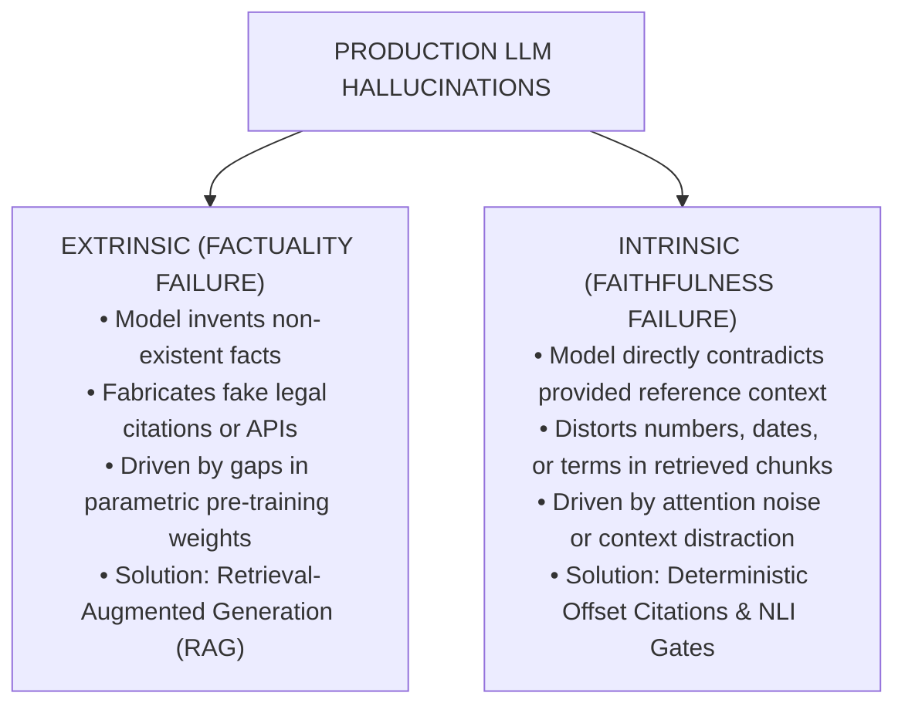
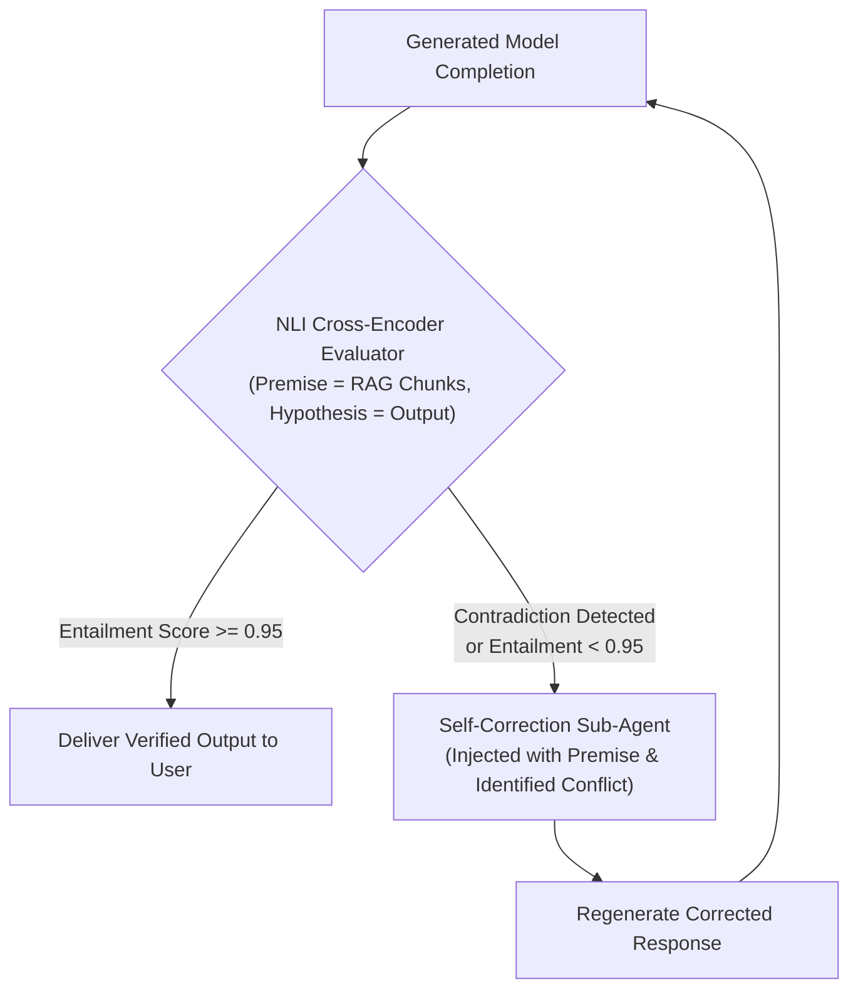
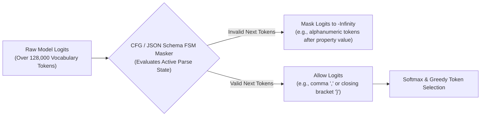

# Hallucination Mitigation: Token Offsets, NLI Entailment & Constrained Decoding

> **Tier:** 🟡 Engineering Depth | **Est. Time:** 50 min | **Prerequisites:** Lesson 01 (AI Threat Modeling), Phase 01 (Structured Outputs), Phase 02 (RAG Chunking)
>
> **Core Concept:** Hallucinations in production AI systems are not random creative anomalies; they are verifiable failures of faithfulness or factuality. Mitigating hallucinations requires deterministic character-offset citations, Natural Language Inference (NLI) verification loops, and schema-constrained decoding.

---

## 1. The Systems Problem: When Probabilities Masquerade as Truth

Large Language Models (LLMs) are statistical next-token predictors, not knowledge retrieval engines. They generate text by sampling from a probability distribution over a vocabulary:

```text
P(token_t | token_1, token_2, ..., token_{t-1})
```

Because the model selects tokens based on mathematical likelihood rather than verified real-world truth, it will confidently generate plausible-sounding falsehoods:
* In 2023, lawyers submitted an official court brief citing non-existent judicial decisions (*Mata v. Avianca*), generated entirely by an ungrounded LLM.
* In 2024, a Canadian airline's chatbot hallucinated a bereavement fare refund policy that contradicted official tariffs; a civil tribunal ruled the airline was legally bound by the chatbot's generated text.

In enterprise software, an ungrounded model output is not merely a bug; it is a **legal liability, an accounting vulnerability, and a brand breach**. Engineering reliable AI requires transitioning from trusting probabilistic model output to enforcing **deterministic verification gates**.

---

## 2. Beginner AI Scaffolding: Core Grounding Concepts

To analyze hallucination mitigation systematically, let us define the core terminology and intuitive mental models:

| AI Term (Abbreviated) | Full Name | Beginner AI Mental Model | Systems Engineering Parallel |
|---|---|---|---|
| **Hallucination** | Non-Factual Model Generation | When an AI model outputs information that sounds confident and grammatically correct but is factually false or contradicts the source data. | A cache returning corrupted or synthesized mock data instead of authentic database records. |
| **Intrinsic Hallucination** | Faithfulness Violation | When the model's summary directly contradicts the specific document provided in its prompt context (e.g., text says "$10M", model writes "$50M"). | A failed data transformation or serialization bug altering field values during ETL. |
| **Extrinsic Hallucination** | Factuality / Grounding Gap | When the model invents real-world facts that cannot be verified by either the prompt context or real-world source truth. | Querying an unindexed database partition and synthesizing placeholder values. |
| **NLI** | Natural Language Inference | A specialized classification model that compares two texts: a **Premise** (source context) and a **Hypothesis** (AI output), scoring whether the output logically follows (`Entailment`), contradicts (`Contradiction`), or is unrelated (`Neutral`). | An automated contract testing assertion comparing an API response against its schema preconditions. |
| **Cross-Encoder** | Full Attention Text Comparator | A neural network that processes two texts simultaneously, allowing every token in the document to attend to every token in the generated sentence to check for consistency. | A deep recursive diff utility comparing two data structures node by node. |
| **CFG / Constrained Decoding** | Context-Free Grammar Token Masking | Restricting the model's next-token selection at inference time so that it can only emit tokens that satisfy an exact JSON Schema or regex pattern. | A compiler or serializer rejecting invalid byte sequences at write time. |

---

## 3. Extrinsic vs. Intrinsic Hallucinations

Hallucinations in production LLM systems fall into two distinct engineering categories:



### Step-by-Step Diagram Walkthrough:
1. **Extrinsic Hallucinations (Factuality)**: The model produces assertions that cannot be validated against external ground-truth reality. For example: claiming that *"PostgreSQL was created in 2014 by Microsoft"*. This occurs because the model's static training weights lack the required data. The architectural defense is **Retrieval-Augmented Generation (RAG)**, feeding verified documents into the context window.
2. **Intrinsic Hallucinations (Faithfulness)**: The model produces assertions that contradict the reference context explicitly provided in the prompt. For example: the retrieved chunk states *"Q3 operating expenses were $12.4M"*, but the model summarizes *"Q3 operating expenses reached $42.1M"*. This occurs due to attention distraction over long contexts. The architectural defense is **Deterministic Offset Verification** and **Natural Language Inference (NLI)** checking.

---

## 4. Citation Grounding via Character and Token Offsets

To eliminate intrinsic hallucinations in enterprise applications (such as legal contract review, medical records, or compliance audits), systems must abandon free-form narrative summaries in favor of **character-level citation anchors**.

Instead of allowing the model to summarize freely, require the model to return structured output matching a schema that binds every claim to an exact, verifiable substring in the source document:

```json
{
  "statement": "The maximum liability under the Master Services Agreement is capped at two times the annual contract value.",
  "citation": {
    "document_id": "doc_contract_enterprise_acme_2024",
    "page_number": 42,
    "char_start": 1420,
    "char_end": 1515,
    "verbatim_quote": "In no event shall either party's aggregate liability exceed two times (2x) the total annual contract value paid."
  }
}
```

### Deterministic Substring Assertion Gate
Before any generated claim is returned to the user or committed to a database, a deterministic validator verifies the citation offset directly against the original text:

```text
document.text[char_start : char_end] == verbatim_quote
```

If the substring does not match the retrieved document verbatim, the output is flagged as an intrinsic hallucination and rejected before reaching the client:

```python
# PRODUCTION VERIFIER: Deterministic Character Offset Grounding
from pydantic import BaseModel, Field
from typing import List, Optional

class DocumentCitation(BaseModel):
    document_id: str
    char_start: int = Field(ge=0)
    char_end: int = Field(gt=0)
    verbatim_quote: str

class GroundedClaim(BaseModel):
    claim_text: str
    citation: DocumentCitation

def verify_citation_grounding(claim: GroundedClaim, source_documents: dict[str, str]) -> bool:
    """
    Deterministically asserts that the claimed quote matches the exact character range
    in the authentic source document.
    """
    doc_id = claim.citation.document_id
    if doc_id not in source_documents:
        return False

    raw_text = source_documents[doc_id]
    start = claim.citation.char_start
    end = claim.citation.char_end

    # Extract exact substring from authentic memory
    actual_substring = raw_text[start:end]

    # Invariant assertion: exact match prevents fabricated quotes
    if actual_substring != claim.citation.verbatim_quote:
        return False

    return True
```

---

## 5. Active Verification Loops: Natural Language Inference (NLI) & Critic Agents

In situations where answers require synthesis rather than direct quotation, enterprise pipelines route generated text through an **Active Verification Loop**:



### Step-by-Step Diagram Walkthrough:
1. **Initial Completion**: The generator LLM produces an answer based on retrieved enterprise documents.
2. **NLI Cross-Encoder Scoring**: Before streaming to the client, an NLI cross-encoder model (such as `deberta-v3-large` fine-tuned on MNLI) compares the generated sentences against the retrieved premise text.
3. **High-Confidence Entailment**: If all statements achieve an entailment score ≥ 0.95, the output is considered fully grounded and delivered to the user.
4. **Contradiction Detection**: If any sentence yields a `Contradiction` or low `Neutral` score against the source premise, the pipeline intercepts the response.
5. **Self-Correction Sub-Agent**: A specialized critic agent is invoked, receiving the exact conflicting premise and the contradictory claim with instructions to remove or reconcile the discrepancy.
6. **Re-Verification**: The regenerated response re-enters the verification loop. If it fails a second time, the system falls back to a safe refusal: *"The provided documentation does not contain sufficient verified facts to answer this inquiry."*

### How NLI Cross-Encoders Work in Practice
Natural Language Inference evaluates logical relationships between two sentences:
* **Premise (P)**: The authoritative retrieved document chunk.
* **Hypothesis (H)**: A single sentence generated by the model.

The NLI model outputs three normalized probabilities:
```text
P(Entailment) + P(Neutral) + P(Contradiction) = 1.0
```

```python
# PRODUCTION DEFENSE: NLI Entailment Verification Gate
from typing import List, Tuple
from transformers import pipeline

class FaithfulnessVerifier:
    def __init__(self, model_name: str = "cross-encoder/nli-deberta-v3-large"):
        # Initialize fast NLI cross-encoder
        self.nli_classifier = pipeline("text-classification", model=model_name, top_k=None)

    def verify_sentence(self, premise: str, hypothesis: str) -> Tuple[bool, dict]:
        """
        Evaluates whether a generated hypothesis logically follows from the reference premise.
        """
        # Format input for cross-encoder
        input_payload = f"{premise} [SEP] {hypothesis}"
        results = self.nli_classifier(input_payload)[0]

        # Extract normalized scores
        scores = {item["label"].lower(): item["score"] for item in results}
        
        # Invariant: Must achieve high entailment and near-zero contradiction
        is_faithful = (scores.get("entailment", 0.0) >= 0.90) and (scores.get("contradiction", 0.0) <= 0.05)
        
        return is_faithful, scores
```

---

## 6. Constrained Decoding: Grammar Guidance & Temperature Zero

For structured data extraction (JSON, SQL, code), probabilistic token generation should be constrained at the decoding stage.

### 1. Greedy Decoding (Temperature = 0.0)
Temperature controls the entropy of the softmax distribution during token sampling:
```text
P(token_i) = exp(logit_i / T) / sum_j exp(logit_j / T)
```
When `Temperature = 0.0` (greedy decoding), the model deterministically selects:
```text
argmax P(token_t | tokens_<t)
```
For identical inputs and identical prompt states, greedy decoding eliminates random sampling jitter, maximizing repeatability in production pipelines.

### 2. Grammar-Based Constrained Decoding (Outlines, XGrammar, Guidance)
Even with `Temperature = 0.0`, an unconstrained LLM can generate invalid JSON syntax, missing commas, or hallucinated property keys.

**Grammar-based constrained decoding** eliminates this failure mode at the transformer logit layer using a **Context-Free Grammar (CFG)** or a compiled Finite State Machine (FSM):



### Step-by-Step Diagram Walkthrough:
1. **Raw Logit Computation**: At each token generation step, the foundation model calculates raw logit scores across its entire vocabulary (e.g., 128,000 tokens).
2. **FSM State Evaluation**: The grammar engine tracks the current parser state. For example, if the model just generated `"age": 35`, the only syntactically legal next tokens according to JSON grammar are a comma `,` or a closing curly brace `}`.
3. **Logit Masking**: The logits of all illegal tokens (letters, quotes, invalid symbols) are set to negative infinity (`-inf`).
4. **Guaranteed Syntax**: When the softmax function is applied, the probability of selecting an invalid token is mathematically zero. This guarantees **100% syntactically valid JSON**, eliminating schema-related hallucinations before tokens are written.

---

## 7. Comparative Analysis: Grounding Techniques

| Verification Technique | Latency Impact | Financial Cost | Hallucination Reduction | Best Production Role |
|---|---|---|---|---|
| **Greedy Decoding (Temp=0)** | 0 ms | Zero | Moderate (Removes random sampling noise) | Baseline default for all enterprise workflows. |
| **Constrained Decoding (CFG / FSM)** | Negligible (<5 ms) | Zero | High for structure (100% valid schema and keys) | All tool calling, JSON extraction, and API integrations. |
| **Character-Offset Citations** | Low (5–15 ms) | Zero | Very High for quotes (Guarantees authentic text) | Legal contract review, compliance documents, medical records. |
| **NLI Cross-Encoder Verification** | Moderate (50–200 ms) | Local GPU Compute | Very High for synthesized claims | Critical factual summarization and customer-facing RAG. |
| **Self-Correction Critic Agent** | High (500–1500 ms) | 2x Token Cost | High (Iteratively corrects detected conflicts) | Offline asynchronous pipelines and high-value reports. |

---

## 8. Production Failure Modes & Anti-Patterns

### Anti-Pattern: Unverified General Summaries in High-Stakes Domains

#### The Flawed Approach
```python
# DANGEROUS ANTI-PATTERN: Streaming unverified model completions directly to client
def answer_legal_query(user_query: str, contract_chunks: str) -> str:
    prompt = f"Context: {contract_chunks}\nQuestion: {user_query}\nProvide summary:"
    # Directly streaming output to client without grounding verification
    return llm.generate(prompt)
```

#### Why It Fails
In long contracts, models easily transpose liability caps, mix up party definitions, or omit critical condition clauses. If the output is delivered directly to the user without citation verification, the enterprise becomes liable for hallucinatory commitments.

#### The Architectural Fix
1. Enforce structured Pydantic schemas requiring `char_start` and `char_end` citations for every assertion.
2. Run the deterministic substring verification check before returning the response.
3. If verification fails, fall back to presenting the raw source excerpt directly to the user with a notice that automated synthesis could not be grounded.

---

## 9. Architectural Takeaways

1. **Hallucinations Must Be Categorized to Be Solved**: Use RAG to solve extrinsic factuality gaps; use character-offset citations and NLI cross-encoders to solve intrinsic faithfulness errors.
2. **Constrained Decoding is Non-Negotiable for Data Pipelines**: Never use post-hoc regex to fix broken JSON. Enforce schema compliance directly at the logit layer using grammar-guided FSMs.
3. **Verification Loops Protect the Perimeter**: Running an NLI entailment cross-encoder between the LLM and the client provides an automated, deterministic release gate for factual text.

---

## 🧭 Navigation

| Previous | Phase Hub | Next | Capstone Lab |
|---|---|---|---|
| [← Lesson 02: Prompt Injection Defenses](./02-prompt-injection-defenses-and-jailbreaks.md) | [Phase 05 Hub: Security & Guardrails](./README.md) | [Lesson 04: Guardrail Architectures & Pipelines →](./04-guardrail-architectures-and-defensive-pipelines.md) | [Capstone: Secure Agent Gateway](./labs/capstone-security-guardrails.md) |
