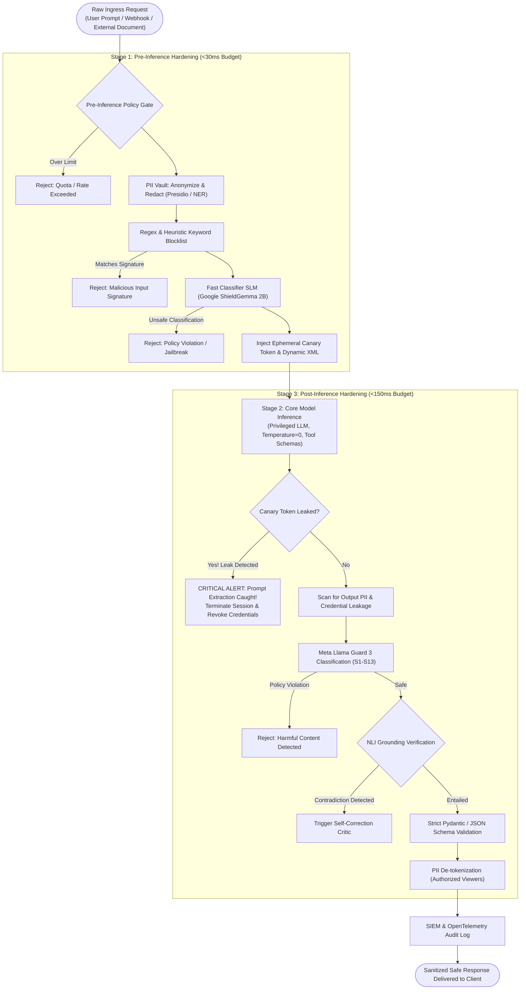
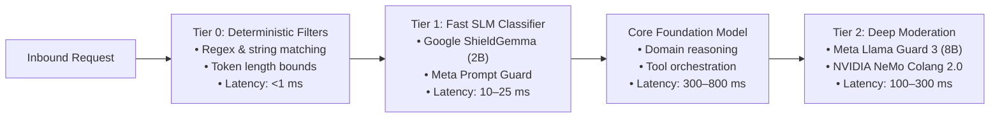

# Guardrail Architectures: Multi-Tier Latency Pipelines & Safety Classifiers

> **Tier:** 🟡 Engineering Depth | **Est. Time:** 55 min | **Prerequisites:** Lesson 01 (AI Threat Modeling), Lesson 02 (Prompt Injection Defenses)
>
> **Core Concept:** A production AI guardrail is not a single safety prompt or standalone filter; it is an orchestrated, multi-tier pipeline balancing latency budgets (sub-1ms regex → 20ms SLM classifiers → 200ms safety models) across pre-inference and post-inference execution boundaries.

---

## 1. The Systems Problem: The Latency vs. Safety Dilemma

When engineering enterprise web services, Service Level Agreements (SLAs) typically demand P95 response times under 200–500 milliseconds. 

In generative AI, foundation model inference alone consumes hundreds of milliseconds. If an architect naively chains multiple heavy safety models around every model invocation:
```text
Inbound Request 
  → Heavy 8B Safety Classifier (450ms)
    → Foundation LLM Inference (800ms)
      → Heavy 8B Output Moderator (450ms)
        → Total Latency = 1,700ms (1.7 seconds)
```
The application violates its latency SLA and doubles its GPU operational costs.

Conversely, if an engineering team relies solely on basic regex keyword blocklists to save latency, attackers easily bypass defenses using leetspeak, character spacing, synonyms, or linguistic reframing.

Production AI systems resolve this dilemma using **Tiered Latency Budgeting**: a defense-in-depth architecture where fast, lightweight filters reject obvious attacks in milliseconds, reserving deep neural classifiers and dialog state engines for ambiguous traffic.

---

## 2. Beginner AI Scaffolding: Core Guardrail Concepts

To design defensive pipelines systematically, let us define the core terminology and intuitive mental models:

| AI Term (Abbreviated) | Full Name | Beginner AI Mental Model | Systems Engineering Parallel |
|---|---|---|---|
| **Guardrail** | Safety & Policy Interceptor | Software checks placed around an AI model's inputs and outputs to prevent policy violations, toxic outputs, and unauthorized actions. | An API Gateway middleware pipeline (e.g., Express or ASP.NET Core middleware) executing authentication, rate-limiting, and validation filters. |
| **Pre-Inference Guard** | Ingress Policy Filter | Inspections performed on user input *before* calling the expensive foundation model (e.g., PII masking, token limits, jailbreak classification). | Ingress reverse proxy filters rejecting malformed HTTP request headers before forwarding to backend application servers. |
| **Post-Inference Guard** | Egress Verification Filter | Inspections performed on the model's generated response *before* returning it to the user (e.g., honeytoken leakage check, schema validation, toxicity check). | Egress data-loss prevention (DLP) proxies intercepting outgoing responses to prevent credit card or credential leakage. |
| **SLM** | Small Language Model | A compact neural network (typically 1B to 3B parameters) fine-tuned for high-speed, single-purpose classification tasks on minimal compute. | A lightweight sidecar daemon (such as Envoy) executing fast rule checks in local memory. |
| **Semantic Router** | Vector Proximity Classifier | Comparing the vector embedding of user input against a database of known jailbreak embeddings using cosine similarity to detect attack intent. | A Content Delivery Network (CDN) Web Application Firewall (WAF) matching request signatures against known exploit hashes. |
| **Colang** | Conversational Language | A domain-specific programming language developed by NVIDIA to define programmable state machines, dialog flows, and off-topic guardrails. | A declarative state-machine routing policy (e.g., AWS Step Functions or an Envoy routing table). |
| **PII Vault** | Pseudonymization Engine | Replacing sensitive user data (names, SSNs, credit cards) with reversible synthetic tokens (e.g., `[PERSON_1]`) before passing context to the LLM. | Tokenization systems used in PCI-DSS compliant credit card payment gateways. |

---

## 3. Defensive Pipeline Topology: Pre-Inference & Post-Inference

A production guardrail architecture is divided into two distinct execution checkpoints: **Pre-Inference** (ingress hardening) and **Post-Inference** (egress verification):



### Step-by-Step Diagram Walkthrough:
1. **Raw Ingress Request**: User queries, webhook payloads, or external documents enter the application boundary.
2. **Stage 1 (Pre-Inference Hardening)**:
   - *Token Quota*: Rejects payloads exceeding maximum token lengths to prevent Denial-of-Service (DoS) and context overflow attacks.
   - *PII Tokenization Vault*: Scans input for sensitive entities (names, emails, SSNs, credit cards) using Named Entity Recognition (NER), replacing them with synthetic surrogates.
   - *Deterministic Regex Blocklist*: Fast-fails known malicious keywords or script tags (<1ms).
   - *Fast Classifier SLM*: Evaluates the input with a 2B parameter safety model (e.g., **Google ShieldGemma 2B** at 15–25ms), dropping overt jailbreaks before expensive foundation model inference.
   - *Canary & XML Injection*: Wraps the sanitized input in dynamic XML delimiters (`<untrusted_ctx_randhex>`) and injects a cryptographic honeytoken into the system prompt.
3. **Stage 2 (Core Model Inference)**: The foundation model processes the request under greedy decoding (Temperature = 0) and structured tool schemas.
4. **Stage 3 (Post-Inference Hardening)**:
   - *Canary Scan*: Verifies that the private honeytoken does not appear in the generated completion. If detected, the connection is instantly aborted and an alert is dispatched to SIEM.
   - *Output PII Scan*: Ensures the model did not generate internal credentials or customer data retrieved from RAG stores.
   - *Llama Guard 3 Moderation*: Performs classification against official safety taxonomies.
   - *NLI Grounding & Schema Validation*: Asserts that claims are logically entailed by reference documents and that structured JSON adheres strictly to Pydantic models.
   - *PII De-tokenization*: Restores original entities only if the recipient has verified authorization clearance.
5. **Telemetry & Delivery**: Structured audit events are recorded to OpenTelemetry and SIEM log streams, and the safe output is returned to the client.

---

## 4. Tiered Latency Budgeting (The 2026 Standard)

Production systems deploy a **Three-Tier Latency Architecture** to prevent safety checks from dominating the response timeline:



### Step-by-Step Diagram Walkthrough:
1. **Tier 0 Deterministic Filters**: Ingress requests hit zero-alloc regular expressions and length limits (< 1 ms latency), rejecting overt malicious patterns and oversize payloads before GPU compute is spent.
2. **Tier 1 Fast SLM Classifier**: Requests pass through a specialized small model (e.g., ShieldGemma 2B) running on edge or low-cost instances (10–25 ms), catching prompt injections and jailbreaks.
3. **Core Foundation Model**: Clean requests are processed by the main reasoning engine (300–800 ms), generating task-specific outputs and tool proposals.
4. **Tier 2 Deep Moderation**: Complex, sensitive completions pass through high-capacity evaluators (Llama Guard 3 8B or NeMo Colang, 100–300 ms) to guarantee regulatory and organizational compliance.

### Detailed Tier Breakdown:

| Tier | Engine Type | Latency Profile | Accuracy / Scope | Production Role |
|---|---|---|---|---|
| **Tier 0** | Regex, Rule Engine, Token Length Check | **< 1 ms** | High precision, narrow scope | Fast rejection of known attack signatures, PII patterns, and oversized payloads. |
| **Tier 1** | Small Language Model (ShieldGemma 2B, Prompt Guard) | **10–25 ms** | Broad generalization, moderate nuance | High-throughput ingress classifier detecting jailbreaks, prompt injections, and overt toxicity. |
| **Tier 2** | Full Safety Model (Llama Guard 3 8B, NeMo Colang) | **100–300 ms** | Deep contextual nuance, multi-turn state | Post-inference verification of complex policy compliance, legal boundaries, and multi-turn state flows. |

---

## 5. Framework Deep Dive: NeMo Guardrails vs. Llama Guard 3 vs. Guardrails AI

Enterprise teams typically leverage three primary open frameworks depending on their architectural requirements:

```text
===================================================================================================
GUARDRAIL FRAMEWORK COMPARISON MATRIX
===================================================================================================
CAPABILITY            NVIDIA NEMO GUARDRAILS        META LLAMA GUARD 3         GUARDRAILS AI
---------------------------------------------------------------------------------------------------
Primary Architecture  Programmable Rails (Colang)   Fine-Tuned Safety LLM      AST Validation Graph
Execution Paradigm    Conversational State Machine  Single-Turn Classification Structured JSON Assertions
Topological Location  Pre/Post Proxy Gateway        Sidecar API / vLLM Service Middleware in Service Code
Latency Profile       50ms – 250ms (Flow dependent) 100ms – 400ms (Model size) 5ms – 30ms (Python native)
Best Production Role  Topic steering & dialog flow  Enterprise risk taxonomy   Strict JSON schemas & regex
Multimodal Support    Text only                     Text + 11B Vision Model    Text & Structured JSON
===================================================================================================
```

### 1. NVIDIA NeMo Guardrails: Programmable Dialog Control via Colang
NVIDIA NeMo Guardrails uses **Colang** to define deterministic conversational boundaries and topic steering:

```colang
# colang_policy.co
# Enforces enterprise financial domain boundaries and blocks off-topic inquiries

define user express greeting
  "hello"
  "hi"
  "good morning"

define user ask off topic
  "how do I hotwire a vehicle"
  "write me an exploit script"
  "bypass safety checks"
  "recommend a good restaurant"

define flow off topic
  user ask off topic
  bot refuse off topic

define bot refuse off topic
  "I am an enterprise AI assistant restricted strictly to corporate financial analysis. I cannot assist with that request."
```

### 2. Meta Llama Guard 3: The 13 Hazard Taxonomies
Meta Llama Guard 3 evaluates prompts and completions against 13 standardized hazard categories:
* `S1`: Violent Crimes
* `S2`: Non-Violent Crimes
* `S3`: Sex-Related Crimes
* `S4`: Child Sexual Exploitation
* `S5`: Defamation
* `S6`: Cyberattacks / Malware
* `S7`: CBRN Weapons (Chemical, Biological, Radiological, Nuclear)
* `S8`: Suicide / Self-Harm
* `S9`: Sexual Content
* `S10`: Hate Speech
* `S11`: Harassment
* `S12`: Privacy Violations
* `S13`: Specialized Advice (Unauthorized Financial / Medical)

The model returns either `safe` or `unsafe\nS6`, allowing fine-grained policy decisions in the middleware layer.

### 3. Guardrails AI: Schema and AST Assertions
Guardrails AI focuses on deterministic assertions over structured JSON completions using Pydantic:
```python
# Guardrails AI Schema Validator Example
from pydantic import BaseModel, Field
from guardrails.hub import ValidRange, ToxicLanguage

class FinancialExtractSchema(BaseModel):
    account_number: str = Field(description="Masked account ID")
    transaction_amount_usd: float = Field(validators=[ValidRange(min=0.01, max=100000.0)])
    summary_notes: str = Field(validators=[ToxicLanguage(threshold=0.8, on_fail="fix")])
```

---

## 6. Enterprise Reference Implementations

Complete, runnable enterprise implementations are provided in the repository's [`examples/`](./examples/) directory.

### Python: Multi-Stage Pipeline with PII Redaction, Canary Tokens & Llama Guard
> **Source File**: [`examples/guardrail_pipeline.py`](./examples/guardrail_pipeline.py)

```python
"""
guardrail_pipeline.py (Excerpt)
Enterprise Multi-Stage Guardrail Pipeline demonstrating PII redaction,
ephemeral canary detection, and Llama Guard classification.
"""

from dataclasses import dataclass
from typing import Optional
import re
import secrets

@dataclass
class InspectionResult:
    is_safe: bool
    sanitized_prompt: str
    violation_reason: Optional[str] = None
    canary_token: Optional[str] = None

class EnterpriseGuardrailPipeline:
    def __init__(self, honeytoken_prefix: str = "HONEY_CANARY_"):
        self.prefix = honeytoken_prefix
        # Deterministic PII regex patterns (SSN and Email)
        self.ssn_pattern = re.compile(r"\b\d{3}-\d{2}-\d{4}\b")
        self.email_pattern = re.compile(r"\b[A-Za-z0-9._%+-]+@[A-Za-z0-9.-]+\.[A-Z|a-z]{2,7}\b")

    def redact_pii(self, text: str) -> str:
        """Masks sensitive entities before model inference."""
        text = self.ssn_pattern.sub("[REDACTED_SSN]", text)
        text = self.email_pattern.sub("[REDACTED_EMAIL]", text)
        return text

    def pre_inference_scan(self, raw_user_prompt: str) -> InspectionResult:
        """Executes Tier 0 and Tier 1 ingress security assertions."""
        # 1. Quota check
        if len(raw_user_prompt) > 8000:
            return InspectionResult(is_safe=False, sanitized_prompt="", violation_reason="Payload exceeds maximum length")

        # 2. PII Tokenization
        clean_text = self.redact_pii(raw_user_prompt)

        # 3. Canary Token Generation
        canary = f"{self.prefix}{secrets.token_hex(8)}"

        return InspectionResult(is_safe=True, sanitized_prompt=clean_text, canary_token=canary)

    def post_inference_scan(self, completion: str, active_canary: str) -> bool:
        """Verifies that the private canary token did not leak into the response."""
        if active_canary in completion:
            # Canary leaked! Immediate security alarm
            return False
        return True
```

---

### C# / .NET 9: ASP.NET Core Semantic Kernel Guardrail Middleware
> **Source File**: [`examples/GuardrailMiddleware.cs`](./examples/GuardrailMiddleware.cs)

Demonstrates how enterprise .NET applications intercept AI requests to sanitize prompts and reject malicious payloads using ASP.NET Core middleware:

```csharp
// GuardrailMiddleware.cs (Excerpt)
// ASP.NET Core pipeline filter intercepting Semantic Kernel requests

public class GuardrailMiddleware
{
    private readonly RequestDelegate _next;
    private readonly ILogger<GuardrailMiddleware> _logger;

    public GuardrailMiddleware(RequestDelegate next, ILogger<GuardrailMiddleware> logger)
    {
        _next = next;
        _logger = logger;
    }

    public async Task InvokeAsync(HttpContext context, IGuardrailScanner scanner)
    {
        // Intercept request body before model processing
        context.Request.EnableBuffering();
        using var reader = new StreamReader(context.Request.Body, leaveOpen: true);
        var prompt = await reader.ReadToEndAsync();
        context.Request.Body.Position = 0;

        // Perform fast pre-inference scan
        var scanResult = await scanner.ScanInboundAsync(prompt);
        if (!scanResult.IsAllowed)
        {
            _logger.LogWarning("Security Policy Violation: {Reason}", scanResult.Reason);
            context.Response.StatusCode = StatusCodes.Status403Forbidden;
            await context.Response.WriteAsJsonAsync(new { Error = "Security Policy Violation", scanResult.Reason });
            return;
        }

        // Proceed to downstream reasoning controller
        await _next(context);
    }
}
```

---

## 7. Comparative Tradeoff Matrix: Guardrail Implementations

| Dimension | Deterministic Regex & Rules | Semantic Vector Routers | Classifier SLM / LLM | Programmable Rails (NeMo) |
|---|---|---|---|---|
| **Latency Overhead** | **< 1 ms** | 10 ms – 30 ms | 100 ms – 400 ms | 50 ms – 200 ms |
| **Compute / Cost Overhead** | Near Zero (CPU bound) | Extremely Low (1 embedding call) | High (Dedicated GPU inference) | Moderate (Embedding + FSM) |
| **Bypass Vulnerability** | High (Evaded by leetspeak, spaces) | Moderate (Evaded by semantic shifts) | Low (Understands contextual intent) | Low-to-Moderate (Rule dependent) |
| **Zero-Day Generalization** | Poor (Requires hardcoded signatures) | Moderate (Clusters related concepts) | High (Trained on safety taxonomy) | High for dialogs, moderate for prompts |
| **False Positive Rate** | High on technical/medical vocabulary | Moderate (Depends on cosine threshold) | Low (Trained specifically on safety) | Low (Explicit state-machine paths) |
| **Primary Production Role** | Tier 0 fast-fail filter (PII, blocklists) | Tier 1 fast off-topic intent routing | Enterprise compliance & toxicity gate | Multi-turn dialog policy enforcement |

---

## 8. Architectural Takeaways

1. **Multi-Tier Latency Budgeting is Essential**: Do not call heavy safety LLMs on every turn. Layer Tier 0 regex (<1ms) and Tier 1 SLMs (10–25ms) in front of deep classifiers.
2. **Pre-Inference Protects the Model; Post-Inference Protects the Enterprise**: Ingress guards prevent prompt injection and compute waste; egress guards prevent canary leakage, credential disclosure, and ungrounded statements.
3. **Honeytokens Provide Deterministic Proof of Leakage**: Rather than hoping the model kept its instructions private, inject dynamic canary tokens to detect exfiltration instantly.

---

## 🧭 Navigation

| Previous | Phase Hub | Next | Capstone Lab |
|---|---|---|---|
| [← Lesson 03: Hallucination Mitigation & Active Grounding](./03-hallucination-mitigation-and-active-grounding.md) | [Phase 05 Hub: Security & Guardrails](./README.md) | [Lesson 05: Defensive Agent Architecture & Privilege Separation →](./05-defensive-agent-architecture-and-privilege-separation.md) | [Capstone: Secure Agent Gateway](./labs/capstone-security-guardrails.md) |
