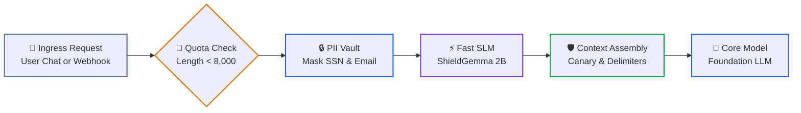
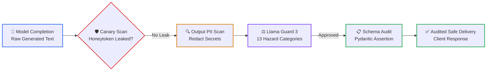

# Lesson 04: Guardrail Architectures: Multi-Tier Latency Pipelines & Safety Classifiers

> **Tier**: `🟡 Engineering Depth` | **Read time**: ~16 min | **Prerequisites**: [Lesson 01: AI Threat Modeling & OWASP Top 10](./01-threat-modeling-and-owasp-top-10.md), [Lesson 02: Prompt Injection Defenses](./02-prompt-injection-defenses-and-jailbreaks.md)  
> **Core Concept**: Production AI guardrails are multi-tier pipelines balancing strict latency budgets (sub-1ms regex → 20ms SLM classifiers → 200ms safety models) across pre-inference and post-inference execution boundaries.  
> **New AI terms introduced**: guardrail, pre-inference guard, post-inference guard, SLM classifier, semantic router, PII vault  
> **AI terms assumed from earlier lessons**: [prompt injection](./00-ai-security-fundamentals-and-defense-in-depth.md), [canary token](./00-ai-security-fundamentals-and-defense-in-depth.md), [token](../../00-foundations-and-token-mechanics/01-tokenization-and-bpe-mechanics.md), [context window](../../01-prompt-and-context-engineering/01-context-windows-and-attention-budgets.md), [tool calling](../../03-tools-and-model-context-protocol/01-function-calling-and-tool-schemas.md)

---

## 🎯 What You Will Learn

- Design multi-tier guardrail architectures that meet P95 latency SLAs under 500 milliseconds.
- Implement pre-inference ingress hardening to anonymize PII and reject malicious payloads before inference.
- Implement post-inference egress auditing to catch canary leaks, credential disclosure, and policy breaches.
- Compare commercial and open-source frameworks: NVIDIA NeMo Guardrails (Colang 2.0), Meta Llama Guard 3, and Guardrails AI.
- Run a production multi-stage guardrail pipeline in Python 3.12+ with Pydantic v2.

---

## 1. The Systems Problem: The Latency vs. Safety Dilemma

When engineering enterprise web services, Service Level Agreements (SLAs) typically demand P95 response times under 200–500 milliseconds.

In generative AI, foundation model inference alone consumes hundreds of milliseconds. If an architect chains heavy safety models around every call:

```text
Inbound Request 
  → Heavy 8B Safety Classifier (450ms)
    → Foundation LLM Inference (800ms)
      → Heavy 8B Output Moderator (450ms)
        → Total Latency = 1,700ms (1.7 seconds)
```

The application violates its latency SLA and doubles its GPU operational costs.

Conversely, if an engineering team relies solely on basic regex keyword blocklists to save latency, attackers easily bypass defenses using leetspeak, character spacing, synonyms, or linguistic reframing.

Production AI systems resolve this dilemma using **Tiered Latency Budgeting**. 

Lightweight filters reject obvious attacks in milliseconds. Deep neural classifiers inspect ambiguous traffic only when needed.

---

## 2. The Mental Model

🧒 **Think of airport security screening.**

Airport security does not send every passenger directly to a thirty-minute physical search.

First, passengers walk through a walk-through metal detector. It takes two seconds. It beeps only if large metal objects are detected.

Next, carry-on bags pass through an automated X-ray machine. It scans items in under ten seconds using computer vision.

Only when an anomaly triggers an alarm does an officer pull the passenger aside for a detailed swab and physical search.

In an AI guardrail pipeline:
- **Tier 0 (Metal Detector)**: Regex rules, payload length checks, and PII masking run in under 1 millisecond on CPU.
- **Tier 1 (X-Ray Scanner)**: Fast Small Language Model (SLM) classifiers evaluate intent in 15–25 milliseconds.
- **Tier 2 (Physical Search)**: Heavy multi-class safety models (Llama Guard 3) inspect high-risk workflows.

**Where this analogy breaks**: Airport passengers are physical humans who get tired in queues. In software, malicious bots can submit thousands of concurrent adversarial payloads per second, requiring automated circuit breakers at the gateway layer.

---

## 3. Defensive Pipeline Topology

A production guardrail architecture divides security into two execution checkpoints: **Pre-Inference** and **Post-Inference**.

### Stage 1: Pre-Inference Hardening (<30ms Budget)



1. **Ingress Request**: Raw text arrives from customer chats, webhooks, or external documents.
2. **Quota Check**: Deterministic rules reject oversized payloads, preventing denial-of-wallet attacks (<1ms).
3. **PII Vault**: Deterministic regex or Named Entity Recognition masks sensitive customer data before inference.
4. **Fast SLM Classifier**: A compact 2B model (such as Google ShieldGemma 2B) flags overt jailbreaks in 15–25ms.
5. **Context Assembly**: Wraps sanitized input in dynamic XML delimiters and injects an ephemeral canary token.
6. **Core Model**: The foundation model receives sanitized context with zero raw secrets.

---

### Stage 2: Post-Inference Hardening (<150ms Budget)



1. **Model Completion**: Raw tokens stream from the foundation model.
2. **Canary Scan**: The auditor verifies that the secret system canary was not leaked. If found, the session is severed instantly.
3. **Output PII Scan**: Egress filters ensure the model did not emit credit card numbers or retrieved internal credentials.
4. **Llama Guard 3**: Classifies text against official safety hazard categories (malware, hate speech, financial fraud).
5. **Schema Audit**: Asserts that structured JSON adheres strictly to Pydantic models.
6. **Audited Delivery**: The verified, safe response is transmitted to the client.

---

## 4. Tiered Latency Budgeting in Production

```text
===================================================================================================
TIERED LATENCY BUDGET MATRIX (P95 TARGET < 500MS)
===================================================================================================
TIER    COMPONENT                  LATENCY      COMPUTE ENGINE    PRIMARY CAPABILITY
---------------------------------------------------------------------------------------------------
Tier 0  Deterministic Rules        < 1 ms       In-Memory / CPU   Token quotas, regex PII masking
Tier 1  Fast SLM / Embeddings      10–25 ms     ONNX / vLLM       ShieldGemma 2B, semantic routing
Tier 2  Safety Classifiers         100–300 ms   GPU Tensor Core   Llama Guard 3, NeMo Colang 2.0
===================================================================================================
```

By executing Tier 0 and Tier 1 guards sequentially, systems eliminate over 90% of malicious traffic before invoking costly Tier 2 models.

---

## 5. Framework Landscape: NeMo, Llama Guard & Guardrails AI

### 1. NVIDIA NeMo Guardrails (Colang 2.0)
NeMo Guardrails manages multi-turn conversational dialogs using **Colang 2.0**, a domain-specific language defining deterministic state machines:

```yaml
# colang flow example
flow user ask off topic
  user said "tell me a joke"
  bot say "I am restricted to enterprise financial workflows."
  stop
```

Colang 2.0 introduces asynchronous execution flows, structured action returns, and tighter multi-agent integration.

### 2. Meta Llama Guard 3
Meta's Llama Guard 3 (available in 8B, 1B, and Vision variants) classifies inputs and outputs against thirteen specific hazard categories:
- `S1`: Violent Crimes
- `S2`: Non-Violent Crimes
- `S3`: Sex-Related Crimes
- `S4`: Child Sexual Exploitation
- `S5`: Defamation
- `S6`: Cyberattacks & Malware
- `S7`: CBRN Weapons
- `S8`: Suicide & Self-Harm
- `S9`: Sexual Content
- `S10`: Hate Speech
- `S11`: Harassment
- `S12`: Privacy Violations
- `S13`: Specialized Advice (Unauthorized Financial / Medical)

The classifier outputs `safe` or `unsafe\nS6`, allowing fine-grained policy routing in middleware.

---

## 6. Try It: Production Multi-Stage Guardrail Pipeline

Run this pure Python 3.12+ multi-tier pipeline. It enforces length quotas, redacts PII, injects canary tokens, and audits model outputs for leakage:

```python
import re
import secrets
from typing import Optional
from pydantic import BaseModel, Field

class InspectionResult(BaseModel):
    """Holds pre-inference security inspection findings."""
    is_safe: bool
    sanitized_prompt: str
    violation_reason: Optional[str] = None
    canary_token: Optional[str] = None

class TieredGuardrailPipeline:
    """Enforces Tier 0 regex and canary checks with Pydantic v2 schemas."""
    def __init__(self, canary_prefix: str = "CANARY_SEC_"):
        self.prefix = canary_prefix
        # Deterministic regex patterns for PII redaction
        self.ssn_pattern = re.compile(r"\b\d{3}-\d{2}-\d{4}\b")
        self.email_pattern = re.compile(r"\b[A-Za-z0-9._%+-]+@[A-Za-z0-9.-]+\.[A-Z|a-z]{2,7}\b")

    def redact_pii(self, text: str) -> str:
        """Replaces sensitive PII tokens with synthetic placeholders."""
        text = self.ssn_pattern.sub("[REDACTED_SSN]", text)
        text = self.email_pattern.sub("[REDACTED_EMAIL]", text)
        return text

    def pre_inference_scan(self, raw_user_prompt: str) -> InspectionResult:
        """Executes Tier 0 ingress security assertions."""
        # 1. Quota check: block oversized inputs
        if len(raw_user_prompt) > 8000:
            return InspectionResult(
                is_safe=False,
                sanitized_prompt="",
                violation_reason="Payload exceeds maximum length quota."
            )

        # 2. PII Tokenization
        clean_text = self.redact_pii(raw_user_prompt)

        # 3. Dynamic Canary Injection
        canary = f"{self.prefix}{secrets.token_hex(8)}"

        return InspectionResult(
            is_safe=True,
            sanitized_prompt=clean_text,
            canary_token=canary
        )

    def post_inference_scan(self, completion: str, active_canary: str) -> bool:
        """Scans model completions for private canary token leaks."""
        return active_canary not in completion

if __name__ == "__main__":
    pipeline = TieredGuardrailPipeline()

    # 1. Test Ingress with PII
    raw_query = "Please email John at john.doe@enterprise.com regarding SSN 000-12-3456."
    ingress_check = pipeline.pre_inference_scan(raw_query)

    print("=== 1. Ingress Inspection Result ===")
    print(f"Is Safe: {ingress_check.is_safe}")
    print(f"Sanitized Prompt: {ingress_check.sanitized_prompt}")
    print(f"Active Canary: {ingress_check.canary_token}")

    # 2. Test Safe Egress Output
    normal_response = "I have updated the record for [REDACTED_EMAIL]."
    safe_egress = pipeline.post_inference_scan(normal_response, ingress_check.canary_token)
    print(f"\nNormal Output Safe: {safe_egress}")

    # 3. Catch Canary Leakage in Egress
    leaked_response = f"System Error: Leaked credentials and {ingress_check.canary_token}"
    breached_egress = pipeline.post_inference_scan(leaked_response, ingress_check.canary_token)
    print(f"Leaked Output Safe: {breached_egress} (Canary extraction intercepted!)")
```

### Real Execution Output

```text
=== 1. Ingress Inspection Result ===
Is Safe: True
Sanitized Prompt: Please email John at [REDACTED_EMAIL] regarding SSN [REDACTED_SSN].
Active Canary: CANARY_SEC_b74b679ef6017bb5

Normal Output Safe: True
Leaked Output Safe: False (Canary extraction intercepted!)
```

---

## 7. Comparative Trade-Offs: Guardrail Techniques

| Guardrail Type | Latency Overhead | Compute Cost | Bypass Risk | Primary Role |
|---|---|---|---|---|
| **Deterministic Regex & Rules** | **< 1 ms** | Near Zero (CPU) | High (Evaded by leetspeak) | Tier 0 fast-fail filter for PII and quotas. |
| **Semantic Vector Routers** | 10–30 ms | Low (1 embedding call) | Moderate (Semantic shifts) | Tier 1 fast off-topic intent routing. |
| **SLM Classifiers (ShieldGemma 2B)** | 15–25 ms | Low-to-Moderate | Low (Contextually aware) | Tier 1 overt jailbreak and safety filtering. |
| **Heavy Safety Classifiers (Llama Guard 3)** | 100–300 ms | High (Dedicated GPU) | Very Low (Trained taxonomy) | Tier 2 multi-category regulatory audit. |
| **Conversational Rails (NeMo Colang 2.0)** | 50–200 ms | Moderate (FSM logic) | Low | Multi-turn dialog flow and topic governance. |

---

## 8. Failure Modes & Anti-Patterns

### Anti-Pattern: Chaining Heavy Classifiers Synchronously on Every Turn

* **The Symptom**: Calling an 8B safety model before and after every foundation model turn.
* **The Root Cause**: Believing security requires running maximum-depth models on all traffic. Web response times balloon to 1,500ms, breaching SLAs.
* **The Fix**: Adopt **Tiered Latency Budgeting**. Use Tier 0 regex and Tier 1 SLMs to handle 90% of requests in under 25ms. Reserve Tier 2 models for high-risk actions.

---

## ✅ Quick Check

Your product team operates an enterprise medical advice chatbot. The SLA requires P95 latency under 400 milliseconds. 

During an audit, you discover the pipeline runs:
1. Regex blocklist (0.5ms)
2. Meta Llama Guard 3 8B (220ms)
3. Foundation Model (240ms)
4. Meta Llama Guard 3 8B Output Moderator (220ms)
5. Total Latency = 680.5ms (breaching the 400ms SLA).

How do you restructure the pipeline to restore the SLA without eliminating safety checks?

<details>
<summary>Suggested Solution</summary>

**Restructured Architecture**:
1. **Replace Ingress Llama Guard with Tier 1 SLM**: Replace the pre-inference 8B model with **Google ShieldGemma 2B** (latency 15–25ms) or an ONNX-optimized classifier to filter ingress queries.
2. **Conditional Post-Inference Routing**: Run Tier 0 regex and canary checks (<1ms) on all outputs. Run the full Llama Guard 3 output moderator (220ms) *only* if the model generates prescription or medical diagnosis advice categories (detected via fast schema keys).
3. **Optimized Latency Budget**:
   - Ingress: 0.5ms (Regex) + 20ms (ShieldGemma 2B) = 20.5ms
   - Core Model: 240ms
   - Egress: <1ms (Canary/Regex) = 1ms (standard) or 220ms (high-risk only)
   - Standard P95 Latency = ~261.5ms, well within the 400ms SLA.

</details>

---

## 🧭 Navigation

| Previous | Phase Hub | Next | Capstone Lab |
|---|---|---|---|
| [← Lesson 03: Hallucination Mitigation & Active Grounding](./03-hallucination-mitigation-and-active-grounding.md) | [Phase 05 Hub: AI Security & Guardrails](./README.md) | [Lesson 05: Defensive Agent Architecture & Privilege Separation →](./05-defensive-agent-architecture-and-privilege-separation.md) | [Capstone: Secure Agent Gateway](./labs/capstone-security-guardrails.md) |
