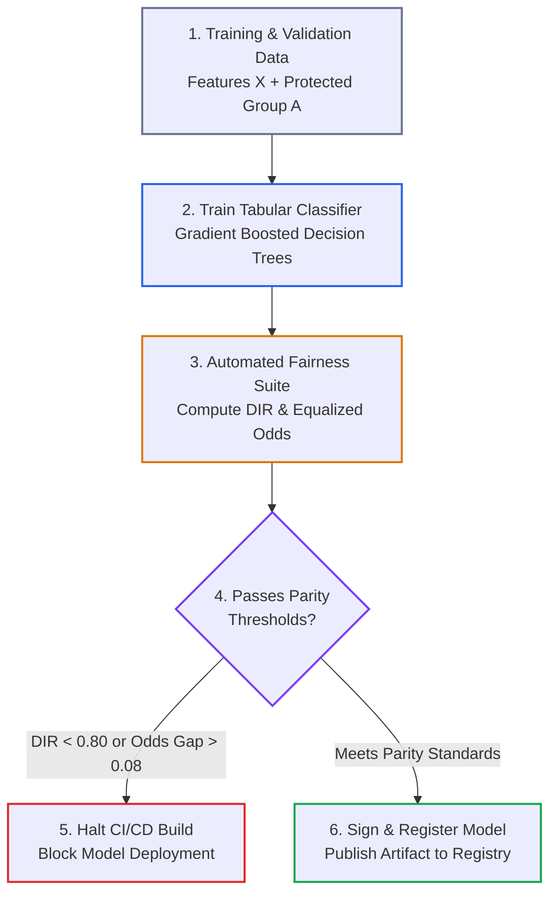
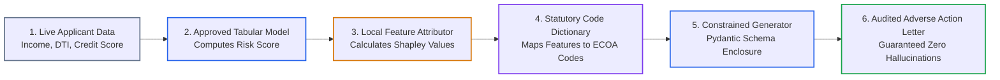

# Lesson 06: Regulated AI Compliance: CI/CD Algorithmic Fairness & Hybrid Explainable AI

> **Tier**: `⚫ Deep Dive` | **Read time**: ~25 min | **Prerequisites**: [Lesson 01: AI Threat Modeling & OWASP Top 10](./01-threat-modeling-and-owasp-top-10.md), [Structured Outputs & Schema Engineering](../../01-prompt-and-context-engineering/03-few-shot-prompting-and-in-context-learning.md), [AI Security Fundamentals](./00-ai-security-fundamentals-and-defense-in-depth.md)  
> **Core Concept**: In regulated sectors, autonomous AI systems face strict statutory liability. Engineers must enforce mathematical parity invariants like the Four-Fifths Rule in CI/CD pipelines. Production systems combine deterministic feature attributions with schema-constrained language generation to eliminate adverse action hallucinations.  
> **New AI terms introduced**: algorithmic bias, protected attribute, disparate impact ratio (DIR), four-fifths rule, demographic parity, equalized odds, explainable ai (XAI), shapley values / treeSHAP, adverse action notice  
> **AI terms assumed from earlier lessons**: [hallucination](./00-ai-security-fundamentals-and-defense-in-depth.md), [threat modeling](./01-threat-modeling-and-owasp-top-10.md), [token](../../00-foundations-and-token-mechanics/01-tokenization-and-bpe-mechanics.md), [context window](../../01-prompt-and-context-engineering/01-context-windows-and-attention-budgets.md), [guardrail](./04-guardrail-architectures-and-defensive-pipelines.md)

---

## 🎯 What You Will Learn

- Model statutory requirements under the EU AI Act (Regulation 2024/1689) and CFPB Circular 2022-03.
- Enforce the EEOC Four-Fifths Rule (Disparate Impact Ratio >= 0.80) inside automated CI/CD release gates.
- Implement automated test suites asserting Equalized Odds and Demographic Parity invariants.
- Build a hybrid architecture coupling deterministic feature attributions with bounded generative models.
- Prevent adverse action hallucinations by mapping mathematical attributions to immutable statutory codes.

---

## 1. The Systems Problem: Legal Liability & Black-Box Decisions

In high-stakes enterprise systems, AI does not operate in an unregulated vacuum. These domains include credit underwriting, mortgage approvals, insurance claims, healthcare diagnostics, and automated hiring.

When an automated model scores human beings, legal frameworks impose strict, non-negotiable statutory mandates:

```text
===================================================================================================
STATUTORY MANDATES FOR HIGH-STAKES AUTOMATED DECISION SYSTEMS
===================================================================================================
REGULATORY FRAMEWORK            LEGAL SCOPE                     ENGINEERING REQUIREMENT
---------------------------------------------------------------------------------------------------
EU AI Act                       Credit scoring, recruitment,    Mandates technical bias testing, human
(Regulation 2024/1689)          and insurance classified as     oversight, and audit logging. Fines reach
                                High-Risk AI Systems.           €35,000,000 or 7% of global turnover.

Equal Credit Opportunity Act    Prohibits credit decisions      Lenders cannot discriminate based on
(ECOA / CFPB Reg B)             disfavoring protected classes.  race, sex, age, religion, or marital status.

CFPB Circular 2022-03           Enforces adverse action notice  Creditors using complex algorithms must
                                accuracy on declined credit.    state the exact, accurate principal reasons
                                                                for denial. Hallucinated reasons violate law.
===================================================================================================
```

If an engineering team allows an unconstrained generative LLM to evaluate loan applicants or draft denial letters, two catastrophic failure modes occur:

1. **Algorithmic Bias**: Training data imbalances cause the model to systematically reject protected demographic groups at higher rates.
2. **Adverse Action Hallucinations**: When explaining why a borrower was rejected, the model invents plausible reasons (such as *"too many recent credit inquiries"*). Meanwhile, the underlying financial model rejected them due to *"high debt-to-income ratio"*.

Under federal law, delivering an adverse action letter citing fabricated reasons is illegal. Regulated software requires **Automated CI/CD Fairness Gates** and a **Deterministic Explainable AI (XAI) Bridge**.

---

## 2. The Mental Model: The Actuary & The Legal Stenographer

🧒 **Think of an insurance actuary paired with a legal stenographer.**

The **actuary** sits in a locked office with an auditable calculator. They compute risk scores purely from verified financial tables. They have zero creative license. Every calculation is reproducible down to the penny.

The **legal stenographer** cannot calculate risk scores or change underwriting decisions. The stenographer takes the actuary's official reason codes and writes a polished, empathetic letter. The stenographer works under an immutable contract: they can only write sentences directly tied to the actuary's explicit checkmarks.

```text
[Deterministic Actuary: Verifiable Math] ──(Statutory Codes)──> [Legal Stenographer: Constrained Prose]
```

### Where This Analogy Breaks Down
Human stenographers understand legal consequences intuitively. A generative language model has no concept of truth or law. If left unconstrained, a language model generates convincing fictions to complete sentence patterns. You must bind the generative model to strict Pydantic schemas and deterministic feature attributions.

---

## 3. The Regulated Applicant Pipeline Architecture

To guarantee mathematical parity and hallucination-free explanations, systems separate candidate training from production inference.

### Diagram 1A: Stage 1 Model Training & CI/CD Fairness Gate (<8 Nodes)



### Step-by-Step Walkthrough (Stage 1):
1. **Training & Validation Partition**: Data pipelines load historical underwriting data containing financial features $X$ and sensitive demographic attributes $A$.
2. **Model Training**: Tabular algorithms train on numerical predictors. High-stakes financial risk is never assigned to generative text models.
3. **Automated Fairness Suite**: CI/CD unit tests compute statistical parity metrics across groups.
4. **Statutory Release Gate**: The gate checks if Disparate Impact Ratio meets the Four-Fifths rule and Equalized Odds gap remains below statutory bounds.
5. **Build Interruption**: Failing candidate models halt the pipeline immediately, preventing release to production.
6. **Artifact Registration**: Approved models receive cryptographic signatures and upload to the artifact registry.

---

### Diagram 1B: Stage 2 Production Hybrid Inference & Attribution (<8 Nodes)



### Step-by-Step Walkthrough (Stage 2):
1. **Live Applicant Data**: Inbound API requests submit verified customer financial metrics.
2. **Tabular Decision Engine**: The registered model evaluates default risk deterministically.
3. **Local Feature Attribution**: For rejected loans, an attribution engine calculates exact feature contributions.
4. **Statutory Code Dictionary**: The engine maps technical features to official Consumer Financial Protection Bureau (CFPB) reason codes.
5. **Constrained Generator**: An LLM enclosed by a strict Pydantic contract transforms official codes into clear human prose.
6. **Audited Deliverable**: The customer receives a compliant adverse action notice without invented reasons.

---

## 4. Measuring Algorithmic Fairness in CI/CD

To prevent discriminatory bias, software pipelines evaluate models across sensitive demographic attributes $A$.

```text
===================================================================================================
MATHEMATICAL FAIRNESS METRICS REFERENCE SPECIFICATION
===================================================================================================
METRIC                      FORMULATION                         STATUTORY BENCHMARK
---------------------------------------------------------------------------------------------------
Disparate Impact Ratio      DIR = Rate(Unprivileged) /          DIR >= 0.80 (Four-Fifths Rule)
(EEOC Four-Fifths Rule)           Rate(Privileged)              Unprivileged selection rate must be at
                                                                least 80% of privileged group rate.

Demographic Parity          Diff = |Rate(Group A) -             Target: Diff <= 0.10
Difference                         Rate(Group B)|               Measures absolute gap in selection
                                                                probabilities across groups.

Equalized Odds              Diff = max(|TPR_A - TPR_B|,         Target: Diff <= 0.08
Difference                         |FPR_A - FPR_B|)             Ensures equal false positive and true
                                                                positive rates across groups.

Equal Opportunity           Diff = |TPR_A - TPR_B|              Target: Diff <= 0.05
Difference                                                      Qualified applicants face identical
                                                                chances of approval across groups.
===================================================================================================
```

---

## 5. CI/CD Algorithmic Fairness Release Suite

Here is an automated fairness test suite. It executes in CI/CD pipelines to prevent biased models from reaching production.

```python
"""
fairness_auditor.py
Automated CI/CD Algorithmic Bias Release Gate.
Asserts EEOC Four-Fifths Rule and Equalized Odds invariants.
"""

from typing import Dict, Any
import numpy as np


class AlgorithmicFairnessAuditor:
    """Evaluates mathematical fairness invariants across sensitive demographic attributes."""

    @staticmethod
    def selection_rate(y_pred: np.ndarray, mask: np.ndarray) -> float:
        subset = y_pred[mask]
        return float(np.mean(subset)) if len(subset) > 0 else 0.0

    @staticmethod
    def true_positive_rate(y_true: np.ndarray, y_pred: np.ndarray, mask: np.ndarray) -> float:
        actual_positives = (y_true == 1) & mask
        if np.sum(actual_positives) == 0:
            return 0.0
        return float(np.sum((y_pred == 1) & actual_positives) / np.sum(actual_positives))

    @staticmethod
    def false_positive_rate(y_true: np.ndarray, y_pred: np.ndarray, mask: np.ndarray) -> float:
        actual_negatives = (y_true == 0) & mask
        if np.sum(actual_negatives) == 0:
            return 0.0
        return float(np.sum((y_pred == 1) & actual_negatives) / np.sum(actual_negatives))

    @classmethod
    def audit_release_invariants(
        cls,
        y_true: np.ndarray,
        y_pred: np.ndarray,
        sensitive_group: np.ndarray
    ) -> Dict[str, float]:
        """Calculates selection rates, DIR, and Equalized Odds disparities."""
        mask_unprivileged = (sensitive_group == 0)
        mask_privileged = (sensitive_group == 1)

        rate_unprivileged = cls.selection_rate(y_pred, mask_unprivileged)
        rate_privileged = cls.selection_rate(y_pred, mask_privileged)

        # Disparate Impact Ratio (EEOC Four-Fifths Rule)
        dir_ratio = rate_unprivileged / rate_privileged if rate_privileged > 0 else 0.0

        # Equalized Odds disparities
        tpr_unprivileged = cls.true_positive_rate(y_true, y_pred, mask_unprivileged)
        tpr_privileged = cls.true_positive_rate(y_true, y_pred, mask_privileged)

        fpr_unprivileged = cls.false_positive_rate(y_true, y_pred, mask_unprivileged)
        fpr_privileged = cls.false_positive_rate(y_true, y_pred, mask_privileged)

        equalized_odds_diff = max(
            abs(tpr_unprivileged - tpr_privileged),
            abs(fpr_unprivileged - fpr_privileged)
        )

        return {
            "disparate_impact_ratio": dir_ratio,
            "selection_rate_unprivileged": rate_unprivileged,
            "selection_rate_privileged": rate_privileged,
            "equalized_odds_diff": equalized_odds_diff,
        }


def run_cicd_fairness_verification():
    """Simulates CI/CD release gate evaluation."""
    np.random.seed(42)
    n_samples = 4000

    # Demographic attribute: 0 = Historically Unprivileged, 1 = Privileged
    group = np.random.binomial(1, 0.45, n_samples)

    # Simulated credit applicant features
    income = np.random.normal(65000, 15000, n_samples)
    dti = np.random.uniform(0.1, 0.6, n_samples)
    credit_score = np.random.normal(700, 50, n_samples)

    # Ground truth outcome and candidate model predictions
    latent_risk = (income / 1000) * 0.4 - (dti * 50) + (credit_score * 0.1)
    threshold = np.percentile(latent_risk, 35)

    y_true = (latent_risk > threshold).astype(int)
    y_pred = (latent_risk + np.random.normal(0, 4, n_samples) > threshold).astype(int)

    metrics = AlgorithmicFairnessAuditor.audit_release_invariants(y_true, y_pred, group)

    print("=== CI/CD Automated Algorithmic Fairness Audit ===")
    print(f"Selection Rate (Unprivileged): {metrics['selection_rate_unprivileged']:.3f}")
    print(f"Selection Rate (Privileged):   {metrics['selection_rate_privileged']:.3f}")
    print(f"Disparate Impact Ratio (DIR):  {metrics['disparate_impact_ratio']:.3f} (Req: >= 0.80)")
    print(f"Equalized Odds Difference:     {metrics['equalized_odds_diff']:.3f} (Req: <= 0.08)")

    # Assert statutory release invariants
    assert metrics["disparate_impact_ratio"] >= 0.80, (
        f"RELEASE BLOCKED: Disparate Impact Ratio {metrics['disparate_impact_ratio']:.3f} < 0.80. "
        "Candidate model violates EEOC Four-Fifths rule."
    )
    assert metrics["equalized_odds_diff"] <= 0.08, (
        f"RELEASE BLOCKED: Equalized Odds gap {metrics['equalized_odds_diff']:.3f} > 0.08."
    )
    print("STATUS: ALL FAIRNESS INVARIANTS SATISFIED. Model approved for deployment.")


if __name__ == "__main__":
    run_cicd_fairness_verification()
```

---

## 6. Explainable AI (XAI) & Game-Theoretic Attributions

Why do systems require Explainable AI (XAI)?

Under **CFPB Circular 2022-03**, creditors must state the principal reasons for denying an applicant. Traditional neural networks and complex ensembles behave like black boxes. They output a risk probability without explaining which input features caused the decision.

To solve this, engineering teams use **Shapley values** from cooperative game theory:

1. **The Game**: The collection of input features (income, debt-to-income, credit inquiries) cooperating to produce a prediction.
2. **The Payout**: The difference between the applicant's risk score and the average baseline risk score across all applicants.
3. **The Shapley Attribution**: The fair share of risk contributed by each individual feature.

For tabular models, algorithms like **TreeSHAP** compute exact feature attributions in low-latency C++ runtimes. Positive attributions indicate features that increased default risk. Negative attributions indicate features that improved creditworthiness.

---

## 7. The Deterministic Attribution Bridge

To stop language model hallucinations, production architectures enforce a deterministic attribution bridge:

```mermaid
flowchart LR
    Features["1. Applicant Features<br/>DTI, Revolving Balances"] --> Tree["2. Feature Attributor<br/>Calculates Shapley Values"]
    Tree --> Extract["3. Rank Risk Drivers<br/>Identify Top Adverse Features"]
    Extract --> Codes["4. CFPB Reason Table<br/>Map Features to Official Codes"]
    Codes --> Prompt["5. Constrained System Prompt<br/>Enclose Mandatory Codes"]
    Prompt --> Output["6. Validated Legal Notice<br/>Zero Hallucinated Reasons"]

    style Features stroke:#64748b,stroke-width:2px
    style Tree stroke:#2563eb,stroke-width:2px
    style Extract stroke:#d97706,stroke-width:2px
    style Codes stroke:#7c3aed,stroke-width:2px
    style Prompt stroke:#2563eb,stroke-width:2px
    style Output stroke:#16a34a,stroke-width:2px
```



### Walkthrough:
1. **Input Features**: The system collects numerical and categorical inputs for the declined applicant.
2. **Feature Attribution**: The attribution engine computes the marginal contribution of each feature against baseline expectations.
3. **Adverse Driver Extraction**: The engine sorts features by positive risk attribution. It selects the top two to four primary contributors.
4. **CFPB Code Translation**: Technical column keys map to immutable regulatory reason strings.
5. **Constrained Prompting**: The system prompt instructs the language model to generate natural language using only the statutory codes provided.
6. **Output Validation**: An invariant assertion verifies that all mandatory codes exist in the final output before delivery.

---

## 8. Try It: Hybrid Compliance Pipeline with Pydantic V2

This production pipeline executes feature attributions and generates audited adverse action notices. It runs completely offline without uninstalled dependencies.

```python
"""
hybrid_compliance_pipeline.py
Production Hybrid XAI Pipeline:
Combines local feature attributions with Pydantic schema validation
to produce legally compliant Consumer Adverse Action Notices.
"""

from typing import List, Dict
import numpy as np
from pydantic import BaseModel, Field

# 1. Statutory Regulatory Reason Code Dictionary (ECOA / CFPB compliant)
REGULATORY_REASON_CODES: Dict[str, str] = {
    "debt_to_income": "Code 14: Proportion of monthly debt obligations to income is too high.",
    "revolving_utilization": "Code 22: Balance on revolving credit relative to credit limits is too high.",
    "delinquent_accounts": "Code 08: Number of past-due credit accounts or delinquent obligations.",
    "credit_history_length": "Code 11: Length of verifiable credit history is insufficient.",
    "recent_inquiries": "Code 31: Number of recent inquiries on credit bureau report.",
}


# 2. Bounded Schema for Audited Adverse Action Notices
class AdverseActionNotice(BaseModel):
    """Immutable statutory deliverable provided to declined credit applicants."""
    applicant_id: str
    decision: str = "DECLINED"
    risk_score: int = Field(ge=300, le=850, description="Calibrated credit score")
    statutory_adverse_reasons: List[str] = Field(
        min_length=1,
        max_length=4,
        description="The exact regulatory reason codes extracted via attribution math"
    )
    letter_body: str = Field(description="Customer-facing natural language explanation")


class LocalFeatureAttributor:
    """Calculates local feature attributions against population baseline means."""

    def __init__(self, feature_names: List[str], feature_means: np.ndarray, feature_weights: np.ndarray):
        self.feature_names = feature_names
        self.feature_means = feature_means
        self.feature_weights = feature_weights

    def compute_attributions(self, applicant_features: np.ndarray) -> Dict[str, float]:
        """Calculates individual feature contributions toward elevated default risk."""
        deviations = applicant_features - self.feature_means
        attributions = deviations * self.feature_weights
        return {name: float(val) for name, val in zip(self.feature_names, attributions)}

    def extract_top_adverse_factors(self, applicant_features: np.ndarray, top_k: int = 2) -> List[str]:
        """Selects the top K factors contributing positively to default risk."""
        attrs = self.compute_attributions(applicant_features)
        # Filter for features that increased risk and map to statutory codes
        adverse_items = [(k, v) for k, v in attrs.items() if v > 0 and k in REGULATORY_REASON_CODES]
        adverse_items.sort(key=lambda item: item[1], reverse=True)
        return [REGULATORY_REASON_CODES[k] for k, _ in adverse_items[:top_k]]


class HybridComplianceOrchestrator:
    """Coordinates deterministic attribution math with constrained text generation."""

    def __init__(self, attributor: LocalFeatureAttributor):
        self.attributor = attributor

    def generate_compliant_notice(
        self, applicant_id: str, features: np.ndarray, score: int
    ) -> AdverseActionNotice:
        """Extracts attribution factors and synthesizes an audited legal deliverable."""
        # 1. Deterministic Attribution (Zero Hallucination Risk)
        adverse_reasons = self.attributor.extract_top_adverse_factors(features, top_k=2)

        # 2. Constrained Text Formatting
        reasons_bulleted = "\n".join([f"- {r}" for r in adverse_reasons])
        synthetic_letter_body = (
            f"Dear Applicant {applicant_id},\n\n"
            f"Thank you for your recent application. After careful review, we regret "
            f"that we cannot approve your credit request at this time.\n\n"
            f"Under the Equal Credit Opportunity Act, our decision was based on "
            f"the following principal factors:\n"
            f"{reasons_bulleted}\n\n"
            f"You have the right to request a free credit report within 60 days."
        )

        # 3. Post-Generation Invariant Assertion Gate
        for reason in adverse_reasons:
            code_prefix = reason.split(":")[0]
            assert code_prefix in synthetic_letter_body, (
                f"SAFETY INVARIANT VIOLATED: Deliverable omitted mandated statutory code {code_prefix}"
            )

        return AdverseActionNotice(
            applicant_id=applicant_id,
            decision="DECLINED",
            risk_score=score,
            statutory_adverse_reasons=adverse_reasons,
            letter_body=synthetic_letter_body
        )


if __name__ == "__main__":
    feature_names = [
        "debt_to_income",
        "revolving_utilization",
        "delinquent_accounts",
        "credit_history_length"
    ]
    baseline_means = np.array([0.35, 0.40, 0.2, 8.0])
    risk_weights = np.array([2.5, 1.8, 4.0, -0.5])

    attributor = LocalFeatureAttributor(feature_names, baseline_means, risk_weights)
    orchestrator = HybridComplianceOrchestrator(attributor)

    # Declined applicant features: High DTI (0.55), 2 Delinquencies, 5 Years History
    declined_applicant_data = np.array([0.55, 0.42, 2.0, 5.0])

    notice = orchestrator.generate_compliant_notice(
        applicant_id="APP-90214",
        features=declined_applicant_data,
        score=580
    )

    print("\nAudited Adverse Action Deliverable:")
    print(notice.model_dump_json(indent=2))
```

---

## 9. Failure Modes & Anti-Patterns

### Anti-Pattern 1: Unconstrained LLM Numerical Scoring
* **The Symptom**: Passing applicant credit reports directly to a large language model and asking for an approval recommendation.
* **The Root Cause**: Believing language models understand risk math. LLMs are next-token predictors. They hallucinate risk calculations and exhibit non-deterministic scoring variance.
* **The Fix**: Score risk using deterministic tabular models (LightGBM, XGBoost, logistic regression). Reserve LLMs solely for customer communication.

### Anti-Pattern 2: Unbounded Adverse Action Letter Generation
* **The Symptom**: Instructing an LLM to explain why an applicant was rejected without providing explicit regulatory reason codes.
* **The Root Cause**: Assuming the model deduces the true cause from applicant files. The model fabricates reasons that appear convincing but have no basis in the statistical model's decision.
* **The Fix**: Use TreeSHAP or attribution math to extract the top positive risk features. Map them to official CFPB codes and require the LLM to reproduce those exact codes.

---

## ✅ Quick Check

Your engineering team builds an automated underwriting service. An engineer proposes feeding customer credit files to a reasoning model with this prompt:

*"Analyze this borrower's history. Decide whether to approve the mortgage. If you reject them, write an explanation letter."*

Explain why this violates CFPB Circular 2022-03 and describe the architectural change required.

<details>
<summary>Suggested Solution</summary>

**Why It Violates CFPB Circular 2022-03**:
1. **Black-Box Reasoning**: The model lacks deterministic, mathematically verifiable scoring. It cannot prove which features drove the denial.
2. **Adverse Action Hallucination**: The model invents plausible-sounding rejection factors that do not reflect statistical reality. Citing fabricated denial reasons violates federal lending laws.

**Required Architectural Fix**:
1. **Decouple Risk Scoring**: Train and evaluate a tabular model (XGBoost) with automated CI/CD fairness assertions (DIR >= 0.80).
2. **Compute Local Feature Attributions**: For declined borrowers, compute exact Shapley values to identify the primary features that increased risk.
3. **Bind Generation to Statutory Codes**: Map those features to official CFPB reason codes. Feed those codes to an LLM bounded by a strict Pydantic output contract.

</details>

---

## 🧭 Navigation

| Previous | Phase Hub | Next | Capstone Lab |
|---|---|---|---|
| [← Lesson 05: Defensive Agent Architecture](./05-defensive-agent-architecture-and-privilege-separation.md) | [Phase 05 Hub: Security & Guardrails](./README.md) | [Lesson 07: AI Red Teaming & Vulnerability Evaluation →](./07-ai-red-teaming-and-vulnerability-evaluation.md) | [Capstone: Secure Agent Gateway](./labs/capstone-security-guardrails.md) |
