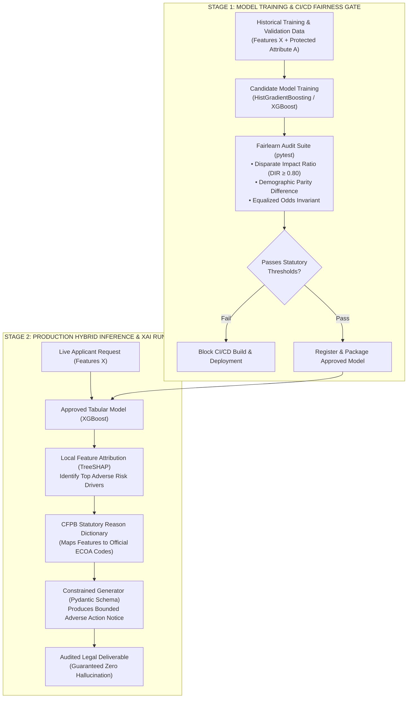
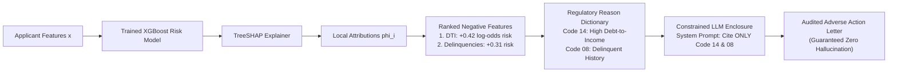

# Regulated AI Compliance: CI/CD Algorithmic Fairness & Hybrid Explainable AI

> **Tier:** ⚫ Deep Dive | **Est. Time:** 60 min | **Prerequisites:** Lesson 01 (AI Threat Modeling), Phase 01 (Structured Outputs), Python unit testing with pytest
>
> **Core Concept:** In regulated industries (finance, healthcare, employment), autonomous and probabilistic AI systems face strict statutory liability. Engineers must enforce mathematical parity invariants (Four-Fifths Rule) in CI/CD release pipelines and deploy hybrid architectures coupling deterministic Shapley feature attributions (TreeSHAP) with constrained language generation to eliminate adverse action hallucinations.

---

## 1. The Systems Problem: Legal Liability & Black-Box Decisions

In high-stakes enterprise systems—consumer credit underwriting, mortgage approvals, insurance claims, healthcare diagnostics, and automated hiring—AI systems do not operate in an unregulated vacuum.

When an automated model scores human beings, legal frameworks impose strict, non-negotiable statutory mandates:
* **The EU AI Act (Regulation 2024/1689)**: Classifies credit scoring, insurance risk assessment, and recruitment systems as **High-Risk AI Systems** (Articles 10, 13, and 14). Requires formal risk management, technical logging, human oversight, and verifiable mitigation of algorithmic bias. Administrative fines reach **€35,000,000 or 7% of total worldwide annual turnover**.
* **Equal Credit Opportunity Act (ECOA / CFPB Regulation B)**: Prohibits discrimination based on race, color, religion, national origin, sex, marital status, or age.
* **CFPB Circular 2022-03**: The Consumer Financial Protection Bureau mandates that creditors using complex black-box algorithms must disclose the **specific, accurate principal reasons** an adverse action (loan denial) was taken. 

If an enterprise deploys an unconstrained Large Language Model (LLM) to evaluate applicants or explain decisions:
1. Historical training data biases cause the model to systematically disfavor protected demographic groups.
2. When generating denial letters, the LLM hallucinates non-existent reasons (e.g., claiming an applicant was rejected for *"too many recent inquiries"* when the underlying statistical model rejected them due to *"high debt-to-income ratio"*).

In regulated software, hallucinating a denial reason violates federal law and incurs severe regulatory sanctions. Production compliance requires **Automated CI/CD Fairness Gates** and a **Deterministic Explainable AI (XAI) Bridge**.

---

## 2. Beginner AI Scaffolding: Core Regulatory & XAI Concepts

To master regulated AI engineering, let us establish clear definitions and beginner-friendly mental models:

| AI Term (Abbreviated) | Full Name | Beginner AI Mental Model | Systems Engineering Parallel |
|---|---|---|---|
| **Protected Attribute** | Sensitive Demographic Variable | Legally protected personal characteristics (gender, race, age, marital status) that must not unfairly influence automated scoring decisions. | Multi-tenant isolation attributes where processing logic must remain equitable regardless of tenant partition. |
| **Algorithmic Bias** | Systematic Statistical Disparity | When an AI model produces systematically less favorable outcomes for one group compared to another due to imbalances in historical training data. | A poorly partitioned database index or hash function causing severe hotspotting on specific keys. |
| **DIR** | Disparate Impact Ratio | The ratio comparing the selection rate of a historically unprivileged group against the privileged group. Under EEOC rules, DIR must be at least 0.80 (the "Four-Fifths Rule"). | Performance parity benchmarks requiring that P99 latency on secondary regions does not fall below 80% of the primary region. |
| **XAI** | Explainable AI | Techniques that unpack complex machine learning models, mathematically showing which input factors drove a specific prediction. | Distributed tracing (e.g., OpenTelemetry) exposing which exact microservice spans contributed to overall transaction latency. |
| **TreeSHAP** | Tree Shapley Additive Explanations | An algorithmic method from cooperative game theory that calculates the exact numerical contribution of each input feature toward a decision tree's final score. | An accounting audit log attributing exact dollar amounts to every line item in an aggregate financial ledger. |
| **Adverse Action Notice** | Statutory Denial Explanation | A legally mandated formal communication explaining to a consumer the exact primary reasons their credit, employment, or insurance application was declined. | A formal HTTP 403 Forbidden payload returning machine-readable regulatory error codes and audit traces. |

---

## 3. The Regulated Applicant Pipeline Architecture

To guarantee both mathematical fairness and hallucination-free explanations, enterprise systems enforce a **Hybrid Decision Pipeline**:



### Step-by-Step Diagram Walkthrough:
1. **Model Training & Validation Data (Stage 1)**: Historical underwriting datasets with ground-truth loan outcomes and sensitive demographic features (protected attribute A) are partitioned for training and validation.
2. **Candidate Model Training**: A tabular gradient boosted classifier is trained on financial predictors.
3. **CI/CD Fairness Gate**: Automated pytest assertions compute fairness metrics using Microsoft `fairlearn`. If the Disparate Impact Ratio (DIR) falls below 0.80 or Equalized Odds exceeds 0.08, the pipeline halts immediately, preventing registry deployment.
4. **Production Model Registration**: Models passing all parity checks are cryptographically signed and deployed to the production serving tier.
5. **Live Decision & Local Attribution (Stage 2)**: For rejected applicants, the deployed XGBoost model outputs risk scores, and fast C++ TreeSHAP computes exact Shapley attributions isolating the top adverse features.
6. **Statutory Enclosure & Constrained Generation**: Adverse features are translated through an immutable CFPB regulatory dictionary and injected into an LLM enclosed by a strict Pydantic output contract, producing an adverse action notice free of hallucinated reasons.
3. **Calibrated Tabular Risk Scorer (Stage 3)**: A deterministic tabular model (XGBoost) calculates credit default probability. High-stakes numerical risk is never computed by an unconstrained generative LLM.
4. **TreeSHAP Local Attribution**: For declined applicants, fast C++ TreeSHAP algorithms compute exact Shapley attributions, identifying the top K features that increased default risk.
5. **Deterministic Regulatory Enclosure**: Feature names are mapped to official CFPB adverse action reason codes via an immutable dictionary.
6. **Constrained Justification Generation**: The exact statutory codes are passed into an LLM system prompt bounded by a strict Pydantic output schema, generating a professional, legally compliant adverse action notice without hallucinating factors.

---

## 4. Measuring Algorithmic Fairness in CI/CD

Algorithmic fairness must be evaluated across sensitive protected attributes (A). In modern software delivery, these mathematical formulations are asserted inside automated test suites:

```text
===================================================================================================
ALGORITHMIC FAIRNESS METRICS REFERENCE SPECIFICATION
===================================================================================================
FAIRNESS METRIC             FORMULATION                                 STATUTORY THRESHOLD
---------------------------------------------------------------------------------------------------
Disparate Impact Ratio      DIR = P(Approved | Unprivileged) /          DIR ≥ 0.80
(EEOC Four-Fifths Rule)           P(Approved | Privileged)              (Selection rate of unprivileged
                                                                        must be at least 80% of privileged)

Demographic Parity          Δ_DP = max_a P(Approved | Group a) -        Target: Δ_DP ≤ 0.10
Difference                         min_a P(Approved | Group a)          (Maximum absolute difference in
                                                                        positive outcome probability)

Equalized Odds              Δ_EO = max(|TPR_a - TPR_b|,                 Target: Δ_EO ≤ 0.05
Difference                         |FPR_a - FPR_b|)                     (Model must have equal accuracy;
                                                                        prevents higher false accusation)

Equal Opportunity           Δ_Eopp = |TPR_0 - TPR_1|                    Target: Δ_Eopp ≤ 0.05
Difference                                                              (Qualified applicants have equal
                                                                        probability of approval)
===================================================================================================
```

---

## 5. Production CI/CD Fairness Test Suite (Fairlearn + pytest)

The following production test suite evaluates credit risk predictions using Microsoft `fairlearn`. It runs in CI/CD pipelines to prevent biased models from being registered or deployed:

```python
"""
test_fairness_cicd.py
Enterprise CI/CD Algorithmic Bias Test Suite using Fairlearn and pytest.
Ensures credit underwriting models satisfy EEOC and ECOA parity invariants.
"""

import pytest
import numpy as np
import pandas as pd
from sklearn.ensemble import HistGradientBoostingClassifier
from fairlearn.metrics import (
    MetricFrame,
    selection_rate,
    true_positive_rate,
    false_positive_rate,
    demographic_parity_difference,
    equalized_odds_difference
)

@pytest.fixture(scope="module")
def model_and_validation_data():
    """Generates synthetic loan portfolio data with protected demographic attributes."""
    np.random.seed(42)
    n_samples = 4000
    
    # Protected attribute: 0 = Historically Unprivileged Group, 1 = Privileged Group
    group = np.random.binomial(1, 0.4, n_samples)
    
    # Financial features: Income, Debt-to-Income (DTI), Credit Score
    income = np.random.normal(65000, 15000, n_samples)
    dti = np.random.uniform(0.1, 0.6, n_samples)
    credit_score = np.random.normal(700, 50, n_samples)
    
    # Ground truth loan default: Y = 1 (Approved), Y = 0 (Rejected)
    latent_score = (income / 1000) * 0.4 - (dti * 50) + (credit_score * 0.1)
    y_true = (latent_score > np.percentile(latent_score, 40)).astype(int)
    
    X = pd.DataFrame({"income": income, "dti": dti, "credit_score": credit_score})
    
    # Train candidate classification model
    clf = HistGradientBoostingClassifier(random_state=42)
    clf.fit(X, y_true)
    y_pred = clf.predict(X)
    
    return clf, X, y_true, y_pred, group

def test_disparate_impact_ratio_four_fifths_rule(model_and_validation_data):
    """
    EEOC Four-Fifths Rule Release Gate:
    The selection rate of the unprivileged group MUST be at least 80% of the privileged group.
    """
    _, _, _, y_pred, group = model_and_validation_data
    
    metric_frame = MetricFrame(
        metrics=selection_rate,
        y_true=None,
        y_pred=y_pred,
        sensitive_features=group
    )
    
    rate_unprivileged = metric_frame.by_group[0]
    rate_privileged = metric_frame.by_group[1]
    
    disparate_impact_ratio = rate_unprivileged / rate_privileged
    print(f"\n[CI/CD Audit] Disparate Impact Ratio: {disparate_impact_ratio:.3f}")
    
    assert disparate_impact_ratio >= 0.80, (
        f"VIOLATION: Disparate Impact Ratio {disparate_impact_ratio:.3f} < 0.80. "
        "Model violates the EEOC Four-Fifths Rule and cannot be deployed to production."
    )

def test_equalized_odds_invariants(model_and_validation_data):
    """
    Equalized Odds Release Gate:
    The difference in False Positive Rate and True Positive Rate between groups must be <= 0.08.
    """
    _, _, y_true, y_pred, group = model_and_validation_data
    
    eo_diff = equalized_odds_difference(
        y_true=y_true,
        y_pred=y_pred,
        sensitive_features=group
    )
    print(f"[CI/CD Audit] Equalized Odds Difference: {eo_diff:.3f}")
    
    assert eo_diff <= 0.08, (
        f"VIOLATION: Equalized Odds Difference {eo_diff:.3f} > 0.08. "
        "Model exhibits disparate predictive accuracy across demographic groups."
    )
```

---

## 6. Explainable AI (XAI) for Hybrid Systems

In high-stakes enterprise systems, the optimal architecture is a **Hybrid System**:
* A **deterministic tabular ML model** (XGBoost, LightGBM) computes mathematical risk scores with rigorous statistical bounds.
* A **generative LLM** transforms complex mathematical explanations into personalized, empathetic, and compliant human communication.

### The Hallucination Vulnerability in Explanations
Under CFPB Circular 2022-03, creditors must disclose the exact principal reasons an adverse action was taken. If an LLM is allowed to generate the adverse action notice based on general applicant context:
* The LLM may hallucinate that an applicant was rejected due to *"recent inquiries"*, when in reality the statistical model rejected them purely due to *"Debt-to-Income (DTI) ratio exceeding 45%"*.
* In consumer lending, sending an adverse action letter citing hallucinated reasons violates federal law and incurs severe regulatory fines.

---

## 7. The Deterministic Attribution Bridge: TreeSHAP + Bounded LLM

To eliminate hallucination, enterprise architectures enforce a **Deterministic Attribution Bridge**:



### Step-by-Step Diagram Walkthrough:
1. **Applicant Input**: Applicant financial data is evaluated by a trained XGBoost risk classifier.
2. **TreeSHAP Calculation**: Fast C++ TreeSHAP calculates the local Shapley values phi_i(x) for each feature:
   ```text
   phi_i(x) = sum over feature subsets S [ weight * (f(S union {i}) - f(S)) ]
   ```
   This calculates the exact contribution of each feature toward increasing default risk.
3. **Top Adverse Feature Selection**: The engine extracts the top K features (K = 4 under ECOA standards) that contributed most positively to the default log-odds.
4. **Regulatory Mapping**: Technical feature keys (e.g., `debt_to_income`) are mapped to official CFPB statutory reason codes.
5. **Constrained Prompt Enclosure**: The exact statutory codes are passed into an LLM system prompt. The model's generation is bounded by a Pydantic schema assertion verifying that no unapproved factors are mentioned.
6. **Audited Deliverable**: The generated document is guaranteed to be compliant with federal regulations.

---

## 8. Production Implementation: XGBoost + TreeSHAP + Bounded LLM Generator

```python
"""
hybrid_xai_adverse_action.py
Production Hybrid XAI Pipeline:
Combines XGBoost, TreeSHAP feature attributions, and a strictly constrained LLM
to generate legally compliant Consumer Adverse Action Notices.
"""

from typing import List, Dict, Any
from pydantic import BaseModel, Field
import numpy as np
import xgboost as xgb
import shap

# 1. Standard Regulatory Reason Code Dictionary (CFPB / ECOA compliant)
REGULATORY_REASON_CODES = {
    "debt_to_income": "Code 14: Proportion of monthly debt obligations to verified income is too high.",
    "revolving_utilization": "Code 22: Total balance on revolving credit lines relative to credit limits is too high.",
    "delinquent_accounts": "Code 08: Number of past-due credit accounts or delinquent obligations.",
    "credit_history_length": "Code 11: Length of verifiable credit history is insufficient.",
    "recent_inquiries": "Code 31: Number of recent inquiries on credit bureau report.",
}

# 2. Pydantic Output Contract for the Regulated Document
class AdverseActionNotice(BaseModel):
    applicant_id: str
    decision: str = "DECLINED"
    risk_score: int = Field(description="Credit bureau calibrated score (300-850)")
    statutory_adverse_reasons: List[str] = Field(
        min_length=1,
        max_length=4,
        description="The exact regulatory reason codes extracted via SHAP"
    )
    letter_body: str = Field(description="Customer-facing natural language explanation")

class HybridXAIOrchestrator:
    def __init__(self, model: xgb.XGBClassifier, feature_names: List[str]):
        self.model = model
        self.feature_names = feature_names
        # Initialize fast C++ TreeSHAP explainer
        self.explainer = shap.TreeExplainer(model)

    def extract_top_adverse_factors(self, applicant_features: np.ndarray, top_k: int = 2) -> List[str]:
        """
        Computes local SHAP values and extracts the top features driving rejection.
        In default prediction, positive SHAP value = increases risk of default.
        """
        shap_values = self.explainer.shap_values(applicant_features.reshape(1, -1))
        instance_shap = shap_values[0] if isinstance(shap_values, list) else shap_values[0]

        # Sort indices by highest contribution to default risk
        risk_increasing_indices = np.argsort(instance_shap)[::-1]

        adverse_reasons: List[str] = []
        for idx in risk_increasing_indices:
            feat_name = self.feature_names[idx]
            # Only include features that actively increased risk (positive attribution)
            if instance_shap[idx] > 0 and feat_name in REGULATORY_REASON_CODES:
                adverse_reasons.append(REGULATORY_REASON_CODES[feat_name])
                if len(adverse_reasons) == top_k:
                    break

        return adverse_reasons

    def generate_compliant_notice(
        self, applicant_id: str, features: np.ndarray, score: int
    ) -> AdverseActionNotice:
        """Extracts SHAP reasons and generates a bounded natural language document."""
        # 1. Deterministic SHAP extraction (Zero LLM hallucination possible)
        adverse_reasons = self.extract_top_adverse_factors(features, top_k=2)

        # 2. Constrained Prompt Template for LLM Generation
        reasons_bulleted = "\n".join([f"- {r}" for r in adverse_reasons])
        
        prompt = f"""You are a compliance communications officer at an FDIC-regulated financial institution.
Generate a formal Adverse Action Notice for applicant {applicant_id}.
STATUTORY MANDATE: You must explain the decision based SOLELY on the following regulatory reasons:
{reasons_bulleted}

DO NOT mention or speculate on any other factors (such as age, location, employment, or cash reserves).
Tone must be professional, objective, and respectful."""

        # In production: invoke LLM with AdverseActionNotice schema and prompt
        synthetic_letter_body = (
            f"Dear Applicant,\n\n"
            f"Thank you for your recent application. After careful review of your credit report, "
            f"we regret that we are unable to approve your credit application at this time. "
            f"Under the Equal Credit Opportunity Act, our decision was based on the following principal factors:\n"
            f"{reasons_bulleted}\n\n"
            f"You have the right to request a free copy of your credit report within 60 days."
        )

        # 3. Post-Generation Invariant Assertion Gate
        for reason in adverse_reasons:
            code_prefix = reason.split(":")[0]
            assert code_prefix in synthetic_letter_body, (
                f"SAFETY INVARIANT VIOLATED: LLM omitted mandated statutory code {code_prefix}"
            )

        return AdverseActionNotice(
            applicant_id=applicant_id,
            decision="DECLINED",
            risk_score=score,
            statutory_adverse_reasons=adverse_reasons,
            letter_body=synthetic_letter_body
        )

# Example Execution
if __name__ == "__main__":
    feature_cols = ["debt_to_income", "revolving_utilization", "delinquent_accounts", "credit_history_length"]
    
    # Train mock XGBoost classifier
    X_dummy = np.array([
        [0.25, 0.30, 0, 10],
        [0.55, 0.85, 2, 2],
        [0.15, 0.20, 0, 15]
    ])
    y_dummy = np.array([0, 1, 0])
    
    xgb_clf = xgb.XGBClassifier(n_estimators=10, max_depth=3, random_state=42)
    xgb_clf.fit(X_dummy, y_dummy)

    orchestrator = HybridXAIOrchestrator(model=xgb_clf, feature_names=feature_cols)

    # Adverse applicant: high DTI (0.52) and high utilization (0.80)
    declined_features = np.array([0.52, 0.80, 1, 3])
    
    notice = orchestrator.generate_compliant_notice(
        applicant_id="APP-90214",
        features=declined_features,
        score=585
    )

    print("\nAudited Adverse Action Deliverable:")
    print(notice.model_dump_json(indent=2))
```

---

## 9. Architectural Takeaways

1. **High-Risk AI Demands CI/CD Regression Gates**: Algorithmic fairness (DIR ≥ 0.80) must be asserted in automated test suites with Fairlearn before model deployment.
2. **Never Let Generative LLMs Calculate Risk**: Tabular machine learning (XGBoost/LightGBM) computes mathematical scores; generative LLMs synthesize human-facing language.
3. **Bind LLM Explanations to Deterministic Attributions**: Use TreeSHAP to identify adverse features and map them to official statutory codes, completely eliminating adverse action hallucinations.

---

## 🧭 Navigation

| Previous | Phase Hub | Next | Capstone Lab |
|---|---|---|---|
| [← Lesson 05: Defensive Agent Architecture](./05-defensive-agent-architecture-and-privilege-separation.md) | [Phase 05 Hub: Security & Guardrails](./README.md) | [Lesson 07: AI Red Teaming & Vulnerability Evaluation →](./07-ai-red-teaming-and-vulnerability-evaluation.md) | [Capstone: Secure Agent Gateway](./labs/capstone-security-guardrails.md) |
