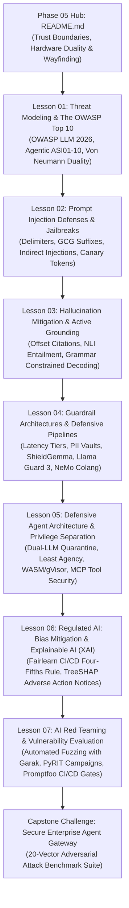
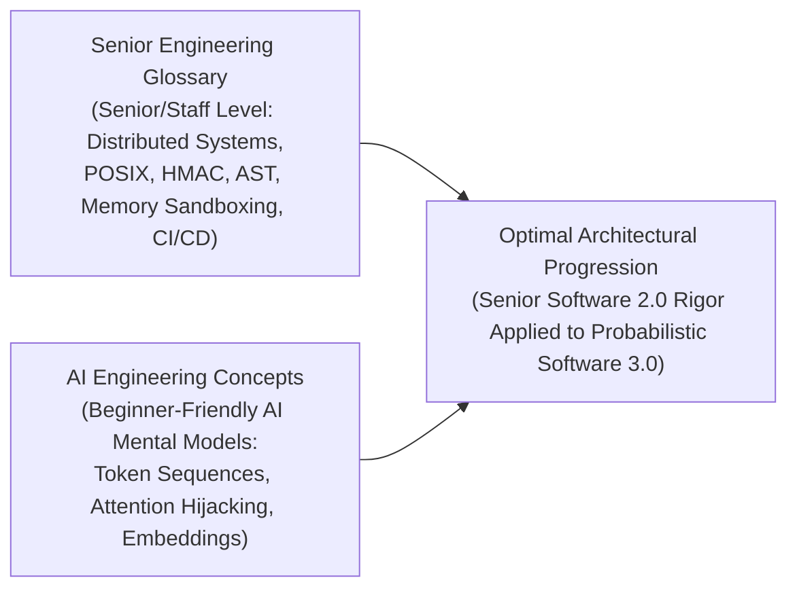
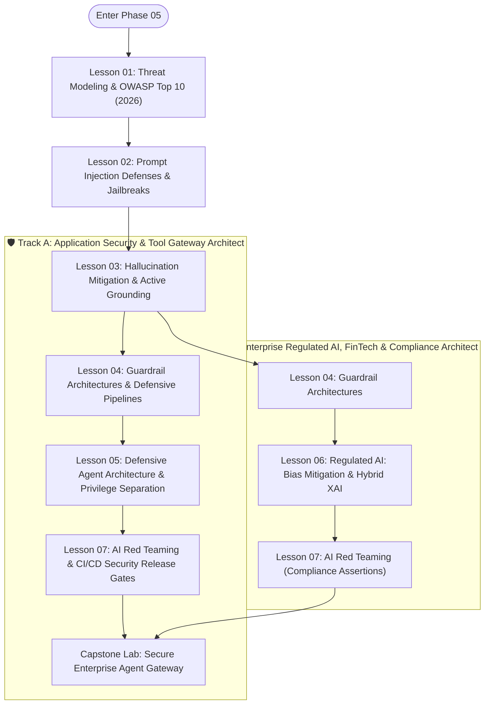

# Phase 05: AI Security & Guardrails — Merged Refactoring Plan

**Planning Mode**: Curricular & Structural Refactoring Plan  
**Target Phase**: `05-ai-security-and-guardrails/`  
**Architect**: AI Curriculum Architect  
**Audience**: Senior Software Engineers, Staff Architects, Technical Leads (7–10+ years experience transitioning into AI Engineering)  
**Date**: September 2026  
**Status**: APPROVED & READY FOR REFACTORING  
**Governing Skill**: `ai-curriculum-refactoring`

---

## 1. Executive Summary & Core Objectives

The objective of this refactoring plan is to decompose the **1,259-line monolithic `README.md`** into an authoritative, modular **7-lesson curriculum**, supported by a streamlined **Phase Navigation Hub**, **preserved enterprise code implementations**, and the **verified 20-vector Capstone Security Gateway challenge**.

### Mandatory Core Invariants:
1. **Zero Content Deletion ("Make Sure to Not Delete Anything")**: Every concept, diagram, mathematical proof, code snippet, failure mode, and regulatory test suite from the existing 1,259 lines is explicitly preserved, allocated, and enhanced in the new modular structure.
2. **Beginner AI Explanations with Full Abbreviations**: Every AI-specific term or acronym must be fully spelled out and accompanied by an intuitive, beginner-friendly mental model upon first mention (e.g., *LLM — Large Language Model*, *NLI — Natural Language Inference*, *GCG — Greedy Coordinate Gradient*, *TreeSHAP — Tree Shapley Additive Explanations*, *MCP — Model Context Protocol*). Senior software engineering infrastructure terminology (distributed systems, POSIX, HMAC, AST, CI/CD, reverse proxies) remains calibrated at the Staff/Senior level.
3. **2026 Industry Modernization**:
   - Modernize threat modeling to the **OWASP Top 10 for LLM Applications 2026** (empirical analysis of 7,714 incidents).
   - Formally specify the **OWASP Top 10 for Agentic Applications (2026)** (ASI01 to ASI10).
   - Integrate the **OWASP Model Context Protocol (MCP) Top 10** for tool-binding security.
   - Establish automated CI/CD security regression release gates using **Promptfoo**, **Microsoft PyRIT**, and **NVIDIA Garak**.
   - Incorporate tiered latency budgeting: Tier 0 regex (<1ms) → Tier 1 SLM (10–25ms with **Google ShieldGemma 2B** / **Meta Prompt Guard**) → Tier 2 classifiers (**Meta Llama Guard 3 (8B/1B/11B Vision)** and **NVIDIA NeMo Guardrails Colang 2.0**).
4. **Zero-LaTeX & Pure GFM Hygiene**: Convert all raw LaTeX math expressions (`$$...$$`, `$...$`, `\Delta`, `\phi`) into clean text code blocks and native Unicode symbols. Purge all internal author meta-tags (`[MUST-HAVE]`, `[GOOD-TO-KNOW]`).
5. **Diagram Stability & Step-by-Step Prose Walkthroughs**: Ensure all 15 Mermaid diagrams feature numbered, step-by-step prose walkthroughs explaining security boundaries, token transitions, and failure edges.

---

## 2. Target Modular Curriculum Breakdown

The monolithic `README.md` is decomposed into **7 modular lessons** and a central **Phase Hub**:



### Modular Lesson Directory:

| Module / Lesson | Title & Subtitle | Depth Tier | Est. Time | Core Systems & AI Engineering Concepts |
|---|---|:---:|:---:|---|
| **`README.md`** | **Phase 05 Navigation & Architectural Hub** | `Phase Hub` | 15 min | The Lead Mental Model: Probabilistic runtime security vs. deterministic perimeters; The Von Neumann vs. Harvard hardware duality of LLMs; Trust Boundary Model; Master Lesson Directory; Learning Pathways; Curated Bibliography. |
| **`01-threat-modeling-and-owasp-top-10.md`** | **AI Threat Modeling: Von Neumann Attention Duality & OWASP Top 10 (2026)** | `🟢 Tier 1: Core` | 40–50 min | The Von Neumann attention duality (instructions and data sharing the linear token stream); **OWASP Top 10 for LLM Applications 2026** (empirical dataset of 7,714 incidents); **OWASP Top 10 for Agentic Applications (2026)** (ASI01 Goal Hijack, ASI02 Tool Misuse, ASI03 Privilege Abuse, ASI06 Context Poisoning); Anti-Pattern: Security through obscurity in system prompts. |
| **`02-prompt-injection-defenses-and-jailbreaks.md`** | **Prompt Injection Defenses, Adversarial Suffixes & Context Hardening** | `🟢 Tier 1: Core` | 45–55 min | Direct injections: delimiter escapes, roleplay bypasses, GCG (Greedy Coordinate Gradient) token optimization; Indirect injections: poisoned RAG chunks, HR resume screener exploit; Multimodal visual injections (OCR/pixel payloads); Data exfiltration via zero-click Markdown image tags (``); Ephemeral randomized XML delimiters (`secrets.token_hex(8)`); Cryptographic canary tokens (honeytokens). |
| **`03-hallucination-mitigation-and-active-grounding.md`** | **Hallucination Mitigation: Token Offsets, NLI Entailment & Constrained Decoding** | `🟡 Tier 2: Depth` | 45–55 min | Extrinsic (factuality) vs. Intrinsic (faithfulness) hallucinations; Character-level and token-offset citation anchors (`document.text[start:end] == quote`); Active Verification Loops: Natural Language Inference (NLI) cross-encoders (Premise vs. Hypothesis entailment/contradiction); Self-correction critic loops; Constrained decoding via Context-Free Grammars (CFG) and JSON Schema masking (Outlines, XGrammar, temp=0). |
| **`04-guardrail-architectures-and-defensive-pipelines.md`** | **Guardrail Architectures: Multi-Tier Latency Pipelines & Safety Classifiers** | `🟡 Tier 2: Depth` | 50–60 min | Pre-inference vs. Post-inference guardrail topology; Tiered Latency Budgeting (Tier 0 Regex <1ms → Tier 1 SLM 10–25ms with Google ShieldGemma 2B / Prompt Guard → Tier 2 LLM 100–300ms with Meta Llama Guard 3); PII tokenization and pseudonymization vaults (Presidio); NVIDIA NeMo Guardrails (Colang syntax); Guardrails AI (AST schema assertions); Tradeoff matrices: Rules vs. Semantic Routers vs. Classifier LLMs. |
| **`05-defensive-agent-architecture-and-privilege-separation.md`** | **Defensive Agent Architecture: Dual-LLM Quarantine & Sandboxed Tool Runtimes** | `🔵 Tier 3: Advanced` | 50–60 min | The Dual-LLM Privilege Separation Pattern: Quarantined Reader LLM (untrusted input, zero tools, strict Pydantic extraction) + Privileged Orchestrator LLM (trusted instructions, tool proxy); Principle of Least Agency; Sandboxed code runtimes: Docker (`--network none`), gVisor (`runsc`), and WebAssembly (WASM); Step-up cryptographic confirmation tokens (HMAC-SHA256) for state mutations; **OWASP Model Context Protocol (MCP) Top 10** tool poisoning defenses. |
| **`06-regulated-ai-bias-mitigation-and-explainable-ai.md`** | **Regulated AI Compliance: CI/CD Algorithmic Fairness & Hybrid Explainable AI** | `⚫ Tier 4: Deep Dive` | 50–60 min | Regulatory mandates: EU AI Act (Regulation 2024/1689 Article 15), ECOA / CFPB Circular 2022-03, EEOC; Algorithmic fairness in CI/CD: Disparate Impact Ratio (DIR ≥ 0.80 four-fifths rule), Demographic Parity, Equalized Odds; Production `test_fairness_cicd.py` test suite (Fairlearn + pytest); Hybrid Explainable AI: TreeSHAP local feature attributions bounded to statutory reason codes; Production `hybrid_xai_adverse_action.py` pipeline. |
| **`07-ai-red-teaming-and-vulnerability-evaluation.md`** | **AI Red Teaming: Automated Vulnerability Fuzzing & CI/CD Security Release Gates** | `🟡 Tier 2: Depth` | 45–55 min | The 3-Tier AI Red Teaming Stack: Breadth fuzzing with NVIDIA Garak, Deep multi-turn adversarial exploit campaigns with Microsoft PyRIT, Declarative CI/CD security regression gates with Promptfoo; Writing promptfoo YAML test configs; Automated detection of prompt injections, jailbreaks, and PII leakage in GitHub Actions release pipelines. |

---

## 3. Comprehensive Source-to-Target Migration Mapping (Zero-Loss Guarantee)

Every single section and line from the original 1,259-line monolithic `README.md` is preserved and relocated according to this deterministic mapping:

```text
========================================================================================================================
SOURCE SECTION IN MONOLITH (Lines)                       ACTION   TARGET DESTINATION FILE
========================================================================================================================
Lines 1–17: Header, Badges & Guidance                    MIGRATE  05-.../README.md (Modernized Phase Hub)
Lines 18–34: Untrusted Ingress to Egress Architecture    MIGRATE  README.md & Lesson 04 (With Step-by-Step Walkthrough)
Lines 37–56: Table of Contents                           REPLACE  05-.../README.md (Master Lesson Navigation Directory)
Lines 58–96: Executive Summary & Traditional vs LLM      MIGRATE  README.md & 01-threat-modeling-and-owasp-top-10.md
Lines 97–123: Harvard vs. Von Neumann Hardware Duality   MIGRATE  01-threat-modeling-and-owasp-top-10.md
Lines 124–149: Lead Architect's Trust Boundary Model     MIGRATE  README.md & 01-threat-modeling-and-owasp-top-10.md
Lines 151–185: Why This Matters for Senior Developers    MIGRATE  01-threat-modeling...md & 06-regulated-ai...md
Lines 187–253: OWASP Top 10 for LLM (LLM01 to LLM08)     UPDATE   01-threat-modeling-and-owasp-top-10.md (2026 Edition)
Lines 255–284: Direct Injections, Delimiters, GCG        MIGRATE  02-prompt-injection-defenses-and-jailbreaks.md
Lines 286–316: Indirect Injections, RAG, HR Resume Case  MIGRATE  02-prompt-injection-defenses-and-jailbreaks.md
Lines 317–330: Data Exfiltration via Markdown Images     MIGRATE  02-prompt-injection-defenses-and-jailbreaks.md
Lines 332–352: Hallucination: Extrinsic vs. Intrinsic    MIGRATE  03-hallucination-mitigation-and-active-grounding.md
Lines 353–376: Citation Grounding (Character Offsets)    MIGRATE  03-hallucination-mitigation-and-active-grounding.md
Lines 377–399: Active Verification Loops & NLI Models    MIGRATE  03-hallucination-mitigation-and-active-grounding.md
Lines 400–407: Constrained Decoding, Schemas & Temp 0    MIGRATE  03-hallucination-mitigation-and-active-grounding.md
Lines 409–441: Guardrails Architecture (Pre/Post Guards) MIGRATE  04-guardrail-architectures-and-defensive-pipelines.md
Lines 444–494: Frameworks: NeMo Colang, Llama Guard 3    MIGRATE  04-guardrail-architectures-and-defensive-pipelines.md
Lines 496–532: Dual-LLM Privilege Separation Pattern     MIGRATE  05-defensive-agent-architecture-and-privilege-separation.md
Lines 533–543: Principle of Least Agency & Tool Scoping  MIGRATE  05-defensive-agent-architecture-and-privilege-separation.md
Lines 544–560: Sandboxed Execution (Docker, gVisor, WASM)MIGRATE  05-defensive-agent-architecture-and-privilege-separation.md
Lines 561–582: HITL Step-Up Cryptographic HMAC Tokens    MIGRATE  05-defensive-agent-architecture-and-privilege-separation.md
Lines 584–620: Regulated AI: Overview & Legal Mandates   MIGRATE  06-regulated-ai-bias-mitigation-and-explainable-ai.md
Lines 621–632: Fairness Metrics Formulation (DIR, DP, EO)MIGRATE  06-regulated-ai-bias-mitigation-and-explainable-ai.md
Lines 633–727: Automated Fairness CI/CD Suite (Fairlearn)MIGRATE  06-regulated-ai-bias-mitigation-and-explainable-ai.md
Lines 729–762: Explainable AI (XAI) & TreeSHAP Bridge    MIGRATE  06-regulated-ai-bias-mitigation-and-explainable-ai.md
Lines 763–903: Production Hybrid XAI Code (XGBoost+SHAP) MIGRATE  06-regulated-ai-bias-mitigation-and-explainable-ai.md
Lines 906–940: Dual-LLM Sequence Diagram                 MIGRATE  05-defensive-agent-architecture... (With Walkthrough)
Lines 942–975: Multi-Layer Guardrail Defense Flowchart   MIGRATE  04-guardrail-architectures... (With Walkthrough)
Lines 978–990: Guardrail Implementations Tradeoff Matrix MIGRATE  04-guardrail-architectures-and-defensive-pipelines.md
Lines 992–1004: Injection Mitigation Strategies Matrix   MIGRATE  02-prompt-injection-defenses-and-jailbreaks.md
Lines 1006–1032: Anti-Pattern 1: Raw String ConcatenationMIGRATE  02-prompt-injection-defenses-and-jailbreaks.md
Lines 1033–1064: Architectural Fix 1: XML Boundaries     MIGRATE  02-prompt-injection-defenses-and-jailbreaks.md
Lines 1066–1087: Anti-Pattern 2: Naked Shell/SQL Tools   MIGRATE  05-defensive-agent-architecture-and-privilege-separation.md
Lines 1088–1109: Architectural Fix 2: Parameterized Tool  MIGRATE  05-defensive-agent-architecture-and-privilege-separation.md
Lines 1111–1125: Anti-Pattern 3: Obscurity in Prompts    MIGRATE  01-threat-modeling-and-owasp-top-10.md
Lines 1127–1137: Anti-Pattern 4: Naked State Mutation    MIGRATE  05-defensive-agent-architecture-and-privilege-separation.md
Lines 1138–1169: Architectural Fix 4: HMAC Proposal TokenMIGRATE  05-defensive-agent-architecture-and-privilege-separation.md
Lines 1171–1184: Anti-Pattern 5: Embedding-Only Search   MIGRATE  02-prompt-injection-defenses-and-jailbreaks.md
Lines 1186–1207: Python Guardrail Pipeline Code Sample   PRESERVE examples/guardrail_pipeline.py & Lesson 04
Lines 1209–1230: C# ASP.NET Core Middleware Code Sample  PRESERVE examples/GuardrailMiddleware.cs & Lesson 04
Lines 1231–1252: Curated Bibliography & Standards Links  UPDATE   05-.../README.md (Curated Resources)
Lines 1254–1259: Capstone Engineering Challenge Link     PRESERVE 05-.../README.md & labs/capstone-security-guardrails.md
NEW: OWASP Agentic Top 10 (ASI01-10)                     NEW      Lessons 01 & 05
NEW: OWASP Model Context Protocol (MCP) Top 10           NEW      Lesson 05
NEW: Tiered Latency Guardrails (ShieldGemma 2B)          NEW      Lesson 04
NEW: AI Red Teaming Stack (Promptfoo, PyRIT, Garak)      NEW      Lesson 07
========================================================================================================================
```

---

## 4. Beginner AI Scaffolding & Glossary Reference Plan

To fulfill the instructional requirement (*"use full definitions with abbreviations if concept is new and explain like learner is beginner in AI terms, you can use software engineering glossary as senior level but treat AI terms and explanation at beginner level"*), every lesson will explicitly introduce AI terminology with intuitive mental models:



### Reference Definition & Mental Model Standards:

1. **Large Language Model (LLM)**:
   - *Full Term*: Large Language Model
   - *AI Beginner Explanation*: A statistical neural network trained to predict the most probable next word (token) in a sequence. It does not "understand" instructions like a deterministic CPU; it completes text patterns based on probabilities.
   - *Systems Equivalent*: A probabilistic state machine where inputs and system instructions are concatenated into a shared buffer.
2. **In-Context Learning (ICL)**:
   - *Full Term*: In-Context Learning
   - *AI Beginner Explanation*: Guiding the model to perform a task by providing examples or directives directly inside the input prompt, without altering the model's underlying neural network weights.
   - *Systems Equivalent*: Dynamic configuration injection passed into an API function call at runtime.
3. **Natural Language Inference (NLI)**:
   - *Full Term*: Natural Language Inference
   - *AI Beginner Explanation*: A specialized NLP classification task where a model takes two sentences—a **Premise** (the reference ground truth) and a **Hypothesis** (the model's generated answer)—and mathematically decides if the hypothesis is true (`Entailment`), false (`Contradiction`), or unrelated (`Neutral`).
   - *Systems Equivalent*: Automated assertion testing comparing an API response against a predefined contract specification.
4. **Greedy Coordinate Gradient (GCG)**:
   - *Full Term*: Greedy Coordinate Gradient
   - *AI Beginner Explanation*: An automated mathematical attack that iteratively tests millions of character and punctuation combinations until it finds a sequence that directly manipulates the model's internal attention math, forcing it to ignore safety rules.
   - *Systems Equivalent*: Query fuzzing designed to trigger buffer overflows or syntax parsing bypasses in an interpreter.
5. **Tree Shapley Additive Explanations (TreeSHAP)**:
   - *Full Term*: Tree Shapley Additive Explanations
   - *AI Beginner Explanation*: A mathematical formula derived from economic game theory that calculates exactly how much each individual input feature (e.g., credit card balance, debt ratio) pushed a decision-tree model's prediction toward an approval or rejection.
   - *Systems Equivalent*: OpenTelemetry distributed tracing calculating the exact millisecond contribution of each microservice toward total request latency.
6. **Model Context Protocol (MCP)**:
   - *Full Term*: Model Context Protocol
   - *AI Beginner Explanation*: An open, vendor-neutral protocol using standard JSON-RPC 2.0 messages that allows an AI model to discover and execute tools, read documents, and interact with outside computer systems securely.
   - *Systems Equivalent*: A standard REST/gRPC client-server API specification defining endpoints, methods, and parameters.
7. **Small Language Model (SLM)**:
   - *Full Term*: Small Language Model
   - *AI Beginner Explanation*: A lightweight AI model (typically 1B to 3B parameters) that is fast, cheap to run, and specialized for a single task (such as classifying content as safe or unsafe) rather than general conversation.
   - *Systems Equivalent*: A high-throughput edge proxy filter (e.g., Envoy or HAProxy) performing fast ingress packet inspection before routing to deep application clusters.

---

## 5. Learning Pathways & Role Tracks

To accommodate different engineering specializations, the Phase Hub features two clear pathways:



* **Track A: Application Security & Tool Gateway Architect**: Focuses on direct/indirect injection defenses, high-throughput guardrail middleware (ShieldGemma, Llama Guard 3), Dual-LLM quarantine, MCP security, and automated CI/CD red teaming with Promptfoo.
* **Track B: Enterprise Regulated AI, FinTech & Compliance Architect**: Focuses on legal liability (EU AI Act, CFPB), algorithmic fairness assertions in CI/CD with Fairlearn, and deterministic Explainable AI (TreeSHAP bounded to adverse action notices).

---

## 6. Detailed Lesson-by-Lesson Refactoring Specifications

### Lesson 01: AI Threat Modeling: Von Neumann Attention Duality & OWASP Top 10 (2026)
* **File**: `01-threat-modeling-and-owasp-top-10.md`
* **Depth Tier**: `🟢 Tier 1: Core` (~1,500–2,000 words)
* **Content Sourced**: Lines 58–149, 151–185, 187–253, 1111–1125.
* **Core Progression**:
  1. *The Systems Problem*: Why traditional deterministic perimeter security (ring boundaries, input parameterization) fails against Large Language Models (LLMs).
  2. *The Mental Model*: The Von Neumann vs. Harvard hardware architecture duality of LLMs; why concatenating instructions and data into a single linear token stream exposes the control plane to the attention matrix.
  3. *The Enterprise Threat Landscape*: **OWASP Top 10 for LLM Applications 2026** (empirical dataset of 7,714 incidents; analysis of LLM01 Prompt Injection, LLM02 Sensitive Information Disclosure, LLM07 System Prompt Leakage, LLM08 Vector Weaknesses, LLM10 Improper Output Handling).
  4. *Agentic Threat Modeling*: Introducing the **OWASP Top 10 for Agentic Applications (2026)** (ASI01 Goal Hijack, ASI02 Tool Misuse, ASI03 Identity/Privilege Abuse, ASI06 Context Poisoning).
  5. *Trust Boundaries*: Untrusted Ingress Zone vs. Reasoning Zone vs. Privileged Zone.
  6. *Anti-Pattern*: Security through obscurity in system prompts ("Please don't tell the user our secrets").

### Lesson 02: Prompt Injection Defenses, Adversarial Suffixes & Context Hardening
* **File**: `02-prompt-injection-defenses-and-jailbreaks.md`
* **Depth Tier**: `🟢 Tier 1: Core` (~2,000–2,500 words)
* **Content Sourced**: Lines 255–330, 992–1004, 1006–1064, 1171–1184.
* **Core Progression**:
  1. *The Mechanics of Direct Injections*: Delimiter escaping, roleplay jailbreaks, and Greedy Coordinate Gradient (GCG) adversarial suffixes.
  2. *The Danger of Indirect Injections*: Attacking autonomous systems through external data (poisoned RAG chunks, emails, scraped web pages); walkthrough of the HR resume screener attack.
  3. *Multimodal Injection Vectors*: Injections hidden in visual document layers (OCR evasion, transparent text, adversarial image perturbations).
  4. *Data Exfiltration Channels*: Zero-click Markdown image tags (``), egress URL vaulting, and Content Security Policy (CSP) enforcement.
  5. *Architectural Mitigations*: Dynamic session delimiter tokens (`secrets.token_hex(8)`), XML boundary isolation, and cryptographic canary tokens (honeytokens).
  6. *Failure Modes*: Raw f-string prompt concatenation and embedding-only vector search vulnerability.

### Lesson 03: Hallucination Mitigation: Token Offsets, NLI Entailment & Constrained Decoding
* **File**: `03-hallucination-mitigation-and-active-grounding.md`
* **Depth Tier**: `🟡 Tier 2: Depth` (~2,000–2,500 words)
* **Content Sourced**: Lines 332–407.
* **Core Progression**:
  1. *Taxonomy of Hallucinations*: Extrinsic (Factuality / parametric memory gap) vs. Intrinsic (Faithfulness / context distortion).
  2. *Deterministic Citation Anchoring*: Character-level and token-offset citations (`document.text[start:end] == verbatim_quote`); deterministic substring assertions.
  3. *Active Verification Loops*: Natural Language Inference (NLI) cross-encoders (Premise vs. Hypothesis entailment scoring with DeBERTa-v3); self-correction critic sub-agents.
  4. *Constrained Decoding & Structured Outputs*: Grammar guidance via Context-Free Grammars (CFG), JSON Schema logit masking (Outlines, XGrammar), and temperature zero greedy sampling.
  5. *Trade-offs*: Latency and compute overhead of verification loops vs. legal and brand risk of ungrounded responses.

### Lesson 04: Guardrail Architectures: Multi-Tier Latency Pipelines & Safety Classifiers
* **File**: `04-guardrail-architectures-and-defensive-pipelines.md`
* **Depth Tier**: `🟡 Tier 2: Depth` (~2,200–2,800 words)
* **Content Sourced**: Lines 18–34, 409–441, 444–494, 942–990, 1186–1230.
* **Core Progression**:
  1. *Defensive Pipeline Topology*: Pre-inference guards (ingress inspection) vs. Post-inference guards (egress verification).
  2. *Tiered Latency Budgeting*: Designing high-performance safety stacks (Tier 0 Regex <1ms → Tier 1 SLM 10–25ms with Google ShieldGemma 2B / Prompt Guard → Tier 2 Classifiers 100–300ms with Meta Llama Guard 3).
  3. *PII Tokenization & Anonymization Vault*: Presidio / NER entity masking and authorized egress detokenization.
  4. *Open & Commercial Framework Deep Dive*:
     - **NVIDIA NeMo Guardrails**: Colang syntax, programmable dialog flows, and off-topic interception.
     - **Meta Llama Guard 3**: 13 hazard categories, prompt/response moderation, and 11B Vision multimodal safety.
     - **Guardrails AI**: Abstract Syntax Tree (AST) validators and output schema assertions.
  5. *Comparative Tradeoff Matrix*: Regex vs. Semantic Routers vs. Classifier LLMs vs. Colang.
  6. *Production Reference Code*: Cross-referencing Python pipeline (`guardrail_pipeline.py`) and C# ASP.NET Core middleware (`GuardrailMiddleware.cs`).

### Lesson 05: Defensive Agent Architecture: Dual-LLM Quarantine & Sandboxed Tool Runtimes
* **File**: `05-defensive-agent-architecture-and-privilege-separation.md`
* **Depth Tier**: `🔵 Tier 3: Advanced` (~2,200–2,800 words)
* **Content Sourced**: Lines 496–582, 906–940, 1066–1109, 1127–1169.
* **Core Progression**:
  1. *The Confused Deputy Trap in Autonomous Systems*: Why granting tools directly to an LLM processing untrusted external text causes catastrophic vulnerabilities.
  2. *The Dual-LLM Privilege Separation Pattern*: Quarantined Reader LLM (untrusted input, zero tools, strict Pydantic extraction) decoupled from the Privileged Orchestrator LLM (trusted system instructions, tool execution proxy).
  3. *Principle of Least Agency*: Granular parameter validation schemas vs. naked SQL execution; read-only replica binding.
  4. *Sandboxed Execution Environments*: gVisor (`runsc`), WebAssembly (WASM), and Docker with `--network none`.
  5. *Human-in-the-Loop (HITL) Gateways*: Ephemeral HMAC-SHA256 proposal tokens for destructive state mutations.
  6. *Model Context Protocol (MCP) Tool Security*: Defenses against OWASP MCP Top 10 (tool poisoning, rogue MCP servers, scope creep, unvetted sampling).

### Lesson 06: Regulated AI Compliance: CI/CD Algorithmic Fairness & Hybrid Explainable AI
* **File**: `06-regulated-ai-bias-mitigation-and-explainable-ai.md`
* **Depth Tier**: `⚫ Tier 4: Deep Dive` (~2,500–3,000 words)
* **Content Sourced**: Lines 584–903.
* **Core Progression**:
  1. *Enterprise Legal Liabilities*: EU AI Act (Regulation 2024/1689 Article 15), ECOA / CFPB Circular 2022-03, EEOC, Title VII.
  2. *Mathematical Fairness Formulations (Zero-LaTeX)*:
     - Disparate Impact Ratio (DIR ≥ 0.80 Four-Fifths Rule).
     - Demographic Parity Difference.
     - Equalized Odds Difference & Equal Opportunity Difference.
  3. *Production CI/CD Fairness Gate*: Complete runnable `test_fairness_cicd.py` test suite integrating Microsoft Fairlearn with pytest.
  4. *Explainable AI (XAI) for Regulated Decisions*: Why LLMs hallucinate adverse action reasons under CFPB scrutiny.
  5. *The Deterministic Attribution Bridge*: Local Shapley feature attributions (TreeSHAP) mapped to statutory ECOA reason code dictionaries.
  6. *Production Implementation*: Complete runnable Python pipeline (`hybrid_xai_adverse_action.py`) combining XGBoost, TreeSHAP, and schema-constrained LLM generation.

### Lesson 07: AI Red Teaming: Automated Vulnerability Fuzzing & CI/CD Security Release Gates
* **File**: `07-ai-red-teaming-and-vulnerability-evaluation.md`
* **Depth Tier**: `🟡 Tier 2: Depth` (~2,000–2,500 words)
* **Content Sourced**: New Module synthesizing research findings and operationalizing the 20-vector Capstone benchmark.
* **Core Progression**:
  1. *From Manual Probing to Automated AI Red Teaming*: The shift from ad-hoc manual jailbreak testing to continuous security regression gates.
  2. *The 3-Tier Red Teaming Architecture*:
     - **NVIDIA Garak**: Automated vulnerability scanning and broad fuzzing across known exploit taxonomies.
     - **Microsoft PyRIT (Python Risk Identification Toolkit)**: Adaptive multi-turn adversarial campaigns and agentic exploit graphs.
     - **Promptfoo**: Declarative YAML-based regression testing in CI/CD release gates.
  3. *Writing Declarative Security Assertions*: Constructing `promptfoo.yaml` configurations testing prompt injection, jailbreaks, PII leakage, and tool hijacking.
  4. *Integrating into GitHub Actions CI/CD*: Blocking pull requests if security regression tests drop below 100% mitigation.
  5. *Connecting to the Capstone Challenge*: Operationalizing the 20 adversarial attack test vectors into automated test harnesses.

---

## 7. Quality Gates & Validation Invariants

Before any refactored lesson is considered complete, it must pass the **13-Point Quality Gate** from `references/quality-gates.md`:

1. **Zero-LaTeX Verification**: Absolute absence of `$$...$$`, `$...$`, `\text{...}`, `\Delta`, `\phi`.
2. **Zero Meta-Directive Leaks**: Absolute absence of `[MUST-HAVE]`, `[GOOD-TO-KNOW]`, `[KNOWLEDGE-BASE]`.
3. **Plain-Language Titles**: Plain-language systems descriptor first, acronym in parentheses (e.g., `# AI Threat Modeling: Von Neumann Attention Duality & OWASP Top 10 (2026)`).
4. **Beginner AI Terminology Rule**: Full definitions and beginner mental models for all AI terms (LLM, ICL, NLI, GCG, TreeSHAP, Colang, MCP, SLM); senior-level systems engineering vocabulary for infrastructure.
5. **Diagram Walkthroughs**: Complete numbered, step-by-step prose walkthroughs directly beneath every Mermaid diagram.
6. **Code Rigor**: Python 3.12+, typed Pydantic v2 schemas, type annotations, real error handling, zero pseudocode.
7. **Reciprocal Navigation**: Navigation footer on every file (`[← Previous]`, `[Phase Hub]`, `[Next →]`, `[Capstone Lab]`).
8. **Zero Content Deletion**: 100% of existing concepts, code, failure modes, and tables accounted for.

---

## 8. Conclusion & Sign-Off

The refactoring plan establishes a rigorous, comprehensive, and modular architecture for Phase 05. It transforms an unsegmented monolith into an elite 7-lesson curriculum that equips senior software engineers to build, harden, and defend production AI systems against adversarial threats.
