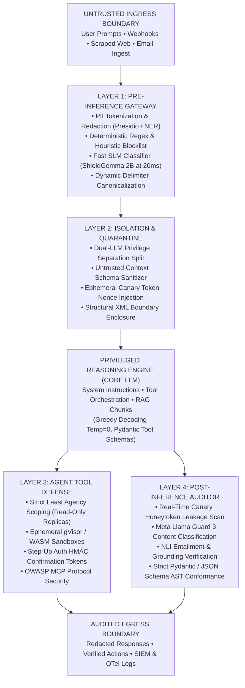
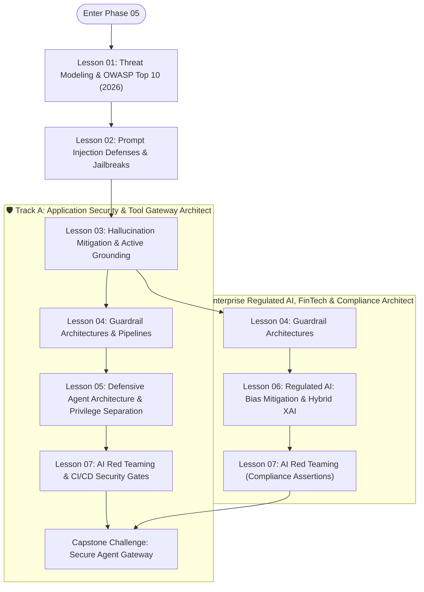

# Phase 05: AI Security, Guardrails & Trust Architecture

> **A definitive engineering handbook for Senior Developers, Security Architects, and AI Engineers designing, hardening, and deploying resilient enterprise LLM applications, defensive guardrail pipelines, and autonomous agent gateways.**

---

### Step-by-Step Diagram Walkthrough:
1. **Untrusted Ingress Boundary**: Captures all external inputs (chat queries, webhook payloads, support emails, scraped web data, and vector search chunks).
2. **Layer 1 (Pre-Inference Gateway)**: Intercepts raw text before tokenization. It enforces token rate limits, strips PII via an entity tokenization vault, runs sub-millisecond regex blocklists, and executes a high-speed Small Language Model (SLM) classifier (**Google ShieldGemma 2B** at 15–25ms) to reject overt jailbreaks.
3. **Layer 2 (Isolation & Quarantine)**: Enforces the **Dual-LLM Privilege Separation Pattern**. A zero-tool Reader LLM extracts structured data into strict Pydantic schemas. The gateway wraps external data in dynamic randomized XML delimiters (`secrets.token_hex(8)`) and injects unique cryptographic canary tokens into the system prompt.
4. **Privileged Reasoning Engine**: The core foundation model processes trusted instructions and validated JSON data under greedy decoding (`Temperature = 0.0`).
5. **Layer 3 (Agent Tool Defense)**: Mediates between the model and enterprise infrastructure. Tools query read-only database replicas, untrusted dynamic code executes inside gVisor (`runsc`) or WebAssembly (WASM) sandboxes with `--network none`, state mutations require out-of-band HMAC confirmation tokens, and MCP servers are policed against tool poisoning.
6. **Layer 4 (Post-Inference Auditor)**: Audits the completion before delivery. It checks for canary token leakage, verifies categorical safety via **Meta Llama Guard 3**, validates citation offsets and Natural Language Inference (NLI) entailment, and enforces structural schema conformance.
7. **Audited Egress Boundary**: Emits clean responses to the client while recording full OpenTelemetry traces to enterprise SIEM monitors.

---

## 🎯 The Senior Lead Mental Model

In traditional software engineering, application security rests on deterministic memory segmentation, compiler boundaries, and parameterized SQL bindings. Large Language Models (LLMs) shatter this assumption.

Because LLMs represent the **ultimate Von Neumann architecture**—concatenating developer instructions and untrusted data into a single, linear token stream where self-attention attends across all tokens indiscriminately—**prompt injection is an inherent structural reality of the transformer, not a simple input sanitization bug.**

As an AI Systems Architect, your mental model must shift:
1. **Assume Breach at the Model Layer**: Treat the foundation model as an untrusted, probabilistic execution runtime.
2. **Defend at the Infrastructure Layer**: Enforce deterministic, zero-trust controls across inputs, outputs, memory, network, and tool execution.
3. **Defense-in-Depth**: No single layer (system prompt, semantic classifier, or output filter) suffices. Security requires an orchestrated, multi-tier pipeline.

---

## 🧭 Master Lesson Navigation Directory

Phase 05 is decomposed into **7 modular, progressive lessons** designed for Staff and Senior Engineers:

| Lesson | Depth Tier | Est. Time | Core Architectural Scope |
|---|:---:|:---:|---|
| **[01. AI Threat Modeling & The OWASP Top 10 (2026)](./01-threat-modeling-and-owasp-top-10.md)** | `🟢 Tier 1: Core` | 45 min | Attention plane vs. control plane collision; Von Neumann hardware duality; **OWASP Top 10 for LLM Applications 2026** (empirical dataset of 7,714 incidents); **OWASP Agentic Top 10 (ASI01–10)**; Trust Boundary model. |
| **[02. Prompt Injection Defenses & Jailbreaks](./02-prompt-injection-defenses-and-jailbreaks.md)** | `🟢 Tier 1: Core` | 50 min | Direct vs. indirect prompt injections; delimiter escaping; GCG adversarial suffixes; multimodal visual injections; Markdown exfiltration tags (``); dynamic XML delimiters (`secrets.token_hex(8)`); canary honeytokens. |
| **[03. Hallucination Mitigation & Active Grounding](./03-hallucination-mitigation-and-active-grounding.md)** | `🟡 Tier 2: Depth` | 50 min | Intrinsic vs. extrinsic hallucinations; character-level and token-offset citations (`document.text[start:end] == quote`); NLI cross-encoder verification loops; grammar-constrained decoding (CFG / JSON schemas). |
| **[04. Guardrail Architectures & Defensive Pipelines](./04-guardrail-architectures-and-defensive-pipelines.md)** | `🟡 Tier 2: Depth` | 55 min | Ingress vs. egress guardrail topology; Tiered Latency Budgeting (Tier 0 Regex <1ms → Tier 1 ShieldGemma 2B 10–25ms → Tier 2 Llama Guard 3 100–300ms); Presidio PII vaults; NeMo Colang; Guardrails AI AST assertions. |
| **[05. Defensive Agent Architecture & Privilege Separation](./05-defensive-agent-architecture-and-privilege-separation.md)** | `🔵 Tier 3: Advanced` | 55 min | The Dual-LLM Privilege Separation Pattern (Reader LLM + Orchestrator LLM); Least Agency; gVisor/WASM sandboxes; HITL HMAC tokens; **OWASP Model Context Protocol (MCP) Top 10** tool poisoning defenses. |
| **[06. Regulated AI Compliance: CI/CD Fairness & Explainable AI](./06-regulated-ai-bias-mitigation-and-explainable-ai.md)** | `⚫ Tier 4: Deep Dive` | 60 min | EU AI Act Article 15; Disparate Impact Ratio (DIR ≥ 0.80 Four-Fifths rule); complete `test_fairness_cicd.py` (Fairlearn + pytest); TreeSHAP local attributions bounded to statutory reason codes (`hybrid_xai_adverse_action.py`). |
| **[07. AI Red Teaming: Vulnerability Fuzzing & CI/CD Gates](./07-ai-red-teaming-and-vulnerability-evaluation.md)** | `🟡 Tier 2: Depth` | 50 min | Automated fuzzing with NVIDIA Garak; deep exploit campaigns with Microsoft PyRIT; declarative YAML security regression gates with Promptfoo in GitHub Actions; operationalizing the 20-vector benchmark suite. |

---

## 🗺️ Recommended Learning Pathways

### Step-by-Step Diagram Walkthrough:
1. **Core Security Foundation**: All learners start through Lessons 01–03, mastering the physics of prompt injection, Von Neumann attention duality, and active hallucination mitigation.
2. **Track A (Tool & Application Security)**: Engineers building agent runtimes continue through Lessons 04, 05, and 07, implementing Dual-LLM quarantine, MCP security, and automated CI/CD red-teaming gates.
3. **Track B (Regulated AI & FinTech)**: Architects operating under statutory oversight branch through Lessons 04, 06, and 07, mastering demographic fairness CI/CD gates and TreeSHAP explainability.
4. **Unified Capstone Verification**: Both tracks converge on the Capstone Challenge, defending an agent gateway against 20 distinct adversarial vectors.

* **Track A (Application Security & Tool Gateway Architect)**: Focuses on prompt injection defenses, high-throughput guardrail middleware (ShieldGemma, Llama Guard 3), Dual-LLM quarantine, MCP tool security, and automated CI/CD red teaming with Promptfoo.
* **Track B (Enterprise Regulated AI, FinTech & Compliance Architect)**: Focuses on statutory compliance (EU AI Act, ECOA, CFPB), algorithmic fairness assertions in CI/CD with Fairlearn, and deterministic Explainable AI (TreeSHAP bounded to adverse action notices).

---

## 🛠️ Enterprise Reference Implementations

The phase includes runnable, production-grade security implementations in [`examples/`](./examples/):

| File | Language / Runtime | Architectural Pattern | Primary Capabilities |
|---|---|---|---|
| **[`examples/guardrail_pipeline.py`](./examples/guardrail_pipeline.py)** | Python 3.12+ | Multi-Stage Defensive Pipeline | PII tokenization and masking (regex + entity recognition), ephemeral canary token injection, Llama Guard safety classification. |
| **[`examples/GuardrailMiddleware.cs`](./examples/GuardrailMiddleware.cs)** | C# / .NET 9 | ASP.NET Core Middleware | Semantic Kernel request interception, prompt sanitization, secret leakage prevention, OWASP Top 10 mitigation. |

---

## 🏆 Capstone Engineering Challenge

> **The Secure Enterprise Agent Gateway**
> 
> Architect and build an end-to-end, production-grade Secure Agent Gateway protecting an enterprise agent possessing database query and email dispatch tools against direct and indirect prompt injections. Achieve **100% defense against RCE and data exfiltration** while passing an automated evaluation suite of **20 adversarial attack test vectors**.
> 
> 👉 **[Launch Capstone Challenge Specification](./labs/capstone-security-guardrails.md)**

---

## 📚 Curated Bibliography & Authoritative Standards

### Official Standards & Frameworks
* **[OWASP GenAI Security Project](https://genai.owasp.org/)**: Home of the **OWASP Top 10 for LLM Applications 2026**, the **OWASP Top 10 for Agentic Applications (2026)**, and the **OWASP MCP Top 10**.
* **[Google Secure AI Framework (SAIF)](https://saif.google/)**: Practitioner guidance for securing AI systems against emerging threats.
* **[NIST AI Risk Management Framework (AI RMF 1.0)](https://www.nist.gov/itl/ai-risk-management-framework)**: Federal framework for governing, measuring, and managing AI risk.
* **[MITRE ATLAS (Adversarial Threat Landscape for AI Systems)](https://atlas.mitre.org/)**: Threat matrix of adversary tactics, techniques, and real-world AI incidents.

### Frontier Research & Defensive Toolkits
* **[Simon Willison — Prompt Injection Series](https://simonwillison.net/series/prompt-injection/)**: Landmark architectural essays formulating direct/indirect injections and the Dual-LLM quarantine pattern.
* **[Google ShieldGemma](https://github.com/google/shieldgemma)**: High-speed 2B parameter safety model optimized for low-latency pre-inference filtering.
* **[Meta Llama Guard 3](https://huggingface.co/meta-llama/Llama-Guard-3-8B)**: Dedicated safety classifier covering 13 hazard categories across text and multimodal vision.
* **[NVIDIA NeMo Guardrails](https://github.com/NVIDIA/NeMo-Guardrails)**: Programmable dialog control using Colang 2.0.
* **[Promptfoo](https://promptfoo.dev/)**: Configuration-driven LLM evaluation and CI/CD security regression release gates.
* **[Microsoft PyRIT](https://github.com/Azure/PyRIT)**: Python Risk Identification Toolkit for multi-turn adversarial red teaming.
* **[NVIDIA Garak](https://github.com/NVIDIA/garak)**: Generative AI vulnerability scanner and fuzzer.
* **[Microsoft Fairlearn](https://fairlearn.org/)**: Automated algorithmic fairness testing in CI/CD pipelines.

---

## 🧭 Global Curriculum Navigation

| Previous Phase | Current Phase | Next Phase |
|---|---|---|
| [← Phase 04: Stateful Agent Orchestration](../04-agentic-systems-and-orchestration/README.md) | **Phase 05: AI Security & Guardrails** | [Phase 06: GenAI Evals & Observability →](../06-evals-and-observability/README.md) |
