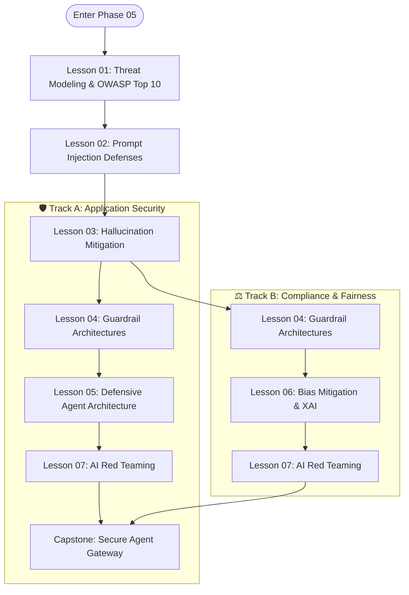

# Phase 05: AI Security, Guardrails & Trust Architecture

> **A guide for software developers and security engineers on designing resilient AI applications, defensive pipelines, and safe autonomous agents.**

---

## 🎯 Phase Engineering Goal

This phase covers how to secure AI applications against prompt injection, data leakage, and excessive agency.

Large Language Models (LLMs) combine your code's instructions and untrusted user input into a single text stream. This makes prompt injection a fundamental architectural challenge, not just a simple sanitization bug. 

By the end of this phase, you will understand:
1. **Threat Modeling**: The OWASP Top 10 for LLMs and Agents.
2. **Defensive Guardrails**: Building pipelines to filter input and audit output.
3. **Privilege Separation**: Using a Dual-LLM pattern to isolate untrusted data.
4. **Tool Sandboxing**: Safely executing code and controlling agent capabilities.
5. **Red Teaming**: Automating security testing in CI/CD pipelines.

---

## 🗺️ Learning Path & System Topology

Phase 05 accommodates two distinct engineering learning profiles:

### Modular Curriculum Directory

| Lesson | Title | Tier Badge | Concept |
|:---:|---|:---:|---|
| **01** | [AI Threat Modeling & OWASP Top 10](./01-threat-modeling-and-owasp-top-10.md) | `HIGH ROI / CORE` | OWASP Top 10 for LLMs; attention plane vs. control plane. |
| **02** | [Prompt Injection Defenses & Jailbreaks](./02-prompt-injection-defenses-and-jailbreaks.md) | `HIGH ROI / CORE` | Direct and indirect prompt injection, data exfiltration defenses. |
| **03** | [Hallucination Mitigation & Grounding](./03-hallucination-mitigation-and-active-grounding.md) | `IMPORTANT / NEXT` | Citation tracking, grounding verification, grammar-constrained decoding. |
| **04** | [Guardrail Architectures & Defensive Pipelines](./04-guardrail-architectures-and-defensive-pipelines.md) | `IMPORTANT / NEXT` | Input/output filtering pipelines, PII redaction, safety classifiers. |
| **05** | [Defensive Agent Architecture](./05-defensive-agent-architecture-and-privilege-separation.md) | `ADVANCED / SPECIALIZED` | Dual-LLM pattern, sandboxes (gVisor/WASM), least agency. |
| **06** | [Regulated AI: Bias Mitigation & XAI](./06-regulated-ai-bias-mitigation-and-explainable-ai.md) | `ADVANCED / SPECIALIZED` | Fairness testing, Explainable AI (TreeSHAP). |
| **07** | [AI Red Teaming & Vulnerability Evaluation](./07-ai-red-teaming-and-vulnerability-evaluation.md) | `REFERENCE / AWARENESS` | Fuzzing tools (Garak, PyRIT), CI/CD security regression testing. |

---

## 🛠️ Reference Implementations

The phase includes runnable, production-grade security implementations in [`examples/`](./examples/):

| File | Language / Runtime | Primary Capabilities |
|---|---|---|
| **[`examples/guardrail_pipeline.py`](./examples/guardrail_pipeline.py)** | Python 3.12+ | PII masking, canary token injection, safety classification. |
| **[`examples/GuardrailMiddleware.cs`](./examples/GuardrailMiddleware.cs)** | C# / .NET 9 | Prompt sanitization, secret leakage prevention. |

---

## 🏆 Capstone Engineering Challenge

> **The Secure Enterprise Agent Gateway**
> 
> Build a Secure Agent Gateway protecting an enterprise agent against direct and indirect prompt injections, passing a test suite of adversarial attacks.
> 
> 👉 **[Launch Capstone Challenge Specification](./labs/capstone-security-guardrails.md)**

---

## 🧭 Global Curriculum Navigation

| Previous Phase | Current Phase | Next Phase |
|---|---|---|
| [← Phase 04: Stateful Agent Orchestration](../04-agentic-systems-and-orchestration/README.md) | **Phase 05: AI Security & Guardrails** | [Phase 06: GenAI Evals & Observability →](../06-evals-and-observability/README.md) |
