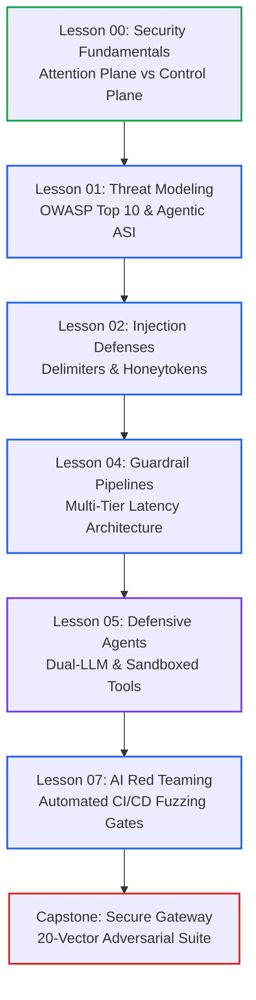
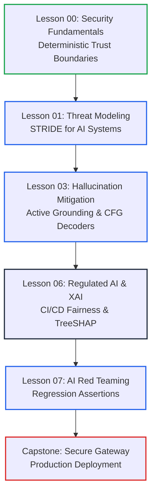

# Phase 05: AI Security, Guardrails & Trust Architecture

> **A guide for systems engineers on designing resilient AI applications, defensive guardrail pipelines, and safe autonomous agents.**

---

## 🎯 Phase Engineering Goal

This phase covers how to secure AI applications against prompt injection, data exfiltration, and excessive agency.

Large Language Models (LLMs) combine software instructions and untrusted external input into a single text stream. This makes prompt injection a fundamental architectural challenge, not just a simple sanitization bug.

By the end of this phase, you will master:
1. **Foundations**: The attention plane vs control plane trust boundary and Defense-in-Depth.
2. **Threat Modeling**: The OWASP Top 10 for LLMs and Agentic Systems (ASI01–ASI10).
3. **Defensive Guardrails**: Multi-tier latency pipelines, PII vaulting, and safety classifiers.
4. **Privilege Separation**: Isolating untrusted data using the Dual-LLM pattern.
5. **Tool Sandboxing**: Least Agency enforcement, HMAC confirmation tokens, and runtime isolation.
6. **Regulated Compliance**: CI/CD fairness assertions (DIR >= 0.80) and hybrid Explainable AI (TreeSHAP).
7. **Automated Red Teaming**: Version-controlled regression release gates with Promptfoo, Garak, and PyRIT.

---

## 🗺️ Learning Path & System Topology

Phase 05 accommodates two distinct engineering learning tracks:

### Track A: Application Security & Autonomous Agent Defense (<8 Nodes)

---

### Track B: Regulated Systems, Fairness & Output Trust (<8 Nodes)

---

## 📚 Master Curriculum Directory

| Lesson | Title | Tier | Read Time | Core Engineering Concept |
|:---:|---|:---:|:---:|---|
| **00** | [AI Security Fundamentals & Defense-in-Depth](./00-ai-security-fundamentals-and-defense-in-depth.md) | `🟢 Core` | ~12 min | Attention plane vs control plane trust boundaries and the 5-layer defensive stack. |
| **01** | [AI Threat Modeling & OWASP Top 10](./01-threat-modeling-and-owasp-top-10.md) | `🟡 Engineering Depth` | ~15 min | STRIDE for AI, OWASP Top 10 for LLMs 2026, and OWASP Agentic Top 10 (ASI01–ASI10). |
| **02** | [Prompt Injection Defenses & Jailbreaks](./02-prompt-injection-defenses-and-jailbreaks.md) | `🟡 Engineering Depth` | ~18 min | Dynamic XML delimiters, canary honeytokens, and Markdown exfiltration CSP headers. |
| **03** | [Hallucination Mitigation & Active Grounding](./03-hallucination-mitigation-and-active-grounding.md) | `🟡 Engineering Depth` | ~15 min | Character-offset grounding auditors and Classifier-Free Guidance (CFG) decoding. |
| **04** | [Guardrail Architectures & Defensive Pipelines](./04-guardrail-architectures-and-defensive-pipelines.md) | `🟡 Engineering Depth` | ~18 min | Multi-tier latency budgeting (<30ms pre, <150ms post) and safety classifiers. |
| **05** | [Defensive Agent Architecture](./05-defensive-agent-architecture-and-privilege-separation.md) | `🔵 Advanced` | ~18 min | Dual-LLM quarantine, Least Agency tool scoping, and two-phase HMAC proposals. |
| **06** | [Regulated AI: Bias Mitigation & Explainable AI](./06-regulated-ai-bias-mitigation-and-explainable-ai.md) | `⚫ Deep Dive` | ~25 min | EU AI Act mandates, CI/CD fairness assertions (DIR >= 0.80), and TreeSHAP attribution. |
| **07** | [AI Red Teaming & Vulnerability Evaluation](./07-ai-red-teaming-and-vulnerability-evaluation.md) | `🟡 Engineering Depth` | ~18 min | 3-tier red-teaming stack (Garak, PyRIT, Promptfoo) and pull request release gates. |

---

## 🛠️ Reference Implementations

The phase includes runnable security implementations in [`examples/`](./examples/):

| File | Language / Runtime | Primary Capabilities |
|---|---|---|
| **[`examples/guardrail_pipeline.py`](./examples/guardrail_pipeline.py)** | Python 3.12+ | PII masking, canary token injection, safety classification. |
| **[`examples/GuardrailMiddleware.cs`](./examples/GuardrailMiddleware.cs)** | C# / .NET 9 | Prompt sanitization, secret leakage prevention. |

---

## 🏆 Capstone Engineering Challenge

> **The Secure Enterprise Agent Gateway**  
> Architect and deploy a defense-in-depth API gateway protecting enterprise tools against 20 automated adversarial attack vectors while preserving sub-100ms non-inference latency budgets.  
>  
> 👉 **[Launch Capstone Challenge Specification](./labs/capstone-security-guardrails.md)**

---

## 🧭 Global Curriculum Navigation

| Previous Phase | Current Phase | Next Phase |
|---|---|---|
| [← Phase 04: Stateful Agent Orchestration](../04-agentic-systems-and-orchestration/README.md) | **Phase 05: AI Security & Guardrails** | [Phase 06: GenAI Evals & Observability →](../06-evals-and-observability/README.md) |
