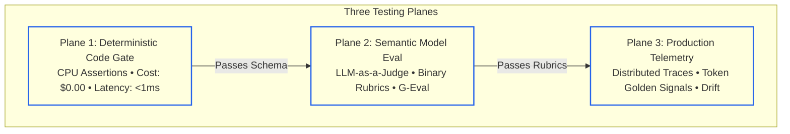
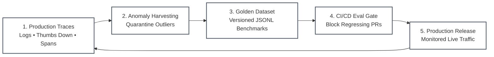

# Lesson 00: Evaluation and Observability Foundations: Moving from Deterministic Assertions to Probabilistic Verification

> **Tier**: `🟢 Core` | **Read time**: ~12 min | **Prerequisites**: [Phase 05: AI Security & Guardrails](../05-ai-security-and-guardrails/README.md)  
> **Core Concept**: Generative AI models produce probabilistic distributions rather than deterministic values, requiring multi-signal evaluation harnesses instead of single-string equality assertions.  
> **New AI terms introduced**: evaluation (eval), ground truth, golden dataset, benchmark, LLM-as-a-Judge, trace span, generation span  
> **AI terms assumed from earlier lessons**: [large language model (LLM)](../00-foundations-and-token-mechanics/00-what-is-an-llm.md), [prompt](../01-prompt-and-context-engineering/00-prompt-engineering-fundamentals-roles-and-in-context-learning.md), [token](../00-foundations-and-token-mechanics/01-tokenization-and-bpe-mechanics.md), [context window](../00-foundations-and-token-mechanics/02-transformer-and-hardware-physics.md), [inference](../00-foundations-and-token-mechanics/03-kv-cache-vram-and-bandwidth-physics.md), [hallucination](../05-ai-security-and-guardrails/03-hallucination-mitigation-and-active-grounding.md), [tool calling](../03-tools-and-model-context-protocol/00-tool-use-and-mcp-fundamentals.md), [agent](../04-agentic-systems-and-orchestration/00-agentic-systems-and-control-plane-fundamentals.md)

---

## 🎯 What You Will Learn

- Why exact string equality fails on non-deterministic generative models.
- How to apply the Three Testing Planes: code gates, model judges, and production telemetry.
- How the Continuous Evaluation Flywheel turns production anomalies into regression tests.
- How to build a fast, offline multi-signal evaluation gate using Pydantic v2.

---

## 1. The Problem

Senior backend engineers rely on automated unit tests. In standard microservices, testing is binary:

```text
assert response.status_code == 200
assert response.json()["account_id"] == "acc_1092"
assert len(response.json()["transactions"]) == 3
```

A non-zero exit code stops bad code from reaching production.

When engineering generative AI systems, this approach breaks down. An AI model does not run predefined if-else code branches. It samples tokens sequentially from a vocabulary of roughly 100,000 possibilities based on probability odds.

Consider an AI support assistant answering an account cancellation request:
- Run 1 outputs: `"Your account has been successfully canceled."`
- Run 2 outputs: `"I have completed your account cancellation request."`
- Run 3 outputs: `"Account acc_1092 is now terminated."`

All three responses are semantically correct. However, a traditional test asserting `output == "Your account has been successfully canceled"` fails on Run 2 and Run 3.

```text
Traditional Test:  Expected "Your account has been successfully canceled"
Observed Output:   "I have completed your account cancellation request."
Result:            ASSERTION FAILED (False Alarm)
```

Frustrated by false alarms, engineering teams frequently abandon automated unit tests. Instead, they resort to **"vibe checks"**: pasting three prompts into a playground, checking responses by eye, and shipping to production.

This absence of testing creates three production failures:
1. **Silent Schema Regressions**: A prompt update intended to improve tone quietly causes the model to omit required fields in tool calls, crashing downstream services.
2. **Economic Blowouts**: A minor system prompt edit doubles input token count, quietly inflating cloud API expenses across millions of monthly requests.
3. **Unseen Quality Drift**: A cloud vendor updates hosted model weights, reducing response accuracy on edge cases without triggering an alert.

You cannot control a probabilistic engine with prompt optimism. You control it through continuous, multi-signal evaluation harnesses.

---

## 2. Mental Model: The Digital Gate vs The Analog Oscilloscope

To understand AI evaluation, contrast a digital logic gate with an analog oscilloscope:

```text
Traditional Software (Digital Gate):
Input [1] ───> [AND Gate] ───> Output: Exactly [1] or [0] (Binary True/False)

Generative AI (Analog Signal):
Prompt ─────> [Probabilistic Engine] ───> Continuous Output Waveform
                                           ├── Amplitude (Factual Accuracy)
                                           ├── Frequency Bounds (Token Budget)
                                           └── Harmonic Distortion (Schema Adherence)
```

In traditional software, execution is digital. A function either matches the contract or fails. Testing checks whether the digital state is high or low.

In generative AI, execution is analog. The model outputs a rich semantic waveform. You cannot evaluate it with a single equality check. Instead, you attach an oscilloscope to measure multiple signals:
- Is the signal within the structural channel (valid JSON schema)?
- Does the amplitude stay within safe limits (token and latency limits)?
- Does the frequency carry the required information (key domain entities)?

> **Where this analogy breaks:**  
> An analog circuit obeys immutable laws of physics like Ohm's Law. Given identical voltage and resistance, current is always identical. A language model is non-deterministic by design when running with non-zero temperature. Even with temperature set to zero, GPU concurrency variations can alter output tokens.

---

## 3. Why Naive Approaches Fail

When teams attempt to test AI applications without a formal evaluation strategy, they typically fall into one of three traps:

### Naive Approach 1: Strict String Matching
Teams assert exact string equality or tight substring matches:

```text
assert response.text == expected_text  # Fails on 95% of valid responses
```

**Why it fails:** Natural language allows infinite valid variations. An exact match fails on synonyms, rephrasing, or punctuation differences. The test suite becomes brittle, generates endless false alarms, and gets ignored.

### Naive Approach 2: Manual Playground Testing ("Vibe Checks")
Engineers test prompts interactively in a developer console before committing changes.

**Why it fails:** Manual inspection provides zero regression visibility. An engineer testing 3 prompts cannot predict how a change impacts the remaining 500 business use cases. Regressions slip into production silently.

### Naive Approach 3: Relying Exclusively on LLM Judges
Teams bypass code assertions and send every candidate output directly to a frontier model judge (such as Claude 3.7 Sonnet as of 2025-02).

**Why it fails:** Querying a frontier model for every test is slow and expensive. Running 200 tests takes minutes and costs dollars per pull request. Uncalibrated language models also suffer from position and verbosity biases.

---

## 4. How It Works: The Three Testing Planes and the Evaluation Flywheel

Production teams evaluate AI applications across three distinct planes:



### Visual Walkthrough
1. **Plane 1 (Deterministic Code Gate)**: Runs locally on CPU with zero API cost in sub-millisecond time. It checks structural schemas, banned substrings, and execution budgets.
2. **Plane 2 (Semantic Model Eval)**: Evaluates semantic quality, factual groundedness, and rubric compliance using calibrated model judges.
3. **Plane 3 (Production Telemetry)**: Continuously observes live requests in production, collecting OpenTelemetry spans and user feedback.

### The Continuous Evaluation Flywheel

Evaluation is not a one-time gate before launch. It is a continuous operational flywheel:



### Visual Walkthrough
1. **Production Traces**: The running system logs user interactions, latency spikes, and explicit user feedback.
2. **Anomaly Harvesting**: Automated filters isolate edge-case failures, ungrounded answers, and user complaints.
3. **Golden Dataset**: Engineers curate harvested failures into a version-controlled benchmark dataset.
4. **CI/CD Eval Gate**: Automated regression pipelines run the golden dataset against every pull request.
5. **Production Release**: Verified prompts and agents deploy to production, closing the feedback loop.

---

## 5. Implementation: Minimal Offline Multi-Signal Evaluator

The following complete, runnable Python 3.12+ script demonstrates why exact string equality fails on valid paraphrases, and how a multi-signal evaluator tests non-deterministic outputs using schema validation, length boundaries, and keyword presence:

```python
"""Minimal Offline Multi-Signal Evaluator.

Demonstrates the contrast between fragile string equality and robust,
multi-signal evaluation for non-deterministic model outputs.
"""

from typing import Annotated
from pydantic import BaseModel, Field, ValidationError


class SupportTicketResolution(BaseModel):
    """Structured resolution emitted by an AI support assistant."""

    account_id: str
    status: Annotated[str, Field(pattern="^(resolved|escalated|pending)$")]
    explanation: str
    action_taken: str


def evaluate_string_equality(observed: str, expected: str) -> bool:
    """Naive evaluation: exact string equality check."""
    return observed.strip() == expected.strip()


def evaluate_multi_signal(
    raw_payload: str,
    required_keywords: list[str],
    max_explanation_words: int = 50,
) -> tuple[bool, list[str]]:
    """Robust multi-signal evaluation gate.
    
    Checks three distinct signals:
    1. Schema validation (Pydantic structure and enum correctness)
    2. Operational bounds (word count limits)
    3. Semantic keyword presence (domain coverage)
    """
    reasons: list[str] = []

    # Signal 1: Deterministic schema parsing
    try:
        record = SupportTicketResolution.model_validate_json(raw_payload)
    except ValidationError as err:
        return False, [f"Schema violation: {err.errors()[0]['msg']}"]

    # Signal 2: Operational bounds check
    words = record.explanation.split()
    if len(words) > max_explanation_words:
        reasons.append(
            f"Explanation exceeds budget: {len(words)} > {max_explanation_words} words"
        )

    # Signal 3: Semantic keyword presence
    explanation_lower = record.explanation.lower()
    for kw in required_keywords:
        if kw.lower() not in explanation_lower:
            reasons.append(f"Missing required domain keyword: '{kw}'")

    passed = len(reasons) == 0
    return passed, reasons


if __name__ == "__main__":
    expected_text = (
        '{"account_id": "acc_9021", "status": "resolved", '
        '"explanation": "Your subscription is canceled immediately.", '
        '"action_taken": "cancel_recurring_billing"}'
    )

    # Paraphrase generated by the model during a test run
    observed_candidate = (
        '{"account_id": "acc_9021", "status": "resolved", '
        '"explanation": "I have completed your subscription cancellation without penalties.", '
        '"action_taken": "cancel_recurring_billing"}'
    )

    print("--- 1. Naive Exact String Equality Test ---")
    naive_result = evaluate_string_equality(observed_candidate, expected_text)
    print(f"Result: {'PASS' if naive_result else 'FAIL (False Alarm)'}")

    print("\n--- 2. Multi-Signal Evaluation Gate ---")
    required_terms = ["subscription", "cancellation"]
    passed, issues = evaluate_multi_signal(
        raw_payload=observed_candidate,
        required_keywords=required_terms,
        max_explanation_words=25,
    )

    if passed:
        print("Result: PASS")
        print("Verified schema validity, word budget, and required domain terms.")
    else:
        print("Result: FAIL")
        for issue in issues:
            print(f"- {issue}")
```

### Execution Verification
When executed with Python 3.12+, the script produces the following output:

```text
--- 1. Naive Exact String Equality Test ---
Result: FAIL (False Alarm)

--- 2. Multi-Signal Evaluation Gate ---
Result: PASS
Verified schema validity, word budget, and required domain terms.
```

---

## 6. Trade-offs and Failure Modes

### Evaluation Strategy Trade-Off Matrix

| Evaluation Technique | Latency (per test) | Financial Cost | Semantic Flexibility | Deterministic Precision | Best Suited For |
|---|:---:|:---:|:---:|:---:|---|
| **Exact String Match** | <0.1 ms | $0.00 | None (Fragile) | 100% | Fixed entity IDs, UUIDs, enum codes |
| **Heuristic Multi-Signal** | <1 ms | $0.00 | Moderate | High | Schemas, word budgets, required keywords |
| **LLM-as-a-Judge** | 500–2,000 ms | $0.005–$0.03 | High | Moderate (Needs Calibration) | Nuanced reasoning, empathy, tone |
| **Human Expert Review** | Hours / Days | $2.00–$10.00 | Highest | Variable | Calibration gold sets, policy audits |

### Common Production Failure Modes

1. **The False Reject Trap**: Relying on strict string matching causes high false alarm rates. Engineers get alert fatigue and turn off automated CI/CD checks, leaving production unmonitored.
2. **The Class Imbalance Illusion**: If a golden dataset consists of 95% simple, passing requests, a naive model or judge that always outputs "PASS" appears 95% accurate. Always calculate chance-adjusted metrics on balanced test sets.
3. **Evaluation Dataset Contamination**: Generating test cases with the same model used in production produces circular confirmation bias. Curate evaluation sets from real production anomalies and independent human experts.

---

## 7. ✅ Quick Check

You maintain an automated customer onboarding agent. A junior engineer submits a pull request updating the agent's prompt to sound friendlier. The PR passes all manual tests in the web console. However, when run against the automated evaluation harness, 40 out of 100 tests fail on the deterministic code gate.

Inspecting the failures reveals the model started generating:
```json
{
  "customer_id": "cust_441",
  "status": "active",
  "welcome_note": "Welcome aboard! Let's get started!"
}
```
Instead of the required schema:
```json
{
  "customer_id": "cust_441",
  "status": "active",
  "onboarding_stage": "profile_complete"
}
```

What went wrong, and why did the deterministic gate catch it when manual testing did not?

<details>
<summary>Suggested Solution</summary>

**What went wrong:**  
The prompt edit unintentionally modified the model's token attention weights. In addition to adding conversational friendliness, the model dropped the required field `onboarding_stage` and hallucinated an unexpected field `welcome_note`.

**Why the deterministic gate caught it:**  
The manual tester checked conversational tone on three arbitrary inputs and missed the missing field. The deterministic Level 1 code gate parsed the response using strict Pydantic schema validation. Because `onboarding_stage` is a required field, Pydantic raised a `ValidationError` in sub-millisecond time on CPU for $0.00, blocking the breaking change before it reached production microservices.

</details>

---

## 🧭 Navigation

- **Previous**: [Phase 05: AI Security & Guardrails](../05-ai-security-and-guardrails/README.md)
- **Phase Hub**: [Phase 06 Overview & Architecture Hub](./README.md)
- **Next**: [Lesson 01: Evaluation Hierarchy & Deterministic Testing](./01-evaluation-hierarchy-and-deterministic-testing.md)
- **Capstone Lab**: [Automated CI/CD Evaluation Pipeline](./labs/capstone-cicd-evaluation-pipeline.md)
