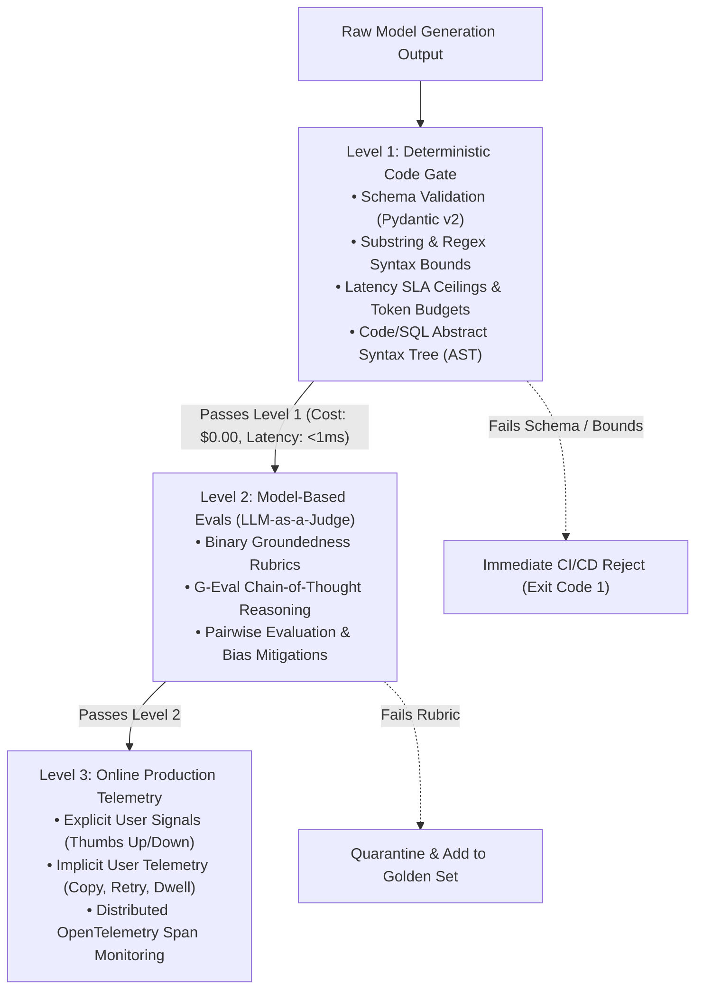
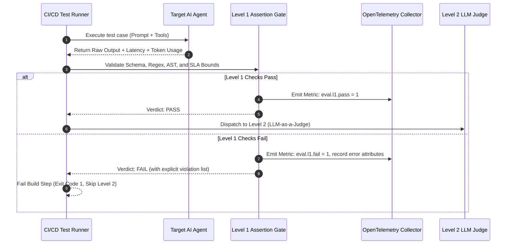

# Evaluation Hierarchy & Deterministic Testing: Building the Level 1 Safety Gate

> **[Tier: 🟢 Core]**  
> **Core Concept**: Large Language Models are stochastic neural networks whose non-deterministic outputs must be constrained by fast, zero-cost deterministic code assertions before escalating to expensive model-based evaluations.

---

## 🎯 What You Will Learn
- How to structure a production Continuous Evaluation (Eval) harness using Hamel Husain's Three-Level Hierarchy.
- Why manual testing ("vibe checks") guarantees silent schema breakages and budget blowouts in production.
- How to implement Level 1 deterministic validation gates using Pydantic v2 schemas, regex bounds, latency ceilings, and Abstract Syntax Tree (AST) validation.
- How to integrate developer-first evaluation gates into standard testing workflows using DeepEval and pytest.

---

## 1. The Problem

Enterprise software teams never merge code without automated unit tests, integration suites, and Application Performance Monitoring (APM) budgets. Yet teams building with Large Language Models (LLMs)—deep neural networks trained to predict the next token based on statistical probabilities—frequently update prompts, swap model checkpoints, and deploy agents based entirely on manual **"vibe checks."** A developer tests three arbitrary prompts in an interactive playground, observes pleasing responses, and ships the change to production.

This informal practice triggers three severe failure modes in production systems:
1. **Silent Schema Breakages**: A prompt edit intended to soften conversational tone silently strips a required property from downstream JSON payloads, breaking downstream microservices for international users.
2. **Tool Parameter Hallucinations**: Upgrading from a previous model checkpoint causes the LLM to emit string literals where an API schema mandates an ISO 8601 timestamp or an integer UUID.
3. **Uncontrolled Cost & Latency Regressions**: A patch designed to harden system instructions doubles prompt context length, quietly increasing inference latency by 800ms and inflating cloud API expenditures.

Traditional software fails loudly at compile time or during automated unit tests. Generative AI systems fail silently, generating grammatically fluent, perfectly formatted text that is structurally or factually broken.

---

## 2. The Core Idea & Why Naive Fails

The fundamental architectural principle of AI engineering is straightforward:

```text
Stochastic Neural Networks REQUIRE Deterministic Software Harnesses.
```

You cannot control the non-deterministic output of a large language model through prompt optimism. You control it through automated regression matrices, strict schema validation gates, and deterministic code assertions.

### Why Naive Approaches Fail
The naive approach to testing an LLM application is to send every candidate generation to an expensive model-based evaluator (an "LLM-as-a-Judge") or a human review team. 

This naive strategy collapses under production engineering realities:
* **Prohibitive Latency**: Querying a frontier model (such as Claude 3.7 or GPT-4o) to evaluate a test case takes 1,000ms to 3,000ms per check. Running a 500-test regression suite takes over 20 minutes if executed synchronously.
* **Prohibitive Financial Cost**: Evaluating 500 tests with multi-thousand-token prompts costs between \$5.00 and \$15.00 per pull request. Teams quickly disable the test suite to save costs.
* **Wasted Diagnostic Resolution**: Spending \$0.02 and 2 seconds of GPU compute to discover that the model output malformed JSON or exceeded an execution latency ceiling is an architectural anti-pattern. If a candidate response violates basic schema syntax or exceeds latency budgets, it should fail in sub-millisecond time on CPU.

---

## 3. Mental Model

Think of evaluation as an **inverted filtering funnel** or a **high-throughput compiler pipeline**:



### Visual Walkthrough
1. **Raw Model Generation Output**: The stochastic text stream emitted by the model arrives at the evaluation harness.
2. **Level 1: Deterministic Code Gate**: Runs instantaneously on local CPU with zero API cost (<1ms). It checks structural integrity: JSON schema conformity, regex syntax, token limits, and AST parseability.
3. **Immediate Rejection**: If Level 1 fails, the build terminates immediately. The candidate output is never sent to expensive downstream evaluators.
4. **Level 2: Model-Based Evals**: Only responses that satisfy all structural preconditions reach Level 2, where an LLM judge evaluates semantic accuracy, conversational nuance, and factual groundedness.
5. **Level 3: Online Production Telemetry**: Deployed systems stream real-world user interactions and OpenTelemetry traces to detect production anomalies and enrich future test sets.

---

## 4. How It Works (Step-by-Step Mechanics)

Level 1 evaluation operates as a series of deterministic verification checks executed in sequence:

```text
Input Request → LLM Execution → Raw Output Stream
  │
  ├── 1. Structural Schema Validation (Pydantic v2 model_validate_json)
  ├── 2. AST Parseability (ast.parse for Python, sqlglot for SQL)
  ├── 3. Regex Pattern Bounds (re.search for mandatory identifiers)
  └── 4. Operational Budget Assertions (Latency < SLA, Tokens < Quota)
  │
  └── Verdict: PASS (Dispatch to Level 2) OR FAIL (Halt & Log Error)
```

### Step 1: Pydantic v2 Schema Enforcement
When an LLM is expected to return structured data (such as tool call arguments, customer service tickets, or database payloads), the output must be validated against a typed Pydantic schema using strict validation mode. If the model omits a mandatory key, emits an invalid enum, or outputs malformed JSON, validation fails instantly.

### Step 2: Abstract Syntax Tree (AST) Validation
If the application generates executable code (Python, JavaScript, SQL, or Cypher queries for Graph databases), string matching is insufficient. Level 1 must parse the generated code into an **Abstract Syntax Tree (AST)**—the tree representation of code syntax used by compilers. If the code contains syntax errors or invalid grammar, the AST parser raises a syntax exception without executing the untrusted code.

### Step 3: Deterministic Regex & Substring Bounds
Level 1 verifies the presence of mandatory compliance disclaimers (e.g., *"This is not financial advice"*), validates specific domain identifiers (e.g., matching `^TICK-[0-9]{4,6}$`), and asserts that banned substrings (such as leaked internal system prompt delimiters or placeholder strings like `TODO`) are strictly absent.

### Step 4: Operational Thresholds & Hardware Budgets
Level 1 asserts strict operational boundaries:
* Generation latency must satisfy service level agreements (e.g., `latency_ms <= 1500`).
* Token consumption must stay within allocated envelopes (e.g., `completion_tokens <= 300`).

---

## 5. Concrete Scenario & Code Implementation

Consider an enterprise customer support agent generating structured ticket routing payloads. Below is a production-grade Level 1 deterministic test harness written in Python 3.12+ using Pydantic v2 and Python's native `ast` module.

```python
"""
level_1_deterministic_eval.py
Production Level 1 Deterministic Evaluation Gate.
Validates Pydantic v2 schemas, AST parsing, regex bounds, and operational budgets.
"""

from __future__ import annotations

import ast
import re
import time
from typing import Literal
from pydantic import BaseModel, Field, ValidationError


# ---------------------------------------------------------------------------
# 1. Strongly Typed Domain Schemas
# ---------------------------------------------------------------------------
class TicketRoutingPayload(BaseModel):
    ticket_id: str = Field(..., description="Ticket identifier formatted as TICK-XXXXXX")
    urgency: Literal["LOW", "MEDIUM", "HIGH", "CRITICAL"]
    target_queue: str = Field(..., min_length=3, max_length=50)
    customer_tier: Literal["STANDARD", "PREMIUM", "ENTERPRISE"]
    automated_remediation_script: str | None = Field(
        None, description="Optional Python remediation snippet"
    )


class EvalResult(BaseModel):
    passed: bool
    score: float  # 0.0 or 1.0 in deterministic Level 1
    latency_ms: float
    token_count: int
    failure_reasons: list[str] = Field(default_factory=list)


# ---------------------------------------------------------------------------
# 2. Level 1 Verification Engine
# ---------------------------------------------------------------------------
class DeterministicGate:
    def __init__(
        self,
        max_latency_ms: float = 2000.0,
        max_tokens: int = 400,
        required_id_pattern: str = r"^TICK-[0-9]{4,6}$",
    ):
        self.max_latency_ms = max_latency_ms
        self.max_tokens = max_tokens
        self.id_regex = re.compile(required_id_pattern)

    def evaluate(
        self,
        raw_output: str,
        latency_ms: float,
        completion_tokens: int,
    ) -> EvalResult:
        failures: list[str] = []

        # Check 1: Operational Latency SLA Ceiling
        if latency_ms > self.max_latency_ms:
            failures.append(
                f"Latency SLA breached: {latency_ms:.1f}ms > {self.max_latency_ms:.1f}ms"
            )

        # Check 2: Token Budget Ceiling
        if completion_tokens > self.max_tokens:
            failures.append(
                f"Token budget breached: {completion_tokens} > {self.max_tokens} tokens"
            )

        # Check 3: JSON & Pydantic v2 Schema Adherence
        parsed_payload: TicketRoutingPayload | None = None
        try:
            parsed_payload = TicketRoutingPayload.model_validate_json(raw_output)
        except ValidationError as err:
            failures.append(f"Pydantic schema validation failed: {err.errors()}")

        # If schema parsed successfully, perform deeper structural checks
        if parsed_payload:
            # Check 4: Regex Format Verification on Ticket ID
            if not self.id_regex.match(parsed_payload.ticket_id):
                failures.append(
                    f"Regex failure: ticket_id '{parsed_payload.ticket_id}' "
                    f"does not match pattern '{self.id_regex.pattern}'"
                )

            # Check 5: AST Validation for Generated Remediation Code
            if parsed_payload.automated_remediation_script:
                try:
                    ast.parse(parsed_payload.automated_remediation_script)
                except SyntaxError as syn_err:
                    failures.append(
                        f"AST Syntax Error in remediation script: {syn_err.msg} "
                        f"at line {syn_err.lineno}"
                    )

        is_passed = len(failures) == 0
        return EvalResult(
            passed=is_passed,
            score=1.0 if is_passed else 0.0,
            latency_ms=latency_ms,
            token_count=completion_tokens,
            failure_reasons=failures,
        )


# ---------------------------------------------------------------------------
# 3. Demonstration & Unit Execution
# ---------------------------------------------------------------------------
if __name__ == "__main__":
    gate = DeterministicGate(max_latency_ms=1500.0, max_tokens=300)

    # Test Case A: Valid Generation (Should PASS)
    valid_output = """{
        "ticket_id": "TICK-88412",
        "urgency": "HIGH",
        "target_queue": "DatabaseReliabilityEngineering",
        "customer_tier": "ENTERPRISE",
        "automated_remediation_script": "import os\\nprint('Executing failover flush')"
    }"""
    res_a = gate.evaluate(valid_output, latency_ms=450.0, completion_tokens=85)
    print(f"Test Case A (Valid): Passed={res_a.passed}, Failures={res_a.failure_reasons}")

    # Test Case B: Broken Schema & Invalid AST (Should FAIL instantly)
    invalid_output = """{
        "ticket_id": "INVALID-ID",
        "urgency": "SUPER_URGENT",
        "target_queue": "DB",
        "customer_tier": "ENTERPRISE",
        "automated_remediation_script": "def broken_code( missing_paren:"
    }"""
    res_b = gate.evaluate(invalid_output, latency_ms=1800.0, completion_tokens=420)
    print(f"Test Case B (Invalid): Passed={res_b.passed}")
    for idx, reason in enumerate(res_b.failure_reasons, 1):
        print(f"  [{idx}] {reason}")
```

---

## 6. Engineering Solutions & Production Patterns

### Pattern 1: Integrating Level 1 into Pytest with DeepEval
In modern AI engineering stacks, Level 1 assertions are executed in standard CI/CD runners using `pytest` and developer-first frameworks such as **DeepEval**:

```python
import pytest
from pydantic import ValidationError
from level_1_deterministic_eval import DeterministicGate

@pytest.mark.parametrize("test_input,expected_queue", [
    ("Database connection timed out on prod-db-01", "DatabaseReliabilityEngineering"),
    ("Billing invoice #9921 shows double charge", "BillingSupport"),
])
def test_agent_level_1_deterministic_gate(test_input: str, expected_queue: str):
    # Simulated agent call
    raw_response = '{"ticket_id": "TICK-1029", "urgency": "HIGH", "target_queue": "BillingSupport", "customer_tier": "ENTERPRISE"}'
    
    gate = DeterministicGate()
    result = gate.evaluate(raw_response, latency_ms=320.0, completion_tokens=65)
    
    assert result.passed, f"Level 1 checks failed: {result.failure_reasons}"
```

### Pattern 2: Abstract Syntax Tree (AST) Validation for Code and SQL
When language models generate SQL queries or Python scripts, do not test them by executing them against live test databases or local shells (which introduces security risks). Use static AST parsers:
* For **Python**: Use Python's built-in `ast.parse()`.
* For **SQL**: Use `sqlglot` to parse generated SQL queries into an AST, asserting that the dialect matches your target database (PostgreSQL, BigQuery, Snowflake) and confirming that forbidden commands (`DROP TABLE`, `TRUNCATE`) are absent.

---

## 7. Architecture & Telemetry View

In a production evaluation pipeline, Level 1 assertions emit standardized metrics to observability collectors before any decision is made to call Level 2:



### Visual Walkthrough
1. **Test Execution**: The CI runner invokes the candidate agent with test inputs.
2. **Raw Output Capture**: The agent returns its raw text response alongside hardware telemetry (latency and token counts).
3. **Level 1 Validation**: The deterministic gate executes schema checks, regex rules, AST verification, and SLA bounds in under 1ms.
4. **Pass Branch**: If all checks succeed, an OpenTelemetry pass metric is logged, and the payload is dispatched to Level 2.
5. **Fail Branch**: If any check fails, an error metric is logged, and the CI build terminates immediately—saving the latency and dollar cost of Level 2 LLM judges.

---

## 8. Common Failure Modes & Anti-Patterns

### Anti-Pattern 1: "Vibe Deployment" (Un-Gated Prompt Edits)
* **The Pathology**: A developer edits a system prompt in a configuration repo to fix a customer-reported tone issue, merging without running an automated test suite.
* **The Consequence**: The prompt change accidentally degrades downstream JSON formatting for non-English queries, causing unhandled runtime exceptions in client applications.
* **The Remedy**: Require an automated GitHub Actions status check running Level 1 assertions on 100+ golden cases before any prompt PR can be merged.

### Anti-Pattern 2: The LLM Judge for Syntax Errors Trap
* **The Pathology**: Asking an LLM judge: *"Is this valid JSON matching the Customer schema?"*
* **The Consequence**: Incurring 2 seconds of latency and \$0.02 of API spend to accomplish what `model_validate_json()` does in 0.05 milliseconds for \$0.00.
* **The Remedy**: Never use an LLM judge to verify things that a compiler, regex, or schema validator can assert deterministically.

---

## 9. Production View & Evaluation

When establishing Level 1 gates in your CI/CD pipelines, track the following operational parameters:

| Metric | Target SLA | Diagnostic Significance |
|---|---|---|
| **Level 1 Execution Time** | `< 2.0 ms per test` | Must execute in-memory on CPU without network calls. |
| **Schema Pass Rate** | `100.0% Required` | Zero tolerance for schema regressions on released prompts. |
| **Token Budget Compliance** | `p99 < Max Quota` | Guarantees that prompt adjustments do not cause context bloat. |
| **AST Parse Success** | `100.0% Required` | Guarantees code or SQL syntax integrity before execution. |

---

## 10. When Should You Use It? (Trade-off Matrix)

| Evaluation Mechanism | Marginal Cost | Latency | Scalability | Context Nuance | Best Used For |
|---|---|---|---|---|---|
| **Level 1: Deterministic Code** | **$0.00 (CPU)** | **< 1 ms** | **Infinite (10k+/s)** | Low (Syntax/Schema) | **Pre-commit hooks, CI/CD PR status gates, schema compliance** |
| **Level 2: LLM-as-a-Judge** | ~$0.005–$0.03 | 1,000–3,000 ms | Bounded by Rate Limits | High (Reasoning/Tone) | Semantic accuracy, groundedness, reference scoring |
| **Level 3: Online Telemetry** | Telemetry ingestion | Real-time stream | High | Highest (Real Users) | Production drift detection, anomaly mining |

---

## 11. Key Takeaways & Verified Resources

* **Stochastic models require deterministic harnesses**: Control LLM behavior through automated assertion suites, not prompt optimism.
* **Level 1 runs on CPU for free**: Enforce Pydantic v2 validation, regex bounds, token budgets, and AST parsing before spending compute on LLM judges.
* **Never let broken syntax reach Level 2**: Fail fast in sub-millisecond time.

### Authoritative References
* **Hamel Husain**: [Your AI Product Needs Evals](https://hamel.dev/blog/posts/evals/) — *The foundational essay on LLM evaluation hierarchies.*
* **Hamel Husain**: [Creating a LLM as a Judge That You Can Trust](https://hamel.dev/blog/posts/evals-faq/) — *Practical evaluation methodology.*
* **Pydantic Documentation**: [Pydantic v2 Performance & Validation](https://docs.pydantic.dev/latest/) — *High-throughput JSON schema validation in Python.*
* **Confident AI / DeepEval**: [DeepEval Documentation](https://docs.confident-ai.com/) — *Open-source, pytest-native evaluation framework for LLMs.*

---

## 🧭 Navigation

- **[Phase 06 Hub: Evals & Observability](./README.md)**
- **[Next Lesson: Model-Based Evaluations & Judge Architectures →](./02-model-based-evaluations-and-judge-architectures.md)**
- **[Capstone Challenge: Automated CI/CD Evaluation Pipeline](./labs/capstone-cicd-evaluation-pipeline.md)**
