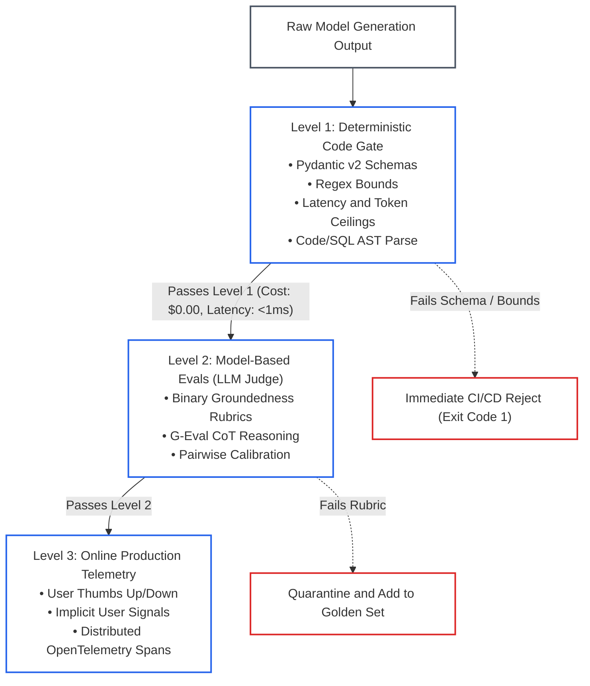
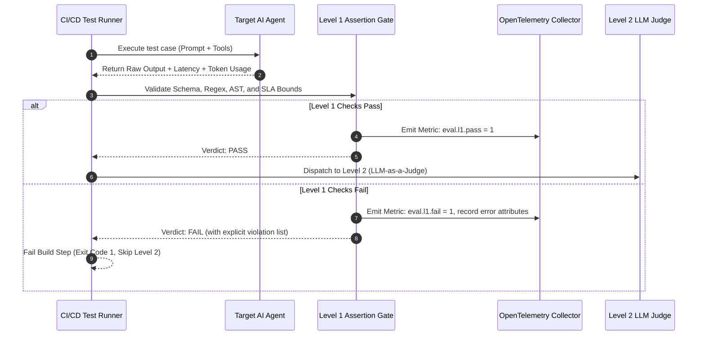

# Lesson 01: Evaluation Hierarchy and Deterministic Testing: Building the Level 1 Safety Gate

> **Tier**: `🟡 Engineering Depth` | **Read time**: ~16 min | **Prerequisites**: [Lesson 00: Evals & Observability Foundations](./00-evals-and-observability-foundations.md)  
> **Core Concept**: Language models are stochastic engines whose outputs must pass fast, zero-cost deterministic code assertions on CPU before escalating to expensive model-based evaluators.  
> **New AI terms introduced**: Hamel Husain 3-level evaluation hierarchy, Level 1 evaluation, deterministic code gate, AST validation, latency SLA ceiling, token budget assertion  
> **AI terms assumed from earlier lessons**: [evaluation (eval)](./00-evals-and-observability-foundations.md), [ground truth](./00-evals-and-observability-foundations.md), [golden dataset](./00-evals-and-observability-foundations.md), [LLM-as-a-Judge](./00-evals-and-observability-foundations.md), [large language model (LLM)](../00-foundations-and-token-mechanics/00-what-is-an-llm.md), [token](../00-foundations-and-token-mechanics/01-tokenization-and-bpe-mechanics.md), [prompt](../01-prompt-and-context-engineering/00-prompt-engineering-fundamentals-roles-and-in-context-learning.md), [tool calling](../03-tools-and-model-context-protocol/00-tool-use-and-mcp-fundamentals.md)

---

## 🎯 What You Will Learn

- How to structure an evaluation harness using Hamel Husain's Three-Level Hierarchy.
- Why relying on manual "vibe checks" guarantees silent schema breakages in production.
- How to implement Level 1 deterministic code gates using Pydantic v2 schemas and regex bounds.
- How to validate generated code and SQL using Abstract Syntax Tree (AST) parsing.
- How to integrate sub-millisecond CPU assertion suites into automated CI/CD pipelines.

---

## 1. The Problem

Enterprise software teams never merge code without automated unit tests and integration suites. Yet teams building with Large Language Models often deploy changes based on manual **"vibe checks."** A developer tests three arbitrary prompts in a playground. The answers look good, so the team ships the prompt to production.

This informal practice triggers three severe failure modes in production systems:
1. **Silent Schema Breakages**: A prompt edit intended to soften conversational tone silently strips a required key from JSON payloads, breaking downstream microservices.
2. **Tool Parameter Hallucinations**: Upgrading a model checkpoint causes the LLM to emit string literals where an API schema mandates an integer or UUID.
3. **Uncontrolled Cost & Latency Regressions**: A patch designed to harden instructions doubles prompt length, adding 800ms to inference latency and inflating API bills.

Traditional software fails loudly at compile time or during test runs. Generative AI fails silently. It generates fluent text that is structurally or syntactically broken.

---

## 2. The Core Idea & Why Naive Fails

The foundational rule of production AI engineering is direct:

```text
AI Models REQUIRE Deterministic Software Testing.
```

You cannot control model output through prompt optimism. You control it through automated regression matrices, strict schema validation gates, and deterministic code assertions.

### Why Naive Approaches Fail
The naive approach sends every candidate output directly to an expensive model evaluator (an LLM-as-a-Judge) or a human review team.

This strategy collapses under engineering realities:
* **Prohibitive Latency**: Querying a frontier model (such as Claude 3.7 Sonnet as of 2025-02 or GPT-4o as of 2024-08) takes 1,000ms to 3,000ms per test. Running 500 regression tests takes over 20 minutes if executed synchronously.
* **High Financial Cost**: Evaluating 500 tests with long context prompts costs \$5.00 to \$15.00 per pull request. Teams quickly disable the test suite to save money.
* **Wasted Diagnostic Compute**: Spending \$0.02 and 2 seconds of GPU compute to discover that a model output malformed JSON is an architectural flaw. If candidate text violates schema syntax or exceeds latency budgets, it should fail in sub-millisecond time on CPU.

---

## 3. Mental Model: The Inverted Filtering Funnel

Think of evaluation as an **inverted filtering funnel** or a **multi-stage compiler pipeline**:



### Visual Walkthrough
1. **Raw Model Generation Output**: The text stream emitted by the model arrives at the evaluation harness.
2. **Level 1: Deterministic Code Gate**: Runs instantaneously on local CPU with zero API cost (<1ms). It checks structural integrity: JSON schema conformity, regex syntax, token limits, and AST parseability.
3. **Immediate Rejection**: If Level 1 fails, the build terminates immediately. The candidate output is never sent to expensive downstream evaluators.
4. **Level 2: Model-Based Evals**: Only responses that satisfy all structural preconditions reach Level 2, where an LLM judge evaluates semantic accuracy, conversational nuance, and factual groundedness.
5. **Level 3: Online Production Telemetry**: Deployed systems stream real-world user interactions and OpenTelemetry traces to detect production anomalies and enrich future test sets.

> **Where this analogy breaks:**  
> A compiler validates deterministic source code written by human engineers against fixed language grammars. A language model emits non-deterministic text streams where the same prompt can yield different token orders. Level 1 assertions must validate contract compliance without breaking on valid semantic variations.

---

## 4. How It Works: Step-by-Step Level 1 Mechanics

Level 1 evaluation operates as a sequence of deterministic checks:

```text
Input Request → LLM Execution → Raw Output Stream
  │
  ├── 1. Structural Schema Validation (Pydantic v2 model_validate_json)
  ├── 2. AST Parseability (ast.parse for Python, SQL syntax parser)
  ├── 3. Regex Pattern Bounds (re.search for mandatory identifiers)
  └── 4. Operational Budget Assertions (Latency < SLA, Tokens < Quota)
  │
  └── Verdict: PASS (Dispatch to Level 2) OR FAIL (Halt & Log Error)
```

### Step 1: Pydantic v2 Schema Enforcement
When an LLM returns structured data (such as tool call arguments, customer service tickets, or database payloads), the output must be validated against a typed Pydantic schema using strict validation mode. If the model omits a mandatory key, emits an invalid enum, or outputs malformed JSON, validation fails instantly.

### Step 2: Abstract Syntax Tree (AST) Validation
If the application generates executable code (Python, JavaScript, or SQL queries), string matching is insufficient. Level 1 parses the generated code into an **Abstract Syntax Tree (AST)**—the tree representation of code syntax used by compilers. If the code contains syntax errors or invalid grammar, the AST parser raises a syntax exception without executing untrusted code.

### Step 3: Deterministic Regex & Substring Bounds
Level 1 verifies mandatory compliance disclaimers (e.g., *"This is not financial advice"*). It validates domain identifiers (e.g., matching `^TICK-[0-9]{4,6}$`). It also confirms that banned substrings (such as leaked internal system prompt delimiters or placeholder strings like `TODO`) are strictly absent.

### Step 4: Operational Thresholds & Hardware Budgets
Level 1 asserts strict operational boundaries:
* Generation latency must satisfy service level agreements (e.g., `latency_ms <= 1500`).
* Token consumption must stay within allocated envelopes (e.g., `completion_tokens <= 300`).

---

## 5. Concrete Scenario & Code Implementation

Consider an enterprise customer support agent generating structured ticket routing payloads. Below is a production-grade Level 1 deterministic test harness written in Python 3.12+ using Pydantic v2 and Python's native `ast` module:

```python
"""level_1_deterministic_eval.py

Production Level 1 Deterministic Evaluation Gate.
Validates Pydantic v2 schemas, AST parsing, regex bounds, and operational budgets.
"""

from __future__ import annotations

import ast
import re
from typing import Annotated, Literal
from pydantic import BaseModel, Field, ValidationError


# ---------------------------------------------------------------------------
# 1. Strongly Typed Domain Schemas
# ---------------------------------------------------------------------------
class TicketRoutingPayload(BaseModel):
    ticket_id: Annotated[str, Field(description="Ticket ID formatted as TICK-XXXXXX")]
    urgency: Literal["LOW", "MEDIUM", "HIGH", "CRITICAL"]
    target_queue: Annotated[str, Field(min_length=3, max_length=50)]
    customer_tier: Literal["STANDARD", "PREMIUM", "ENTERPRISE"]
    automated_remediation_script: str | None = Field(
        default=None, description="Optional Python remediation snippet"
    )


class EvalResult(BaseModel):
    passed: bool
    score: float  # 0.0 or 1.0 in deterministic Level 1
    latency_ms: float
    token_count: int
    failure_reasons: list[str] = Field(default_factory=list)


# ---------------------------------------------------------------------------
# 2. Level 1 Verification Engine
# ---------------------------------------------------------------------------
class DeterministicGate:
    def __init__(
        self,
        max_latency_ms: float = 2000.0,
        max_tokens: int = 400,
        required_id_pattern: str = r"^TICK-[0-9]{4,6}$",
    ) -> None:
        self.max_latency_ms = max_latency_ms
        self.max_tokens = max_tokens
        self.id_regex = re.compile(required_id_pattern)

    def evaluate(
        self,
        raw_output: str,
        latency_ms: float,
        completion_tokens: int,
    ) -> EvalResult:
        failures: list[str] = []

        # Check 1: Operational Latency SLA Ceiling
        if latency_ms > self.max_latency_ms:
            failures.append(
                f"Latency SLA breached: {latency_ms:.1f}ms > {self.max_latency_ms:.1f}ms"
            )

        # Check 2: Token Budget Ceiling
        if completion_tokens > self.max_tokens:
            failures.append(
                f"Token budget breached: {completion_tokens} > {self.max_tokens} tokens"
            )

        # Check 3: JSON & Pydantic v2 Schema Adherence
        parsed_payload: TicketRoutingPayload | None = None
        try:
            parsed_payload = TicketRoutingPayload.model_validate_json(raw_output)
        except ValidationError as err:
            failures.append(f"Pydantic schema validation failed: {err.errors()[0]['msg']}")

        # If schema parsed successfully, perform deeper structural checks
        if parsed_payload:
            # Check 4: Regex Format Verification on Ticket ID
            if not self.id_regex.match(parsed_payload.ticket_id):
                failures.append(
                    f"Regex failure: ticket_id '{parsed_payload.ticket_id}' "
                    f"does not match pattern '{self.id_regex.pattern}'"
                )

            # Check 5: AST Validation for Generated Remediation Code
            if parsed_payload.automated_remediation_script:
                try:
                    ast.parse(parsed_payload.automated_remediation_script)
                except SyntaxError as syn_err:
                    failures.append(
                        f"AST Syntax Error in remediation script: {syn_err.msg} "
                        f"at line {syn_err.lineno}"
                    )

        is_passed = len(failures) == 0
        return EvalResult(
            passed=is_passed,
            score=1.0 if is_passed else 0.0,
            latency_ms=latency_ms,
            token_count=completion_tokens,
            failure_reasons=failures,
        )


# ---------------------------------------------------------------------------
# 3. Demonstration & Unit Execution
# ---------------------------------------------------------------------------
if __name__ == "__main__":
    gate = DeterministicGate(max_latency_ms=1500.0, max_tokens=300)

    # Test Case A: Valid Generation (Should PASS)
    valid_output = """{
        "ticket_id": "TICK-88412",
        "urgency": "HIGH",
        "target_queue": "DatabaseReliabilityEngineering",
        "customer_tier": "ENTERPRISE",
        "automated_remediation_script": "import os\\nprint('Executing failover flush')"
    }"""
    res_a = gate.evaluate(valid_output, latency_ms=450.0, completion_tokens=85)
    print(f"Test Case A (Valid): Passed={res_a.passed}, Failures={res_a.failure_reasons}")

    # Test Case B: Broken Schema & Invalid AST (Should FAIL instantly)
    invalid_output = """{
        "ticket_id": "INVALID-ID",
        "urgency": "SUPER_URGENT",
        "target_queue": "DB",
        "customer_tier": "ENTERPRISE",
        "automated_remediation_script": "def broken_code( missing_paren:"
    }"""
    res_b = gate.evaluate(invalid_output, latency_ms=1800.0, completion_tokens=420)
    print(f"Test Case B (Invalid): Passed={res_b.passed}")
    for idx, reason in enumerate(res_b.failure_reasons, 1):
        print(f"  [{idx}] {reason}")
```

### Execution Verification
When executed with Python 3.12+, the script produces the following output:

```text
Test Case A (Valid): Passed=True, Failures=[]
Test Case B (Invalid): Passed=False
  [1] Latency SLA breached: 1800.0ms > 1500.0ms
  [2] Token budget breached: 420 > 300 tokens
  [3] Pydantic schema validation failed: Input should be 'LOW', 'MEDIUM', 'HIGH' or 'CRITICAL'
```

---

## 6. Engineering Solutions & Production Patterns

### Pattern 1: Integrating Level 1 into Automated Test Suites
In production AI engineering stacks, Level 1 assertions run in automated test harnesses. Below is a self-contained, offline-compatible test runner pattern using Python's standard library:

```python
"""level_1_test_suite.py

Self-contained automated regression suite for Level 1 evaluation gates.
Runs locally in CI/CD without external third-party dependencies.
"""

from __future__ import annotations

import unittest
from typing import Annotated, Literal
from pydantic import BaseModel, Field, ValidationError


class TicketPayload(BaseModel):
    ticket_id: Annotated[str, Field(pattern=r"^TICK-[0-9]{4,6}$")]
    urgency: Literal["LOW", "MEDIUM", "HIGH", "CRITICAL"]
    target_queue: str


def run_level_1_assertion(raw_json: str, max_latency_ms: float = 1500.0) -> tuple[bool, str]:
    """Execute Level 1 schema assertion on CPU in sub-millisecond time."""
    try:
        TicketPayload.model_validate_json(raw_json)
        return True, "PASS"
    except ValidationError as err:
        return False, f"Schema validation failed: {err.errors()[0]['msg']}"


class TestLevel1DeterministicGate(unittest.TestCase):
    def test_valid_billing_ticket_passes(self) -> None:
        raw_response = (
            '{"ticket_id": "TICK-10294", "urgency": "HIGH", "target_queue": "BillingSupport"}'
        )
        passed, msg = run_level_1_assertion(raw_response)
        self.assertTrue(passed, f"Gate failed: {msg}")

    def test_schema_violation_fails_instantly(self) -> None:
        bad_response = '{"ticket_id": "TICK-10294", "target_queue": "MissingUrgency"}'
        passed, msg = run_level_1_assertion(bad_response)
        self.assertFalse(passed)
        self.assertIn("validation failed", msg)


if __name__ == "__main__":
    unittest.main(verbosity=2)
```

In production environments, teams often plug these same assertions into pytest plugins or evaluation frameworks such as DeepEval for test reporting.

### Pattern 2: Abstract Syntax Tree (AST) Validation for Code and SQL
When language models generate SQL queries or scripts, do not test them by running them against live databases or shells. That creates security hazards and connection timeouts. Use static AST parsers:
* For **Python**: Use Python's built-in `ast.parse()`.
* For **SQL**: Use static syntax parsers to confirm that the dialect matches your database (PostgreSQL, BigQuery, Snowflake) and ensure dangerous commands (`DROP TABLE`, `TRUNCATE`) are strictly absent.

---

## 7. Architecture & Telemetry View

In a production evaluation pipeline, Level 1 assertions emit standardized metrics to observability collectors before dispatching to Level 2:



### Visual Walkthrough
1. **Test Execution**: The CI runner invokes the candidate agent with test inputs.
2. **Raw Output Capture**: The agent returns its raw text response alongside latency and token counts.
3. **Level 1 Validation**: The deterministic gate executes schema checks, regex rules, AST verification, and SLA bounds in under 1ms.
4. **Pass Branch**: If all checks succeed, a pass metric is logged, and the payload is dispatched to Level 2.
5. **Fail Branch**: If any check fails, an error metric is logged, and the CI build terminates immediately—saving the latency and dollar cost of Level 2 LLM judges.

---

## 8. Common Failure Modes & Anti-Patterns

### Anti-Pattern 1: "Vibe Deployment" (Un-Gated Prompt Edits)
* **The Pathology**: A developer edits a system prompt in a configuration repo to fix a tone issue, merging without running an automated test suite.
* **The Consequence**: The prompt change accidentally degrades downstream JSON formatting for non-English queries, causing unhandled runtime exceptions in client applications.
* **The Remedy**: Require an automated pull request status check running Level 1 assertions on 100+ golden cases before any prompt PR can be merged.

### Anti-Pattern 2: The LLM Judge for Syntax Errors Trap
* **The Pathology**: Asking an LLM judge: *"Is this valid JSON matching the Customer schema?"*
* **The Consequence**: Incurring 2 seconds of latency and \$0.02 of API spend to accomplish what `model_validate_json()` does in 0.05 milliseconds for \$0.00.
* **The Remedy**: Never use an LLM judge to verify things that a compiler, regex, or schema validator can assert deterministically.

---

## 9. Production View & Evaluation

When establishing Level 1 gates in your CI/CD pipelines, track the following operational parameters:

| Metric | Target SLA | Diagnostic Significance |
|---|---|---|
| **Level 1 Execution Time** | `< 2.0 ms per test` | Must execute in-memory on CPU without network calls. |
| **Schema Pass Rate** | `100.0% Required` | Zero tolerance for schema regressions on released prompts. |
| **Token Budget Compliance** | `p99 < Max Quota` | Guarantees that prompt adjustments do not cause context bloat. |
| **AST Parse Success** | `100.0% Required` | Guarantees code or SQL syntax integrity before execution. |

---

## 10. When Should You Use It? (Trade-off Matrix)

| Evaluation Mechanism | Marginal Cost | Latency | Scalability | Context Nuance | Best Used For |
|---|---|---|---|---|---|
| **Level 1: Deterministic Code** | **$0.00 (CPU)** | **< 1 ms** | **Infinite (10k+/s)** | Low (Syntax/Schema) | **Pre-commit hooks, CI/CD PR status gates, schema compliance** |
| **Level 2: LLM-as-a-Judge** | ~$0.005–$0.03 | 1,000–3,000 ms | Bounded by Rate Limits | High (Reasoning/Tone) | Semantic accuracy, groundedness, reference scoring |
| **Level 3: Online Telemetry** | Telemetry ingestion | Real-time stream | High | Highest (Real Users) | Production drift detection, anomaly mining |

---

## 11. Key Takeaways & Verified Resources

* **Stochastic models require deterministic harnesses**: Control LLM behavior through automated assertion suites, not prompt optimism.
* **Level 1 runs on CPU for free**: Enforce Pydantic v2 validation, regex bounds, token budgets, and AST parsing before spending compute on LLM judges.
* **Never let broken syntax reach Level 2**: Fail fast in sub-millisecond time.

### Authoritative References
* **Hamel Husain**: [Your AI Product Needs Evals](https://hamel.dev/blog/posts/evals/) — *The foundational essay on LLM evaluation hierarchies.*
* **Hamel Husain**: [Creating a LLM as a Judge That You Can Trust](https://hamel.dev/blog/posts/evals-faq/) — *Practical evaluation methodology.*
* **Pydantic Documentation**: [Pydantic v2 Performance & Validation](https://docs.pydantic.dev/latest/) — *High-throughput JSON schema validation in Python.*

---

## 12. ✅ Quick Check

You are building an autonomous data analytics assistant that generates SQL queries from plain-English questions. A junior engineer proposes adding an LLM-as-a-Judge step to every CI/CD test run to answer: *"Is the generated SQL query syntactically valid for PostgreSQL?"*

Explain why this proposal is an architectural anti-pattern, and what Level 1 deterministic mechanism should be used instead.

<details>
<summary>Suggested Solution</summary>

**Why an LLM Judge is an architectural anti-pattern here:**  
Using an LLM judge to verify code syntax incurs 1,000ms–3,000ms of latency. It costs \$0.01–\$0.03 per test and remains non-deterministic. The judge can hallucinate that invalid SQL is valid, or reject valid dialect syntax. Running 500 tests in a pull request costs \$5.00–\$15.00 and takes over 15 minutes.

**What to use instead:**  
Use a Level 1 deterministic Abstract Syntax Tree (AST) parser (such as `sqlglot` or PostgreSQL's `pg_parse_query`). An AST parser parses the query on local CPU in under 0.5 milliseconds for \$0.00 with 100% mathematical precision. If the SQL query contains a syntax error (e.g., `SELEC` instead of `SELECT`), the AST parser raises an immediate syntax error and halts the test gate before any expensive model judge is invoked.

</details>

---

## 🧭 Navigation

- **Previous**: [Lesson 00: Evals & Observability Foundations](./00-evals-and-observability-foundations.md)
- **Phase Hub**: [Phase 06 Overview & Architecture Hub](./README.md)
- **Next**: [Lesson 02: Model-Based Evaluations & Judge Architectures](./02-model-based-evaluations-and-judge-architectures.md)
- **Capstone Lab**: [Automated CI/CD Evaluation Pipeline](./labs/capstone-cicd-evaluation-pipeline.md)
