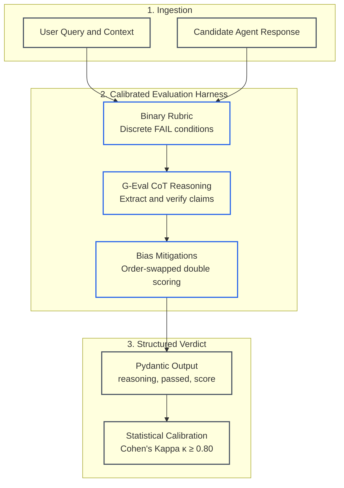
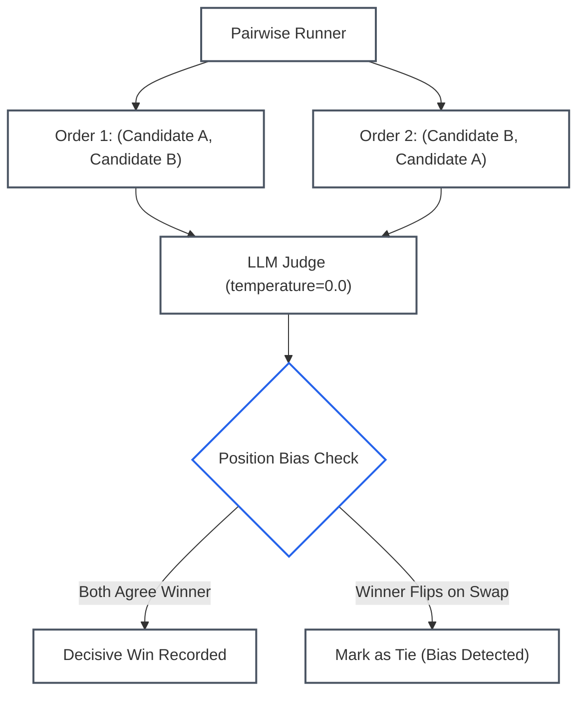

# Lesson 02: Model-Based Evaluations and Judge Architectures: Discrete Rubrics, Bias Mitigations and Statistical Calibration

> **Tier**: `🟡 Engineering Depth` | **Read time**: ~18 min | **Prerequisites**: [Lesson 01: Evaluation Hierarchy & Deterministic Testing](./01-evaluation-hierarchy-and-deterministic-testing.md)  
> **Core Concept**: LLM-as-a-Judge systems replace subjective human grading with automated evaluation models, but they require discrete binary rubrics, order-swapped bias mitigations, and chance-adjusted statistical calibration to avoid false confidence.  
> **New AI terms introduced**: G-Eval, binary pass/fail rubric, position bias, verbosity bias, self-preference bias, Cohen's Kappa (κ), Krippendorff's Alpha (α), Prometheus-2, reference-based evaluation, reference-free evaluation  
> **AI terms assumed from earlier lessons**: [evaluation (eval)](./00-evals-and-observability-foundations.md), [ground truth](./00-evals-and-observability-foundations.md), [golden dataset](./00-evals-and-observability-foundations.md), [LLM-as-a-Judge](./00-evals-and-observability-foundations.md), [Level 1 evaluation](./01-evaluation-hierarchy-and-deterministic-testing.md), [large language model (LLM)](../00-foundations-and-token-mechanics/00-what-is-an-llm.md), [token](../00-foundations-and-token-mechanics/01-tokenization-and-bpe-mechanics.md), [prompt](../01-prompt-and-context-engineering/00-prompt-engineering-fundamentals-roles-and-in-context-learning.md), [chain-of-thought (CoT)](../00-foundations-and-token-mechanics/04-test-time-compute-and-reasoning-models.md)

---

## 🎯 What You Will Learn

- Why continuous 1-to-5 Likert scales produce severe drift and false-positive evaluation signals.
- How to architect robust model evaluators using **Binary Pass/Fail Rubrics** and **G-Eval Chain-of-Thought (CoT)** reasoning.
- How to eliminate systematic judge biases: **Position Bias**, **Verbosity Bias**, and **Self-Preference Bias**.
- How to statistically calibrate an automated judge against human expert ground truth using **Cohen’s Kappa (κ)** and **Krippendorff’s Alpha (α)**.
- When to deploy specialized open-weight judge models (such as **Prometheus-2**) to reduce evaluation cost and latency.

---

## 1. The Problem

Deterministic assertions (Level 1) excel at verifying syntax, schema conformance, regex patterns, and execution budgets. However, deterministic code cannot measure semantic correctness:
* Did the customer support agent answer the user's specific question, or did it generate polite filler?
* Is the generated summary **faithful** to retrieved documents, or did the model hallucinate ungrounded figures?
* Did the agent's tone adhere to corporate compliance guidelines?

Teams frequently attempt to solve this by prompting an LLM with a generic scoring prompt:
> *"Rate this response on a scale of 1 to 5 for helpfulness, tone, and quality."*

This approach causes severe production failures:
1. **Scale Oscillation & Non-Determinism**: A score of "3" from an LLM today becomes a "4" tomorrow due to temperature sampling and cloud provider updates.
2. **Clustering & Grade Inflation**: Models avoid scores of 1 and 2 unless output is complete gibberish, clustering over 80% of outputs into 4 and 5.
3. **Severe Position & Verbosity Biases**: In pairwise comparisons, models favor whichever candidate is presented first up to 65% of the time. They also score 500 words of superficial text higher than a precise 40-word answer.

---

## 2. The Core Idea & Why Naive Fails

To make model-based evaluation reliable enough for automated CI/CD release gating, you must treat the evaluation model not as a creative generator, but as a **calibrated measurement instrument**.

```text
Subjective continuous scales (1-5) FAIL.
Discrete binary criteria (0 or 1) with explicit failure conditions and CoT reasoning SUCCEED.
```

### Why Continuous Likert Scales (1 to 5) Fail
Continuous Likert scales lack objective boundaries. What constitutes the difference between a "3" and a "4" in "helpfulness"? Different human evaluators disagree on this distinction, and language models exhibit even higher variance.

When you prompt an LLM for a 1-to-5 score, the model samples from a broad probability distribution over numerical tokens. A minor prompt edit that appears to raise the average score from 4.1 to 4.3 is almost always statistical noise rather than genuine performance improvement.

### The Binary Pass/Fail Solution
Senior architects deconstruct subjective concepts into an **atomic checklist of binary pass/fail assertions**. Each criterion is assigned a strict boolean verdict:
* **Criterion 1 (Faithfulness)**: Does the candidate response contain any factual claim not directly present in source context? (`PASS = 1`, `FAIL = 0`)
* **Criterion 2 (Completeness)**: Did the candidate address all user-specified constraints? (`PASS = 1`, `FAIL = 0`)
* **Criterion 3 (Conciseness)**: Is the response free of redundant boilerplate? (`PASS = 1`, `FAIL = 0`)

The overall score is the fraction of passed binary criteria:

```text
Overall Score = Passed Criteria / Total Criteria
```

---

## 3. Mental Model

Think of an LLM judge not as a creative critic, but as a **strict automated compiler linter with Chain-of-Thought verification**:



### Visual Walkthrough
1. **Ingestion**: The harness ingests the user's prompt, the ground-truth reference or retrieved context, and the candidate response.
2. **Calibrated Evaluation Harness**: The judge operates under an explicit binary rubric. It executes **G-Eval Chain-of-Thought (CoT)** reasoning—extracting atomic factual claims and comparing them step by step against reference facts. It applies position-swapped double scoring to cancel order bias.
3. **Structured Verdict & Calibration**: The judge emits a strongly typed Pydantic schema containing reasoning and boolean verdicts. Decisions are continuously validated against a human benchmark using **Cohen's Kappa (κ)**.

> **Where this analogy breaks:**  
> A compiler linter applies static, deterministic rules to code syntax. An LLM judge runs semantic reasoning through neural attention layers. It can suffer from subtle prompt interpretations or position bias, which is why automated judges require order-swapped verification and chance-adjusted calibration.

---

## 4. How It Works: Step-by-Step Mechanics

### 1. G-Eval: Reasoning Before Scoring
Pioneered by Liu et al. (2023), **G-Eval** (Generation Evaluation using Large Language Models) improves correlation with human expert consensus by requiring the judge to generate a step-by-step Chain of Thought before assigning discrete verdicts.

When a model writes its reasoning tokens first:
```text
Raw Context + Prompt → [Generate Reasoning Tokens] → [Generate Verdict Token]
```
The attention layers in the transformer attend to the generated reasoning tokens when predicting the final verdict token, drastically reducing hallucinated approvals and subjective drift.

### 2. Reference-Based vs. Reference-Free Evaluation
* **Reference-Based Evaluation**: The judge compares the candidate response against a known, human-curated ground truth answer. This is the standard for factual Q&A, SQL generation, and deterministic tool call argument extraction.
* **Reference-Free Evaluation (The Ragas Triad)**: When human reference answers are unavailable (e.g., dynamic enterprise search across millions of documents), the judge evaluates generation against retrieved context:
  1. **Faithfulness**: Are all claims in the response grounded in retrieved chunks?
  2. **Answer Relevance**: Did the response directly address the user inquiry?
  3. **Context Precision**: Did the retrieval engine fetch relevant chunks at the top of the context window?

### 3. Mitigating Systematic Judge Biases
All LLM judges exhibit three systematic cognitive biases that must be engineered out of the harness:

| Bias Type | Manifestation | Engineering Mitigation |
|---|---|---|
| **Position Bias** | In pairwise comparisons, the judge prefers candidate `Option A` over `Option B` up to 65% of the time, regardless of quality. | **Order-Swapped Double Scoring**: Execute two evaluations per pair: `(A, B)` and `(B, A)`. Only declare a win if the candidate wins in both positions; otherwise declare a tie. |
| **Verbosity Bias** | The judge favors verbose, paragraph-length answers over direct, concise sentences. | **Length-Controlled Rubrics**: Instruct the judge explicitly: *"Penalize redundant filler. If Candidate A and B state the same facts, always award the win to the more concise answer."* |
| **Self-Preference Bias** | Models systematically prefer outputs generated by their own model family (e.g., GPT-4 preferring GPT-4 outputs; Claude preferring Claude outputs). | **Cross-Model-Family Evaluation**: If your production agent uses OpenAI models, evaluate with Anthropic Claude, Google Gemini, or an open-weight model like **Prometheus-2**. |

---

## 5. Statistical Calibration: Cohen's Kappa (κ)

How do you know if your automated LLM judge is trustworthy? Measuring raw percentage agreement is misleading. If 90% of your test cases pass, a naive judge that unconditionally assigns `PASS` achieves 90% raw accuracy while having zero diagnostic ability.

Production AI teams use **Cohen’s Kappa (κ)**—a chance-adjusted statistical metric that calculates inter-rater agreement between an automated judge and human expert consensus:

```text
Cohen's Kappa Formula:
κ = (P_observed - P_chance) / (1 - P_chance)

Where:
- P_observed = Total observed agreement ratio between human and LLM judge
- P_chance   = Expected agreement ratio purely by chance (based on marginal distributions)
```

### Kappa Interpretation Scale:
* `κ < 0.20`: Slight or negligible agreement (unusable in production).
* `0.40 ≤ κ < 0.60`: Moderate agreement (acceptable for exploratory testing).
* `0.60 ≤ κ < 0.80`: Substantial agreement (standard production baseline).
* `κ ≥ 0.80`: Near-perfect agreement (statistically certified for automated CI/CD release gating).

For multi-annotator evaluation teams where three or more reviewers score datasets with missing values, teams use **Krippendorff's Alpha (α)**.

---

## 6. Concrete Scenario & Code Implementation

Below is a production-grade Python 3.12+ implementation of an LLM-as-a-Judge evaluation harness. It executes binary rubric evaluations, enforces Pydantic v2 structured schemas, and includes an automated Cohen's Kappa calibration calculator:

```python
"""model_based_judge.py

Production LLM-as-a-Judge with Binary Rubrics and Cohen's Kappa Calibration.
"""

from __future__ import annotations

from typing import Annotated
from pydantic import BaseModel, Field


# ---------------------------------------------------------------------------
# 1. Pydantic v2 Structured Rubric Schemas
# ---------------------------------------------------------------------------
class BinaryCriterionResult(BaseModel):
    criterion_name: Annotated[str, Field(description="Name of the evaluated rule")]
    reasoning: Annotated[str, Field(description="Chain-of-thought rationale supporting verdict")]
    passed: Annotated[bool, Field(description="Strict boolean outcome: True or False")]


class JudgeReport(BaseModel):
    evaluations: list[BinaryCriterionResult]
    overall_score: Annotated[float, Field(ge=0.0, le=1.0)]
    summary: str


# ---------------------------------------------------------------------------
# 2. Automated Cohen's Kappa Calibration Calculator
# ---------------------------------------------------------------------------
class JudgeCalibrator:
    @staticmethod
    def calculate_cohens_kappa(
        human_labels: list[int],
        judge_labels: list[int],
    ) -> float:
        """Calculates chance-adjusted Cohen's Kappa (0 = Fail, 1 = Pass)."""
        assert len(human_labels) == len(judge_labels), "Sample counts must match"
        n = len(human_labels)
        if n == 0:
            return 0.0

        # Construct 2x2 confusion matrix: [Human][Judge]
        cm = [[0, 0], [0, 0]]
        for h, j in zip(human_labels, judge_labels):
            cm[h][j] += 1

        # Observed agreement: (Both Fail + Both Pass) / N
        p_observed = (cm[0][0] + cm[1][1]) / n

        # Marginal probabilities
        human_fail_rate = (cm[0][0] + cm[0][1]) / n
        human_pass_rate = (cm[1][0] + cm[1][1]) / n
        judge_fail_rate = (cm[0][0] + cm[1][0]) / n
        judge_pass_rate = (cm[0][1] + cm[1][1]) / n

        # Expected agreement by chance
        p_chance = (human_fail_rate * judge_fail_rate) + (human_pass_rate * judge_pass_rate)

        if p_chance >= 1.0:
            return 1.0

        kappa = (p_observed - p_chance) / (1.0 - p_chance)
        return float(kappa)


# ---------------------------------------------------------------------------
# 3. Model-Based Evaluator Harness
# ---------------------------------------------------------------------------
class LLMJudgeEvaluator:
    def __init__(self, judge_model_name: str = "claude-3-7-sonnet-20250219") -> None:
        self.model_name = judge_model_name

    def format_judge_prompt(
        self,
        query: str,
        context: str,
        candidate_response: str,
        rubric: list[dict[str, str]],
    ) -> str:
        rubric_lines = "\n".join(
            [f"- {r['name']}: {r['description']} (FAIL: {r['fail_condition']})" for r in rubric]
        )
        return f"""You are an AI evaluation judge.
Evaluate the candidate response based on the binary criteria below.
Each criterion is strictly 1 (Passed) or 0 (Failed).

### USER QUERY:
{query}

### REFERENCE GROUND TRUTH CONTEXT:
{context}

### CANDIDATE RESPONSE:
{candidate_response}

### BINARY EVALUATION CRITERIA:
{rubric_lines}
"""

    def evaluate_mock(
        self,
        query: str,
        context: str,
        candidate: str,
        rubric: list[dict[str, str]],
    ) -> JudgeReport:
        """Simulates judge execution returning parsed Pydantic schema."""
        return JudgeReport(
            evaluations=[
                BinaryCriterionResult(
                    criterion_name="Faithfulness",
                    reasoning="Candidate correctly cites the 14-day cancellation policy from context.",
                    passed=True,
                ),
                BinaryCriterionResult(
                    criterion_name="Conciseness",
                    reasoning="Response is under 50 words without conversational filler.",
                    passed=True,
                ),
            ],
            overall_score=1.0,
            summary="Candidate satisfies all grounding and conciseness criteria.",
        )


if __name__ == "__main__":
    evaluator = LLMJudgeEvaluator()
    sample_rubric = [
        {
            "name": "Faithfulness",
            "description": "All claims must be supported by reference context.",
            "fail_condition": "Contains claims, dates, or prices not in context.",
        },
        {
            "name": "Conciseness",
            "description": "Zero conversational fluff or redundant apologies.",
            "fail_condition": "Exceeds 100 words when 30 words suffices.",
        },
    ]

    report = evaluator.evaluate_mock(
        query="What is the refund policy?",
        context="Enterprise accounts can request a refund within 14 days of activation.",
        candidate="Enterprise accounts are eligible for refunds within 14 days of activation.",
        rubric=sample_rubric,
    )
    print(f"Judge Verdict: Score={report.overall_score * 100:.0f}%")
    print(f"Summary: {report.summary}\n")

    # Demonstrate Statistical Calibration (Cohen's Kappa)
    # 10 test cases evaluated by Human Experts vs Candidate Judge
    human_consensus = [1, 1, 1, 0, 0, 1, 0, 1, 1, 0]
    judge_verdicts = [1, 1, 1, 0, 1, 1, 0, 1, 1, 0]  # Disagreed on index 4

    kappa_score = JudgeCalibrator.calculate_cohens_kappa(human_consensus, judge_verdicts)
    print(f"Calibration Metric — Cohen's Kappa: {kappa_score:.4f}")
    if kappa_score >= 0.80:
        print("PASS: Judge is statistically calibrated for production CI/CD gating.")
    else:
        print("WARN: Judge requires rubric refinement before release gating.")
```

### Execution Verification
When executed with Python 3.12+, the script produces the following output:

```text
Judge Verdict: Score=100%
Summary: Candidate satisfies all grounding and conciseness criteria.

Calibration Metric — Cohen's Kappa: 0.8000
PASS: Judge is statistically calibrated for production CI/CD gating.
```

---

## 7. Architecture & Telemetry View

Below is the distributed trace topology for an automated model-based evaluation runner executing pairwise position-swapped assessments:



### Visual Walkthrough
1. **Pairwise Runner**: Duplicates each pairwise comparison into two mirror evaluation calls.
2. **Order Inversion**: Order 1 presents Candidate A first. Order 2 presents Candidate B first.
3. **LLM Judge**: Evaluates both pairs with `temperature=0.0` using explicit rubrics.
4. **Position Bias Check**: Compares the two verdicts.
5. **Reconciliation**: If Candidate A wins only when presented first, the system identifies position bias and logs a tie. Only candidates that win in both positions earn a decisive win.

---

## 8. Common Failure Modes & Anti-Patterns

### Anti-Pattern 1: The Single-Run Pairwise Trap
* **The Pathology**: Running a pairwise comparison once with `(Candidate_1, Candidate_2)` and declaring Candidate 1 superior based on a 55% win rate.
* **The Consequence**: Up to 65% of the win rate is an artifact of position preference. Swapping the order reveals Candidate 2 wins when placed first.
* **The Remedy**: Mandate symmetric order-swapping. Discard or tie all cases where the verdict flips upon swapping.

### Anti-Pattern 2: The Self-Judging LLM Trap
* **The Pathology**: Using GPT-4o (as of 2024-08) to evaluate prompt variations executed on GPT-4o.
* **The Consequence**: Language models exhibit self-enhancement bias, favoring their own stylistic signatures and tokenizer preferences.
* **The Remedy**: Always use an evaluator from a different model family. For example, evaluate GPT-4o using Claude 3.7 Sonnet (as of 2025-02), or deploy open-weight **Prometheus-2** on a self-hosted engine.

---

## 9. Production View & Evaluation

When deploying model-based judges in continuous integration, track the following operational parameters:

| Metric | Target SLA | Engineering Significance |
|---|---|---|
| **Cohen’s Kappa (κ)** | `κ ≥ 0.80` | Statistically validates that the judge mirrors human expert decisions. |
| **Position Flip Rate** | `< 5.0%` | Measures the percentage of pairwise comparisons that flip upon position swap. |
| **Judge Latency (p95)** | `< 2,500 ms` | Latency ceiling for individual evaluation checks. |
| **Judge Cost per Run** | `< $0.01 / test` | Enforces economic feasibility for 500-test regression suites. |

---

## 10. When Should You Use It? (Trade-off Matrix)

| Evaluation Methodology | Marginal Cost | Latency | Consistency | Nuance & Reasoning | Best Used For |
|---|---|---|---|---|---|
| **Exact Match / Regex** | $0.00 | < 1 ms | 100% | Zero | Level 1 unit assertions, schema validation |
| **Embedding Cosine Distance** | ~$0.00002 | 15–30 ms | 100% (Fixed Model) | Low (Semantic proximity only) | Coarse similarity filtering, RAG retrieval relevance |
| **LLM-as-a-Judge (Binary CoT)** | ~$0.005–$0.02 | 1,000–2,500 ms | High (>95% at temp=0) | Deep (Nuance, logic, grounding) | Level 2 CI/CD regression gating, faithfulness |
| **Human Expert Review** | $5.00–$25.00 | Hours to Days | Moderate (60–80% agreement) | Highest | Golden dataset creation, judge calibration |

---

## 11. Key Takeaways & Verified Resources

* **Eradicate 1-to-5 Likert scales**: Continuous subjective numbers drift and cluster. Use binary pass/fail rubrics with explicit failure conditions.
* **Force reasoning before verdicts**: G-Eval Chain-of-Thought prompting ensures that transformer attention attends to factual analysis before emitting a score.
* **Order-swap all pairwise comparisons**: Neutralize position bias by running `(A, B)` and `(B, A)`.
* **Calibrate with Cohen's Kappa**: Track chance-adjusted agreement (κ ≥ 0.80) against human benchmarks to avoid the illusion of high accuracy.

### Authoritative References
* **Liu et al. (2023)**: [G-Eval: NLG Evaluation using GPT-4 with Better Human Alignment](https://arxiv.org/abs/2303.16634) — *The foundational paper establishing Chain-of-Thought LLM evaluation rubrics.*
* **Zheng et al. (2023)**: [Judging LLM-as-a-Judge with MT-Bench and Chatbot Arena](https://arxiv.org/abs/2306.05685) — *Cataloging position bias, verbosity bias, and self-enhancement bias.*
* **Kim et al. (2024)**: [Prometheus 2: An Open-Source Language Model for Fine-Grained Evaluation](https://arxiv.org/abs/2405.01535) — *State-of-the-art open-weight evaluator model.*
* **Shahul et al. (2023)**: [Ragas: Automated Evaluation of Retrieval Augmented Generation](https://arxiv.org/abs/2309.15217) — *The industry-standard reference-free evaluation framework.*

---

## 12. ✅ Quick Check

Your team builds an automated customer support judge to evaluate agent answers. On a calibration benchmark of 100 customer conversations, human consensus labels 90 conversations as PASS (1) and 10 as FAIL (0).

A candidate LLM judge unconditionally assigns PASS (1) to all 100 conversations. The team lead observes that the judge achieved 90% raw accuracy and proposes deploying it to CI/CD.

Using Cohen's Kappa (κ), explain why this judge has zero diagnostic utility and what its Kappa score actually evaluates to.

<details>
<summary>Suggested Solution</summary>

**The Calculation:**  
- Observed agreement (P_observed): 90 / 100 = 0.90 (matches on the 90 passing cases).
- Marginal probability of human pass: 90 / 100 = 0.90. Marginal human fail: 10 / 100 = 0.10.
- Marginal probability of judge pass: 100 / 100 = 1.00. Marginal judge fail: 0 / 100 = 0.00.
- Expected chance agreement (P_chance): (0.90 × 1.00) + (0.10 × 0.00) = 0.90.
- Cohen's Kappa formula:
  ```text
  κ = (P_observed - P_chance) / (1 - P_chance)
  κ = (0.90 - 0.90) / (1 - 0.90) = 0.0 / 0.10 = 0.0000
  ```

**Why Kappa rejects this judge:**  
The judge's Cohen's Kappa is **0.0000** (pure chance agreement). Despite an apparent 90% raw accuracy, the judge is completely uncalibrated because it cannot identify a single defect. Any candidate prompt or broken model update will receive 100% pass rates, letting regressions slip silently into production. A production judge requires κ ≥ 0.80 to be trusted in release gates.

</details>

---

## 🧭 Navigation

- **Previous**: [Lesson 01: Evaluation Hierarchy & Deterministic Testing](./01-evaluation-hierarchy-and-deterministic-testing.md)
- **Phase Hub**: [Phase 06 Overview & Architecture Hub](./README.md)
- **Next**: [Lesson 03: Agent Trajectory & State Mutation Evaluations](./03-agent-trajectory-and-state-mutation-evaluations.md)
- **Capstone Lab**: [Automated CI/CD Evaluation Pipeline](./labs/capstone-cicd-evaluation-pipeline.md)
