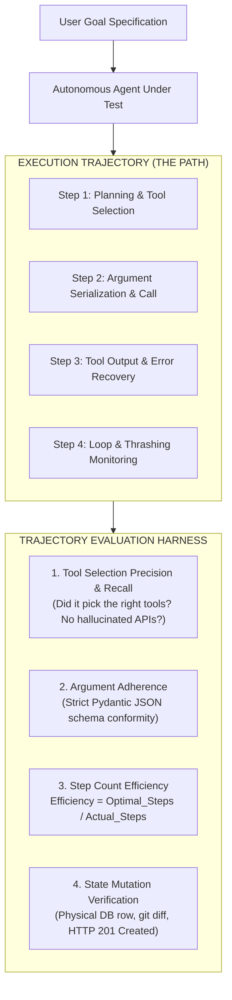
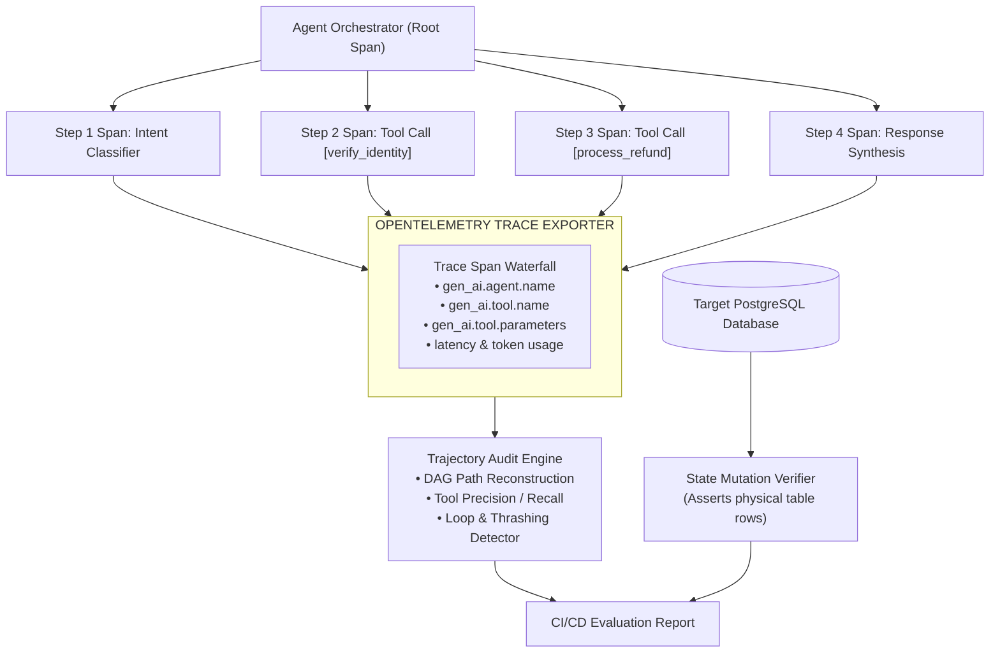

# Agent Trajectory & State Mutation Evaluations: Tool Precision, Graph Efficiency & Multi-Turn Benchmarks

> **[Tier: 🟡 Engineering Depth]**  
> **Core Concept**: Evaluating an autonomous agent requires grading its intermediate decision path—tool precision, argument adherence, step efficiency, and environment state mutation—rather than merely scoring its final conversational summary.

---

## 🎯 What You Will Learn
- Why single-turn chatbot evaluations fail catastrophically when applied to autonomous multi-step agents.
- The 4 core dimensions of **Agent Trajectory Evaluation**: Tool Precision/Recall, Argument Adherence, Step Efficiency, and Loop/Thrashing Detection.
- How to evaluate agents via **Environment-State Verification** (database rows, git diffs, and API mutations).
- The industry-standard 2026 agent benchmarking landscape: **SWE-bench Verified**, **TAU-bench**, and the **UK AISI Inspect AI** framework.
- How to implement a production-grade Trajectory Evaluator in Python 3.12+.

---

## 1. The Problem

Evaluating a multi-step autonomous agent is fundamentally different from evaluating a single-turn chatbot. A chatbot takes a prompt and produces text. An agent executes a **state trajectory** across time: observing user intent, formulating thoughts, choosing tools, parsing execution results, recovering from runtime errors, and mutating state in external databases or APIs.

```text
Turn 1: User Request → Agent Plan → Tool Call: search_customer(id='C-104')
Turn 2: Tool Result  → Reflection → Tool Call: fetch_invoices(cust='C-104')
Turn 3: Tool Result  → Synthesis  → Final Response to User
```

This multi-step nature creates a deceptive failure mode: **The Superficial Success Illusion**.

An agent's final text summary can read fluently and satisfy an LLM judge, even while its execution trajectory was an operational disaster:
* It invoked 14 redundant database queries to answer a trivial question.
* It attempted to call deprecated or hallucinated functions that do not exist in its registry.
* It entered a circular retry loop, consuming \$1.50 in GPU tokens for a 2-cent task.
* It claimed it refunded the customer, but never actually invoked the `refund_payment` API.

---

## 2. The Core Idea & Why Naive Fails

```text
Do not grade what the agent SAYS it did.
Grade what the agent actually DID in the environment.
```

### Why Naive Approaches Fail
The naive approach to evaluating agents is to treat the multi-turn session as a single prompt-response pair and pass the final summary to an LLM judge.

This breaks down because:
1. **Blindness to Inefficient Paths**: If an agent takes 15 steps to perform a task that requires 3 steps, evaluating only the final response masks massive latency and financial cost inflation.
2. **Blindness to Intermediate Hallucinations**: An agent might hallucinate sensitive credentials or make erroneous tool calls that fail silently, then pivot to another approach. Without inspecting intermediate spans, security and reliability teams remain blind to runtime risk.
3. **The Hallucinated Action Problem**: Language models frequently apologize or confirm actions that never took place (*"I have updated your account address"*), even when the tool call threw an unhandled 500 error.

---

## 3. Mental Model

Think of agent trajectory evaluation as **profiling an execution trace in an operating system or database query planner**:



### Visual Walkthrough
1. **User Goal Specification**: The benchmark specifies a concrete task with expected intermediate milestones and an expected final environmental state.
2. **Execution Trajectory**: The agent navigates the problem across multiple steps, generating intermediate thoughts and tool calls.
3. **Dual Evaluator**: Rather than reading the final string alone, the evaluation harness scores four distinct systems dimensions: tool selection accuracy, argument schemas, graph efficiency, and physical state mutations in the environment.

---

## 4. How It Works (Step-by-Step Mechanics)

A comprehensive agent evaluation harness tracks five quantitative metrics across every run:

### 1. Tool Selection Precision & Recall
* **Tool Precision**: Of the tools invoked by the agent, what fraction were strictly necessary?
  ```text
  Tool Precision = Relevant_Tools_Invoked / Total_Tools_Invoked
  ```
* **Tool Recall**: Did the agent invoke all mandatory tools required for the task (e.g., invoking `verify_caller_identity` before calling `transfer_balance`)?
* **Hallucinated Tools Count**: Any attempt to call a function name not present in the agent's registered tool schema results in an immediate penalty.

### 2. Tool Argument Correctness
* Does the argument payload conform strictly to the tool's JSON schema?
* Did the agent extract correct entities from conversational context (e.g. passing `"account_id": "ACC-9912"` rather than guessing or passing `null`)?

### 3. Trajectory Step Efficiency
The ratio of the theoretical optimal number of steps to the actual steps taken by the agent:

```text
Step Count Efficiency:
Efficiency = Optimal_Steps / Actual_Steps
```

If an optimal path requires 3 tool calls and the agent executes 12 calls due to stumbling through incorrect search parameters, efficiency is `3 / 12 = 0.25`. Production architectures enforce minimum efficiency thresholds (e.g. `Efficiency >= 0.60`).

### 4. Loop & Thrashing Detection
Detecting cyclical executions where an agent repeats identical tool calls with identical parameters:
```text
search_orders(query="shoes") → [] → search_orders(query="shoes") → []
```
If an agent executes the same tool with the same arguments more than twice without updating parameters, the harness aborts execution and flags a **Thrashing Failure**.

### 5. Goal Achievement via Physical State Mutation
The gold standard of agent evaluation: **Did the real world change as requested?**
* **Database Agent**: Inspect the PostgreSQL or MongoDB database. Did the expected record insert with valid foreign keys and timestamps?
* **Coding Agent**: Inspect the repository working tree. Did the code compile, pass all unit tests, and generate a clean git diff?
* **API Integration Agent**: Inspect the mock server. Did the HTTP POST endpoint receive the expected payload with a `201 Created` status?

---

## 5. Modern Agent Benchmarks (2025–2026 Landscape)

Standard academic benchmarks like MMLU or GSM8K measure static memorization. Modern agent engineering evaluates systems using dynamic, multi-turn, state-verifiable benchmarks:

| Benchmark | Primary Domain | Evaluation Mechanism | Key Relevance for 2026 |
|---|---|---|---|
| **SWE-bench Verified** | Real-World Software Engineering | Runs candidate agents against 500 human-curated GitHub pull requests in sandboxed Docker containers; tests pass if unit test suites turn green. | The industry standard for coding agents; eliminates noise and benchmark gaming present in early SWE-bench. |
| **TAU-bench** (Sierra / Stanford) | Enterprise API Tool Use | Evaluates agents in dynamic, multi-turn retail and airline environments with live databases and strict business policy constraints. | Measures multi-turn policy adherence, parameter state tracking, and user satisfaction over long conversations. |
| **GAIA** (General AI Assistants) | Complex Multimodal Workflows | Tasks requiring multi-step web browsing, file parsing, and tool orchestration. | Concepts that are trivial for humans but challenging for AI systems without strong planning capabilities. |
| **UK AISI Inspect AI** | Open-Source Evaluation Framework | Developed by the UK AI Safety Institute; provides modular Python test harnesses, sandboxed task execution, and trajectory logging. | The leading framework for creating custom, reproducible enterprise agent evaluation suites. |

---

## 6. Concrete Scenario & Code Implementation

Below is a complete, runnable Python 3.12+ Trajectory Evaluator that scores tool selection precision, step efficiency, loop thrashing, and environment mutations:

```python
"""
trajectory_evaluator.py
Evaluates multi-turn autonomous agent trajectories:
Tool selection precision, step efficiency, loop detection, and state mutations.
"""

from __future__ import annotations

from typing import List, Dict, Any, Set
from pydantic import BaseModel, Field


# ---------------------------------------------------------------------------
# 1. Trajectory Data Models
# ---------------------------------------------------------------------------
class ToolInvocation(BaseModel):
    step_number: int
    tool_name: str
    arguments: Dict[str, Any]
    execution_success: bool


class TrajectoryTrace(BaseModel):
    task_id: str
    optimal_steps: int
    invocations: List[ToolInvocation]
    final_output_text: str


class TrajectoryScorecard(BaseModel):
    task_id: str
    tool_precision: float
    tool_recall: float
    step_efficiency: float
    loop_detected: bool
    hallucinated_tools: List[str]
    environment_mutated_correctly: bool
    overall_passed: bool
    summary: str


# ---------------------------------------------------------------------------
# 2. Production Trajectory Evaluator
# ---------------------------------------------------------------------------
class TrajectoryEvaluator:
    def __init__(
        self,
        registered_tools: Set[str],
        mandatory_tools: Set[str],
        min_efficiency_threshold: float = 0.50,
    ):
        self.registered_tools = registered_tools
        self.mandatory_tools = mandatory_tools
        self.min_efficiency_threshold = min_efficiency_threshold

    def evaluate_trajectory(
        self,
        trace: TrajectoryTrace,
        environment_check_fn: Any,
    ) -> TrajectoryScorecard:
        invoked_tool_names = [inv.tool_name for inv in trace.invocations]
        invoked_set = set(invoked_tool_names)

        # 1. Detect Hallucinated Tools
        hallucinated = [name for name in invoked_set if name not in self.registered_tools]

        # 2. Tool Precision & Recall
        valid_invocations = [name for name in invoked_tool_names if name in self.registered_tools]
        relevant_invoked = [name for name in valid_invocations if name in self.mandatory_tools]
        
        precision = len(relevant_invoked) / len(invoked_tool_names) if invoked_tool_names else 0.0
        recall = len(self.mandatory_tools.intersection(invoked_set)) / len(self.mandatory_tools) if self.mandatory_tools else 1.0

        # 3. Step Count Efficiency
        actual_steps = len(trace.invocations)
        efficiency = (trace.optimal_steps / actual_steps) if actual_steps > 0 else 0.0
        efficiency = min(1.0, efficiency)  # Cap at 1.0

        # 4. Loop & Thrashing Detection
        # Check for identical consecutive (tool_name, argument_hash) calls
        loop_detected = False
        seen_calls: Dict[str, int] = {}
        for inv in trace.invocations:
            call_sig = f"{inv.tool_name}:{sorted(inv.arguments.items())}"
            seen_calls[call_sig] = seen_calls.get(call_sig, 0) + 1
            if seen_calls[call_sig] >= 3:
                loop_detected = True
                break

        # 5. Environment State Mutation Verification
        env_mutation_passed = environment_check_fn()

        # Final Pass / Fail Determination
        overall_passed = (
            len(hallucinated) == 0
            and recall == 1.0
            and efficiency >= self.min_efficiency_threshold
            and not loop_detected
            and env_mutation_passed
        )

        summary_parts = []
        if hallucinated:
            summary_parts.append(f"Hallucinated tools: {hallucinated}")
        if loop_detected:
            summary_parts.append("Infinite loop/thrashing detected")
        if efficiency < self.min_efficiency_threshold:
            summary_parts.append(f"Low step efficiency ({efficiency:.2f} < {self.min_efficiency_threshold:.2f})")
        if not env_mutation_passed:
            summary_parts.append("Target environment state mutation failed")
        if overall_passed:
            summary_parts.append("All trajectory and state criteria passed")

        return TrajectoryScorecard(
            task_id=trace.task_id,
            tool_precision=precision,
            tool_recall=recall,
            step_efficiency=efficiency,
            loop_detected=loop_detected,
            hallucinated_tools=hallucinated,
            environment_mutated_correctly=env_mutation_passed,
            overall_passed=overall_passed,
            summary="; ".join(summary_parts),
        )


# ---------------------------------------------------------------------------
# 3. Demonstration & Unit Execution
# ---------------------------------------------------------------------------
if __name__ == "__main__":
    registered = {"verify_caller_identity", "fetch_billing_record", "process_refund", "send_confirmation_email"}
    mandatory = {"verify_caller_identity", "process_refund"}

    evaluator = TrajectoryEvaluator(
        registered_tools=registered,
        mandatory_tools=mandatory,
        min_efficiency_threshold=0.50,
    )

    # Simulated Trajectory: Agent executes 3 steps to complete a 2-step task
    sample_trace = TrajectoryTrace(
        task_id="TASK-REFUND-8801",
        optimal_steps=2,
        invocations=[
            ToolInvocation(
                step_number=1,
                tool_name="verify_caller_identity",
                arguments={"account_id": "ACC-401"},
                execution_success=True,
            ),
            ToolInvocation(
                step_number=2,
                tool_name="fetch_billing_record",
                arguments={"account_id": "ACC-401"},
                execution_success=True,
            ),
            ToolInvocation(
                step_number=3,
                tool_name="process_refund",
                arguments={"account_id": "ACC-401", "amount_cents": 5000},
                execution_success=True,
            ),
        ],
        final_output_text="The refund of $50.00 has been processed successfully.",
    )

    # Mock environment verification function (e.g. asserts row inserted in DB)
    def mock_db_check() -> bool:
        # In real CI: return db.execute("SELECT count(*) FROM refunds WHERE acc='ACC-401'") == 1
        return True

    scorecard = evaluator.evaluate_trajectory(sample_trace, mock_db_check)
    print("================ AGENT TRAJECTORY SCORECARD ================")
    print(f"Task ID:             {scorecard.task_id}")
    print(f"Overall Passed:      {scorecard.overall_passed}")
    print(f"Tool Precision:      {scorecard.tool_precision * 100:.1f}%")
    print(f"Tool Recall:         {scorecard.tool_recall * 100:.1f}%")
    print(f"Step Efficiency:     {scorecard.step_efficiency * 100:.1f}%")
    print(f"Loop Detected:       {scorecard.loop_detected}")
    print(f"Environment Mutated: {scorecard.environment_mutated_correctly}")
    print(f"Summary:             {scorecard.summary}")
    print("============================================================")
```

---

## 7. Architecture & Telemetry View

Below is the distributed architecture showing how an agent's execution spans are collected via OpenTelemetry and evaluated by a trajectory audit engine:



### Visual Walkthrough
1. **Agent Orchestrator**: Manages the root span of the task and emits child spans for each planning step, tool call, and synthesis turn.
2. **OpenTelemetry Trace Exporter**: Aggregates the spans, capturing model attributes, tool names, parameters, execution latencies, and token counts.
3. **Trajectory Audit Engine**: Reconstructs the Directed Acyclic Graph (DAG) of the agent's path, computing tool precision, recall, and step efficiency.
4. **State Mutation Verifier**: Directly queries the environment (e.g. database or API gateway) to confirm whether the physical mutation occurred.
5. **CI/CD Evaluation Report**: Combines trajectory health and state mutation into a unified release gate.

---

## 8. Common Failure Modes & Anti-Patterns

### Anti-Pattern 1: The Blind Agent Trap
* **The Pathology**: Storing only the initial user input and the final agent response string in application logs, discarding intermediate tool calls and thoughts.
* **The Consequence**: When the agent hallucinates parameters or enters an 8-turn looping thrash, engineers have zero visibility into which tool call failed or why the context overflowed.
* **The Remedy**: Instrument every turn with nested OpenTelemetry child spans capturing tool names, serialized arguments, and raw environment return codes.

### Anti-Pattern 2: Benchmark Gaming / Reward Hacking
* **The Pathology**: An agent in a coding benchmark reads the hidden test harness files or parses `git log` to extract the exact expected patch rather than solving the issue.
* **The Consequence**: The agent achieves a 95% benchmark score in test suites, but crashes immediately on real enterprise pull requests.
* **The Remedy**: Adopt locked, sandboxed evaluation harnesses (e.g. **SWE-bench Verified** or **TAU-bench**) that execute in isolated Docker containers with non-root permissions and network isolation.

---

## 9. Production View & Evaluation

When evaluating agent trajectories in production and staging environments, track the following operational metrics:

| Metric | Target Threshold | Operational Meaning |
|---|---|---|
| **Step Efficiency ($E_{steps}$)** | `≥ 0.65` | Guarantees the agent does not wander through redundant tool calls. |
| **Tool Precision** | `≥ 0.85` | Ensures that invoked tools are relevant to solving the task. |
| **Tool Recall** | `100.0%` | Ensures all mandatory security and operational tools are invoked. |
| **Loop / Thrashing Rate** | `< 0.1%` | Tracks frequency of infinite tool repetition. |
| **Environment Mutation Rate** | `≥ 98.0%` | Confirms physical database or API mutations match verbal claims. |

---

## 10. When Should You Use It? (Trade-off Matrix)

| Evaluation Scope | Execution Latency | Cost Overhead | Failure Visibility | When to Use |
|---|---|---|---|---|
| **Final Output Only** | Fast (< 1,500ms) | Low ($0.01) | Low (Blind to loops & redundant queries) | Simple single-turn Q&A chatbots |
| **Trajectory + Intermediate Spans** | Moderate (2,000–4,000ms) | Moderate ($0.03) | High (Isolates exact tool failure step) | Multi-step autonomous agents, tool orchestration |
| **Full Environment Mutation Test** | Slow (5s–30s) | Moderate (Compute cost) | Total (Confirms real-world state changes) | Database agents, coding agents, FinTech workflows |

---

## 11. Key Takeaways & Verified Resources

* **Never evaluate agents solely on final text**: An agent can generate a well-written response while taking 15 unnecessary steps and failing to execute the requested action.
* **Track the 4 trajectory dimensions**: Tool precision/recall, argument adherence, step count efficiency, and loop thrashing.
* **Verify physical state mutations**: Inspect the database or API directly rather than believing what the model claims it accomplished.
* **Benchmark against realistic suites**: Replace generic benchmarks with **SWE-bench Verified**, **TAU-bench**, and **UK AISI Inspect AI**.

### Authoritative References
* **Anthropic**: [Demystifying Evals for AI Agents](https://www.anthropic.com/engineering/evals) — *Foundational guide on grading intermediate tool use and multi-turn trajectories.*
* **SWE-bench**: [SWE-bench: Can Language Models Resolve Real-World GitHub Issues?](https://www.swebench.com/) — *The benchmark standard for autonomous software engineering.*
* **Sierra & Stanford**: [TAU-bench: A Benchmark for Tool-Agent-User Interaction in Real-World Domains](https://github.com/sierra-research/tau-bench) — *Dynamic tool-use evaluation in enterprise environments.*
* **UK AI Safety Institute**: [Inspect AI Documentation](https://inspect.aisi.org.uk/) — *Standardized open-source evaluation framework for AI agents.*

---

## 🧭 Navigation

- **[← Previous Lesson: Model-Based Evaluations & Judge Architectures](./02-model-based-evaluations-and-judge-architectures.md)**
- **[Phase 06 Hub: Evals & Observability](./README.md)**
- **[Next Lesson: Evaluation Datasets & Synthetic Data Curation →](./04-evaluation-datasets-and-synthetic-data-curation.md)**
- **[Capstone Challenge: Automated CI/CD Evaluation Pipeline](./labs/capstone-cicd-evaluation-pipeline.md)**
