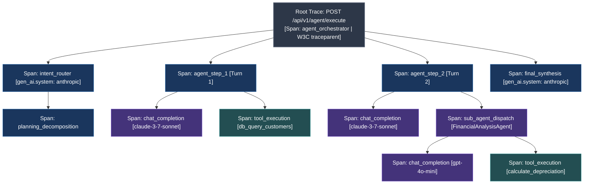
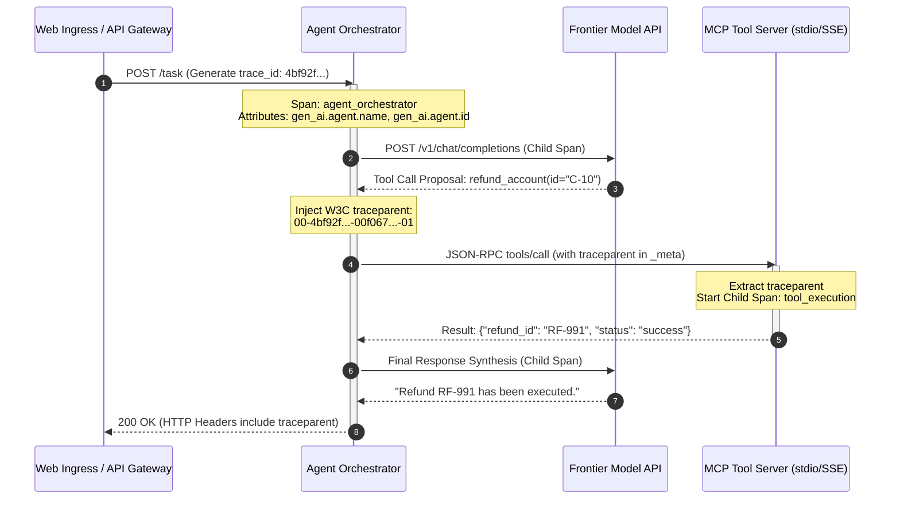

# OpenTelemetry Distributed Tracing & Agent Spans: Semantic Conventions & Async Context Propagation

> **[Tier: 🟡 Engineering Depth]**  
> **Core Concept**: Autonomous AI agents execute complex asynchronous distributed workflows that require OpenTelemetry GenAI semantic conventions, explicit agent span attributes, and W3C traceparent propagation across HTTP, message queues, and Model Context Protocol boundaries.

---

## 🎯 What You Will Learn
- Why standard application logging fails in multi-step AI systems and how distributed tracing restores visibility.
- How to implement the mid-2026 OpenTelemetry dedicated **`semantic-conventions-genai`** (v1.42.0+) specification.
- How to instrument autonomous agents using official Agent attributes (`gen_ai.agent.name`, `id`, `version`, `description`).
- How to propagate distributed trace context using the **W3C `traceparent`** standard across HTTP, asynchronous message brokers, and Model Context Protocol (MCP) stdio/SSE channels.
- How leading AI observability platforms (**Langfuse**, **Arize Phoenix**, **LangSmith**, **Cloud-Native APM**) compare in architecture and self-hostability.

---

## 1. The Problem

When an autonomous AI agent crashes or times out in production, traditional application logging outputs an unhelpful error:
```text
[ERROR] 2026-09-29 14:22:01 - AgentExecutor: Task failed after 32.4 seconds with TimeoutError
```

This single log entry tells you nothing about what actually transpired:
* Which specific sub-agent or tool call triggered the timeout?
* What exact prompt was passed into the language model at step 3?
* How many input and completion tokens were consumed by intermediate reasoning loops?
* Did an upstream database query stall, or did a cloud LLM provider throttle the request with an HTTP 429 backoff?

In a multi-turn, multi-agent system, execution branches across asynchronous process boundaries, background queues, and external Model Context Protocol (MCP) servers. Without a structured trace hierarchy, debugging agent failures is nearly impossible.

---

## 2. The Core Idea & Why Naive Fails

```text
Do not treat AI interactions as isolated log messages.
Treat every agent task as a Distributed Trace Tree with typed GenAI span conventions.
```

### Why Naive Logging Fails
1. **Loss of Parent-Child Causality**: In concurrent systems handling dozens of simultaneous users, flat log lines interleave randomly. Without distributed span identifiers, you cannot reconstruct which tool call belonged to which agent thought.
2. **Missing Token & Cost Attribution**: Standard APMs record HTTP request durations, but fail to capture token usage (`input_tokens`, `output_tokens`, `cached_tokens`). Engineering cannot track which specific prompt variant or tool response caused a cost spike.
3. **Trace Context Severing Across Asynchronous Queues**: When an agent delegates a long-running research task to a Celery worker or publishes an event to Kafka, standard tracing contexts are dropped unless explicitly serialized into message metadata.

---

## 3. Mental Model

Think of agent observability as a **hierarchical span tree** governed by the **OpenTelemetry (OTel)** standard:



### Visual Walkthrough
1. **Root Span (`agent_orchestrator`)**: Initiated when the client dispatches a task. Generates the root W3C `traceparent` identifier.
2. **Intent & Planning Spans**: Capture the initial prompt classification and task decomposition.
3. **Execution Turn Spans (`agent_step_1`, `agent_step_2`)**: Group individual turns. Each step contains child spans for the model completion and subsequent tool calls.
4. **Sub-Agent Dispatch**: Demonstrates nested hierarchy: the primary agent spawns an asynchronous child agent (`FinancialAnalysisAgent`), passing the trace context across the boundary.
5. **Final Synthesis**: Gathers intermediate artifacts into the final response emitted to the client.

---

## 4. How It Works: The 2026 OpenTelemetry GenAI Standard

In mid-2026 (v1.42.0+), OpenTelemetry migrated GenAI semantic conventions to a dedicated repository: **`semantic-conventions-genai`**. This ensures rapid iteration while maintaining stability for core networking and database spans.

### 1. Core Model Invocation Attributes
Every span representing an LLM chat completion or embedding request must include these standardized attributes:

| Span Attribute Key | Type | Description | Production Example |
|---|---|---|---|
| `gen_ai.operation.name` | string | Standardized operation category | `chat`, `text_completion`, `embeddings` |
| `gen_ai.provider.name` | string | Target platform or provider | `anthropic`, `openai`, `gemini`, `vertex_ai` |
| `gen_ai.request.model` | string | Model requested by application | `claude-3-7-sonnet-20250219`, `gpt-4o` |
| `gen_ai.response.model` | string | Exact model snapshot that served request | `claude-3-7-sonnet-20250219` |
| `gen_ai.request.temperature` | double | Temperature sampling parameter | `0.0` |
| `gen_ai.usage.input_tokens` | int | Number of prompt/context tokens | `1420` |
| `gen_ai.usage.output_tokens`| int | Number of generated completion tokens | `280` |
| `gen_ai.usage.cache_read.input_tokens` | int | Tokens read from prefix memory cache | `1150` |

---

### 2. Official 2026 Agent Attributes
For multi-step autonomous agents, OpenTelemetry establishes explicit agent-level conventions:

| Span Attribute Key | Type | Description | Production Example |
|---|---|---|---|
| `gen_ai.agent.id` | string | Unique persistent identifier of the agent | `agent-billing-refund-v2` |
| `gen_ai.agent.name` | string | Human-readable name of the agent | `CustomerBillingReconciliationAgent` |
| `gen_ai.agent.version` | string | Semantic version of system prompt / code | `v2.4.1` |
| `gen_ai.agent.description` | string | High-level operational role | `Reconciles corporate credit card disputes` |

---

### 3. W3C TraceContext Propagation
To maintain unbroken trace trees across microservices, asynchronous queues (Redis, RabbitMQ), and Model Context Protocol (MCP) processes, systems pass the standardized W3C `traceparent` header:

```text
W3C traceparent header format:
version - trace_id (32 hex) - parent_span_id (16 hex) - trace_flags (2 hex)

Example:
00-4bf92f3577b34da6a3ce929d0e0e4736-00f067aa0ba902b7-01
```

When an agent invokes a remote MCP tool or enqueues a background job, it injects the active `traceparent` into the payload metadata. The recipient extracts the header and starts a child span linked directly to the parent trace.

---

## 5. Modern AI Observability Platforms Compared

Enterprise architects select their observability backend based on data sovereignty, protocol compliance, and operational focus:

| Dimension | Langfuse | Arize Phoenix | LangSmith | Cloud-Native APM (GCP / Azure / Datadog) |
|---|---|---|---|---|
| **Architecture** | Open source (Postgres + ClickHouse backend) | Open source (OTel native, DuckDB / ClickHouse) | Closed-source SaaS (Enterprise VPC available) | Enterprise cloud APM platform |
| **OTel Compliance** | High (Native OpenTelemetry Ingest API) | **100% Native OpenTelemetry Collector** | Proprietary RunTree format (OTel bridge available) | Fully standard W3C / OTel native |
| **Key Strengths** | Prompt versioning, integrated evals, cost tracking, clean UI | Deep vector retrieval visualization, clustering, embedding drift | Tightest integration with LangChain / LangGraph ecosystem | Single pane of glass with infrastructure (VMs, DBs, K8s) |
| **Agent Trajectories** | Visual span waterfall with tool inputs/outputs | Full span timeline with latency waterfall analysis | Detailed state inspection for graph nodes | Distributed waterfall, but lacks LLM-specific prompt playgrounds |
| **Self-Hostable** | Yes (Docker, Helm chart, single binary) | Yes (Python library, Docker, local Jupyter) | No (Cloud SaaS primary, complex enterprise license) | Managed cloud only |
| **Best Used For** | Production LLMOps, prompt engineering, cost control | Deep RAG diagnostics, research, vector drift detection | Rapid prototyping within LangGraph | Regulated enterprises standardizing on cloud compliance |

---

## 6. Concrete Scenario & Code Implementation

Below is a complete Python 3.12+ implementation using the OpenTelemetry SDK. It demonstrates manual span creation, typed 2026 attribute mapping constants, W3C traceparent carrier serialization, and child span linking across an asynchronous boundary:

```python
"""
opentelemetry_agent_tracer.py
Production OpenTelemetry instrumentation for multi-step agents.
Implements 2026 semantic conventions and W3C traceparent context propagation.
"""

from __future__ import annotations

import json
from typing import Dict, Any
from opentelemetry import trace
from opentelemetry.trace import Status, StatusCode, SpanKind
from opentelemetry.trace.propagation.tracecontext import TraceContextTextMapPropagator
from opentelemetry.sdk.trace import TracerProvider
from opentelemetry.sdk.trace.export import SimpleSpanProcessor, ConsoleSpanExporter


# ---------------------------------------------------------------------------
# 1. 2026 GenAI Semantic Convention Constants (semantic-conventions-genai)
# ---------------------------------------------------------------------------
GEN_AI_OPERATION_NAME = "gen_ai.operation.name"
GEN_AI_PROVIDER_NAME = "gen_ai.provider.name"
GEN_AI_REQUEST_MODEL = "gen_ai.request.model"
GEN_AI_RESPONSE_MODEL = "gen_ai.response.model"
GEN_AI_INPUT_TOKENS = "gen_ai.usage.input_tokens"
GEN_AI_OUTPUT_TOKENS = "gen_ai.usage.output_tokens"
GEN_AI_CACHE_READ_TOKENS = "gen_ai.usage.cache_read.input_tokens"

# 2026 Official Agent Attributes
GEN_AI_AGENT_ID = "gen_ai.agent.id"
GEN_AI_AGENT_NAME = "gen_ai.agent.name"
GEN_AI_AGENT_VERSION = "gen_ai.agent.version"
GEN_AI_AGENT_DESCRIPTION = "gen_ai.agent.description"


# ---------------------------------------------------------------------------
# 2. Configure Tracer Provider
# ---------------------------------------------------------------------------
provider = TracerProvider()
# For production: replace ConsoleSpanExporter with OTLPSpanExporter(endpoint="https://otel.langfuse.com")
provider.add_span_processor(SimpleSpanProcessor(ConsoleSpanExporter()))
trace.set_tracer_provider(provider)
tracer = trace.get_tracer("enterprise.agent.orchestrator", "2.4.0")
propagator = TraceContextTextMapPropagator()


# ---------------------------------------------------------------------------
# 3. Instrumented Agent Execution Engine
# ---------------------------------------------------------------------------
class InstrumentedAgent:
    def __init__(self, agent_id: str, agent_name: str, version: str):
        self.agent_id = agent_id
        self.agent_name = agent_name
        self.version = version

    def execute_task(self, task_prompt: str) -> Dict[str, Any]:
        """Root task execution generating root span and W3C traceparent carrier."""
        with tracer.start_as_current_span("agent_task_orchestration", kind=SpanKind.SERVER) as root_span:
            # Set 2026 Agent Attributes
            root_span.set_attribute(GEN_AI_AGENT_ID, self.agent_id)
            root_span.set_attribute(GEN_AI_AGENT_NAME, self.agent_name)
            root_span.set_attribute(GEN_AI_AGENT_VERSION, self.version)
            root_span.set_attribute(GEN_AI_AGENT_DESCRIPTION, "Autonomous Billing Reconciliation Agent")

            # Step 1: LLM Reasoning Call (Child Span)
            step1_output = self._call_llm_step(
                step_name="triage_reasoning",
                prompt=task_prompt,
                model="claude-3-7-sonnet",
                input_tokens=850,
                output_tokens=120,
                cached_tokens=600,
            )

            # Step 2: Inject W3C TraceContext into Carrier for Remote Tool Call
            carrier: Dict[str, str] = {}
            propagator.inject(carrier)

            # Step 3: Execute Remote Tool (Simulating async worker or MCP channel)
            tool_result = self._dispatch_remote_tool_call(
                carrier=carrier,
                tool_name="process_account_refund",
                arguments={"account_id": "ACC-991", "amount_usd": 150.0},
            )

            root_span.set_status(Status(StatusCode.OK))
            return {
                "status": "COMPLETED",
                "tool_result": tool_result,
                "trace_id": format(root_span.get_span_context().trace_id, "032x"),
            }

    def _call_llm_step(
        self,
        step_name: str,
        prompt: str,
        model: str,
        input_tokens: int,
        output_tokens: int,
        cached_tokens: int,
    ) -> str:
        """Emits standard OpenTelemetry GenAI chat completion child span."""
        with tracer.start_as_current_span(f"llm_{step_name}", kind=SpanKind.CLIENT) as span:
            span.set_attribute(GEN_AI_OPERATION_NAME, "chat")
            span.set_attribute(GEN_AI_PROVIDER_NAME, "anthropic")
            span.set_attribute(GEN_AI_REQUEST_MODEL, model)
            span.set_attribute(GEN_AI_RESPONSE_MODEL, model)
            span.set_attribute(GEN_AI_INPUT_TOKENS, input_tokens)
            span.set_attribute(GEN_AI_OUTPUT_TOKENS, output_tokens)
            span.set_attribute(GEN_AI_CACHE_READ_TOKENS, cached_tokens)
            span.set_status(Status(StatusCode.OK))
            return "DECISION: Trigger refund for account ACC-991"

    def _dispatch_remote_tool_call(
        self,
        carrier: Dict[str, str],
        tool_name: str,
        arguments: Dict[str, Any],
    ) -> Dict[str, Any]:
        """Extracts W3C traceparent and executes tool within continuous trace."""
        parent_context = propagator.extract(carrier)
        with tracer.start_as_current_span(
            f"tool_{tool_name}",
            context=parent_context,
            kind=SpanKind.INTERNAL,
        ) as tool_span:
            tool_span.set_attribute("gen_ai.tool.name", tool_name)
            tool_span.set_attribute("gen_ai.tool.parameters", json.dumps(arguments))
            # Simulate tool execution
            tool_span.set_status(Status(StatusCode.OK))
            return {"transaction_id": "TXN-8812", "status": "APPROVED"}


# ---------------------------------------------------------------------------
# 4. Demonstration Run
# ---------------------------------------------------------------------------
if __name__ == "__main__":
    agent = InstrumentedAgent(
        agent_id="agent-fin-001",
        agent_name="BillingReconciliationAgent",
        version="v2.4.1",
    )
    result = agent.execute_task("Investigate dispute for invoice INV-4401 on account ACC-991")
    print(f"\nExecution Finished. Generated Root Trace ID: {result['trace_id']}")
```

---

## 7. Architecture & Telemetry View

Below is the distributed trace context propagation flow across microservice and MCP boundaries:



### Visual Walkthrough
1. **Request Ingress**: The client hits the API gateway, which starts the root span and allocates a 32-hex `trace_id`.
2. **Model Call**: The orchestrator spawns a child span with standardized `gen_ai.*` token and model attributes.
3. **TraceContext Injection**: The orchestrator injects the W3C `traceparent` into the JSON-RPC `_meta` dictionary before calling the tool.
4. **Tool Server Continuity**: The Model Context Protocol (MCP) server extracts the `traceparent` and creates a child span linked to the same root trace.
5. **Client Response**: The final response returns to the client with the unbroken distributed trace intact.

---

## 8. Common Failure Modes & Anti-Patterns

### Anti-Pattern 1: The Broken Async Trace Context
* **The Pathology**: Enqueueing a background task into Redis / Celery or publishing to Kafka without passing the active OpenTelemetry context.
* **The Consequence**: The worker process generates a brand new `trace_id`. The background processing is completely severed from the user's initial request in APM waterfalls.
* **The Remedy**: Always use `propagator.inject(carrier)` to embed the active `traceparent` into the message payload, and `propagator.extract(carrier)` inside the worker.

### Anti-Pattern 2: Cardinality Explosions in Trace Attributes
* **The Pathology**: Storing complete 50-page raw text documents or unique high-entropy user input strings as OpenTelemetry span attributes.
* **The Consequence**: Telemetry backends (ClickHouse, Elasticsearch) suffer severe memory degradation and query slowdowns due to unindexed high-cardinality keys.
* **The Remedy**: Store high-entropy text payloads as Span Events or export them to dedicated object storage (S3/GCS), referencing them via hash pointers in span metadata.

---

## 9. Production View & Evaluation

When establishing distributed tracing in production AI systems, monitor the following telemetry health metrics:

| Metric | Target SLA | Operational Significance |
|---|---|---|
| **Trace Sampling Rate** | `100% on Errors, 5–10% on Routine` | Balances observability fidelity against telemetry storage cost. |
| **Trace Parent Continuity** | `100% unbroken` | Ensures zero severed parent-child relationships across async workers. |
| **Span Export Latency (p99)** | `< 5.0 ms (Async)` | Telemetry batch export must never block user-facing inference threads. |
| **Token Attribution Coverage** | `100.0% of LLM Spans` | Guarantees all cloud API spend is mapped to specific agent features. |

---

## 10. When Should You Use It? (Trade-off Matrix)

| Observability Strategy | Implementation Complexity | Latency Overhead | Storage Footprint | Diagnostic Resolution |
|---|---|---|---|---|
| **Flat Application Logging** | Minimal (Standard Logger) | Negligible (< 0.1ms) | Low | Low (Fails on async causality) |
| **Custom JSON DB Logging** | Moderate | Low (Async write) | Moderate | Moderate (Requires custom UI) |
| **OpenTelemetry GenAI Spans** | Standard (OTel SDK) | Negligible (< 1ms async) | Managed via Sampling | **Highest (Standardized across vendors)** |

---

## 11. Key Takeaways & Verified Resources

* **Embrace the 2026 Dedicated Registry**: Use `semantic-conventions-genai` (v1.42.0+) and define attribute constants in code to safeguard against upstream naming changes.
* **Instrument Agent Attributes**: Tag spans with `gen_ai.agent.name`, `id`, `version`, and `description` to enable filtering by agent fleet.
* **Pass W3C traceparent everywhere**: Inject context across HTTP headers, background message queues, and Model Context Protocol stdio pipes.
* **Track Token Usage on Spans**: Capture input, output, and prefix cache read tokens directly on spans for accurate cost accounting.

### Authoritative References
* **OpenTelemetry Specification**: [Generative AI Semantic Conventions](https://opentelemetry.io/docs/specs/semconv/gen-ai/) — *Official W3C / CNCF standard for tracing spans, token metrics, and model attributes.*
* **OpenTelemetry GitHub**: [open-telemetry/semantic-conventions-genai](https://github.com/open-telemetry/semantic-conventions-genai) — *Dedicated upstream repository for AI telemetry.*
* **W3C Recommendation**: [Trace Context Specification (traceparent)](https://www.w3.org/TR/trace-context/) — *The universal standard for distributed trace propagation.*
* **Langfuse**: [OpenTelemetry Integration Guide](https://langfuse.com/docs/opentelemetry) — *Production documentation for open-source AI observability.*

---

## 🧭 Navigation

- **[← Previous Lesson: Evaluation Datasets & Synthetic Data Curation](./04-evaluation-datasets-and-synthetic-data-curation.md)**
- **[Phase 06 Hub: Evals & Observability](./README.md)**
- **[Next Lesson: Telemetry Metrics, Cost Governance & Golden Signals →](./06-telemetry-metrics-cost-governance-and-golden-signals.md)**
- **[Capstone Challenge: Automated CI/CD Evaluation Pipeline](./labs/capstone-cicd-evaluation-pipeline.md)**
