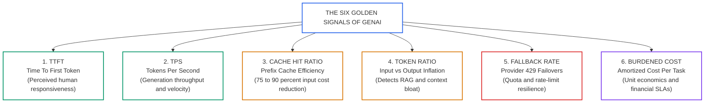
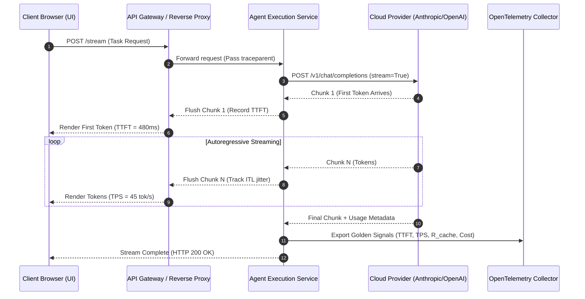

# Telemetry Metrics and Cost Governance: The Six Golden Signals, Streaming Latency, and Prefix Caching

> **[Tier: 🟡 Engineering Depth]**  
> **Estimated Reading Time: 14 minutes**  
> **Core Concept**: Production AI systems require real-time monitoring of the Six Golden Signals—TTFT, TPS, Cache Hit Ratio, Token Inflation Ratio, Fallback Frequency, and Fully Burdened Cost—to safeguard user experience and prevent economic blowouts.

### Term Ledger
- **New AI terms introduced**: TTFT (Time To First Token), TPS (Tokens Per Second), ITL (Inter-Token Latency), TTFC (Time To First Chunk), prefix caching, token inflation ratio.
- **AI terms assumed from earlier lessons**: token, context window, attention, KV cache, latency, distributed trace, span.

---

## 🎯 What You Will Learn
- How to measure and optimize the **Six Golden Signals of LLM Systems**: TTFT, TPS, Cache Hit Ratio, Token Ratio, Fallback Rate, and Fully Burdened Cost.
- The physics of streaming telemetry: measuring **Inter-Token Latency (ITL)** variance and distinguishing **Time To First Chunk (TTFC)** from TTFT.
- The unit economics of **Prefix Prompt Caching** (Anthropic, OpenAI, Gemini) and how achieving a cache hit ratio >= 65% slashes cloud expenditures by up to 90%.
- How to establish automated CI/CD cost governance gates and production alerting thresholds.
- How to implement a real-time Telemetry and Cost Engine in typed Python 3.12+.

---

## 1. The Problem

Traditional microservices rely on generic infrastructure metrics: CPU utilization, RAM consumption, disk I/O, and HTTP 5xx error percentages.

In generative AI systems, these traditional signals are almost completely blind:
* A containerized AI gateway can sit at a calm 12% CPU utilization. Meanwhile, users experience devastating 4,500 ms delays because the cloud model is computing an uncached pre-fill attention phase.
* An application can report an HTTP 200 OK success rate of 99.9%. Meanwhile, monthly GPU token expenditures spike 400% because an uncompacted prompt bloated multi-turn context from 2,000 to 32,000 tokens per turn.
* A streaming user interface can stutter and freeze due to high Inter-Token Latency variance caused by reverse-proxy buffering, despite low aggregate network latency.

Without AI-native operational metrics, engineering leaders cannot enforce service level agreements (SLAs), diagnose streaming jitter, or govern cloud expenditures.

---

## 2. The Core Idea: Telemetry at the Attention Boundary

```text
Traditional APM monitors the server.
AI Systems Engineering monitors the Attention Stream, Token Velocity, and Unit Economics.
```

### The Physical Analogy
Think of traditional APM like checking fuel flow and engine RPM in a transport truck. AI telemetry is like tracking the exact cargo weight and delivery route efficiency. The truck engine may run smoothly while carrying empty boxes at ten times the budget.

### Where This Analogy Breaks
In traditional networks, throughput depends on packet routing and socket buffers. In generative AI, latency splits into two physical phases governed by silicon mechanics:
1. **The Pre-fill Phase**: Ingesting the prompt and computing key-value tensors (compute-bound, determines TTFT).
2. **The Autoregressive Decoding Phase**: Generating output tokens one by one (memory-bandwidth bound on GPU HBM, determines TPS and ITL).

Measuring only total end-to-end duration obscures whether a slowdown stems from an oversized prompt or an excessively verbose generation.

---

## 3. Mental Model: The Six Golden Signals

Senior systems architects monitor generative AI platforms across **Six Golden Signals**:



### Visual Walkthrough
1. **TTFT (Time To First Token)**: Governs human-perceived latency. Users perceive an interface as responsive if the first token streams within 1,200 ms, even if complete generation takes 10 seconds.
2. **TPS (Tokens Per Second)**: Reflects output generation velocity. Human reading speed is 5–8 tokens/sec; interactive agents should deliver >= 30 to 60 TPS.
3. **Cache Hit Ratio**: Tracks the percentage of prompt tokens read from memory cache. An optimal system sustains >= 65% cache hit rates.
4. **Token Inflation Ratio**: Measures prompt-to-completion balance. High ratios (such as 50:1) flag inefficient RAG retrieval or runaway conversation history.
5. **Fallback Rate**: Measures frequency of automated failovers to secondary providers when primary models hit HTTP 429 rate limits.
6. **Fully Burdened Cost**: Aggregates token spend and tool compute into a single dollar cost per successful task resolution.

---

## 4. How It Works: Step-by-Step Mechanics and Formulas

### 1. Time To First Token (TTFT)
* **Definition**: The wall-clock duration from the client dispatching the HTTP request until the client receives the first streamed token.
* **Target SLA**: `p50 < 800 ms`, `p95 < 1,500 ms`.
* **Architectural Levers**: Prompt caching, model selection (smaller models have lower TTFT), minimizing excessive pre-fill system instructions.

---

### 2. Tokens Per Second (TPS) and Inter-Token Latency (ITL)
* **Definition**: Output tokens divided by elapsed time after the first token arrives:
  ```text
  Generation Velocity Formula:
  TPS = Output_Tokens / (Total_Elapsed_Time - TTFT)
  ```
* **Inter-Token Latency (ITL)**: The elapsed time between consecutive tokens t_i and t_{i+1} during streaming. High ITL variance (jitter) causes visible stutter in web interfaces.
* **Target SLA**: `TPS >= 30 tokens/sec`, `ITL Variance < 15 ms`.

---

### 3. Prompt vs. Completion Token Ratio
* **Definition**: The ratio of prompt tokens sent to output tokens generated:
  ```text
  Token Inflation Ratio Formula:
  Token_Ratio = Input_Tokens / Output_Tokens
  ```
* **Risk Indicator**: A ratio of `50:1` (sending 10,000 tokens of context to retrieve a 20-token answer) indicates inefficient RAG chunking or bloated conversation history that requires compaction.

---

### 4. Prompt Cache Hit Ratio (R_cache)
* **Definition**: The percentage of prompt tokens read from memory cache (Anthropic Prompt Caching, Gemini Context Caching, OpenAI Prefix Caching):
  ```text
  Prompt Cache Hit Ratio Formula:
  Cache_Hit_Ratio = (Cached_Prompt_Tokens / Total_Prompt_Tokens) * 100%
  ```
* **Cost Impact**: Cache hits reduce input token costs by up to 75% to 90% and reduce TTFT by up to 80%. Multi-turn agent architectures should maintain `Cache_Hit_Ratio >= 65%`.

---

### 5. Model Fallback and Retry Rate
* **Definition**: The percentage of inference calls that trigger automated fallback cascades due to rate limits (HTTP 429), timeouts (504), or server errors (500). Fallback cascades divert traffic across models like Claude 3.7 (as of 2025-02), GPT-4o (as of 2024-08), or Gemini 2.5 Flash (as of 2025).
* **Alert Threshold**: Any sustained fallback rate `> 2.0%` indicates impending quota exhaustion or upstream provider degradation.

---

### 6. Fully Burdened Cost Per Task
* **Formula**:
  ```text
  Fully Burdened Cost Formula:
  Cost = Sum(Input_Tokens * Price_In) + Sum(Output_Tokens * Price_Out) + Tool_Compute_Cost
  ```
* **Unit Economics**: Allows engineering to establish financial unit economics: *"An automated customer support resolution costs $0.038, whereas a manual human agent costs $4.50."*

---

## 5. Concrete Scenario: Real-Time Telemetry and Cost Engine

Below is a complete Python 3.12+ Telemetry and Cost Engine that calculates all Six Golden Signals, evaluates ITL streaming jitter, and asserts operational SLA thresholds:

```python
"""
golden_signals_telemetry.py
Production GenAI Telemetry Engine:
Calculates TTFT, TPS, Inter-Token Latency (ITL) variance, Cache Hit Ratios, and Cost SLAs.
"""

from __future__ import annotations

import statistics
import time
from typing import List
from pydantic import BaseModel, Field


# ---------------------------------------------------------------------------
# 1. Telemetry Data Schemas
# ---------------------------------------------------------------------------
class ModelPricing(BaseModel):
    price_per_m_input: float = 3.00       # $3.00 per 1M uncached input tokens
    price_per_m_cached: float = 0.30      # $0.30 per 1M cached input tokens (90% discount)
    price_per_m_output: float = 15.00     # $15.00 per 1M output tokens


class StreamTurnTelemetry(BaseModel):
    task_id: str
    request_start_timestamp: float
    first_token_timestamp: float
    completion_timestamp: float
    token_timestamps: List[float] = Field(default_factory=list)
    uncached_input_tokens: int
    cached_input_tokens: int
    output_tokens: int
    fallback_triggered: bool = False
    tool_compute_cost_usd: float = 0.0


class GoldenSignalsReport(BaseModel):
    task_id: str
    ttft_ms: float
    tps: float
    mean_itl_ms: float
    itl_std_dev_ms: float
    cache_hit_ratio_pct: float
    token_ratio: float
    total_cost_usd: float
    sla_violations: List[str] = Field(default_factory=list)


# ---------------------------------------------------------------------------
# 2. Telemetry Analysis Engine
# ---------------------------------------------------------------------------
class TelemetryEngine:
    def __init__(
        self,
        pricing: ModelPricing,
        max_allowed_ttft_ms: float = 1500.0,
        min_allowed_tps: float = 25.0,
        max_cost_per_task_usd: float = 0.05,
    ):
        self.pricing = pricing
        self.max_ttft_ms = max_allowed_ttft_ms
        self.min_tps = min_allowed_tps
        self.max_cost = max_cost_per_task_usd

    def analyze_stream(self, data: StreamTurnTelemetry) -> GoldenSignalsReport:
        violations: list[str] = []

        # 1. Time To First Token (TTFT)
        ttft_sec = data.first_token_timestamp - data.request_start_timestamp
        ttft_ms = ttft_sec * 1000.0
        if ttft_ms > self.max_ttft_ms:
            violations.append(f"TTFT SLA breached: {ttft_ms:.1f}ms > {self.max_ttft_ms}ms")

        # 2. Tokens Per Second (TPS)
        decoding_duration = data.completion_timestamp - data.first_token_timestamp
        tps = (data.output_tokens / decoding_duration) if decoding_duration > 0 else 0.0
        if tps < self.min_tps and data.output_tokens > 5:
            violations.append(f"TPS SLA breached: {tps:.1f} tokens/s < {self.min_tps} tokens/s")

        # 3. Inter-Token Latency (ITL) Variance and Jitter
        itl_ms_list: list[float] = []
        if len(data.token_timestamps) > 1:
            for i in range(1, len(data.token_timestamps)):
                delta_ms = (data.token_timestamps[i] - data.token_timestamps[i - 1]) * 1000.0
                itl_ms_list.append(delta_ms)

        mean_itl = statistics.mean(itl_ms_list) if itl_ms_list else 0.0
        std_dev_itl = statistics.stdev(itl_ms_list) if len(itl_ms_list) > 1 else 0.0

        # 4. Prompt Cache Hit Ratio
        total_input_tokens = data.uncached_input_tokens + data.cached_input_tokens
        cache_hit_ratio = (
            (data.cached_input_tokens / total_input_tokens) * 100.0
            if total_input_tokens > 0 else 0.0
        )

        # 5. Token Ratio (Input vs Output)
        token_ratio = (total_input_tokens / data.output_tokens) if data.output_tokens > 0 else 0.0

        # 6. Fully Burdened Cost Calculation
        cost_uncached = (data.uncached_input_tokens / 1_000_000) * self.pricing.price_per_m_input
        cost_cached = (data.cached_input_tokens / 1_000_000) * self.pricing.price_per_m_cached
        cost_output = (data.output_tokens / 1_000_000) * self.pricing.price_per_m_output
        total_cost = cost_uncached + cost_cached + cost_output + data.tool_compute_cost_usd

        if total_cost > self.max_cost:
            violations.append(f"Cost budget breached: ${total_cost:.4f} > ${self.max_cost:.4f}")

        return GoldenSignalsReport(
            task_id=data.task_id,
            ttft_ms=ttft_ms,
            tps=tps,
            mean_itl_ms=mean_itl,
            itl_std_dev_ms=std_dev_itl,
            cache_hit_ratio_pct=cache_hit_ratio,
            token_ratio=token_ratio,
            total_cost_usd=total_cost,
            sla_violations=violations,
        )


# ---------------------------------------------------------------------------
# 3. Demonstration & Unit Execution
# ---------------------------------------------------------------------------
if __name__ == "__main__":
    engine = TelemetryEngine(
        pricing=ModelPricing(),
        max_allowed_ttft_ms=1200.0,
        min_allowed_tps=30.0,
        max_cost_per_task_usd=0.02,
    )

    t0 = time.time()
    t1 = t0 + 0.420  # TTFT = 420ms
    # Simulate 10 token timestamps with minor jitter
    token_times = [t1 + (i * 0.025) for i in range(10)]
    t_end = token_times[-1]

    simulated_telemetry = StreamTurnTelemetry(
        task_id="TASK-STREAM-901",
        request_start_timestamp=t0,
        first_token_timestamp=t1,
        completion_timestamp=t_end,
        token_timestamps=token_times,
        uncached_input_tokens=250,
        cached_input_tokens=1800,  # 87.8% cached prompt
        output_tokens=10,
        tool_compute_cost_usd=0.0005,
    )

    report = engine.analyze_stream(simulated_telemetry)
    print("================ SIX GOLDEN SIGNALS REPORT ================")
    print(f"Task ID:               {report.task_id}")
    print(f"Time To First Token:   {report.ttft_ms:.1f} ms")
    print(f"Generation Velocity:   {report.tps:.1f} tokens/sec")
    print(f"Mean Inter-Token Lat:  {report.mean_itl_ms:.1f} ms (StdDev: {report.itl_std_dev_ms:.2f} ms)")
    print(f"Cache Hit Ratio:       {report.cache_hit_ratio_pct:.1f}%")
    print(f"Input/Output Ratio:    {report.token_ratio:.1f} : 1")
    print(f"Fully Burdened Cost:   ${report.total_cost_usd:.5f}")
    print(f"SLA Violations:        {report.sla_violations if report.sla_violations else 'None (All SLAs Met)'}")
    print("===========================================================")
```

---

## 6. Engineering Solutions and Production Patterns

### Pattern 1: Prefix Caching Structure Optimization
To maximize your Cache Hit Ratio (R_cache >= 65%), design your prompts with strict prefix stability:
1. **Static System Instructions**: Place fixed company rules, persona definitions, and tool schemas at the very beginning of the prompt.
2. **Fixed Few-Shot Examples**: Place immutable golden examples directly after system instructions.
3. **Dynamic User Turn**: Always append the dynamic user query at the very end.

```text
[STATIC PREFIX - Cached across 1,000s of requests (90% discount)]
├── 1. System Prompt & Operational Directives (2,000 tokens)
├── 2. Tool Declarations & JSON Schemas (1,500 tokens)
└── 3. Static Few-Shot Exemplars (1,000 tokens)

[DYNAMIC SUFFIX - Computed fresh per request]
└── 4. Current User Query & Retrieved RAG Chunks (400 tokens)
```

If you dynamically inject timestamps or user IDs at the top of the prompt, you invalidate the entire KV cache prefix. That forces the provider to recompute attention over 4,500 tokens at full price.

### Pattern 2: Mitigating Streaming Stutter Behind Reverse Proxies
When streaming LLM responses through NGINX, Envoy, or AWS ALB, developers often observe high TTFC because the reverse proxy buffers HTTP chunks before forwarding them to the client.
* **Fix in NGINX**: Set `proxy_buffering off;` and send header `X-Accel-Buffering: no;`.
* **Fix in Envoy**: Configure `buffer_filter` with zero buffering on streaming routes.

---

## 7. Architecture and Telemetry View

Below is the streaming metrics collection pipeline linking the client, reverse proxy, and OpenTelemetry monitoring store:



### Visual Walkthrough
1. **Request Ingress**: Client starts an SSE or WebSocket streaming connection.
2. **First Token Arrival**: As soon as chunk 1 arrives from the provider, the agent service flushes it immediately, recording the Time To First Token.
3. **Streaming and ITL**: Subsequent chunks stream directly to the client while the service samples timestamp deltas to measure Inter-Token Latency variance.
4. **Usage Telemetry Export**: The provider emits final token usage metadata, allowing the service to calculate cache hit efficiency and fully burdened cost before publishing the trace to OpenTelemetry.

---

## 8. Common Failure Modes and Anti-Patterns

### Anti-Pattern 1: The Dynamic Header Cache Buster
* **The Pathology**: Placing dynamic values (such as `Current Time: 2026-09-29 14:32:01.441`) at the very first line of the system prompt.
* **The Consequence**: Every single request produces a distinct byte prefix, dropping the Prompt Cache Hit Ratio to exactly 0.0% and increasing input token costs by 10x.
* **The Remedy**: Move all dynamic timestamps, session IDs, and transient data to the very end of the prompt or into the final user message.

### Anti-Pattern 2: The Context Window Leaky Bucket
* **The Pathology**: Appending all conversational history turns indefinitely without message pruning or compaction.
* **The Consequence**: By turn 10, the prompt contains 25,000 tokens of redundant history. Latency spikes and cost increases quadratically with conversation depth.
* **The Remedy**: Implement sliding window memory or LLM-summarized conversational checkpoints.

---

## 9. Production View and Evaluation

When configuring operational alerting rules for your AI gateway, use these production thresholds:

| Metric | Warning Alert | Critical PagerDuty Alert | Recommended Remediation |
|---|---|---|---|
| **TTFT (p95)** | `> 1,500 ms` | `> 3,000 ms` | Enable prompt prefix caching; switch to smaller model. |
| **TPS (Mean)** | `< 25 tokens/s` | `< 12 tokens/s` | Check upstream provider status; tune batching. |
| **Cache Hit Ratio** | `< 50.0%` | `< 30.0%` | Audit prompt prefixes for dynamic cache-busting keys. |
| **Fallback Rate** | `> 2.0%` | `> 5.0%` | Request quota increase; distribute traffic across multiple regions. |
| **Token Ratio** | `> 40:1` | `> 75:1` | Compact conversational history; tighten RAG chunk limits. |

---

## 10. When Should You Use It? (Trade-off Matrix)

| Operational Strategy | Engineering Overhead | Cost Savings | Latency Improvement | Risk Profile |
|---|---|---|---|---|
| **No Caching (Naive Prompts)** | Zero | Baseline (100% cost) | Baseline | High latency, high bills |
| **Prefix Caching Optimization** | Minimal (Prompt reordering) | **75% – 90% input savings** | **Up to 80% lower TTFT** | Zero risk (Standard provider API) |
| **Aggressive Context Pruning** | Moderate (Summarizer agent) | 40% – 60% savings | Moderate | Minor loss of distant conversational history |

---

## 11. Key Takeaways and Verified Resources

* **Monitor the Six Golden Signals**: TTFT, TPS, Cache Hit Ratio, Token Ratio, Fallback Rate, and Fully Burdened Cost.
* **Optimize for Prefix Caching**: Keep static system instructions, tool schemas, and few-shots at the beginning of prompts to unlock 90% token discounts.
* **Watch for Reverse Proxy Buffering**: Disable proxy buffering on streaming endpoints to prevent artificial TTFC latency spikes.
* **Enforce Cost SLAs in CI/CD**: Fail pull requests if a prompt refactoring regresses the fully burdened cost per task.

### Authoritative References
* **Anthropic Documentation**: [Prompt Caching Guide](https://docs.anthropic.com/en/docs/build-with-claude/prompt-caching) — *Architecture and cost breakdown for prefix caching.*
* **Google Cloud Vertex AI**: [Context Caching Overview](https://cloud.google.com/vertex-ai/generative-ai/docs/context-cache/context-cache-overview) — *Reducing latency and cost on Gemini models.*
* **OpenAI API Documentation**: [Prompt Caching in the API](https://platform.openai.com/docs/guides/prompt-caching) — *Automatic prefix caching mechanics.*
* **Cloudflare Blog**: [Understanding LLM Performance: TTFT, TPS, and Latency](https://blog.cloudflare.com/) — *Systems engineering analysis of streaming inference metrics.*

---

## ✅ Quick Check

You are reviewing an AI customer service agent running in production. The dashboard reports:
- Prompt Cache Hit Ratio dropped from 84% to 3.2% following a deployment.
- TTFT increased from 490 ms to 3,200 ms.
- Total token cost per conversation tripled overnight.
- The Git diff shows one modification in `prompt_builder.py`:
  `system_prompt = f"Timestamp: {datetime.utcnow().isoformat()}\n" + BASE_INSTRUCTIONS`

Explain why this change caused all three metrics to degrade and specify the exact one-line fix.

<details>
<summary>Suggested Solution</summary>

### Root Cause Analysis
1. **Cache Invalidation**: Provider prefix caching (Anthropic, OpenAI, Gemini) matches prompts by checking token prefixes byte-by-byte from index 0. 
2. Because `datetime.utcnow().isoformat()` inserts a millisecond-precision dynamic timestamp at character 0, every single request generates a brand-new, unique prefix string.
3. This completely invalidates the cached KV tensors across the entire system prompt and tool definitions.
4. **Latency and Cost Impact**: The model recomputes attention across all system instructions for every turn. This incurs full input cost and pre-fill latency, spiking TTFT to 3,200 ms.

### Exact Fix
Move the dynamic timestamp from the root prefix to the dynamic user turn at the very end of the prompt:
```python
import datetime

base_instructions = "You are a customer support agent."
user_query = "What is my order status?"

# System prompt remains completely immutable and cached:
system_prompt = base_instructions

# Append dynamic runtime variables to the user query payload:
now_str = datetime.datetime.now(datetime.timezone.utc).isoformat()
user_payload = f"{user_query}\n\n[Context: Client time {now_str}]"
assert len(system_prompt) > 0 and len(user_payload) > 0
```
This restores prefix stability and immediately brings the cache hit ratio back above 80%.
</details>

---

## 🧭 Navigation

- **[← Previous Lesson: OpenTelemetry Distributed Tracing & Agent Spans](./05-opentelemetry-distributed-tracing-and-agent-spans.md)**
- **[Phase 06 Hub: Evals & Observability](./README.md)**
- **[Next Lesson: Continuous Monitoring, Drift Detection & Canaries →](./07-continuous-monitoring-drift-detection-and-canaries.md)**
- **[Capstone Challenge: Automated CI/CD Evaluation Pipeline](./labs/capstone-cicd-evaluation-pipeline.md)**
