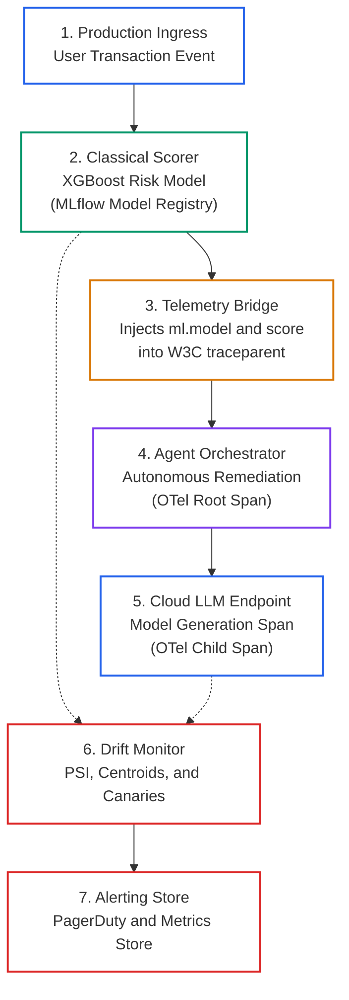
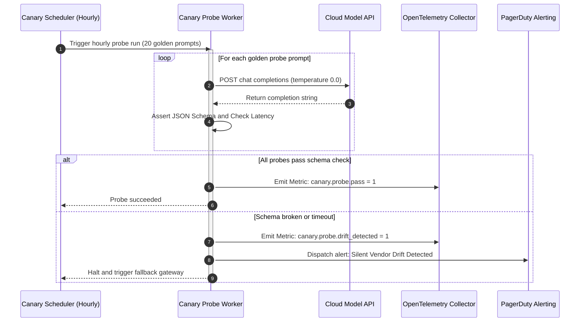

# Continuous Production Monitoring and Drift Detection: Population Stability Index (PSI), Concept Drift, and Hourly Canary Probes

> **[Tier: ⚫ Deep Dive]**  
> **Estimated Reading Time: 16 minutes**  
> **Core Concept**: Production AI systems experience three distinct forms of distribution shift—Data Drift, Concept Drift, and Prompt Drift—requiring unified telemetry bridges, Population Stability Index calculations, and automated hourly canary probes.

### Term Ledger
- **New AI terms introduced**: Data Drift, Concept Drift, Prompt Drift (Vendor Drift), Population Stability Index (PSI), Maximum Mean Discrepancy (MMD), Canary Probe.
- **AI terms assumed from earlier lessons**: token, embedding, context window, distributed trace, span, W3C traceparent.

---

## 🎯 What You Will Learn
- How to architect hybrid telemetry bridges that unify classical tabular ML tracking with generative AI distributed traces.
- How to diagnose and isolate the **Tri-Partite Drift Model**: Data Drift, Concept Drift, and Prompt Drift.
- How to calculate the **Population Stability Index (PSI)** on tabular features and **Maximum Mean Discrepancy (MMD)** on prompt embeddings.
- How to detect silent cloud provider model updates using **Automated Hourly Canary Probes**.
- How to triage production drift incidents using a comprehensive diagnostic decision matrix.

---

## 1. The Problem

In enterprise production architectures, generative AI rarely operates in isolation. Modern applications are almost universally **Hybrid AI Systems**:
* A **classical tabular model** (such as XGBoost or LightGBM) evaluates credit default risk or scores customer churn in sub-10ms latency.
* An **autonomous GenAI agent** ingests that statistical score, queries enterprise knowledge via RAG, evaluates business policies, and orchestrates remediation workflows.

Operating these hybrid architectures creates a severe operational challenge: **Tooling and Telemetry Fragmentation**. 

Data science teams track offline experiment registries and model versions in tools like MLflow or Weights and Biases. Meanwhile, software platform teams monitor online distributed traces in OpenTelemetry, Datadog, or Langfuse.

When an automated agent suddenly starts freezing legitimate customer accounts, engineers face a diagnostic nightmare:
* Did incoming user behavior change? (**Data Drift**)
* Did real-world fraud patterns evolve so that historical risk scores are invalid? (**Concept Drift**)
* Did the cloud LLM vendor silently update model weights overnight, altering output formatting? (**Prompt Drift**)

---

## 2. The Core Idea: Disentangling Tri-Partite Drift

```text
Do not treat all AI degradation as generic model decay.
Disentangle Data Drift, Concept Drift, and Prompt Drift using a Tri-Partite Monitoring Engine.
```

### The Physical Analogy
Think of a hybrid AI application like an automated aerospace navigation system:
1. **The physical sensors** (pitot tubes, gyroscopes) measure outside air pressure and speed. If a storm hits, sensor readings change (**Data Drift**).
2. **The physical atmosphere** might change density or aerodynamic properties at extreme altitudes, invalidating standard lift tables (**Concept Drift**).
3. **The flight computer firmware** might receive a silent background patch from the manufacturer, causing the control surfaces to react differently to identical sensor inputs (**Prompt Drift**).

### Where This Analogy Breaks
In aerospace engineering, flight control firmware updates require rigorous physical certification before deployment. In cloud AI, third-party LLM providers can deploy safety fine-tunes or quantization kernel changes without altering the API model alias. Your application absorbs these changes instantly without notice.

---

## 3. Mental Model: The Hybrid Plane and Telemetry Bridge

Below is the distributed architecture showing how classical ML and generative AI telemetry unify via W3C `traceparent` context propagation:



### Visual Walkthrough
1. **Production Ingress**: An incoming transaction triggers the execution pipeline.
2. **Classical Scorer**: A tabular model scores risk in sub-10ms time, recording metadata against its registry version.
3. **Telemetry Bridge**: The inference span injects its model version and risk score into the W3C `traceparent` carrier.
4. **Agent Orchestrator**: The autonomous agent extracts the trace context. Reasoning and tool execution spans become direct child nodes of the initial scoring span.
5. **Cloud LLM Endpoint**: The agent calls the foundational model to make decisions, creating child spans within the unified waterfall.
6. **Drift Monitor**: Background audits track feature distribution shifts, concept decay, and canary stability.
7. **Alerting Store**: Dispatches alerts when statistical drift exceeds critical bounds.

---

## 4. How It Works: Step-by-Step Mechanics

### 1. Unifying Classical ML Tracking with OpenTelemetry Spans
When an application invokes a registered tabular model, the scoring span enriches the active OpenTelemetry context with ML metadata:
* `ml.system`: `mlflow`
* `ml.model.uri`: `models:/fraud_classifier_xgboost/4.2.1`
* `ml.model.version`: `v4.2.1`
* `ml.inference.score`: `0.842`

When the downstream agent receives the score, it extracts the traceparent. This ensures the entire hybrid workflow appears in a single distributed waterfall.

---

### 2. Disentangling Tri-Partite Drift

```text
The Tri-Partite Drift Probability Space:
1. DATA DRIFT    : P(X) Shifts             (Input distributions change)
2. CONCEPT DRIFT : P(Y | X) Shifts          (Underlying ground truth changes)
3. PROMPT DRIFT  : P(Tokens | Prompt) Shifts (LLM generation behavior changes)
```

#### A. Data Drift (Covariate Shift)
* **Definition**: The probability distribution of incoming input features or user prompt strings changes relative to baseline distributions. The underlying real-world relationship remains identical.
* **Classical Metric**: **Population Stability Index (PSI)**:
  ```text
  Population Stability Index Formula:
  PSI = Sum [(Actual_k - Expected_k) * ln(Actual_k / Expected_k)]
  ```
  * `PSI < 0.10`: No significant distribution shift (Normal).
  * `0.10 <= PSI <= 0.20`: Moderate shift; trigger automated warning.
  * `PSI > 0.20`: Severe shift; model retraining and threshold update mandated.
* **GenAI Metric**: **Embedding Centroid Drift**: Measuring the shift in cosine similarity distributions between incoming user prompt embeddings and a frozen baseline centroid using **Maximum Mean Discrepancy (MMD)**.

#### B. Concept Drift (Conditional Shift)
* **Definition**: The statistical relationship between inputs and real-world ground truth changes. Even if user inputs look identical, historical labels no longer apply.
* **Example**: A customer with a credit score of 700 had a 98% repayment rate in 2024. During an economic shock in 2026, the repayment probability drops to 82%.
* **Detection Mechanics**: Requires **Delayed Ground-Truth Feedback Loops** (such as 30-day default chargebacks or human dispute logs). Track rolling-window ROC-AUC decay and Brier Score calibration drift.

#### C. Prompt Drift and Vendor Behavioral Drift
* **Definition**: The conditional distribution of generated tokens given an immutable prompt shifts over time due to silent vendor updates.
* **Symptoms**:
  * An untouched prompt that had a 99.8% valid JSON output rate drops to 92.4%.
  * Refusal rates spike on benign business prompts due to aggressive safety filters.
  * Reasoning chain lengths contract by 40%, degrading multi-step math or tool accuracy.
* **Detection Mechanics**: **Automated Hourly Canary Probes**. A background daemon dispatches 20 deterministic golden probe prompts to live provider endpoints every 60 minutes. If canary schema compliance or embedding distance drifts by more than 3 standard deviations, alerts sound before end-users notice.

---

## 5. Drift Diagnostics and Incident Triage Matrix

When performance degrades in production, use this triage matrix to isolate the root cause:

| Observed Symptom | Primary Drift Archetype | Diagnostic Investigation Steps | Corrective Engineering Action |
|---|---|---|---|
| Tabular risk model accuracy drops; feature distributions are identical to baseline. | **Concept Drift** | Compare historical target correlation against recent delayed ground-truth labels. | Retrain model on recent time-sliced data; recalibrate decision thresholds. |
| Classical model outputs aberrant scores; PSI on key feature exceeds 0.25. | **Data Drift** | Inspect upstream data ingestion; check for missing values or schema shifts. | Patch upstream data feed; retrain model with updated feature weights. |
| Agent tool calling begins failing with schema errors on an untouched prompt. | **Prompt Drift** | Compare raw model responses against golden snapshots from 48 hours ago. | Pin model to an explicit dated snapshot (such as `gpt-4o` as of 2024-08 or `claude-3-7-sonnet` as of 2025-02). |
| User satisfaction drops; prompt embeddings cluster far from historical centroid. | **Data Drift (Prompt Level)** | Compute semantic clustering on recent prompt embeddings; identify emerging intents. | Update RAG knowledge base; introduce new specialized router paths. |

---

## 6. Concrete Scenario: Production Drift and Canary Monitor

Below is a complete, typed Python 3.12+ implementation of the **Hybrid Scoring Bridge**, **Population Stability Index (PSI) Calculation**, and **Automated LLM Canary Probes**:

```python
"""
drift_monitoring_engine.py
Production Tri-Partite Drift Monitor:
1. Calculates Tabular Population Stability Index (PSI).
2. Executes Automated Deterministic LLM Canary Probes for Prompt Drift.
3. Propagates metadata across distributed traces.
"""

from __future__ import annotations

import json
import math
import time
from typing import List, Dict, Any
from pydantic import BaseModel, Field


# ---------------------------------------------------------------------------
# 1. Telemetry and Span Data Schemas
# ---------------------------------------------------------------------------
class SpanRecord(BaseModel):
    name: str
    trace_id: str
    span_id: str
    attributes: Dict[str, Any] = Field(default_factory=dict)
    status: str = "OK"


class PSIReport(BaseModel):
    feature_name: str
    psi_value: float
    drift_level: str
    action_required: str


class CanaryProbeReport(BaseModel):
    model_name: str
    golden_prompt: str
    latency_ms: float
    schema_valid: bool
    missing_keys: List[str] = Field(default_factory=list)
    prompt_drift_detected: bool


# ---------------------------------------------------------------------------
# 2. Hybrid Classical ML + OpenTelemetry Bridge
# ---------------------------------------------------------------------------
class HybridScoringBridge:
    def __init__(self, model_name: str, model_version: str):
        self.model_name = model_name
        self.model_version = model_version

    def predict_and_trace(
        self,
        features: Dict[str, float],
        trace_id: str = "4bf92f3577b34da6a3ce929d0e0e4736",
    ) -> tuple[Dict[str, Any], SpanRecord]:
        values = list(features.values())
        raw_score = sum(values) / (len(values) * 100.0) if values else 0.0
        is_anomaly = raw_score > 0.75

        span = SpanRecord(
            name="classical_ml_scoring",
            trace_id=trace_id,
            span_id="00f067aa0ba902b7",
            attributes={
                "ml.system": "mlflow",
                "ml.model.name": self.model_name,
                "ml.model.version": self.model_version,
                "ml.inference.score": round(raw_score, 4),
                "ml.inference.decision": "FLAG_ANOMALY" if is_anomaly else "APPROVE",
            },
        )
        return {"score": raw_score, "is_anomaly": is_anomaly}, span


# ---------------------------------------------------------------------------
# 3. Tri-Partite Drift Monitoring Engine
# ---------------------------------------------------------------------------
class DriftMonitoringEngine:
    @staticmethod
    def calculate_psi(
        expected: List[float],
        actual: List[float],
        num_buckets: int = 10,
    ) -> PSIReport:
        exp_sorted = sorted(expected)
        n_exp = len(exp_sorted)
        n_act = len(actual)

        bucket_edges: list[float] = []
        for i in range(1, num_buckets):
            idx = int(i * n_exp / num_buckets)
            bucket_edges.append(exp_sorted[idx])
        bucket_edges.append(float("inf"))

        def assign_buckets(data: List[float]) -> List[int]:
            counts = [0] * num_buckets
            for val in data:
                placed = False
                for b_idx, edge in enumerate(bucket_edges):
                    if val <= edge:
                        counts[b_idx] += 1
                        placed = True
                        break
                if not placed:
                    counts[-1] += 1
            return counts

        exp_counts = assign_buckets(expected)
        act_counts = assign_buckets(actual)

        eps = 1e-4
        psi_total = 0.0
        for e_cnt, a_cnt in zip(exp_counts, act_counts):
            e_pct = (e_cnt / n_exp) if n_exp > 0 else eps
            a_pct = (a_cnt / n_act) if n_act > 0 else eps
            e_pct = max(e_pct, eps)
            a_pct = max(a_pct, eps)
            psi_total += (a_pct - e_pct) * math.log(a_pct / e_pct)

        psi_rounded = round(psi_total, 4)
        if psi_rounded > 0.20:
            level = "SEVERE_DRIFT"
            action = "Trigger emergency model retraining pipeline."
        elif psi_rounded >= 0.10:
            level = "MODERATE_DRIFT"
            action = "Emit warning alert and monitor distribution closely."
        else:
            level = "STABLE"
            action = "No action required."

        return PSIReport(
            feature_name="risk_score",
            psi_value=psi_rounded,
            drift_level=level,
            action_required=action,
        )

    @staticmethod
    def execute_canary_probe(
        model_name: str,
        golden_prompt: str,
        expected_schema_keys: List[str],
    ) -> CanaryProbeReport:
        t0 = time.time()
        # Simulated JSON response from cloud model endpoint
        simulated_response = '{"order_id": "ORD-9912", "status": "APPROVED", "transaction_code": "TX-104"}'
        elapsed_ms = (time.time() - t0) * 1000.0

        try:
            parsed = json.loads(simulated_response)
            missing = [k for k in expected_schema_keys if k not in parsed]
            is_valid = len(missing) == 0
            return CanaryProbeReport(
                model_name=model_name,
                golden_prompt=golden_prompt,
                latency_ms=elapsed_ms,
                schema_valid=is_valid,
                missing_keys=missing,
                prompt_drift_detected=not is_valid,
            )
        except Exception:
            return CanaryProbeReport(
                model_name=model_name,
                golden_prompt=golden_prompt,
                latency_ms=elapsed_ms,
                schema_valid=False,
                missing_keys=expected_schema_keys,
                prompt_drift_detected=True,
            )


# ---------------------------------------------------------------------------
# 4. Demonstration & Verification
# ---------------------------------------------------------------------------
if __name__ == "__main__":
    # 1. Tabular Data Drift via PSI
    baseline_features = [50.0 + (i % 15) for i in range(1000)]
    current_features = [65.0 + (i % 15) for i in range(1000)]  # Injected distribution shift

    psi_report = DriftMonitoringEngine.calculate_psi(baseline_features, current_features)
    print(f"[Telemetry Audit] Feature PSI: {psi_report.psi_value:.4f}")
    print(f"Drift Status: {psi_report.drift_level} -> {psi_report.action_required}")

    # 2. LLM Canary Drift Probe
    canary_result = DriftMonitoringEngine.execute_canary_probe(
        model_name="claude-3-7-sonnet",
        golden_prompt="Generate order dispatch JSON",
        expected_schema_keys=["order_id", "status", "transaction_code"],
    )
    print(f"\n[Telemetry Audit] Canary Valid: {canary_result.schema_valid}")
    print(f"Prompt Drift Detected: {canary_result.prompt_drift_detected}")

    # 3. Hybrid Scoring Bridge
    bridge = HybridScoringBridge("fraud_detector_xgb", "v4.2.1")
    scoring_result, span = bridge.predict_and_trace({"velocity": 45.2, "amount": 88.0})
    print(f"\n[Hybrid Bridge] Scored Event Span: {span.name} (Trace: {span.trace_id})")
```

---

## 7. Architecture and Telemetry View

Below is the automated hourly canary audit loop that protects production systems from silent provider updates:



### Visual Walkthrough
1. **Hourly Trigger**: A lightweight background worker runs every 60 minutes, independent of user traffic.
2. **Deterministic Probes**: Dispatches 20 fixed golden prompts with temperature 0.0.
3. **Automated Assertion**: Verifies that the provider returned valid JSON conforming to expected schemas, without unexpected refusals.
4. **Drift Alerting**: If the model fails a canary probe, an automated alert fires, allowing the API gateway to switch to a secondary provider before customers encounter errors.

---

## 8. Common Failure Modes and Anti-Patterns

### Anti-Pattern 1: The Unpinned Model Alias Trap
* **The Pathology**: Pointing production configurations to generic model aliases like `gpt-4o` or `claude-3-sonnet`. Teams avoid pinning dated snapshots like `gpt-4o-2024-08-06` (as of 2024-08) or `claude-3-7-sonnet-20250219` (as of 2025-02).
* **The Consequence**: The application absorbs unannounced provider changes instantly, causing unexpected production outages.
* **The Remedy**: Always pin production dependencies to explicit, immutable dated model snapshots.

### Anti-Pattern 2: Misdiagnosing Concept Drift as Data Drift
* **The Pathology**: Observing a drop in prediction accuracy and immediately retraining the model on historical data without updating feature definitions or ground truth labels.
* **The Consequence**: The model overfits to outdated assumptions because the real-world relationship between inputs and targets has changed.
* **The Remedy**: Establish delayed ground-truth feedback loops (such as chargeback databases or human dispute logs) to confirm whether conditional relationships have shifted.

---

## 9. Production View and Evaluation

When establishing continuous drift monitoring, track the following operational indicators:

| Drift Signal | Warning Threshold | Critical Alert Threshold | Recommended Engineering Action |
|---|---|---|---|
| **Tabular Feature PSI** | `0.10 <= PSI <= 0.20` | `PSI > 0.20` | Audit upstream data ingestion; retrain classical ML model. |
| **Prompt Embedding Drift (MMD)** | `p95 > 0.15` | `p95 > 0.30` | Update RAG vector knowledge base; introduce specialized intent routers. |
| **Canary Schema Failure Rate** | `> 0.0%` (Any failure) | `>= 5.0%` | Switch traffic to backup provider snapshot; notify platform on-call. |
| **Rolling Accuracy / ROC-AUC** | `-3% vs baseline` | `-8% vs baseline` | Recalibrate decision thresholds using recent ground truth. |

---

## 10. When Should You Use It? (Trade-off Matrix)

| Monitoring Archetype | Computation Overhead | Latency Impact | Data Requirements | Primary Benefit |
|---|---|---|---|---|
| **Tabular PSI Calculation** | Low (Binned CPU histograms) | Zero (Runs async) | Baseline feature slices | Instant detection of data pipeline corruption |
| **Embedding Centroid Drift (MMD)** | Moderate (Vector dot products) | Zero (Runs async) | Vector embeddings store | Discovers emerging user vocabulary and intent shifts |
| **Hourly Canary Probes** | Low (~$0.05 / hour) | Zero (Isolated worker) | 20 golden prompt instances | Detects silent cloud provider updates before users do |

---

## 11. Key Takeaways and Verified Resources

* **Disentangle the Tri-Partite Drift**: Separate Data Drift, Concept Drift, and Prompt Drift.
* **Unify Classical ML and GenAI Telemetry**: Propagate W3C `traceparent` contexts across XGBoost scoring models and LLM agent spans.
* **Deploy Automated Canary Probes**: Guard against silent vendor model updates with hourly scheduled probe sweeps.
* **Track PSI and Embedding MMD**: Detect distribution changes in both tabular features and semantic vector spaces.

### Authoritative References
* **Evidently AI Documentation**: [Data Drift and Concept Drift in ML Systems](https://docs.evidentlyai.com/) — *Industry standard guide on PSI and distribution metrics.*
* **MLflow Documentation**: [MLflow Model Registry & Tracing Integration](https://mlflow.org/docs/latest/index.html) — *Tracking classical machine learning models and LLMs.*
* **Gretton et al. (2012)**: [A Kernel Two-Sample Test (Maximum Mean Discrepancy)](https://www.jmlr.org/papers/v13/gretton12a.html) — *The foundational paper on comparing vector distributions via MMD.*
* **OpenTelemetry Specification**: [OpenTelemetry Trace Context Specification](https://opentelemetry.io/docs/specs/otel/trace/api/) — *Context propagation across distributed systems.*

---

## ✅ Quick Check

Your team maintains an enterprise legal summarization pipeline using a frontier cloud LLM. On Wednesday morning, end users report that summarization requests are failing with HTTP 500 errors. 

Your triage uncovers:
1. User input text distributions and prompt token counts have remained completely flat for 30 days (PSI = 0.02).
2. The system prompt and application code have not had a git commit or deployment in two weeks.
3. The application logs show `PydanticValidationError: field 'citation_statute' missing from LLM response`.

Classify this incident using the Tri-Partite Drift model and propose two immediate engineering countermeasures.

<details>
<summary>Suggested Solution</summary>

### Drift Classification
This is a classic case of **Prompt Drift (Vendor Behavioral Drift)**. 
- Input distributions have not shifted (eliminating Data Drift).
- The legal definition of a statute has not changed (eliminating Concept Drift).
- The cloud provider silently rolled out an unannounced safety or formatting fine-tune under the unpinned model alias, altering the output JSON schema and dropping the `citation_statute` field.

### Immediate Countermeasures
1. **Pin Model Checkpoint**: Immediately update the provider model configuration from the floating alias (e.g., `gpt-4o`) to an explicit dated snapshot (e.g., `gpt-4o-2024-08-06` as of 2024-08).
2. **Deploy Hourly Canary Probes**: Stand up a background worker dispatching deterministic golden legal queries every 60 minutes. Assert that the output adheres to Pydantic schema validation so vendor drifts trigger PagerDuty alerts hours before end-user traffic breaks.
</details>

---

## 🧭 Navigation

- **[← Previous Lesson: Telemetry Metrics, Cost Governance & Golden Signals](./06-telemetry-metrics-cost-governance-and-golden-signals.md)**
- **[Phase 06 Hub: Evals & Observability](./README.md)**
- **[Capstone Challenge: Automated CI/CD Evaluation Pipeline →](./labs/capstone-cicd-evaluation-pipeline.md)**
