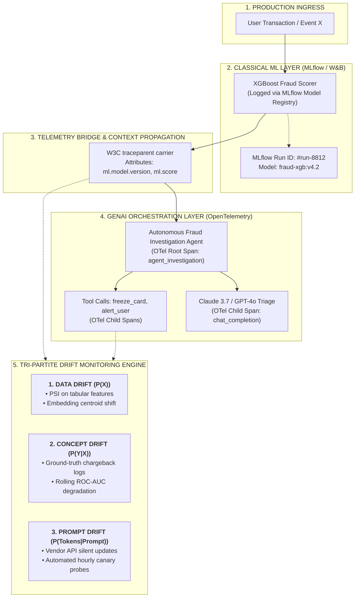
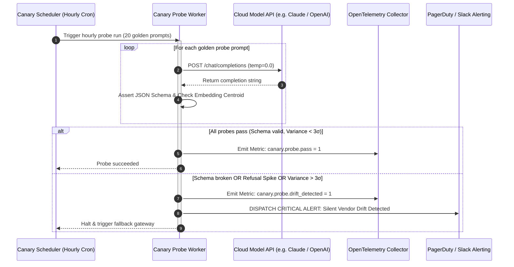

# Continuous Production Monitoring & Drift Detection: Tri-Partite Drift, PSI Math & Canary Probes

> **[Tier: 🔵 Advanced]**  
> **Core Concept**: Production AI systems experience three distinct forms of distribution shift—Data Drift, Concept Drift, and Prompt/Vendor Drift—requiring unified MLflow-OpenTelemetry telemetry bridges, Population Stability Index calculations, and automated hourly canary probes.

---

## 🎯 What You Will Learn
- How to architect hybrid telemetry bridges that unify classical tabular ML tracking (**MLflow**) with generative AI distributed traces (**OpenTelemetry**).
- How to diagnose and isolate the **Tri-Partite Drift Model**: Data Drift ($P(X)$), Concept Drift ($P(Y \mid X)$), and Prompt Drift ($P(\text{Tokens} \mid \text{Prompt})$).
- How to calculate the **Population Stability Index (PSI)** on tabular features and **Maximum Mean Discrepancy (MMD)** on prompt embeddings.
- How to detect silent cloud provider model updates using **Automated Hourly Canary Probes**.
- How to triage production drift incidents using a comprehensive diagnostic decision matrix.

---

## 1. The Problem

In enterprise production architectures, generative AI rarely operates in isolation. Modern applications are almost universally **Hybrid AI Systems**:
* A **classical tabular model** (e.g., XGBoost, LightGBM, or scikit-learn) evaluates credit default risk, calculates fraud probability, or scores customer churn in sub-10ms latency.
* An **autonomous GenAI agent** ingests that statistical score, queries enterprise knowledge via RAG (Phase 02), evaluates business policies, and orchestrates remediation workflows or drafts customer communications.

Operating these hybrid architectures creates a severe operational challenge: **Tooling and Telemetry Fragmentation**. Data science teams track offline experiment registries and model versions in **MLflow** or **Weights & Biases (W&B)**, while software and AI platform teams monitor online distributed traces in **OpenTelemetry (OTel)**, Datadog, or Langfuse.

When an automated agent suddenly starts freezing legitimate customer accounts or failing to execute API transactions, engineers face a diagnostic nightmare:
* Did incoming user behavior change? (**Data Drift**)
* Did real-world fraud patterns evolve so that historical risk scores are invalid? (**Concept Drift**)
* Did the cloud LLM vendor silently update model weights overnight, altering output formatting? (**Prompt Drift**)

---

## 2. The Core Idea & Why Naive Fails

```text
Do not treat all AI degradation as generic model decay.
Disentangle Data Drift, Concept Drift, and Prompt Drift using a Tri-Partite Monitoring Engine.
```

### Why Naive Monitoring Fails
1. **The Disconnected Dashboard Trap**: When an incident occurs, data scientists examine offline validation curves in MLflow, while platform engineers look at API latencies in Datadog. Neither team can correlate which specific ML model version generated the numerical feature that caused the LLM agent to hallucinate.
2. **The "Silent Upgrade" Trap**: Cloud LLM providers (OpenAI, Anthropic, Google) periodically update model weights, apply RLHF safety fine-tunes, or alter quantization kernels without changing the API model alias (e.g., updating underlying checkpoints under `gpt-4o` or `claude-3-5-sonnet`). An untouched prompt that achieved 99.8% valid JSON output on Monday suddenly drops to 92.1% on Tuesday.

---

## 3. Mental Model: The Hybrid Plane & Telemetry Bridge

Below is the distributed architecture showing how classical ML and generative AI telemetry unify via W3C `traceparent` context propagation:



### Visual Walkthrough
1. **Production Ingress**: An incoming transaction triggers the pipeline.
2. **Classical ML Layer**: An XGBoost model scores risk in sub-10ms time, logging metadata against its MLflow registry version.
3. **Telemetry Bridge**: The inference span injects its model version and risk score into the W3C `traceparent` carrier.
4. **GenAI Orchestration Layer**: The autonomous agent extracts the trace context. Reasoning spans and tool execution spans become direct child nodes of the initial scoring span in a single unified waterfall trace.
5. **Tri-Partite Drift Monitoring Engine**: Continuously audits incoming feature distributions ($P(X)$), delayed ground-truth feedback ($P(Y \mid X)$), and vendor canary stability ($P(\text{Tokens} \mid \text{Prompt})$).

---

## 4. How It Works (Step-by-Step Mechanics)

### 1. Unifying Classical ML Tracking with OpenTelemetry Spans
When an application invokes a registered tabular model, the scoring span enriches the active OpenTelemetry context with MLflow attributes:
* `ml.system`: `mlflow`
* `ml.model.uri`: `models:/fraud_classifier_xgboost/4.2.1`
* `ml.model.version`: `v4.2.1`
* `ml.inference.score`: `0.842`

When the downstream agent receives the score, it extracts the traceparent, ensuring the entire hybrid workflow appears in a single distributed waterfall.

---

### 2. Disentangling Tri-Partite Drift

```text
The Tri-Partite Drift Probability Space:
1. DATA DRIFT    : P(X) Shifts             (Input distributions change)
2. CONCEPT DRIFT : P(Y | X) Shifts          (Underlying ground truth changes)
3. PROMPT DRIFT  : P(Tokens | Prompt) Shifts (LLM generation behavior changes)
```

#### A. Data Drift (Covariate Shift - $P(X)$ Shifts)
* **Definition**: The probability distribution of incoming input features or user prompt strings changes relative to baseline distributions, while the underlying truth remains identical.
* **Classical Metric**: **Population Stability Index (PSI)**:
  ```text
  Population Stability Index Formula:
  PSI = Σ [(Actual_k - Expected_k) × ln(Actual_k / Expected_k)]
  ```
  * `PSI < 0.10`: No significant distribution shift (Normal).
  * `0.10 ≤ PSI ≤ 0.20`: Moderate shift; trigger automated warning.
  * `PSI > 0.20`: Severe shift; model retraining and threshold update mandated.
* **GenAI Metric**: **Embedding Centroid Drift**: Measuring the shift in cosine similarity distributions between incoming user prompt embeddings and a frozen baseline centroid using **Maximum Mean Discrepancy (MMD)**.

#### B. Concept Drift (Conditional Shift - $P(Y \mid X)$ Shifts)
* **Definition**: The statistical relationship between inputs and real-world ground truth changes. Even if user inputs look identical, historical labels no longer apply.
* **Example**: A customer with a credit score of 700 had a 98% repayment rate in 2024; during an economic shock in 2026, the repayment probability drops to 82%.
* **Detection Mechanics**: Requires **Delayed Ground-Truth Feedback Loops** (e.g., 30-day default chargebacks, human auditor dispute logs, user thumbs-down overrides). Track rolling-window **ROC-AUC decay** and **Brier Score calibration drift**.

#### C. Prompt Drift & Vendor Behavioral Drift ($P(\text{Tokens} \mid \text{Prompt})$ Shifts)
* **Definition**: The conditional distribution of generated tokens given an immutable, static prompt shifts over time due to silent vendor updates.
* **Symptoms**:
  * An untouched prompt that had a 99.8% valid JSON output rate drops to 92.4%.
  * Refusal rates spike on benign business prompts due to aggressive safety filters.
  * Reasoning chain lengths contract by 40%, degrading multi-step math or tool accuracy.
* **Detection Mechanics**: **Automated Hourly Canary Probes**. A background daemon dispatches 20 deterministic "golden probe" prompts to live provider endpoints every 60 minutes. If canary schema compliance or embedding distance drifts by more than 3 standard deviations, alerts sound before end-users notice.

---

## 5. Drift Diagnostics & Incident Triage Matrix

When performance degrades in production, use this triage matrix to isolate the root cause:

| Observed Symptom | Primary Drift Archetype | Diagnostic Investigation Steps | Corrective Engineering Action |
|---|---|---|---|
| Tabular risk model accuracy drops; feature distributions are identical to baseline. | **Concept Drift** ($P(Y \mid X)$) | Compare historical target correlation ($r_{xy}$) against recent delayed ground-truth labels. | Retrain model on recent time-sliced data; recalibrate decision thresholds. |
| Classical model outputs aberrant scores; PSI on key feature exceeds $0.25$. | **Data Drift** ($P(X)$) | Inspect upstream data ingestion; check for missing values, unit conversion bugs, or seasonal shifts. | Patch upstream data feed; retrain model with updated feature weights; update imputation. |
| Agent tool calling begins failing with `JSONDecodeError` on an untouched prompt. | **Prompt Drift** ($P(\text{Tokens} \mid \text{Prompt})$) | Compare raw model responses against golden snapshots from 48 hours ago; check provider status logs. | Pin model to an explicit dated snapshot (e.g., `gpt-4o-2024-08-06` vs `gpt-4o`); add few-shot schema repair. |
| User satisfaction drops; prompt embeddings cluster far from historical centroid. | **Data Drift (Prompt Level)** | Compute semantic clustering on recent prompt embeddings; identify emerging user intents. | Update RAG knowledge base; introduce new specialized router paths for emerging intents. |

---

## 6. Concrete Scenario & Code Implementation

Below is a complete, production-grade Python 3.12+ script implementing the **Hybrid MLflow-OpenTelemetry Bridge**, **Tabular PSI Calculation**, and **Hourly LLM Canary Probes**:

```python
"""
drift_monitoring_engine.py
Production Tri-Partite Drift Monitor:
1. Calculates Tabular Population Stability Index (PSI).
2. Executes Automated Deterministic LLM Canary Probes for Prompt Drift.
3. Propagates MLflow metadata across OpenTelemetry distributed traces.
"""

from __future__ import annotations

import json
import logging
from typing import Dict, Any, List
import numpy as np
from opentelemetry import trace
from opentelemetry.trace import Status, StatusCode

logging.basicConfig(level=logging.INFO)
logger = logging.getLogger("DriftMonitoringEngine")
tracer = trace.get_tracer("enterprise.drift_engine")


# ---------------------------------------------------------------------------
# 1. Classical ML + OpenTelemetry Telemetry Bridge
# ---------------------------------------------------------------------------
class HybridScoringBridge:
    def __init__(self, model_name: str, model_version: str):
        self.model_name = model_name
        self.model_version = model_version

    def predict_and_trace(self, features: Dict[str, float], parent_context=None) -> Dict[str, Any]:
        """Executes tabular prediction within an OpenTelemetry span containing ML metadata."""
        with tracer.start_as_current_span("classical_ml_scoring", context=parent_context) as span:
            span.set_attribute("ml.system", "mlflow")
            span.set_attribute("ml.model.name", self.model_name)
            span.set_attribute("ml.model.version", self.model_version)

            # Simulated tabular inference (e.g. XGBoost predict_proba)
            feature_values = list(features.values())
            raw_score = float(np.mean(feature_values) / 100.0)
            is_anomaly = raw_score > 0.75

            span.set_attribute("ml.inference.score", raw_score)
            span.set_attribute("ml.inference.decision", "FLAG_ANOMALY" if is_anomaly else "APPROVE")
            span.set_status(Status(StatusCode.OK))

            return {
                "score": raw_score,
                "is_anomaly": is_anomaly,
                "trace_id": format(span.get_span_context().trace_id, "032x"),
                "span_id": format(span.get_span_context().span_id, "016x"),
            }


# ---------------------------------------------------------------------------
# 2. Tri-Partite Drift Monitoring Engine
# ---------------------------------------------------------------------------
class DriftMonitoringEngine:
    @staticmethod
    def calculate_psi(expected: np.ndarray, actual: np.ndarray, num_buckets: int = 10) -> float:
        """
        Calculates Population Stability Index (PSI) between baseline and production feature slices.
        """
        percentiles = np.linspace(0, 100, num_buckets + 1)
        buckets = np.percentile(expected, percentiles)
        buckets[0] -= 1e-5
        buckets[-1] += 1e-5

        expected_counts, _ = np.histogram(expected, bins=buckets)
        actual_counts, _ = np.histogram(actual, bins=buckets)

        expected_pct = expected_counts / len(expected)
        actual_pct = actual_counts / len(actual)

        # Apply epsilon smoothing to prevent division by zero or log(0)
        eps = 1e-4
        expected_pct = np.where(expected_pct == 0, eps, expected_pct)
        actual_pct = np.where(actual_pct == 0, eps, actual_pct)

        psi_val = np.sum((actual_pct - expected_pct) * np.log(actual_pct / expected_pct))
        return float(psi_val)

    @staticmethod
    def execute_llm_canary_probe(
        model_name: str,
        golden_prompt: str,
        expected_schema_keys: List[str],
    ) -> Dict[str, Any]:
        """
        Executes an automated canary probe against a cloud model to detect Prompt/Vendor Drift.
        """
        logger.info(f"Executing Canary Probe on model: {model_name}...")
        
        # Simulated response from model endpoint
        # In production: response = client.chat.completions.create(model=model_name, temperature=0.0, ...)
        simulated_response = '{"order_id": "ORD-9912", "status": "APPROVED", "transaction_code": "TX-104"}'

        try:
            parsed = json.loads(simulated_response)
            missing_keys = [k for k in expected_schema_keys if k not in parsed]
            schema_valid = len(missing_keys) == 0

            return {
                "model": model_name,
                "schema_valid": schema_valid,
                "missing_keys": missing_keys,
                "prompt_drift_detected": not schema_valid,
            }
        except json.JSONDecodeError as ex:
            logger.error(f"🚨 CRITICAL PROMPT DRIFT: Model returned invalid JSON ({ex})")
            return {
                "model": model_name,
                "schema_valid": False,
                "error": str(ex),
                "prompt_drift_detected": True,
            }


# ---------------------------------------------------------------------------
# 3. Demonstration & Unit Execution
# ---------------------------------------------------------------------------
if __name__ == "__main__":
    # 1. Audit Tabular Data Drift via PSI
    np.random.seed(42)
    baseline_features = np.random.normal(50, 10, 1000)
    current_features = np.random.normal(57, 12, 1000)  # Injected distribution shift

    psi_val = DriftMonitoringEngine.calculate_psi(baseline_features, current_features)
    print(f"\n[Telemetry Audit] Feature PSI: {psi_val:.4f}")
    if psi_val > 0.20:
        print("🚨 ALERT: Severe Data Drift detected (PSI > 0.20). Triggering model retraining pipeline!")
    elif psi_val >= 0.10:
        print("⚠️ WARNING: Moderate Data Drift detected (0.10 <= PSI <= 0.20).")
    else:
        print("✅ Feature distribution is stable (PSI < 0.10).")

    # 2. Audit LLM Canary Drift
    canary_result = DriftMonitoringEngine.execute_llm_canary_probe(
        model_name="claude-3-7-sonnet",
        golden_prompt="Generate order dispatch JSON",
        expected_schema_keys=["order_id", "status", "transaction_code"],
    )
    print(f"\n[Telemetry Audit] Canary Probe Result: {canary_result}")
    if canary_result["prompt_drift_detected"]:
        print("🚨 ALERT: Prompt/Vendor Drift detected on cloud LLM endpoint!")
    else:
        print("✅ Cloud model adheres strictly to golden canary schema.")

    # 3. Execute Hybrid Scoring Bridge
    bridge = HybridScoringBridge("fraud_detector_xgb", "v4.2.1")
    scoring_result = bridge.predict_and_trace({"velocity": 45.2, "amount": 88.0, "risk_factor": 60.1})
    print(f"\n[Hybrid Bridge] Scored event within continuous trace: {scoring_result['trace_id']}")
```

---

## 7. Architecture & Telemetry View

Below is the automated hourly canary audit loop that protects production systems from silent provider updates:



### Visual Walkthrough
1. **Hourly Trigger**: A lightweight background worker runs every 60 minutes, independent of user traffic.
2. **Deterministic Probes**: Dispatches 20 fixed golden prompts with `temperature=0.0`.
3. **Automated Assertion**: Verifies that the provider returned valid JSON conforming to expected schemas, without unexpected refusals or stylistic changes.
4. **Drift Alerting**: If the model fails a canary probe, an automated alert fires, allowing the API gateway to switch to a secondary provider before customers encounter errors.

---

## 8. Common Failure Modes & Anti-Patterns

### Anti-Pattern 1: The "Unpinned Model Alias" Trap
* **The Pathology**: Pointing production configurations to generic model aliases like `gpt-4o` or `claude-3-sonnet` instead of pinned dated snapshots like `gpt-4o-2024-08-06` or `claude-3-7-sonnet-20250219`.
* **The Consequence**: The application absorbs unannounced provider changes instantly, causing unexpected production outages.
* **The Remedy**: Always pin production dependencies to explicit, immutable dated model snapshots.

### Anti-Pattern 2: Misdiagnosing Concept Drift as Data Drift
* **The Pathology**: Observing a drop in prediction accuracy and immediately retraining the model on historical data without updating feature definitions or ground truth labels.
* **The Consequence**: The model overfits to outdated assumptions because the real-world relationship between inputs and targets has changed.
* **The Remedy**: Establish delayed ground-truth feedback loops (e.g., chargeback databases or human dispute logs) to confirm whether $P(Y \mid X)$ has shifted.

---

## 9. Production View & Evaluation

When establishing continuous drift monitoring, track the following operational indicators:

| Drift Signal | Warning Threshold | Critical Alert Threshold | Recommended Engineering Action |
|---|---|---|---|
| **Tabular Feature PSI** | `0.10 ≤ PSI ≤ 0.20` | `PSI > 0.20` | Audit upstream data ingestion; retrain classical ML model. |
| **Prompt Embedding Drift (MMD)** | `p95 > 0.15` | `p95 > 0.30` | Update RAG vector knowledge base; introduce specialized intent routers. |
| **Canary Schema Failure Rate** | `> 0.0%` (Any failure) | `≥ 5.0%` | Switch traffic to backup provider snapshot; notify platform on-call. |
| **Rolling Accuracy / ROC-AUC** | `-3% vs baseline` | `-8% vs baseline` | Recalibrate decision thresholds using recent ground truth. |

---

## 10. When Should You Use It? (Trade-off Matrix)

| Monitoring Archetype | Computation Overhead | Latency Impact | Data Requirements | Primary Benefit |
|---|---|---|---|---|
| **Tabular PSI Calculation** | Low (Binned CPU histograms) | Zero (Runs async) | Baseline feature slices | Instant detection of data pipeline corruption |
| **Embedding Centroid Drift (MMD)** | Moderate (Vector dot products) | Zero (Runs async) | Vector embeddings store | Discovers emerging user vocabulary and intent shifts |
| **Hourly Canary Probes** | Low (~$0.05 / hour) | Zero (Isolated worker) | 20 golden prompt instances | **Detects silent cloud provider updates before users do** |

---

## 11. Key Takeaways & Verified Resources

* **Disentangle the Tri-Partite Drift**: Separate Data Drift ($P(X)$), Concept Drift ($P(Y \mid X)$), and Prompt Drift ($P(\text{Tokens} \mid \text{Prompt})$).
* **Unify Classical ML and GenAI Telemetry**: Propagate W3C `traceparent` contexts across XGBoost scoring models and LLM agent spans.
* **Deploy Automated Canary Probes**: Guard against silent vendor model updates with hourly scheduled probe sweeps.
* **Track PSI and Embedding MMD**: Detect distribution changes in both tabular features and semantic vector spaces.

### Authoritative References
* **Evidently AI Documentation**: [Data Drift and Concept Drift in ML Systems](https://docs.evidentlyai.com/) — *Industry standard guide on PSI and distribution metrics.*
* **MLflow Documentation**: [MLflow Model Registry & Tracing Integration](https://mlflow.org/docs/latest/index.html) — *Tracking classical machine learning models and LLMs.*
* **Gretton et al. (2012)**: [A Kernel Two-Sample Test (Maximum Mean Discrepancy)](https://www.jmlr.org/papers/v13/gretton12a.html) — *The foundational paper on comparing vector distributions via MMD.*
* **OpenTelemetry Specification**: [OpenTelemetry Trace Context Specification](https://opentelemetry.io/docs/specs/otel/trace/api/) — *Context propagation across distributed systems.*

---

## 🧭 Navigation

- **[← Previous Lesson: Telemetry Metrics, Cost Governance & Golden Signals](./06-telemetry-metrics-cost-governance-and-golden-signals.md)**
- **[Phase 06 Hub: Evals & Observability](./README.md)**
- **[Capstone Challenge: Automated CI/CD Evaluation Pipeline →](./labs/capstone-cicd-evaluation-pipeline.md)**
