# Phase 06: Evals, Observability & Telemetry — Merged Refactoring Plan

**Planning Mode**: Curricular & Structural Refactoring Plan  
**Target Phase**: `06-evals-and-observability/`  
**Architect**: AI Curriculum Architect  
**Audience**: Senior Software Engineers, Staff Architects, Technical Leads (7–10+ years experience transitioning into AI Engineering)  
**Date**: September 2026  
**Status**: APPROVED & READY FOR REFACTORING  
**Governing Skill**: `ai-curriculum-refactoring`

---

## 1. Executive Summary & Core Objectives

The objective of this refactoring plan is to decompose the **878-line monolithic `README.md`** into an authoritative, modular **7-lesson curriculum**, supported by a streamlined **Phase Navigation Hub**, **modernized runnable code implementations**, and the **verified 50-test Capstone CI/CD Evaluation Gate**.

### Mandatory Core Invariants:
1. **Zero Content Deletion ("Make Sure to Not Delete Anything")**: Every concept, diagram, telemetry formula, code snippet, failure mode, and drift calculation from the existing 878 lines is explicitly preserved, allocated, and enhanced in the new modular structure.
2. **Beginner AI Explanations with Full Abbreviations**: Every AI-specific term or acronym must be fully spelled out and accompanied by an intuitive, beginner-friendly mental model upon first mention (e.g., *LLM — Large Language Model*, *G-Eval — Generation Evaluation with Large Language Models*, *CoT — Chain of Thought*, *NLI — Natural Language Inference*, *MMD — Maximum Mean Discrepancy*, *PSI — Population Stability Index*, *MCP — Model Context Protocol*). Senior software engineering infrastructure terminology (distributed systems, W3C traceparent, AST parsing, Pydantic, gRPC, CI/CD, APM, telemetry) remains calibrated at the Staff/Senior level.
3. **2026 Industry Modernization**:
   - Modernize OpenTelemetry instrumentation to the mid-2026 dedicated repository **`semantic-conventions-genai`** (v1.42.0+), adopting official agent attributes (`gen_ai.agent.name`, `gen_ai.agent.id`, `gen_ai.agent.version`, `gen_ai.agent.description`) and metric conventions.
   - Anchor LLM-as-a-Judge in chance-adjusted statistical calibration (**Cohen’s Kappa** $\ge 0.8$, **Krippendorff’s Alpha**), order-swapped double scoring, and specialized models (**Prometheus-2**).
   - Modernize agent benchmarking with **SWE-bench Verified**, **TAU-bench**, and the **UK AISI Inspect AI** framework.
   - Add developer-first evaluation frameworks: **DeepEval** (pytest-native testing) and **Ragas** (retrieval triad).
   - Expand continuous monitoring with **Automated Hourly Canary Probes** and embedding drift detection via **Maximum Mean Discrepancy (MMD)**.
4. **Zero-LaTeX & Pure GFM Hygiene**: Convert all 22 raw LaTeX math expressions (`$$\text{Efficiency} = ...$$`, `$$\text{TPS} = ...$$`, `$$R_{cache} = ...$$`, `$$\text{Cost} = ...$$`, `$$\text{PSI} = ...$$`, `$P(X)$`, `$P(Y \mid X)$`) into clean text code blocks and native Unicode symbols. Purge all internal author meta-tags (`[MUST-HAVE]`, `[GOOD-TO-KNOW]`).
5. **Diagram Stability & Step-by-Step Prose Walkthroughs**: Ensure all 12 Mermaid diagrams feature numbered, step-by-step prose walkthroughs explaining telemetry flows, evaluation hierarchies, and drift triage.

---

## 2. Target Modular Curriculum Breakdown

The monolithic `README.md` is decomposed into **7 modular lessons**, a central **Phase Hub**, and an **enterprise capstone lab**:

```mermaid
flowchart TD
    Hub["Phase 06 Hub: README.md<br/>(Deterministic Harnesses, Telemetry Architecture & Wayfinding)"]
    
    L1["Lesson 01: Evaluation Hierarchy & Deterministic Testing<br/>(Hamel Husain Pyramid, Level 1 Assertions, Pydantic v2, AST Validation)"]
    L2["Lesson 02: Model-Based Evaluations & Judge Architectures<br/>(Binary Rubrics, G-Eval CoT, Bias Mitigations, Cohen's Kappa, Prometheus-2)"]
    L3["Lesson 03: Agent Trajectory & State Mutation Evaluations<br/>(Tool Precision/Recall, Step Efficiency, TAU-bench, SWE-bench Verified, Inspect AI)"]
    L4["Lesson 04: Evaluation Datasets & Synthetic Data Curation<br/>(50/25/15/10 Golden Quadrants, Anomaly Harvesting, Evol-Instruct, Canary Strings)"]
    L5["Lesson 05: OpenTelemetry Distributed Tracing & Agent Spans<br/>(2026 dedicated registry, gen_ai.agent.*, W3C traceparent, Langfuse/Phoenix)"]
    L6["Lesson 06: Telemetry Metrics, Cost Governance & Golden Signals<br/>(TTFT, TPS, Inter-Token Latency, Prefix Cache Economics, Fully Burdened Cost)"]
    L7["Lesson 07: Continuous Monitoring, Drift Detection & Canaries<br/>(Tri-Partite Drift: Data/Concept/Prompt, PSI, MMD, MLflow Bridge, Hourly Canaries)"]
    
    Cap["Capstone Challenge: Automated CI/CD Evaluation Pipeline<br/>(50-Test Benchmark, Regression Gating, GitHub Actions, Python 3.12)"]
    
    Hub --> L1 --> L2 --> L3 --> L4 --> L5 --> L6 --> L7 --> Cap
```



### Modular Lesson Directory:

| Module / Lesson | Title & Subtitle | Depth Tier | Est. Time | Core Systems & AI Engineering Concepts |
|---|---|:---:|:---:|---|
| **`README.md`** | **Phase 06 Navigation & Architectural Hub** | `Phase Hub` | 15 min | The Lead Mental Model: Probabilistic engines requiring deterministic harnesses; The continuous evaluation flywheel; Tri-partite observability model; Master Lesson Directory; Learning Pathways; Curated Bibliography. |
| **`01-evaluation-hierarchy-and-deterministic-testing.md`** | **Evaluation Hierarchy & Deterministic Unit Testing: Building the Level 1 Safety Gate** | `🟢 Tier 1: Core` | 40–50 min | The Hamel Husain 3-level evaluation hierarchy; Why naive vibe checks fail in production; Level 1 deterministic code assertions: Pydantic v2 schema validation, regex syntax bounds, operational latency and token ceilings, AST validation for generated SQL/code; DeepEval pytest integration; Production failure mode: Silent schema breakages. |
| **`02-model-based-evaluations-and-judge-architectures.md`** | **Model-Based Evaluations & Judge Architectures: Discrete Rubrics, Bias Mitigations & Calibration** | `🟡 Tier 2: Depth` | 50–60 min | The failure of 1-to-5 Likert scales; Discrete binary pass/fail rubrics; G-Eval framework with Chain-of-Thought (CoT) reasoning; Reference-based vs Reference-free scoring (RAGAS triad: Faithfulness, Relevance, Precision); Position bias (order-swapped double scoring); Verbosity bias mitigation; Chance-adjusted statistical calibration (**Cohen’s Kappa** $\ge 0.8$, **Krippendorff’s Alpha**); Specialized open-weight judges (**Prometheus-2**); Evaluation methodologies comparison matrix. |
| **`03-agent-trajectory-and-state-mutation-evaluations.md`** | **Agent Trajectory & State Mutation Evaluations: Tool Precision, Graph Efficiency & Multi-Turn Benchmarks** | `🟡 Tier 2: Depth` | 50–60 min | Why single-turn grading fails on autonomous agents; Trajectory evaluation dimensions: Tool selection precision and recall, argument schema adherence, trajectory step efficiency ($E_{steps}$), loop/thrashing detection; Goal achievement via physical state mutation (database rows, git diffs, HTTP status codes); Modern agent benchmarks: **SWE-bench Verified**, **TAU-bench** (Sierra/Stanford), **GAIA**; The **UK AISI Inspect AI** framework; Production failure mode: The Blind Agent Trap. |
| **`04-evaluation-datasets-and-synthetic-data-curation.md`** | **Evaluation Datasets & Synthetic Data Curation: Golden Quadrants, Anomaly Sourcing & Contamination Defenses** | `🟡 Tier 2: Depth` | 45–55 min | Anatomy of an Enterprise Golden Dataset: 50/25/15/10 quadrant distribution (Happy Path, Edge Cases, Adversarial, Production Regressions); Automated data quality flywheel (harvesting production trace anomalies, PII redaction); Synthetic test generation using teacher models via **Evol-Instruct** (in-depth and in-breadth evolution); Defending against Goodhart's Law; Test set contamination prevention and canary string insertion; Train/Dev vs. Held-Out test splits. |
| **`05-opentelemetry-distributed-tracing-and-agent-spans.md`** | **OpenTelemetry Distributed Tracing & Agent Spans: Semantic Conventions & Async Context Propagation** | `🟡 Tier 2: Depth` | 50–60 min | Distributed tracing fundamentals for AI systems; OpenTelemetry mid-2026 dedicated registry (`semantic-conventions-genai` v1.42.0+); Standardized `gen_ai.*` attributes (`system`, `request.model`, `usage.input_tokens`, `usage.output_tokens`); Official Agent attributes (`gen_ai.agent.name`, `id`, `version`, `description`); Multi-step agent trace span hierarchy; Context propagation via W3C `traceparent` across HTTP, message queues (Redis/Celery), and MCP stdio/SSE channels; Observability platforms compared (Langfuse, Arize Phoenix, LangSmith, Cloud-native APMs). |
| **`06-telemetry-metrics-cost-governance-and-golden-signals.md`** | **Telemetry Metrics & Cost Governance: The Six Golden Signals, Streaming Latency & Cache Physics** | `🟡 Tier 2: Depth` | 45–55 min | The Six Golden Signals of GenAI Systems: Time To First Token (TTFT), Tokens Per Second (TPS), Prompt vs Completion Token Ratio, Prompt Cache Hit Ratio ($R_{cache}$), Model Fallback Rate, Fully Burdened Cost Per Task; Streaming latency dynamics: Inter-Token Latency (ITL) variance, Time To First Chunk (TTFC) vs TTFT; Prefix caching economics (75–90% cost reduction on Anthropic, OpenAI, Gemini); Unit economics formulas in text code blocks; Production cost governance SLAs. |
| **`07-continuous-monitoring-drift-detection-and-canaries.md`** | **Continuous Production Monitoring & Drift Detection: Tri-Partite Drift, PSI Math & Canary Probes** | `🔵 Tier 3: Advanced` | 55–65 min | Disentangling Tri-Partite Drift: Data Drift ($P(X)$), Concept Drift ($P(Y \mid X)$), and Prompt/Vendor Drift ($P(\text{Tokens} \mid \text{Prompt})$); Tabular Population Stability Index (PSI) formula and thresholds; Embedding centroid drift via Maximum Mean Discrepancy (MMD) in vector databases; Concept drift with delayed ground-truth feedback loops (chargebacks, human dispute logs); The silent provider upgrade trap; Automated hourly LLM canary probes; Drift diagnostics & incident triage matrix; Runnable Python drift monitoring engine (`DriftMonitoringEngine`); Unifying classical ML (MLflow) with GenAI distributed traces (OTel bridge). |
| **`labs/capstone-cicd-evaluation-pipeline.md`** | **Capstone Challenge: Automated CI/CD Evaluation Pipeline** | `🟡 Capstone Lab` | 60–90 min | Build and execute an enterprise-grade CI/CD evaluation gate inside GitHub Actions running a 50-test benchmark across core, edge, and adversarial cases; Level 1 schema and latency assertions; Level 2 LLM-as-a-judge scoring with binary rubrics; Aggregate pass-rate and cost regression gating; Updated to Python 3.12+ with clean async evaluation runner. |

---

## 3. Comprehensive Source-to-Target Migration Mapping (Zero-Loss Guarantee)

Every single section and line from the original 878-line monolithic `README.md` is preserved and relocated according to this deterministic mapping:

```text
========================================================================================================================
SOURCE SECTION IN MONOLITH (Lines)                       ACTION   TARGET DESTINATION FILE
========================================================================================================================
Lines 1–16: Header, Guidance Callout                     MIGRATE  06-.../README.md (Modernized Phase Hub)
Lines 18–28: Continuous Evaluation Flywheel Diagram      MIGRATE  README.md & Lesson 01 (With Step-by-Step Walkthrough)
Lines 31–46: Table of Contents                           REPLACE  06-.../README.md (Master Lesson Navigation Directory)
Lines 49–76: Executive Summary & Probabilistic Harness   MIGRATE  README.md & Lesson 01 (Deterministic Harness Mental Model)
Lines 78–86: Why This Matters for Senior Developers      MIGRATE  README.md & Lesson 01 (Systems Accountability)
Lines 88–101: Three Levels of Evals (Pyramid Diagram)    MIGRATE  Lesson 01 (With Step-by-Step Walkthrough)
Lines 103–140: Level 1: Deterministic Code & Unit Tests  MIGRATE  Lesson 01 (Expanded with Pydantic v2, AST, DeepEval)
Lines 141–181: Level 2: Model-Based Evaluation (Judge)   MIGRATE  Lesson 02 (Expanded with CoT, Bias Mitigations, Kappa)
Lines 183–211: Level 3: Online Human & Production Telemetry MIGRATE Lesson 07 (Merged into Continuous Monitoring)
Lines 213–247: Agent & Trajectory Evaluation (Diagrams)  MIGRATE  Lesson 03 (With Step-by-Step Walkthroughs)
Lines 248–271: Tool Precision, Efficiency Math & State   MIGRATE  Lesson 03 (Converted LaTeX to clean code block)
Lines 273–288: Golden Dataset Anatomy & Quadrants        MIGRATE  Lesson 04 (Preserved 50/25/15/10 taxonomy table)
Lines 290–309: Automated Sourcing Flywheel (Diagram)     MIGRATE  Lesson 04 (With Step-by-Step Walkthrough)
Lines 312–335: Synthetic Generation (Evol-Instruct)      MIGRATE  Lesson 04 (With Step-by-Step Walkthrough)
Lines 337–363: Observability & OTel Semantic Conventions MIGRATE  Lesson 05 (Upgraded to mid-2026 dedicated registry)
Lines 364–404: Trace Span Hierarchy & W3C traceparent    MIGRATE  Lesson 05 (With Step-by-Step Walkthrough)
Lines 406–417: Observability Platforms Compared Table    MIGRATE  Lesson 05 (Langfuse, Phoenix, LangSmith, Cloud)
Lines 419–463: Key Telemetry Metrics & Six Golden Signals MIGRATE Lesson 06 (Converted all 5 LaTeX formulas to text blocks)
Lines 465–507: Hybrid ML + GenAI Architecture (Diagram)  MIGRATE  Lesson 07 (With Step-by-Step Walkthrough)
Lines 511–575: Unifying MLflow with OTel Bridge Code     MIGRATE  Lesson 07 (Preserved complete Python bridge)
Lines 577–627: Tri-Partite Drift Monitoring (PSI, Prompt)MIGRATE  Lesson 07 (Converted PSI formula to clean text block)
Lines 629–638: Drift Diagnostics & Incident Triage Matrix MIGRATE Lesson 07 (Preserved complete decision table)
Lines 640–734: Production Drift & Canary Monitor Code    MIGRATE  Lesson 07 & examples/ (Preserved complete script)
Lines 737–748: Evaluation Methodologies Comparison Table MIGRATE  Lesson 02 (Comparative decision matrix)
Lines 751–793: Production Failure Modes & Anti-Patterns  DISTRIBUTE Lessons 01–07 (Embedded directly into relevant lessons)
Lines 794–834: Production-Grade Code Implementations     MIGRATE  Preserved in examples/ & linked across Lessons 01, 02
Lines 835–856: Curated Verified Resources & Seminal Reading MIGRATE README.md (Bibliography) & Lesson Footers
Lines 858–878: Capstone Challenge & Summary Checklist    MIGRATE  README.md & labs/capstone-cicd-evaluation-pipeline.md
========================================================================================================================
```

---

## 4. Zero-LaTeX Conversion Reference Table

Every mathematical equation across the phase will be converted to clean text code blocks and Unicode symbols:

| Concept / Metric | Monolith LaTeX Expression | Modern Pure GFM Replacement | Target Location |
|---|---|---|---|
| **Step Count Efficiency** | `$$\text{Efficiency} = \frac{\text{Optimal Steps}}{\text{Actual Steps}}$$` | ```text<br>Efficiency = Optimal_Steps / Actual_Steps<br>``` | Lesson 03 |
| **Tokens Per Second** | `$$\text{TPS} = \frac{N_{\text{output\_tokens}}}{T_{\text{total}} - \text{TTFT}}$$` | ```text<br>TPS = Output_Tokens / (Total_Time - TTFT)<br>``` | Lesson 06 |
| **Prompt Cache Hit Ratio** | `$$R_{cache} = \frac{\text{Tokens}_{\text{cached}}}{\text{Tokens}_{\text{total\_prompt}}} \times 100\%$$` | ```text<br>Cache_Hit_Ratio = (Cached_Prompt_Tokens / Total_Prompt_Tokens) * 100%<br>``` | Lesson 06 |
| **Fully Burdened Cost** | `$$\text{Cost} = \sum (\text{Input Tokens} \times P_{in}) + \sum (\text{Output Tokens} \times P_{out}) + \text{Tool Compute Cost}$$` | ```text<br>Cost = Σ (Input_Tokens * Price_In) + Σ (Output_Tokens * Price_Out) + Tool_Compute_Cost<br>``` | Lesson 06 |
| **Population Stability Index** | `$$\text{PSI} = \sum_{k=1}^K \left( \text{Actual}_k - \text{Expected}_k \right) \times \ln\left(\frac{\text{Actual}_k}{\text{Expected}_k}\right)$$` | ```text<br>PSI = Σ [(Actual_k - Expected_k) * ln(Actual_k / Expected_k)]<br>``` | Lesson 07 |
| **Cohen’s Kappa** | New statistical formula | ```text<br>κ = (P_observed - P_chance) / (1 - P_chance)<br>``` | Lesson 02 |

---

## 5. Beginner AI Terminology & Scaffolding Plan

Every newly introduced AI concept across Phase 06 will be grounded with its full expansion and an intuitive beginner mental model:

| Concept | Full Expansion | Beginner AI Mental Model | Senior Systems Parallel |
|---|---|---|---|
| **Evals** | Continuous Model Evaluations | Automated tests that score probabilistic outputs against deterministic rubrics or ground truth. | CI/CD integration regression suites. |
| **LLM-as-a-Judge** | Large Language Model as an Evaluator | Using an advanced model with a structured rubric to grade candidate responses. | Automated static code analysis bot (e.g. SonarQube). |
| **G-Eval** | Generation Evaluation with LLMs | Prompting a judge model to produce Chain-of-Thought reasoning before outputting a score. | An architectural code review requiring rationale comments. |
| **CoT** | Chain-of-Thought Prompting | Instructing an AI to break down complex reasoning step by step before outputting the verdict. | Execution call stack trace. |
| **NLI** | Natural Language Inference | Classifying whether a premise logically entails, contradicts, or is neutral to a hypothesis. | Precondition and postcondition interface contracts. |
| **PSI** | Population Stability Index | Measuring how much an input feature's distribution has shifted from baseline data. | Anomaly detection on payload histograms. |
| **MMD** | Maximum Mean Discrepancy | Measuring semantic distribution drift between two sets of vector embeddings. | Statistical divergence test on network traffic profiles. |
| **TTFT** | Time To First Token | Wall-clock latency until the first streamed output token arrives. | Time to First Byte (TTFB). |
| **TPS** | Tokens Per Second | Generation rate of the model after first token delivery. | Network streaming throughput. |
| **ITL** | Inter-Token Latency | Elapsed time between consecutive tokens during streaming generation. | Packet jitter in media streams. |

---

## 6. Execution Roadmap & Next Steps

1. **Step 1: Validate Merged Plan** using curriculum quality rules and live web checks (`PLAN_VALIDATION.md`).
2. **Step 2: Enter REFACTOR MODE**:
   - Refactor `01-evaluation-hierarchy-and-deterministic-testing.md`
   - Refactor `02-model-based-evaluations-and-judge-architectures.md`
   - Refactor `03-agent-trajectory-and-state-mutation-evaluations.md`
   - Refactor `04-evaluation-datasets-and-synthetic-data-curation.md`
   - Refactor `05-opentelemetry-distributed-tracing-and-agent-spans.md`
   - Refactor `06-telemetry-metrics-cost-governance-and-golden-signals.md`
   - Refactor `07-continuous-monitoring-drift-detection-and-canaries.md`
   - Refactor Phase Hub `06-evals-and-observability/README.md`
   - Verify and enhance `labs/capstone-cicd-evaluation-pipeline.md`
   - Verify and enhance `examples/production_eval_runner.py` and `examples/EvalHarnessTests.cs`
3. **Step 3: Generate Post-Refactoring Artifacts**:
   - Produce `REFACTORING_REPORT.md` (9-Section Standardized Report)
   - Produce `FINAL_PHASE_6_REVIEW.md` (13-Point Quality Gate & Dual-Lens Review)
