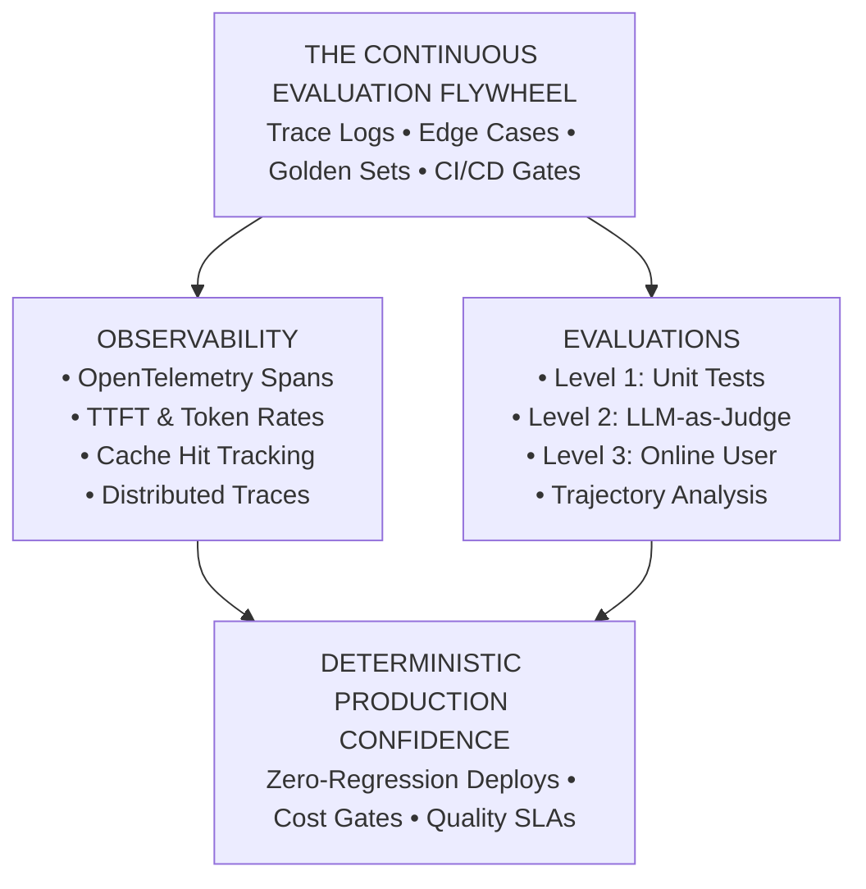
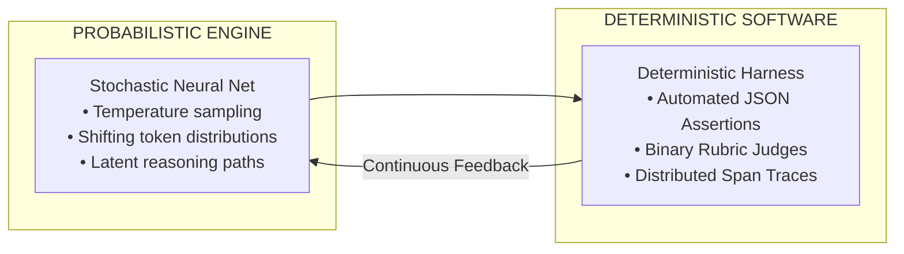
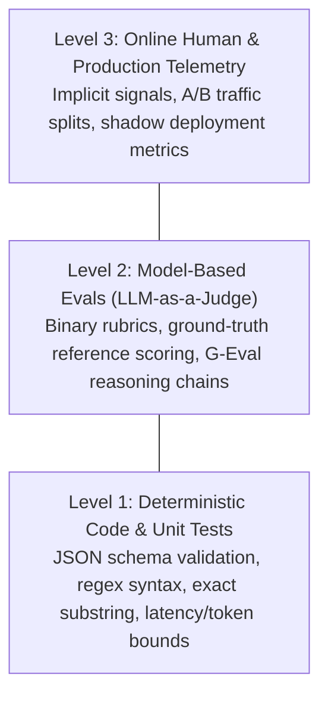
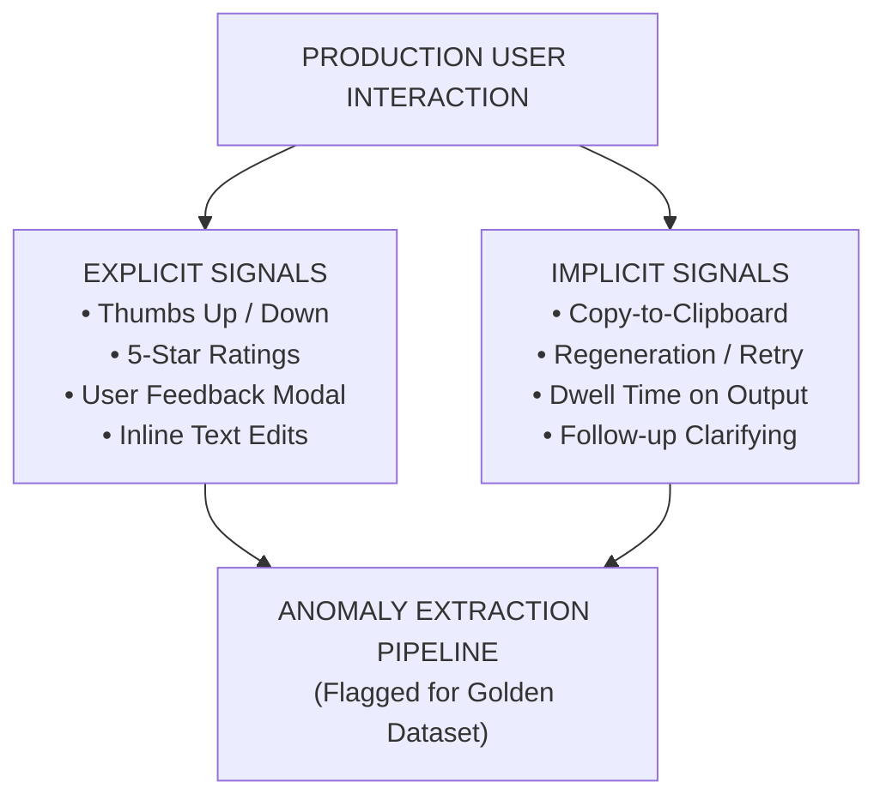
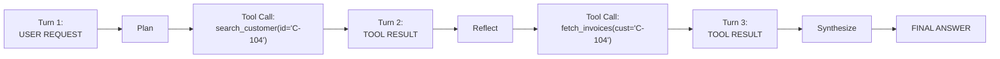
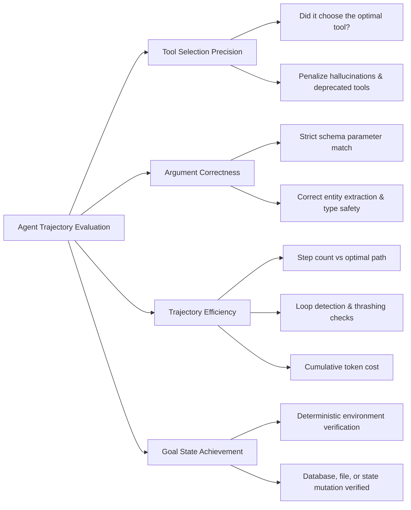
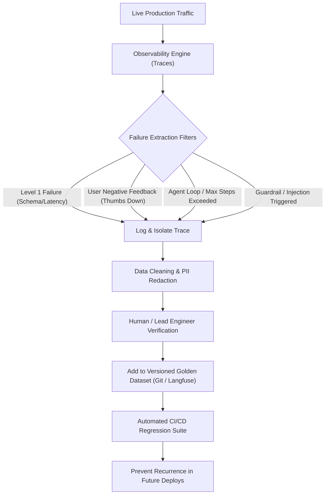
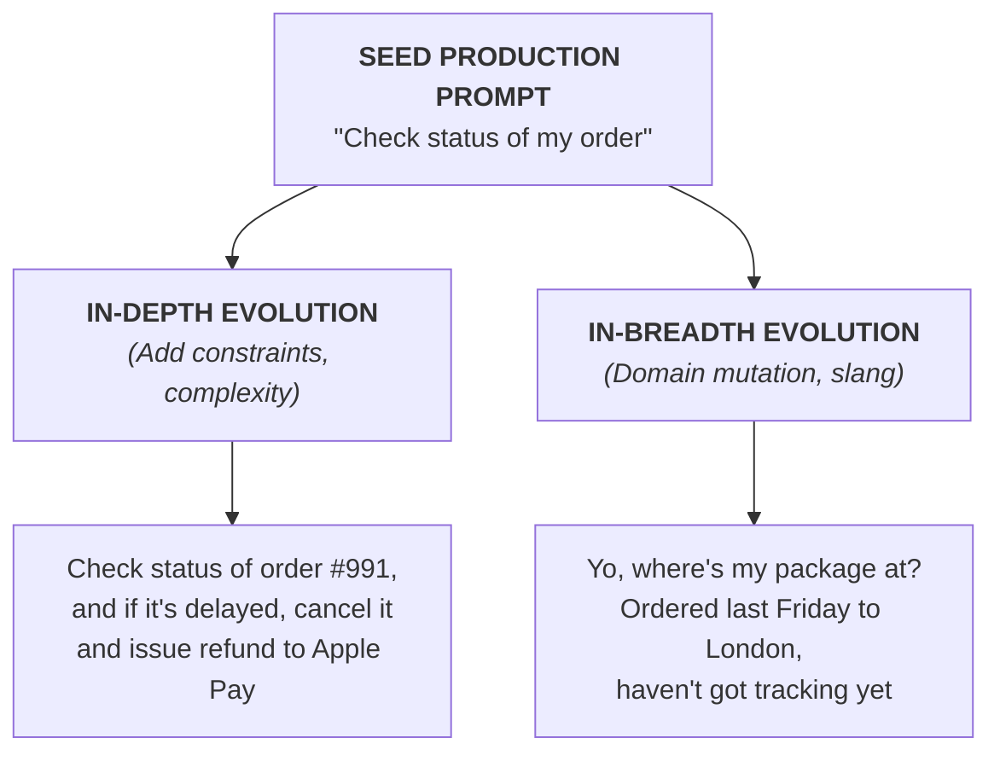
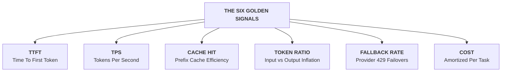

# Phase 06: Evals, Observability & Telemetry

> **A Master-Class for Senior Engineers, Tech Leads, and AI Architects on Moving from Superficial "Vibe Checks" to Deterministic Continuous Evaluation, Agent Trajectory Analysis, and OpenTelemetry-Native Distributed Observability.**

---

> Curriculum taxonomy aligns with the [3-tier classification defined in the root README](../README.md) (`[MUST-HAVE]` 🔴, `[GOOD-TO-HAVE]` 🟡, `[KNOWLEDGE-BASE]` 🔵).

---



---

## 📑 Table of Contents

1. [Executive Summary & Lead Mental Model [MUST-HAVE] 🔴](#-executive-summary--lead-mental-model-must-have-)
2. [Why This Matters for Senior & Lead Developers [MUST-HAVE] 🔴](#️-why-this-matters-for-senior--lead-developers-must-have-)
3. [The Three Levels of Evals (The Hamel Husain Framework) [MUST-HAVE] 🔴](#-the-three-levels-of-evals-the-hamel-husain-framework-must-have-)
4. [Agent & Trajectory Evaluation [GOOD-TO-HAVE] 🟡](#-agent--trajectory-evaluation-good-to-have-)
5. [Curation of Evaluation Datasets [MUST-HAVE] 🔴](#-curation-of-evaluation-datasets-must-have-)
6. [Observability, Distributed Tracing & OpenTelemetry [MUST-HAVE] 🔴](#-observability-distributed-tracing--opentelemetry-must-have-)
7. [Key Telemetry & Performance Metrics [MUST-HAVE] 🔴](#-key-telemetry--performance-metrics-must-have-)
8. [Evaluation Methodologies Comparison [MUST-HAVE] 🔴](#️-evaluation-methodologies-comparison-must-have-)
9. [Production Failure Modes, Biases & Anti-Patterns [MUST-HAVE] 🔴](#️-production-failure-modes-biases--anti-patterns-must-have-)
10. [Production-Grade Code Implementations [MUST-HAVE] 🔴](#-production-grade-code-implementations-must-have-)
11. [Curated Verified Resources & Seminal Reading [KNOWLEDGE-BASE] 🔵](#-curated-verified-resources--seminal-reading-knowledge-base-)
12. [Capstone Challenge: Automated CI/CD Evaluation Pipeline [MUST-HAVE] 🔴](#-capstone-challenge-automated-cicd-evaluation-pipeline-must-have-)

---

## 🎯 Executive Summary & Lead Mental Model [MUST-HAVE] 🔴

Enterprise software teams never merge code without automated tests, benchmarks, and APM instrumentation. Yet generative AI systems are frequently updated based on manual **"vibe checks"**—testing arbitrary prompts in a playground and declaring output acceptable.

This causes three catastrophic failure modes in production:
* **Silent Schema Breakages**: A prompt edit to adjust tone silently breaks downstream JSON formatting for international users.
* **Tool Calling Hallucinations**: Model upgrades induce parameter hallucinations on nested API payloads.
* **Uncontrolled Cost Inflation**: Jailbreak patches double context lengths across live conversations, quietly inflating monthly cloud costs.



### The Core Architectural Tenet

> **Probabilistic components require deterministic harnesses.** You cannot control the stochastic behavior of neural nets through prompt optimism. You control it through continuous regression matrices, golden datasets harvested from production anomalies, and distributed OpenTelemetry tracing with strict latency and cost SLAs.

---

## 🏗️ Why This Matters for Senior & Lead Developers [MUST-HAVE] 🔴

Tech leads and architects are accountable for system stability, cost envelopes, and architectural governance. Non-deterministic LLM failure surfaces demand rigorous evaluation discipline:

* **Eliminating the Silent Blast Radius**: Unlike typed code where breaking changes trigger compilation or test errors, LLM regressions fail silently. Automated harnesses allow teams to refactor prompts, switch model providers (OpenAI ➔ Claude ➔ Gemini), and expand MCP tools without breaking existing production behavior.
* **Guarding the Economic & Latency Envelope**: Token usage directly translates to dollar cost and hardware inference latency. Observability metrics establish operational budgets and reject PRs exceeding token or TTFT thresholds.
* **Engineering Velocity & Psychological Safety**: A reliable 200+ test continuous evaluation suite frees teams from manual QA bottlenecking, enabling rapid model distillation, quantization, and daily production deployments.

---

## 🔬 The Three Levels of Evals (The Hamel Husain Framework) [MUST-HAVE] 🔴

Pioneered by Hamel Husain and adopted across top-tier AI engineering organizations, effective evaluation follows a hierarchical pyramid of speed, cost, and diagnostic resolution:



---

### Level 1: Deterministic Code & Unit Tests [MUST-HAVE] 🔴

The foundation of every production AI CI/CD pipeline consists of instantaneous, cost-free deterministic code checks. If an agent's output fails Level 1, it should never be sent to an expensive LLM judge.

#### Core Verification Mechanics:
1. **JSON / Pydantic Schema Adherence**: Verifies that structured outputs parse into strongly typed models without missing fields, invalid types, or malformed JSON envelopes.
2. **Regex & Substring Assertions**: Confirms presence of mandatory disclaimers, required protocol prefixes, or strictly forbids sensitive keywords, API keys, or banned phrases.
3. **Deterministic Operational Thresholds**:
   * Token budget limits: `actual_input_tokens <= max_allowed_tokens`.
   * Execution latency ceilings: `generation_latency_ms < 1500`.
   * Tool invocation constraints: Asserting that tool arguments contain valid UUIDs or properly formatted ISO 8601 timestamps.
4. **Structural & AST Validation**: If the model generates SQL, Cypher, or Python code, validating that the code parses successfully into an Abstract Syntax Tree (AST) before execution.

```python
# Conceptual Level 1 Assertion Gate
def evaluate_level_1(response: AgentResponse) -> EvalResult:
    # 1. Structural schema validation
    try:
        parsed_payload = ToolCallPayload.model_validate_json(response.raw_text)
    except ValidationError as err:
        return EvalResult(passed=False, score=0.0, reason=f"Schema violation: {err}")

    # 2. Deterministic operational thresholds
    if response.latency_ms > 2500:
        return EvalResult(passed=False, score=0.0, reason="Latency SLA breach (>2500ms)")

    if response.usage.completion_tokens > 450:
        return EvalResult(passed=False, score=0.0, reason="Token budget overflow (>450 tokens)")

    # 3. Deterministic regex constraint
    if not re.search(r"TICKET-[0-9]{4,6}", parsed_payload.ticket_reference):
        return EvalResult(passed=False, score=0.0, reason="Invalid ticket format regex")

    return EvalResult(passed=True, score=1.0, reason="All Level 1 deterministic checks passed")
```

---

### Level 2: Model-Based Evaluation (LLM-as-a-Judge) [MUST-HAVE] 🔴

When testing semantic correctness, conversational nuance, tone alignment, faithfulness against retrieved RAG contexts, or domain-specific reasoning, deterministic code cannot capture the full picture. Here, a stronger, highly capable model (e.g., Claude 3.7 Sonnet, GPT-4o) evaluates the target system's outputs.

#### 1. The Failure of 1-to-5 Likert Scales
> [!CAUTION]
> Never prompt an LLM judge with: *"Rate this response on a scale of 1 to 5 for helpfulness."*
> 
> Continuous Likert scales produce severe drift:
> * A score of "3" from GPT-4o today may equal a "4" tomorrow due to non-deterministic sampling.
> * LLMs exhibit heavy clustering around 4 and 5, avoiding 1 and 2 unless the response is complete gibberish.
> * Different judge models assign vastly different subjective thresholds to "3 vs 4".

#### 2. The Solution: Discrete Binary Pass/Fail Rubrics
Senior architects design evaluations around **Binary Pass/Fail Rubrics** equipped with explicit, unambiguous failure criteria and Chain-of-Thought reasoning steps:

```markdown
### BINARY EVALUATION RUBRIC

| Criteria: Grounded Faithfulness | Description |
|---------------------------------|-------------|
| **PASS (1)** | Every factual assertion in the Generated Response can be directly derived from the provided Context Documents. No extraneous claims. |
| **FAIL (0)** | The Generated Response contains at least one claim, figure, date, or assumption not present in or strictly deducible from Context. |

**Evaluation Protocol:**
1. Extract all atomic factual assertions from the Candidate Response.
2. Cross-reference each assertion against the provided Reference Context.
3. If any assertion lacks direct grounding, assign FAIL with exact citation.
4. Output strictly structured JSON: `{"reasoning": "...", "verdict": 0 | 1}`
```

#### 3. Core Evaluation Paradigms:
* **G-Eval (Framework for NLG Evaluation using LLMs)**: Uses Chain-of-Thought (CoT) to generate step-by-step reasoning before outputting discrete probabilities or binary verdicts, significantly improving correlation with human expert consensus.
* **Reference-Based vs Reference-Free**:
  * *Reference-Based*: The judge evaluates the model output against a known human-curated ground truth answer. Ideal for factual Q&A, data extraction, and tool selection.
  * *Reference-Free*: The judge evaluates the model output solely against the user prompt and retrieved RAG context (measuring Faithfulness, Answer Relevance, and Toxicity).
* **Pairwise Comparison (A/B Arena Style)**: Two candidate responses (Model A vs Model B) are presented to the judge simultaneously. The judge determines which response is superior based on a rubric.
  * *Mitigating Position Bias*: Models naturally favor Option A over Option B (or vice versa). Production pipelines run two inferences per pair, swapping the positions: `(A, B)` and `(B, A)`. If the judge flips its decision, the result is marked as a tie or discarded.
  * *Mitigating Verbosity Bias*: Models heavily equate length with quality. Prompts must explicitly instruct the judge: *"Penalize redundant verbosity; prioritize concise, direct answers."*

---

### Level 3: Online Human & Production Telemetry [GOOD-TO-HAVE] 🟡

While Levels 1 and 2 run offline before deployment, Level 3 operates continuously on live production traffic, capturing the ultimate ground truth: real human interaction and system telemetry.



#### Explicit Signals:
* **Thumbs Up / Down**: Binary rating widget adjacent to every generation.
* **User Corrections / Edits**: In collaborative tools (e.g., code editors, document writers), measuring the Levenshtein distance between the agent's suggestion and the user's final accepted text.
* **Flag / Report**: User reporting offensive content, hallucinations, or broken instructions.

#### Implicit Signals (Zero Friction, Massive Volume):
* **Copy-to-Clipboard Event**: Strong positive indicator of response utility.
* **Immediate Retry / Regeneration**: Strong negative signal indicating the first attempt failed to satisfy user intent.
* **Follow-up Clarifications**: If a user immediately prompts *"No, that's not what I meant, I asked for X"*, the prior turn is automatically flagged as a semantic failure.
* **Dwell Time & Task Abandonment**: Tracking whether the user completed their intended workflow or abruptly terminated the session.

#### Production Deployment Verification Strategies:
* **Shadow Deployments (Dark Traffic)**: Duplicating live customer requests to both the production model and a candidate model. The candidate's outputs are evaluated via Level 1 and Level 2 evals without affecting the user.
* **Canary Splits**: Routing 2% of live traffic to the candidate prompt/model, monitoring automated telemetry (error rates, fallback triggers, negative feedback spikes) before progressing to 10%, 50%, and 100%.

---

## 🤖 Agent & Trajectory Evaluation [GOOD-TO-HAVE] 🟡

Evaluating a multi-step autonomous agent is fundamentally different from evaluating a single-turn chatbot. A single turn produces text; an agent executes a **state trajectory** consisting of observations, reasoning thoughts, tool calls, environment responses, and state mutations.



A final response can appear perfectly well-written even if the agent executed 14 unnecessary database queries, invoked deprecated tools, leaked private metadata, and incurred \$1.20 in compute cost for a 5-cent task.

### Key Trajectory Evaluation Dimensions



#### 1. Tool Selection Precision & Recall
* **Tool Precision**: Of the tools invoked by the agent, what fraction were genuinely necessary to satisfy the prompt?
* **Tool Recall**: Did the agent invoke all mandatory tools required for the task (e.g., invoking `verify_identity` prior to `transfer_funds`)?
* **Hallucinated Tools**: Did the agent attempt to call a function name that does not exist in its registered schema?

#### 2. Tool Argument Correctness
* Does the argument payload conform strictly to the tool's JSON schema?
* Did the agent correctly extract and pass context variables (e.g., passing `"order_id": "ORD-9912"` rather than `"order_id": "null"` or guessing a customer ID)?

#### 3. Trajectory Efficiency & Loop Detection
* **Step Count Efficiency ($E_{steps}$)**:
  $$\text{Efficiency} = \frac{\text{Optimal Steps}}{\text{Actual Steps}}$$
  If a task requires 3 steps and the agent takes 12 steps due to stumbling through incorrect tool searches, efficiency is $0.25$.
* **Loop / Thrashing Detection**: Detecting cyclical tool executions where an agent repeats `search(query="X") -> null -> search(query="X")` without adjusting parameters, burning through max-step limits.

#### 4. Goal Achievement & State Mutation
The gold standard of agent evaluation: **Did the real world change as requested?**
Rather than grading the agent's final text summary, the test harness inspects the environment:
* In a database agent: Did the row insert into PostgreSQL with the correct foreign keys?
* In a coding agent: Did the code compile, pass all unit tests, and generate a clean git diff?
* In an API agent: Did the HTTP POST endpoint receive the expected payload with a 201 Created status code?

---

## 📦 Curation of Evaluation Datasets [MUST-HAVE] 🔴

An evaluation suite is only as trustworthy as the dataset powering it. Benchmarks like MMLU or HumanEval measure generalized academic capabilities; they tell you nothing about how your system performs against your enterprise schemas, proprietary APIs, and messy real-world users.

### The Anatomy of an Enterprise "Golden Dataset" [MUST-HAVE] 🔴

A production-grade golden dataset should comprise at least 100 to 500 carefully curated test cases categorized across four operational quadrants:

| Category | Proportion | Purpose | Example |
|---|---|---|---|
| **Core Happy Path** | 50% | Validates core business SLAs and routine queries | Standard customer lookup, standard FAQ answering, clean tool calls |
| **Edge & Boundary Cases** | 25% | Tests handling of unusual, malformed, or ambiguous inputs | Multi-intent requests, empty search returns, international date formats |
| **Adversarial & Jailbreak** | 15% | Validates defense against prompt injections and jailbreaks | Indirect prompt injection in email body, system prompt extraction |
| **Known Production Failures** | 10% | Regression anchors extracted from real user complaints | Production incident #4102 where agent miscalculated discount tax |

---

### Automated Sourcing from Production Edge Cases

Every production failure must become a permanent test case in your golden dataset. This creates an **Automated Data Quality Flywheel**:



---

### Synthetic Data Generation with Stronger Teacher Models

Manually writing 500 comprehensive test cases with full ground truth references is prohibitively expensive. Leading organizations use frontier models (Claude 3.7 Sonnet, GPT-4o) as **Teacher Generators** using the **Evol-Instruct** methodology:



#### Rules for High-Fidelity Synthetic Curation:
1. **Never use the same model family for generation and evaluation**: If your production agent uses GPT-4o-mini, generate synthetic test suites using Claude 3.7 Sonnet or o1. Avoid shared blind spots and family biases.
2. **Filter Synthetic Artifacts**: Teacher models tend to generate overly polite, grammatically pristine prompts. Inject programmatic noise: deliberate typos, punctuation omissions, fragmented sentences, and ambiguous abbreviations to mimic real users.
3. **Automated Ground Truth Synthesis**: Have the teacher model output both the prompt and the expected step-by-step reasoning trajectory, expected tool invocation sequence, and final assertion criteria.

---

## 🔍 Observability, Distributed Tracing & OpenTelemetry [MUST-HAVE] 🔴

You cannot evaluate or debug what you cannot see. When an autonomous agent fails, a simple error log stating `InternalServerError: Agent failed after 30s` is useless. You must know:
* Which specific tool call timed out?
* What exact prompt was passed into the sub-agent at step 4?
* How many input and completion tokens were consumed by intermediate reasoning steps?
* What was the parent-child span hierarchy across asynchronous boundaries?

---

### OpenTelemetry GenAI Semantic Conventions [MUST-HAVE] 🔴

The industry has converged on the **OpenTelemetry (OTel) Generative AI Semantic Conventions**, ensuring consistent span attributes across languages, frameworks, and APM tools:

| Span Attribute | Type | Description | Example |
|---|---|---|---|
| `gen_ai.system` | string | Target provider / platform | `openai`, `anthropic`, `gemini`, `vertex_ai` |
| `gen_ai.request.model` | string | Model name requested | `claude-3-7-sonnet-20250219`, `gpt-4o` |
| `gen_ai.response.model` | string | Actual model that served request | `gpt-4o-2024-08-06` |
| `gen_ai.request.temperature` | double | Temperature sampling parameter | `0.2` |
| `gen_ai.usage.input_tokens` | int | Number of prompt/context tokens | `1420` |
| `gen_ai.usage.output_tokens`| int | Number of generated completion tokens | `280` |
| `gen_ai.prompt` | string | Formatted prompt content (or span event) | `System: You are an agent...` |
| `gen_ai.completion` | string | Model output response string | `Tool Call: get_weather(...)` |

---

### OpenTelemetry Distributed Trace Span Hierarchy for Multi-Step Agents [MUST-HAVE] 🔴

In an agentic workflow, a single root user request spawns a tree of nested spans representing planners, routers, tool calls, and sub-agents:


#### Context Propagation:
Distributed tracing requires passing the W3C `traceparent` header across every boundary:
* Across HTTP REST or gRPC service calls.
* Through Redis / RabbitMQ message queues for asynchronous background tasks.
* Across Model Context Protocol (MCP) JSON-RPC standard I/O pipes.

---

### Modern AI Observability Platforms Compared

| Dimension | Langfuse | Arize Phoenix | LangSmith | Native Cloud (GCP Trace / Azure AppInsights) |
|---|---|---|---|---|
| **Architecture** | Open source (Postgres + ClickHouse backend) | Open source (OTel native, In-memory / DuckDB / ClickHouse) | Closed-source SaaS (On-prem enterprise available) | Enterprise cloud-native APM |
| **OTel Compliance** | Full OpenTelemetry ingest API | 100% Native OpenTelemetry collector | Proprietary RunTree format (OTel bridge available) | Fully standard W3C / OTel native |
| **Key Strengths** | Prompt versioning, integrated evals, cost tracking, clean UI | Deep vector retrieval visualization, clustering, drift detection | Tightest integration with LangChain & LangGraph ecosystem | Single pane of glass with infrastructure (VMs, DBs, K8s) |
| **Agent Trajectories** | Visual span tree with tool inputs & outputs | Full span timeline with latency waterfall analysis | Detailed state inspection for graph nodes | Distributed waterfall, but lacks LLM-specific playground |
| **Self-Hostable** | Yes (Docker, Helm chart, single-binary) | Yes (Python library, Docker, local Jupyter) | No (Cloud SaaS primary, complex enterprise license) | Cloud-managed only |
| **Best For** | Enterprise production LLMOps & prompt management | Deep RAG diagnostics, research, and embedding analysis | Rapid prototyping within LangChain/LangGraph | Cloud architects standardizing on GCP/Azure compliance |

---

## 📊 Key Telemetry & Performance Metrics [MUST-HAVE] 🔴

Senior engineers do not just track generic server CPU and memory; they monitor the **Six Golden Signals of LLM Systems**:



### 1. Time To First Token (TTFT)
* **Definition**: The wall-clock duration from the client sending the request to the client receiving the first streamed token.
* **Why it matters**: Governs perceived human latency. If TTFT exceeds 1.5 seconds, users perceive the interface as sluggish, regardless of how fast subsequent tokens stream.
* **Architectural Levers**: Prompt caching, model selection (smaller models have lower TTFT), minimizing excessive pre-fill system instructions.

### 2. Tokens Per Second (TPS) / Generation Velocity
* **Definition**: Output tokens divided by time elapsed after the first token arrives:
  $$\text{TPS} = \frac{N_{\text{output\_tokens}}}{T_{\text{total}} - \text{TTFT}}$$
* **Target**: Standard human reading speed is 5–8 tokens/second. Enterprise interactive agents should deliver >= 30 - 60 TPS.

### 3. Prompt vs. Completion Token Ratio
* **Definition**: The ratio of prompt tokens sent to output tokens generated.
* **Risk Indicator**: A ratio of 50:1 (e.g., sending 10,000 tokens of context to retrieve a 20-token answer) indicates inefficient RAG chunking or bloated conversation history that needs compaction.

### 4. Prompt Cache Hit Ratio ($R_{cache}$)
* **Definition**: The percentage of prompt tokens read from memory cache (Anthropic Prompt Caching, Gemini Context Caching, OpenAI Prefix Caching):
  $$R_{cache} = \frac{\text{Tokens}_{\text{cached}}}{\text{Tokens}_{\text{total\_prompt}}} \times 100\%$$
* **Cost Impact**: Cache hits reduce input token costs by up to 75% to 90% and reduce TTFT by up to 80%. An optimal architecture maintains R_cache >= 65% for multi-turn chats.

### 5. Model Fallback & Retry Rate
* **Definition**: Frequency of calls that encounter rate limits (HTTP 429), provider timeouts (504), or internal errors (500) and trigger automated fallback cascades (e.g., Claude 3.7 → GPT-4o → Gemini 2.5 Flash).
* **Alert Threshold**: Any sustained fallback rate > 2% indicates impending quota exhaustion or upstream service degradation.

### 6. Fully Burdened Cost Per Task / Conversation
* **Formula**:
  $$\text{Cost} = \sum (\text{Input Tokens} \times P_{in}) + \sum (\text{Output Tokens} \times P_{out}) + \text{Tool Compute Cost}$$
* **Why it matters**: Allows engineering to establish unit economics: *"An automated customer support resolution costs \$0.042, whereas a manual agent costs \$4.50."*

---

## ⚖️ Evaluation Methodologies Comparison [MUST-HAVE] 🔴

| Metric / Dimension | Exact Match / Substring | Semantic Similarity (Embeddings) | LLM-as-a-Judge (Binary Rubric) | Human Expert Review |
|---|---|---|---|---|
| **Marginal Cost** | $0.00 (Pure CPU) | ~$0.00002 / call | ~$0.002 - $0.03 / call | $2.00 - $25.00 / review |
| **Latency** | < 1 millisecond | 10 - 50 milliseconds | 800 - 3,000 milliseconds | Hours to Days |
| **Scalability** | Infinite (Millions/sec) | Massive (Thousands/sec) | High (Bounded by API rate limits) | Low (Bounded by human staffing) |
| **Consistency / Determinism** | 100% Deterministic | Deterministic for fixed model | High (> 95% with binary CoT rubrics) | Moderate (Inter-annotator variance: 60-80%) |
| **Context Understanding** | Zero | Surface semantic distance | Deep reasoning, nuance, and logic | Highest possible domain nuance |
| **Diagnostic Actionability** | High (exact mismatch location) | Low (opaque cosine scalar score) | High (returns explicit rationale text) | High (detailed qualitative notes) |
| **Best Used For** | Level 1 unit tests, schema, regex | RAG retrieval relevance filtering | Level 2 automated regression CI/CD | Golden dataset calibration & audits |

---

## ⚠️ Production Failure Modes, Biases & Anti-Patterns [MUST-HAVE] 🔴

### Anti-Pattern 1: The Subjective 1-to-5 Likert Scale Trap
* **The Pathology**: Prompts asking the judge: *"Rate from 1 to 5 on clarity."*
* **The Consequence**: Model ratings oscillate randomly over time. A prompt change that appears to raise average score from 4.1 to 4.3 is often pure statistical noise from temperature sampling.
* **The Remedy**: Deconstruct subjective qualities into an atomic checklist of binary assertions:
  1. Did the response answer the primary question? (0 or 1)
  2. Did it contain an actionable code snippet? (0 or 1)
  3. Was it free of deprecated API calls? (0 or 1)
  The final score is the fraction of passed binary criteria: Score in {0.0, 0.33, 0.66, 1.0}.

---

### Anti-Pattern 2: Position Bias & Verbosity Bias in Pairwise Evaluation
* **Position Bias**: LLM judges systematically favor the candidate presented in position `Option A` over `Option B` (up to 65% win-rate bias regardless of content).
* **Verbosity Bias**: A candidate that produces 600 words of superficial, verbose explanations regularly beats a crisp, accurate 50-word answer when judged by standard models.
* **The Remedy**:
  * Implement symmetric pairwise swapping: run both `(Candidate_1, Candidate_2)` and `(Candidate_2, Candidate_1)`. Only declare a win if the candidate wins both configurations.
  * Explicitly penalize verbosity in judge instructions: *"If Candidate A and Candidate B provide the same factual truth, always award the win to the more concise response."*

---

### Anti-Pattern 3: "Vibe Deployment" (Un-Gated Prompt Edits)
* **The Pathology**: A developer edits the system prompt directly in the production configuration repository to fix a single customer ticket, without running an offline test suite.
* **The Consequence**: The prompt modification inadvertently degrades performance across a dozen other previously solved edge cases, triggering a cascade of customer-facing bugs.
* **The Remedy**: Enforce automated pull request status checks via GitHub Actions. A PR cannot merge unless the evaluation test suite executes against the candidate prompt and passes predefined accuracy and cost regression gates.

---

### Anti-Pattern 4: The Blind Agent Trap (Zero Trajectory Visibility)
* **The Pathology**: The application logs only the user's initial input string and the final generated output string.
* **The Consequence**: When the agent enters a circular loop, hallucinates tool parameters, or fails silently, engineering has zero visibility into the intermediate reasoning steps or tool outputs that caused the breakdown.
* **The Remedy**: Instrument the agent with OpenTelemetry spans at every lifecycle hook: step initialization, LLM completion, tool call serialization, tool execution, and reflection.

---

### Anti-Pattern 5: Test Set Contamination & Metric Goodharting
* **The Pathology**: Developers inspect failed evaluation cases, then hardcode specific prompt instructions or few-shot examples that directly address those exact inputs.
* **The Consequence**: The system overfits to the evaluation dataset. Goodhart's Law takes effect: *"When a measure becomes a target, it ceases to be a good measure."* Overall generalization in production crashes.
* **The Remedy**: Split evaluation datasets into **Train/Dev** (used for prompt iteration) and **Held-Out Test** (used strictly for release gating, never inspected by developers during prompt authoring).

---

## 💻 Production-Grade Code Implementations [MUST-HAVE] 🔴

Complete, runnable evaluation harnesses and observability test suites are available in the [`examples/`](./examples/) directory.

### Implementation 1: Python LLM-as-a-Judge with Binary Rubrics & OpenTelemetry
> **Implementation**: [`examples/production_eval_runner.py`](./examples/production_eval_runner.py)

Production Level 2 LLM-as-a-Judge test runner implementing G-Eval binary pass/fail rubrics, Pydantic structured output enforcement, and full OpenTelemetry instrumentation via Langfuse.

```python
# Binary evaluation rubric execution from examples/production_eval_runner.py
class EvaluationResult(BaseModel):
    is_pass: bool = Field(description="Strict boolean verdict based on the rubric")
    score: float = Field(ge=0.0, le=1.0)
    reasoning: str = Field(description="Chain-of-thought rationale supporting the score")

def evaluate_response(query: str, ground_truth: str, generated: str) -> EvaluationResult:
    trace = langfuse.trace(name="eval_llm_judge")
    ...
```

---

### Implementation 2: C# / .NET 9 Automated Evaluation Harness in xUnit
> **Implementation**: [`examples/EvalHarnessTests.cs`](./examples/EvalHarnessTests.cs)

Automated xUnit evaluation suite that executes deterministic assertions and model-graded evaluations as a mandatory gate in enterprise CI/CD pipelines.

```csharp
// CI/CD evaluation test method from examples/EvalHarnessTests.cs
[Theory]
[MemberData(nameof(GoldenDataset))]
public async Task EvaluateAgent_MeetsFactualAccuracyThreshold(EvalTestCase testCase)
{
    var response = await _agent.ExecuteAsync(testCase.InputPrompt);
    var evalResult = await _judge.ScoreAccuracyAsync(testCase.ReferenceAnswer, response);
    
    Assert.True(evalResult.Score >= 0.85, $"Eval failed for '{testCase.Id}': {evalResult.Reasoning}");
}
```

## 📚 Curated Verified Resources & Seminal Reading [KNOWLEDGE-BASE] 🔵

Every Senior AI Engineer and Architect must study these foundational sources:

### 1. The Definitive Evals Guides
* **Hamel Husain**: [Your AI Product Needs Evals](https://hamel.dev/blog/posts/evals/) — *The seminal treatise explaining why offline evals are the dividing line between toy prototypes and durable software products.*
* **Hamel Husain**: [LLM Evals FAQ](https://hamel.dev/blog/posts/evals-faq/) — *Deep dive into discrete pass/fail rubrics, why Likert scales fail, and synthetic test set creation.*
* **Eugene Yan (Amazon)**: [Evaluating LLMs: A Field Guide](https://eugeneyan.com/writing/evals/) — *Comprehensive blueprint covering exact match, semantic similarity, LLM-as-a-judge, and human-in-the-loop systems.*
* **Anthropic**: [Demystifying Evals for AI Agents](https://www.anthropic.com/engineering/evals) — *State trajectory evaluation, grading intermediate tool use, and testing multi-turn flows.*

### 2. Standards, Frameworks & Observability
* **OpenTelemetry**: [Semantic Conventions for Generative AI Systems](https://opentelemetry.io/docs/specs/semconv/gen-ai/) — *Official W3C / CNCF standard for tracing spans, token metrics, and model attributes.*
* **Langfuse**: [Langfuse Documentation](https://langfuse.com/docs) & [GitHub Repository](https://github.com/langfuse/langfuse) — *Open-source LLM engineering platform for traces, prompt management, and score logging.*
* **Arize Phoenix**: [Arize Phoenix Documentation](https://docs.arize.com/phoenix/) & [GitHub Repository](https://github.com/Arize-ai/phoenix) — *AI observability, evaluation, and vector retrieval diagnostics.*
* **Inspect AI (UK AI Safety Institute)**: [Inspect AI Documentation](https://inspect.aisi.org.uk/) & [GitHub Repository](https://github.com/UKGovernmentBEIS/inspect_ai) — *Open-source framework for large language model evaluation, tool-use evaluation, and CI pipelines.*
* **Google Agents CLI & ADK**: [Google Agents CLI Guide](https://google.github.io/agents-cli/) & [ADK Evaluation Documentation](https://google.github.io/adk-docs/evaluate/) — *Automated benchmark runner, trajectory evaluation, and CI/CD agent evaluation tooling.*

### 3. Seminal Academic Papers
* **G-Eval: NLG Evaluation using GPT-4 with Better Human Alignment** (Liu et al., 2023): [arXiv:2303.16634](https://arxiv.org/abs/2303.16634) — *Introduced Chain-of-Thought prompting for LLM-based evaluation rubrics.*
* **Judging LLM-as-a-Judge with MT-Bench and Chatbot Arena** (Zheng et al., 2023): [arXiv:2306.05685](https://arxiv.org/abs/2306.05685) — *Cataloged position bias, verbosity bias, and self-enhancement bias in model evaluators.*

---

## 🏆 Capstone Challenge: Automated CI/CD Evaluation Pipeline [MUST-HAVE] 🔴

Build and configure a fully automated, production-grade CI/CD Evaluation Pipeline that runs a **50-test benchmark** against an enterprise customer support agent on every GitHub Pull Request.

👉 **[View the Capstone Challenge](./labs/capstone-cicd-evaluation-pipeline.md)**

---

## 🔮 Summary Checklist: Preparing for Phase 07

Before advancing to **Phase 07: Production Deployment & LLMOps**, ensure you can answer **YES** to all architectural readiness checkpoints:

- [ ] **Deterministic Unit Gate**: Do all agent responses run through Level 1 schema, regex, and latency assertions before hitting production or LLM judges?
- [ ] **Binary Rubric Scoring**: Have you completely eradicated subjective 1-to-5 Likert scales in favor of discrete binary pass/fail rubrics with step-by-step reasoning?
- [ ] **Trajectory Visibility**: Can your observability platform reconstruct the complete parent-child span tree of an agent's multi-step tool calls, arguments, and intermediate thoughts?
- [ ] **Golden Dataset in Version Control**: Do you have a versioned suite of core, edge, and adversarial test cases harvested directly from real production anomalies?
- [ ] **Automated CI/CD Gating**: Does your pull request pipeline automatically block merges if model accuracy drops below 95% or token cost regresses by more than 15%?
- [ ] **OpenTelemetry Compliance**: Are all GenAI spans emitting standard `gen_ai.system`, `gen_ai.usage.input_tokens`, and `gen_ai.usage.output_tokens` attributes?

*(Proceed to [Phase 07: Production Deployment & LLMOps](../07-production-deployment-and-llmops/README.md))*
