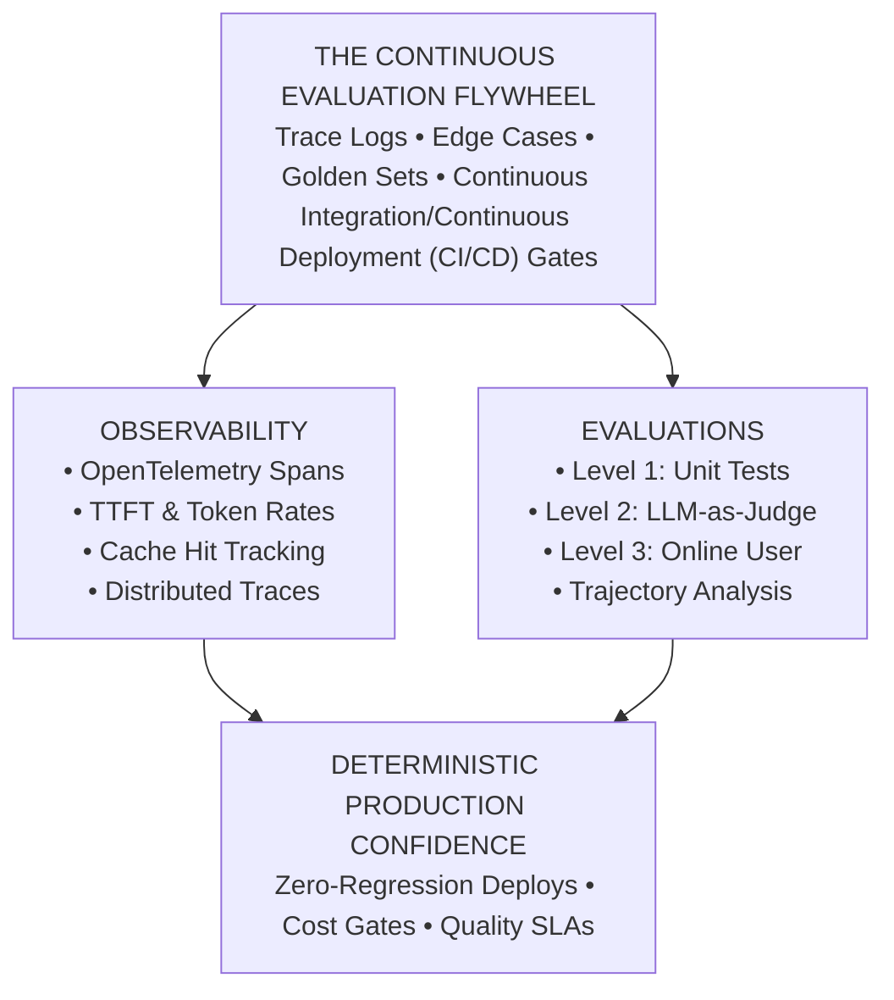

# Phase 06: Evals, Observability & Telemetry

> **A Master-Class for Senior Engineers, Tech Leads, and AI Architects on Moving from Superficial "Vibe Checks" to Deterministic Continuous Evaluation, Agent Trajectory Analysis, and OpenTelemetry-Native Distributed Observability.**

---

## 🏛️ Executive Summary & Lead Mental Model

Enterprise software teams never merge code without automated tests, benchmarks, and Application Performance Monitoring (APM) instrumentation. Yet generative AI systems are frequently updated based on manual **"vibe checks"**—testing arbitrary prompts in a playground and declaring output acceptable.

This causes three catastrophic failure modes in production:
* **Silent Schema Breakages**: A prompt edit to adjust tone silently breaks downstream JSON formatting for international users.
* **Tool Calling Hallucinations**: Model upgrades induce parameter hallucinations on nested API payloads.
* **Uncontrolled Cost Inflation**: Jailbreak patches double context lengths across live conversations, quietly inflating monthly cloud costs.



### Step-by-Step Architectural Walkthrough
1. **The Continuous Evaluation Flywheel**: Ingests production trace anomalies, failure logs, and user feedback, packaging them into version-controlled golden datasets.
2. **Observability Plane**: Instruments the runtime using OpenTelemetry GenAI semantic conventions, tracking TTFT, token generation rates, and prefix cache hits.
3. **Evaluation Plane**: Executes hierarchical testing across Level 1 unit assertions, Level 2 model-based judges, and multi-turn agent trajectory audits.
4. **Deterministic Production Confidence**: Replaces subjective manual QA with automated pull request status checks enforcing strict cost and accuracy regression thresholds.

---

### The Core Architectural Tenet

```text
AI Models REQUIRE Deterministic Software Testing.
```

> You cannot control the non-deterministic output of neural networks through prompt optimism. You control it through continuous regression matrices, golden datasets harvested from production anomalies, and distributed OpenTelemetry tracing with strict latency and cost SLAs.

---

## 🏗️ Why This Matters for Senior & Lead Developers

Tech leads and architects are accountable for system stability, cost envelopes, and architectural governance. Non-deterministic LLM failure surfaces demand rigorous evaluation discipline:

* **Eliminating the Silent Blast Radius**: Unlike typed code where breaking changes trigger compilation or test errors, LLM regressions fail silently. Automated harnesses allow teams to refactor prompts, switch model providers (OpenAI → Claude → Gemini), and expand Model Context Protocol (MCP) tools without breaking existing production behavior.
* **Guarding the Economic & Latency Envelope**: Token usage directly translates to dollar cost and hardware inference latency. Observability metrics establish operational budgets and reject PRs exceeding token or TTFT thresholds.
* **Engineering Velocity & Psychological Safety**: A reliable 200+ test continuous evaluation suite frees teams from manual QA bottlenecking, enabling rapid model distillation, quantization, and daily production deployments.

---

## 🧭 Master Lesson Navigation Table

| # | Lesson Title | Depth Tier | Est. Time | Core Systems & AI Engineering Concepts |
|---|---|:---:|:---:|---|
| **01** | **[Evaluation Hierarchy & Deterministic Testing](./01-evaluation-hierarchy-and-deterministic-testing.md)** | `🟢 HIGH ROI / CORE` | 40–50 min | The Hamel Husain 3-level evaluation hierarchy; Level 1 deterministic code assertions (Pydantic v2 schemas, regex bounds, latency/token ceilings, AST parsing for code/SQL); DeepEval pytest integration; Production failure mode: Silent schema breakages. |
| **02** | **[Model-Based Evaluations & Judge Architectures](./02-model-based-evaluations-and-judge-architectures.md)** | `🟡 IMPORTANT / NEXT` | 50–60 min | The failure of 1-to-5 Likert scales; Discrete binary pass/fail rubrics; G-Eval Chain-of-Thought (CoT) reasoning; Reference-based vs. Reference-free scoring (RAGAS triad); Position and verbosity bias mitigations; Chance-adjusted statistical calibration (**Cohen's Kappa** $\ge 0.8$, **Krippendorff's Alpha**); Specialized open-weight judges (**Prometheus-2**). |
| **03** | **[Agent Trajectory & State Mutation Evaluations](./03-agent-trajectory-and-state-mutation-evaluations.md)** | `🟡 IMPORTANT / NEXT` | 50–60 min | Why single-turn grading fails on autonomous agents; Trajectory evaluation dimensions: Tool selection precision and recall, argument schema adherence, trajectory step efficiency, loop/thrashing detection; Physical environment state mutation verification; Modern agent benchmarks. |
| **04** | **[Evaluation Datasets & Synthetic Data Curation](./04-evaluation-datasets-and-synthetic-data-curation.md)** | `🟡 IMPORTANT / NEXT` | 45–55 min | Anatomy of an Enterprise Golden Dataset: 50/25/15/10 operational quadrant distribution (Happy Path, Edge Cases, Adversarial, Production Regressions); Automated anomaly harvesting flywheel; Synthetic generation using teacher models (synthetic generation); Defending against Goodhart's Law; Test set contamination prevention and **Canary Strings**; Train/Dev vs. Held-Out test splits. |
| **05** | **[OpenTelemetry Distributed Tracing & Agent Spans](./05-opentelemetry-distributed-tracing-and-agent-spans.md)** | `🟡 IMPORTANT / NEXT` | 50–60 min | Distributed tracing fundamentals for AI systems; OpenTelemetry mid-2026 dedicated registry (`semantic-conventions-genai` v1.42.0+); Standardized `gen_ai.*` attributes; Official Agent attributes (`gen_ai.agent.name`, `id`, `version`, `description`); Multi-step agent trace span hierarchy; Context propagation via W3C `traceparent` across HTTP, message queues, and Model Context Protocol (MCP) channels; Observability platforms compared (using industry-standard telemetry systems). |
| **06** | **[Telemetry Metrics, Cost Governance & Golden Signals](./06-telemetry-metrics-cost-governance-and-golden-signals.md)** | `🟡 IMPORTANT / NEXT` | 45–55 min | The Six Golden Signals of GenAI Systems: Time To First Token (TTFT), Tokens Per Second (TPS), Prompt vs Completion Token Ratio, Prompt Cache Hit Ratio, Model Fallback Rate, Fully Burdened Cost Per Task; Streaming latency dynamics: Inter-Token Latency (ITL) variance, TTFC vs TTFT; Prefix caching economics (75–90% cost savings); Production cost governance SLAs. |
| **07** | **[Continuous Monitoring, Drift Detection & Canaries](./07-continuous-monitoring-drift-detection-and-canaries.md)** | `🔵 ADVANCED / SPECIALIZED` | 55–65 min | Disentangling Tri-Partite Drift: Data Drift ($P(X)$), Concept Drift ($P(Y \mid X)$), and Prompt/Vendor Drift ($P(\text{Tokens} \mid \text{Prompt})$); Tabular Population Stability Index (PSI) formula and thresholds; Embedding centroid drift via Maximum Mean Discrepancy (MMD); Delayed ground-truth feedback loops; The silent provider upgrade trap; Automated hourly LLM canary probes; Unifying classical ML (**MLflow**) with GenAI distributed traces (**OpenTelemetry** bridge). |
| **CAP** | **[Capstone Challenge: Continuous Integration/Continuous Deployment (CI/CD) Evaluation Pipeline](./labs/capstone-cicd-evaluation-pipeline.md)** | `🟡 Capstone Lab` | 60–90 min | Build and execute an enterprise-grade Continuous Integration/Continuous Deployment (CI/CD) evaluation gate inside GitHub Actions running a 50-test benchmark across core, edge, and adversarial cases; Level 1 schema and latency assertions; Level 2 LLM-as-a-judge scoring with binary rubrics; Aggregate pass-rate and cost regression gating; Modernized to Python 3.12+ and clean async execution. |

---

## 🗂️ Direct Chapter & Lesson Directory

### [Lesson 01: Evaluation Hierarchy & Deterministic Testing](./01-evaluation-hierarchy-and-deterministic-testing.md)
* **Tier**: `🟢 HIGH ROI / CORE`
* **Focus**: Establishes the foundational Hamel Husain 3-level evaluation hierarchy. Details Level 1 deterministic code assertions that execute on CPU in under 1ms with zero API cost: Pydantic v2 JSON Schema adherence, regex syntax bounds, operational latency and token ceilings, and Abstract Syntax Tree (AST) validation for generated code and SQL. Introduces DeepEval pytest integration for developer-first workflows.

### [Lesson 02: Model-Based Evaluations & Judge Architectures](./02-model-based-evaluations-and-judge-architectures.md)
* **Tier**: `🟡 IMPORTANT / NEXT`
* **Focus**: Deconstructs why continuous 1-to-5 Likert scales fail in production. Establishes discrete binary pass/fail rubrics and the G-Eval Chain-of-Thought (CoT) framework. Explains reference-based vs. reference-free evaluation (the RAGAS triad: Faithfulness, Answer Relevance, Context Precision). Covers systematic judge bias mitigations (position swapping and verbosity penalties), chance-adjusted statistical calibration (**Cohen's Kappa** $\ge 0.8$, **Krippendorff's Alpha**), and specialized open-weight judge models (**Prometheus-2**).

### [Lesson 03: Agent Trajectory & State Mutation Evaluations](./03-agent-trajectory-and-state-mutation-evaluations.md)
* **Tier**: `🟡 IMPORTANT / NEXT`
* **Focus**: Shifting evaluation from single-turn response grading to multi-turn intermediate trajectory analysis. Explains the 4 core trajectory dimensions: Tool selection precision and recall, argument schema adherence, trajectory step efficiency, and loop/thrashing detection. Details environment-state mutation verification (checking database rows, git diffs, and API responses). Introduces modern agent benchmarks.

### [Lesson 04: Evaluation Datasets & Synthetic Data Curation](./04-evaluation-datasets-and-synthetic-data-curation.md)
* **Tier**: `🟡 IMPORTANT / NEXT`
* **Focus**: Structuring an enterprise Golden Evaluation Dataset across the 50/25/15/10 operational quadrants (Core Happy Path, Edge Cases, Adversarial Attacks, and Production Regressions). Covers the automated data quality flywheel harvesting real production anomalies into permanent regression tests. Explains teacher-model synthetic generation (synthetic generation) (in-depth and in-breadth mutation), defending against Goodhart's Law, test set contamination prevention, and **Canary String** insertion.

### [Lesson 05: OpenTelemetry Distributed Tracing & Agent Spans](./05-opentelemetry-distributed-tracing-and-agent-spans.md)
* **Tier**: `🟡 IMPORTANT / NEXT`
* **Focus**: Upgrading distributed systems APM to generative AI architectures. Implements the mid-2026 dedicated **`semantic-conventions-genai`** (v1.42.0+) specification and official Agent attributes (`gen_ai.agent.name`, `id`, `version`, `description`). Maps the multi-step agent trace span hierarchy and context propagation via W3C `traceparent` across HTTP, asynchronous message brokers (Redis/Celery), and Model Context Protocol (MCP) stdio/SSE channels. Compares leading observability engines (using standard observability systems).

### [Lesson 06: Telemetry Metrics, Cost Governance & Golden Signals](./06-telemetry-metrics-cost-governance-and-golden-signals.md)
* **Tier**: `🟡 IMPORTANT / NEXT`
* **Focus**: The Six Golden Signals of GenAI Systems: Time To First Token (TTFT), Tokens Per Second (TPS), Prompt vs Completion Token Ratio, Prompt Cache Hit Ratio, Model Fallback Rate, and Fully Burdened Cost Per Task. Explores streaming latency dynamics, Inter-Token Latency (ITL) variance, and TTFC vs TTFT behind reverse proxies. Analyzes prefix prompt caching economics (75–90% cost savings on Anthropic, OpenAI, Gemini) and operational cost governance SLAs.

### [Lesson 07: Continuous Monitoring, Drift Detection & Canaries](./07-continuous-monitoring-drift-detection-and-canaries.md)
* **Tier**: `🔵 ADVANCED / SPECIALIZED`
* **Focus**: Disentangling the Tri-Partite Drift model in production: Data Drift ($P(X)$), Concept Drift ($P(Y \mid X)$), and Prompt/Vendor Drift ($P(\text{Tokens} \mid \text{Prompt})$). Explains Population Stability Index (PSI) math and embedding centroid drift via Maximum Mean Discrepancy (MMD). Covers delayed ground-truth feedback loops and defense against the silent cloud provider update trap using **Automated Hourly Canary Probes**. Integrates classical MLflow model tracking with online OpenTelemetry GenAI traces.

---

## 💻 Enterprise Reference Implementations

Runnable production evaluation runners and automated test suites are available in the [`examples/`](./examples/) directory:

| Implementation | Framework & Language | Core Architecture & Engineering Highlights |
|---|---|---|
| **[`production_eval_runner.py`](./examples/production_eval_runner.py)** | Python 3.12+ / Pydantic v2 / Langfuse | Production Level 2 LLM-as-a-Judge test runner implementing G-Eval binary pass/fail rubrics, Pydantic structured output enforcement, and full OpenTelemetry instrumentation via Langfuse. |
| **[`EvalHarnessTests.cs`](./examples/EvalHarnessTests.cs)** | C# / .NET 9 / xUnit / Semantic Kernel | Enterprise automated xUnit evaluation suite executing Level 1 deterministic schema checks and Level 2 semantic embedding similarity assertions as a mandatory gate in Continuous Integration/Continuous Deployment (CI/CD) pipelines. |

---

## 🏆 Capstone Challenge: Automated Continuous Integration/Continuous Deployment (CI/CD) Evaluation Pipeline

Build and configure a fully automated, production-grade Continuous Integration/Continuous Deployment (CI/CD) Evaluation Pipeline that runs a **50-test benchmark** against an enterprise customer support agent on every GitHub Pull Request.

👉 **[Launch the Capstone Challenge](./labs/capstone-cicd-evaluation-pipeline.md)**

---

## 🔗 Cross-Phase Architectural Flow

Phase 06 serves as the primary verification bridge between agent development and production infrastructure:

```text
Phase 00: Foundations & Token Mechanics (KV cache sizing, memory bandwidth)
  │
Phase 01: Prompt & Context Engineering (Delimiters, schema-constrained decoding)
  │
Phase 02: Enterprise Retrieval & RAG (Retrieval precision, chunking, embeddings)
  │
Phase 03: Tools & Model Context Protocol (JSON-RPC 2.0 schemas, stdio/SSE)
  │
Phase 04: Stateful Agent Orchestration (ReAct loops, WAL event stores, checkpoints)
  │
Phase 05: AI Security & Guardrails (Prompt injection, Dual-LLM quarantine, canary tokens)
  │
▼
Phase 06: Evals, Observability & Telemetry (Deterministic gates, OTel spans, drift canaries)
  │
▼
Phase 07: High-Throughput Serving & LLMOps (vLLM, continuous batching, quantization, gateways)
  │
Phase 08: AI-Augmented SDLC & Leadership (Enterprise AI architecture, leadership)
```

---

## 📚 Curated Bibliography & Authoritative Primary Sources

### 1. Foundational Evaluation Literature
* **Hamel Husain**: [Your AI Product Needs Evals](https://hamel.dev/blog/posts/evals/) — *The seminal treatise explaining why offline evals are the dividing line between toy prototypes and durable software products.*
* **Hamel Husain**: [Creating an LLM as a Judge That You Can Trust](https://hamel.dev/blog/posts/evals-faq/) — *Deep dive into discrete pass/fail rubrics, why Likert scales fail, and synthetic test set creation.*
* **Eugene Yan (Amazon)**: [Evaluating LLMs: A Field Guide](https://eugeneyan.com/writing/evals/) — *Comprehensive blueprint covering exact match, semantic similarity, LLM-as-a-judge, and human-in-the-loop systems.*
* **Anthropic**: [Demystifying Evals for AI Agents](https://www.anthropic.com/engineering/evals) — *State trajectory evaluation, grading intermediate tool use, and testing multi-turn flows.*

### 2. Standards, Frameworks & Telemetry
* **OpenTelemetry**: [Semantic Conventions for Generative AI Systems](https://opentelemetry.io/docs/specs/semconv/gen-ai/) — *Official W3C / CNCF standard for tracing spans, token metrics, and model attributes.*
* **OpenTelemetry GitHub**: [open-telemetry/semantic-conventions-genai](https://github.com/open-telemetry/semantic-conventions-genai) — *Dedicated upstream registry for AI telemetry.*
* **W3C Recommendation**: [Trace Context Specification (traceparent)](https://www.w3.org/TR/trace-context/) — *Universal distributed trace propagation standard.*
* **Langfuse**: [Langfuse Documentation](https://langfuse.com/docs) & [GitHub Repository](https://github.com/langfuse/langfuse) — *Open-source LLM engineering platform for traces, prompt management, and score logging.*
* **Arize Phoenix**: [Arize Phoenix Documentation](https://docs.arize.com/phoenix/) & [GitHub Repository](https://github.com/Arize-ai/phoenix) — *AI observability, evaluation, and vector retrieval diagnostics.*
* **UK AI Safety Institute**: [Inspect AI Documentation](https://inspect.aisi.org.uk/) & [GitHub Repository](https://github.com/UKGovernmentBEIS/inspect_ai) — *Open-source framework for large language model evaluation and sandboxed tool-use.*
* **Confident AI / DeepEval**: [DeepEval Documentation](https://docs.confident-ai.com/) — *Developer-centric, pytest-native evaluation framework.*

### 3. Seminal Academic Papers
* **Liu et al. (2023)**: [G-Eval: NLG Evaluation using GPT-4 with Better Human Alignment](https://arxiv.org/abs/2303.16634) — *Introduced Chain-of-Thought prompting for LLM-based evaluation rubrics.*
* **Zheng et al. (2023)**: [Judging LLM-as-a-Judge with MT-Bench and Chatbot Arena](https://arxiv.org/abs/2306.05685) — *Cataloged position bias, verbosity bias, and self-enhancement bias in model evaluators.*
* **Kim et al. (2024)**: [Prometheus 2: An Open-Source Language Model for Fine-Grained Evaluation](https://arxiv.org/abs/2405.01535) — *Fine-tuned open-weight judge models matching proprietary frontier performance.*
* **Shahul et al. (2023)**: [Ragas: Automated Evaluation of Retrieval Augmented Generation](https://arxiv.org/abs/2309.15217) — *Component-level evaluation of RAG retrieval and generation quality.*
* **Xu et al. (2023)**: [WizardLM: Empowering Large Language Models to Follow Complex Instructions](https://arxiv.org/abs/2304.12244) — *The Evol-Instruct synthetic data generation methodology.*
* **Jimenez et al. (2024)**: [SWE-bench: Can Language Models Resolve Real-World GitHub Issues?](https://arxiv.org/abs/2310.06770) — *Autonomous software engineering benchmark.*

---

## 🔮 Summary Checklist: Preparing for Phase 07

Before advancing to **[Phase 07: Production Deployment & LLMOps](../07-production-deployment-and-llmops/README.md)**, ensure you can answer **YES** to all architectural readiness checkpoints:

- [ ] **Deterministic Unit Gate**: Do all agent responses pass Level 1 schema, regex, and latency assertions before hitting production or LLM judges?
- [ ] **Binary Rubric Scoring**: Have you completely eradicated subjective 1-to-5 Likert scales in favor of discrete binary pass/fail rubrics with step-by-step reasoning?
- [ ] **Trajectory Visibility**: Can your observability platform reconstruct the complete parent-child span tree of an agent's multi-step tool calls, arguments, and intermediate thoughts?
- [ ] **Golden Dataset in Version Control**: Do you have a versioned suite of core, edge, and adversarial test cases harvested directly from real production anomalies?
- [ ] **Automated Continuous Integration/Continuous Deployment (CI/CD) Gating**: Does your pull request pipeline automatically block merges if model accuracy drops below 95% or token cost regresses by more than 15%?
- [ ] **OpenTelemetry Compliance**: Are all GenAI spans emitting standard `gen_ai.operation.name`, `gen_ai.agent.name`, and token usage attributes?
- [ ] **Hourly Canary Monitoring**: Does a background worker dispatch golden canary probes to cloud endpoints every 60 minutes to catch silent provider updates?

*(Proceed to **[Phase 07: Production Deployment & LLMOps](../07-production-deployment-and-llmops/README.md)**)*
