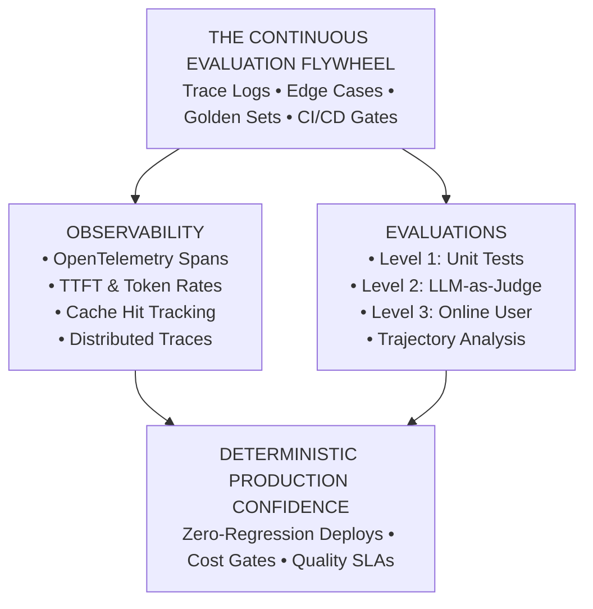
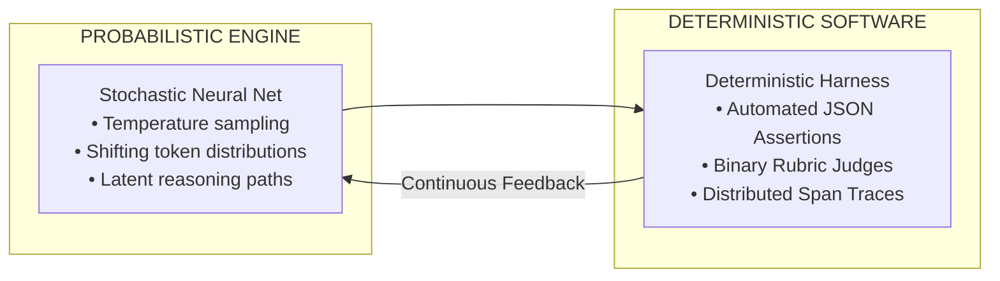
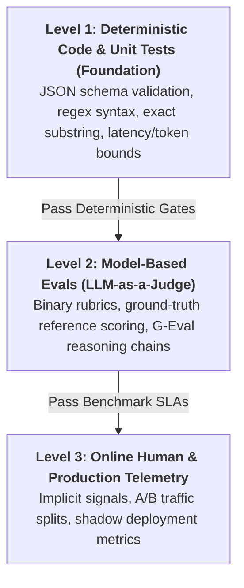
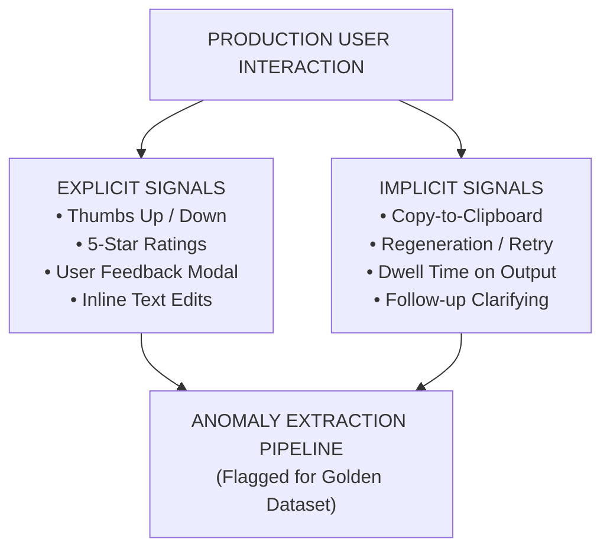
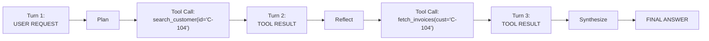
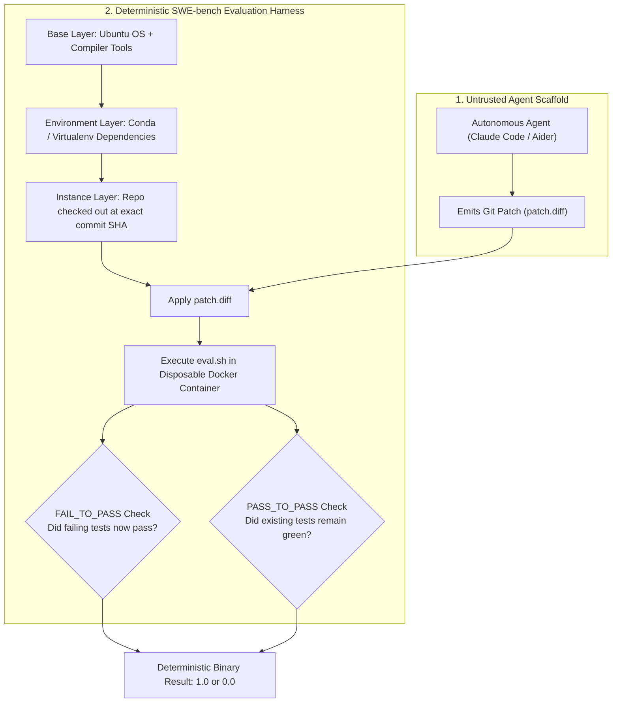
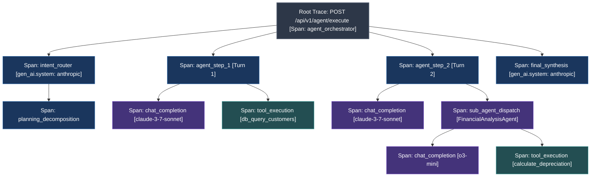

# Phase 06: Evals, Observability & Telemetry

> **A Master-Class for Senior Engineers, Tech Leads, and AI Architects on Moving from Superficial "Vibe Checks" to Deterministic Continuous Evaluation, Agent Trajectory Analysis, and OpenTelemetry-Native Distributed Observability.**

---

> Curriculum taxonomy aligns with the [3-tier classification defined in the root README](../README.md) (`[MUST-HAVE]` 🔴, `[GOOD-TO-HAVE]` 🟡, `[KNOWLEDGE-BASE]` 🔵).

---



---

## 📑 Table of Contents

1. [Executive Summary & Lead Mental Model [MUST-HAVE] 🔴](#-executive-summary--lead-mental-model-must-have-)
2. [Why This Matters for Senior & Lead Developers [MUST-HAVE] 🔴](#️-why-this-matters-for-senior--lead-developers-must-have-)
3. [The Three Levels of Evals (The Hamel Husain Framework) [MUST-HAVE] 🔴](#-the-three-levels-of-evals-the-hamel-husain-framework-must-have-)
4. [Agent & Trajectory Evaluation [GOOD-TO-HAVE] 🟡](#-agent--trajectory-evaluation-good-to-have-)
5. [Curation of Evaluation Datasets [MUST-HAVE] 🔴](#-curation-of-evaluation-datasets-must-have-)
6. [Observability, Distributed Tracing & OpenTelemetry [MUST-HAVE] 🔴](#-observability-distributed-tracing--opentelemetry-must-have-)
7. [Key Telemetry & Performance Metrics [MUST-HAVE] 🔴](#-key-telemetry--performance-metrics-must-have-)
8. [Evaluation Methodologies Comparison [MUST-HAVE] 🔴](#️-evaluation-methodologies-comparison-must-have-)
9. [Production Failure Modes, Biases & Anti-Patterns [MUST-HAVE] 🔴](#️-production-failure-modes-biases--anti-patterns-must-have-)
10. [Production-Grade Code Implementations [MUST-HAVE] 🔴](#-production-grade-code-implementations-must-have-)
11. [Curated Verified Resources & Seminal Reading [KNOWLEDGE-BASE] 🔵](#-curated-verified-resources--seminal-reading-knowledge-base-)
12. [Capstone Challenge: Automated CI/CD Evaluation Pipeline [MUST-HAVE] 🔴](#-capstone-challenge-automated-cicd-evaluation-pipeline-must-have-)

---

## 🎯 Executive Summary & Lead Mental Model [MUST-HAVE] 🔴

Why does your AI product need evals? Let's talk about the dreaded "vibe check". 

You tweak your system prompt. You go to a chat playground. You test three or four messages, squint at the screen, and think, "Yeah, the vibes are good." Two days later, a customer files Bug #1. Your agent is hallucinating a JSON payload schema that completely breaks the frontend. You realize you have no idea if your new prompt just broke 10 other things.

As Hamel Husain points out repeatedly, **probabilistic components require deterministic harnesses**. You cannot control the stochastic behavior of neural nets through prompt optimism. You control it through continuous regression matrices, golden datasets harvested from production anomalies, and distributed OpenTelemetry tracing.



---

## 🔬 The Three Levels of Evals (The Hamel Husain Framework) [MUST-HAVE] 🔴

Effective evaluation follows a hierarchical pyramid of speed, cost, and diagnostic resolution:



### Level 1: Deterministic Code & Unit Tests [MUST-HAVE] 🔴

This is where you should start. It's fast and it's free. If your model output fails a Level 1 schema check or latency threshold, it should never be sent to an expensive LLM judge. Use Pydantic assertions, simple substring exact matches, and latency checks.

```python
# Conceptual Level 1 Assertion Gate
def evaluate_level_1(response: AgentResponse) -> EvalResult:
    # 1. Structural schema validation
    try:
        parsed_payload = ToolCallPayload.model_validate_json(response.raw_text)
    except ValidationError as err:
        return EvalResult(passed=False, score=0.0, reason=f"Schema violation: {err}")

    # 2. Deterministic operational thresholds
    if response.latency_ms > 2500:
        return EvalResult(passed=False, score=0.0, reason="Latency SLA breach (>2500ms)")

    if response.usage.completion_tokens > 450:
        return EvalResult(passed=False, score=0.0, reason="Token budget overflow (>450 tokens)")

    return EvalResult(passed=True, score=1.0, reason="All Level 1 deterministic checks passed")
```

---

### Level 2: Model-Based Evaluation (LLM-as-a-Judge) [MUST-HAVE] 🔴

When testing conversational nuance, faithfulness, or tone alignment, deterministic code fails. You need a stronger model to act as a judge.

> [!CAUTION]
> Never prompt an LLM judge with: *"Rate this response on a scale of 1 to 5 for helpfulness."*
> Continuous Likert scales produce severe drift. A score of "3" from GPT-4 today may equal a "4" tomorrow.

Instead, use **Discrete Binary Pass/Fail Rubrics** equipped with Chain-of-Thought reasoning steps. 

```markdown
### BINARY EVALUATION RUBRIC

| Criteria: Grounded Faithfulness | Description |
|---------------------------------|-------------|
| **PASS (1)** | Every factual assertion in the Generated Response can be directly derived from the provided Context Documents. No extraneous claims. |
| **FAIL (0)** | The Generated Response contains at least one claim, figure, date, or assumption not present in or strictly deducible from Context. |
```

---

### Level 3: Online Human & Production Telemetry [GOOD-TO-HAVE] 🟡

Level 3 operates continuously on live production traffic, capturing the ultimate ground truth: real human interaction and system telemetry.



---

## 🤖 Agent & Trajectory Evaluation [GOOD-TO-HAVE] 🟡

Evaluating a multi-step autonomous agent is completely different from a single-turn chatbot. A single turn produces text; an agent executes a **state trajectory**.



### The SWE-bench Evaluation Harness Paradigm

When evaluating agents that write code or manipulate environments, you use a **Decoupled Evaluation Harness** (like SWE-bench). Here’s the brilliant part: the agent never grades itself. It's totally blind to the evaluation layer.



**The Dual-Assertion Verification Paradigm**:
* **`FAIL_TO_PASS`**: Tests that reproduced the initial bug and failed on the unpatched codebase. The agent's patch *must cause these tests to turn green*.
* **`PASS_TO_PASS`**: The comprehensive existing regression suite. All existing tests *must remain 100% green*.

---

## 🔍 Observability, Distributed Tracing & OpenTelemetry [MUST-HAVE] 🔴

When an autonomous agent fails, an error log stating `InternalServerError: Agent failed after 30s` is worse than useless. You need to know the exact tool call that timed out, the prompt at step 4, the token counts, and the distributed span hierarchy.

This is where OpenTelemetry Generative AI Semantic Conventions come in. 



---

## ⚠️ Production Failure Modes, Biases & Anti-Patterns [MUST-HAVE] 🔴

### Anti-Pattern 1: Position Bias & Verbosity Bias in Pairwise Evaluation
LLM judges systematically favor the candidate presented in position `Option A` over `Option B` (up to 65% win-rate bias). They also heavily equate length with quality, meaning 600 words of superficial text often beats a crisp 50-word accurate answer.

**The Fix**:
* Implement symmetric pairwise swapping: run both `(A, B)` and `(B, A)`.
* Explicitly penalize verbosity in judge instructions.

---

### Anti-Pattern 2: Test Set Contamination & Metric Goodharting
Developers inspect failed evaluation cases, then hardcode specific prompt instructions or few-shot examples that directly address those exact inputs. The system overfits to the evaluation dataset, and generalization in production crashes.

**The Fix**:
* Split evaluation datasets into **Train/Dev** (used for prompt iteration) and **Held-Out Test** (used strictly for release gating, never inspected by developers).

---

## 💻 Production-Grade Code Implementations [MUST-HAVE] 🔴

See [`examples/`](./examples/) for runnable evaluation harnesses and observability test suites.

## 📚 Curated Verified Resources & Seminal Reading [KNOWLEDGE-BASE] 🔵

* **Hamel Husain**: [Your AI Product Needs Evals](https://hamel.dev/blog/posts/evals/)
* **OpenTelemetry**: [Semantic Conventions for Generative AI Systems](https://opentelemetry.io/docs/specs/semconv/gen-ai/)
* **G-Eval: NLG Evaluation using GPT-4 with Better Human Alignment** (Liu et al., 2023)

## 🏆 Capstone Challenge: Automated CI/CD Evaluation Pipeline [MUST-HAVE] 🔴

Build and configure a fully automated, production-grade CI/CD Evaluation Pipeline that runs a **50-test benchmark** against an enterprise customer support agent on every GitHub Pull Request.

👉 **[View the Capstone Challenge](./labs/capstone-cicd-evaluation-pipeline.md)**
