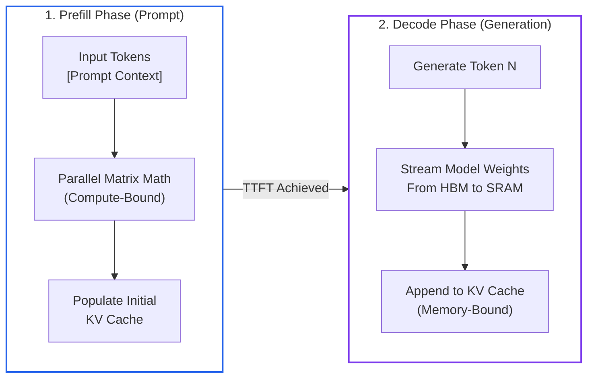
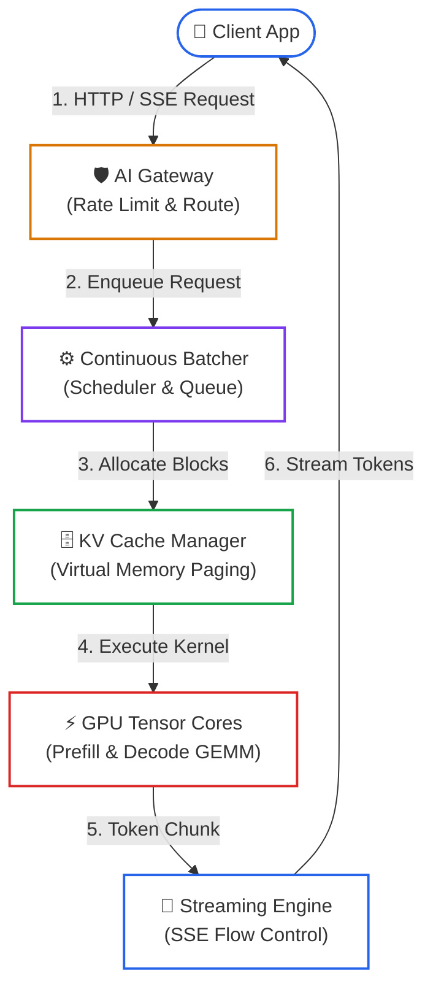

# Lesson 00: LLM Serving Fundamentals & The Inference Lifecycle

> **Tier**: `🟢 Core` | **Read time**: ~12 min | **Prerequisites**: [Phase 00: KV Cache Mechanics](../00-foundations-and-token-mechanics/03-kv-cache-vram-and-bandwidth-physics.md), [Phase 06: Golden Telemetry Signals](../06-evals-and-observability/06-telemetry-metrics-cost-governance-and-golden-signals.md)  
> **Core Concept**: Serving Large Language Models breaks traditional stateless web server patterns: requests split into compute-bound prompt processing and memory-bandwidth-bound token generation, constrained by GPU memory bus speed.  
> **New AI terms introduced**: prefill phase, decode phase, arithmetic intensity, memory bandwidth wall, time-to-first-token (TTFT), inter-token latency (ITL), continuous batching  
> **AI terms assumed from earlier lessons**: [token](../00-foundations-and-token-mechanics/01-tokenization-and-bpe-mechanics.md), [KV cache](../00-foundations-and-token-mechanics/03-kv-cache-vram-and-bandwidth-physics.md), [context window](../01-prompt-and-context-engineering/02-token-budgeting-and-compaction.md), [tokens per second](../06-evals-and-observability/06-telemetry-metrics-cost-governance-and-golden-signals.md)

---

## 🧩 The Problem: The Stateless Web Server Fallacy

In traditional backend systems, web servers are stateless. When an HTTP request arrives, the server allocates a thread, queries a database, computes a payload, and frees its memory:

```text
Client Request ──> Worker Thread (Stateless RAM) ──> DB Query ──> JSON Response ──> Memory Freed
```

Scaling is straightforward: when traffic doubles, you deploy more container replicas behind an NGINX or Envoy load balancer. Compute demands scale predictably with request count, and per-request memory is negligible (a few kilobytes).

If you apply this mental model to serving Large Language Models (LLMs), your production cluster collapses. 

In LLM serving:
1. **Requests are stateful in GPU RAM**: The server must retain intermediate Key-Value (KV) attention tensors across every generated token. A single 4,000-token prompt consumes hundreds of megabytes of GPU memory until generation finishes.
2. **Execution splits into two physical regimes**: Processing the prompt is parallel and compute-bound; generating subsequent tokens is sequential and memory-bandwidth-bound.
3. **Execution time varies wildly**: One request generates 10 tokens in 100 milliseconds; another generates 2,000 tokens over 30 seconds, monopolizing GPU memory and blocking other requests.

To build reliable AI gateways, inference clusters, and edge runtimes, you must understand the physical constraints of GPU silicon.

---

## 🧒 The Mental Model: The High-Speed Train vs. In-Flight Food Service

Think of LLM serving as operating a **high-speed passenger train**:

```text
┌──────────────────────────────────────────────────────────┐
│                   THE SERVING METAPHOR                   │
├─────────────────────────────┬────────────────────────────┤
│ 1. Terminal Boarding        │ 2. In-Transit Meal Cart    │
│    (Prefill Phase)          │    (Decode Phase)          │
│                             │                            │
│ • All passengers board at   │ • Flight attendant serves  │
│   once through every door.  │   one passenger at a time. │
│ • Massive, parallel flux.   │ • Walk down the aisle,     │
│ • Highly efficient use of   │   fetch item, hand it out. │
│   platform space.           │ • Attendant is bottleneck; │
│ • Compute-Bound.            │   train engine sits idle.  │
│                             │ • Memory-Bandwidth-Bound.  │
└─────────────────────────────┴────────────────────────────┘
```

1. **Boarding at the Terminal (Prefill Phase)**: All passengers enter the train simultaneously through open doors. The platform operates at peak parallel throughput. The system processes all prompt tokens at once.
2. **In-Flight Food Service (Decode Phase)**: Once moving, a single attendant serves passengers one by one. For each snack handed out, the attendant walks down the aisle and back. The high-speed engine sits idle waiting on walking speed. The system must stream all model weights through memory for every single token generated.

> ⚠️ **Where this analogy breaks**: A train can add more flight attendants. In a GPU, tensor cores cannot generate future tokens until the current token completes because autoregressive generation is sequential: token N+1 strictly requires the output vector of token N.

---

## ⚠️ Why Naive Serving Architectures Fail

Wrapping a model checkpoint inside a standard FastAPI service fails under production concurrency:

```python
# Naive serving endpoint: crashes under production traffic
@app.post("/v1/chat")
async def chat(request: ChatRequest):
    output = model.generate(request.prompt, max_tokens=request.max_tokens)
    return {"text": output}
```

This naive implementation triggers three critical production failures:
1. **Premature Out-Of-Memory (OOM) Crashes**: Model weights occupy static memory (e.g., 15 GB for an 8B model in 16-bit). As concurrent requests arrive, each allocates dynamic KV cache memory. Without virtualized paging, variable prompt lengths cause severe memory fragmentation, crashing the GPU process.
2. **Head-of-Line Blocking**: When Client A sends a 16,000-token document, the GPU enters prompt processing mode for seconds. Concurrent streaming requests from Client B, C, and D stall completely.
3. **Severe Hardware Underutilization**: Generating tokens sequentially consumes less than 2% of peak GPU compute capacity because compute units spend 98% of their cycles waiting for model weights to travel from High-Bandwidth Memory (HBM) to processor caches.

---

## ⚙️ Core Serving Mechanisms: One Term at a Time



### Walkthrough of the Inference Regimes
1. **Prefill Phase**: Ingests prompt context and executes parallel matrix multiplications (GEMM) across all prompt tokens at once. This computes attention vectors, populates initial Key and Value tensors in GPU memory, and produces the first generated token. The elapsed duration is **Time-To-First-Token (TTFT)**.
2. **Decode Phase**: Enters an autoregressive loop. For each subsequent token, the GPU fetches all model weights from High-Bandwidth Memory (HBM) to on-chip SRAM to calculate one vector. The latency between consecutive tokens is **Inter-Token Latency (ITL)**.

---

### Mechanism 1: Prefill vs. Decode & The Arithmetic Intensity Cliff

- 🧒 **Analogy**: Reading a 500-page book in one sitting (dense parallel work) versus reciting the next word every five seconds while re-scanning the entire book for each word (mostly waiting and searching).
- ⚙️ **Engineering**: 
  - **Arithmetic Intensity** measures operations per byte transferred from memory:
    ```text
    Arithmetic Intensity = Floating Point Operations (FLOPs) / Bytes Transferred
    ```
  - An NVIDIA H100 SXM delivers 989 TeraFLOPs of 16-bit math with 3.35 Terabytes/sec memory bandwidth. The balance point is:
    ```text
    Hardware Balance Point = 989 TFLOPs / 3.35 TB/s ≈ 295 FLOPs/byte
    ```
  - During **Prefill**, the GPU processes T prompt tokens at once. For 2,048 tokens, arithmetic intensity is ≈ 2,048 FLOPs/byte. Sitting far above 295, the workload is **compute-bound**, utilizing nearly 100% of tensor cores.
  - During **Decode**, the GPU processes 1 token (T=1). Generating one token requires ≈ 16 billion FLOPs, while reading 16 GB of weights transfers 16 × 10^9 bytes:
    ```text
    Decode Arithmetic Intensity = (2 × Parameters) / (2 Bytes × Parameters) = 1.0 FLOP/byte
    ```
  - Because 1.0 FLOP/byte is far below 295, decoding is strictly **memory-bandwidth bound**. Tensor cores sit idle waiting for memory.
- ⚠️ **What breaks if you skip this**: You cannot speed up single-user generation by adding more Tensor Cores. You can only speed it up by increasing memory bandwidth, quantizing weights, using speculative decoding, or batching concurrent requests.

---

### Mechanism 2: The KV Cache Memory Footprint & Capacity Limits

- 🧒 **Analogy**: A whiteboard in a meeting room. Every spoken argument is written on the board so participants retain context. If the meeting runs too long, the whiteboard fills up completely, and discussion must stop.
- ⚙️ **Engineering**: 
  - To prevent recomputing attention across preceding tokens during decode, the engine caches Key and Value projection matrices in GPU memory.
  - For a transformer model with L layers, H_kv key-value heads, head dimension D, and precision bytes P:
    ```text
    KV Cache Bytes per Token = 2 × L × H_kv × D × P
    ```
  - For Llama 3.1 8B (L=32, H_kv=8, D=128, P=2 bytes):
    ```text
    KV Cache per Token = 2 × 32 × 8 × 128 × 2 = 131,072 bytes (128 KB per token)
    ```
  - For a 4,096-token context, one request consumes:
    ```text
    128 KB × 4,096 = 512 MB of VRAM
    ```
  - With 64 GB of VRAM available after static weights, the hardware ceiling is:
    ```text
    Max Concurrent Streams = 64 GB / 0.5 GB = 128 concurrent requests
    ```
- ⚠️ **What breaks if you skip this**: Sudden CUDA Out-of-Memory crashes under peak traffic. GPU memory does not swap to disk by default; allocation failures crash the process.

---

### Mechanism 3: The End-to-End Serving Lifecycle



### Walkthrough of the Production Serving Pipeline
1. **Client Request**: Client sends a chat completion request with prompt text and generation parameters.
2. **AI Gateway**: Enforces distributed token-bucket rate limits and routes traffic across available engine workers.
3. **Continuous Batcher**: Inserts the request into an iteration-level queue. New requests join the running batch at the next token generation step.
4. **KV Cache Manager**: Allocates non-contiguous memory blocks in GPU VRAM using virtual memory paging.
5. **GPU Execution**: Runs compute-bound prefill for the prompt, then cycles through memory-bound decode iterations.
6. **Streaming Engine**: Emits each token immediately over Server-Sent Events (SSE) to ensure fast Time-To-First-Token.

---

## 💻 Typed Offline Runnable Implementation: Serving Profiler

The following complete script calculates memory footprint, arithmetic intensity, and theoretical latency bounds for any transformer model and GPU hardware profile:

```python
"""
Serving Profiler: Physics and Capacity Calculator for LLM Serving Infrastructure.
Executes offline using Python 3.12+ standard library and Pydantic v2.
"""

from pydantic import BaseModel, Field


class ModelSpec(BaseModel):
    name: str = Field(..., description="Model identifier")
    param_billions: float = Field(..., description="Total parameter count in billions")
    num_layers: int = Field(default=32, description="Number of transformer layers")
    hidden_size: int = Field(default=4096, description="Hidden dimension size")
    num_heads: int = Field(default=32, description="Number of query attention heads")
    num_kv_heads: int = Field(default=8, description="Number of KV heads (GQA)")
    bytes_per_param: int = Field(default=2, description="Precision bytes (FP16=2, FP8=1)")


class GpuSpec(BaseModel):
    name: str = Field(default="NVIDIA H100 SXM", description="GPU hardware identifier")
    vram_gb: float = Field(default=80.0, description="Total High Bandwidth Memory in GB")
    memory_bandwidth_tb_s: float = Field(
        default=3.35, description="Memory bandwidth in Terabytes/second"
    )
    tensor_tflops_fp16: float = Field(
        default=989.0, description="Peak dense FP16 compute in TeraFLOPs"
    )


class InferenceProfileResult(BaseModel):
    model_weights_gb: float
    kv_cache_per_request_mb: float
    max_concurrent_streams: int
    prefill_arithmetic_intensity: float
    decode_arithmetic_intensity: float
    min_inter_token_latency_ms: float
    max_tokens_per_second_single_stream: float


class ServingProfiler:
    """Calculates hardware roofline bounds and memory capacity for LLM serving."""

    def __init__(self, model: ModelSpec, gpu: GpuSpec) -> None:
        self.model = model
        self.gpu = gpu

    def calculate_weights_memory_gb(self) -> float:
        total_bytes = self.model.param_billions * 1e9 * self.model.bytes_per_param
        return total_bytes / (1024**3)

    def calculate_kv_bytes_per_token(self) -> int:
        head_dim = self.model.hidden_size // self.model.num_heads
        return (
            2
            * self.model.num_layers
            * self.model.num_kv_heads
            * head_dim
            * self.model.bytes_per_param
        )

    def profile(
        self, prompt_tokens: int, generated_tokens: int
    ) -> InferenceProfileResult:
        total_tokens = prompt_tokens + generated_tokens
        kv_bytes_per_token = self.calculate_kv_bytes_per_token()
        kv_per_seq_mb = (total_tokens * kv_bytes_per_token) / (1024**2)

        weights_gb = self.calculate_weights_memory_gb()
        available_vram_gb = self.gpu.vram_gb - weights_gb

        kv_per_seq_gb = kv_per_seq_mb / 1024.0
        max_concurrency = (
            int(available_vram_gb / kv_per_seq_gb) if kv_per_seq_gb > 0 else 0
        )

        prefill_flops = 2.0 * (self.model.param_billions * 1e9) * prompt_tokens
        weights_bytes = weights_gb * (1024**3)
        prefill_ai = prefill_flops / weights_bytes

        decode_flops = 2.0 * (self.model.param_billions * 1e9)
        decode_ai = decode_flops / weights_bytes

        bandwidth_bytes_per_sec = self.gpu.memory_bandwidth_tb_s * 1e12
        min_decode_sec = weights_bytes / bandwidth_bytes_per_sec
        itl_ms = min_decode_sec * 1000.0
        max_tps = 1.0 / min_decode_sec if min_decode_sec > 0 else 0.0

        return InferenceProfileResult(
            model_weights_gb=round(weights_gb, 2),
            kv_cache_per_request_mb=round(kv_per_seq_mb, 2),
            max_concurrent_streams=max_concurrency,
            prefill_arithmetic_intensity=round(prefill_ai, 1),
            decode_arithmetic_intensity=round(decode_ai, 2),
            min_inter_token_latency_ms=round(itl_ms, 2),
            max_tokens_per_second_single_stream=round(max_tps, 1),
        )


if __name__ == "__main__":
    model = ModelSpec(
        name="Llama 3.1 8B (FP16)",
        param_billions=8.0,
        num_layers=32,
        hidden_size=4096,
        num_heads=32,
        num_kv_heads=8,
        bytes_per_param=2,
    )
    gpu = GpuSpec()

    profiler = ServingProfiler(model, gpu)
    result = profiler.profile(prompt_tokens=2048, generated_tokens=256)

    print("================ LLM SERVING HARDWARE PROFILE ================")
    print(f"Model: {model.name} | GPU: {gpu.name}")
    print(f"Model Static Weights VRAM      : {result.model_weights_gb} GB")
    print(f"KV Cache per Request (2304 tok): {result.kv_cache_per_request_mb} MB")
    print(f"Max Concurrent Streams (80GB)  : {result.max_concurrent_streams} streams")
    print("--------------------------------------------------------------")
    print(f"Prefill Arithmetic Intensity   : {result.prefill_arithmetic_intensity} FLOPs/byte (Compute-Bound)")
    print(f"Decode Arithmetic Intensity    : {result.decode_arithmetic_intensity} FLOPs/byte (Memory-Bound)")
    print(f"Theoretical Min ITL (Single Req): {result.min_inter_token_latency_ms} ms/token")
    print(f"Theoretical Max TPS (Single Req): {result.max_tokens_per_second_single_stream} tok/sec")
    print("==============================================================")
```

### Verified Execution Output

```text
================ LLM SERVING HARDWARE PROFILE ================
Model: Llama 3.1 8B (FP16) | GPU: NVIDIA H100 SXM
Model Static Weights VRAM      : 14.9 GB
KV Cache per Request (2304 tok): 288.0 MB
Max Concurrent Streams (80GB)  : 226 streams
--------------------------------------------------------------
Prefill Arithmetic Intensity   : 2048.0 FLOPs/byte (Compute-Bound)
Decode Arithmetic Intensity    : 1.0 FLOPs/byte (Memory-Bound)
Theoretical Min ITL (Single Req): 4.78 ms/token
Theoretical Max TPS (Single Req): 209.4 tok/sec
==============================================================
```

---

## ⚖️ Trade-offs & Engineering Failure Modes

| Dimension | Prefill Phase (Prompt) | Decode Phase (Generation) |
|---|---|---|
| **Primary Bottleneck** | **Compute Density (FLOPs)**: Limited by Tensor Core matrix multiplication speed. | **Memory Bandwidth (Bytes/sec)**: Limited by High Bandwidth Memory bus speed. |
| **Arithmetic Intensity** | High (> 100 to 2,000+ FLOPs/byte). | Extremely Low (≈ 1.0 FLOP/byte for single requests). |
| **Latency Metric** | **Time-To-First-Token (TTFT)**: Bounded by prompt length and prefill batching. | **Inter-Token Latency (ITL)**: Bounded by memory bandwidth and active concurrent batch size. |
| **Mitigation Pattern** | Chunked prefill; prompt prefix caching; prefill-decode disaggregation. | Continuous batching; speculative decoding; weight quantization (FP8 / NVFP4). |
| **Failure Mode** | Long prefills trigger Head-of-Line blocking, freezing ongoing streaming decodes. | Growing KV caches cause physical VRAM fragmentation, triggering out-of-memory crashes. |

---

## ✅ Quick Check

You operate an inference cluster serving an open-weights 70-billion parameter model in 16-bit precision (140 GB weights) split across two NVIDIA H100 GPUs (160 GB total VRAM). During peak hours, single-stream generation throughput drops to 30 tokens per second per user, yet your GPU monitoring dashboard reports that Tensor Core utilization is hovering at only 8%. 

A junior engineer proposes upgrading to GPUs with double the Tensor Core TFLOPs to fix the slow generation speed.

**Why will this hardware upgrade fail to improve single-user generation speed?**

<details>
<summary>Click to reveal the production architectural explanation</summary>

The proposal fails because **single-stream autoregressive decoding is memory-bandwidth bound, not compute bound**.

For a 70B model in 16-bit precision, generating each token requires streaming 140 GB of model weights from High-Bandwidth Memory (HBM) into on-chip cache. On hardware with 3.35 TB/s memory bandwidth, the physical limit to read 140 GB is:
```text
Min Time per Token = 140 GB / 3,350 GB/s ≈ 0.0418 seconds = 41.8 ms
Max Generation Speed = 1 / 0.0418 ≈ 23.9 tokens per second
```

Because decoding arithmetic intensity is only ≈ 1.0 FLOP/byte, Tensor Cores spend >90% of cycles idle waiting on memory buses. Doubling compute does not reduce the 41.8 ms transfer time. 

To increase generation speed:
1. **Reduce memory footprint**: Quantize the model to FP8 or NVFP4 (halving memory transfer to 70 GB or 35 GB).
2. **Deploy speculative decoding**: Use EAGLE-2 or Medusa so each memory pass verifies multiple candidate tokens.
3. **Batch concurrent requests**: Amortize the 140 GB weight transfer across 32 or 64 concurrent requests.

</details>

---

## 🧭 Navigation

### Phase Progression
- **Previous Phase Hub**: **[← Phase 06: GenAI Evals & Observability](../06-evals-and-observability/README.md)**
- **Phase Hub**: **[Phase 07: High-Throughput Serving & LLMOps Hub](./README.md)**
- **Next Lesson**: **[Lesson 01: Resilient Multi-Provider AI Gateways & Rate Limiting →](./01-resilient-ai-gateways-and-rate-limiting.md)**
- **Capstone Lab**: **[Capstone Lab: Production Resilient AI Gateway](./labs/capstone-production-ai-gateway.md)**
