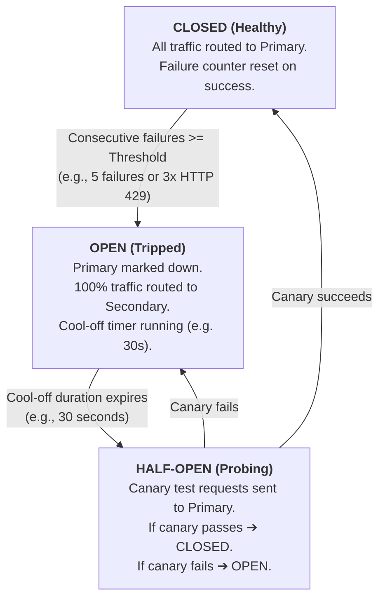
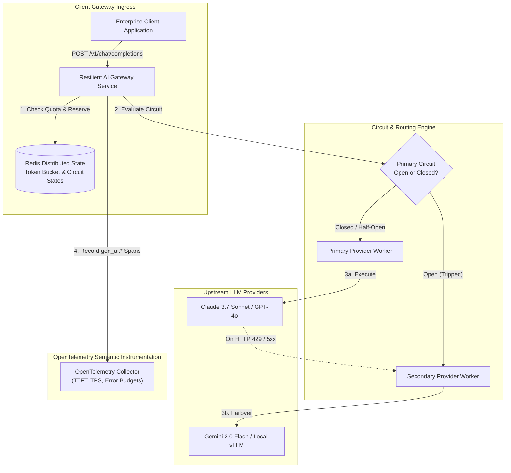

# Resilient Multi-Provider AI Gateways: Circuit Breakers, Fallback Cascades & Token-Bucket Rate Limiting

> **[Tier: 🟢 HIGH ROI / CORE]**  
> **Architecting resilient, multi-provider AI gateway infrastructure with automated circuit breaking, decorrelated jitter backoff, and distributed two-phase token-bucket rate limiting.**

---

## 🎯 What You Will Learn

- How to architect a multi-provider fallback cascade that survives upstream provider outages without client disruption.
- How to implement two-phase distributed token-bucket rate limiting (reservation and post-stream settlement) in Redis.
- How to configure automated circuit breakers that detect HTTP 429 surges and provider degradation.
- How to measure and protect the production SLA triad: Time-To-First-Token (TTFT), Tokens-Per-Second (TPS), and Error Budgets.

---

## 1. The Problem: The Prototype Trap

In a prototype or proof-of-concept, an application binds directly to a single foundation model provider via an SDK client:

```text
Application Code ──(Direct API Call)──> Single Cloud LLM Endpoint (e.g., api.anthropic.com)
```

In an enterprise production environment processing tens of thousands of requests per hour, this direct coupling creates critical operational vulnerabilities:

1. **Hard Quota Exhaustion (HTTP 429)**: Providers enforce hard ceilings on Tokens Per Minute (TPM) and Requests Per Minute (RPM). A single burst of automated batch queries can exhaust a tenant's quota, triggering cascading 429 errors across customer-facing services.
2. **Provider Outages & Silent Latency Degradation**: Model providers experience regional infrastructure failures, hardware degradation, and network partitions. When a primary provider experiences a 30-second p99 latency spike or returns HTTP 500/503 errors, an unshielded application hangs, exhausts its connection pool, and fails.
3. **Thundering Herd Retries**: Naive retry loops that retry failed requests immediately or with fixed intervals synchronize retries across thousands of clients, causing a thundering herd that prolongs upstream provider recovery.

---

## 2. The Core Idea & Why Naive Fails

### Why Naive Request-Counting Limiters Fail
Traditional web API gateways (such as NGINX or Envoy) rate-limit clients by counting HTTP requests (for example, 100 requests per minute). 

In Large Language Model serving, request counting fails fundamentally because **requests do not have uniform compute or financial costs**:
- Request A: 50 input tokens, 20 output tokens (Total: 70 tokens, cost: $0.0002).
- Request B: 85,000 input tokens, 4,000 output tokens (Total: 89,000 tokens, cost: $0.28).

If a tenant dispatches 100 instances of Request B, a naive request limiter admits all of them. Upstream, this consumes 8.9 million tokens in 60 seconds, instantly blowing past enterprise tier limits and plunging the entire tenant organization into an unrecoverable 429 lockout.

### The Engineering Solution: Resilient AI Gateway
The solution is an **AI Gateway Microservice** positioned between application clients and upstream model providers. The gateway acts as an intelligent, policy-driven reverse proxy that enforces:
1. **Two-Phase Token-Bucket Rate Limiting**: Atomically reserving estimated prompt and completion tokens before dispatching inference, and settling the actual consumed delta after stream termination.
2. **Dynamic Circuit Breakers**: Automatically isolating degraded or failing providers and diverting traffic to warm secondary models.
3. **Exponential Backoff with Decorrelated Jitter**: Smoothing retry distributions across time to eliminate thundering herd synchronization.

---

## 3. Mental Model: The Resilient Ingress & Fuel Tank

Think of the resilient gateway as an **Intelligent Airport Ground Controller with a Fuel Reserve**:

```text
[ Client Requests ]
        │
        ▼
┌───────────────────────────────────────────────────────────┐
│                    AI INGRESS GATEWAY                     │
│                                                           │
│  1. Check Tenant Fuel Tank (Redis Token Bucket)          │
│     Reserve: Prompt Length + Estimated Output             │
│                                                           │
│  2. Circuit Breaker Health Check                          │
│     Primary Provider Open? ──YES──> Route to Secondary    │
│     Primary Provider Closed? ──NO──> Route to Primary     │
│                                                           │
│  3. Stream Completion & Settlement                        │
│     Actual Tokens Used < Reserved? ──> Refund Delta       │
└───────────────────────────────────────────────────────────┘
        │                                   │
        ▼                                   ▼
[ Primary Provider: Claude 3.7 ]     [ Secondary Provider: Gemini 2.0 ]
```

- **The Fuel Tank (Token Bucket)**: Each tenant has a bucket refilled with tokens at a constant rate. Before generation begins, the gateway inspects the prompt, reserves the estimated tokens required for the trip, and locks them.
- **The Ground Controller (Circuit Breaker)**: If the runway at Provider A is blocked (HTTP 429 or 5xx errors), the controller diverts flights immediately to Provider B without forcing passengers to re-book.
- **The Fuel Reconciliation (Settlement)**: When the plane lands early (generation stops after 100 tokens instead of the estimated 1,000), the unused fuel is immediately returned to the tenant's tank.

---

## 4. How It Works: Mechanics & Protocols

### A. The Circuit Breaker State Machine
The gateway tracks upstream provider health using a finite state machine:



#### Diagram Walkthrough
1. **CLOSED State**: In normal operation, all requests route to the primary model provider. Each successful request resets the failure counter to zero.
2. **Tripping to OPEN**: When consecutive errors (HTTP 429 rate limits, 500 internal errors, or timeouts exceeding SLA thresholds) hit the trigger limit (e.g., 5 failures), the circuit trips to `OPEN`.
3. **Bypassing in OPEN**: For the duration of the cool-off period (e.g., 30 seconds), zero traffic is sent to the primary provider. Requests are automatically rerouted to the secondary model, allowing the primary provider's rate limit window to recover.
4. **HALF-OPEN Verification**: Once the timer expires, the breaker admits a small percentage of canary traffic (e.g., 5% of requests). If the canary calls succeed, the circuit resets to `CLOSED`. If any canary fails, the circuit re-trips to `OPEN` for another cool-off cycle.

---

### B. Decorrelated Jitter Exponential Backoff
When retrying transient network errors or rate limits, naive exponential backoff calculates delay as:

```text
delay = min(max_delay, base_delay * (2 ^ attempt))
```

Because multiple concurrent clients fail simultaneously, their exponential curves remain synchronized. **Decorrelated Jitter** breaks synchronization by introducing a random uniform spread between the base delay and three times the previous sleep duration:

```text
sleep_duration = min(max_delay, Uniform(base_delay, previous_sleep * 3))
```

This prevents request clustering and flattens traffic spikes into a smooth Poisson arrival distribution.

---

### C. Two-Phase Token-Bucket Reservation Protocol
To prevent quota overages without underutilizing capacity, the gateway coordinates distributed reservation in Redis:

```text
Step 1: Ingestion
Client sends prompt with max_tokens=1000.
Tokenizer calculates prompt_tokens = 450.
Estimated reservation = 450 + 1000 = 1450 tokens.

Step 2: Atomic Reservation (Redis Lua Script)
Atomically check: Current_Tokens >= 1450?
  - YES: Current_Tokens = Current_Tokens - 1450. Return HTTP 200 (Admitted).
  - NO:  Return HTTP 429 (Tenant Quota Exhausted).

Step 3: Upstream Execution & Streaming
Gateway streams generation from provider.
Client receives stream. Generation finishes at actual_completion_tokens = 220.
Total consumed = 450 + 220 = 670 tokens.

Step 4: Atomic Settlement (Redis Lua Script)
Unused tokens = 1450 - 670 = 780 tokens.
Atomically credit 780 tokens back to tenant's bucket in Redis.
```

---

## 5. Concrete Scenario & Code Implementation

Here is a production-grade AI Gateway router implemented in Python 3.12+ using FastAPI, Pydantic v2 schemas, and an asynchronous circuit breaker:

```python
import asyncio
import time
import random
from enum import Enum
from typing import AsyncGenerator, Dict, Any, Optional
from pydantic import BaseModel, Field

class CircuitState(str, Enum):
    CLOSED = "CLOSED"
    OPEN = "OPEN"
    HALF_OPEN = "HALF_OPEN"

class GatewayRequest(BaseModel):
    tenant_id: str = Field(..., description="Unique enterprise tenant identifier")
    prompt: str = Field(..., description="User input prompt")
    max_tokens: int = Field(default=512, ge=1, le=4096)
    temperature: float = Field(default=0.7, ge=0.0, le=2.0)

class TokenUsage(BaseModel):
    prompt_tokens: int
    completion_tokens: int
    total_tokens: int

class GatewayResponse(BaseModel):
    model_used: str
    content: str
    usage: TokenUsage
    cached: bool = False
    latency_ms: float

class CircuitBreaker:
    """Production circuit breaker with cool-off timer and half-open probing."""
    def __init__(self, failure_threshold: int = 3, recovery_time_sec: float = 30.0):
        self.failure_threshold = failure_threshold
        self.recovery_time_sec = recovery_time_sec
        self.state = CircuitState.CLOSED
        self.failure_count = 0
        self.last_state_change = time.monotonic()

    def record_success(self) -> None:
        if self.state == CircuitState.HALF_OPEN:
            self.state = CircuitState.CLOSED
            self.failure_count = 0
        elif self.state == CircuitState.CLOSED:
            self.failure_count = 0

    def record_failure(self) -> None:
        self.failure_count += 1
        if self.failure_count >= self.failure_threshold:
            self.state = CircuitState.OPEN
            self.last_state_change = time.monotonic()

    def allow_request(self) -> bool:
        now = time.monotonic()
        if self.state == CircuitState.OPEN:
            if now - self.last_state_change >= self.recovery_time_sec:
                self.state = CircuitState.HALF_OPEN
                self.last_state_change = now
                return True  # Allow canary probe
            return False
        return True

class TokenBucketLimiter:
    """In-memory demonstration of two-phase token reservation and settlement."""
    def __init__(self, capacity: int, refill_rate_per_sec: float):
        self.capacity = capacity
        self.tokens = float(capacity)
        self.refill_rate = refill_rate_per_sec
        self.last_refill = time.monotonic()
        self._lock = asyncio.Lock()

    async def reserve(self, estimated_tokens: int) -> bool:
        async with self._lock:
            self._refill()
            if self.tokens >= estimated_tokens:
                self.tokens -= estimated_tokens
                return True
            return False

    async def settle(self, unused_tokens: int) -> None:
        async with self._lock:
            self._refill()
            self.tokens = min(float(self.capacity), self.tokens + unused_tokens)

    def _refill(self) -> None:
        now = time.monotonic()
        delta = now - self.last_refill
        self.tokens = min(float(self.capacity), self.tokens + (delta * self.refill_rate))
        self.last_refill = now

class ResilientGatewayRouter:
    """Orchestrates primary and fallback provider cascades with rate limiting."""
    def __init__(self):
        self.primary_breaker = CircuitBreaker(failure_threshold=3, recovery_time_sec=15.0)
        self.tenant_limiters: Dict[str, TokenBucketLimiter] = {}

    def get_limiter(self, tenant_id: str) -> TokenBucketLimiter:
        if tenant_id not in self.tenant_limiters:
            # 100,000 tokens capacity, refills 1,000 tokens per second
            self.tenant_limiters[tenant_id] = TokenBucketLimiter(capacity=100000, refill_rate_per_sec=1000.0)
        return self.tenant_limiters[tenant_id]

    async def execute(self, req: GatewayRequest) -> GatewayResponse:
        start_time = time.monotonic()
        limiter = self.get_limiter(req.tenant_id)
        
        # Estimate prompt tokens (~4 chars per token)
        prompt_tokens_est = max(1, len(req.prompt) // 4)
        reservation = prompt_tokens_est + req.max_tokens

        # Phase 1: Atomic Reservation
        if not await limiter.reserve(reservation):
            raise RuntimeError(f"HTTP 429: Tenant '{req.tenant_id}' token budget exhausted.")

        model_selected = "primary-claude-3-7-sonnet"
        actual_output = ""
        actual_completion_tokens = 0

        try:
            # Attempt Primary Provider if circuit allows
            if self.primary_breaker.allow_request():
                try:
                    # Simulated call to primary model
                    actual_output, actual_completion_tokens = await self._call_primary(req)
                    self.primary_breaker.record_success()
                except Exception as primary_err:
                    self.primary_breaker.record_failure()
                    # Fallback to secondary provider
                    model_selected = "secondary-gemini-2-0-flash"
                    actual_output, actual_completion_tokens = await self._call_secondary(req)
            else:
                # Primary circuit is OPEN; route directly to secondary
                model_selected = "secondary-gemini-2-0-flash"
                actual_output, actual_completion_tokens = await self._call_secondary(req)

        finally:
            # Phase 2: Post-Execution Settlement
            actual_used = prompt_tokens_est + actual_completion_tokens
            unused = max(0, reservation - actual_used)
            await limiter.settle(unused)

        latency = (time.monotonic() - start_time) * 1000.0
        return GatewayResponse(
            model_used=model_selected,
            content=actual_output,
            usage=TokenUsage(
                prompt_tokens=prompt_tokens_est,
                completion_tokens=actual_completion_tokens,
                total_tokens=actual_used
            ),
            latency_ms=round(latency, 2)
        )

    async def _call_primary(self, req: GatewayRequest) -> tuple[str, int]:
        # Simulated primary invocation (with potential 429 chaos)
        await asyncio.sleep(0.05)
        return f"Response to '{req.prompt}' from Primary", 45

    async def _call_secondary(self, req: GatewayRequest) -> tuple[str, int]:
        # Simulated secondary invocation
        await asyncio.sleep(0.04)
        return f"Response to '{req.prompt}' from Secondary (Fallback)", 42
```

---

## 6. Architecture & Telemetry View



### Visual Walkthrough
1. **Client Ingress & Token Reservation**: The client submits a completion payload. The gateway queries Redis to execute an atomic token reservation script. If the tenant has exhausted their allocated tokens, the gateway returns HTTP 429 immediately without placing outbound network load on model providers.
2. **Circuit Routing**: The routing engine queries the circuit state for the primary provider. If the circuit is healthy (`CLOSED`), the request proceeds to the primary worker. If the circuit is tripped (`OPEN`), the request is deflected immediately to the secondary worker.
3. **Execution & Automatic Failover**: If the primary provider call fails mid-flight with HTTP 429, 500, or a network timeout, the exception triggers circuit failure recording and routes the payload to the secondary provider.
4. **Telemetry & Settlement**: Upon stream completion, the actual tokens consumed are reconciled in Redis, and OpenTelemetry spans are emitted recording provider models, latency, and cache hit metrics.

---

## 7. Common Failure Modes & Production Anti-Patterns

| Anti-Pattern | Root Cause | Engineering Solution |
|---|---|---|
| **Cascading Thundering Herd** | Synchronized clients retrying failed requests at identical intervals after a 429 outage. | Implement **Decorrelated Jitter Exponential Backoff**: randomize sleep intervals across a uniform distribution. |
| **Silent Quota Poisoning** | Failing to account for multi-turn chat history expansion during token budgeting. | Count exact token length of full conversation array before reservation; enforce maximum context window limits. |
| **Zombie Primary Saturation** | Keeping requests on a primary provider that is intermittently timing out, starving connection pools. | Enforce aggressive **Per-Request Timeouts** (e.g. 5.0s for TTFT) and trip the circuit breaker on latency degradation before 5xx errors occur. |
| **Token-Bucket Leakage** | Reserving tokens on request entry but failing to refund unused tokens when generation stops early. | Use a `try...finally` settlement block ensuring that unused completion tokens are credited back to the tenant bucket. |

---

## 8. Production View & Evaluation: The SLA Triad

Enterprise inference operations are governed by three primary service-level metrics:

1. **Time-To-First-Token (TTFT)**:
   - *Definition*: Duration from client request dispatch until the first token byte is received by the client socket.
   - *Target SLA*: p50 < 400ms, p95 < 900ms.
   - *Gateway Influence*: Affected by routing overhead, token-bucket Redis lookup latency, and provider queuing.
2. **Tokens-Per-Second (TPS)**:
   - *Definition*: Decoding throughput measured as:
   ```text
   TPS = Completion_Tokens / (Total_Duration - TTFT)
   ```
   - *Target SLA*: 30 to 100+ TPS depending on model size.
   - *Gateway Influence*: Affected by socket buffer serialization and streaming flow control.
3. **Error Budget & Availability**:
   - *Definition*: Percentage of successful generations without HTTP 429, 5xx, or dropped streaming connections.
   - *Target SLA*: 99.95% availability.
   - *Gateway Influence*: Multi-provider failover transforms single-provider 99.0% uptime into composite 99.99% system availability.

---

## 9. When Should You Use It? (Trade-off Matrix)

| Architecture Pattern | Latency Overhead | Engineering Complexity | Outage Resilience | Recommended Use Case |
|---|---|---|---|---|
| **Direct SDK Coupling** | 0ms (Lowest) | Very Low | None (Single Point of Failure) | Local developer prototyping; offline scripts. |
| **Simple Round-Robin Proxy** | < 2ms | Low | Basic (No health checks or jitter) | Homogeneous internal microservices with equal quotas. |
| **Resilient AI Gateway (Full)** | 5–15ms | Medium | **High (Automated circuit tripping & failover)** | **Mission-critical enterprise applications, multi-tenant SaaS.** |
| **Mesh-Integrated Gateway (Envoy/Kong)** | 3–8ms | High | High (Kernel-level proxying) | Large Kubernetes enterprise clusters with dedicated platform teams. |

---

## 💡 10. Senior Interview Perspective

### Architectural Scenario: Upstream Provider Degraded Outage
**Interviewer**: *"Our primary LLM provider is experiencing a brownout: 30% of requests return HTTP 429, and p99 latency has jumped from 600ms to 8 seconds. How do you prevent this from cascading into an outage across our consumer applications?"*

**Architectural Defense**:
> *"We isolate the failure using an AI Gateway implementing an automated Circuit Breaker with Decorrelated Jitter and Fallback Cascades:*
> 1. *We configure a fast TTFT timeout threshold (e.g., 3.5 seconds). Requests that do not yield a first token within 3.5 seconds are aborted, preventing socket pool exhaustion.*
> 2. *The circuit breaker monitors consecutive 429 and timeout errors. Once the error rate exceeds the threshold (e.g. 5 errors in 10 seconds), the circuit trips to `OPEN` for a 30-second cool-off window.*
> 3. *While `OPEN`, the gateway bypasses the primary provider entirely and routes 100% of traffic to our secondary provider (e.g. Gemini 2.0 Flash or an internal vLLM cluster).*
> 4. *To prevent client retries from overwhelming the primary provider during recovery, all background retry workers employ decorrelated jitter backoff, smoothing request arrivals into a manageable Poisson process."*

---

## 11. Key Takeaways & Verified Resources

- **Direct SDK integration is an enterprise anti-pattern**: Production systems require an intelligent gateway to absorb upstream quotas and outages.
- **Request-counting rate limiters do not protect LLM systems**: Token-bucket limiters must perform two-phase reservation (prompt + estimated completion) and post-stream settlement.
- **Circuit breakers prevent brownout cascades**: Tripping to `OPEN` isolates degraded providers and transparently preserves application uptime via warm secondary models.

### Authoritative Primary Sources
- **LiteLLM Open Source Gateway**: [github.com/BerriAI/litellm](https://github.com/BerriAI/litellm)
- **Envoy AI Gateway Architecture**: [envoyproxy.io/docs/envoy/latest/intro/arch_overview/upstream/load_balancing/overview](https://www.envoyproxy.io)
- **Stripe Engineering: Scaling rate limiters with Redis**: [stripe.com/blog/rate-limiters](https://stripe.com/blog/rate-limiters)
- **AWS Architecture Blog: Exponential Backoff And Jitter**: [aws.amazon.com/blogs/architecture/exponential-backoff-and-jitter](https://aws.amazon.com/blogs/architecture/exponential-backoff-and-jitter)

---

## 🧭 Navigation

- **[← Phase 07 Hub: Orientation & Navigation](./README.md)**
- **[Next Lesson: High-Performance Token Streaming & Backpressure →](./02-high-performance-token-streaming-and-backpressure.md)**
- **[Hands-On Lab: Resilient Multi-Provider AI Gateway](./labs/capstone-production-ai-gateway.md)**
