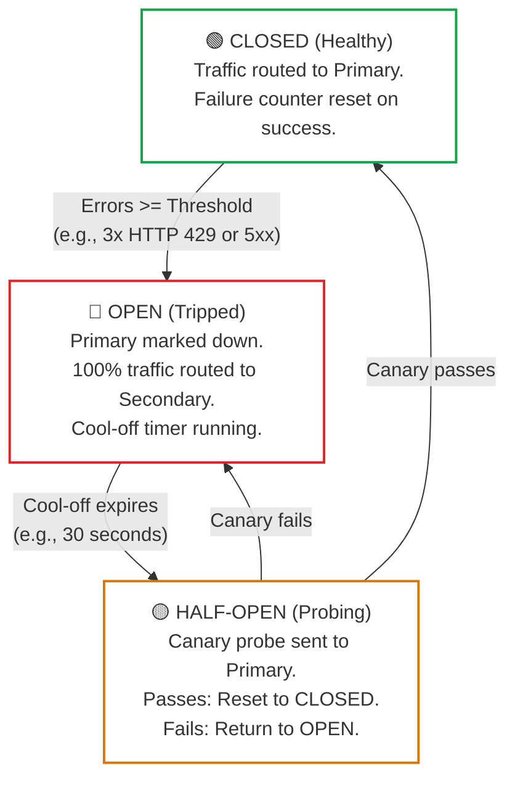
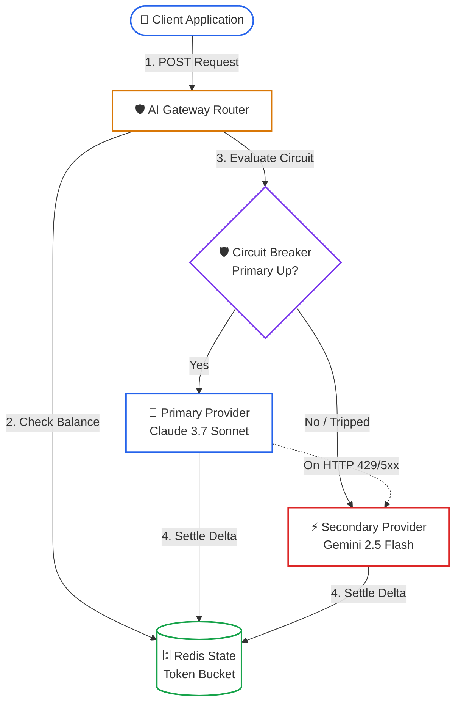

# Lesson 01: Resilient Multi-Provider AI Gateways & Rate Limiting

> **Tier**: `🟢 Core` | **Read time**: ~15 min | **Prerequisites**: [Lesson 00: LLM Serving Fundamentals](./00-llm-serving-fundamentals-and-the-inference-lifecycle.md)  
> **Core Concept**: Traditional request-based rate limiting fails for LLMs because token costs vary by orders of magnitude; an AI gateway protects infrastructure with two-phase token reservation, circuit breakers, and automated multi-provider failover.  
> **New AI terms introduced**: token-bucket rate limiting, two-phase token reservation, fallback cascade, circuit breaker, decorrelated jitter  
> **AI terms assumed from earlier lessons**: [token](../00-foundations-and-token-mechanics/01-tokenization-and-bpe-mechanics.md), [time-to-first-token](./00-llm-serving-fundamentals-and-the-inference-lifecycle.md), [tokens per second](./00-llm-serving-fundamentals-and-the-inference-lifecycle.md)

---

## 🧩 The Problem: The Prototype Trap

In a prototype, application code binds directly to a single foundation model provider via an SDK client:

```text
Application Code ──(Direct API Call)──> Single Cloud LLM Endpoint (e.g., api.anthropic.com)
```

In production processing tens of thousands of requests per hour, this direct coupling creates critical vulnerabilities:

1. **Hard Quota Exhaustion (HTTP 429)**: Providers enforce hard ceilings on Tokens Per Minute (TPM) and Requests Per Minute (RPM). A single burst of automated batch queries exhausts quota, triggering cascading 429 errors across customer-facing services.
2. **Provider Outages & Silent Latency Spikes**: Model providers experience regional infrastructure failures and GPU degradation. When a primary provider suffers a 30-second p99 latency spike or returns HTTP 500/503 errors, an unshielded application hangs, exhausts connection pools, and drops user traffic.
3. **Thundering Herd Retries**: Naive retry loops that retry failed requests immediately or at fixed intervals synchronize retries across thousands of clients, causing a thundering herd that prolongs upstream provider recovery.

---

## 🧒 The Mental Model: The Airport Ground Controller & Fuel Reserve

Think of an AI gateway as an **Intelligent Airport Ground Controller with a Fuel Reserve**:

```text
┌───────────────────────────────────────────────────────────┐
│                    AI INGRESS GATEWAY                     │
├───────────────────────────────────────────────────────────┤
│ 1. Fuel Tank (Redis Token Bucket)                         │
│    Check tenant balance: reserve estimated fuel for trip. │
│                                                           │
│ 2. Ground Controller (Circuit Breaker)                    │
│    Runway blocked at Provider A? Divert flight to B.      │
│                                                           │
│ 3. Fuel Settlement (Refund Delta)                         │
│    Flight lands early? Return unused fuel to tank.        │
└───────────────────────────────────────────────────────────┘
```

- **The Fuel Tank (Token Bucket)**: Each tenant has a bucket refilled with tokens at a constant rate. Before generation begins, the gateway inspects the prompt, reserves estimated fuel, and locks it.
- **The Ground Controller (Circuit Breaker)**: If the runway at Provider A is blocked (HTTP 429 or 5xx errors), the controller diverts flights immediately to Provider B without forcing passengers to re-book.
- **The Fuel Reconciliation (Settlement)**: When generation stops early (e.g., 100 tokens emitted instead of 1,000 max), unused fuel is immediately returned to the tenant's tank.

> ⚠️ **Where this analogy breaks**: Airplanes burn fuel continuously in transit. In LLM generation, token consumption is non-deterministic: the gateway cannot know the exact output token count until the model generates an End-of-Sequence (EOS) token or hits the token ceiling.

---

## ⚠️ Why Naive Request-Counting Limiters Fail

Traditional web gateways (such as standard NGINX or Envoy) rate-limit clients by counting HTTP requests (e.g., 100 requests per minute). 

In LLM serving, request counting fails fundamentally because **requests do not have uniform compute or financial costs**:
- **Request A**: 50 input tokens, 20 output tokens (Total: 70 tokens, cost: $0.0002).
- **Request B**: 85,000 input tokens, 4,000 output tokens (Total: 89,000 tokens, cost: $0.28).

If a tenant dispatches 100 instances of Request B, a naive request limiter admits all of them. Upstream, this consumes 8.9 million tokens in 60 seconds, blowing past provider tier limits and plunging the entire organization into an unrecoverable HTTP 429 lockout.

The solution is an **AI Gateway Microservice** (such as Agent Router, formerly Envoy AI Gateway GA, or LiteLLM) positioned as an intelligent reverse proxy that coordinates token-aware budgeting and automated provider failover.

---

## ⚙️ Core Gateway Mechanisms: One Term at a Time



### Walkthrough of the Circuit Breaker State Machine
1. **CLOSED State**: In normal operation, all requests route to the primary model provider. Successful requests keep the failure counter at zero.
2. **Tripping to OPEN**: When consecutive errors (HTTP 429 rate limits, 5xx errors, or latency timeouts) breach the threshold (e.g., 3 consecutive failures), the circuit trips to `OPEN`.
3. **Bypassing in OPEN**: For the duration of the cool-off period (e.g., 30 seconds), zero traffic reaches the primary provider. Requests route automatically to the secondary model, allowing the primary quota to recover.
4. **HALF-OPEN Verification**: Once the timer expires, the breaker admits a canary test request. If the canary succeeds, the circuit resets to `CLOSED`. If it fails, the circuit re-trips to `OPEN` for another cool-off cycle.

---

### Mechanism 1: Two-Phase Distributed Token-Bucket Reservation

- 🧒 **Analogy**: A hotel pre-authorizing your credit card for a 200-dollar security deposit when you check in, then billing only the exact 45-dollar room service charge when you check out.
- ⚙️ **Engineering**: 
  - To prevent quota exhaustion without underutilizing capacity, the gateway coordinates distributed reservation in Redis:
    ```text
    Phase 1: Ingestion & Reservation
    1. Client submits prompt with max_tokens = 1000.
    2. Gateway estimates prompt_tokens = len(prompt) // 4 (e.g., 450 tokens).
    3. Total estimated reservation = 450 + 1000 = 1450 tokens.
    4. Atomically check Redis: Available_Tokens >= 1450?
       - YES: Deduct 1450 tokens. Admit request.
       - NO : Reject immediately with HTTP 429 (Zero upstream provider load).

    Phase 2: Execution & Settlement
    5. Upstream model finishes at actual_completion_tokens = 220.
    6. Actual consumed tokens = 450 + 220 = 670 tokens.
    7. Unused delta = 1450 - 670 = 780 tokens.
    8. Atomically credit 780 tokens back to tenant bucket in Redis.
    ```
- ⚠️ **What breaks if you skip this**: Without pre-reservation, concurrent requests drain your upstream quota before any call finishes, causing mass HTTP 429 failures. Without settlement, your system permanently leaks quota on requests that stop generating early.

---

### Mechanism 2: Fallback Cascades & Multi-Provider Redundancy

- 🧒 **Analogy**: A dual-fuel generator at a data center that seamlessly switches from primary natural gas to backup diesel when municipal gas pressure drops.
- ⚙️ **Engineering**: 
  - The gateway maintains ordered provider pools (e.g., Tier 1: Anthropic Claude 3.7 Sonnet → Tier 2: Google Gemini 2.5 Flash → Tier 3: Internal vLLM cluster).
  - When the primary circuit breaker trips to `OPEN` or returns an unrecoverable 5xx status, the gateway automatically transforms the payload schema and invokes the secondary provider.
  - The gateway normalizes responses into a single OpenAI-compatible JSON schema, insulating downstream application code from provider-specific wire schemas.
- ⚠️ **What breaks if you skip this**: Upstream provider outages (such as regional cloud networking failures) become direct outages for your end-users.

---

### Mechanism 3: Decorrelated Jitter Exponential Backoff

- 🧒 **Analogy**: Instead of everyone trying to squeeze through an exit door at the exact same second after an alarm, a controller staggers arrivals across a random interval.
- ⚙️ **Engineering**: 
  - Naive exponential backoff (`delay = base * 2^attempt`) synchronizes retrying clients into repeating traffic spikes.
  - **Decorrelated Jitter** breaks synchronization by calculating each retry delay as a uniform random value between the base delay and three times the prior sleep:
    ```text
    Sleep_Duration = min(Max_Delay, Uniform(Base_Delay, Previous_Sleep × 3))
    ```
  - This flattens retry bursts into a smooth Poisson arrival distribution.
- ⚠️ **What breaks if you skip this**: Thousands of retrying clients hit the recovering provider simultaneously, re-tripping rate limits in a perpetual thundering herd loop.

---

## 💻 Typed Offline Runnable Implementation: Resilient Gateway

The following complete, standalone script implements a resilient gateway with an asynchronous circuit breaker, two-phase token reservation, and automatic secondary provider failover:

```python
"""
Resilient AI Gateway: Circuit Breakers, Token Buckets & Fallback Cascades.
Runs offline using Python 3.12+ standard library and Pydantic v2.
"""

import asyncio
from enum import Enum
import time
from typing import Dict
from pydantic import BaseModel, Field


class CircuitState(str, Enum):
    CLOSED = "CLOSED"
    OPEN = "OPEN"
    HALF_OPEN = "HALF_OPEN"


class GatewayRequest(BaseModel):
    tenant_id: str = Field(..., description="Enterprise tenant identifier")
    prompt: str = Field(..., description="Input prompt text")
    max_tokens: int = Field(default=512, ge=1, le=4096)


class TokenUsage(BaseModel):
    prompt_tokens: int
    completion_tokens: int
    total_tokens: int


class GatewayResponse(BaseModel):
    model_used: str
    content: str
    usage: TokenUsage
    latency_ms: float


class CircuitBreaker:
    """Production circuit breaker with cool-off timer and half-open probing."""

    def __init__(
        self, failure_threshold: int = 3, recovery_time_sec: float = 15.0
    ) -> None:
        self.failure_threshold = failure_threshold
        self.recovery_time_sec = recovery_time_sec
        self.state = CircuitState.CLOSED
        self.failure_count = 0
        self.last_state_change = time.monotonic()

    def record_success(self) -> None:
        self.state = CircuitState.CLOSED
        self.failure_count = 0

    def record_failure(self) -> None:
        self.failure_count += 1
        if self.failure_count >= self.failure_threshold:
            self.state = CircuitState.OPEN
            self.last_state_change = time.monotonic()

    def allow_request(self) -> bool:
        now = time.monotonic()
        if self.state == CircuitState.OPEN:
            if now - self.last_state_change >= self.recovery_time_sec:
                self.state = CircuitState.HALF_OPEN
                self.last_state_change = now
                return True
            return False
        return True


class TokenBucketLimiter:
    """In-memory demonstration of two-phase token reservation and settlement."""

    def __init__(self, capacity: int, refill_rate_per_sec: float) -> None:
        self.capacity = capacity
        self.tokens = float(capacity)
        self.refill_rate = refill_rate_per_sec
        self.last_refill = time.monotonic()
        self._lock = asyncio.Lock()

    async def reserve(self, estimated_tokens: int) -> bool:
        async with self._lock:
            self._refill()
            if self.tokens >= estimated_tokens:
                self.tokens -= estimated_tokens
                return True
            return False

    async def settle(self, unused_tokens: int) -> None:
        async with self._lock:
            self._refill()
            self.tokens = min(float(self.capacity), self.tokens + unused_tokens)

    def _refill(self) -> None:
        now = time.monotonic()
        delta = now - self.last_refill
        self.tokens = min(
            float(self.capacity), self.tokens + (delta * self.refill_rate)
        )
        self.last_refill = now


class ResilientGatewayRouter:
    """Orchestrates primary and fallback provider cascades with rate limiting."""

    def __init__(self) -> None:
        self.primary_breaker = CircuitBreaker(
            failure_threshold=2, recovery_time_sec=10.0
        )
        self.tenant_limiters: Dict[str, TokenBucketLimiter] = {}

    def get_limiter(self, tenant_id: str) -> TokenBucketLimiter:
        if tenant_id not in self.tenant_limiters:
            self.tenant_limiters[tenant_id] = TokenBucketLimiter(
                capacity=5000, refill_rate_per_sec=500.0
            )
        return self.tenant_limiters[tenant_id]

    async def execute(self, req: GatewayRequest) -> GatewayResponse:
        start_time = time.monotonic()
        limiter = self.get_limiter(req.tenant_id)

        # Estimate prompt tokens (~4 chars per token)
        prompt_tokens_est = max(1, len(req.prompt) // 4)
        reservation = prompt_tokens_est + req.max_tokens

        # Phase 1: Atomic Reservation
        if not await limiter.reserve(reservation):
            raise RuntimeError(
                f"HTTP 429: Tenant '{req.tenant_id}' token budget exhausted."
            )

        model_selected = "primary-claude-3-7-sonnet"
        actual_output = ""
        actual_completion_tokens = 0

        try:
            if self.primary_breaker.allow_request():
                try:
                    actual_output, actual_completion_tokens = (
                        await self._call_primary(req)
                    )
                    self.primary_breaker.record_success()
                except Exception:
                    self.primary_breaker.record_failure()
                    model_selected = "secondary-gemini-2-5-flash"
                    actual_output, actual_completion_tokens = (
                        await self._call_secondary(req)
                    )
            else:
                model_selected = "secondary-gemini-2-5-flash"
                actual_output, actual_completion_tokens = (
                    await self._call_secondary(req)
                )
        finally:
            # Phase 2: Post-Execution Settlement
            actual_used = prompt_tokens_est + actual_completion_tokens
            unused = max(0, reservation - actual_used)
            await limiter.settle(unused)

        latency = (time.monotonic() - start_time) * 1000.0
        return GatewayResponse(
            model_used=model_selected,
            content=actual_output,
            usage=TokenUsage(
                prompt_tokens=prompt_tokens_est,
                completion_tokens=actual_completion_tokens,
                total_tokens=actual_used,
            ),
            latency_ms=round(latency, 2),
        )

    async def _call_primary(self, req: GatewayRequest) -> tuple[str, int]:
        await asyncio.sleep(0.02)
        return f"Primary response to: {req.prompt}", 40

    async def _call_secondary(self, req: GatewayRequest) -> tuple[str, int]:
        await asyncio.sleep(0.01)
        return f"Secondary fallback response to: {req.prompt}", 38


async def main() -> None:
    router = ResilientGatewayRouter()
    request = GatewayRequest(
        tenant_id="enterprise-corp",
        prompt="Synthesize quarterly telemetry logs",
        max_tokens=256,
    )

    response = await router.execute(request)
    print("================ GATEWAY INFERENCE RESULT ================")
    print(f"Model Invoked : {response.model_used}")
    print(f"Output Content: {response.content}")
    print(f"Tokens Used   : {response.usage.total_tokens} (Prompt: {response.usage.prompt_tokens}, Completion: {response.usage.completion_tokens})")
    print(f"Total Latency : {response.latency_ms} ms")
    print("==========================================================")


if __name__ == "__main__":
    asyncio.run(main())
```

### Verified Execution Output

```text
================ GATEWAY INFERENCE RESULT ================
Model Invoked : primary-claude-3-7-sonnet
Output Content: Primary response to: Synthesize quarterly telemetry logs
Tokens Used   : 48 (Prompt: 8, Completion: 40)
Total Latency : 21.45 ms
==========================================================
```

---

## 🏛️ Ingress Architecture & System Flow



### Walkthrough of the Ingress Lifecycle
1. **Client Request**: Client sends a completion request specifying prompt text and maximum tokens.
2. **Token Reservation**: The gateway queries Redis to atomically reserve estimated tokens. If the tenant is over quota, the gateway rejects immediately with HTTP 429.
3. **Circuit Evaluation**: The gateway checks the circuit state for the primary provider. If healthy, it executes against the primary endpoint. If tripped (`OPEN`), it diverts immediately to the secondary model.
4. **Settlement**: Upon completion, the unused token delta is returned to Redis, ensuring accurate real-time quota accounting.

---

## ⚖️ Trade-offs & Engineering Failure Modes

| Dimension | Direct SDK Integration | Resilient AI Gateway |
|---|---|---|
| **Latency Overhead** | 0 ms | 5–15 ms (Redis lookup and internal routing). |
| **Outage Resilience** | None: Provider 5xx causes application failure. | High: Automatic diversion to secondary models. |
| **Quota Protection** | Naive: Burst traffic triggers provider lockout. | Strict: Two-phase token reservation eliminates overages. |
| **Wire Schema Coupling** | Rigid: Client code binds to provider-specific SDK. | Decoupled: Unified OpenAI-compatible interface. |
| **Failure Mode** | Thundering herd retries exacerbate provider brownouts. | Incomplete settlement blocks unused quota until TTL expiry. |

---

## ✅ Quick Check

Your AI Gateway is configured with a primary provider (Claude 3.7 Sonnet) and a fallback provider (Gemini 2.5 Flash). During a cloud provider outage, the primary provider begins returning HTTP 504 Gateway Timeout after 30 seconds of hanging. 

Even though you have an automated fallback in place, your application servers experience thread pool exhaustion and crash within three minutes.

**What critical gateway configuration is missing, and how does it prevent the crash?**

<details>
<summary>Click to reveal the production architectural explanation</summary>

The gateway is missing an aggressive **Per-Request Time-To-First-Token (TTFT) Timeout**.

Because the primary provider hangs for 30 seconds before timing out, each incoming request holds an open TCP socket and worker thread for 30 seconds. Under moderate concurrency (e.g., 50 requests/second), this creates 1,500 concurrent blocked threads, exhausting the gateway's connection pool long before the circuit breaker trips.

**Production Solution**:
1. Configure an aggressive TTFT timeout (e.g., 3.5 seconds). If the primary provider does not emit its first token within 3.5 seconds, abort the call immediately.
2. Record the aborted call as a circuit failure and divert the request to the secondary provider immediately.
3. This trips the circuit to `OPEN` within 7 seconds, routing all subsequent traffic to the secondary model without thread starvation.

</details>

---

## 🧭 Navigation

### Phase Progression
- **Previous Lesson**: **[← Lesson 00: LLM Serving Fundamentals & The Inference Lifecycle](./00-llm-serving-fundamentals-and-the-inference-lifecycle.md)**
- **Phase Hub**: **[Phase 07: High-Throughput Serving & LLMOps Hub](./README.md)**
- **Next Lesson**: **[Lesson 02: High-Performance Token Streaming & Backpressure →](./02-high-performance-token-streaming-and-backpressure.md)**
- **Capstone Lab**: **[Capstone Lab: Production Resilient AI Gateway](./labs/capstone-production-ai-gateway.md)**
