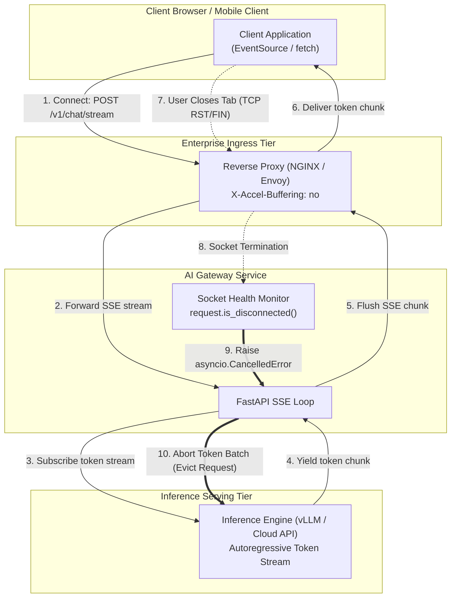

# High-Performance Token Streaming: Wire Flow Control, Backpressure & Cancellation Propagation

> **[Tier: 🟢 Core]**  
> **Mastering the network wire mechanics of real-time LLM token streaming: Server-Sent Events (SSE), TCP socket backpressure, and upstream cancellation propagation to eliminate zombie token burn.**

---

## 🎯 What You Will Learn

- Why full-response HTTP buffering destroys user experience and inflates Time-To-First-Token (TTFT) metrics.
- The wire protocol differences between Server-Sent Events (SSE), WebSockets, and gRPC streaming for unidirectional token feeds.
- How slow client networks cause TCP socket buffer bloat and how to manage flow control.
- How to detect client disconnects and propagate cancellation tokens upstream to terminate wasteful "zombie token" generation.

---

## 1. The Problem: The 15-Second Blank Screen & Zombie Token Burn

### The User Experience Degradation (The Blank Screen)
In traditional web APIs, servers buffer the entire response body before sending HTTP headers and payload to the client. 

In LLM inference, models generate tokens autoregressively one by one at speeds ranging from 20 to 100+ tokens per second. A 1,500-token completion takes between 15 and 45 seconds to generate:

```text
[ Client Request ] ────> [ Upstream Model ]
   Waiting...
   Waiting... (15 seconds of blank screen, user assumes system crashed)
   Waiting...
[ Client Response ] <─── (Entire 1,500-token document delivered at once)
```

For interactive applications, this latency profile causes users to refresh pages, re-submit queries, or abandon sessions.

### The Financial & Compute Crisis: Zombie Token Burn
The reverse failure mode occurs when a user closes their browser tab or navigates away 2 seconds into a 30-second generation. 

If the server does not monitor the TCP socket state and propagate cancellation upstream:
- The inference engine continues generating the remaining 1,400 tokens into the void.
- High Bandwidth Memory (HBM) on GPU clusters remains locked.
- API provider token meters continue running.
- These unread, wasted generations are known as **Zombie Tokens**, and in high-traffic enterprise applications they can account for **15% to 30% of total inference bills**.

---

## 2. The Core Idea & Why Naive Fails

### Why Naive Streaming Fails: Buffer Bloat & Reverse Proxy Traps
Developers frequently attempt to implement streaming by simply calling `yield token` inside an asynchronous web endpoint. In production, this fails due to two network-layer obstacles:

1. **Reverse Proxy Buffering**: Intermediate reverse proxies (e.g., NGINX, AWS ALB, Cloudflare) default to buffering responses to optimize TCP packet utilization. Unless explicitly instructed via headers (`X-Accel-Buffering: no`, `Cache-Control: no-cache`), the proxy buffers tokens until its 4KB or 16KB buffer fills, completely negating the streaming effect.
2. **TCP Socket Backpressure**: If a client is on a high-latency or low-bandwidth mobile connection, the client cannot read TCP packets as fast as the GPU generates them. The operating system's TCP send buffer fills up, creating socket backpressure. If the server does not handle backpressure, memory usage inside the gateway balloons as unread tokens accumulate in application memory.

### The Engineering Solution
High-performance streaming infrastructure requires:
1. **Server-Sent Events (SSE)** conforming strictly to the W3C EventSource standard (`text/event-stream`).
2. **Explicit Reverse Proxy Bypass Headers** to force immediate frame flushing.
3. **Active Socket Health Probing & Cancellation Tokens**: Binding client socket closure directly to the inference task's lifecycle (`asyncio.CancelledError` or `CancellationTokenSource`).

---

## 3. Mental Model: The Hydraulic Firehose & Automatic Shutoff Valve

Think of the token generation pipeline as a **High-Pressure Hydraulic Water System**:

```text
[ GPU Inference Engine ]  ──(Water Pump: 100 Liters/sec)──>
         │
         ▼
[ Gateway Send Buffer ]   ──(Pipe & Pressure Valve)────────>
         │
         ▼
[ Client Web Browser ]    ──(Consumer Faucet)──────────────> User Eye
```

- **The Flow**: The GPU is an industrial pump producing 100 tokens/sec. The client faucet must drink continuously.
- **The Backpressure**: If the consumer partially closes the faucet (slow mobile network), pressure builds in the pipe. The pump must be throttled to prevent the pipe from bursting.
- **The Shutoff Valve (Cancellation)**: If the consumer walks away and cuts the pipe (closing the browser tab), an automatic pressure-drop sensor immediately trips the main pump shutoff valve, halting water flow at the source.

---

## 4. How It Works: Protocols & Wire Formats

### Comparing Streaming Wire Protocols

| Protocol | Transport | Directionality | Overhead | Firewall Traversal | Recommended Use Case |
|---|---|---|---|---|---|
| **Server-Sent Events (SSE)** | HTTP/1.1 or HTTP/2 | Server ➔ Client (Unidirectional) | Minimal (Plain text `data: {...}\n\n`) | Excellent (Standard port 80/443 HTTP) | **Primary standard for LLM text/token streaming.** |
| **WebSockets** | TCP (Upgrade from HTTP) | Full Duplex (Bidirectional) | Low (Frame headers, masking) | Moderate (Some corporate proxies block WSS) | Voice-to-voice agents, real-time bidirectional chat. |
| **gRPC Streaming** | HTTP/2 (Protobuf) | Unidirectional or Bidirectional | Lowest (Binary serialization) | Poor for browsers; excellent for microservices | **Internal microservice-to-microservice gateway calls.** |

### The Server-Sent Events (SSE) Wire Format
An SSE stream is an unbuffered HTTP response with the content type `text/event-stream`. Each chunk contains a payload prefixed with `data:` and terminated by two newline characters (`\n\n`):

```http
HTTP/1.1 200 OK
Content-Type: text/event-stream; charset=utf-8
Cache-Control: no-cache
Connection: keep-alive
X-Accel-Buffering: no

data: {"token": "Production", "index": 0}

data: {"token": " systems", "index": 1}

data: {"token": " require", "index": 2}

data: [DONE]

```

---

## 5. Concrete Scenario & Code Implementation

The following production implementation in Python 3.12+ (FastAPI) demonstrates:
1. Streaming tokens formatted as standard SSE.
2. Active client disconnect detection via `request.is_disconnected()`.
3. Terminating upstream inference immediately upon client disconnection.

```python
import asyncio
import json
import time
from typing import AsyncGenerator
from fastapi import FastAPI, Request, HTTPException
from fastapi.responses import StreamingResponse
from pydantic import BaseModel, Field

app = FastAPI(title="Production High-Performance Token Streaming Gateway")

class StreamPromptRequest(BaseModel):
    prompt: str = Field(..., min_length=1, max_length=10000)
    max_tokens: int = Field(default=200, ge=1, le=2048)
    model: str = Field(default="claude-3-7-sonnet")

class StreamTokenEvent(BaseModel):
    index: int
    token: str
    model: str
    timestamp: float

async def mock_upstream_llm_generator(
    prompt: str, 
    max_tokens: int, 
    model: str
) -> AsyncGenerator[str, None]:
    """
    Simulates an upstream provider streaming tokens autoregressively.
    If cancelled, this generator raises asyncio.CancelledError, halting generation.
    """
    words = [
        "In", " modern", " distributed", " AI", " infrastructure,", 
        " streaming", " is", " not", " merely", " an", " aesthetic", 
        " UX", " enhancement.", " It", " is", " an", " essential", 
        " flow", " control", " and", " cost", " governance", " boundary."
    ]
    for i in range(max_tokens):
        # Simulate ~40ms token generation interval (25 TPS)
        await asyncio.sleep(0.04)
        token = words[i % len(words)]
        yield token

async def sse_event_streamer(
    request: Request, 
    prompt_req: StreamPromptRequest
) -> AsyncGenerator[str, None]:
    """
    Encapsulates token generation with active client disconnect polling
    and upstream cancellation propagation.
    """
    start_time = time.monotonic()
    token_index = 0
    token_stream = mock_upstream_llm_generator(
        prompt_req.prompt, 
        prompt_req.max_tokens, 
        prompt_req.model
    )

    try:
        async for raw_token in token_stream:
            # 1. Active Socket Check: Did the client close the connection?
            if await request.is_disconnected():
                print(f"[SHUTOFF] Client disconnected at token {token_index}. Aborting upstream inference!")
                # Raising CancelledError immediately stops the upstream generator
                raise asyncio.CancelledError()

            # 2. Format as standard SSE event
            event_payload = StreamTokenEvent(
                index=token_index,
                token=raw_token,
                model=prompt_req.model,
                timestamp=time.time()
            )
            
            # Format: data: <json>\n\n
            yield f"data: {event_payload.model_dump_json()}\n\n"
            token_index += 1

        # 3. Stream Termination Signal
        yield "data: [DONE]\n\n"

    except asyncio.CancelledError:
        # Graceful cleanup: Log zombie token savings
        zombie_tokens_saved = prompt_req.max_tokens - token_index
        print(f"[SAVINGS] Terminated early. Prevented generation of {zombie_tokens_saved} zombie tokens.")
        raise  # Re-raise to ensure ASGI server cleans up socket resources

@app.post("/v1/chat/stream")
async def chat_stream_endpoint(request: Request, payload: StreamPromptRequest):
    """
    Exposes SSE streaming endpoint with proxy-buffering bypass headers.
    """
    headers = {
        "Content-Type": "text/event-stream",
        "Cache-Control": "no-cache",
        "Connection": "keep-alive",
        "X-Accel-Buffering": "no",  # Essential for NGINX / Cloudflare immediate flush
    }
    return StreamingResponse(
        sse_event_streamer(request, payload),
        media_type="text/event-stream",
        headers=headers
    )
```

---

## 6. Architecture & Telemetry View



### Visual Walkthrough
1. **Connection Setup**: The client initiates an HTTP POST request targeting `/v1/chat/stream`. The gateway returns an HTTP 200 response with `Content-Type: text/event-stream` and proxy bypass headers.
2. **Chunk Propagation**: As the inference engine produces each token, the gateway formats it into a JSON string prefixed with `data: ` and followed by `\n\n`. The reverse proxy flushes the bytes immediately to the client socket without buffering.
3. **Disconnection Detection**: When the user closes their browser, the client OS sends a TCP FIN or RST packet. The reverse proxy terminates the backend socket.
4. **Cancellation Trip**: The gateway's active socket poller detects the broken socket. It immediately raises `asyncio.CancelledError`, breaking the async iteration loop.
5. **Upstream Eviction**: The inference engine's scheduler receives the cancellation signal and removes the request sequence from its active continuous batch, freeing GPU memory and stopping token charges instantly.

---

## 7. Common Failure Modes & Production Anti-Patterns

| Anti-Pattern | Root Cause | Engineering Solution |
|---|---|---|
| **Zombie Token Burn** | Gateway continues reading and discarding tokens after client socket closes. | Poll `request.is_disconnected()` in the streaming generator loop and propagate `asyncio.CancelledError`. |
| **Proxy Chunk Accumulation** | NGINX, Cloudflare, or AWS ALB buffers SSE chunks until a 4KB buffer is filled, producing bursts of tokens rather than smooth streaming. | Send header `X-Accel-Buffering: no` and configure reverse proxies with `proxy_buffering off;`. |
| **Socket Buffer Bloat (Slow Consumer)** | Client network bandwidth is lower than generation speed; unread tokens accumulate in server memory. | Implement bounded asynchronous queues (`asyncio.Queue(maxsize=32)`); if queue fills, backpressure naturally throttles token ingestion. |
| **JSON Chunk Parsing Errors** | Multi-byte UTF-8 characters (e.g. emoji or non-Latin scripts) split across chunk boundaries, causing client JSON parse failures. | Use stream tokenizers that buffer partial byte sequences until a valid Unicode code point is complete before emitting SSE events. |

---

## 8. Production View & Evaluation: Streaming SLA Metrics

Streaming performance is evaluated using three granular timing dimensions:

```text
[ Client Dispatch ]
       │
       │  <─── Time To First Token (TTFT) ───>
       ▼
[ Token 1 Arrives ]
       │  <─── Inter-Token Latency (ITL 1) ───>
       ▼
[ Token 2 Arrives ]
       │  <─── Inter-Token Latency (ITL 2) ───>
       ▼
[ Token 3 Arrives ]
```

1. **Time-To-First-Token (TTFT)**:
   - Measures prompt processing time (prefill) plus gateway routing and network latency.
   - *Target*: < 500ms for responsive conversational interfaces.
2. **Inter-Token Latency (ITL)**:
   - Measures time between consecutive token chunks during the decode phase.
   - *Target*: 20 to 40ms per token (25–50 TPS).
3. **Jitter & Stutter Rate**:
   - The standard deviation of ITL across a generation. High jitter results in jerky, uneven text appearance even if average TPS is acceptable.

---

## 9. When Should You Use It? (Trade-off Matrix)

| Communication Pattern | Implementation Complexity | Browser Compatibility | Latency Feel | Best Suited For |
|---|---|---|---|---|
| **Buffered Full Response** | Very Low | Universal | Terrible (10–30s delay) | Offline batch jobs, asynchronous report generation. |
| **Server-Sent Events (SSE)** | Low | Universal (W3C Standard) | Excellent (Sub-500ms TTFT) | **Interactive chatbots, code review assistants, copilot completions.** |
| **WebSockets (Full Duplex)** | High | Universal | Lowest (Persistent connection) | Real-time audio-to-audio models, interactive canvas drawing with simultaneous user interruption. |
| **gRPC Server Streaming** | Medium | Internal services only | Best binary efficiency | **Microservice-to-microservice internal gateway pipelines.** |

---

## 💡 10. Senior Interview Perspective

### Architectural Scenario: Zombie Generation Containment
**Interviewer**: *"Our metrics show that 20% of users cancel queries or close the application within 3 seconds of typing a prompt. However, our GPU cluster utilization remains pegged at 95%, and provider bills have doubled. What is happening under the hood, and how do you resolve it?"*

**Architectural Defense**:
> *"We are suffering from uncontained Zombie Token Burn caused by missing cancellation propagation across our streaming tier:*
> 1. *When users terminate their connection, the TCP socket is closed. However, if the gateway continues consuming the upstream model generator without polling socket health, the model engine (e.g. vLLM or OpenAI) will generate the full token limit (e.g. 2,048 tokens) before noticing.*
> 2. *To fix this, we wire client socket disconnect detection into our streaming loop. In FastAPI/ASGI, we poll `request.is_disconnected()`. In .NET 9, we pass `HttpContext.RequestAborted` directly down the call stack.*
> 3. *When disconnect is detected, we immediately raise a task cancellation. In self-hosted vLLM or SGLang clusters, this triggers an eviction command to remove the sequence ID from the active scheduler batch, immediately freeing GPU VRAM and compute.*
> 4. *This single fix typically claws back 15–25% of wasted compute capacity without impacting active user traffic."*

---

## 11. Key Takeaways & Verified Resources

- **Full-response buffering is an anti-pattern for conversational AI**: Server-Sent Events (SSE) provide lightweight, firewall-friendly token streaming.
- **Never omit reverse proxy headers**: `X-Accel-Buffering: no` is mandatory to prevent NGINX or cloud load balancers from chunking streams into delayed bursts.
- **Cancellation propagation saves money**: Detect socket closures immediately and terminate upstream inference to eliminate zombie token burn.

### Authoritative Primary Sources
- **W3C Server-Sent Events Specification**: [html.spec.whatwg.org/multipage/server-sent-events.html](https://html.spec.whatwg.org/multipage/server-sent-events.html)
- **ASGI Specification (Asynchronous Server Gateway Interface)**: [asgi.readthedocs.io](https://asgi.readthedocs.io)
- **FastAPI Streaming Responses**: [fastapi.tiangolo.com/advanced/custom-response/#streamingresponse](https://fastapi.tiangolo.com)
- **Microsoft .NET 9 Cancellation in ASP.NET Core**: [learn.microsoft.com/en-us/aspnet/core/fundamentals/best-practices#understand-cancellationtokens](https://learn.microsoft.com)

---

## 🧭 Navigation

- **[← Previous Lesson: Resilient Multi-Provider AI Gateways](./01-resilient-ai-gateways-and-rate-limiting.md)**
- **[Phase 07 Hub: Orientation & Navigation](./README.md)**
- **[Next Lesson: Dual-Tier Caching & Asynchronous Batch APIs →](./03-dual-tier-caching-and-batch-apis.md)**
- **[Hands-On Lab: Resilient Multi-Provider AI Gateway](./labs/capstone-production-ai-gateway.md)**
