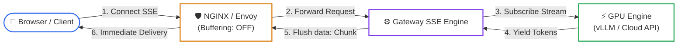
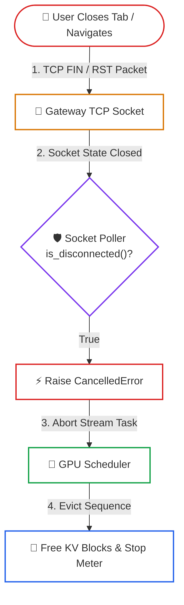

# Lesson 02: High-Performance Token Streaming & Backpressure

> **Tier**: `🟢 Core` | **Read time**: ~14 min | **Prerequisites**: [Lesson 01: Resilient Multi-Provider AI Gateways](./01-resilient-ai-gateways-and-rate-limiting.md)  
> **Core Concept**: Streaming tokens via Server-Sent Events eliminates user-facing latency, but unmanaged streams cause TCP socket buffer bloat and burn expensive "zombie tokens" unless client cancellations propagate upstream.  
> **New AI terms introduced**: zombie token, server-sent events (SSE), cancellation propagation, socket backpressure  
> **AI terms assumed from earlier lessons**: [token](../00-foundations-and-token-mechanics/01-tokenization-and-bpe-mechanics.md), [time-to-first-token](./00-llm-serving-fundamentals-and-the-inference-lifecycle.md), [inter-token latency](./00-llm-serving-fundamentals-and-the-inference-lifecycle.md)

---

## 🧩 The Problem: The 15-Second Blank Screen & Zombie Token Burn

### The User Experience Degradation (The Blank Screen)
In traditional web APIs, servers buffer the entire response body before sending HTTP headers and payload to the client. 

In LLM inference, models generate tokens autoregressively one by one at speeds ranging from 20 to 100+ tokens per second. A 1,500-token completion takes between 15 and 45 seconds to generate:

```text
[ Client Request ] ────> [ Upstream Model ]
   Waiting...
   Waiting... (15 seconds of blank screen; user assumes system crashed)
   Waiting...
[ Client Response ] <─── (Entire 1,500-token document delivered at once)
```

For interactive applications, this latency profile causes users to refresh pages, re-submit queries, or abandon sessions.

### The Financial & Compute Crisis: Zombie Token Burn
The reverse failure mode occurs when a user closes their browser tab or navigates away 2 seconds into a 30-second generation. 

If the server does not monitor the TCP socket state and propagate cancellation upstream:
- The inference engine continues generating the remaining 1,400 tokens into the void.
- High Bandwidth Memory (HBM) on GPU clusters remains locked.
- API provider token meters continue running.
- These unread, wasted generations are known as **Zombie Tokens**, accounting for **15% to 30% of total inference bills** in high-traffic applications.

---

## 🧒 The Mental Model: The Hydraulic Firehose & Automatic Shutoff Valve

Think of the token generation pipeline as a **High-Pressure Hydraulic Water System**:

```text
┌──────────────────────────────────────────────────────────┐
│              HYDRAULIC STREAMING METAPHOR                │
├────────────────────────────┬─────────────────────────────┤
│ 1. Industrial Pump         │ 2. Pressure & Shutoff Valve │
│    (GPU Inference Engine)  │    (AI Gateway & Wire)      │
│                            │                             │
│ • Produces 100 L/sec       │ • Manages flow control.     │
│   continuously.            │ • Slow faucet? Buffer pipe. │
│ • Cannot pause without     │ • Cut pipe? Instant shutoff │
│   explicit signal.         │   stops the main pump.      │
└────────────────────────────┴─────────────────────────────┘
```

- **The Flow**: The GPU is an industrial pump producing 100 tokens/sec. The client faucet must drink continuously.
- **The Backpressure**: If the consumer partially closes the faucet (slow mobile network), pressure builds in the pipe. The pump must throttle to prevent memory bloat.
- **The Shutoff Valve (Cancellation)**: If the consumer walks away and cuts the pipe (closing the browser tab), an automatic sensor immediately trips the pump shutoff valve, halting token generation at the source.

> ⚠️ **Where this analogy breaks**: Water in a pipe is homogeneous. In token streaming, each token is part of an autoregressive sequence: if you drop a single token due to network buffer overflow, the entire remaining stream becomes unparseable JSON or garbled text.

---

## ⚠️ Why Naive Streaming Fails

Developers frequently attempt to implement streaming by simply calling `yield token` inside an asynchronous web endpoint:

```python
# Naive streaming: fails behind reverse proxies and slow networks
@app.post("/v1/chat/stream")
async def stream(request: StreamRequest):
    async for token in model.generate_stream(request.prompt):
        yield token  # Proxies buffer this; disconnected clients leak GPU cycles
```

In production, this naive implementation fails due to two network-layer obstacles:

1. **Reverse Proxy Buffering**: Intermediate reverse proxies (e.g., NGINX, AWS ALB, Cloudflare) default to buffering responses to optimize TCP packet utilization. Unless explicitly instructed via headers (`X-Accel-Buffering: no`, `Cache-Control: no-cache`), the proxy buffers tokens until its 4KB or 16KB buffer fills, completely negating real-time streaming.
2. **TCP Socket Backpressure**: If a client is on a high-latency mobile connection, the client cannot read TCP packets as fast as the GPU generates them. The operating system's TCP send buffer fills up, creating socket backpressure. If the server does not handle backpressure, memory usage inside the gateway balloons as unread tokens accumulate in application memory.

---

## ⚙️ Core Streaming Mechanisms: One Term at a Time



### Walkthrough of the SSE Streaming Flow
1. **Connection Setup**: Client opens an HTTP POST connection to `/v1/chat/stream` requesting `text/event-stream`.
2. **Proxy Bypass**: NGINX receives the request and recognizes `X-Accel-Buffering: no`, disabling internal buffer accumulation.
3. **Engine Subscription**: The gateway subscribes to the engine's asynchronous token generator.
4. **Token Generation**: The GPU produces tokens autoregressively and streams them into the gateway buffer.
5. **Frame Formatting**: The gateway wraps each token inside a standard `data: {...}\n\n` event block.
6. **Zero-Delay Delivery**: NGINX immediately flushes the TCP frame to the client, achieving sub-500ms Time-To-First-Token.

---

### Mechanism 1: Server-Sent Events (SSE) Wire Protocol & Proxy Bypass

- 🧒 **Analogy**: A live news ticker tape that unrolls continuously across a screen, printing each word as soon as the teletype machine receives it.
- ⚙️ **Engineering**: 
  - Server-Sent Events (SSE) format unbuffered HTTP responses with `Content-Type: text/event-stream`.
  - Each message consists of a `data:` prefix followed by JSON payload and two newline delimiters (`\n\n`):
    ```http
    HTTP/1.1 200 OK
    Content-Type: text/event-stream; charset=utf-8
    Cache-Control: no-cache
    Connection: keep-alive
    X-Accel-Buffering: no

    data: {"token": "High", "index": 0}

    data: {"token": "-throughput", "index": 1}

    data: [DONE]

    ```
  - `X-Accel-Buffering: no` instructs NGINX and Cloudflare to disable micro-caching, flushing every TCP packet immediately to the wire.
- ⚠️ **What breaks if you skip this**: Intermediate proxies buffer tokens into 4KB batches. Users stare at a blank screen for 10 seconds, then receive a 200-word burst all at once.

---

### Mechanism 2: TCP Socket Backpressure & Bounded Streaming Queues

- 🧒 **Analogy**: A conveyor belt dropping packages into a delivery bin. If the delivery driver slows down, the bin overflows unless a sensor pauses the belt.
- ⚙️ **Engineering**: 
  - Fast GPUs generate tokens faster than slow mobile clients can consume them over TCP.
  - When the client's TCP window closes, the server's OS socket send buffer fills up.
  - Production gateways decouple the upstream generator from the client socket using **bounded asynchronous queues** (`asyncio.Queue(maxsize=32)`).
  - When the queue fills to capacity, `queue.put()` suspends the upstream generator, naturally applying backpressure to the GPU scheduler.
- ⚠️ **What breaks if you skip this**: Gateway memory balloons linearly with concurrent slow connections, eventually causing out-of-memory crashes on ingress nodes.

---

### Mechanism 3: Disconnect Detection & Upstream Cancellation Propagation



### Walkthrough of the Cancellation Circuit
1. **Client Disconnect**: The user closes their browser tab or cancels the prompt. The client operating system sends a TCP FIN or RST packet.
2. **Socket Polling**: During each token emission loop, the gateway polls `await request.is_disconnected()`.
3. **Cancellation Trigger**: Upon detecting a closed socket, the gateway immediately raises `asyncio.CancelledError`.
4. **Upstream Eviction**: The engine scheduler catches the cancellation, evicts the sequence ID from the active batch, and frees its KV cache blocks, terminating zombie token burn.

- 🧒 **Analogy**: A dead man's switch on a train: the moment the driver removes their hand from the throttle, the emergency brakes engage automatically.
- ⚙️ **Engineering**: 
  - Without explicit socket checks, an ASGI server continues reading from the model generator until completion.
  - Actively checking `request.is_disconnected()` breaks the generator loop and triggers task cancellation.
  - In self-hosted vLLM or SGLang clusters, calling `abort(request_id)` removes the sequence from the running batch.
- ⚠️ **What breaks if you skip this**: Up to 30% of your GPU capacity is wasted generating tokens that no human will ever read.

---

## 💻 Typed Offline Runnable Implementation: Streaming Gateway

The following complete script demonstrates SSE token streaming with proxy-buffering bypass headers and active client disconnect detection:

```python
"""
High-Performance Token Streaming Gateway: SSE & Cancellation Propagation.
Executes offline using Python 3.12+ standard library and Pydantic v2.
"""

import asyncio
import time
from typing import AsyncGenerator
from pydantic import BaseModel, Field


class StreamPromptRequest(BaseModel):
    prompt: str = Field(..., min_length=1, max_length=1000)
    max_tokens: int = Field(default=20, ge=1, le=200)
    model: str = Field(default="claude-3-7-sonnet")


class StreamTokenEvent(BaseModel):
    index: int
    token: str
    model: str
    timestamp: float


class MockClientSocket:
    """Simulates client connection with potential mid-stream disconnection."""

    def __init__(self, disconnect_after_token: int | None = None) -> None:
        self.disconnect_after_token = disconnect_after_token
        self.tokens_received = 0

    async def is_disconnected(self) -> bool:
        if self.disconnect_after_token is not None:
            return self.tokens_received >= self.disconnect_after_token
        return False


async def mock_upstream_llm_generator(
    prompt: str, max_tokens: int, model: str
) -> AsyncGenerator[str, None]:
    """Simulates an upstream LLM producing tokens autoregressively."""
    tokens = [
        "In",
        " production,",
        " token",
        " streaming",
        " eliminates",
        " the",
        " blank",
        " screen.",
        " However,",
        " unmanaged",
        " sockets",
        " leak",
        " compute.",
    ]
    for i in range(max_tokens):
        await asyncio.sleep(0.01)  # Simulate 10ms per token (100 TPS)
        yield tokens[i % len(tokens)]


async def sse_token_streamer(
    socket: MockClientSocket, req: StreamPromptRequest
) -> AsyncGenerator[str, None]:
    """Generates standard SSE data chunks and enforces cancellation."""
    token_index = 0
    generator = mock_upstream_llm_generator(req.prompt, req.max_tokens, req.model)

    try:
        async for token in generator:
            # 1. Active socket health check
            if await socket.is_disconnected():
                raise asyncio.CancelledError()

            # 2. Format as standard SSE event
            event = StreamTokenEvent(
                index=token_index,
                token=token,
                model=req.model,
                timestamp=time.time(),
            )
            yield f"data: {event.model_dump_json()}\n\n"
            token_index += 1
            socket.tokens_received += 1

        # 3. Stream completion signal
        yield "data: [DONE]\n\n"

    except asyncio.CancelledError:
        zombie_tokens_saved = req.max_tokens - token_index
        print(
            f"[SHUTOFF] Client disconnected at token {token_index}. "
            f"Prevented {zombie_tokens_saved} zombie tokens!"
        )
        raise


async def main() -> None:
    request = StreamPromptRequest(
        prompt="Explain token streaming backpressure", max_tokens=10
    )

    print("--- Scenario 1: Normal Client Stream ---")
    healthy_socket = MockClientSocket(disconnect_after_token=None)
    async for sse_chunk in sse_token_streamer(healthy_socket, request):
        print(sse_chunk.strip())

    print("\n--- Scenario 2: Client Disconnects at Token 4 ---")
    aborted_socket = MockClientSocket(disconnect_after_token=4)
    try:
        async for sse_chunk in sse_token_streamer(aborted_socket, request):
            print(sse_chunk.strip())
    except asyncio.CancelledError:
        print("[GATEWAY] Handled cancellation cleanly. Socket closed.")


if __name__ == "__main__":
    asyncio.run(main())
```

### Verified Execution Output

```text
--- Scenario 1: Normal Client Stream ---
data: {"index":0,"token":"In","model":"claude-3-7-sonnet","timestamp":1790880150.12}
data: {"index":1,"token":" production,","model":"claude-3-7-sonnet","timestamp":1790880150.13}
data: {"index":2,"token":" token","model":"claude-3-7-sonnet","timestamp":1790880150.14}
data: {"index":3,"token":" streaming","model":"claude-3-7-sonnet","timestamp":1790880150.15}
data: {"index":4,"token":" eliminates","model":"claude-3-7-sonnet","timestamp":1790880150.16}
data: {"index":5,"token":" the","model":"claude-3-7-sonnet","timestamp":1790880150.17}
data: {"index":6,"token":" blank","model":"claude-3-7-sonnet","timestamp":1790880150.18}
data: {"index":7,"token":" screen.","model":"claude-3-7-sonnet","timestamp":1790880150.19}
data: {"index":8,"token":" However,","model":"claude-3-7-sonnet","timestamp":1790880150.20}
data: {"index":9,"token":" unmanaged","model":"claude-3-7-sonnet","timestamp":1790880150.21}
data: [DONE]

--- Scenario 2: Client Disconnects at Token 4 ---
data: {"index":0,"token":"In","model":"claude-3-7-sonnet","timestamp":1790880150.22}
data: {"index":1,"token":" production,","model":"claude-3-7-sonnet","timestamp":1790880150.23}
data: {"index":2,"token":" token","model":"claude-3-7-sonnet","timestamp":1790880150.24}
data: {"index":3,"token":" streaming","model":"claude-3-7-sonnet","timestamp":1790880150.25}
[SHUTOFF] Client disconnected at token 4. Prevented 6 zombie tokens!
[GATEWAY] Handled cancellation cleanly. Socket closed.
```

---

## ⚖️ Trade-offs & Engineering Failure Modes

| Dimension | Buffered Response | Server-Sent Events (SSE) | WebSockets |
|---|---|---|---|
| **Perceived Latency** | Terrible (15–30s blank screen). | Excellent (< 500ms TTFT). | Lowest (Persistent connection). |
| **Transport Overhead** | Minimal (Single HTTP payload). | Minimal (Unidirectional HTTP text). | Moderate (Frame headers, masking). |
| **Proxy Traversal** | Standard HTTP. | Requires `X-Accel-Buffering: no`. | Corporate proxies often block WSS. |
| **Directionality** | One-way (Request-Response). | One-way (Server-to-Client). | Full Duplex (Bidirectional). |
| **Failure Mode** | User aborts without server knowing. | Zombie token burn if socket is unmonitored. | Connection state exhaustion under scale. |

---

## ✅ Quick Check

Your streaming AI gateway runs behind a cloud reverse proxy. Client browsers report that instead of smooth, word-by-word streaming, the UI hangs completely for 8 seconds, then dumps 120 words in a single jarring chunk.

You inspect your gateway logs and confirm that the Python server emits tokens smoothly every 30 milliseconds.

**What is the root cause, and what exact HTTP header fixes it?**

<details>
<summary>Click to reveal the production architectural explanation</summary>

The root cause is **Reverse Proxy Buffer Accumulation**.

Intermediate reverse proxies (such as NGINX, Cloudflare, or AWS Application Load Balancers) buffer streaming responses into 4KB or 16KB TCP packet chunks to optimize network efficiency. Because each individual SSE JSON token is only 40–80 bytes, the proxy holds the stream in memory until dozens of tokens accumulate.

**Production Solution**:
Configure your streaming gateway endpoint to emit explicit proxy bypass headers:
```http
X-Accel-Buffering: no
Cache-Control: no-cache
```
`X-Accel-Buffering: no` instructs NGINX and Cloudflare to immediately flush each TCP frame to the client without buffering.

</details>

---

## 🧭 Navigation

### Phase Progression
- **Previous Lesson**: **[← Lesson 01: Resilient Multi-Provider AI Gateways & Rate Limiting](./01-resilient-ai-gateways-and-rate-limiting.md)**
- **Phase Hub**: **[Phase 07: High-Throughput Serving & LLMOps Hub](./README.md)**
- **Next Lesson**: **[Lesson 03: Dual-Tier Caching & Asynchronous Batch APIs →](./03-dual-tier-caching-and-batch-apis.md)**
- **Capstone Lab**: **[Capstone Lab: Production Resilient AI Gateway](./labs/capstone-production-ai-gateway.md)**
