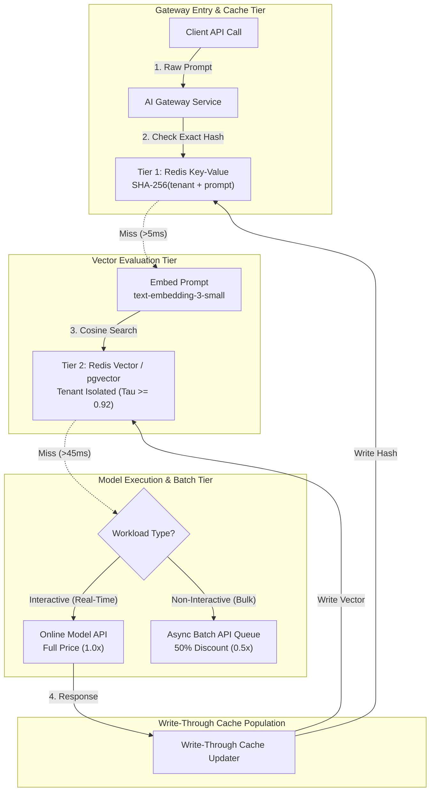

# Dual-Tier Caching & Asynchronous Batch APIs: Sub-5ms Exact Retrieval, Vector Similarity & 50% Off Batch Economics

> **[Tier: 🟡 Engineering Depth]**  
> **Architecting cost-governance infrastructure combining sub-5ms exact SHA-256 caching, semantic vector similarity, tenant isolation, and 50% discount asynchronous Batch API processing pipelines.**

---

## 🎯 What You Will Learn

- How to architect a dual-tier cache combining exact string hashing (Tier 1) with semantic vector embeddings (Tier 2).
- How to calibrate cosine similarity thresholds to balance cache hit rate against semantic false positives.
- How to normalize cache keys and enforce multi-tenant isolation to prevent sensitive data leaks.
- How to exploit the 50% economic discount of asynchronous Batch APIs for high-volume, non-interactive workloads.

---

## 1. The Problem: The Cost of Redundant Inference

In enterprise customer support, documentation lookup, internal knowledge search, and code review assistants, a substantial portion of user queries are either identical or semantically equivalent:

- User 1: *"How do I configure SSO in Okta?"*
- User 2: *"How do I configure single sign-on in Okta?"*
- User 3: *"How do I configure SSO in Okta?"* (identical repeat)

Without intelligent caching:
- Every query executes an end-to-end forward pass through a large foundation model.
- Latencies range between 800ms and 5,000ms.
- Provider token costs accumulate for identical answers.
- Upstream rate limits are consumed unnecessarily.

Furthermore, engineering teams frequently execute large non-real-time jobs (e.g. re-evaluating 50,000 synthetic test cases, backfilling metadata on 100,000 catalog items) using synchronous, real-time API calls. This overpays by **100%** compared to provider batch pricing and exposes the pipeline to mid-run connection drops.

---

## 2. The Core Idea & Why Naive Fails

### Why Naive Caching Fails
Developers often begin with one of two naive caching strategies:

1. **Exact Hash Caching Only**: The application hashes the prompt using SHA-256 (`SHA-256(prompt)`) and stores the response in Redis.
   - *Failure*: It has zero semantic tolerance. Adding a trailing space, an extra period, or changing *"What is CAP theorem?"* to *"Explain CAP theorem"* causes a complete cache miss (0% semantic hit rate).
2. **Naive Semantic Caching Only**: The application embeds every query using a vector model and returns the nearest neighbor if cosine similarity > 0.80.
   - *Failure*: At low thresholds (tau < 0.90), vector similarity produces catastrophic false positives. *"How do I delete a user?"* and *"How do I create a user?"* have high semantic proximity in vector space, resulting in dangerous hallucinated responses. Moreover, generating a vector embedding takes 25–60ms, which is an unnecessary latency tax on queries that could have been resolved via exact hash in < 2ms.

### The Engineering Solution: Dual-Tier Architecture & Batch Offloading
1. **Tier 1 (Exact Hash Match)**: Fast O(1) string normalization and SHA-256 lookup in Redis (< 5ms).
2. **Tier 2 (Semantic Vector Match)**: If Tier 1 misses, embed the query and evaluate vector cosine distance in Redis Vector or pgvector with a strict threshold (tau ≥ 0.92) and tenant metadata filtering (< 45ms).
3. **Asynchronous Batch Offloading**: Divert all non-interactive bulk workloads to provider Batch APIs (OpenAI, Anthropic, Gemini), achieving a **50% discount** on token pricing with 24-hour SLA completion guarantees.

---

## 3. Mental Model: The Two-Tier Vault & The Cargo Freight Carrier

```text
[ Incoming Request ]
        │
        ▼
┌────────────────────────────────────────────────────────────┐
│                    DUAL-TIER CACHE VAULT                   │
│                                                            │
│  [ Tier 1: Exact Hash Index (Redis) ]                      │
│  Matches exact normalized string? ──YES──> Return in 2ms   │
│                   │ NO                                     │
│                   ▼                                        │
│  [ Tier 2: Semantic Vector Index (Redis Vector/pgvector) ] │
│  Cosine similarity >= 0.92? ───────YES──> Return in 40ms  │
│                   │ NO                                     │
│                   ▼                                        │
│  [ Cache Miss: Dispatch to Inference Pipeline ]           │
└────────────────────────────────────────────────────────────┘
        │                                 │
        ▼ (Interactive)                   ▼ (Non-Interactive Bulk)
[ Real-Time Inference: 1.0x Cost ]    [ Asynchronous Batch: 0.5x Cost ]
```

- **Tier 1 (The Speed Pass)**: An exact barcode scan. If you present the exact ticket, you walk through the gate instantly.
- **Tier 2 (The Biometric Match)**: If you forgot your ticket, a facial recognition scanner checks your identity. It takes slightly longer, and requires a high confidence score (≥ 92%) to unlock the gate.
- **Batch Processing (Air Cargo Freight)**: If cargo does not need to arrive in 5 seconds, it flies on the overnight freight plane at half price.

---

## 4. How It Works: Mechanics & Protocols

### A. Dual-Tier Cache Execution Flow

```text
Step 1: Normalization
Raw Input: "  Explain the CAP   Theorem? \n"
Normalized: "explain the cap theorem" (lowercase, trimmed whitespace, stripped trailing punctuation).

Step 2: Tier 1 Exact Hash Lookup
Compute Key: "cache:exact:" + tenant_id + ":" + model + ":" + sha256(normalized_text)
Redis GET Key
  - If FOUND: Return cached response immediately. (Cache Hit Type: EXACT, Latency: ~2ms).
  - If MISS: Proceed to Step 3.

Step 3: Tier 2 Semantic Vector Search
Generate dense embedding of normalized prompt using text-embedding-3-small (1536 dims).
Execute KNN vector query against Redis Vector or pgvector:
  Filter: tenant_id == current_tenant AND model == current_model
  Distance: Cosine Similarity >= 0.92
  - If FOUND: Return cached completion. (Cache Hit Type: SEMANTIC, Latency: ~40ms).
  - If MISS: Proceed to Step 4.

Step 4: Upstream Inference & Dual-Tier Write-Through
Dispatch prompt to upstream model.
Receive generated completion.
Concurrently write response to:
  1. Redis string key with 24h TTL.
  2. Redis vector index with embedding vector and tenant metadata.
Return completion to client.
```

---

### B. Calibrating the Semantic Cosine Threshold (tau)

The cosine similarity threshold (tau) controls the boundary between cache efficiency and answer correctness:

```text
Cosine Similarity Threshold (Tau)
0.80 ──────────── 0.85 ──────────── 0.90 ──────────── 0.95 ──────────── 1.00
[ High False Positives ]           [ Balanced ]        [ Ultra-Conservative ]
Dangerous semantic bleed           Target: Tau = 0.92  Zero false positives,
("delete user" == "create user")                       low semantic hit rate
```

- **tau < 0.88 (Danger Zone)**: Queries with opposing semantics (such as affirmative vs. negative statements) frequently match, corrupting downstream business logic.
- **0.91 ≤ tau ≤ 0.94 (Production Sweet Spot)**: Captures phrasing variations, synonyms, and grammatical rewordings while rejecting distinct semantic queries.
- **tau > 0.96**: Collapses toward exact matching, diminishing the utility of Tier 2 vector lookups.

---

### C. Asynchronous Batch APIs: The 50% Off Economics
Hyperscaler model providers (OpenAI, Anthropic, Google Cloud) run data centers with cyclical demand. During off-peak night cycles, idle GPU compute is auctioned via **Asynchronous Batch APIs** at a **50% discount**:

```text
1. Prepare JSONL Dataset
   {"custom_id": "req-001", "method": "POST", "url": "/v1/chat/completions", "body": {...}}
   {"custom_id": "req-002", "method": "POST", "url": "/v1/chat/completions", "body": {...}}

2. Upload Batch File (e.g. POST /v1/files)
   Returns file_id = "file-abc123xyz"

3. Create Batch Job (e.g. POST /v1/batches)
   Specifies completion_window = "24h", endpoint = "/v1/chat/completions"

4. Polling or Webhook Notification
   Engine processes job on idle GPU capacity. Status transitions:
   validating ➔ in_progress ➔ completed.

5. Download Output JSONL
   Retrieve completed results file with identical custom_id mappings.
```

---

## 5. Concrete Scenario & Code Implementation

The following production code implements dual-tier caching (Exact SHA-256 + Vector Similarity) in Python 3.12+ with Pydantic v2 schemas:

```python
import hashlib
import time
import math
from typing import Optional, Tuple, List, Dict
from pydantic import BaseModel, Field

class CacheEntry(BaseModel):
    prompt: str
    response_content: str
    model: str
    tenant_id: str
    embedding: List[float]
    created_at: float

class CacheLookupResult(BaseModel):
    hit: bool
    hit_type: str  # "NONE", "EXACT", "SEMANTIC"
    response_content: Optional[str] = None
    similarity_score: float = 0.0
    latency_ms: float

def normalize_prompt(raw_prompt: str) -> str:
    """Normalize input string to eliminate trivial formatting misses."""
    cleaned = raw_prompt.strip().lower()
    # Strip common trailing punctuation
    return cleaned.rstrip(".?!:;")

def compute_exact_hash(tenant_id: str, model: str, normalized_prompt: str) -> str:
    payload = f"{tenant_id}:{model}:{normalized_prompt}".encode("utf-8")
    return hashlib.sha256(payload).hexdigest()

def cosine_similarity(v1: List[float], v2: List[float]) -> float:
    dot_product = sum(a * b for a, b in zip(v1, v2))
    norm_a = math.sqrt(sum(a * a for a in v1))
    norm_b = math.sqrt(sum(b * b for b in v2))
    if norm_a == 0.0 or norm_b == 0.0:
        return 0.0
    return dot_product / (norm_a * norm_b)

class DualTierCacheManager:
    """
    Demonstration of in-memory dual-tier cache.
    In production, exact_store is Redis Strings and vector_store is Redis Vector / pgvector.
    """
    def __init__(self, semantic_threshold: float = 0.92):
        self.semantic_threshold = semantic_threshold
        # Tier 1: exact hash map
        self.exact_store: Dict[str, str] = {}
        # Tier 2: vector index
        self.vector_store: List[CacheEntry] = []

    async def get(
        self, 
        tenant_id: str, 
        model: str, 
        raw_prompt: str, 
        prompt_embedding_fn
    ) -> CacheLookupResult:
        start_time = time.monotonic()
        normalized = normalize_prompt(raw_prompt)
        exact_key = compute_exact_hash(tenant_id, model, normalized)

        # 1. Tier 1: Check Exact Hash Match
        if exact_key in self.exact_store:
            latency = (time.monotonic() - start_time) * 1000.0
            return CacheLookupResult(
                hit=True,
                hit_type="EXACT",
                response_content=self.exact_store[exact_key],
                similarity_score=1.0,
                latency_ms=round(latency, 2)
            )

        # 2. Tier 2: Check Semantic Vector Match
        query_vector = await prompt_embedding_fn(normalized)
        best_match: Optional[CacheEntry] = None
        highest_similarity = 0.0

        for entry in self.vector_store:
            # Enforce strict multi-tenant and model isolation
            if entry.tenant_id == tenant_id and entry.model == model:
                sim = cosine_similarity(query_vector, entry.embedding)
                if sim > highest_similarity:
                    highest_similarity = sim
                    best_match = entry

        latency = (time.monotonic() - start_time) * 1000.0

        if best_match and highest_similarity >= self.semantic_threshold:
            return CacheLookupResult(
                hit=True,
                hit_type="SEMANTIC",
                response_content=best_match.response_content,
                similarity_score=round(highest_similarity, 4),
                latency_ms=round(latency, 2)
            )

        return CacheLookupResult(
            hit=False,
            hit_type="NONE",
            response_content=None,
            similarity_score=round(highest_similarity, 4),
            latency_ms=round(latency, 2)
        )

    async def put(
        self, 
        tenant_id: str, 
        model: str, 
        raw_prompt: str, 
        response_content: str, 
        embedding: List[float]
    ) -> None:
        normalized = normalize_prompt(raw_prompt)
        exact_key = compute_exact_hash(tenant_id, model, normalized)

        # Write to Tier 1
        self.exact_store[exact_key] = response_content

        # Write to Tier 2
        entry = CacheEntry(
            prompt=normalized,
            response_content=response_content,
            model=model,
            tenant_id=tenant_id,
            embedding=embedding,
            created_at=time.time()
        )
        self.vector_store.append(entry)
```

---

## 6. Architecture & Telemetry View



### Visual Walkthrough
1. **Tier 1 Probe**: The gateway normalizes the incoming prompt string, generates a SHA-256 hash incorporating the `tenant_id` and `model`, and queries Redis. If found, the cached response returns to the client in under 5ms.
2. **Tier 2 Vector Probe**: On an exact cache miss, the gateway embeds the prompt using a fast vector model and queries the vector index. The query filters by `tenant_id` and evaluates cosine similarity against past queries. If similarity ≥ 0.92, the response returns in under 45ms with an attribute `gateway.cache_hit_type: "semantic"`.
3. **Execution Fork**: On a full cache miss, interactive requests route to online model endpoints. Bulk jobs are packed into JSONL files and dispatched to provider Batch APIs for 50% cost savings.
4. **Write-Through Invalidation**: Online completions are written concurrently to both Tier 1 and Tier 2 storage with configured Time-To-Live (TTL) expiration policies.

---

## 7. Common Failure Modes & Production Anti-Patterns

| Anti-Pattern | Root Cause | Engineering Solution |
|---|---|---|
| **Cross-Tenant Data Leakage** | Caching entries globally without prefixing keys with `tenant_id`. | Strictly include `tenant_id` in the SHA-256 hash and apply mandatory metadata filtering (`tenant_id == req.tenant_id`) in vector indexes. |
| **Semantic Negation Bleed** | Vector search returning identical results for affirmative and negative queries (e.g. *"Should I invest in X?"* vs *"Why should I NOT invest in X?"*). | Calibrate tau ≥ 0.92; run a fast rule-based negative word detector to bypass Tier 2 on negated questions. |
| **Silent Knowledge Drift** | Caching queries whose underlying facts change (e.g. *"What is the status of Ticket #402?"*). | Never cache dynamic entities; enforce short TTLs (1 hour) or tag entries with invalidation dependencies. |
| **Synchronous Bulk Processing** | Running 100,000 document extractions over real-time API endpoints, blowing budgets and dropping connections. | Refactor non-real-time jobs into asynchronous Batch API workflows; save 50% on token expenditure. |

---

## 8. Production View & Evaluation: Cache Hit Rate & Cost Savings

The business impact of the caching and batch tier is evaluated via three primary metrics:

1. **Composite Cache Hit Rate (R_cache)**:
   - Formulated as:
   ```text
   R_cache = (Hits_Exact + Hits_Semantic) / Total_Requests
   ```
   - In production customer support and repetitive copilot tasks, target R_cache ≥ 25%.
2. **Effective Cost per Query (ECPQ)**:
   - Formulated as:
   ```text
   ECPQ = (Total_Cloud_Inference_Cost + Cache_Infrastructure_Cost) / Total_Queries
   ```
   - Successful dual-tier caching reduces ECPQ by 20–35%.
3. **Batch Offload Ratio (B_ratio)**:
   - Formulated as:
   ```text
   B_ratio = Batch_Tokens / (Batch_Tokens + Realtime_Tokens)
   ```
   - High-performing engineering teams maintain B_ratio ≥ 40%, ensuring that offline evals, synthetic data generation, and catalog backfills run at half price.

---

## 9. When Should You Use It? (Trade-off Matrix)

| Strategy | Latency | Infrastructure Cost | Risk Profile | Best Suited For |
|---|---|---|---|---|
| **No Caching** | High (1–5s) | High (100% token spend) | Zero risk of stale data | Purely creative writing, dynamic real-time market data. |
| **Exact Hash (Tier 1 Only)** | Ultra-Low (< 5ms) | Negligible (Standard Redis) | Zero semantic false positives | Identical repeated prompts, automated health-checks, high-concurrency bots. |
| **Dual-Tier Cache (Full)** | Low (< 45ms) | Low (Redis Vector / pgvector) | Low (if tau ≥ 0.92) | **Enterprise documentation search, customer support, standard FAQ systems.** |
| **Async Batch API** | High (1–24 hours) | **Lowest (50% Token Discount)** | Zero real-time utility | **Model evaluation suites, synthetic test curation, embedding backfills.** |

---

## 💡 10. Senior Interview Perspective

### Architectural Scenario: Cost Governance in Enterprise Copilots
**Interviewer**: *"Our enterprise coding copilot incurs 120,000 USD per month in LLM API fees. Analysis reveals that 30% of user queries ask similar syntax questions ('How to parse JSON in Python', 'How to read a CSV in Go'), while our nightly evaluation suite of 100,000 tests runs over the same real-time API endpoints. How do you cut these costs by at least 40% without degrading developer experience?"*

**Architectural Defense**:
> *"We achieve this by deploying a two-pronged cost governance architecture:*
> 1. *We deploy a Dual-Tier Cache in our AI Gateway: Tier 1 executes sub-5ms SHA-256 exact matching on normalized prompts. Tier 2 executes semantic similarity search using Redis Vector with a strict threshold (tau = 0.92). Because 30% of user queries are semantically repetitive, caching absorbs ~25% of all interactive traffic, eliminating ~30,000 USD/month with sub-50ms response times.*
> 2. *We migrate the 100,000 nightly evaluation tests from real-time endpoints to the provider Asynchronous Batch API. Because batch endpoints operate at a flat 50% discount on input and output tokens, our nightly eval expenditure drops immediately from 40,000 USD/month to 20,000 USD/month.*
> 3. *Combined, the dual-tier cache (30,000 USD savings) and the batch migration (20,000 USD savings) yield a total monthly reduction of 50,000 USD (~42% cost reduction), while reducing p95 latency for interactive developers."*

---

## 11. Key Takeaways & Verified Resources

- **Dual-tier caching combines speed and semantic reach**: Sub-5ms exact hashing catches identical queries; vector search catches semantic variants.
- **Never set vector similarity thresholds below 0.90**: Low thresholds cause dangerous semantic false positives that corrupt application truth.
- **Batch APIs deliver an automatic 50% discount**: Never run non-interactive bulk evaluation or backfill workloads over real-time endpoints.

### Authoritative Primary Sources
- **OpenAI Batch API Guide**: [platform.openai.com/docs/guides/batch](https://platform.openai.com/docs/guides/batch)
- **Anthropic Message Batches API**: [docs.anthropic.com/en/docs/build-with-claude/message-batches](https://docs.anthropic.com)
- **Redis Vector Search Documentation**: [redis.io/docs/latest/develop/interact/search-and-query/query/vector-search](https://redis.io)
- **pgvector: Open-source vector similarity search for Postgres**: [github.com/pgvector/pgvector](https://github.com/pgvector/pgvector)

---

## 🧭 Navigation

- **[← Previous Lesson: High-Performance Token Streaming & Backpressure](./02-high-performance-token-streaming-and-backpressure.md)**
- **[Phase 07 Hub: Orientation & Navigation](./README.md)**
- **[Next Lesson: Continuous Batching, PagedAttention & RadixAttention →](./04-vllm-continuous-batching-and-radixattention.md)**
- **[Hands-On Lab: Resilient Multi-Provider AI Gateway](./labs/capstone-production-ai-gateway.md)**
