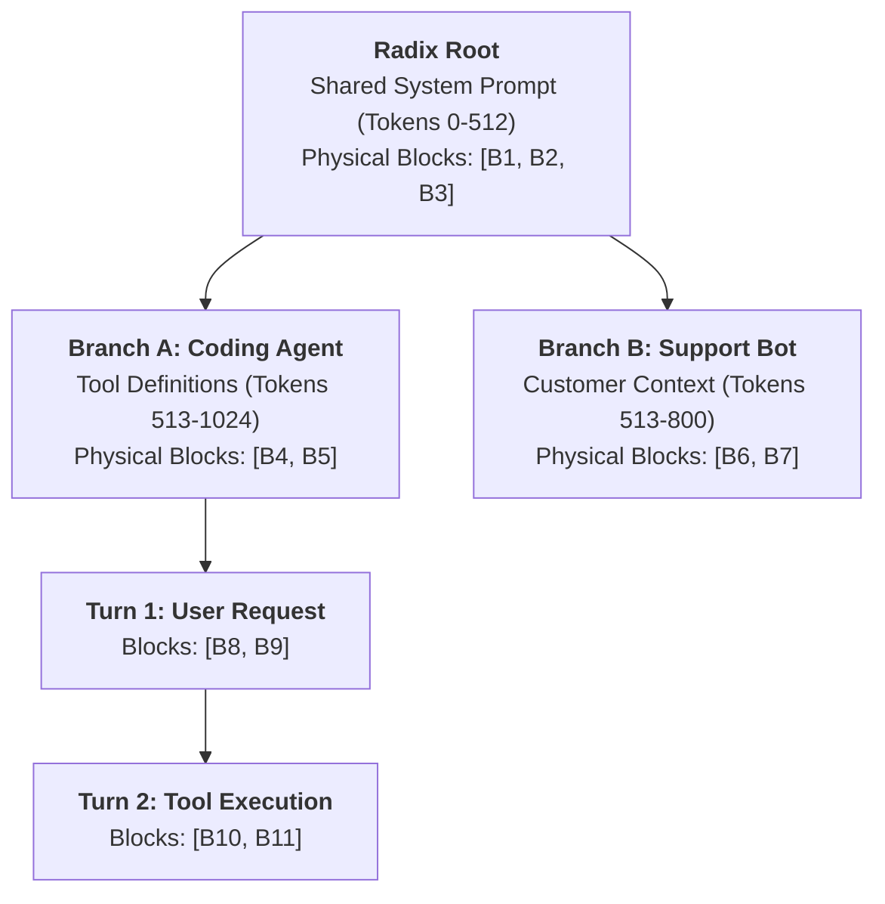
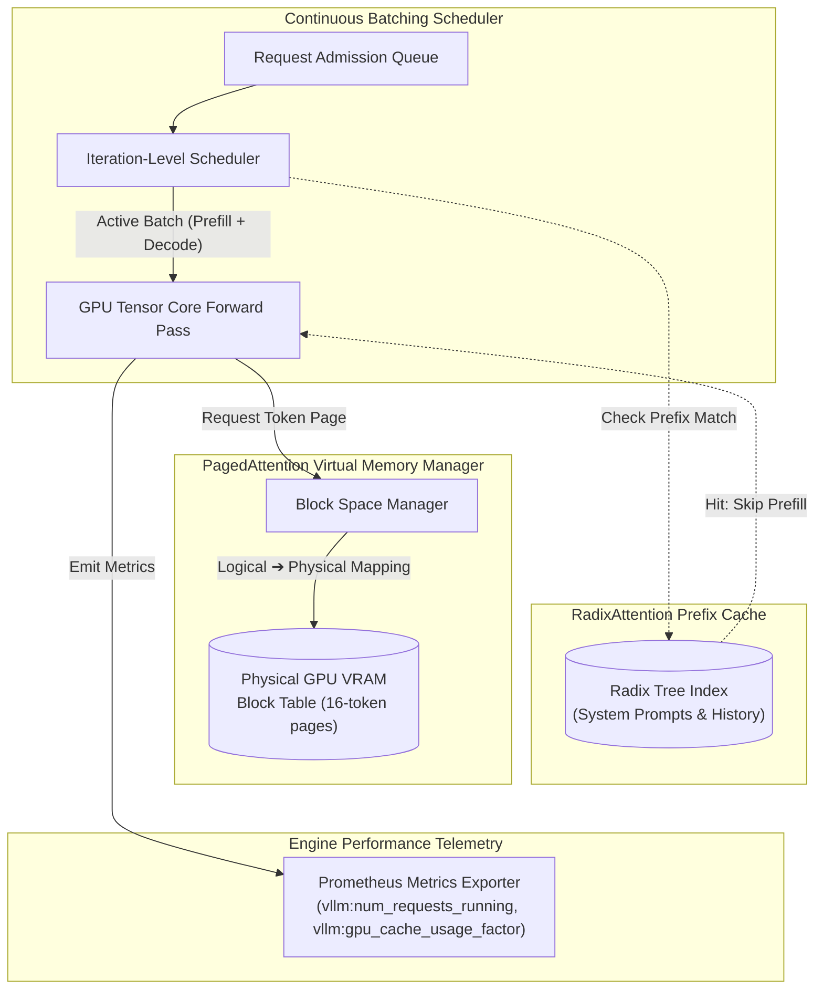

# Continuous Batching, PagedAttention & RadixAttention: Breaking the Memory Bandwidth Wall

> **[Tier: ⚫ Deep Dive]**  
> **Mastering high-throughput inference engine internals: iteration-level continuous batching, virtual memory paging for KV cache tensors (PagedAttention), and trie-based prefix cache reuse (RadixAttention).**

---

## 🎯 What You Will Learn

- Why autoregressive decoding is strictly memory-bandwidth bound and how static batching starves GPU compute.
- How PagedAttention adapts OS virtual memory paging to eliminate internal and external VRAM fragmentation.
- How RadixAttention organizes KV cache blocks into a radix tree to automatically share prompt prefixes across parallel requests.
- How to configure production self-hosted clusters (vLLM and SGLang) for maximum throughput.

---

## 1. The Problem: The Memory Bandwidth Wall

To scale self-hosted inference clusters, software engineers must understand the physical constraints of GPU silicon:

```text
Phase 1: Prefill Phase (Prompt Ingestion)
- All prompt tokens are processed simultaneously in parallel.
- Compute-bound: High arithmetic intensity (matrix-matrix multiplication, GEMM).
- Tensor Cores achieve near 100% compute utilization.

Phase 2: Decode Phase (Token Generation)
- Tokens are produced autoregressively one by one.
- Memory-bandwidth bound: Arithmetic intensity is ~1 FLOP per byte transferred.
- To produce a single token, all 140 GB of model weights (for a 70B FP16 model) 
  must be read from High Bandwidth Memory (HBM) into SRAM.
```

Because decoding is bound by memory bus speed, the only way to achieve high GPU efficiency during decoding is **batching**: loading the weights once from HBM and applying them across multiple parallel requests simultaneously.

---

## 2. The Core Idea & Why Naive Fails

### Why Naive Static Batching Fails
In traditional machine learning serving (e.g. computer vision or tabular inference), systems use **Static Request-Level Batching**:
1. Wait for N requests to arrive.
2. Pad all requests to the length of the longest request in the batch.
3. Execute inference until all requests finish.

In LLMs, requests have wildly divergent completion lengths:
- Request 1: Needs 15 tokens.
- Request 2: Needs 1,200 tokens.

Under static batching, Request 1 finishes in 0.3 seconds. However, its GPU slot remains locked and idle for the next 25 seconds while Request 2 completes. Tensor cores sit starved, and system throughput drops by **70% to 80%**.

### Why Contiguous VRAM Allocation Fails
In naive runtimes (such as early Hugging Face Transformers), each request pre-allocates a contiguous block of GPU VRAM for its Key-Value (KV) cache based on `max_tokens`:
- **External Fragmentation**: Virtual memory allocators cannot find contiguous free memory segments for new requests, even when total free VRAM is abundant.
- **Internal Fragmentation**: If a request pre-allocates 2,048 tokens but finishes after 50 tokens, the remaining 1,998 allocated token slots sit empty.
- **Result**: Up to **80% of GPU memory is wasted on empty, reserved cache padding**, limiting concurrent batch sizes to tiny fractions of hardware capacity.

---

## 3. Mental Model: Operating System Virtual Memory & The Trie Prefix Tree

```text
Traditional Naive Runtime:
[ Request A: 2048 Contiguous Reserved Slots (Only 50 used) ──────> 97% Wasted ]
[ Request B: Cannot allocate (No contiguous 2048-slot chunk available) ➔ OOM! ]

PagedAttention (vLLM):
[ Logical Blocks (Tokens 0-15, 16-31) ]
                  │
                  ▼ (Page Table)
[ Physical GPU VRAM: Non-contiguous 16-token pages allocated on-demand ]
[ Page 01 ] [ Page 02 ] [ Page 03 ] [ Page 04 ] ──> Zero Waste, 100% Memory Density

RadixAttention (SGLang):
                 [ Root: System Prompt ]
                       /        \
          [ User A Query ]    [ User B Query ]
                 │
          [ Tool Call ]
                 │
          [ Tool Output ]
Prefix tokens shared across requests in a Trie; zero redundant prefill!
```

- **PagedAttention (OS Page Tables)**: Treats GPU VRAM exactly like operating system virtual memory. KV caches are split into 16-token fixed-size pages. Non-contiguous physical frames are allocated only as tokens are generated.
- **RadixAttention (Prefix Trie)**: Treats prompt history as a radix tree. If multiple requests share the same system prompt, few-shot examples, or prior conversation turns, they share the physical KV blocks at the root of the tree without redundant computation.

---

## 4. How It Works: Step-by-Step Mechanics

### A. Continuous (Iteration-Level) Batching
Continuous batching (pioneered by Orca and standardized by vLLM) operates at the **iteration level** rather than the request level:

```text
Iteration 1: Batch contains [Req A (token 14), Req B (token 42), Req C (token 2)]
-> Model generates 1 token for each request.
-> Req A emits [EOS] (End of Sequence).
-> Req A is immediately evicted from the batch; results are returned to client.

Iteration 2: Scheduler immediately admits newly arrived Req D (Prefill).
-> Batch contains [Req D (prefill), Req B (token 43), Req C (token 3)].
-> Tensor cores never sit idle; GPU memory is continuously saturated.
```

---

### B. PagedAttention Mechanics
PagedAttention organizes memory into logical and physical block structures:

1. **Fixed Page Size**: Memory is divided into blocks containing B tokens (default B = 16).
2. **Dynamic On-Demand Allocation**: As a sequence generates tokens 0 to 15, it occupies Physical Block #42. When token 16 is generated, the engine allocates Physical Block #89 and updates the request's logical page table.
3. **Copy-on-Write Branching**: In multi-candidate sampling (e.g. beam search or speculative branches), multiple sequences point to identical physical parent pages. Physical duplication only occurs when a branch generates divergent tokens.

---

### C. RadixAttention (SGLang Trie Prefix Caching)
RadixAttention maintains an active radix tree over all allocated KV cache blocks in GPU memory:



#### Diagram Walkthrough
1. **Root Matching**: When a new request arrives, SGLang tokenizes the prompt and traverses the radix tree from the root. It matches the system prompt against existing blocks `[B1, B2, B3]`.
2. **Prefill Bypass**: The engine skips prefill computation for tokens 0–512 entirely. The existing KV activations in blocks `[B1, B2, B3]` are referenced directly.
3. **Branch Insertion**: The new turn is appended as a child leaf node in the tree.
4. **LRU Tree Eviction**: When GPU VRAM reaches capacity, the engine does not flush memory. It evicts leaf nodes using Least Recently Used (LRU) prioritization, keeping high-frequency root nodes warm in memory.

---

## 5. Concrete Scenario & Code Implementation

The following Python 3.12+ code provides an educational simulation of a **Radix Prefix Cache Indexer**, illustrating how tokens are indexed into trie nodes and how shared blocks are reused across requests:

```python
import time
from typing import Dict, List, Optional, Tuple
from pydantic import BaseModel, Field

class KVBlock(BaseModel):
    block_id: int
    tokens: List[int]
    device: str = "cuda:0"

class RadixNode:
    """Represents a node in the RadixAttention trie."""
    def __init__(self, token_chunk: List[int], physical_blocks: List[KVBlock]):
        self.token_chunk = token_chunk
        self.physical_blocks = physical_blocks
        self.children: Dict[int, "RadixNode"] = {}  # Indexed by first token of next chunk
        self.last_accessed = time.monotonic()

class RadixAttentionTrie:
    """
    Demonstrates prefix matching, KV block reuse, and prefill skipping.
    """
    def __init__(self, block_size: int = 16):
        self.block_size = block_size
        self.root = RadixNode(token_chunk=[], physical_blocks=[])
        self.total_blocks_allocated = 0

    def match_prefix(self, prompt_tokens: List[int]) -> Tuple[List[KVBlock], int]:
        """
        Traverses the trie to find the longest matching prefix for the prompt.
        Returns the matched physical KV blocks and the count of matched tokens.
        """
        curr = self.root
        matched_blocks = []
        tokens_matched = 0
        idx = 0

        while idx < len(prompt_tokens):
            first_token = prompt_tokens[idx]
            if first_token not in curr.children:
                break

            child = curr.children[first_token]
            chunk_len = len(child.token_chunk)

            # Check if entire child chunk matches prompt slice
            if prompt_tokens[idx:idx + chunk_len] == child.token_chunk:
                matched_blocks.extend(child.physical_blocks)
                tokens_matched += chunk_len
                idx += chunk_len
                child.last_accessed = time.monotonic()
                curr = child
            else:
                break

        return matched_blocks, tokens_matched

    def insert(self, prompt_tokens: List[int]) -> List[KVBlock]:
        """
        Inserts new tokens into the trie, allocating new physical KV blocks
        only for the un-cached suffix.
        """
        matched_blocks, matched_count = self.match_prefix(prompt_tokens)
        remaining_tokens = prompt_tokens[matched_count:]

        if not remaining_tokens:
            return matched_blocks

        # Allocate new blocks for remaining tokens in chunks of block_size
        new_blocks = []
        for i in range(0, len(remaining_tokens), self.block_size):
            chunk = remaining_tokens[i:i + self.block_size]
            self.total_blocks_allocated += 1
            new_blocks.append(KVBlock(block_id=self.total_blocks_allocated, tokens=chunk))

        # Insert new branch from root (simplified single-level insertion)
        first_token = remaining_tokens[0]
        self.root.children[first_token] = RadixNode(
            token_chunk=remaining_tokens, 
            physical_blocks=new_blocks
        )

        return matched_blocks + new_blocks
```

---

## 6. Engineering Solutions: Production Cluster Configuration

When launching self-hosted inference clusters using vLLM or SGLang on NVIDIA H100 / A100 GPU nodes, optimal throughput requires tuning memory and scheduling parameters:

```bash
# Launching vLLM continuous batching cluster on an 8x H100 node
vllm serve meta-llama/Llama-3.3-70B-Instruct \
    --tensor-parallel-size 8 \
    --gpu-memory-utilization 0.92 \
    --max-num-seqs 256 \
    --block-size 16 \
    --enable-chunked-prefill \
    --max-num-batched-tokens 8192 \
    --enable-prefix-caching
```

### Parameter Rationale:
- `--tensor-parallel-size 8`: Shards model weights across all 8 GPUs via NVLink, ensuring the 70B parameter model fits easily in memory with massive residual headroom for KV blocks.
- `--gpu-memory-utilization 0.92`: Dedicates 92% of total GPU VRAM to weights and KV cache pages (leaving 8% for temporary activation workspace buffers).
- `--enable-chunked-prefill`: Splits massive prefill requests (e.g. 32K context) into smaller chunks (8,192 tokens), preventing huge prefill prompts from stalling active decode iterations.
- `--enable-prefix-caching`: Activates automatic prefix caching (similar to RadixAttention), reusing KV blocks across identical prompt prefixes.

---

## 7. Architecture & Telemetry View



### Visual Walkthrough
1. **Scheduler Admission**: Requests arrive in the admission queue. The continuous batching scheduler evaluates available GPU VRAM pages and admits new sequences at every single token iteration.
2. **Page Table Allocation**: During token generation, the Block Manager assigns non-contiguous 16-token physical blocks to the sequence, eliminating external memory fragmentation.
3. **Prefix Lookup**: Before executing prefill, the engine consults the Radix Tree. If prompt tokens match an existing branch, the engine binds the existing physical KV blocks, completely bypassing prefill computation.
4. **Telemetry Export**: The engine exports real-time metrics including `vllm:gpu_cache_usage_factor` (percentage of VRAM KV pages in use) and `vllm:avg_generation_throughput_tok_per_s`.

---

## 8. Common Failure Modes & Production Anti-Patterns

| Anti-Pattern | Root Cause | Engineering Solution |
|---|---|---|
| **KV Cache VRAM Exhaustion (OOM)** | Allocating too many concurrent sequences without bounding KV memory limits. | Enforce `--gpu-memory-utilization 0.90` and configure the scheduler to swap excess blocks to CPU RAM or preempt low-priority sequences. |
| **Prefix Cache Thrashing** | High concurrency with totally random prompts forces the radix tree to constantly evict and re-allocate blocks. | Group similar tenant workloads or pin critical system prompt prefixes so they are never evicted from the root of the trie. |
| **Prefill Starvation (Head-of-Line Blocking)** | A single 64K-token document prefill consumes all GPU compute, causing ongoing decode streams to stutter. | Enable **Chunked Prefill** (`--enable-chunked-prefill`); interleave prompt prefill slices with active token decode steps. |
| **Suboptimal Block Size** | Setting block size too small (B = 4) inflates page table overhead; setting too large (B = 64) causes internal fragmentation. | Use standard B = 16 or B = 32 tokens per block, which balances page table lookup speed with minimal memory waste. |

---

## 9. Production View & Evaluation: Serving Metrics

Engine performance is measured using the following standard Prometheus metrics:

1. **GPU Cache Usage Factor (`gpu_cache_usage_factor`)**:
   - The percentage of GPU KV cache blocks currently occupied.
   - *Healthy Range*: 0.65 to 0.85. If persistently > 0.95, requests will be queued or preempted.
2. **Generation Throughput (`avg_generation_throughput_tok_per_s`)**:
   - Total tokens generated across all active sequences per second per GPU.
   - On an 8x H100 cluster running a 70B model, target throughput is 1,500 to 3,000+ total TPS.
3. **Prefix Cache Hit Rate (`prefix_cache_hit_rate`)**:
   - Percentage of prompt tokens resolved directly from the Radix tree without executing prefill GEMMs.
   - Target ≥ 50% in agentic and multi-turn conversational systems.

---

## 10. When Should You Use It? (Trade-off Matrix)

| Hosting Model | Upfront Cost | Operational Complexity | Cost at Scale | Best Suited For |
|---|---|---|---|---|
| **Managed Serverless APIs (OpenAI/Anthropic)** | Zero | Zero (Pure HTTP API) | High at millions of tokens/day | Rapid prototyping, variable traffic, non-sensitive data. |
| **Managed Platform (Vertex / Bedrock)** | Low | Low (Cloud IAM integration) | Medium | Enterprise security compliance, established cloud footprints. |
| **Self-Hosted vLLM / SGLang on GPUs** | High (Dedicated Hardware / Reserved Cloud VMs) | High (Requires Kubernetes, GPU SREs, monitoring) | **Lowest (Up to 70% cheaper at sustained high volume)** | **High-volume predictable traffic, zero data egress mandates, custom models.** |

---

## 💡 11. Senior Interview Perspective

### Architectural Scenario: Continuous Batching vs Static Batching
**Interviewer**: *"Why does deploying a model under standard static batching yield only 20% GPU utilization, and how does PagedAttention combined with continuous batching fix this?"*

**Architectural Defense**:
> *"The problem stems from two core bottlenecks:*
> 1. *First, the **decode phase of LLM inference is memory-bandwidth bound**. An autoregressive step loads the entire model weight matrix from High Bandwidth Memory to compute a single token (O(1) arithmetic intensity).*
> 2. *Second, **static batching couples all sequences to the slowest query**. Because generation lengths vary wildly (50 tokens vs 1,500 tokens), finished requests sit idle, padding memory and starving Tensor Cores.*
> 3. *Third, naive memory allocation pre-allocates contiguous memory for each sequence's KV cache, causing up to 80% memory fragmentation.*
> 4. *We resolve this using **vLLM with PagedAttention and continuous batching**:*
>    - *Continuous batching operates at the iteration level: finished requests are immediately evicted, and new prefill requests are admitted without pausing active decodes.*
>    - *PagedAttention applies virtual memory paging to KV tensors: dividing caches into 16-token non-contiguous physical pages. This eliminates fragmentation and raises memory capacity by 2–4×, allowing significantly larger batch sizes that fully saturate GPU memory bandwidth."*

---

## 12. Key Takeaways & Verified Resources

- **Autoregressive decoding is memory-bandwidth bound**: Maximizing throughput requires dense batching to amortize weight-loading costs.
- **PagedAttention eliminates VRAM fragmentation**: Fixed-size non-contiguous memory pages increase concurrent batch capacity by 2–4×.
- **RadixAttention shares KV cache across requests**: Trie-based prefix trees bypass prefill computation for shared system prompts and multi-turn conversations.

### Authoritative Primary Sources
- **PagedAttention / vLLM Paper**: Kwon et al., *"Efficient Memory Management for Large Language Models with PagedAttention"*, SOSP 2023. [arXiv:2309.06180](https://arxiv.org/abs/2309.06180)
- **RadixAttention / SGLang Paper**: Zheng et al., *"SGLang: Efficient Execution of Structured Language Model Programs"*, 2024. [arXiv:2312.07104](https://arxiv.org/abs/2312.07104)
- **Orca: A Distributed Serving System for Transformer-Based Generative Models**: Yu et al., OSDI 2022.
- **Official vLLM Documentation**: [docs.vllm.ai](https://docs.vllm.ai)

---

## 🧭 Navigation

- **[← Previous Lesson: Dual-Tier Caching & Asynchronous Batch APIs](./03-dual-tier-caching-and-batch-apis.md)**
- **[Phase 07 Hub: Orientation & Navigation](./README.md)**
- **[Next Lesson: Speculative Decoding & Modern Hardware Quantization →](./05-speculative-decoding-and-model-quantization.md)**
- **[Hands-On Lab: Resilient Multi-Provider AI Gateway](./labs/capstone-production-ai-gateway.md)**
