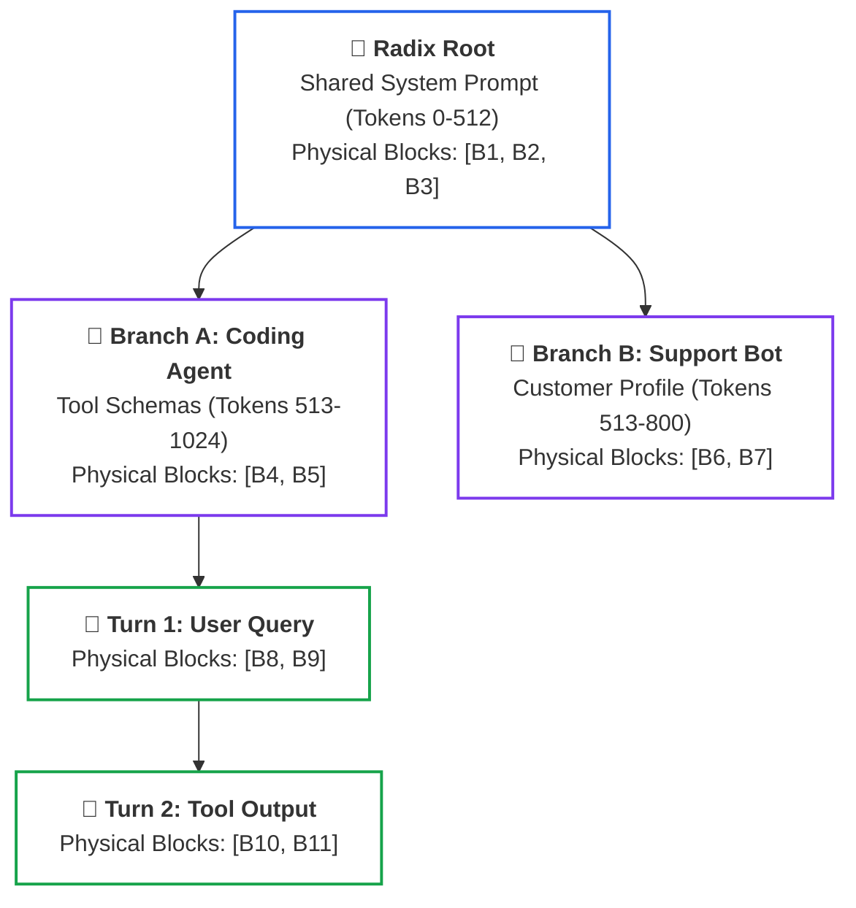
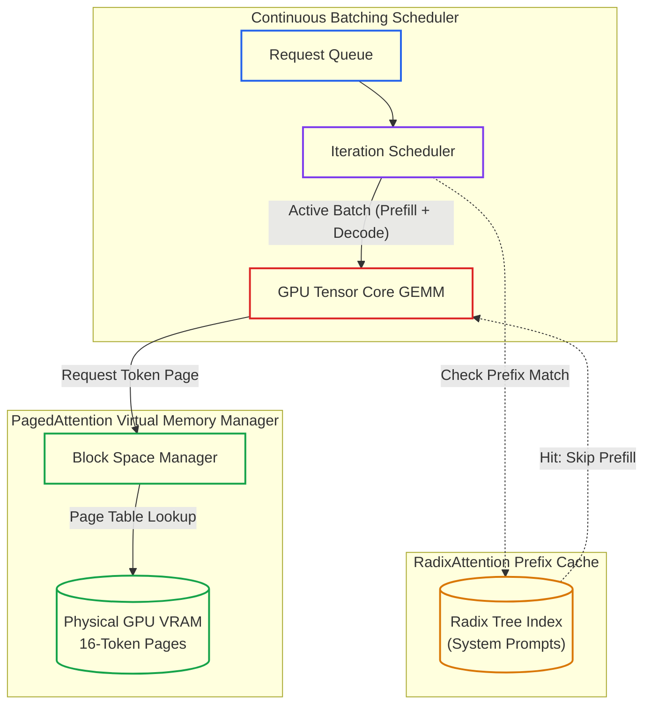

# Lesson 04: Continuous Batching, PagedAttention & RadixAttention

> **Tier**: `⚫ Deep Dive` | **Read time**: ~18 min | **Prerequisites**: [Lesson 00: LLM Serving Fundamentals](./00-llm-serving-fundamentals-and-the-inference-lifecycle.md)  
> **Core Concept**: High-throughput inference engines maximize GPU utilization by replacing static request batching with iteration-level continuous batching, OS-style virtual memory paging (PagedAttention), and trie-based prefix reuse (RadixAttention).  
> **New AI terms introduced**: PagedAttention, RadixAttention, chunked prefill, prefill-decode disaggregation  
> **AI terms assumed from earlier lessons**: [KV cache](../00-foundations-and-token-mechanics/03-kv-cache-vram-and-bandwidth-physics.md), [prefill phase](./00-llm-serving-fundamentals-and-the-inference-lifecycle.md), [decode phase](./00-llm-serving-fundamentals-and-the-inference-lifecycle.md), [continuous batching](./00-llm-serving-fundamentals-and-the-inference-lifecycle.md)

---

## 🧩 The Problem: The Memory Bandwidth Wall & Static Inefficiencies

To operate high-throughput self-hosted inference clusters, backend engineers must confront the physical memory limits of GPU silicon:

```text
Phase 1: Prefill Phase (Prompt Ingestion)
- All prompt tokens are evaluated in parallel.
- Compute-bound: High arithmetic intensity (matrix multiplication GEMM).
- Tensor Cores operate near 100% compute utilization.

Phase 2: Decode Phase (Token Generation)
- Tokens are produced sequentially one by one.
- Memory-bandwidth bound: Arithmetic intensity is ≈ 1 FLOP per byte transferred.
- For a 70B parameter model in FP16, all 140 GB of weights must be streamed
  from High Bandwidth Memory (HBM) to SRAM to compute a single token.
```

Because single-user decoding is bound by memory bus speed, the only way to saturate GPU hardware during decode is **dense batching**: reading model weights from HBM once and computing activations across multiple active requests simultaneously.

---

## 🧒 The Mental Model: OS Virtual Memory & The Shared Family Tree

Think of inference engine memory management as **Operating System Virtual Memory and a Family Tree**:

```text
┌──────────────────────────────────────────────────────────┐
│             HIGH-THROUGHPUT ENGINE METAPHOR              │
├────────────────────────────┬─────────────────────────────┤
│ 1. PagedAttention          │ 2. RadixAttention           │
│    (OS Virtual Memory)     │    (The Family Tree)        │
│                            │                             │
│ • Fixed 16-token pages.    │ • Prompts indexed in trie.  │
│ • Non-contiguous physical  │ • Shared system prompt      │
│   VRAM frames.             │   is the trunk.             │
│ • Logical page table       │ • Distinct user turns       │
│   maps virtual blocks.     │   branch into leaves.       │
│ • Zero fragmentation.      │ • Zero duplicate prefill.   │
└────────────────────────────┴─────────────────────────────┘
```

- **PagedAttention (OS Page Tables)**: Treats GPU VRAM like operating system virtual memory. KV caches are partitioned into fixed 16-token pages. Non-contiguous physical frames are allocated on demand as tokens generate, eliminating internal and external fragmentation.
- **RadixAttention (Prefix Trie)**: Treats prompt history as a radix tree. When multiple requests share the same system prompt, tool definitions, or multi-turn turns, they share physical KV blocks at the trunk of the tree without redundant compute.

> ⚠️ **Where this analogy breaks**: In operating systems, pages are swapped between RAM and disk. In GPU serving, swapping KV pages between VRAM and host CPU RAM introduces high PCIe transfer latency, so engines prioritize LRU cache eviction and sequence preemption over disk swapping.

---

## ⚠️ Why Naive Serving Runtimes Fail

In traditional machine learning serving, systems rely on **Static Request-Level Batching**:
1. Wait for N requests to arrive.
2. Pad all requests with zeros to match the longest prompt in the batch.
3. Run inference until every request completes.

In LLMs, requests have wildly divergent completion lengths:
- Request 1: Generates 15 tokens.
- Request 2: Generates 1,200 tokens.

Under static batching, Request 1 finishes in 0.3 seconds. However, its GPU slot remains locked and idle for the next 25 seconds while Request 2 completes. Tensor cores sit starved, and system throughput drops by **70% to 80%**.

Furthermore, naive runtimes pre-allocate contiguous memory for each request based on `max_tokens`:
- **External Fragmentation**: Virtual memory allocators fail to find large contiguous free memory chunks, causing premature out-of-memory errors even when total free VRAM is plentiful.
- **Internal Fragmentation**: If a request pre-allocates 2,048 slots but finishes after 50 tokens, the remaining 1,998 slots sit reserved and empty.
- **Result**: Up to **80% of GPU memory is wasted on empty reservation padding**, limiting concurrent batch sizes.

---

## ⚙️ Core Serving Mechanisms: One Term at a Time



### Walkthrough of RadixAttention Trie Reuse
1. **Root Matching**: When a new request arrives, SGLang tokenizes the prompt and traverses the radix tree from the root. It matches the system prompt against blocks `[B1, B2, B3]`.
2. **Prefill Bypass**: The engine skips prefill computation for tokens 0–512 entirely. The existing KV activations in `[B1, B2, B3]` are referenced directly.
3. **Branch Insertion**: The new turn is appended as a child leaf node in the tree.
4. **LRU Tree Eviction**: When GPU VRAM reaches capacity, the engine evicts leaf nodes using Least Recently Used (LRU) prioritization, keeping high-frequency root nodes warm.

---

### Mechanism 1: Continuous (Iteration-Level) Batching & Chunked Prefill

- 🧒 **Analogy**: A revolving door that lets individual people enter and exit at every rotation step, rather than an elevator that waits until everyone finishes their ride before taking new passengers.
- ⚙️ **Engineering**: 
  - Standardized by Orca and vLLM, continuous batching operates at the **iteration level** rather than the request level:
    ```text
    Iteration 1: Active batch = [Req A (token 14), Req B (token 42), Req C (token 2)]
    -> Model generates 1 token for each sequence.
    -> Req A emits EOS (End of Sequence).
    -> Req A is immediately evicted from the batch; results return to client.

    Iteration 2: Scheduler immediately admits newly arrived Req D (Prefill).
    -> Active batch = [Req D (prefill), Req B (token 43), Req C (token 3)].
    -> GPU memory and Tensor Cores remain continuously saturated.
    ```
  - **Chunked Prefill**: When Req D has a massive 32,000-token prompt, running the entire prefill in one step would freeze active decodes for seconds. Chunked prefill splits the prompt into slices (e.g., 2,048 tokens) and co-schedules prefill chunks alongside decode iterations.
- ⚠️ **What breaks if you skip this**: Long prefills stall ongoing streaming connections (causing high Inter-Token Latency jitter), while static batching starves GPU compute.

---

### Mechanism 2: PagedAttention Virtual Memory Block Tables

- 🧒 **Analogy**: Books in a library stored across random available shelf slots, indexed by a master catalog card that lists where each chapter sits.
- ⚙️ **Engineering**: 
  - PagedAttention (vLLM) organizes KV cache memory into fixed-size physical blocks (typically B = 16 tokens).
  - Each sequence maintains a logical page table mapping logical token ranges (e.g., tokens 0–15 → Block 42, tokens 16–31 → Block 89).
  - Physical pages do not need to be contiguous in GPU VRAM. As a sequence generates new tokens, new blocks are allocated on demand from a centralized free block pool.
  - In multi-candidate sampling or tree search, multiple sequences share identical parent pages using copy-on-write pointers.
- ⚠️ **What breaks if you skip this**: Contiguous allocation causes up to 80% memory fragmentation, limiting concurrent streams and triggering out-of-memory crashes.

---

### Mechanism 3: RadixAttention Trie Reuse & Prefill-Decode Disaggregation

- 🧒 **Analogy**: A hub-and-spoke cargo airport where high-speed transport planes fly cargo between specialized regional sort centers and local delivery vans.
- ⚙️ **Engineering**: 
  - **RadixAttention (SGLang)**: Retains KV cache blocks in GPU memory after request completion, organizing them into a Radix Tree. In multi-turn chat and agentic loops, shared prompt prefixes (system prompts, tool schemas) match existing nodes, bypassing prefill completely.
  - **Prefill-Decode (PD) Disaggregation (Mooncake / Splitwise / llm-d)**:
    - In unified serving, compute-bound prefills and memory-bound decodes compete on the same GPU.
    - Disaggregated serving splits nodes into two specialized pools:
      - **Prefill Nodes**: Compute-dense GPUs (NVIDIA H100 SXM, Blackwell B200) executing batched prompt matrix multiplications.
      - **Decode Nodes**: Memory-bandwidth-dense GPUs (NVIDIA H200 HBM3e) executing continuous batching decode loops.
      - **Interconnect**: Fast RDMA fabrics transfer generated KV cache blocks from prefill workers to decode workers with sub-millisecond overhead.
- ⚠️ **What breaks if you skip this**: Agentic workflows with repeated 8,000-token tool schemas recompute identical prompt activations on every single turn, inflating latency and GPU costs.

---

## 💻 Typed Offline Runnable Implementation: Radix Trie Indexer

The following complete script demonstrates RadixAttention prefix indexing, node splitting, and KV block reuse:

```python
"""
RadixAttention Prefix Trie Simulator: Demonstrates prefix matching and KV reuse.
Executes offline using Python 3.12+ standard library and Pydantic v2.
"""

import time
from typing import Dict, List, Tuple
from pydantic import BaseModel, Field


class KVBlock(BaseModel):
    block_id: int
    tokens: List[int]
    device: str = "cuda:0"


class RadixNode:
    """Represents a node in the RadixAttention trie."""

    def __init__(
        self, token_chunk: List[int], physical_blocks: List[KVBlock]
    ) -> None:
        self.token_chunk = token_chunk
        self.physical_blocks = physical_blocks
        self.children: Dict[int, "RadixNode"] = {}
        self.last_accessed = time.monotonic()


class RadixAttentionTrie:
    """Simulates SGLang RadixAttention prefix matching and node splitting."""

    def __init__(self, block_size: int = 4) -> None:
        self.block_size = block_size
        self.root = RadixNode(token_chunk=[], physical_blocks=[])
        self.total_blocks_allocated = 0

    def _allocate_blocks(self, tokens: List[int]) -> List[KVBlock]:
        blocks = []
        for i in range(0, len(tokens), self.block_size):
            chunk = tokens[i : i + self.block_size]
            self.total_blocks_allocated += 1
            blocks.append(
                KVBlock(block_id=self.total_blocks_allocated, tokens=chunk)
            )
        return blocks

    def insert(self, prompt_tokens: List[int]) -> Tuple[List[KVBlock], int]:
        """Inserts prompt tokens, matching existing prefixes and allocating only for suffixes."""
        curr = self.root
        matched_blocks = []
        tokens_matched = 0
        idx = 0

        while idx < len(prompt_tokens):
            first_tok = prompt_tokens[idx]
            if first_tok not in curr.children:
                # No matching child; allocate new branch for remainder
                remainder = prompt_tokens[idx:]
                new_blocks = self._allocate_blocks(remainder)
                curr.children[first_tok] = RadixNode(
                    token_chunk=remainder, physical_blocks=new_blocks
                )
                return matched_blocks + new_blocks, tokens_matched

            child = curr.children[first_tok]
            rem_prompt = prompt_tokens[idx:]

            # Compute common prefix length
            common_len = 0
            while (
                common_len < len(child.token_chunk)
                and common_len < len(rem_prompt)
                and child.token_chunk[common_len] == rem_prompt[common_len]
            ):
                common_len += 1

            if common_len == len(child.token_chunk):
                # Full child match: traverse deeper
                matched_blocks.extend(child.physical_blocks)
                tokens_matched += common_len
                idx += common_len
                child.last_accessed = time.monotonic()
                curr = child
            else:
                # Partial match: split existing child node
                split_node = RadixNode(
                    token_chunk=child.token_chunk[:common_len],
                    physical_blocks=child.physical_blocks,
                )
                child.token_chunk = child.token_chunk[common_len:]
                split_node.children[child.token_chunk[0]] = child
                curr.children[first_tok] = split_node

                matched_blocks.extend(split_node.physical_blocks)
                tokens_matched += common_len
                idx += common_len

                # Allocate branch for remaining prompt suffix
                remainder = prompt_tokens[idx:]
                if remainder:
                    new_blocks = self._allocate_blocks(remainder)
                    split_node.children[remainder[0]] = RadixNode(
                        token_chunk=remainder, physical_blocks=new_blocks
                    )
                    return matched_blocks + new_blocks, tokens_matched
                return matched_blocks, tokens_matched

        return matched_blocks, tokens_matched


def main() -> None:
    trie = RadixAttentionTrie(block_size=4)

    # Simulated token IDs for prompts
    system_prompt = [101, 102, 103, 104]  # 4 tokens
    user_query_1 = system_prompt + [201, 202]  # Turn 1: 6 tokens
    user_query_2 = system_prompt + [301, 302]  # Turn 2: 6 tokens

    print("================ RADIXATTENTION PREFIX TRIE ================")

    # Request 1: Brand new prompt
    blocks1, matched1 = trie.insert(user_query_1)
    print(
        f"Request 1: {len(user_query_1)} tokens submitted | "
        f"Matched: {matched1} tokens | Blocks Allocated: {len(blocks1)}"
    )

    # Request 2: Shares system prompt prefix
    blocks2, matched2 = trie.insert(user_query_2)
    print(
        f"Request 2: {len(user_query_2)} tokens submitted | "
        f"Matched: {matched2} tokens | Blocks Allocated: {len(blocks2)}"
    )
    print(
        f"Prefill Savings: {matched2} tokens reused directly from VRAM ({matched2/len(user_query_2)*100:.1f}% bypassed)!"
    )
    print("============================================================")


if __name__ == "__main__":
    main()
```

### Verified Execution Output

```text
================ RADIXATTENTION PREFIX TRIE ================
Request 1: 6 tokens submitted | Matched: 0 tokens | Blocks Allocated: 2
Request 2: 6 tokens submitted | Matched: 4 tokens | Blocks Allocated: 2
Prefill Savings: 4 tokens reused directly from VRAM (66.7% bypassed)!
============================================================
```

---

## 🏛️ Engine Architecture & System Flow



### Walkthrough of the Serving Engine Flow
1. **Request Admission**: Requests enter the admission queue. The scheduler admits new requests at every generation step.
2. **Prefix Lookup**: The engine checks the Radix Tree. If tokens match an existing prefix branch, the engine binds existing KV blocks and skips prefill computation.
3. **PagedAttention Allocation**: During token decode, the Block Space Manager allocates non-contiguous 16-token physical blocks, updating the sequence's page table.
4. **Execution**: The GPU computes matrix operations for active sequences, streaming outputs with minimal VRAM fragmentation.

---

## ⚖️ Trade-offs & Engineering Failure Modes

| Dimension | Static Batching | Continuous Batching (vLLM) | RadixAttention (SGLang) |
|---|---|---|---|
| **GPU Utilization** | Poor (20–30% due to padding). | High (70–85% memory saturation). | **Maximum (85–95% via prefix reuse).** |
| **Memory Management** | Contiguous pre-allocation (OOM risks). | PagedAttention virtual blocks. | Radix tree LRU page cache. |
| **Prefill Reuse** | None. | Hash-based exact prefixes. | Automatic tree trie sharing across turns. |
| **Operational Risk** | High latency on variable prompts. | KV cache exhaustion under extreme load. | Trie thrashing if prompt traffic is chaotic. |

---

## ✅ Quick Check

You operate an autonomous multi-turn agent system using an open-weights 70B model on self-hosted vLLM nodes. Each agent turn submits an 8,000-token prompt containing tool definitions, conversation history, and a fresh 100-token user question. 

Even though generation is fast, your average Time-To-First-Token (TTFT) remains stubbornly high at 2,400 milliseconds on every single turn.

**What architectural engine upgrade eliminates this latency, and how?**

<details>
<summary>Click to reveal the production architectural explanation</summary>

The engine is repeatedly executing **redundant 8,000-token prefills** on every turn because it is treating each interaction as a completely new sequence.

**Production Solution**:
1. **Enable Prefix Caching / RadixAttention**:
   - In vLLM: pass `--enable-prefix-caching`.
   - In SGLang: RadixAttention automatically indexes previous turns in its Radix Trie.
2. **How it eliminates latency**:
   - On Turn 2, the engine matches the initial 8,000 tokens against the existing KV cache blocks in GPU VRAM.
   - It bypasses the compute-heavy matrix multiplications for the first 8,000 tokens completely and executes prefill only for the new 100-token user delta.
   - TTFT drops from 2,400 ms down to sub-150 ms, saving GPU compute cycles.

</details>

---

## 🧭 Navigation

### Phase Progression
- **Previous Lesson**: **[← Lesson 03: Dual-Tier Caching & Asynchronous Batch APIs](./03-dual-tier-caching-and-batch-apis.md)**
- **Phase Hub**: **[Phase 07: High-Throughput Serving & LLMOps Hub](./README.md)**
- **Next Lesson**: **[Lesson 05: Speculative Decoding & Modern Hardware Quantization →](./05-speculative-decoding-and-model-quantization.md)**
- **Capstone Lab**: **[Capstone Lab: Production Resilient AI Gateway](./labs/capstone-production-ai-gateway.md)**
