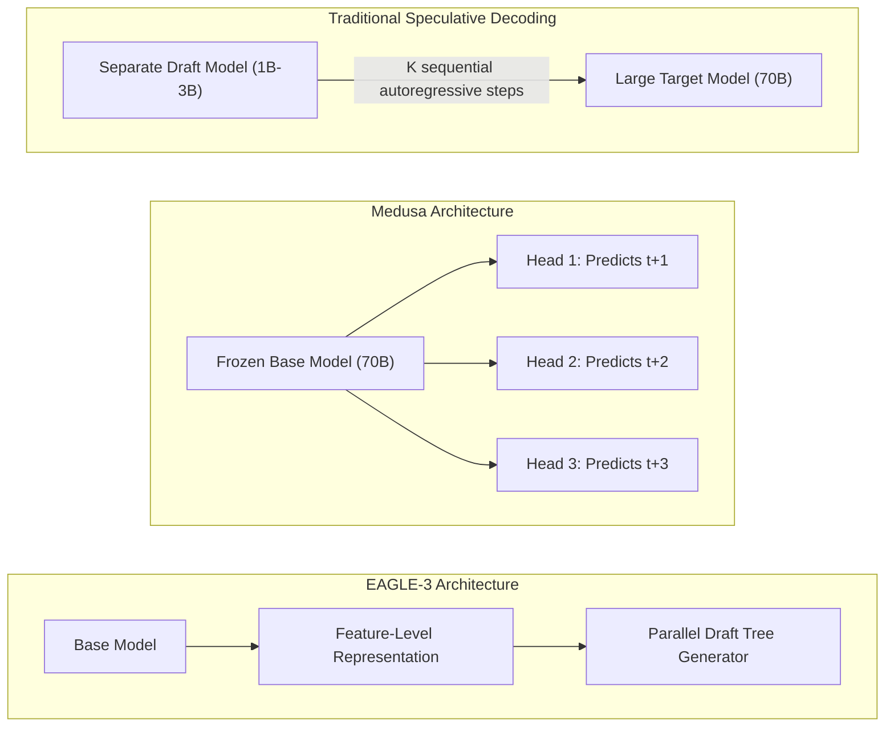
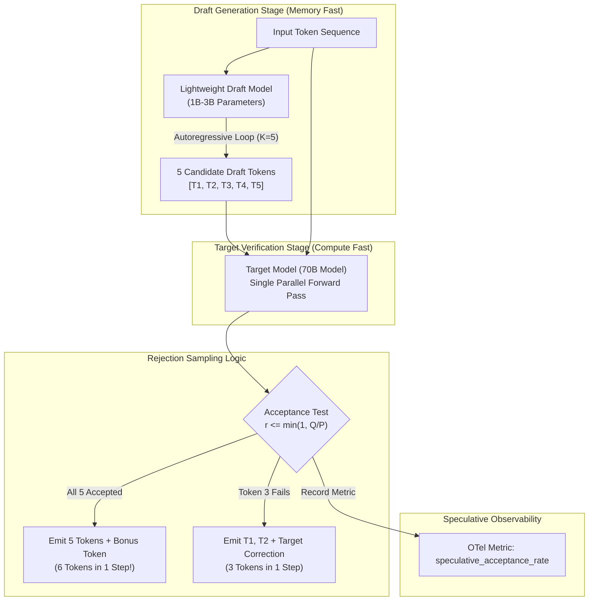

# Speculative Decoding & Modern Hardware Quantization: Breaking Latency Limits with Draft Verification & FP8 Compute

> **[Tier: ⚫ Deep Dive]**  
> **Accelerating inference beyond memory bandwidth boundaries: the draft-and-verify speculative decoding paradigm (EAGLE-3 / Medusa), acceptance rate mathematics, and native FP8 hardware acceleration on Hopper and Blackwell GPUs.**

---

## 🎯 What You Will Learn

- How the draft-and-verify paradigm breaks the autoregressive memory bandwidth bottleneck without altering output tokens or sacrificing perplexity.
- How to derive the mathematical speedup of speculative decoding as a function of draft token acceptance probability (alpha).
- How advanced speculative architectures (Medusa heads and EAGLE feature trees) generate candidate tokens without separate draft model latency.
- The architectural distinction between native FP8 (E4M3/E5M2) execution on modern datacenter GPUs and 4-bit weight-only quantization (AWQ/GPTQ).

---

## 1. The Problem: The Single-Token Autoregressive Bottleneck

In Lesson 04, we established that LLM token decoding is memory-bandwidth bound:
- To generate a single token from a 70B parameter FP16 model, the GPU must transfer approximately **140 GB of weights** from High Bandwidth Memory (HBM) into SRAM cache.
- The GPU Tensor Cores sit largely idle during this transfer, executing only O(1) arithmetic operations per weight loaded.

For low-batch, interactive applications (e.g. coding copilots, real-time voice agents), high latency cannot be masked by packing hundreds of concurrent sequences into the batch. Users demand **sub-20ms Inter-Token Latency (ITL)** (> 50 TPS), which physical memory bus bandwidth on single GPUs cannot provide under standard autoregressive decoding.

---

## 2. The Core Idea & Why Naive Fails

### Why Naive Quantization Alone Is Insufficient
To reduce memory bandwidth pressure, developers often compress model weights using quantization:
- **INT4 Quantization (AWQ/GPTQ)**: Reduces weight footprint by 4× (from 140 GB to 35 GB), allowing a 70B model to fit on a single 80 GB GPU.
- *The Limitation*: While INT4 cuts memory transfer volume, consumer and datacenter GPUs must often dequantize weights back to FP16 in register files before performing matrix multiplications. For deep reasoning models (e.g., DeepSeek-R1, OpenAI o-series), extreme 4-bit quantization can degrade complex mathematical reasoning and introduce subtle perplexity regressions.

### The Solution: Speculative Decoding & Native FP8
Modern high-throughput serving systems combine two breakthroughs:

1. **Speculative Decoding (Draft and Verify)**:
   - A small, fast "draft model" (e.g. 1B–3B parameters) rapidly proposes K candidate tokens.
   - The large "target model" (e.g. 70B parameters) evaluates all K tokens concurrently in a **single parallel forward pass**.
   - *The Breakthrough*: Verifying K tokens simultaneously is compute-bound, not memory-bound. If the draft tokens are accepted, the system generates K tokens in the wall-clock time of a single target forward pass!
2. **Native FP8 Hardware Execution**:
   - Modern datacenter architectures (NVIDIA Hopper H100, Blackwell B200) feature Tensor Cores that execute 8-bit floating-point GEMM operations directly.
   - Using FP8 (E4M3 for weights and activations), models achieve **2× higher throughput** and cut VRAM consumption in half with zero runtime dequantization overhead and near-zero perplexity loss.

---

## 3. Mental Model: The Legal Intern & Senior Partner

```text
Traditional Autoregressive Generation:
[ Senior Partner (70B Model, $1,500/hr) ]
Writes sentence word-by-word:
Word 1 (reads entire law library) ──> 
Word 2 (reads entire law library) ──> 
Word 3 (reads entire law library)... Extremely slow and expensive!

Speculative Decoding:
[ Legal Intern (Draft Model, Fast & Cheap) ]
Rapidly drafts a 5-word sentence proposal:
"The contract shall be terminated"

                       │
                       ▼
[ Senior Partner (Target 70B Model, Verifier) ]
Reviews all 5 words simultaneously in a single glance:
"The [✓] contract [✓] shall [✓] be [✓] terminated [✓]"
All 5 words approved in 1 glance! Result: 5x speedup with 100% Partner Quality.
```

- **The Draft Intern**: Moves fast and makes educated guesses.
- **The Partner Verifier**: Retains absolute editorial veto. If the partner rejects word 4, generation halts at word 3, the partner substitutes the correct word, and the intern resumes drafting from the new state.
- **Mathematical Invariant**: The output distribution of speculative decoding is mathematically proven to be identical to the target model generating alone. There is zero degradation in quality.

---

## 4. How It Works: Step-by-Step Mechanics

### A. The Speculative Sampling & Verification Algorithm

```text
Let M_draft be the small model with probability distribution p(x).
Let M_target be the large model with probability distribution q(x).

Step 1: Draft Generation
M_draft autoregressively samples K candidate tokens: [x_1, x_2, ..., x_K].
Takes K forward passes of the small model (very fast due to small weight size).

Step 2: Parallel Target Verification
M_target receives the prompt plus all K draft tokens in a single sequence.
M_target executes ONE single forward pass, producing output distributions:
[q(x_1), q(x_2), ..., q(x_K), q(x_{K+1})].

Step 3: Probabilistic Acceptance Test
For i = 1 to K:
  Sample uniform random number r ~ Uniform(0, 1).
  If r <= min(1, q(x_i) / p(x_i)):
    Accept token x_i!
  Else:
    Reject token x_i.
    Resample replacement token from modified distribution:
    q'(x) = max(0, q(x) - p(x)) / norm
    Halt verification loop.

Step 4: Emit Accepted Tokens
If all K tokens are accepted, emit all K tokens plus the target model's 
bonus token x_{K+1}. Total tokens generated in 1 target step: K + 1.
```

---

### B. Expected Speedup Formulation
The speedup of speculative decoding depends on the **draft acceptance rate (alpha)**:

```text
Expected Accepted Tokens per Step:
E[Tokens] = (1 - alpha^(K + 1)) / (1 - alpha)

Theoretical Speedup Ratio:
Speedup = E[Tokens] / (1 + (Time_Draft / Time_Target) * K)
```

- If alpha = 0.85 and K = 4:
  The target model accepts an average of ~3.2 tokens per step. If the draft model is 10× faster than the target model, the system achieves an overall **2.2× to 2.8× wall-clock latency speedup**.

---

### C. Advanced Architectures: Medusa Heads vs. EAGLE



#### Diagram Walkthrough
1. **Traditional Speculative Decoding**: Uses a separate smaller neural network. While effective, the draft model must execute K sequential autoregressive passes, introducing draft latency overhead.
2. **Medusa**: Eliminates the second model entirely. It attaches multiple lightweight MLP classification heads to the top of the frozen base model. Each head predicts a token at position t+1, t+2, t+3 simultaneously from the base model's top hidden state.
3. **EAGLE / P-EAGLE (Parallel EAGLE)**: Operates at the feature/embedding level rather than raw token logits. By passing hidden representations through a lightweight transformer layer, it generates draft candidate trees in a **single forward step**, achieving acceptance rates exceeding 80% on complex reasoning tasks.

---

### D. Modern Hardware Quantization: Native FP8 vs. AWQ/GPTQ

Modern GPU silicon architectures have transformed the quantization landscape:

```text
Format Specifications:
FP16:  1 sign bit | 5 exponent bits  | 10 mantissa bits (Standard High Precision)
BF16:  1 sign bit | 8 exponent bits  | 7 mantissa bits  (High Dynamic Range)
FP8:   1 sign bit | 4 exponent bits  | 3 mantissa bits  (E4M3: For Weights & Activations)
       1 sign bit | 5 exponent bits  | 2 mantissa bits  (E5M2: For Gradients & KV Cache)
INT4:  4-bit integer values packed with group-level scale and zero-point factors.
```

| Dimension | Native FP8 (Hopper / Blackwell) | AWQ 4-Bit (Weight-Only) | GPTQ 4-Bit |
|---|---|---|---|
| **Execution Hardware** | Native Tensor Core FP8 GEMM | Dequantized to FP16 in registers | Dequantized to FP16 in registers |
| **VRAM Footprint** | 1.0 bytes / parameter | 0.5–0.6 bytes / parameter | 0.5–0.6 bytes / parameter |
| **Compute Speedup** | **2× faster GEMM execution** | Memory-bound speedup only | Memory-bound speedup only |
| **Perplexity Degradation** | Near-Zero (< 0.1% difference) | Minimal (< 0.5% on 70B models) | Low (< 0.8% on 70B models) |
| **Ideal Deployment** | **Datacenter H100 / B200 clusters** | **Edge AI, single-GPU workstations** | **Static batching, local inference** |

---

## 5. Concrete Scenario & Code Implementation

The following Python 3.12+ code simulates the speculative decoding acceptance verification algorithm and computes empirical wall-clock speedups:

```python
import random
from typing import List, Tuple
from pydantic import BaseModel, Field

class TokenDistribution(BaseModel):
    token_id: int
    prob: float

class VerificationStepResult(BaseModel):
    accepted_tokens: List[int]
    rejected_at_index: Optional[int] = None
    corrected_token: Optional[int] = None
    total_tokens_produced: int

def verify_speculative_draft(
    draft_tokens: List[int],
    draft_probs: List[float],
    target_probs: List[float],
    next_target_token: int
) -> VerificationStepResult:
    """
    Implements standard speculative rejection sampling.
    draft_probs: P(draft_tokens[i]) according to small model.
    target_probs: Q(draft_tokens[i]) according to large target model.
    """
    accepted = []
    rejected_idx = None
    corrected = None

    for i, token in enumerate(draft_tokens):
        p_draft = draft_probs[i]
        q_target = target_probs[i]

        # Speculative acceptance criterion: r <= min(1, Q(x) / P(x))
        ratio = q_target / max(1e-6, p_draft)
        r = random.random()

        if r <= min(1.0, ratio):
            accepted.append(token)
        else:
            # Token rejected! Target model overrides and halts draft verification
            rejected_idx = i
            # In production, sample from max(0, Q(x) - P(x))
            corrected = next_target_token
            break

    # If all K accepted, append the bonus target token
    if rejected_idx is None:
        accepted.append(next_target_token)

    return VerificationStepResult(
        accepted_tokens=accepted,
        rejected_at_index=rejected_idx,
        corrected_token=corrected,
        total_tokens_produced=len(accepted) + (1 if corrected is not None else 0)
    )

# Execution Demonstration
if __name__ == "__main__":
    # Simulating K=4 draft tokens
    sim_draft_tokens = [101, 2045, 301, 88]
    sim_draft_probs = [0.90, 0.85, 0.70, 0.60]
    sim_target_probs = [0.92, 0.80, 0.75, 0.20]  # Token 4 will likely fail
    bonus_token = 502

    result = verify_speculative_draft(
        sim_draft_tokens, 
        sim_draft_probs, 
        sim_target_probs, 
        bonus_token
    )
    print(f"Accepted Tokens: {result.accepted_tokens}")
    print(f"Rejected at Index: {result.rejected_at_index}")
    print(f"Total Tokens Produced in 1 Target Step: {result.total_tokens_produced}")
```

---

## 6. Engineering Solutions: Production Serving Configuration

To activate speculative decoding and FP8 quantization in production using vLLM:

```bash
# Launching vLLM with Llama-3.3-70B using a 1B draft model and native FP8
vllm serve meta-llama/Llama-3.3-70B-Instruct \
    --tensor-parallel-size 4 \
    --quantization fp8 \
    --speculative-model meta-llama/Llama-3.2-1B-Instruct \
    --num-speculative-tokens 5 \
    --speculative-draft-tensor-parallel-size 1 \
    --gpu-memory-utilization 0.90
```

### Parameter Rationale:
- `--quantization fp8`: Instructs vLLM to cast weights and activations to 8-bit floating point, cutting VRAM memory footprint by 50% and executing native FP8 Tensor Core GEMMs.
- `--speculative-model Llama-3.2-1B`: Uses a smaller model from the same family with an aligned vocabulary as the draft generator.
- `--num-speculative-tokens 5`: Configures draft lookahead K = 5.
- `--speculative-draft-tensor-parallel-size 1`: Runs the lightweight 1B draft model on a single GPU while sharding the 70B target model across 4 GPUs.

---

## 7. Architecture & Telemetry View



### Visual Walkthrough
1. **Draft Generation**: The lightweight 1B draft model processes the current context and autoregressively generates K=5 tokens. Because its parameter volume is tiny, it produces these draft tokens in negligible time.
2. **Parallel Verification**: The 70B target model receives the original prompt concatenated with all 5 draft tokens. It computes the forward pass for all tokens in a single tensor operation.
3. **Rejection Sampling**: The verification engine compares probabilities. If a token fails the probability threshold, the loop breaks, the target model's corrected token is emitted, and the draft model restarts generation from the corrected state.
4. **Telemetry Export**: The engine monitors `speculative_acceptance_rate` (alpha). If alpha > 70%, the system achieves significant wall-clock acceleration.

---

## 8. Common Failure Modes & Production Anti-Patterns

| Anti-Pattern | Root Cause | Engineering Solution |
|---|---|---|
| **Vocabulary Mismatch Collapse** | Draft model and target model use different BPE tokenizers, causing token boundary divergence. | Always verify that draft and target models share identical tokenizer vocabularies (e.g. Llama-3.2-1B with Llama-3.3-70B). |
| **Negative Speculative Speedup** | Draft acceptance rate drops below 30% (e.g. on highly stochastic creative tasks); draft overhead slows down total serving. | Monitor `speculative_acceptance_rate`; automatically disable speculative decoding when alpha < 45%. |
| **FP8 Scale Factor Overflow** | Static FP8 scaling factors overflow on sudden outlier activation spikes during long-context generation. | Use dynamic per-tensor or per-channel FP8 quantization scaling factors rather than static offline calibration scales. |
| **Draft Tensor Parallel Waste** | Running a tiny 1B draft model across an entire 8-GPU tensor-parallel group, wasting communication bandwidth. | Set `--speculative-draft-tensor-parallel-size 1` to execute the draft model on a single GPU without cross-GPU all-reduce overhead. |

---

## 9. Production View & Evaluation: Acceptance Metrics

Speculative serving efficiency is governed by three primary metrics:

1. **Acceptance Rate (alpha)**:
   - The ratio of accepted draft tokens to total proposed draft tokens.
   - *Target*: alpha ≥ 75% for general text; alpha ≥ 85% for code and structured JSON.
2. **Mean Accepted Tokens per Step (MATS)**:
   - Average number of tokens committed per target model forward pass.
   - *Target*: MATS ≥ 2.5 when K = 5.
3. **Wall-Clock Latency Speedup (S_wall)**:
   - Formulated as:
   ```text
   S_wall = Latency_Baseline / Latency_Speculative
   ```
   - *Target*: 1.8x to 2.5x speedup on interactive workloads.

---

## 10. When Should You Use It? (Trade-off Matrix)

| Optimization Technique | Implementation Effort | VRAM Savings | Latency Speedup | Risk of Quality Loss |
|---|---|---|---|---|
| **Baseline FP16** | Zero | None (100% VRAM) | 1.0x (Baseline) | Zero |
| **Native FP8 (Hopper/Blackwell)** | Low (Serving flag) | **50% VRAM Reduction** | **1.8–2.2x Speedup** | **Near-Zero (< 0.1% perplexity change)** |
| **AWQ 4-Bit (Weight-Only)** | Medium (Offline calibration) | **75% VRAM Reduction** | 1.2–1.5x Speedup | Minimal (< 0.5% perplexity change) |
| **Speculative Decoding** | Medium (Requires draft model) | None (Adds draft VRAM) | **2.0–3.0x Speedup** | **Mathematically Zero Quality Loss** |
| **FP8 + Speculative Decoding** | High (Combined setup) | **50% VRAM Reduction** | **3.0–4.5x Speedup** | Near-Zero |

---

## 💡 11. Senior Interview Perspective

### Architectural Scenario: Latency Optimization for Low-Batch Copilots
**Interviewer**: *"Our coding copilot requires p95 TTFT < 300ms and generation speed > 60 TPS using a 70B parameter model. However, on our 4x H100 cluster, individual user sessions only reach 28 TPS because concurrent batch sizes are low during off-peak hours. How do you double generation speed without degrading code quality or fine-tuning the model?"*

**Architectural Defense**:
> *"We achieve this by enabling **Speculative Decoding with Native FP8 Quantization**:*
> 1. *First, we activate native **FP8 (E4M3)** execution in vLLM. Because H100 Tensor Cores support native FP8 GEMM kernels, this immediately halves memory bandwidth load per token, increasing baseline TPS by ~1.7× with zero mathematical perplexity degradation.*
> 2. *Second, we pair the 70B model with a 1B parameter draft model from the same family (e.g. Llama-3.2-1B). Coding tasks exhibit highly repetitive syntax patterns (variable declarations, boilerplate keywords), driving draft acceptance rates (alpha) above 80%.*
> 3. *With lookahead K = 4 and alpha ≈ 0.85, the target model verifies and commits an average of ~3 tokens per single forward pass.*
> 4. *Combined, native FP8 and speculative draft verification boost decoding throughput from 28 TPS to **75+ TPS** for single-stream users without retraining, fine-tuning, or altering code generation quality."*

---

## 12. Key Takeaways & Verified Resources

- **Speculative decoding guarantees mathematical fidelity**: Rejection sampling ensures output distributions match the large target model with 100% precision.
- **Verification is compute-bound**: Evaluating K tokens simultaneously in one forward pass bypasses the memory bandwidth bottleneck.
- **Native FP8 is the modern enterprise standard**: Hopper and Blackwell GPUs execute FP8 GEMMs directly, doubling throughput without dequantization penalties.

### Authoritative Primary Sources
- **Fast Inference from Transformers via Speculative Decoding**: Leviathan et al., ICML 2023. [arXiv:2211.17192](https://arxiv.org/abs/2211.17192)
- **EAGLE: Speculative Sampling Requires Rethinking Feature Uncertainty**: Li et al., ICML 2024. [arXiv:2401.15077](https://arxiv.org/abs/2401.15077)
- **Medusa: Simple LLM Inference Acceleration with Multiple Decoding Heads**: Cai et al., 2024. [arXiv:2401.10774](https://arxiv.org/abs/2401.10774)
- **AWQ: Activation-aware Weight Quantization for LLM Compression**: Lin et al., MLSys 2024. [arXiv:2306.00978](https://arxiv.org/abs/2306.00978)
- **NVIDIA Hopper Architecture In-Depth**: [developer.nvidia.com/blog/nvidia-hopper-architecture-in-depth](https://developer.nvidia.com)

---

## 🧭 Navigation

- **[← Previous Lesson: Continuous Batching, PagedAttention & RadixAttention](./04-vllm-continuous-batching-and-radixattention.md)**
- **[Phase 07 Hub: Orientation & Navigation](./README.md)**
- **[Next Lesson: Dynamic Multi-LoRA Adapter Serving at Scale →](./06-dynamic-multi-lora-adapter-serving.md)**
- **[Hands-On Lab: Resilient Multi-Provider AI Gateway](./labs/capstone-production-ai-gateway.md)**
