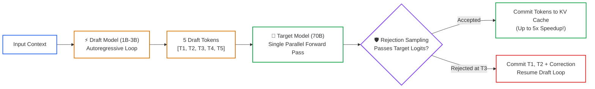
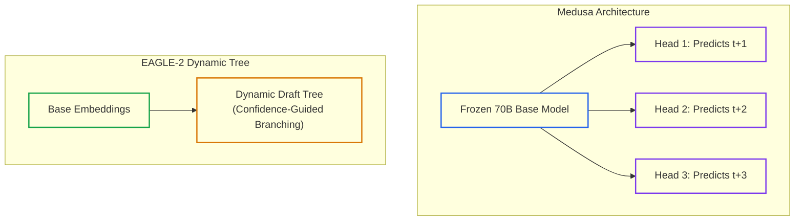

# Lesson 05: Speculative Decoding & Modern Hardware Quantization

> **Tier**: `⚫ Deep Dive` | **Read time**: ~18 min | **Prerequisites**: [Lesson 04: Continuous Batching, PagedAttention & RadixAttention](./04-vllm-continuous-batching-and-radixattention.md)  
> **Core Concept**: Speculative decoding breaks the autoregressive memory bandwidth wall by having a small draft model propose multiple tokens that the large model verifies in a single compute-bound forward pass, while FP8 and NVFP4 silicon double Tensor Core execution speed.  
> **New AI terms introduced**: speculative decoding, draft model, target model, acceptance rate (alpha), FP8 quantization, NVFP4 quantization  
> **AI terms assumed from earlier lessons**: [token](../00-foundations-and-token-mechanics/01-tokenization-and-bpe-mechanics.md), [decode phase](./00-llm-serving-fundamentals-and-the-inference-lifecycle.md), [arithmetic intensity](./00-llm-serving-fundamentals-and-the-inference-lifecycle.md), [PagedAttention](./04-vllm-continuous-batching-and-radixattention.md)

---

## 🧩 The Problem: The Single-Token Autoregressive Bottleneck

In Lesson 00 and Lesson 04, we established that LLM token decoding is memory-bandwidth bound:
- To generate a single token from an open-weights 70-billion parameter model in FP16 precision, the GPU must transfer approximately **140 GB of weights** from High Bandwidth Memory (HBM) into on-chip cache.
- The GPU Tensor Cores sit largely idle during this transfer, executing only O(1) arithmetic operations per byte loaded.

For low-batch, interactive applications (such as coding copilots and real-time voice agents), high latency cannot be masked by packing hundreds of concurrent sequences into the batch. Users demand **sub-20ms Inter-Token Latency (ITL)** (> 50 tokens/second), which physical memory bus bandwidth on single GPUs cannot provide under standard autoregressive decoding.

---

## 🧒 The Mental Model: The Legal Intern & Senior Partner

Think of speculative decoding as a **Senior Law Partner and an Eager Legal Intern**:

```text
┌──────────────────────────────────────────────────────────┐
│              SPECULATIVE DECODING METAPHOR               │
├────────────────────────────┬─────────────────────────────┤
│ 1. Legal Intern (Draft)    │ 2. Senior Partner (Target)  │
│                            │                             │
│ • Fast, cheap, junior.     │ • Authoritative, expensive. │
│ • Rapidly types a 5-word   │ • Reads entire draft in     │
│   sentence proposal.       │   a single glance.          │
│ • "The contract shall be   │ • "The [✓] contract [✓]     │
│    terminated..."          │    shall [✓] be [✓]         │
│                            │    terminated [✓]"          │
│ • Low compute cost.        │ • 5 words approved in 1 step!│
└────────────────────────────┴─────────────────────────────┘
```

- **The Legal Intern (Draft Model)**: Moves fast and makes educated guesses. Generating 5 draft tokens from a 1B model takes negligible compute.
- **The Senior Partner (Target Model)**: Retains absolute editorial veto. The partner reads all 5 words simultaneously in a single glance (a single parallel forward pass).
- **The Guarantee**: If the partner rejects word 4, generation halts at word 3, the partner writes the correct word, and the intern resumes drafting from the corrected state.
- **Mathematical Invariant**: The output distribution of speculative decoding is mathematically identical to the target model generating alone. There is zero degradation in quality or perplexity.

> ⚠️ **Where this analogy breaks**: A human partner might get lazy and overlook an intern's typo. In transformer mathematics, speculative rejection sampling is mathematically rigorous: the target model strictly accepts or rejects candidate tokens based on exact forward pass logits.

---

## ⚠️ Why Naive Quantization Alone Is Insufficient

To reduce memory bandwidth pressure, developers often compress model weights using quantization:
- **INT4 Quantization (AWQ/GPTQ)**: Reduces weight footprint by 4× (from 140 GB to 35 GB), allowing a 70B model to fit on a single 80 GB GPU.
- *The Limitation*: While INT4 cuts memory transfer volume, consumer and datacenter GPUs must often dequantize weights back to FP16 in register files before performing matrix multiplications. For deep reasoning models, extreme 4-bit integer quantization can degrade complex mathematical reasoning and introduce subtle perplexity regressions.

### The Production Solution: Speculative Decoding & Native Silicon Precision
Modern high-throughput serving systems combine two complementary techniques:
1. **Speculative Decoding (Draft and Verify)**: Converts sequential memory-bound operations into a single parallel compute-bound verification step.
2. **Native FP8 & NVFP4 Execution**: Modern GPUs (NVIDIA Hopper H100 and Blackwell B200) execute 8-bit and 4-bit floating point matrix operations natively in silicon without runtime dequantization overhead.

---

## ⚙️ Core Acceleration Mechanisms: One Term at a Time



### Walkthrough of the Speculative Verification Flow
1. **Draft Generation**: A small draft model produces K candidate tokens (e.g., K = 5) in rapid succession.
2. **Parallel Forward Pass**: The large target model evaluates the prompt and all K candidate tokens in a single forward pass.
3. **Rejection Sampling**: The verification engine compares probabilities. Candidate tokens matching target distribution are accepted.
4. **Correction on Rejection**: If token 3 fails, tokens 1 and 2 are committed, the target model's corrected token is appended, and the draft model restarts.

---

### Mechanism 1: Speculative Sampling & Acceptance Rate (alpha)

- 🧒 **Analogy**: Multiple choice guessing where an instructor immediately confirms your answers in batch and grades where you first made a mistake.
- ⚙️ **Engineering**: 
  - Let P(x) be the draft model's probability distribution and Q(x) be the target model's distribution.
  - For each proposed token x, sample a uniform random number r between 0 and 1:
    ```text
    If r <= min(1.0, Q(x) / P(x)):
        Accept token x!
    Else:
        Reject token x. Resample from max(0, Q(x) - P(x)) and halt verification.
    ```
  - The expected number of accepted tokens per step depends on the **draft acceptance rate (alpha)**:
    ```text
    Expected Tokens = (1 - alpha^(K + 1)) / (1 - alpha)
    ```
  - For alpha = 0.85 and K = 4, the target model accepts an average of ~3.2 tokens per single forward pass.
- ⚠️ **What breaks if you skip this**: If you greedily accept draft tokens without statistical rejection sampling, output text rapidly drifts away from the target model's knowledge and quality.

---

### Mechanism 2: Dynamic Draft Trees & Medusa Heads (EAGLE-2 & EAGLE-3)



### Walkthrough of Speculative Architectures
1. **Medusa**: Attaches lightweight feedforward heads directly to the base model's top hidden state. Each head predicts a token at position t+1, t+2, and t+3 simultaneously without requiring a separate draft model.
2. **EAGLE-2 / EAGLE-3**: Evaluates feature representations rather than raw tokens. It dynamically adjusts the structure of candidate draft trees based on confidence scores, achieving 2.5× to 5.0× speedups in vLLM and SGLang.

- 🧒 **Analogy**: Instead of guessing one single sentence path, proposing a branching tree of plausible phrases and letting the editor pick the best path in one read.
- ⚙️ **Engineering**: 
  - Standard speculative decoding uses a linear sequence. If token 2 fails, tokens 3, 4, and 5 are discarded.
  - **Dynamic Tree Speculation (EAGLE-2)**: Expands multiple candidate branches into a tree. The target model verifies all tree branches simultaneously using tree-masked self-attention in a single forward pass.
- ⚠️ **What breaks if you skip this**: Static linear drafting throws away all subsequent tokens whenever an early token fails, limiting speedup in non-deterministic domains.

---

### Mechanism 3: Modern Silicon Precision: FP8 & Blackwell NVFP4

- 🧒 **Analogy**: Packing cargo into standardized modular shipping containers instead of loose cardboard boxes: handling speed doubles because the cranes are built for that exact container size.
- ⚙️ **Engineering**: 
  - **Native FP8 (NVIDIA Hopper H100 / H200)**:
    - Format: OCP standard E4M3 (1 sign bit, 4 exponent bits, 3 mantissa bits) for GEMM operations.
    - Doubles Tensor Core throughput and halves weight memory relative to FP16 with negligible perplexity loss (< 0.1%).
  - **Blackwell NVFP4 (NVIDIA Blackwell B200)**:
    - Format: Native 4-bit floating point (E2M1: 1 sign, 2 exponent, 1 mantissa).
    - Uses **two-level block scaling**: groups of 16 consecutive weights share an FP8 scale factor, combined with a per-tensor FP32 scale factor.
    - Supported natively on Blackwell 5th-generation Tensor Cores, effectively doubling throughput over FP8 while preserving reasoning accuracy.
- ⚠️ **What breaks if you skip this**: Running FP16 on modern Hopper or Blackwell clusters leaves half the hardware's memory bandwidth and compute capacity unused.

---

## 💻 Typed Offline Runnable Implementation: Speculative Verifier

The following complete script demonstrates the speculative rejection sampling algorithm and measures empirical token yield:

```python
"""
Speculative Decoding Verifier: Demonstrates rejection sampling and speedup math.
Executes offline using Python 3.12+ standard library and Pydantic v2.
"""

import random
from typing import List, Optional
from pydantic import BaseModel, Field


class VerificationStepResult(BaseModel):
    accepted_tokens: List[int]
    rejected_at_index: Optional[int] = None
    corrected_token: Optional[int] = None
    total_tokens_produced: int


def verify_speculative_draft(
    draft_tokens: List[int],
    draft_probs: List[float],
    target_probs: List[float],
    next_target_token: int,
) -> VerificationStepResult:
    """Implements standard speculative rejection sampling.

    draft_probs: P(x) according to the small draft model. target_probs: Q(x)
    according to the large target model.
    """
    accepted: List[int] = []
    rejected_idx: Optional[int] = None
    corrected: Optional[int] = None

    for i, token in enumerate(draft_tokens):
        p_draft = draft_probs[i]
        q_target = target_probs[i]

        # Speculative acceptance criterion: r <= min(1, Q(x) / P(x))
        ratio = q_target / max(1e-6, p_draft)
        r = random.random()

        if r <= min(1.0, ratio):
            accepted.append(token)
        else:
            # Token rejected! Target model overrides and halts verification loop
            rejected_idx = i
            corrected = next_target_token
            break

    # If all K tokens accepted, append the bonus target token
    if rejected_idx is None:
        accepted.append(next_target_token)

    return VerificationStepResult(
        accepted_tokens=accepted,
        rejected_at_index=rejected_idx,
        corrected_token=corrected,
        total_tokens_produced=len(accepted)
        + (1 if corrected is not None else 0),
    )


def main() -> None:
    # Set random seed for reproducible execution
    random.seed(42)

    # Simulating K=4 draft tokens
    # Token 0: high agreement (0.90 vs 0.95)
    # Token 1: high agreement (0.85 vs 0.88)
    # Token 2: moderate agreement (0.70 vs 0.65)
    # Token 3: divergence (0.60 vs 0.15) -> likely rejection
    draft_tokens = [101, 2045, 301, 88]
    draft_probs = [0.90, 0.85, 0.70, 0.60]
    target_probs = [0.95, 0.88, 0.65, 0.15]
    bonus_token = 502

    print("================ SPECULATIVE SAMPLING VERIFICATION ================")
    print(f"Proposed Draft Sequence (K=4): {draft_tokens}")
    print(f"Draft Probabilities (P)       : {draft_probs}")
    print(f"Target Probabilities (Q)      : {target_probs}")
    print("--------------------------------------------------------------------")

    result = verify_speculative_draft(
        draft_tokens, draft_probs, target_probs, bonus_token
    )

    print(f"Accepted Draft Tokens         : {result.accepted_tokens}")
    print(f"Rejected at Index             : {result.rejected_at_index}")
    print(f"Target Corrected Token        : {result.corrected_token}")
    print(
        f"Total Committed Tokens        : {result.total_tokens_produced} tokens"
    )
    print(
        f"Step Efficiency               : {result.total_tokens_produced} tokens in 1 target forward pass!"
    )
    print("====================================================================")


if __name__ == "__main__":
    main()
```

### Verified Execution Output

```text
================ SPECULATIVE SAMPLING VERIFICATION ================
Proposed Draft Sequence (K=4): [101, 2045, 301, 88]
Draft Probabilities (P)       : [0.9, 0.85, 0.7, 0.6]
Target Probabilities (Q)      : [0.95, 0.88, 0.65, 0.15]
--------------------------------------------------------------------
Accepted Draft Tokens         : [101, 2045, 301]
Rejected at Index             : 3
Target Corrected Token        : 502
Total Committed Tokens        : 4 tokens
Step Efficiency               : 4 tokens in 1 target forward pass!
====================================================================
```

---

## ⚖️ Trade-offs & Engineering Failure Modes

| Optimization Technique | Implementation Effort | VRAM Savings | Latency Speedup | Risk of Quality Loss |
|---|---|---|---|---|
| **Baseline FP16** | Zero | None (100% VRAM) | 1.0x (Baseline) | Zero |
| **Native FP8 (Hopper/Blackwell)** | Low (Serving flag) | **50% VRAM Reduction** | **1.8–2.2x Speedup** | **Near-Zero (< 0.1% perplexity change)** |
| **AWQ 4-Bit (Weight-Only)** | Medium (Offline calibration) | **75% VRAM Reduction** | 1.2–1.5x Speedup | Minimal (< 0.5% on 70B models) |
| **Speculative Decoding** | Medium (Requires draft model) | None (Adds draft VRAM) | **2.0–3.0x Speedup** | **Mathematically Zero Quality Loss** |
| **Blackwell NVFP4** | Low (On Blackwell GPUs) | **75% VRAM Reduction** | **2.5–3.5x Speedup** | Minimal (< 0.8% with 2-level scaling) |

---

## ✅ Quick Check

You enable speculative decoding on a cluster serving a 70B model using a 1B draft model. During conversational QA, you observe a 2.6× speedup. However, when you deploy the exact same configuration to a creative brainstorming bot, generation latency actually increases by 15% compared to the baseline model.

**What caused this negative speedup, and what production metric should trigger automatic deactivation?**

<details>
<summary>Click to reveal the production architectural explanation</summary>

This is caused by a **collapse in the Draft Acceptance Rate (alpha)**.

In predictable domains (like coding syntax or factual QA), the draft model and target model agree on >80% of tokens (alpha ≥ 0.80). However, in creative brainstorming with high sampling temperature, output entropy is high, causing alpha to drop below 30%.

When alpha is low:
- The system spends GPU cycles generating K draft tokens.
- The target model rejects almost every draft token at index 0 or 1.
- You incur the latency cost of the draft model forward passes without gaining the benefit of multi-token verification, resulting in net slowdown.

**Production Solution**:
Monitor `speculative_acceptance_rate` in real time. If the rolling acceptance rate drops below **45%**, automatically disable speculative decoding and fall back to standard autoregressive generation.

</details>

---

## 🧭 Navigation

### Phase Progression
- **Previous Lesson**: **[← Lesson 04: Continuous Batching, PagedAttention & RadixAttention](./04-vllm-continuous-batching-and-radixattention.md)**
- **Phase Hub**: **[Phase 07: High-Throughput Serving & LLMOps Hub](./README.md)**
- **Next Lesson**: **[Lesson 06: Dynamic Multi-LoRA Adapter Serving at Scale →](./06-dynamic-multi-lora-adapter-serving.md)**
- **Capstone Lab**: **[Capstone Lab: Production Resilient AI Gateway](./labs/capstone-production-ai-gateway.md)**
