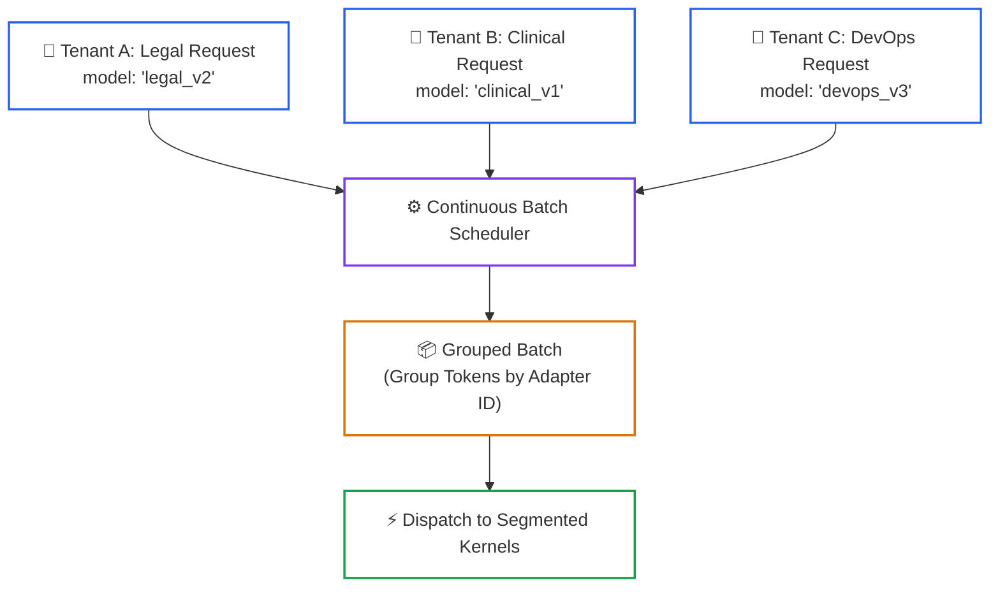
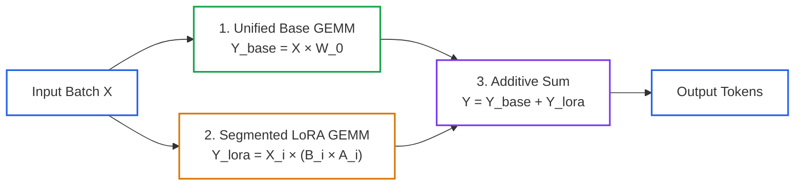

# Lesson 06: Dynamic Multi-LoRA Adapter Serving at Scale

> **Tier**: `🔵 Advanced` | **Read time**: ~16 min | **Prerequisites**: [Lesson 04: Continuous Batching, PagedAttention & RadixAttention](./04-vllm-continuous-batching-and-radixattention.md)  
> **Core Concept**: Serving hundreds of fine-tuned domain models on dedicated GPU clusters is economically unviable; dynamic Multi-LoRA runtimes host a single frozen base model and apply low-rank adapter matrices to disparate requests in the same batch.  
> **New AI terms introduced**: LoRA adapter, low-rank adaptation, segmented batched GEMM, adapter memory paging, S-LoRA  
> **AI terms assumed from earlier lessons**: [token](../00-foundations-and-token-mechanics/01-tokenization-and-bpe-mechanics.md), [continuous batching](./00-llm-serving-fundamentals-and-the-inference-lifecycle.md), [PagedAttention](./04-vllm-continuous-batching-and-radixattention.md)

---

## 🧩 The Problem: The Multi-Tenant Specialization Dilemma

In enterprise SaaS platforms or internal corporate infrastructure, different business units demand fine-tuned, specialized models:
- **Tenant A (Legal)**: Fine-tuned on NDA review and corporate precedent.
- **Tenant B (Healthcare)**: Fine-tuned on clinical coding and HIPAA terminology.
- **Tenant C (DevOps)**: Fine-tuned on infrastructure schemas and incident logs.

### The Dedicated Cluster Cost Wall
If an engineering team deploys a separate dedicated 70-billion parameter model cluster for every customer or department:
- Each 70B FP16 deployment requires an 8x H100 GPU node costing ≈ 20,000 USD/month.
- 50 enterprise tenants require 50 GPU clusters: **over 1,000,000 USD/month in infrastructure spend**.
- Because individual tenant traffic is bursty, average GPU utilization hovers below **5%**, leaving millions of dollars of hardware idle.

---

## 🧒 The Mental Model: The Universal Projector & Transparency Slides

Think of dynamic multi-adapter serving as an **Industrial Overhead Projector with Transparency Overlays**:

```text
┌──────────────────────────────────────────────────────────┐
│               MULTI-LORA SERVING METAPHOR                │
├────────────────────────────┬─────────────────────────────┤
│ 1. Overhead Projector      │ 2. Transparency Slides      │
│    (Frozen Base Model)     │    (LoRA Adapters)          │
│                            │                             │
│ • Massive 140 GB lens.     │ • Thin 50 MB plastic sheet. │
│ • Provides general grammar │ • Modifies the projection   │
│   and reasoning power.     │   for a specific subject.   │
│ • Never swapped out.       │ • Easily swapped in ms.     │
└────────────────────────────┴─────────────────────────────┘
```

- **The Projector (Frozen Base Model)**: Emits high-powered general linguistic and reasoning intelligence (140 GB).
- **The Slides (LoRA Adapters)**: Thin, lightweight transparency overlays (50 MB each).
- **The Batch**: Advanced Tensor Core kernels allow the projector to shine light through Slide A on the left side of the room, Slide B in the center, and Slide C on the right side simultaneously in a single flash!

> ⚠️ **Where this analogy breaks**: A physical projector can only overlay slides across the entire beam. In GPU execution, a single forward pass must split the input tensor into slices, applying different adapter matrix multiplications to different tokens in the batch.

---

## ⚠️ Why Naive Adapter Merging Fails

To avoid running multiple clusters, developers sometimes attempt to merge adapter weights permanently into the base model:

```text
W_merged = W_0 + (B × A)
```

While merged weights introduce zero runtime latency overhead, merging **permanently mutates the base weights**:
- You must save a full 140 GB checkpoint for every tenant.
- Switching between tenant models requires reloading 140 GB over the PCIe bus (causing 30–60 seconds of downtime).
- You cannot batch requests from Tenant A and Tenant B into the same forward pass.

### The Production Solution: Dynamic Multi-LoRA Serving (S-LoRA)
Rather than merging weights or deploying isolated clusters, the system deploys **Dynamic Multi-LoRA Serving**:
1. A single shared GPU cluster hosts one frozen base model (e.g., Llama 3.3 70B).
2. Specialized fine-tuned adaptations are stored as lightweight **LoRA adapter matrices** (~50 MB each).
3. The inference engine uses **Segmented Batched GEMM** kernels to apply different adapter matrices to different sequences in the same continuous batch.

---

## ⚙️ Core Multi-LoRA Mechanisms: One Term at a Time



### Walkthrough of Multi-Tenant Batch Grouping
1. **Multi-Tenant Ingress**: Requests arrive specifying distinct fine-tuned adapter targets via standard `model` request headers.
2. **Unified Scheduling**: The continuous batching scheduler admits requests for Tenant A, B, and C into a single execution step.
3. **Batch Grouping**: The engine groups sequence tokens by their target adapter ID.
4. **Kernel Dispatch**: Slices are dispatched to segmented GPU kernels without interrupting the base forward pass.

---

### Mechanism 1: Low-Rank Adaptation (LoRA) Matrix Mathematics

- 🧒 **Analogy**: Instead of repainting an entire house, placing custom colored slipcovers over the existing furniture: you change the room's appearance using 1% of the material.
- ⚙️ **Engineering**: 
  - Base model weights W_0 in R^(d × k) remain permanently frozen.
  - The fine-tuned adaptation update ΔW is decomposed into two low-rank matrices:
    ```text
    W = W_0 + ΔW = W_0 + (alpha / r) × (B × A)

    Where:
    W_0 in R^(d × k)  (Frozen base weights, e.g. 4096 × 4096)
    B in R^(d × r)    (Initialized to 0)
    A in R^(r × k)    (Initialized with Gaussian distribution)
    r << min(d, k)    (Rank, typically r = 8, 16, or 32)
    ```
  - For dimension d = 4,096 and rank r = 16:
    - Base parameters: 4,096 × 4,096 = 16,777,216.
    - Adapter parameters: (4,096 × 16) + (16 × 4,096) = 131,072.
  - **Storage Reduction**: **99.2% parameter reduction!** A 140 GB model's adaptation fits in 50 MB.
- ⚠️ **What breaks if you skip this**: Storing and deploying full model checkpoints costs millions of dollars in redundant disk, network, and GPU memory overhead.

---

### Mechanism 2: Segmented Batched GEMM (Punica / S-LoRA)



### Walkthrough of Segmented GEMM Execution
1. **Unified Base Forward Pass**: Tensor Cores multiply all batch tokens against the shared base weights W_0 in a single large, high-efficiency matrix multiplication.
2. **Segmented Delta Computation**: Special GPU kernels (Punica / S-LoRA) compute low-rank products specifically for the token slices assigned to each tenant adapter.
3. **Additive Combination**: The adapter deltas are added directly to the base activations, emitting customized token outputs with < 3% latency overhead.

- 🧒 **Analogy**: A master baker baking 50 plain vanilla cakes in one industrial oven, then having apprentices pipe custom icing designs onto each cake as they roll out.
- ⚙️ **Engineering**: 
  - Standard PyTorch cannot execute batched GEMMs where different rows multiply against different weight matrices.
  - Segmented GEMM kernels partition the input tensor into segments by adapter pointer, calculating `Y_i = X_i × W_0 + X_i × (B_i × A_i)` in parallel.
- ⚠️ **What breaks if you skip this**: Without segmented GEMMs, you cannot batch different tenant models together, destroying throughput.

---

### Mechanism 3: Multi-Tier Adapter Memory Paging (Host RAM to GPU VRAM)

- 🧒 **Analogy**: An artist keeping their 4 most-used paint tubes on the palette while 50 other tubes sit in a nearby toolbox, swapping tubes in seconds when needed.
- ⚙️ **Engineering**: 
  - **GPU VRAM Adapter Pool**: The engine reserves a fixed VRAM space (e.g., 4 GB) holding up to 64 active adapters.
  - **Host RAM Backing**: Inactive adapters reside in host CPU memory (RAM) or fast NVMe storage.
  - **Asynchronous Prefetching**: When a request for an uncached adapter arrives, the gateway pages the 50 MB weights across PCIe Gen 5 in < 2ms, hiding the transfer behind active prefill GEMMs.
- ⚠️ **What breaks if you skip this**: Pre-loading all 500 enterprise adapters directly into VRAM causes out-of-memory crashes; fetching adapters from cloud object stores on demand adds seconds of latency.

---

## 💻 Typed Offline Runnable Implementation: Multi-LoRA Engine

The following complete script demonstrates multi-tenant adapter registration, memory paging, and segmented batch grouping:

```python
"""
Multi-LoRA Serving Engine Simulator: Demonstrates dynamic adapter paging and batch dispatch.
Executes offline using Python 3.12+ standard library and Pydantic v2.
"""

from typing import Dict, List, Optional
from pydantic import BaseModel, Field


class AdapterMetadata(BaseModel):
    adapter_id: str
    tenant_id: str
    rank: int = 16
    vram_bytes: int = 50 * 1024 * 1024  # 50 MB
    is_active_in_gpu: bool = False


class InferenceRequest(BaseModel):
    request_id: str
    tenant_id: str
    adapter_id: str
    prompt: str


class MultiLoRAServingEngine:
    """Simulates S-LoRA dynamic adapter registry, memory pooling, and batch grouping."""

    def __init__(self, max_gpu_adapters: int = 2) -> None:
        self.max_gpu_adapters = max_gpu_adapters
        self.adapter_registry: Dict[str, AdapterMetadata] = {}
        self.gpu_active_adapters: List[str] = []

    def register_adapter(self, meta: AdapterMetadata) -> None:
        self.adapter_registry[meta.adapter_id] = meta

    def _ensure_adapter_loaded(self, adapter_id: str) -> None:
        if adapter_id in self.gpu_active_adapters:
            return  # Cache hit in GPU VRAM

        # LRU Eviction if GPU adapter pool is full
        if len(self.gpu_active_adapters) >= self.max_gpu_adapters:
            evicted = self.gpu_active_adapters.pop(0)
            self.adapter_registry[evicted].is_active_in_gpu = False
            print(
                f"[PAGE OUT] Evicted '{evicted}' from GPU pool back to Host RAM."
            )

        # Page in new adapter
        self.gpu_active_adapters.append(adapter_id)
        self.adapter_registry[adapter_id].is_active_in_gpu = True
        print(f"[PAGE IN] Paged '{adapter_id}' into GPU VRAM pool.")

    def schedule_batch(
        self, requests: List[InferenceRequest]
    ) -> Dict[str, List[InferenceRequest]]:
        """Groups requests by adapter and pages missing adapters into GPU memory."""
        grouped: Dict[str, List[InferenceRequest]] = {}
        for req in requests:
            if req.adapter_id not in self.adapter_registry:
                raise ValueError(f"Unknown adapter: {req.adapter_id}")

            self._ensure_adapter_loaded(req.adapter_id)
            if req.adapter_id not in grouped:
                grouped[req.adapter_id] = []
            grouped[req.adapter_id].append(req)
        return grouped

    def execute_forward_pass(
        self, grouped_batch: Dict[str, List[InferenceRequest]]
    ) -> None:
        total_reqs = sum(len(reqs) for reqs in grouped_batch.values())
        print(
            f"\n--- Forward Pass: {total_reqs} Requests across {len(grouped_batch)} Distinct Adapters ---"
        )
        print("1. Computing Unified Base GEMM: X * W_0 across all sequences.")
        for adapter_id, reqs in grouped_batch.items():
            print(
                f"2. Segmented LoRA GEMM: Applied Delta W_{adapter_id} for {len(reqs)} requests."
            )
        print(
            "3. Emitting customized completions with zero multi-cluster waste!"
        )


def main() -> None:
    engine = MultiLoRAServingEngine(max_gpu_adapters=2)

    # Register 3 specialized tenant adapters
    engine.register_adapter(
        AdapterMetadata(adapter_id="legal_v2", tenant_id="tenant_alpha")
    )
    engine.register_adapter(
        AdapterMetadata(adapter_id="clinical_v1", tenant_id="tenant_beta")
    )
    engine.register_adapter(
        AdapterMetadata(adapter_id="devops_v3", tenant_id="tenant_gamma")
    )

    print("================ DYNAMIC MULTI-LORA SERVING ================")

    # Incoming batch targeting 3 distinct tenant adapters
    batch = [
        InferenceRequest(
            request_id="r1",
            tenant_id="tenant_alpha",
            adapter_id="legal_v2",
            prompt="Analyze clause 4",
        ),
        InferenceRequest(
            request_id="r2",
            tenant_id="tenant_beta",
            adapter_id="clinical_v1",
            prompt="ICD-10 coding review",
        ),
        InferenceRequest(
            request_id="r3",
            tenant_id="tenant_gamma",
            adapter_id="devops_v3",
            prompt="Kubernetes YAML syntax",
        ),
    ]

    grouped_batch = engine.schedule_batch(batch)
    engine.execute_forward_pass(grouped_batch)
    print("============================================================")


if __name__ == "__main__":
    main()
```

### Verified Execution Output

```text
================ DYNAMIC MULTI-LORA SERVING ================
[PAGE IN] Paged 'legal_v2' into GPU VRAM pool.
[PAGE IN] Paged 'clinical_v1' into GPU VRAM pool.
[PAGE OUT] Evicted 'legal_v2' from GPU pool back to Host RAM.
[PAGE IN] Paged 'devops_v3' into GPU VRAM pool.

--- Forward Pass: 3 Requests across 3 Distinct Adapters ---
1. Computing Unified Base GEMM: X * W_0 across all sequences.
2. Segmented LoRA GEMM: Applied Delta W_legal_v2 for 1 requests.
2. Segmented LoRA GEMM: Applied Delta W_clinical_v1 for 1 requests.
2. Segmented LoRA GEMM: Applied Delta W_devops_v3 for 1 requests.
3. Emitting customized completions with zero multi-cluster waste!
============================================================
```

---

## ⚖️ Trade-offs & Engineering Failure Modes

| Customization Strategy | Infrastructure Cost | Domain Precision | Latency Overhead | Max Tenants Supported |
|---|---|---|---|---|
| **In-Context Prompting** | High (Inflates prompt tokens). | Moderate. | High TTFT (Extra tokens). | Unlimited (No weights). |
| **Dedicated Full Models** | Astronomical (~20,000 USD/mo/model). | **Highest.** | Zero adapter overhead. | Very Low (< 5 due to cost). |
| **Dynamic Multi-LoRA (vLLM)** | **Lowest (Shared cluster).** | **High (Custom weights).** | Negligible (< 3% latency delta). | **Hundreds (100–500+).** |

---

## ✅ Quick Check

Your engineering team serves 80 distinct customer LoRA adapters on an 8x H100 vLLM cluster with `--max-loras 16`. During morning peak hours, your GPU metrics dashboard indicates that generation throughput drops by 40%, and your PCIe bus utilization spikes to 95%.

**What is happening, and how does gateway-level affinity routing resolve it?**

<details>
<summary>Click to reveal the production architectural explanation</summary>

This issue is caused by **Adapter Memory Thrashing (Page-In Storm)**.

Because your GPU adapter pool holds only 16 active adapters while 80 distinct adapters receive traffic, random request scheduling forces the engine to evict and reload 50 MB adapter weights over the PCIe bus on almost every single continuous batch step. The PCIe bus saturates, stalling GPU execution.

**Production Solution**:
Implement **Adapter-Affinity Routing** at the AI Gateway layer:
1. The gateway routes requests for the same adapter ID to the same engine instance.
2. The batch scheduler clusters requests for identical adapters into consecutive iterations, ensuring high cache hit rates in the GPU adapter pool.
3. You increase `--max-loras` to match high-frequency tenants and set `--max-cpu-loras` to keep warm adapters in host RAM.

</details>

---

## 🧭 Navigation

### Phase Progression
- **Previous Lesson**: **[← Lesson 05: Speculative Decoding & Modern Hardware Quantization](./05-speculative-decoding-and-model-quantization.md)**
- **Phase Hub**: **[Phase 07: High-Throughput Serving & LLMOps Hub](./README.md)**
- **Next Lesson**: **[Lesson 07: Edge AI, Local Runtimes & Hybrid Cloud Routing →](./07-edge-ai-and-client-side-inference.md)**
- **Capstone Lab**: **[Capstone Lab: Production Resilient AI Gateway](./labs/capstone-production-ai-gateway.md)**
