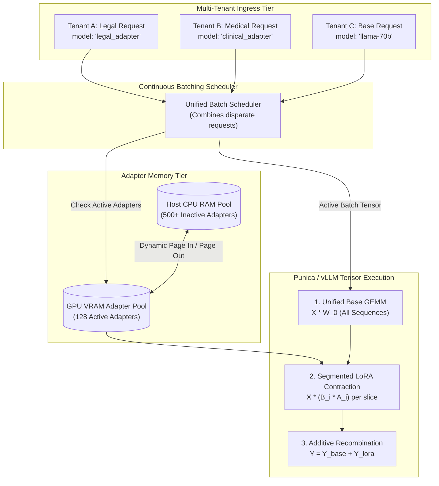

# Dynamic Multi-LoRA Adapter Serving: Multi-Tenant Specialization on Shared Base Clusters

> **[Tier: 🔵 Advanced]**  
> **Architecting high-density multi-tenant serving infrastructure: serving hundreds of fine-tuned task-specific Low-Rank Adaptation (LoRA) adapters concurrently on a single shared base model cluster using S-LoRA and vLLM.**

---

## 🎯 What You Will Learn

- Why deploying dedicated GPU clusters for every fine-tuned enterprise model is financially unviable.
- The mathematical foundations of Low-Rank Adaptation (LoRA) and how it enables sub-100MB adapter checkpoints.
- How S-LoRA and Punica execute Batched Segmented GEMMs to process requests targeting different adapters in the same forward pass.
- How to configure production vLLM clusters to serve hundreds of dynamic adapters with on-demand host RAM paging.

---

## 1. The Problem: The Multi-Tenant Specialization Dilemma

In an enterprise SaaS platform or large corporate environment, different business domains require specialized models:
- Tenant A (Legal Division): Requires a model fine-tuned on NDA and contract precedent.
- Tenant B (Healthcare Division): Requires a model fine-tuned on clinical coding and HIPAA compliance.
- Tenant C (DevOps Team): Requires a model fine-tuned on internal infrastructure schemas.

### The Financial & Operational Wall
If an engineering team deploys a separate dedicated 70B parameter model cluster for every customer or department:
- Each 70B FP16 deployment requires an 8x H100 node costing ~20,000 USD/month.
- 50 specialized enterprise tenants require 50 GPU clusters: **1,000,000 USD/month in infrastructure spend**.
- Because individual tenant traffic is bursty, average GPU compute utilization hovers below **5%**, leaving millions of dollars of hardware sitting idle.

---

## 2. The Core Idea & Why Naive Fails

### Why Naive Adapter Merging Fails
To avoid multi-cluster costs, engineers sometimes attempt to merge fine-tuned adapter weights back into the base model weights:

```text
W_merged = W_0 + (B * A)
```

While merging produces zero inference overhead, it **permanently mutates the weights**:
- You must save a full 140 GB checkpoint for every customer.
- Switching between customer models requires reloading 140 GB across the PCI-e/NVLink bus (taking 30–60 seconds of downtime).
- You cannot batch requests from Tenant A and Tenant B into the same forward pass.

### The Engineering Solution: Dynamic Multi-LoRA Serving (S-LoRA)
Rather than merging weights or deploying isolated clusters, the system deploys **Dynamic Multi-LoRA Serving**:
1. A single shared GPU cluster hosts one frozen base model (e.g., Llama-3.3-70B).
2. Specialized fine-tuned adaptations are stored as lightweight **LoRA adapter matrices** (~50 MB each).
3. The inference engine uses **Batched Segmented GEMM** kernels to apply different adapter matrices to different sequences in the same continuous batch!

---

## 3. Mental Model: The Universal Projector & Specialized Transparency Slides

```text
Traditional Dedicated Serving (Extreme Waste):
[ 70B Model Cluster A: Legal ]    ──> Serves Tenant A (95% Idle VRAM)
[ 70B Model Cluster B: Medical ]  ──> Serves Tenant B (95% Idle VRAM)
[ 70B Model Cluster C: Code ]     ──> Serves Tenant C (95% Idle VRAM)

Dynamic Multi-LoRA Serving (S-LoRA):
┌─────────────────────────────────────────────────────────────────┐
│               SHARED 70B BASE MODEL CLUSTER                     │
│               Frozen Base Weights: W_0 (140 GB)                 │
│                                                                 │
│   Active Batch:                                                 │
│   • Request 1 (Legal)   ──> Add Delta W_Legal   (50 MB Slide)   │
│   • Request 2 (Medical) ──> Add Delta W_Medical (50 MB Slide)   │
│   • Request 3 (Code)    ──> Add Delta W_Code    (50 MB Slide)   │
│                                                                 │
│   GPU Tensor Cores compute all 3 requests in 1 forward pass!    │
└─────────────────────────────────────────────────────────────────┘
```

- **The Projector (Frozen Base Model)**: Emits high-powered general linguistic and reasoning intelligence (140 GB).
- **The Slides (LoRA Adapters)**: Thin, lightweight transparency overlays (50 MB).
- **The Batch**: The projector is capable of shining light through Slide A on the left side of the room, Slide B in the center, and Slide C on the right side simultaneously in a single flash.

---

## 4. How It Works: Step-by-Step Mechanics

### A. Mathematical Foundations of LoRA
During fine-tuning, full model weights W_0 in R^(d x k) are kept frozen. The adaptation is constrained by decomposing the weight update ΔW into two low-rank matrices:

```text
W = W_0 + Delta_W = W_0 + (alpha / r) * (B * A)

Where:
W_0 in R^(d x k)  (Frozen base weights, e.g. 4096 x 4096)
B in R^(d x r)    (Initialized to 0)
A in R^(r x k)    (Initialized with Gaussian distribution)
r << min(d, k)    (Rank, typically r = 8, 16, or 32)
alpha             (Scaling constant)
```

Because rank r is tiny (e.g. r = 16):
- Number of parameters in W_0: 4096 × 4096 = 16,777,216.
- Number of parameters in B × A: (4096 × 16) + (16 × 4096) = 131,072.
- **Parameter Footprint Reduction**: **99.2% reduction in storage!**

---

### B. Segmented Batched GEMM (Punica / S-LoRA)
In standard inference, a batch forward pass performs matrix multiplication:

```text
Y = X * W_0
```

Under Dynamic Multi-LoRA serving, different tokens in input matrix X require different adapters:

```text
Input Batch:
Token 0 (Req A, Adapter 1): Y_0 = X_0 * W_0 + X_0 * (B_1 * A_1)
Token 1 (Req B, Adapter 2): Y_1 = X_1 * W_0 + X_1 * (B_2 * A_2)
Token 2 (Req C, Adapter 1): Y_2 = X_2 * W_0 + X_2 * (B_1 * A_1)
```

The engine executes this in two phases:
1. **Base Computation (Unified GEMM)**: Compute Y_base = X * W_0 across the entire batch in a single high-efficiency Tensor Core operation.
2. **Adapter Computation (Segmented GEMM)**: Group tokens by adapter ID and execute lightweight segmented GEMMs for the low-rank delta updates, adding results back to Y_base.

---

### C. Unified Memory Pooling & Paging
To serve thousands of adapters without exhausting GPU VRAM:
- **Adapter Space Pool**: vLLM/S-LoRA allocates a fixed memory pool in GPU VRAM (e.g., 4 GB) reserved exclusively for active adapter weights.
- **Host RAM Backing**: Inactive adapters reside in host CPU memory (RAM) or fast NVMe storage.
- **Dynamic Swapping**: When a request for Adapter #42 arrives, the engine asynchronously pages its 50 MB weights into the GPU adapter pool prior to iteration execution.

---

## 5. Concrete Scenario & Code Implementation

The following Python 3.12+ code provides an educational simulation of a **Multi-Tenant Dynamic Adapter Router and Segmented Forward Pass Dispatcher**:

```python
from typing import Dict, List, Optional
from pydantic import BaseModel, Field

class AdapterMetadata(BaseModel):
    adapter_id: str
    tenant_id: str
    rank: int = 16
    vram_bytes: int = 50 * 1024 * 1024  # 50 MB
    is_active_in_gpu: bool = False

class InferenceRequest(BaseModel):
    request_id: str
    tenant_id: str
    adapter_id: str
    tokens: List[int]

class MultiLoRAServingEngine:
    """
    Demonstrates dynamic adapter registry, memory pooling, and batch grouping.
    """
    def __init__(self, max_gpu_adapters: int = 4):
        self.max_gpu_adapters = max_gpu_adapters
        self.adapter_registry: Dict[str, AdapterMetadata] = {}
        self.gpu_active_adapters: List[str] = []

    def register_adapter(self, meta: AdapterMetadata) -> None:
        self.adapter_registry[meta.adapter_id] = meta

    def schedule_batch(self, requests: List[InferenceRequest]) -> Dict[str, List[InferenceRequest]]:
        """
        Groups requests by adapter and pages missing adapters into GPU memory.
        """
        adapter_batches: Dict[str, List[InferenceRequest]] = {}

        for req in requests:
            if req.adapter_id not in self.adapter_registry:
                raise ValueError(f"Unknown adapter: {req.adapter_id}")

            # Ensure adapter is loaded in GPU VRAM
            self._ensure_adapter_loaded(req.adapter_id)

            if req.adapter_id not in adapter_batches:
                adapter_batches[req.adapter_id] = []
            adapter_batches[req.adapter_id].append(req)

        return adapter_batches

    def _ensure_adapter_loaded(self, adapter_id: str) -> None:
        if adapter_id in self.gpu_active_adapters:
            return  # Cache hit

        # LRU Eviction if GPU adapter pool is full
        if len(self.gpu_active_adapters) >= self.max_gpu_adapters:
            evicted = self.gpu_active_adapters.pop(0)
            self.adapter_registry[evicted].is_active_in_gpu = False
            print(f"[PAGE OUT] Evicted adapter '{evicted}' from GPU pool to Host RAM.")

        # Page in new adapter
        self.gpu_active_adapters.append(adapter_id)
        self.adapter_registry[adapter_id].is_active_in_gpu = True
        print(f"[PAGE IN] Paged adapter '{adapter_id}' into GPU VRAM pool.")

    def execute_forward_pass(self, grouped_batch: Dict[str, List[InferenceRequest]]) -> None:
        total_requests = sum(len(reqs) for reqs in grouped_batch.values())
        print(f"\n--- Executing Forward Pass for {total_requests} Requests across {len(grouped_batch)} Adapters ---")
        print("1. Computing unified base GEMM: X * W_0 on Tensor Cores.")
        for adapter_id, reqs in grouped_batch.items():
            print(f"2. Segmented GEMM: Applying Delta W_{adapter_id} for {len(reqs)} requests.")
        print("3. Forward pass complete. Emitting tokens.")
```

---

## 6. Engineering Solutions: Production vLLM Multi-LoRA Configuration

To launch a production multi-LoRA serving cluster using vLLM on an 8x H100 node:

```bash
# Launch vLLM with dynamic Multi-LoRA support
vllm serve meta-llama/Llama-3.3-70B-Instruct \
    --tensor-parallel-size 8 \
    --enable-lora \
    --max-loras 128 \
    --max-lora-rank 64 \
    --max-cpu-loras 512 \
    --lora-modules \
        legal_expert=/models/adapters/legal-v2 \
        clinical_expert=/models/adapters/clinical-v1 \
        devops_expert=/models/adapters/devops-v3
```

### Parameter Rationale:
- `--enable-lora`: Activates Punica/S-LoRA segmented GEMM execution kernels.
- `--max-loras 128`: Reserves GPU VRAM memory space to hold up to 128 distinct active LoRA adapters simultaneously.
- `--max-lora-rank 64`: Allocates scratchpad buffers capable of supporting adapter ranks up to r = 64.
- `--max-cpu-loras 512`: Maintains up to 512 cached adapters in host CPU RAM, enabling sub-100ms page-in times when demand shifts.
- `--lora-modules`: Pre-registers warm named adapters accessible via standard OpenAI-compatible `model` parameter requests:
  ```json
  {"model": "legal_expert", "prompt": "Analyze clause 4..."}
  ```

---

## 7. Architecture & Telemetry View



### Visual Walkthrough
1. **Multi-Tenant Ingress**: Requests arrive specifying distinct fine-tuned adapter targets via the `model` header or payload.
2. **Unified Batching**: The scheduler admits requests for Tenant A, Tenant B, and the base model into the same continuous batch.
3. **Adapter Memory Paging**: The memory manager verifies that the required adapter weights are present in the GPU VRAM pool. If missing, it asynchronously pages the 50 MB weights from host CPU RAM.
4. **Segmented Execution**:
   - First, the base model weights compute the general representation for all requests in a single large GEMM.
   - Second, segmented kernels compute the low-rank delta adjustments specifically for the tokens assigned to each adapter.
   - Third, the outputs are summed and emitted, providing customized domain responses with zero isolated cluster overhead.

---

## 8. Common Failure Modes & Production Anti-Patterns

| Anti-Pattern | Root Cause | Engineering Solution |
|---|---|---|
| **Base Model Checkpoint Mismatch** | Loading an adapter fine-tuned on Llama-3-70B onto a Llama-3.3-70B base model, resulting in nonsensical output. | Enforce strict hash verification between base model architecture/weights and adapter config (`base_model_name_or_path`). |
| **Adapter Thrashing (Page-In Storm)** | Batch scheduler admits requests for 200 distinct adapters when `--max-loras` is set to 32, thrashing the PCI-e bus. | Implement adapter-affinity routing in the gateway: cluster requests for the same adapter into adjacent iterations. |
| **Rank Over-Allocation Waste** | Sizing the buffer for `max_lora_rank 128` when 95% of adapters use r = 8 or r = 16, wasting GPU VRAM. | Standardize organizational fine-tuning pipelines on uniform rank sizes (r = 16 or r = 32) to eliminate fragmentation. |
| **Unbounded CPU RAM Growth** | Dynamically downloading thousands of untracked adapters from cloud object stores without eviction. | Configure `--max-cpu-loras` with strict LRU eviction to local disk or object storage. |

---

## 9. Production View & Evaluation: Serving TCO Metrics

Multi-LoRA efficiency is measured using the following key operational metrics:

1. **Adapter Density Factor (D_adapter)**:
   - Formulated as:
   ```text
   D_adapter = Total_Active_Served_Adapters / GPU_Nodes
   ```
   - Target D_adapter ≥ 16 adapters per GPU node.
2. **PCI-e Swap Latency Overhead**:
   - Time required to page an adapter from host RAM to GPU VRAM.
   - For a 50 MB adapter over PCI-e Gen 5 (64 GB/s), swap latency is < 2ms, which can be hidden behind active prefill GEMMs.
3. **Total Cost of Ownership (TCO) Reduction**:
   - Compared to dedicated cluster hosting, serving 50 domain models on a shared 8x H100 cluster reduces infrastructure bills by **85–92%**.

---

## 10. When Should You Use It? (Trade-off Matrix)

| Customization Strategy | Infrastructure Cost | Domain Precision | Latency Overhead | Max Tenants Supported |
|---|---|---|---|---|
| **In-Context Prompting (Few-Shot)** | High (Inflates prompt token costs) | Low to Medium | High TTFT (Extra prompt tokens) | Unlimited (No weights) |
| **Dedicated Full Fine-Tuned Models** | Astronomical (~20,000 USD/month per model) | **Highest** | Zero adapter overhead | Very Low (< 5 due to cost) |
| **Dynamic Multi-LoRA (S-LoRA/vLLM)** | **Low (Single shared cluster)** | **High (Task-specific weights)** | Negligible (< 3% latency penalty) | **Hundreds (100–500+)** |

---

## 💡 11. Senior Interview Perspective

### Architectural Scenario: Multi-Tenant Enterprise Model Specialization
**Interviewer**: *"We have 150 enterprise clients, each demanding a customized model fine-tuned on their corporate compliance guidelines. Our finance team rejected the proposal to spin up 150 dedicated GPU clusters. How do you satisfy these customization requirements within a realistic infrastructure budget?"*

**Architectural Defense**:
> *"We architect a **Dynamic Multi-LoRA Serving Tier** powered by vLLM and S-LoRA on a shared base cluster:*
> 1. *Instead of full parameter fine-tuning, we train **Low-Rank Adaptation (LoRA)** adapters with rank r = 16. This freezes the base 70B model and produces lightweight ~50 MB adapter weights for each client.*
> 2. *We deploy a shared 8x H100 cluster running vLLM with `--enable-lora` and `--max-loras 128`. The 140 GB base model remains permanently pinned in GPU memory.*
> 3. *All 150 client adapters are stored in host CPU memory. When client requests arrive, the Punica segmented GEMM kernel dynamically applies tenant-specific adapter matrices to individual tokens in the active batch.*
> 4. *This reduces our infrastructure requirement from 150 dedicated clusters to **just 2 shared clusters** (for high availability), slashing monthly operational costs by over 90% while providing 100% tenant-isolated model customization."*

---

## 12. Key Takeaways & Verified Resources

- **LoRA compresses adaptation into low-rank matrices**: Sub-100MB checkpoints replace 140GB full-model duplicates.
- **Segmented GEMMs enable unified continuous batching**: Requests for disparate adapters run simultaneously in the same GPU forward pass.
- **Dynamic memory paging scales to hundreds of tenants**: Inactive adapters reside in host RAM and page into GPU memory on demand.

### Authoritative Primary Sources
- **LoRA: Low-Rank Adaptation of Large Language Models**: Hu et al., ICLR 2022. [arXiv:2106.09685](https://arxiv.org/abs/2106.09685)
- **S-LoRA: Serving Thousands of Concurrent LoRA Adapters**: Sheng et al., MLSys 2024. [arXiv:2311.03285](https://arxiv.org/abs/2311.03285)
- **Punica: Multi-Tenant LoRA Serving**: Chen et al., 2023. [arXiv:2310.18547](https://arxiv.org/abs/2310.18547)
- **vLLM Multi-LoRA Documentation**: [docs.vllm.ai/en/latest/models/lora.html](https://docs.vllm.ai)

---

## 🧭 Navigation

- **[← Previous Lesson: Speculative Decoding & Modern Hardware Quantization](./05-speculative-decoding-and-model-quantization.md)**
- **[Phase 07 Hub: Orientation & Navigation](./README.md)**
- **[Next Lesson: Edge AI, Local Runtimes & Hybrid Cloud Routing →](./07-edge-ai-and-client-side-inference.md)**
- **[Hands-On Lab: Resilient Multi-Provider AI Gateway](./labs/capstone-production-ai-gateway.md)**
