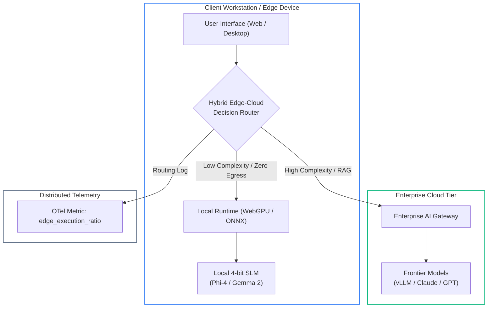

# Edge AI, Local Model Runtimes & Hybrid Cloud-Device Routing

> **Tier**: 🔵 Advanced  
> **Estimated Reading Time**: 16 minutes  
> **Prerequisites**: Lesson 01 (Resilient AI Gateways), Lesson 06 (Dynamic Multi-LoRA Serving)  
> **Core Concept**: Hybrid edge-cloud routing delegates routine tasks and privacy-sensitive data to client-side Small Language Models (SLMs) via WebGPU or local runtimes, dispatching complex reasoning to cloud gateways.

---

### Term Ledger
| Term | Status | Definition / Clarification |
| :--- | :--- | :--- |
| **Small Language Model (SLM)** | Introduced | A compact neural network (1B to 4B parameters) optimized to execute directly on consumer CPUs, GPUs, or NPUs with minimal memory footprints. |
| **WebGPU** | Introduced | A modern web browser API providing direct, low-level hardware acceleration to browser tabs without installing native drivers. |
| **WebLLM** | Introduced | A high-performance in-browser serving engine that runs quantized models directly on WebGPU in client browser tabs. |
| **ONNX Runtime GenAI** | Introduced | A native cross-platform execution engine for running generative models on Windows, Linux, and edge IoT devices via DirectML or CPU. |
| **Hybrid Edge-Cloud Routing** | Introduced | An architecture where client devices resolve low-latency and privacy-sensitive requests locally, falling back to centralized cloud models for heavy reasoning. |
| **Token** | Assumed | Basic chunk of processed text from earlier lessons. |
| **Quantization** | Assumed | Technique reducing weight precision (for example, FP16 to INT4) to save VRAM and memory bandwidth. |
| **AI Gateway** | Assumed | Centralized reverse proxy handling routing, fallbacks, and rate limiting across model endpoints. |
| **vLLM** | Assumed | High-throughput server engine using PagedAttention for large model deployments. |

---

## 1. The Problem: The Cloud-Only Bottleneck

While cloud foundation models deliver frontier reasoning capabilities, relying exclusively on centralized hyperscaler APIs creates insurmountable barriers in four enterprise scenarios:

1. **Zero Data Egress Mandates**: Strict compliance regulations (HIPAA, GDPR, defense, banking) often prohibit transmitting sensitive customer data, medical records, or proprietary source code to third-party cloud servers.
2. **Offline Field Realities**: Industrial manufacturing floors, naval vessels, commercial aviation cockpits, and mobile field workers frequently operate in disconnected or intermittent network environments where cloud API calls fail.
3. **Per-Token Financial Saturation**: Deploying cloud models for high-frequency, low-complexity tasks (e.g., auto-complete keystrokes, local log parsing, form validation) incurs crushing token expenses.
4. **Network Jitter & Round-Trip Latency**: Even the fastest cloud models require 100–300ms of raw network transit time before model processing begins, failing sub-50ms interactive requirements.

---

## 2. The Core Idea & Why Naive Fails

### Why Naive Edge Deployment Fails
When teams attempt to move models to client devices, they frequently run into hardware boundaries:
- **The 4GB Browser Tab Crash**: Attempting to load an unquantized 7B parameter model in a browser via WebAssembly consumes > 8 GB of memory, instantly crashing browser tabs and freezing client operating systems.
- **Thermal Throttling**: Running continuous autoregressive loops on mobile devices or laptops pegs consumer CPUs/GPUs at 100%, causing severe thermal throttling, fan noise, and battery depletion within minutes.
- **Capability Gaps**: A 3B parameter Small Language Model (SLM) cannot reliably execute 10-step multi-agent planning or write complex distributed systems code.

### The Engineering Solution: The Tiered Edge-to-Cloud Continuum
The solution is a **Tiered Hybrid Architecture**:

```text
[ Client Device Tier (Edge) ]
  • Runtime: WebGPU, Apple MLX, Ollama, ONNX Runtime GenAI.
  • Model: 4-bit Quantized SLM (1B–4B parameters, e.g., Phi-4, Gemma 2, Llama-3.2).
  • Responsibilities: Keystroke autocompletion, PII redaction, intent routing, offline fallback.
                      │
                      ▼ (If complex reasoning or fresh web context required)
[ Enterprise Cloud Tier (AI Gateway) ]
  • Runtime: High-throughput vLLM cluster or frontier APIs (Claude 3.7, GPT-4o).
  • Responsibilities: Deep multi-step reasoning, massive context synthesis, RAG retrieval.
```

---

## 3. Mental Model: The Field Scout & Central Command

```text
[ FIELD SCOUT (Local Edge SLM) ]
Carries lightweight pack (2-4 GB VRAM).
Equipped for immediate local action:
• Instant reaction time (0ms network delay)
• Works in dead zones (100% offline)
• Preserves local secrecy (Zero data leaves device)
• Handles tactical tasks: parsing, filtering, immediate triage.

                │
                ▼ (Dispatches encrypted radio query if mission exceeds local capacity)
[ HEADQUARTERS (Cloud Frontier Model) ]
Heavy centralized supercomputer:
• Processes complex multi-domain intelligence
• Consults massive historical archives
• Formulates long-term strategic plans.
```

- **The Scout (Local SLM)**: Filters 80% of routine traffic on-device for zero marginal dollar cost and zero network latency.
- **The Headquarters (Cloud Gateway)**: Handles the 20% of high-complexity queries that genuinely require frontier reasoning power.

---

## 4. How It Works: Local Runtimes & Hardware Probing

### A. Comparison of Local Edge Runtimes

| Runtime Engine | Primary Hardware Target | Language / Bindings | Zero-Install? | Best Suited For |
|---|---|---|---|---|
| **WebLLM / WebGPU** | Browser GPU (Chrome, Edge, Safari) | JavaScript / TypeScript / Wasm | **Yes (100% web browser)** | Zero-install web apps, client-side document redaction. |
| **Apple MLX** | Apple Silicon Unified Memory (M1–M4) | Python / C++ / Swift | No | Mac developer tools, local creative workstations. |
| **Ollama / llama.cpp** | Cross-Platform (NVIDIA, AMD, Apple, CPU) | Go / C++ / CLI | No | Desktop apps, local developer background services. |
| **ONNX Runtime GenAI** | Windows (DirectML), Linux (CUDA), Mac | C# (.NET), Python, C++ | No | **Enterprise .NET desktop & edge IoT industrial appliances.** |

---

### B. Hardware Capability Probing (Pre-Flight Checks)
Before instantiating a local model runtime, the client application must probe device hardware constraints:

```text
Pre-Flight Hardware Check Pipeline:
1. Probe Available VRAM / Unified Memory:
   - If Available VRAM < 4 GB: ABORT local model loading. Route 100% to Cloud Gateway.
   - If 4 GB <= VRAM < 8 GB: Load 4-bit 1B-3B SLM (e.g. Llama-3.2-3B-Instruct-Q4).
   - If VRAM >= 16 GB: Load 4-bit 8B-14B SLM (e.g. Phi-4-Q4 or Llama-3.3-8B).

2. Probe Power Source & Battery State:
   - On battery power (< 20% remaining): Restrict local inference to short completions.

3. Probe Thermal State:
   - If OS reports thermal throttling: Throttle local generation and failover to Cloud.
```

---

## 5. Concrete Scenario & Code Implementation

The following Python 3.12+ implementation demonstrates a **Hybrid Edge-Cloud Client with Local SLM Execution, Privacy Boundary Enforcement, and Cloud Gateway Failover**:

```python
import asyncio
import time
from typing import Optional, Dict, Any
from pydantic import BaseModel, Field

class ChatMessage(BaseModel):
    role: str
    content: str

class HybridInferenceRequest(BaseModel):
    prompt: str
    require_privacy: bool = False
    complexity_hint: str = "auto"  # "low", "high", "auto"

class HybridInferenceResponse(BaseModel):
    content: str
    execution_location: str  # "LOCAL_EDGE_SLM" or "CLOUD_GATEWAY"
    model_name: str
    latency_ms: float

class HybridEdgeCloudClient:
    """
    Evaluates local execution constraints, attempts local SLM execution,
    and falls back seamlessly to the cloud gateway.
    """
    def __init__(self, local_available: bool = True):
        self.local_available = local_available
        self.local_model = "phi4:mini-4bit"
        self.cloud_model = "claude-3-7-sonnet"

    async def probe_local_runtime(self) -> bool:
        """Simulates probing local WebGPU/NPU device availability and memory budget."""
        await asyncio.sleep(0.01)
        return self.local_available

    async def execute(self, req: HybridInferenceRequest) -> HybridInferenceResponse:
        start_time = time.monotonic()
        is_local_healthy = await self.probe_local_runtime()

        # Decision Policy 1: Zero-egress privacy mandate
        if req.require_privacy:
            if not is_local_healthy:
                raise RuntimeError("Zero-egress privacy mandated, but local runtime is unavailable.")
            return await self._execute_local(req, start_time)

        # Decision Policy 2: Low-complexity edge-first execution
        if req.complexity_hint == "low" and is_local_healthy:
            try:
                return await self._execute_local(req, start_time)
            except Exception as local_err:
                print(f"[EDGE WARNING] Local inference failed: {local_err}. Falling back to cloud.")

        # Decision Policy 3: Default / High Complexity cloud gateway dispatch
        return await self._execute_cloud(req, start_time)

    async def _execute_local(self, req: HybridInferenceRequest, start_time: float) -> HybridInferenceResponse:
        # Simulate local NPU/GPU execution (zero network egress, ~40ms)
        await asyncio.sleep(0.04)
        latency = (time.monotonic() - start_time) * 1000.0
        return HybridInferenceResponse(
            content=f"Locally processed (zero-egress): {req.prompt.upper()}",
            execution_location="LOCAL_EDGE_SLM",
            model_name=self.local_model,
            latency_ms=round(latency, 2)
        )

    async def _execute_cloud(self, req: HybridInferenceRequest, start_time: float) -> HybridInferenceResponse:
        # Simulate Cloud Gateway dispatch (network round-trip + generation, ~180ms)
        await asyncio.sleep(0.18)
        latency = (time.monotonic() - start_time) * 1000.0
        return HybridInferenceResponse(
            content=f"Cloud synthesized frontier reasoning for: {req.prompt}",
            execution_location="CLOUD_GATEWAY",
            model_name=self.cloud_model,
            latency_ms=round(latency, 2)
        )

if __name__ == "__main__":
    async def main():
        client = HybridEdgeCloudClient(local_available=True)

        # 1. Low complexity task resolved on edge
        req1 = HybridInferenceRequest(prompt="Format name: Alice", complexity_hint="low")
        res1 = await client.execute(req1)
        print(f"Query 1: {res1.execution_location} | {res1.model_name} | {res1.latency_ms}ms -> {res1.content}")

        # 2. High complexity reasoning routed to cloud
        req2 = HybridInferenceRequest(prompt="Diagnose distributed deadlock in raft cluster", complexity_hint="high")
        res2 = await client.execute(req2)
        print(f"Query 2: {res2.execution_location} | {res2.model_name} | {res2.latency_ms}ms -> {res2.content}")

        # 3. Privacy sensitive task strictly held on edge
        req3 = HybridInferenceRequest(prompt="SSN: 000-12-3456 Patient: Bob", require_privacy=True)
        res3 = await client.execute(req3)
        print(f"Query 3 (Privacy): {res3.execution_location} | {res3.model_name} | {res3.latency_ms}ms -> {res3.content}")

    asyncio.run(main())
```

---

## 6. Engineering Solutions: Polyglot .NET 9 Client Architecture

In enterprise desktop environments (e.g. WPF, MAUI, or Windows background services), .NET 9 provides native local and cloud abstractions via `Microsoft.Extensions.AI`:

```csharp
// C# .NET 9: Hybrid IChatClient with Ollama Local Fallback
using System;
using System.Threading;
using System.Threading.Tasks;
using Microsoft.Extensions.AI;

public class HybridClientService
{
    private readonly IChatClient _localClient;
    private readonly IChatClient _cloudClient;

    public HybridClientService(IChatClient localClient, IChatClient cloudClient)
    {
        _localClient = localClient;
        _cloudClient = cloudClient;
    }

    public async Task<ChatResponse> ExecuteWithFallbackAsync(
        string prompt, 
        bool forceLocal, 
        CancellationToken ct = default)
    {
        if (forceLocal)
        {
            // Execute on local Ollama / ONNX instance (zero-egress guarantee)
            return await _localClient.GetResponseAsync(prompt, cancellationToken: ct);
        }

        try
        {
            // Primary: Attempt high-speed local SLM for short prompts
            if (prompt.Length < 200)
            {
                using var cts = CancellationTokenSource.CreateLinkedTokenSource(ct);
                cts.CancelAfter(TimeSpan.FromSeconds(2)); // Fast 2s local deadline
                return await _localClient.GetResponseAsync(prompt, cancellationToken: cts.Token);
            }
        }
        catch (OperationCanceledException)
        {
            // Local timeout exceeded; fall back to cloud
        }

        // Secondary: Cloud Gateway
        return await _cloudClient.GetResponseAsync(prompt, cancellationToken: ct);
    }
}
```

---

## 7. Architecture & Telemetry View



### Visual Walkthrough
1. **Decision Routing**: The user inputs a prompt. The client-side decision router inspects metadata:
   - Does this request require zero-egress data privacy (e.g. unredacted medical notes or source code)?
   - Is the device currently online?
   - Is the query a simple transformation (e.g. grammar correction or JSON formatting)?
2. **Local Path (Edge)**: If privacy is required or complexity is low, the request stays on-device. The quantized SLM generates tokens directly using local GPU/NPU cores with zero network latency.
3. **Cloud Path (Gateway)**: If the query demands deep reasoning or broad world knowledge, the client forwards the request to the Enterprise AI Gateway, which dispatches it to frontier cloud models.
4. **Telemetry Ingestion**: The router emits an OpenTelemetry metric `edge_execution_ratio`, tracking the percentage of queries resolved locally to quantify cloud API cost savings.

---

## 8. Common Failure Modes & Production Anti-Patterns

| Anti-Pattern | Root Cause | Engineering Solution |
|---|---|---|
| **The 4GB Browser Crash** | Attempting to load large model weights in a browser tab without verifying WebGPU heap limits. | Enforce pre-flight memory probing (`navigator.deviceMemory`, `adapter.requestAdapterInfo()`); restrict browser models to < 2B parameters. |
| **Silent Battery Drain** | Continuously polling or running background inference on mobile devices. | Suspend local model execution when battery < 20%; throttle generation intervals on mobile battery power. |
| **Local Model Version Drift** | Client devices running stale local GGUF models with unpatched bugs. | Implement automated background model sync checking against an internal model registry during Wi-Fi connected idle cycles. |
| **Missing Cloud Fallback** | Local engine crashes (e.g. missing Vulkan/Metal drivers) and throws an unhandled error to the user. | Always wrap local inference calls in a fallback cascade that defaults to the cloud gateway unless zero-egress privacy was mandated. |

---

## 9. Production View & Evaluation: Edge vs. Cloud SLA

| Evaluation Metric | Local Edge SLM (4-bit 3B) | Enterprise Cloud Gateway (70B) |
|---|---|---|
| **Network Latency** | **0 ms** | 100–350 ms round-trip |
| **Time-To-First-Token (TTFT)** | 80–150 ms (Immediate) | 350–900 ms |
| **Marginal Financial Cost** | **0.00 USD / token** | 0.003–0.03 USD / 1k tokens |
| **Data Privacy Guarantee** | **Absolute (Zero Egress)** | Subject to BAA / Enterprise Cloud Terms |
| **Reasoning Complexity** | Moderate (Simple extraction, syntax) | **Frontier (Complex logic, math, multi-agent)** |
| **Context Window Size** | 4K–8K tokens (VRAM bound) | 128K–2M tokens |

---

## 10. When Should You Use It? (Trade-off Matrix)

| Architecture Strategy | Hardware Requirement | Development Complexity | Privacy Level | Primary Use Case |
|---|---|---|---|---|
| **Cloud-Only Architecture** | None (Thin Client) | Low | Standard Cloud Compliance | Standard enterprise web apps with reliable internet. |
| **Edge-Only Architecture** | High (Client GPU/NPU) | Medium | **Maximum (Air-Gapped)** | Military defense, classified medical, offline field operations. |
| **Tiered Hybrid Continuum** | Medium (Opportunistic) | High (Requires dual paths) | **High (Local PII redaction)** | **Modern enterprise copilots, developer IDE assistants, privacy-aware SaaS.** |

---

## 💡 11. Senior Interview Perspective

### Architectural Scenario: Privacy-Preserving Enterprise Copilot
**Interviewer**: *"Our hospital network needs an AI documentation assistant for doctors. Hospital policy strictly forbids patient medical notes from leaving hospital devices due to HIPAA regulations. However, doctors also need the AI to query public clinical research papers stored in the cloud. How do you architect this?"*

**Architectural Defense**:
> *"We architect a **Tiered Edge-to-Cloud Hybrid System** with local PII redaction:*
> 1. *We deploy a local 4-bit Small Language Model (e.g. Phi-4 or Llama-3.2-3B via ONNX Runtime / Ollama) directly on the doctor's workstation.*
> 2. *When the doctor types patient notes, the local SLM runs entirely in on-device memory, extracting clinical summaries and performing zero-egress entity parsing.*
> 3. *When clinical research papers must be searched, the local SLM acts as a **PII Redaction Firewall**: it scrubs all patient names, dates, and MRNs from the query on-device.*
> 4. *The sanitized, anonymous medical question is dispatched to our central Cloud AI Gateway to execute RAG against external research journals.*
> 5. *The cloud response returns to the local device, where the local SLM re-hydrates the response with local patient context. Zero patient PII ever traverses the network."*

---

## 🔬 12. Scenario-Driven Quick Check

### Scenario 1: Preventing Out-of-Memory Tab Crashes in Browser WebGPU
A team develops an internal customer support assistant that downloads a 4-bit 7B parameter SLM into the browser using WebLLM. On senior engineer laptops with 32 GB RAM, the tool loads smoothly. However, customer support representatives using thin-client laptops with 4 GB shared memory experience instant browser tab crashes and out-of-memory errors.
**Question**: What architectural safeguard should you put in place before attempting model initialization in the browser?

<details>
<summary>View Solution</summary>

Implement an explicit pre-flight hardware probe using WebGPU APIs (`navigator.deviceMemory` and `GPUAdapter.limits.maxStorageBufferBindingSize`). If available memory is below 4 GB or the device is a thin client, abort local model weight download entirely and transparently redirect all inference requests to the enterprise Cloud AI Gateway.
</details>

---

### Scenario 2: Zero-Egress Privacy Guarantees vs. Unattended Fallbacks
Your hybrid routing client has an automated fallback rule: if local SLM execution fails or times out after 2 seconds, the client dispatches the prompt to the cloud gateway. An employee inputs unredacted financial records into a privacy-mandated workflow, but the local inference daemon is stopped.
**Question**: What critical security vulnerability occurs if the default fallback triggers, and how do you remediate it?

<details>
<summary>View Solution</summary>

The fallback would transmit unredacted sensitive financial data over the public internet to third-party cloud servers, violating zero-egress compliance mandates. The remediation is a strict **Hard Privacy Boundary Policy**: when `require_privacy=True` is set on the request, the client must completely disable cloud fallback. If the local runtime is offline, the client must fail fast with a descriptive local exception and never transmit raw payload bytes across the network boundary.
</details>

---

### Scenario 3: Mitigating Thermal Throttling and Battery Depletion on Mobile Devices
Field technicians using mobile tablets in off-grid environments run local voice-to-text and form-filling SLMs. Technicians report that after 20 minutes of continuous inspection workflows, the tablets become hot, CPU clocks throttle down, and battery levels drop rapidly from 80% to 30%.
**Question**: How do you architect local inference execution to balance mobile hardware health and user workflows?

<details>
<summary>View Solution</summary>

1. Subscribe to the OS Battery Status API (`navigator.getBattery()`) and thermal state hooks.
2. Restrict continuous autoregressive generation: batch field observations into discrete, on-demand completions rather than open-ended real-time loops.
3. If battery drops below 20% or thermal throttling is signaled by the OS, throttle generation speed, switch to a smaller 1B quantized model, or alert the technician to connect to external power before initiating subsequent inference tasks.
</details>

---

## 13. Key Takeaways & Verified Resources

- **Edge AI eliminates data egress and marginal token costs**: Local SLMs run on consumer hardware for immediate response times.
- **Always probe hardware before instantiating models**: Verify VRAM capacity, power source, and WebGPU limits to prevent browser crashes.
- **The hybrid continuum is the winning architecture**: Use local SLMs for redaction, filtering, and simple tasks; route complex reasoning to cloud gateways.

### Authoritative Primary Sources
- **WebLLM: High-Performance In-Browser LLM Serving with WebGPU**: [webllm.mlc.ai](https://webllm.mlc.ai)
- **Apple MLX: Machine Learning Framework for Apple Silicon**: [github.com/ml-explore/mlx](https://github.com/ml-explore/mlx)
- **ONNX Runtime GenAI**: [github.com/microsoft/onnxruntime-genai](https://github.com/microsoft/onnxruntime-genai)
- **Ollama: Run Llama 3, Phi 4, and other models locally**: [ollama.com](https://ollama.com)

---

## 🧭 Navigation

- **[← Previous Lesson: Dynamic Multi-LoRA Adapter Serving at Scale](./06-dynamic-multi-lora-adapter-serving.md)**
- **[Phase 07 Hub: Orientation & Navigation](./README.md)**
- **[Hands-On Lab: Resilient Multi-Provider AI Gateway](./labs/capstone-production-ai-gateway.md)**
- **[Next Phase: Phase 08 — AI-Augmented SDLC & Leadership →](../08-ai-augmented-sdlc-and-leadership/README.md)**
