# Phase 07: High-Throughput Serving & LLMOps — Architectural Refactoring Plan

**Planning Mode**: PLAN MODE (Architectural Blueprint & Contract)  
**Date**: September 2026  
**Author**: AI Curriculum Architect  
**Target Scope**: `07-production-deployment-and-llmops/`  
**Target Audience**: Senior Developers, Staff Software Engineers, Systems Architects (7–10+ years experience)  
**Baseline Inputs**: [`PHASE_7_AUDIT.md`](./PHASE_7_AUDIT.md), [`PHASE_7_RESEARCH.md`](./PHASE_7_RESEARCH.md), and `.agents/skills/ai-curriculum-refactoring/`

---

## 1. Executive Plan Summary

This document establishes the architectural blueprint for refactoring Phase 07 (`07-production-deployment-and-llmops/`). It transitions the curriculum from a single 1,696-line monolithic document into a **modular, 7-lesson production engineering track** anchored in the 4-tier depth model and the 13-point quality gate.

### Core Architectural Axiom
> **"Do not teach less. Teach better."**  
> We preserve all systems engineering rigor—GPU memory bandwidth physics, virtual memory paging for KV blocks, distributed rate limiting, and multi-tenant adapter serving—while replacing monolithic bloat, LaTeX rendering defects, unannotated diagrams, and childlike analogies with clean, authoritative, Software 3.0 systems engineering.

---

## 2. Canonical Target Lesson Progression & Architecture

```mermaid
flowchart TD
    Hub["Phase 07: High-Throughput Serving & LLMOps<br/>(Orientation & Navigation Hub)"]
    
    L1["Lesson 01: Multi-Provider AI Gateways & Rate Limiting<br/>(Resilience, Circuit Breakers & Token-Bucket Reservation)<br/><b>[🟢 Core]</b>"]
    L2["Lesson 02: High-Performance Token Streaming & Backpressure<br/>(SSE Wire Flow Control & Cancellation Propagation)<br/><b>[🟢 Core]</b>"]
    L3["Lesson 03: Dual-Tier Caching & Asynchronous Batch APIs<br/>(SHA-256 + Vector Similarity & 50% Off Batch Economics)<br/><b>[🟡 Engineering Depth]</b>"]
    L4["Lesson 04: Continuous Batching, PagedAttention & RadixAttention<br/>(Virtual Memory Paging & Trie-Based Prefix Reuse)<br/><b>[⚫ Deep Dive]</b>"]
    L5["Lesson 05: Speculative Decoding & Hardware Quantization<br/>(Draft-and-Verify Paradigm & Native FP8 on Hopper/Blackwell)<br/><b>[⚫ Deep Dive]</b>"]
    L6["Lesson 06: Dynamic Multi-LoRA Adapter Serving at Scale<br/>(S-LoRA, Memory Pooling & Batched Segmented Forward Passes)<br/><b>[🔵 Advanced]</b>"]
    L7["Lesson 07: Edge AI, Local Runtimes & Hybrid Cloud Routing<br/>(WebGPU, MLX, Hardware Probing & Tiered Routing)<br/><b>[🔵 Advanced]</b>"]
    
    Lab["Capstone Lab: Production Multi-Provider Resilient AI Gateway<br/>(Dual-Tier Cache, Token-Bucket, SSE Cancellation & OTel Spans)"]
    
    Hub --> L1
    L1 --> L2
    L2 --> L3
    L3 --> L4
    L4 --> L5
    L5 --> L6
    L6 --> L7
    L7 --> Lab
```

### Walkthrough of the Learning Path
1. **Lessons 01 & 02 (The Gateway & Streaming Layer — Core)**: Establish the outer perimeter of production AI infrastructure: handling multi-provider resilience, circuit breakers, two-phase distributed token-bucket rate limiting, Server-Sent Events flow control, TCP buffer bloat, and cancellation token propagation to terminate zombie token burn.
2. **Lesson 03 (Economic Caching & Off-Peak Batching — Engineering Depth)**: Teaches latency and cost governance: exact SHA-256 hash matching coupled with semantic vector caching ($\tau \ge 0.92$), cache key normalization, and 50% discount asynchronous batch pipelines for high-volume non-blocking tasks.
3. **Lessons 04 & 05 (Inference Engines & Silicon Physics — Deep Dive)**: Dives into the inference engine core: overcoming the memory bandwidth wall via continuous (iteration-level) batching, PagedAttention virtual block tables (vLLM), RadixAttention trie prefix sharing (SGLang), speculative decoding draft-and-verify speedup, and native FP8 hardware acceleration on Hopper/Blackwell GPUs.
4. **Lessons 06 & 07 (Multi-Tenant Specialization & Edge Inference — Advanced)**: Concludes with high-scale enterprise patterns: serving hundreds of fine-tuned tenant adapters dynamically on a single frozen base model cluster (S-LoRA) and deploying privacy-preserving on-device SLMs with hybrid cloud-edge failover.
5. **Capstone Lab**: Integrates the gateway, dual-tier caching, distributed rate limiting, and cancellation propagation into an end-to-end verified service.

---

## 3. Modular Lesson Specifications

### Lesson 01: Multi-Provider AI Gateways, Resilient Routing & Distributed Rate Limiting
- **File**: `01-resilient-ai-gateways-and-rate-limiting.md`
- **Tier**: `🟢 Core` (~1,800–2,200 words)
- **Pedagogical Objective**: Equip engineers to architect resilient AI gateways capable of surviving upstream provider outages, HTTP 429 surges, and thundering herd failures.
- **Key Concepts**:
  - The Prototype Trap: Why hardcoding a single provider endpoint guarantees production outages.
  - Multi-Provider Fallback Cascades: Primary (e.g. Claude 3.7 Sonnet) ➔ Secondary (e.g. Gemini 2.0 Flash) ➔ Graceful degradation.
  - Exponential Backoff with Decorrelated Jitter: Preventing thundering herd collapses during API recovery.
  - Circuit Breakers: State machine transitions (`CLOSED` ➔ `OPEN` ➔ `HALF-OPEN`) on consecutive 5xx/429 errors.
  - Two-Phase Distributed Token-Bucket Rate Limiter: Why request counting fails; atomic token reservation (prompt length + estimated completion tokens) in Redis + post-stream settlement of actual consumed tokens.
  - Production Code: FastAPI / Pydantic v2 Gateway Router with circuit tripping and token-bucket governor.
- **Surrounding Fit**: Preceded by Phase 06 (Observability & Metrics); feeds into Lesson 02 (Streaming).

---

### Lesson 02: High-Performance Token Streaming, Flow Control & Cancellation Propagation
- **File**: `02-high-performance-token-streaming-and-backpressure.md`
- **Tier**: `🟢 Core` (~1,600–2,000 words)
- **Pedagogical Objective**: Master the network wire protocols of LLM serving, manage slow client backpressure, and terminate zombie token generation via cancellation tokens.
- **Key Concepts**:
  - The Streaming Imperative: Time To First Token (TTFT) vs. full response buffering (the 15-second blank screen failure).
  - Wire Protocols: Server-Sent Events (SSE) `text/event-stream` vs. WebSockets vs. gRPC streaming. Why SSE is the industry standard for unidirectional token feeds.
  - HTTP/1.1 Chunked Transfer Encoding & TCP Flow Control: What happens when mobile clients on slow networks choke; socket buffer bloat and TCP window stalling.
  - Cancellation Token Propagation: The "Zombie Token Burn" crisis. How unread tokens rack up bills and saturate GPU inference queues when clients disconnect.
  - Production Code: Async SSE generator with active client disconnection listener (`request.is_disconnected()`) that triggers upstream cancellation (`asyncio.CancelledError`).
- **Surrounding Fit**: Preceded by Lesson 01; feeds into Lesson 03 (Caching).

---

### Lesson 03: Dual-Tier Caching & Asynchronous Batch APIs
- **File**: `03-dual-tier-caching-and-batch-apis.md`
- **Tier**: `🟡 Engineering Depth` (~1,800–2,200 words)
- **Pedagogical Objective**: Architect cost-governance infrastructure combining sub-5ms exact string caching, semantic vector similarity caching, and 50% discount asynchronous batch pipelines.
- **Key Concepts**:
  - The Economic Invariant: Serving cached responses costs 0 tokens and $< 15\text{ms}$ latency.
  - Dual-Tier Cache Topology:
    - Tier 1: Exact SHA-256 hash match against Redis key-value store ($< 5\text{ms}$).
    - Tier 2: Dense vector embedding lookup (`text-embedding-3-small`) against Redis Vector or pgvector ($< 50\text{ms}$).
  - Vector Threshold Tuning ($\tau$): Balancing false positives against cache hit rate (calibrating $\tau \ge 0.92$).
  - Cache Key Normalization & Tenant Namespace Isolation: Stripping whitespace, sorting JSON fields, preventing cross-tenant data leakage.
  - Asynchronous Batch APIs: The 50% discount economic model (OpenAI, Anthropic, Gemini); submitting 100K-item JSONL batches, handling polling vs webhooks, and retry mechanics.
  - Production Code: Dual-tier cache middleware and asynchronous batch job manager.
- **Surrounding Fit**: Preceded by Lesson 02; feeds into Lesson 04 (Continuous Batching).

---

### Lesson 04: Continuous Batching, PagedAttention & RadixAttention Engines
- **File**: `04-vllm-continuous-batching-and-radixattention.md`
- **Tier**: `⚫ Deep Dive` (~2,200–2,600 words)
- **Pedagogical Objective**: Understand the memory bandwidth wall of transformer decoding and master the internal algorithms of high-throughput engines (vLLM and SGLang).
- **Key Concepts**:
  - The Memory Bandwidth Wall: Why autoregressive decoding is memory-bound ($O(1)$ arithmetic intensity per token) while prefill is compute-bound ($O(N)$ GEMM).
  - Static Batching vs. Continuous (Iteration-Level) Batching: Why request-level batching wastes GPU compute; Orca-style token-level scheduling.
  - PagedAttention Mechanics (vLLM): The OS virtual memory paging analogy. Logical KV blocks mapped to physical GPU VRAM via page tables; eliminating internal and external memory fragmentation.
  - RadixAttention Mechanics (SGLang): Prefix KV cache reuse via a radix tree (trie). Maintaining KV blocks across multi-turn agent conversations, few-shot prompts, and tool schemas without client-side cache tokens.
  - Tree Eviction Policies: LRU pruning of radix leaf nodes under GPU memory pressure.
  - Production Cluster Config: Launching high-throughput vLLM nodes with chunked prefill, tensor parallelism, and KV cache block sizing.
- **Surrounding Fit**: Preceded by Lesson 03; feeds into Lesson 05 (Speculative Decoding).

---

### Lesson 05: Speculative Decoding & Modern Hardware Quantization
- **File**: `05-speculative-decoding-and-model-quantization.md`
- **Tier**: `⚫ Deep Dive` (~2,000–2,400 words)
- **Pedagogical Objective**: Master inference acceleration techniques that break the memory bandwidth bottleneck without altering model weights or sacrificing perplexity.
- **Key Concepts**:
  - The Draft-and-Verify Paradigm: Why loading 70B weights for 1 token is wasteful; using a 1B–3B draft model to propose $K$ candidate tokens rapidly.
  - Verification Mechanics: Target model verifies all $K$ candidate tokens simultaneously in a single parallel forward pass ($O(1)$ weight loads).
  - Acceptance Probability Math: Calculating expected token throughput speedup as a function of draft acceptance rate $\alpha$.
  - Advanced Speculative Architectures: Medusa (multiple draft heads) and EAGLE / P-EAGLE (feature-level draft trees in a single forward step).
  - Modern Hardware Quantization:
    - The FP8 Revolution: Native E4M3/E5M2 precision on Hopper (H100) and Blackwell (B200) GPUs; 2× compute throughput without dequantization penalties.
    - 4-Bit Weight Quantization: Activation-aware Weight Quantization (AWQ) preserving salient weights vs GPTQ second-order Taylor expansion error compensation.
  - Production Trade-off Matrix: Latency, VRAM footprint, throughput, and perplexity across FP16, FP8, AWQ-4bit, and GPTQ.
- **Surrounding Fit**: Preceded by Lesson 04; feeds into Lesson 06 (Multi-LoRA).

---

### Lesson 06: Dynamic Multi-LoRA Adapter Serving at Scale
- **File**: `06-dynamic-multi-lora-adapter-serving.md`
- **Tier**: `🔵 Advanced` (~2,000–2,400 words)
- **Pedagogical Objective**: Architect high-density multi-tenant serving infrastructure hosting hundreds of fine-tuned domain adapters on a shared frozen base model cluster.
- **Key Concepts**:
  - The Multi-Tenant Serving Dilemma: Deploying 100 dedicated fine-tuned models costs $\$100\text{k}+/\text{month}$ in idle VRAM.
  - Low-Rank Adaptation (LoRA) Review: Freezing $W_0 \in \mathbb{R}^{d \times k}$ and learning $W = W_0 + \frac{\alpha}{r}(B \cdot A)$ where $r \ll d$.
  - S-LoRA & Punica Runtimes: Serving hundreds of concurrent LoRA adapters on a single vLLM cluster.
  - Memory Management & Paging: Storing inactive adapters in CPU host RAM and paging active adapter weights into GPU VRAM buffers on demand.
  - Batched Segmented GEMM: Grouping requests for different LoRA adapters into the same forward pass without pipeline stalls.
  - Production Deployment: Setting up vLLM with `--enable-lora`, `--max-loras 128`, `--max-lora-rank 64`, and dynamic adapter routing.
- **Surrounding Fit**: Preceded by Lesson 05; feeds into Lesson 07 (Edge AI).

---

### Lesson 07: Edge AI, Local Runtimes & Hybrid Cloud-Device Routing
- **File**: `07-edge-ai-and-client-side-inference.md`
- **Tier**: `🔵 Advanced` (~1,800–2,200 words)
- **Pedagogical Objective**: Design hybrid client-cloud architectures that run Small Language Models (SLMs) locally on client hardware and fail over seamlessly to cloud gateways.
- **Key Concepts**:
  - The Zero-Egress Imperative: Strict privacy (HIPAA/GDPR), zero per-token cloud costs, and offline availability.
  - Local Inference Runtimes:
    - WebLLM & WebGPU: Zero-install in-browser LLM execution.
    - Apple MLX: Exploiting unified memory on Apple Silicon for high-bandwidth local decoding.
    - Ollama / llama.cpp: Cross-platform CPU/GPU execution.
    - ONNX Runtime GenAI: Direct hardware acceleration across Windows, macOS, and Linux.
  - Device Capability Probing & VRAM Ceilings: Testing client hardware capabilities before attempting local model instantiation.
  - The Tiered Edge-to-Cloud Continuum: Local SLM (e.g. Phi-4, Gemma 2) performs intent parsing, PII scrubbing, and simple extraction; cloud gateway executes multi-step reasoning.
  - Failure Modes: Preventing the 4GB browser tab freeze, managing thermal throttling, and graceful fallback.
- **Surrounding Fit**: Concluding lesson of Phase 07; feeds into Capstone Lab and Phase 08.

---

## 4. Architectural Transformation & Problem-Solution Catalog

For every major change, we document the rationale:

| Current Problem in Monolith | Proposed Change | Reason | Expected Learning Benefit |
|---|---|---|---|
| **1. 1,696-line Monolith** | Decompose into 7 modular lessons + Orientation Hub. | Overwhelming cognitive load; impossible to navigate or reference in teams. | Clear learning milestones; digestible 15–25 minute reading sessions; clear wayfinding. |
| **2. 26 Raw LaTeX Violations** | Convert all formulas to pure GFM text code blocks and Unicode. | Breaks rendering on GitHub, standard Markdown previewers, and mobile IDEs. | 100% compliant with Quality Gate 13; guaranteed cross-platform readability. |
| **3. 28 Author Meta-Directives** | Remove all `[MUST-HAVE]`, `[GOOD-TO-KNOW]`, `[KNOWLEDGE-BASE]`. | Leaks authoring directives; unprofessional appearance. | Clean, authoritative documentation fitting for senior and staff engineers. |
| **4. Missing RadixAttention Trie** | Add full mechanical derivation in Lesson 04. | Marquee 2024–2026 serving pattern; promised in root architecture ADR-004 but missing in Phase 07. | Teaches engineers how frontier engines share KV caches across multi-turn sessions without client tokens. |
| **5. Missing Speculative Decoding** | Add dedicated Lesson 05 on draft-and-verify and native FP8. | Primary technique used by hyperscalers and frontier engines to double decoding speeds. | Master the mathematics of acceptance rates and Hopper/Blackwell native FP8 GEMM kernels. |
| **6. Childlike ELI10 Analogies** | Replace with systems engineering mental models (virtual memory, TCP backpressure). | Alienates experienced senior software engineers with patronizing comparisons. | Ground AI infrastructure in distributed systems, memory hierarchies, and networking concepts. |
| **7. Disconnected Diagrams** | Add numbered step-by-step prose walkthroughs to all 15 diagrams. | Visual spaghetti diagrams without explanatory text confuse learners (Quality Gate 07). | Guided visual understanding of complex data and state flows. |
| **8. Incomplete Rate Limiter** | Implement two-phase reservation & settlement in Lesson 01. | Request counting rate limiters fail completely in LLM production environments. | Practical, production-grade token-bucket implementation that prevents quota exhaustion. |

---

## 5. Phase 07 Orientation Hub (`README.md`) Specification

The phase `README.md` will be refactored into an **Orientation & Navigation Hub** conforming to `references/phase-template.md`:
1. **Phase Engineering Goal**: Define the production capability delivered by Phase 07.
2. **Learning Path & System Topology**: High-level Mermaid flowchart illustrating how the 7 lessons connect.
3. **Master Lesson Navigation Table**:
   - Lesson number, link, title, depth tier badge, estimated reading time, core systems focus, and key engineering outcome.
4. **Hands-On Practice Labs**: Link to `labs/capstone-production-ai-gateway.md` with verification criteria.
5. **Prerequisites & Cross-Phase Dependencies**: Explicit links to Phase 00 (hardware/KV math), Phase 01 (context budgeting), Phase 05 (guardrails), Phase 06 (evals/OTel), and forward link to Phase 08.
6. **Curated Primary Sources**: Authoritative arXiv whitepapers and official documentation.
7. **Direct Chapter & Lesson Directory**: Reciprocal wayfinding footer.

---

## 6. Lab & Codebase Synchronization

- **Capstone Lab**: Update `labs/capstone-production-ai-gateway.md` to remove raw LaTeX (`$\ge 0.92$`), remove legacy `[MUST-HAVE]` tag, and link directly to the 7 refactored lessons.
- **Examples**: Ensure `examples/gateway_service.py` is referenced in Lesson 01 and Lesson 03 as the runnable reference implementation.
- **Polyglot References**: Update C# references to use .NET 9 `Microsoft.Extensions.Resilience` and Polly v8 syntax cleanly.
