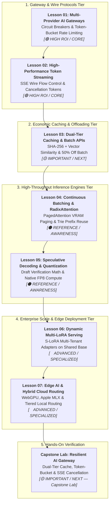

# Phase 07: High-Throughput Serving & LLMOps

> **Architectural overview and learning progression for Lead Developers and Solutions Architects.**

---

## 🎯 Phase Engineering Goal

Phase 07 equips senior developers, staff software engineers, and solutions architects to transition from fragile single-call prototypes to **high-throughput, resilient, enterprise-grade AI serving infrastructure (Software 3.0)**. 

By the end of this phase, you will be able to:
- Architect resilient multi-provider AI gateways capable of surviving upstream provider outages via automated circuit breakers, decorrelated jitter, and distributed two-phase token-bucket rate limiting.
- Manage network wire flow control across streaming Server-Sent Events (SSE), prevent socket buffer bloat, and terminate zombie token generation via active cancellation token propagation.
- Cut inferencing costs by 40–50% using sub-5ms exact string hashing, semantic vector caching (tau ≥ 0.92), and asynchronous Batch API offloading.
- Deploy and configure self-hosted high-throughput inference engines (vLLM and SGLang) leveraging continuous (iteration-level) batching, PagedAttention virtual memory block tables, and RadixAttention trie prefix reuse.
- Break the autoregressive memory bandwidth wall using speculative decoding (draft-and-verify) and native FP8 hardware acceleration on NVIDIA Hopper and Blackwell GPUs.
- Serve hundreds of specialized domain and tenant adaptations concurrently on a shared frozen base model cluster using dynamic Multi-LoRA (S-LoRA) runtimes.
- Build privacy-preserving, zero-egress hybrid edge-cloud applications running quantized Small Language Models (SLMs) locally on WebGPU, Apple MLX, and ONNX Runtime.

---

## 🗺️ Learning Path & System Topology



### Visual Walkthrough of the Phase Architecture
1. **Gateway & Network Wire (Lessons 01 & 02)**: We establish the perimeter defense. Incoming client traffic is throttled using distributed two-phase token reservation in Redis and protected by circuit breakers that divert traffic during provider outages. Tokens stream back via unbuffered Server-Sent Events, with active socket polling terminating upstream generation when clients disconnect.
2. **Economic Optimization (Lesson 03)**: Before touching compute, requests pass through a dual-tier cache (sub-5ms exact SHA-256 hash followed by semantic vector cosine similarity). Non-real-time bulk evaluation and backfill jobs are diverted to asynchronous Batch APIs for a 50% token cost reduction.
3. **Inference Engine Mechanics (Lessons 04 & 05)**: For self-hosted infrastructure, we dive into GPU silicon realities. Continuous batching and PagedAttention eliminate memory fragmentation, while RadixAttention maintains a trie of KV blocks to reuse prompt prefixes across requests. Speculative decoding and native FP8 Tensor Core GEMMs double decoding speed.
4. **Specialization & Edge (Lessons 06 & 07)**: We scale to hundreds of enterprise tenants by hosting low-rank LoRA adapters on a single base model cluster (S-LoRA), and deploy on-device SLMs with hybrid cloud-edge failover.
5. **Hands-On Capstone Lab**: Learners implement an end-to-end resilient gateway microservice passing simulated chaos tests.

---

## 📚 Modular Curriculum Lessons (Master Navigation Table)

| # | Lesson Module | Depth Tier | Est. Time | Core Systems Focus | Key Engineering Outcome |
|---|---|:---:|:---:|---|---|
| **01** | [Resilient Multi-Provider AI Gateways](./01-resilient-ai-gateways-and-rate-limiting.md) | `🟢 HIGH ROI / CORE` | ~20 min | Multi-provider fallback cascades, circuit breakers, decorrelated jitter, distributed two-phase token-bucket rate limiting. | Zero-downtime provider failover and hard quota protection. |
| **02** | [High-Performance Token Streaming & Backpressure](./02-high-performance-token-streaming-and-backpressure.md) | `🟢 HIGH ROI / CORE` | ~18 min | Server-Sent Events (SSE) wire protocols, chunked transfer encoding, socket backpressure, client cancellation propagation. | Elimination of the 15s blank screen and zero zombie token burn. |
| **03** | [Dual-Tier Caching & Asynchronous Batch APIs](./03-dual-tier-caching-and-batch-apis.md) | `🟡 IMPORTANT / NEXT` | ~22 min | Sub-5ms exact SHA-256 hashing, semantic vector caching (tau ≥ 0.92), tenant key isolation, 50% off Batch API pipelines. | 25–40% inference bill reduction and sub-50ms cache hits. |
| **04** | [Continuous Batching, PagedAttention & RadixAttention](./04-vllm-continuous-batching-and-radixattention.md) | `⚫ REFERENCE / AWARENESS` | ~25 min | Autoregressive memory bandwidth wall, iteration-level continuous batching, virtual memory paging for KV tensors, Radix trie prefix caching. | 3–5× GPU throughput increase on self-hosted vLLM/SGLang clusters. |
| **05** | [Speculative Decoding & Modern Hardware Quantization](./05-speculative-decoding-and-model-quantization.md) | `⚫ REFERENCE / AWARENESS` | ~25 min | Draft-and-verify speculative decoding, acceptance rate mathematics, native FP8 GEMM on Hopper/Blackwell, AWQ 4-bit weight quantization. | 2–3× wall-clock decoding speedup with zero perplexity loss. |
| **06** | [Dynamic Multi-LoRA Adapter Serving at Scale](./06-dynamic-multi-lora-adapter-serving.md) | `🔵 ADVANCED / SPECIALIZED` | ~22 min | Low-Rank Adaptation (LoRA) mathematics, S-LoRA/Punica runtimes, memory pooling, batched segmented GEMMs across shared base clusters. | Serving 100+ fine-tuned tenant adapters on a single shared GPU cluster. |
| **07** | [Edge AI, Local Runtimes & Hybrid Cloud Routing](./07-edge-ai-and-client-side-inference.md) | `🔵 ADVANCED / SPECIALIZED` | ~20 min | WebLLM (WebGPU), Apple MLX, Ollama (GGUF), ONNX Runtime GenAI, hardware capability probing, tiered edge-cloud continuum. | Zero-egress privacy, offline availability, and zero-cost local execution. |

---

## 🛠️ Associated Hands-On Labs

- **Phase Capstone Lab**: [Production Multi-Provider Resilient AI Gateway](./labs/capstone-production-ai-gateway.md)
  - Build a FastAPI or .NET 9 AI Gateway implementing dual-tier caching, token-bucket rate limiting, circuit breaking, SSE streaming, and cancellation tokens.
  - Pass the 5 automated chaos verification test cases.
- **Reference Microservice Implementation**:
  - Located at `agent-forge/gateway/`
  - Run verification harness:
    ```bash
    python -m unittest agent-forge/tests/test_gateway.py
    ```

---

## 📋 Prerequisites & Cross-Phase Dependencies

- **Required Prior Knowledge**:
  - [Phase 00: Foundations & Token Mechanics](../00-foundations-and-token-mechanics/README.md) (Transformer memory bandwidth wall, KV cache sizing formulas, and prefill vs. decode physics).
  - [Phase 01: Prompt & Context Engineering](../01-prompt-and-context-engineering/README.md) (Context budgeting, token compaction, and prompt prefix alignment).
  - [Phase 05: AI Security & Guardrails](../05-ai-security-and-guardrails/README.md) (Zero-trust gateway boundaries and prompt injection quarantine).
  - [Phase 06: GenAI Evals & Observability](../06-evals-and-observability/README.md) (OpenTelemetry GenAI semantic conventions and inference latency golden signals).
- **Downstream Beneficiaries**:
  - Feeds into [Phase 08: AI-Augmented SDLC & Leadership](../08-ai-augmented-sdlc-and-leadership/README.md) (Production Readiness Reviews, SLA budgets, and Architecture Review Board governance).

---

## 📚 Curated Primary Sources & Verification References

1. **PagedAttention (vLLM)**: Kwon et al., *"Efficient Memory Management for Large Language Models with PagedAttention"*, SOSP 2023. [arXiv:2309.06180](https://arxiv.org/abs/2309.06180)
2. **RadixAttention (SGLang)**: Zheng et al., *"SGLang: Efficient Execution of Structured Language Model Programs"*, 2024. [arXiv:2312.07104](https://arxiv.org/abs/2312.07104)
3. **Speculative Decoding**: Leviathan et al., *"Fast Inference from Transformers via Speculative Decoding"*, ICML 2023. [arXiv:2211.17192](https://arxiv.org/abs/2211.17192)
4. **S-LoRA (Multi-LoRA Serving)**: Sheng et al., *"S-LoRA: Serving Thousands of Concurrent LoRA Adapters"*, MLSys 2024. [arXiv:2311.03285](https://arxiv.org/abs/2311.03285)
5. **AWQ Quantization**: Lin et al., *"AWQ: Activation-aware Weight Quantization for On-Device LLM Compression and Acceleration"*, MLSys 2024. [arXiv:2306.00978](https://arxiv.org/abs/2306.00978)
6. **W3C Server-Sent Events Specification**: [html.spec.whatwg.org/multipage/server-sent-events.html](https://html.spec.whatwg.org/multipage/server-sent-events.html)
7. **OpenAI Batch API & Prompt Caching**: [platform.openai.com/docs/guides/batch](https://platform.openai.com/docs/guides/batch)

---

## 🧭 Navigation

### Phase Progression
- **Previous Phase**: **[← Phase 06: GenAI Evals & Observability](../06-evals-and-observability/README.md)**
- **Next Phase**: **[Phase 08: AI-Augmented SDLC & Leadership →](../08-ai-augmented-sdlc-and-leadership/README.md)**

### Direct Chapter & Lesson Directory
- **[Lesson 01: Multi-Provider AI Gateways & Rate Limiting](./01-resilient-ai-gateways-and-rate-limiting.md)**
- **[Lesson 02: High-Performance Token Streaming & Backpressure](./02-high-performance-token-streaming-and-backpressure.md)**
- **[Lesson 03: Dual-Tier Caching & Asynchronous Batch APIs](./03-dual-tier-caching-and-batch-apis.md)**
- **[Lesson 04: Continuous Batching, PagedAttention & RadixAttention](./04-vllm-continuous-batching-and-radixattention.md)**
- **[Lesson 05: Speculative Decoding & Modern Hardware Quantization](./05-speculative-decoding-and-model-quantization.md)**
- **[Lesson 06: Dynamic Multi-LoRA Adapter Serving at Scale](./06-dynamic-multi-lora-adapter-serving.md)**
- **[Lesson 07: Edge AI, Local Runtimes & Hybrid Cloud Routing](./07-edge-ai-and-client-side-inference.md)**
- **[Hands-On Capstone Lab: Resilient Multi-Provider AI Gateway](./labs/capstone-production-ai-gateway.md)**
