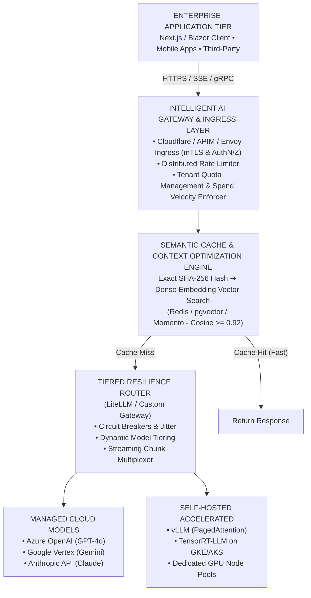
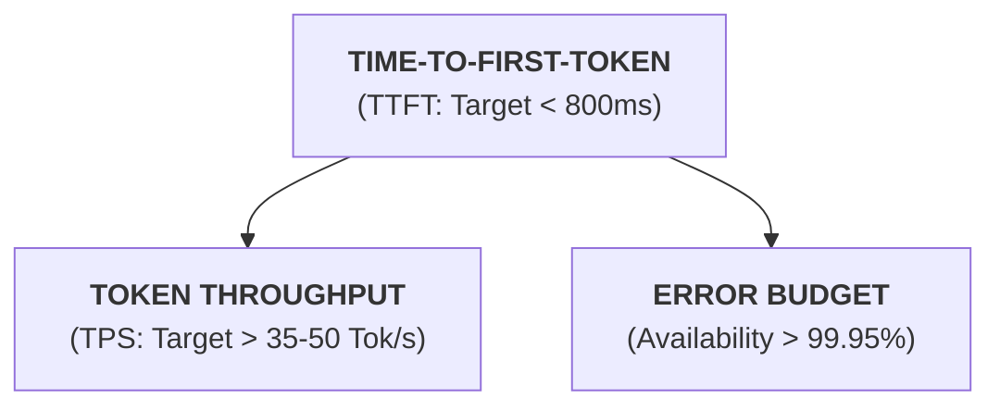
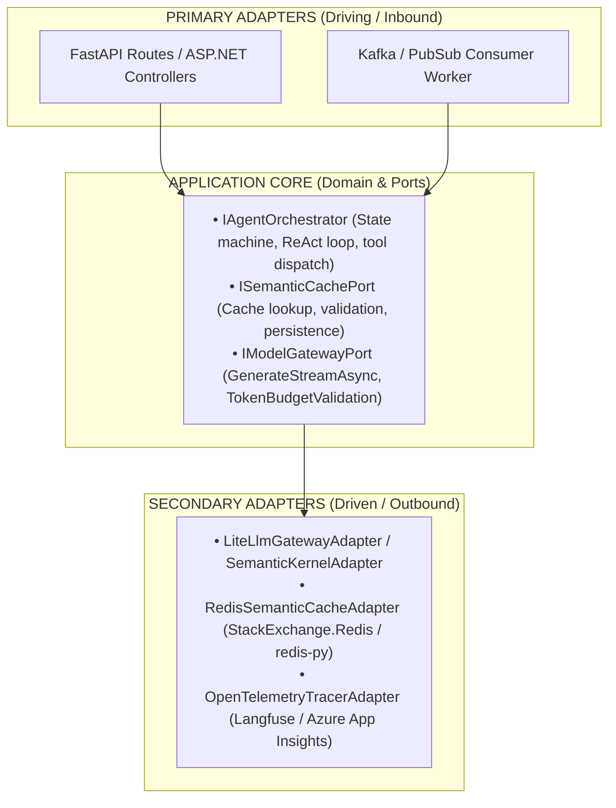
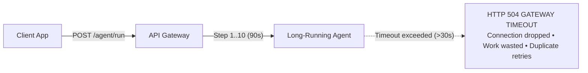
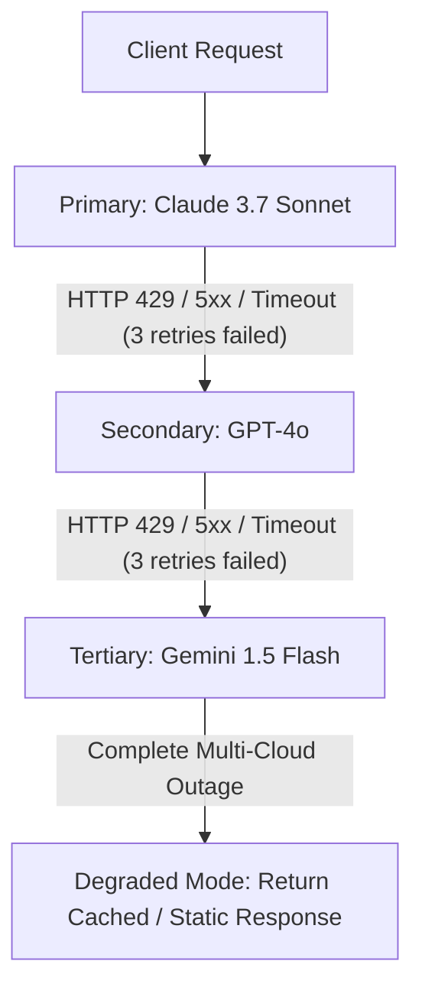
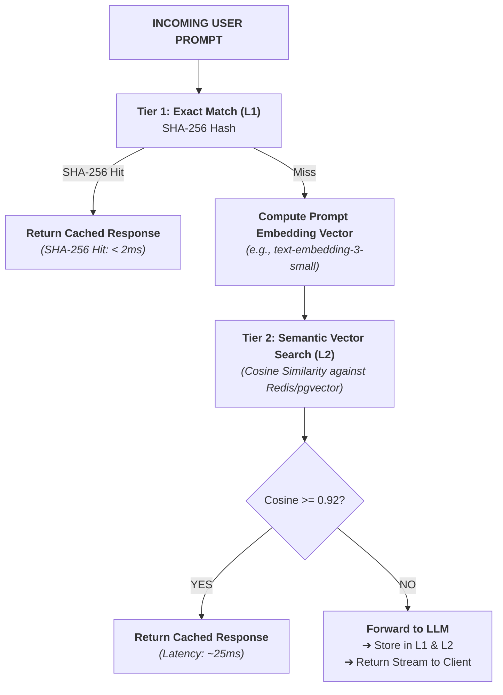
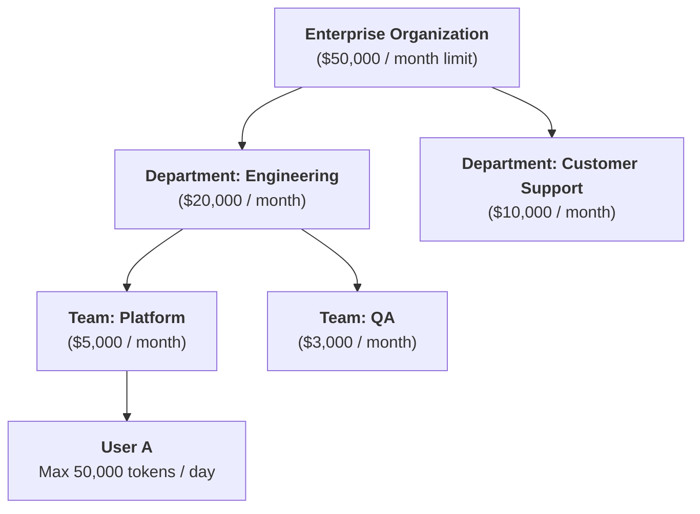
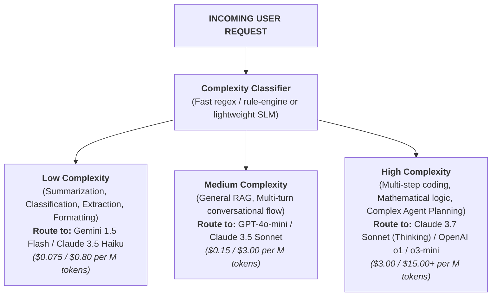
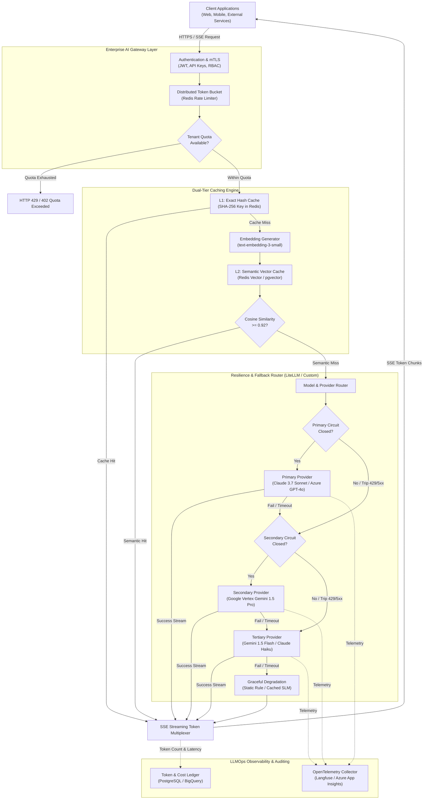
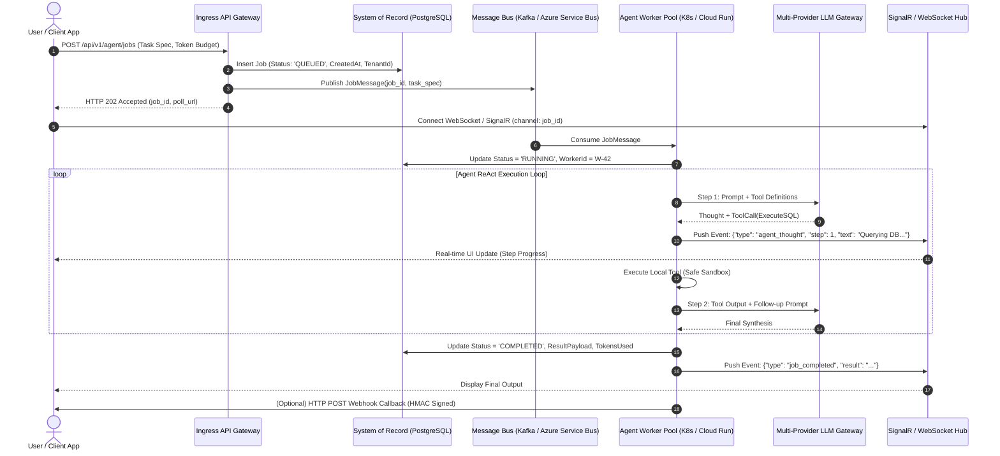

# Phase 07: Production Deployment & LLMOps: Senior & Lead Developer Edition

> **A definitive, production-grade architectural guide for Tech Leads, Software Architects, and Senior AI Engineers transitioning LLMs and Agentic Workflows from experimental prototypes to resilient, low-latency, enterprise-grade production services.**

---

> Curriculum taxonomy aligns with the [3-tier classification defined in the root README](../README.md) (`[MUST-HAVE]` 🔴, `[GOOD-TO-HAVE]` 🟡, `[KNOWLEDGE-BASE]` 🔵).

---



---

## 📑 Table of Contents

1. [Executive Summary & Lead Mental Model [MUST-HAVE] 🔴](#1-executive-summary--lead-mental-model-must-have-)
2. [Why This Matters for Senior/Lead Developers [MUST-HAVE] 🔴](#2-why-this-matters-for-seniorlead-developers-must-have-)
3. [Deep-Dive Engineering & Implementation [MUST-HAVE] 🔴](#3-deep-dive-engineering--implementation-must-have-)
4. [System Architecture & Mermaid Diagrams [MUST-HAVE] 🔴](#4-system-architecture--mermaid-diagrams-must-have-)
5. [Comparative Analysis & Tradeoff Matrices [MUST-HAVE] 🔴](#5-comparative-analysis--tradeoff-matrices-must-have-)
6. [Production Failure Modes & Anti-Patterns [MUST-HAVE] 🔴](#6-production-failure-modes--anti-patterns-must-have-)
7. [Enterprise Production Code Implementations [MUST-HAVE] 🔴](#7-enterprise-production-code-implementations-must-have-)
8. [Curated Verified Resources & Reference Index [KNOWLEDGE-BASE] 🔵](#8-curated-verified-resources--reference-index-knowledge-base-)
9. [Capstone Challenge: Production Multi-Provider Resilient AI Gateway [MUST-HAVE] 🔴](#9-capstone-challenge-production-multi-provider-resilient-ai-gateway-must-have-)

---

## 1. Executive Summary & Lead Mental Model [MUST-HAVE] 🔴

### The Prototype Trap vs. Enterprise Production Invariants

In an AI prototype or Jupyter notebook, success is defined by a single successful completion: a model responds sensibly to an engineered prompt, an agent takes a few tool calls, and the developer observes a satisfying result.

In enterprise software engineering, this is merely step zero. Deploying generative AI into production introduces a radical departure from traditional distributed systems:

### The Production Gap

| Prototype in a Notebook | Enterprise Production Service |
|---|---|
| • 1 concurrent user (developer) | • 10,000+ concurrent multi-tenant requests |
| • Single static API key in `.env` | • Key rotation, mTLS, RBAC, tenant isolation |
| • Direct call to single LLM model | • Multi-provider failover, circuit breakers |
| • Ignores 429 quota exhaustion | • Token-bucket rate limiting & token budgeting |
| • Waits 12s for full payload return | • Server-Sent Events (SSE) streaming (TTFT < 800ms) |
| • Unbounded costs per execution | • Strict cost controls, model tiering, telemetry |
| • Undetected silent model drift | • OpenTelemetry distributed tracing & regression evals |

### The Distributed Systems Mental Model: LLMs as Unpredictable Remotes

As a Software Architect, you must never treat an LLM as an internal function or standard microservice. You must model an LLM as:
1. **A high-latency, third-party remote dependency** with P99 latencies measured in seconds or tens of seconds rather than milliseconds.
2. **A strictly rate-limited resource** bounded by non-negotiable upstream provider quotas: Requests Per Minute (RPM), Tokens Per Minute (TPM), and Concurrent Request Limits.
3. **An unreliable upstream** subject to regional outages, transient HTTP 5xx errors, degraded capacity, and non-deterministic response lengths.
4. **An unmetered cost hazard** where a malicious query, recursive agent loop, or unoptimized prompt can consume thousands of dollars in minutes.

Treating LLMs with the same defensive patterns applied to unreliable payment gateways or third-party webhooks—incorporating circuit breakers, backpressure, tiered fallbacks, dead-letter queues, and semantic caching—is the foundation of **LLMOps**.

### The Production SLA Triad: TTFT, Throughput, and Error Budgets

To measure and maintain production quality, enterprise teams discard subjective "vibe metrics" in favor of the **Production SLA Triad**:



1. **Time-To-First-Token (TTFT)**: The wall-clock duration between the client dispatching the request and the user receiving the first visible character on screen. TTFT is dominated by:
   - Network handshake and gateway authentication overhead.
   - Vector search / RAG retrieval latency.
   - LLM prompt prefill processing time (proportional to total input context length).
2. **Token Throughput (Tokens Per Second - TPS)**: The generation velocity once output starts streaming. Human reading speed averages 4–5 words per second (~6–8 tokens/second). An enterprise service must maintain $\ge 35\text{ tokens/sec}$ to ensure perceived responsiveness.
3. **Availability & Error Budget**: Cloud LLM providers typically offer only 99.9% availability SLAs (translating to ~43 minutes of permissible downtime per month). To deliver an enterprise-grade 99.95% or 99.99% application SLA, **multi-provider active-active routing is mathematically mandatory**.

---

## 2. Why This Matters for Senior/Lead Developers [MUST-HAVE] 🔴

### High Availability (HA) & Multi-Region Redundancy

Cloud providers frequently experience localized capacity crunches. For instance, Azure OpenAI or Google Vertex AI in `us-east-1` may return HTTP 503 (Service Unavailable) or HTTP 429 (Capacity Exhausted) while `us-west-2` or `europe-west4` has idle GPUs. 

A production architecture cannot rely on DNS round-robin alone. It requires an application-layer **AI Gateway** that inspects upstream health, maintains regional connection pools, and dynamically routes traffic to healthy regions without dropping active client connections.

### Taming Quotas: TPM & RPM Hard Ceilings

Unlike traditional relational databases where increased concurrency results in minor queuing or CPU scaling, cloud AI providers enforce **hard token rate limits**:
- **Requests Per Minute (RPM)**: Hard cap on API calls.
- **Tokens Per Minute (TPM)**: Sum of all input prompt tokens plus output generated tokens across all concurrent requests within a rolling 60-second window.

When a batch background process or unexpected user traffic spike exceeds your TPM quota, the provider responds with `HTTP 429 Too Many Requests`. Without distributed rate limiters (e.g., Redis-backed Token Bucket algorithms) and jittered exponential backoffs, incoming traffic collapses into a **thundering herd**, exacerbating the outage.

### The Streaming Imperative: Time-To-First-Token vs. Full Buffering

Consider an enterprise document summarizer producing 1,500 tokens of output:
- **Buffered REST API**: The user triggers the action. The server waits for the LLM to complete inference (~18 seconds). The user stares at a frozen spinner for 18 seconds before receiving the response all at once. User satisfaction drops precipitously; many assume the service is broken and cancel or refresh, triggering duplicate backend requests.
- **Streaming SSE API**: The server transmits the prompt, the model emits the first token in 650ms, and the frontend renders text incrementally. Perceived latency is **650ms**—a **96% reduction in perceived wait time**.

Streaming is not merely a UI aesthetic; it is an architectural requirement for user retention, connection health monitoring, and early cancellation detection.

### Multi-Model Redundancy & Blast Radius Containment

Every foundation model provider has unique failure profiles:
- OpenAI outages impact GPT-4o and o1 reasoning models.
- Anthropic outages impact Claude 3.5 Sonnet and Claude 3.7.
- Google Cloud outages impact Gemini 1.5 Pro and Flash.

If your core microservice contains:
```csharp
// ANTI-PATTERN: Single Point of Failure
var client = new OpenAIClient("sk-...");
var response = await client.GetChatClient("gpt-4o").CompleteChatAsync(messages);
```
An upstream outage at a single vendor brings down your entire enterprise platform. Lead Architects decouple model selection from client invocation using a unified model abstraction layer that automatically falls back across providers.

### Disaster Recovery & Degradation Modes

When catastrophic network partitions or multi-provider outages occur, what does your system do?
A mature LLMOps system implements **graceful degradation tiers**:
1. **Tier 1 (Full Fidelity)**: Primary high-reasoning model (e.g., Claude 3.7 Sonnet or GPT-4o).
2. **Tier 2 (Fast Alternative)**: Secondary cloud provider high-speed model (e.g., Gemini 1.5 Flash or Claude 3.5 Haiku).
3. **Tier 3 (Semantic Cache Fallback)**: Serve the closest match from semantic cache even if similarity is slightly below the strict threshold, accompanied by a disclosure banner.
4. **Tier 4 (Deterministic Rule Fallback)**: Serve pre-computed deterministic templates or execute a local lightweight open-source SLM (e.g., Llama 3.2 3B hosted on a backup CPU/GPU container).

### Token Economics & Cost Governance at Scale

Without governance, LLM costs scale super-linearly with user adoption. A developer writing an unconstrained ReAct agent loop can accidentally trigger a 100-step loop consuming \$40 in a single minute. 

Senior Architects design and enforce:
- **Tenant-Level Token Quotas**: Hard daily/monthly financial ceilings.
- **Model Tiering**: Classifying incoming intent and routing 75% of simple tasks (classification, sentiment, intent extraction) to models costing \$0.10 per million tokens (e.g., Gemini 1.5 Flash), reserving \$3.00–\$15.00/M models (GPT-4o, Claude Sonnet) solely for deep reasoning.
- **Spend Velocity Alerts**: Alerting operations when token burn exceeds 3x baseline standard deviation in a 10-minute window.

---

## 3. Deep-Dive Engineering & Implementation [MUST-HAVE] 🔴

### Enterprise Hosting & Deployment Models [MUST-HAVE] 🔴

Selecting where and how to run AI workloads depends on latency requirements, GPU availability, compliance boundaries, and operational complexity.

### ENTERPRISE HOSTING SPECTRUM

| Serverless Containers (Cloud Run, Container Apps) | Managed Agent Platforms (Google ADK, MS Foundry) | Self-Hosted GPU (vLLM) (GKE, AKS, Dedicated VM) |
|---|---|---|
| • Zero idle cost<br/>• Rapid autoscaling<br/>• Standard HTTP/2 streaming<br/>• Best for AI Gateway & APIs | • Turnkey agent state<br/>• Built-in tool hosting<br/>• Managed session threads<br/>• Best for enterprise agents | • Complete data privacy<br/>• Zero API token costs<br/>• PagedAttention & vGPU<br/>• Requires ML infra team |

#### Managed Serverless APIs: Cloud Run, ACA, and AWS Lambda

For microservices that wrap cloud LLMs (acting as gateways, routers, or API facades), serverless container platforms provide the optimal balance between operational overhead and scalability:

- **Google Cloud Run**:
  - Supports full **HTTP/2 and Server-Sent Events (SSE)** without proxy buffering.
  - Scales from zero to thousands of container instances in seconds.
  - Allows concurrency tuning: setting `concurrency: 80` per container enables 80 active streaming SSE requests per instance, dramatically reducing idle compute costs.
  - Configurable request timeout up to 60 minutes for long-running batch agent reasoning.
- **Azure Container Apps (ACA)**:
  - Built on Kubernetes, KEDA (Kubernetes Event-driven Autoscaling), and Envoy.
  - Provides native microservice capabilities via Dapr (Distributed Application Runtime) for pub/sub messaging and state management.
  - Serverless scaling based on HTTP request concurrency, CPU/Memory, or message queue depth (Azure Service Bus).
- **AWS Lambda with Response Streaming**:
  - Standard AWS Lambda buffers HTTP responses, breaking real-time token streaming.
  - Must use **Lambda Function URLs** configured with `InvokeMode: RESPONSE_STREAM` using the AWS Lambda Node.js or custom runtime stream APIs.
  - Maximum payload size for streaming is 20MB, with TTFT comparable to containerized runtimes.

#### Managed Enterprise Agent Platforms: Google Cloud Agent Platform & Microsoft Foundry

When building multi-turn stateful agents with complex tool ecosystems, managing thread persistence, state machines, and sandbox execution can consume substantial engineering cycles.

- **Google Cloud Agent Platform (Google ADK Runtime)**:
  - Provides native agent hosting for Google Agent Development Kit (ADK) agents.
  - Out-of-the-box grounding with Vertex AI Search and enterprise databases (BigQuery, Cloud Storage).
  - Secure tool execution environments and automated trace telemetry integrated into Google Cloud Operations Suite (Cloud Trace/Logging).
- **Microsoft Foundry Agent Service (Azure AI Foundry)**:
  - Fully managed runtime for agents built with Semantic Kernel or AutoGen.
  - Persistent Threads: Conversation history and message state are managed and secured by Azure, eliminating manual database state synchronization.
  - Integrated Enterprise Security: Managed Identities (Entra ID), Virtual Network isolation, customer-managed encryption keys (CMEK), and built-in Azure Content Safety evaluations.

#### Containerized Orchestration: GKE & AKS with GPU Node Pools

When running custom models or self-hosting open-weight LLMs (Llama 3.3, Mistral Large, DeepSeek-R1, Qwen 2.5), Kubernetes provides the necessary fine-grained infrastructure control:

- **GPU Node Pool Provisioning**:
  - Configuring autoscaling node pools backed by NVIDIA GPUs (H100 80GB for large models, L4 24GB or A100 40/80GB for medium models).
  - Multi-Instance GPU (MIG) on NVIDIA A100/H100 allows partitioning a physical GPU into up to 7 hardware-isolated instances for smaller workloads (e.g., embeddings or rerankers).
- **Cluster Autoscaler & Karpenter**:
  - Standard Kubernetes horizontal pod autoscaling (HPA) based on CPU/Memory fails for LLM serving because GPU memory is allocated upfront (VRAM is static).
  - Autoscaling must be driven by custom metrics: **Queue Depth**, **Active Requests**, or **KV Cache Usage** via Prometheus and KEDA.
- **Ingress Configuration for SSE**:
  - Standard ingress controllers (NGINX, Traefik, Istio, Envoy) default to proxy buffering.
  - You must explicitly disable response buffering:
    ```yaml
    # NGINX Ingress Annotations for SSE Streaming
    nginx.ingress.kubernetes.io/proxy-buffering: "off"
    nginx.ingress.kubernetes.io/proxy-read-timeout: "3600"
    nginx.ingress.kubernetes.io/proxy-send-timeout: "3600"
    nginx.ingress.kubernetes.io/ssl-redirect: "true"
    ```

#### Self-Hosted Open Model Runtimes: vLLM, TensorRT-LLM, and Ollama

Hosting open-weight models requires specialized inference engines designed for LLM memory architectures:

| Memory Allocation Paradigm | Architecture Mechanism | VRAM Fragmentation | Concurrency Saturation |
|---|---|---|---|
| **Traditional Serving (HuggingFace / PyTorch)** | Pre-allocates contiguous virtual memory blocks per sequence | 60%–80% VRAM wasted to internal/external fragmentation | Low concurrent requests per GPU |
| **vLLM PagedAttention** | Non-contiguous physical page allocation via virtual page table | Near 0% VRAM fragmentation waste | $2\times$ to $4\times$ higher throughput per node |

1. **vLLM (vllm.ai)**:
   - **PagedAttention**: Manages the Key-Value (KV) cache in partitioned, non-contiguous memory pages. Eliminates internal and external VRAM fragmentation, unlocking $2\times$ to $4\times$ higher throughput than standard PyTorch engines.
   - **Continuous Batching (Iteration-Level Scheduling)**: Instead of waiting for an entire batch to finish generating all tokens, vLLM dynamically injects incoming requests into the current iteration as earlier requests finish, maximizing GPU compute saturation.
   - **Tensor Parallelism**: Seamlessly shards model weights across multiple GPUs on a single node via `--tensor-parallel-size N`.
   - **OpenAI-Compatible Server**: Exposes standard `/v1/chat/completions` and `/v1/models` endpoints, making it a drop-in replacement for cloud APIs.
2. **NVIDIA TensorRT-LLM**:
   - Proprietary compiler and runtime optimized specifically for NVIDIA architectures.
   - Features in-flight batching, FP8 / INT4 AWQ quantization, and custom fused attention kernels. Delivers maximum raw token throughput on HGX H100 clusters.
3. **Ollama**:
   - Built on `llama.cpp` for lightweight, developer-local, and edge inference.
   - Ideal for local development, CI/CD integration testing, and air-gapped workstations, but not recommended for high-concurrency multi-tenant enterprise production.

---

### Enterprise C# / .NET & Python Microservice Architecture [GOOD-TO-HAVE] 🟡

#### Hexagonal Clean Architecture for AI Services

Enterprise microservices should decouple business workflows from underlying model SDKs using Hexagonal (Ports & Adapters) architecture:



#### Exposing Agents via ASP.NET Core 9 Minimal APIs & FastAPI

- **FastAPI (Python)**:
  - Native asynchronous I/O (`async`/`await`) designed for non-blocking concurrent network requests.
  - Streaming responses using `StreamingResponse` with `media_type="text/event-stream"`.
  - Pydantic v2 validation enforces strict request schemas, preventing malformed prompts from burning tokens.
  - `Lifespan` event handlers manage warm connection pools for Redis, LiteLLM, and database connections.
- **ASP.NET Core 9 (C#)**:
  - First-class native support for **`IAsyncEnumerable<T>`**: Enables end-to-end asynchronous streaming directly from model clients to HTTP clients without thread blocking.
  - Minimal APIs provide near-zero allocation overhead and high RPS.
  - Integrated Dependency Injection with `Microsoft.Extensions.AI` (the standardized .NET abstraction for AI services) or `Microsoft.SemanticKernel`.
  - Cancellation token propagation (`HttpContext.RequestAborted`) halts backend model inference immediately when a user navigates away or disconnects.

#### Asynchronous Event-Driven Architectures: Kafka, Service Bus, Pub/Sub & Cloud Tasks

Synchronous HTTP request-response patterns fail for multi-step agentic workflows that require several minutes to complete (e.g., executing web searches, running SQL queries, generating reports, writing code).



**Enterprise Event-Driven Agent Pattern**:
1. **Submission**: Client submits a task via `POST /api/v1/jobs`.
2. **Fast Acknowledgment**: API validates the request, persists the job state in PostgreSQL with status `QUEUED`, publishes a message to a queue (Kafka, Azure Service Bus, Google Cloud Pub/Sub, or AWS SQS), and immediately returns `HTTP 202 Accepted` with a `job_id`.
3. **Decoupled Execution**: Independent containerized Agent Workers consume messages from the queue. Concurrency is strictly bounded by worker instance count, completely eliminating LLM rate limit exhaustion.
4. **Intermediate Progress & Result Delivery**:
   - **Real-Time Push**: Worker publishes intermediate agent thoughts and tool calls to a Redis Pub/Sub channel or SignalR / WebSocket hub, which pushes updates live to the user's browser.
   - **Webhook Notification**: On completion, the worker dispatches a cryptographically signed HMAC HTTP POST to the client's registered webhook endpoint.
   - **Polling Fallback**: Client polls `GET /api/v1/jobs/{job_id}` with ETag caching.

---

### High-Performance Token Streaming [MUST-HAVE] 🔴

#### Server-Sent Events (SSE) vs. WebSockets: Protocol Deep Dive

Streaming LLM output to clients requires choosing between SSE and WebSockets:

| Server-Sent Events (SSE) | WebSockets |
|---|---|
| • Unidirectional (Server ➔ Client)<br/>• Runs over standard HTTP/1.1 / HTTP/2<br/>• Built-in browser reconnection<br/>• Standard `text/event-stream` MIME<br/>• Seamless with API Gateways, WAFs, and corporate proxies<br/>• Perfect for LLM token streaming | • Bidirectional (Full Duplex)<br/>• Requires custom WS protocol handshake<br/>• Manual reconnection & heartbeat logic<br/>• Custom frame serialization<br/>• Requires sticky sessions, bypasses many standard corporate proxies/WAFs<br/>• Ideal for audio (Gemini Live/Voice) |

For 95% of text-based AI generation and agent reasoning, **Server-Sent Events (SSE)** is the architectural standard:
- Follows the W3C EventSource standard.
- Formats payloads as `data: {"text": "Hello"}\n\n`.
- Uses HTTP/2 multiplexing, allowing hundreds of concurrent streams over a single TCP connection.

#### Chunked Transfers, Backpressure, and Socket Buffer Bloat

When an LLM runtime (e.g., vLLM or an enterprise API) produces tokens faster than a slow mobile client can consume them:
- The server's OS TCP send buffer fills up.
- Without backpressure handling, memory usage in the microservice balloons as unconsumed tokens buffer in user space.
- **Backpressure Resolution**:
  - In Python, FastAPI's `StreamingResponse` handles backpressure by awaiting `response.write()`, which pauses the consumer generator when the kernel socket buffer is full.
  - In C# .NET 9, writing directly to `HttpResponse.Body.Writer` via `System.IO.Pipelines.PipeWriter` provides native non-blocking backpressure:
    ```csharp
    var flushResult = await response.BodyWriter.FlushAsync(cancellationToken);
    if (flushResult.IsCompleted || flushResult.IsCanceled)
    {
        // Client disconnected or buffer aborted; break generation immediately
        break;
    }
    ```

#### Cancellation Token Propagation: Eliminating Zombie Token Burn

One of the largest hidden costs in production LLM applications is **Zombie Token Generation**:
1. User asks a complex question.
2. The LLM begins generating 2,000 tokens of reasoning.
3. At token 50, the user realizes their prompt was flawed and clicks "Stop" or navigates to another page.
4. If your backend service does not catch client connection closure and pass the `CancellationToken` to the LLM client, the upstream model **continues generating all 2,000 tokens in the background**.
5. You pay full price for tokens that were discarded into the void.

**Production Solution**: Both Python (`request.is_disconnected()`) and .NET (`HttpContext.RequestAborted`) provide cancellation tokens. Always thread this token through to the LLM SDK's streaming methods.

---

### Resiliency, Rate Limiting & Fallback Routing [MUST-HAVE] 🔴

#### Handling HTTP 429: Exponential Backoff with Decorrelated Jitter

When an API rate limit is reached, standard retries or constant delays cause synchronized retries across concurrent clients, known as the **Thundering Herd Problem**:

> [!WARNING]
> **The Thundering Herd Collapse:** If 100 concurrent requests encounter `HTTP 429` at $t=0\text{s}$ and all sleep for a fixed $2.0\text{s}$, all 100 will retry simultaneously at $t=2.0\text{s}$, re-triggering quota exhaustion in an unyielding cascade.

To break synchronization, production systems use **Exponential Backoff with Full or Decorrelated Jitter**:

$$\text{Sleep}(i) = \min\left(\text{MaxDelay}, \text{Uniform}(0, \text{BaseDelay} \times 2^i)\right)$$

Or **Decorrelated Jitter** (recommended by AWS Architecture Labs):

$$\text{Sleep}_{i} = \min\left(\text{MaxDelay}, \text{Uniform}(\text{BaseDelay}, \text{Sleep}_{i-1} \times 3)\right)$$

#### Circuit Breakers for LLM Endpoints

When an LLM provider suffers a major degradation (e.g., error rate > 50% over a 30-second window):
- Continuing to send requests wastes latency and CPU threads.
- A **Circuit Breaker** (implemented via Polly in .NET or custom/pybreaker in Python) trips into the **Open State**.
- All subsequent calls immediately bypass the failing provider and divert to the secondary provider without waiting for network timeouts.
- Periodically, a single probe request is permitted through in the **Half-Open State**. If it succeeds, the circuit resets to **Closed**.

#### Tiered Model Fallback: Primary ➔ Secondary ➔ Graceful Degradation



#### Multi-Provider Gateways: LiteLLM, Portkey, and Azure APIM GenAI Policies

Rather than hand-rolling routing code in every microservice, modern architectures employ centralized or sidecar AI Gateways:

- **LiteLLM Proxy**:
  - Open-source, high-throughput proxy exposing OpenAI-compatible APIs for 100+ LLMs.
  - Native load balancing across multiple API keys, models, and regions.
  - Built-in rate limiting, spend tracking per virtual key, and automatic fallbacks.
- **Portkey**:
  - Enterprise AI Gateway offering request retries, canary rollouts of prompts/models, and deep OpenTelemetry-compliant observability.
- **Azure API Management (APIM) GenAI Gateway**:
  - Specialized enterprise gateway capabilities for Azure OpenAI and external models.
  - Native XML/Bicep policies for **Token Bucket Rate Limiting** (`<azure-openai-token-limit>`), multi-region load balancing, and prompt caching.

---

### Semantic Caching [MUST-HAVE] 🔴

Traditional Web caching relies on exact string or hash equality (`SHA-256(prompt)`). If a user changes a single character, punctuation mark, or greeting, an exact cache misses completely:
- "What is the capital of France?" ➔ Cache Miss ➔ LLM Call
- "Tell me what the capital of France is." ➔ Cache Miss (Different hash) ➔ Duplicate LLM Call

#### Exact Hash Matching vs. Embedding-Based Semantic Caching

An enterprise cache implements a **two-tier lookup pipeline**:



#### Vector Distance Metrics, Threshold Tuning (Tau), and False Positives

Setting the semantic similarity threshold tau is critical:
- **Cosine Similarity Threshold tau = 0.95**: Highly conservative. Near-zero false positives, but lower cache hit rate.
- **Cosine Similarity Threshold tau = 0.90 - 0.92**: Production sweet spot for general Q&A and FAQ workloads.
- **Cosine Similarity Threshold tau <= 0.85**: **DANGEROUS**. High false positive rate. For example, "How do I upgrade my database?" and "How do I drop my database?" may have high cosine similarity while requiring diametrically opposed answers!

> [!CAUTION]
> **Dynamic Context Rule**: Never use semantic caching on prompts containing dynamic parameters such as timestamps (`Current time: 14:02:11`), session tokens, user-specific IDs, or non-deterministic tool outputs unless those variables are explicitly stripped during prompt normalization.

#### Cache Key Normalization & Multi-Tenant Namespace Isolation

Before embedding or hashing, incoming prompts must undergo **Deterministic Normalization**:
1. Lowercase all text.
2. Strip redundant whitespace, trailing punctuation, and non-printable characters.
3. Order chat history messages consistently.
4. **Namespace Isolation**: Prefix all cache keys with tenant and role scopes:
   `cache:tenant_{tenant_id}:role_{role_name}:{hash}`.
   *Failing to isolate cache namespaces by tenant causes catastrophic data leakage across customers.*

#### Invalidation Strategies, TTL, and Cache Eviction

Semantic caches cannot live forever:
- **Time-To-Live (TTL)**: Enforce a strict TTL (e.g., 24 hours to 7 days) to ensure knowledge freshness.
- **Tag-Based Invalidation**: When underlying documentation or knowledge base records change, evict associated cache entries via Redis vector index tagging.
- **Memory Pressure**: Configure Redis with `maxmemory-policy allkeys-lru` or `volatile-lru` to prevent out-of-memory container crashes.

---

### Cost Engineering & Governance [MUST-HAVE] 🔴

#### Dynamic Token Budgeting & Hierarchical Quotas

In an enterprise SaaS environment, cost governance must be enforced hierarchically:



The AI Gateway checks the tenant's current balance before dispatching requests to LLMs. If the daily budget is exceeded, the gateway responds with `HTTP 402 Payment Required` or `HTTP 429 Quota Exceeded` rather than silently accumulating unbudgeted cloud provider invoices.

#### Complexity-Based Routing: Flash/Haiku vs. Pro/Sonnet/o-Series

Over 70% of enterprise AI tasks do not require advanced frontier reasoning models. A routing classifier inspects the incoming request and routes accordingly:



Implementing this routing pattern alone routinely reduces enterprise LLM spend by **60% to 80%**.

#### Spend Velocity Monitoring, Anomaly Detection & Circuit Tripping

A runaway autonomous agent that gets stuck in a tool-calling cycle can burn tokens at an exponential rate. Production LLMOps requires **Spend Velocity Monitors**:
- Calculate token burn per minute per tenant.
- If a tenant's velocity exceeds 5x baseline moving average, trigger an automated circuit trip:
  - Temporarily pause the running agent job.
  - Emit an alert to PagerDuty / Slack.
  - Require manual human intervention or tenant confirmation before resuming.

---

## 4. System Architecture & Mermaid Diagrams [MUST-HAVE] 🔴

### Enterprise Multi-Provider AI Gateway Architecture

The following diagram illustrates a production-grade multi-provider gateway with semantic caching, distributed rate limiting, circuit breakers, and tiered fallback routing:



---

### Asynchronous Event-Driven Agent Execution Pattern

For long-running, multi-step agent workflows (code generation, deep research, batch document processing), the synchronous HTTP connection is replaced with an asynchronous event-driven state machine:



---

## 5. Comparative Analysis & Tradeoff Matrices [MUST-HAVE] 🔴

### Deployment Options: Serverless Containers vs. Managed Platforms vs. Self-Hosted vLLM

| Architectural Dimension | Serverless Containers (Cloud Run / ACA) | Managed Cloud Platforms (Google ADK / MS Foundry) | Self-Hosted Open Model (vLLM on GKE / AKS) |
|---|---|---|---|
| **Operational Overhead** | Extremely Low (Standard container management) | Very Low (Fully turnkey cloud services) | High (Requires dedicated ML/Infra platform team) |
| **Cold Start Latency** | 1.5s – 4.0s (Scale from zero) | Near-zero (Platform managed warm pools) | N/A (GPU node pools kept warm; cold start ~5-15 min) |
| **Streaming Support** | Native HTTP/2 & SSE (Proxy buffering off) | Native SSE / WebSockets built-in | Native HTTP/2, SSE, and gRPC streaming |
| **Compute Cost Model** | Pay strictly per millisecond of execution | Pay per token + nominal platform orchestration fee | Fixed hourly cost per GPU instance (\$2.50 – \$4.50/hr per GPU) |
| **Cost at Low Volume** | **Near Zero** (Free tier & scale to zero) | **Low** (Pay purely per token consumed) | **Extremely Expensive** (Idle GPU costs \$1,800+/mo) |
| **Cost at High Volume (>1B Tokens/mo)** | Moderate (Cloud API token costs dominate) | High (Commercial enterprise token pricing) | **Substantially Cheaper** ($5\times$ to $10\times$ lower unit token cost) |
| **Data Privacy & Compliance** | Dependent on Cloud LLM DPA / zero-retention | Enterprise VPC integration & HIPAA/SOC2 | **Absolute Sovereignty** (Air-gapped, zero egress) |
| **Custom Weight Control** | None (Consumes cloud APIs) | Limited (Fine-tuning within vendor garden) | **Complete** (Custom weights, LoRA adapters, custom kernels) |

---

### Semantic Caching Engines: Redis vs. pgvector vs. Momento vs. In-Memory

| Engine | Lookup Latency | Scalability | Vector Search Index | Invalidation Complexity | Operational Cost | Best Use Case |
|---|---|---|---|---|---|---|
| **Redis (StackExchange / redis-py)** | **< 20ms** | Cluster-ready (Multi-GB VRAM) | Native RediSearch (HNSW / Flat) | **Low** (Native key-based TTL & Tagging) | Moderate | **Default Enterprise Standard** for real-time high-throughput caching |
| **PostgreSQL + pgvector** | 40ms – 100ms | Millions of rows with HNSW index | HNSW / IVFFlat | **Low** (Standard SQL UPDATE/DELETE) | Low (Reuses existing enterprise DB) | Environments with strict relational data coupling & low QPS |
| **Momento Serverless Cache** | **< 25ms** | True serverless (Zero provisioning) | Managed Semantic Index | **Extremely Low** (Managed TTL) | Pay-per-use (No base cost) | Serverless microservices running on AWS Lambda or Cloud Run |
| **In-Memory (Local RAM / Python dict)** | **< 1ms** | Single-node only (OOM risk) | In-memory Cosine / FAISS | **High** (Cache coherency across instances impossible) | Free | Unit tests, local prototyping, single-tenant CLI tools |

---

### Streaming Protocols: Server-Sent Events (SSE) vs. WebSockets vs. gRPC

| Protocol Attribute | Server-Sent Events (SSE) | WebSockets | gRPC Server Streaming |
|---|---|---|---|
| **Directionality** | Unidirectional (Server ➔ Client) | Full Duplex (Bidirectional) | Unidirectional / Bidirectional |
| **Transport Layer** | HTTP/1.1 or HTTP/2 | Custom WS protocol handshake over TCP | HTTP/2 (Strict binary framing) |
| **Browser Compatibility** | **Native** (`EventSource` API) | Native (`WebSocket` API) | Requires `grpc-web` proxy |
| **Corporate Proxy / Firewall Friendly** | **Excellent** (Standard HTTPS port 443) | Poor (Often inspected or blocked by enterprise proxies) | Moderate (Requires HTTP/2 cleartext/TLS support) |
| **Payload Format** | UTF-8 plain text (`text/event-stream`) | Binary or UTF-8 text frames | Strictly typed Protobuf binaries |
| **Automatic Reconnection** | **Built-in** by browser specification | Requires manual application code | Requires client SDK retry logic |
| **Primary Production Fit** | **LLM text & token streaming, agent progress events** | **Real-time audio, bidirectional voice (Gemini Live)** | **High-throughput internal microservice-to-microservice** |

---

## 6. Production Failure Modes & Anti-Patterns [MUST-HAVE] 🔴

### Anti-Pattern 1: Hardcoding Single LLM Provider Endpoints

> [!CAUTION]
> **Anti-Pattern:** Direct client calls to single-provider endpoints embedded in microservice logic:
```csharp
var client = new OpenAIClient("sk-...");
var response = await client.GetChatClient("gpt-4o").CompleteChatAsync(messages);
```

**What Happens in Production**:
During an upstream incident (e.g., DNS failure, DDoS, regional Azure or OpenAI outage), your application crashes with HTTP 500 errors. Customers experience a complete blackout. Mean-Time-To-Recovery (MTTR) is bounded by the upstream provider's engineering team rather than your own.

**Production Solution**:
Mandate an **AI Gateway / Proxy Layer**. Use unified SDK interfaces (such as LiteLLM in Python or `Microsoft.Extensions.AI` in .NET) configured with automated multi-region and multi-provider failover routing (OpenAI ➔ Anthropic ➔ Google Vertex).

---

### Anti-Pattern 2: Buffering Entire LLM Responses (The 15-Second Blank Screen)

> [!CAUTION]
> **Anti-Pattern:** Awaiting complete LLM responses before serialization into a standard JSON payload:
```csharp
var result = await model.GenerateAsync(prompt); // Awaits 15 seconds
return Ok(new { text = result });
```

**What Happens in Production**:
Users experience high latency and assume the platform is unresponsive. If they refresh or cancel, the server may continue generating tokens, wasting compute. Furthermore, load balancers with aggressive 10-second idle timeouts drop the TCP connection, resulting in sporadic `504 Gateway Timeout` errors.

**Production Solution**:
Stream tokens immediately using **Server-Sent Events (SSE)**. Transmit the initial token chunk within $< 800\text{ms}$ (TTFT), keeping the HTTP socket actively transmitting data and resetting idle timeout counters.

---

### Anti-Pattern 3: Unbounded Concurrency & Cascading 429 Throttling

> [!CAUTION]
> **Anti-Pattern:** Spawning unbounded parallel tasks over thousands of batch items:
```python
await asyncio.gather(*[call_llm(doc) for doc in 5000_documents])
```

**What Happens in Production**:
Thousands of simultaneous requests hit the LLM provider within a single second. The provider's rate limiter triggers immediately, returning `HTTP 429 Too Many Requests`. Naive retry loops fire simultaneously, creating an unyielding thundering herd. The service's entire API key quota is exhausted, blocking production users on other endpoints.

**Production Solution**:
Decouple batch processing through a distributed queue (Kafka, Azure Service Bus, Cloud Tasks) and enforce a **Leaky Bucket or Token Bucket Rate Limiter** bounded to 80% of your contractual TPM/RPM quotas.

---

### Anti-Pattern 4: Unencrypted Multi-Tenant Semantic Cache Contamination

> [!CAUTION]
> **Anti-Pattern:** Sharing a single vector cache index across all users and tenants without tenant ID scoping:
```python
vector_db.search(query_embedding, top_k=1)
```

**What Happens in Production**:
Tenant B submits an inquiry: *"What are the executive salary bands for 2025?"*
Tenant A previously asked the identical question in their private workspace.
The semantic cache returns Tenant A's cached response directly to Tenant B.
**Result**: A catastrophic cross-tenant data breach, immediate violation of SOC2, GDPR, and HIPAA, and severe reputational damage.

**Production Solution**:
Strictly partition semantic cache namespaces by `TenantId`. Compound cache keys: `hash(tenant_id + ":" + normalized_prompt)` and vector metadata filters: `WHERE tenant_id == current_tenant_id`.

---

### Anti-Pattern 5: The Zombie Generation Black Hole (Missing Cancellation Propagation)

> [!CAUTION]
> **Anti-Pattern:** Ignoring cancellation tokens in streaming endpoint loops:
```python
async for chunk in client.chat.completions.create(stream=True):
    yield chunk # Client disconnected 20 seconds ago, loop keeps running!
```

**What Happens in Production**:
A user initiates an agent task requiring 5,000 output tokens. After 200 tokens, the user closes the browser tab. The microservice continues to read stream chunks from the model provider until completion, consuming network bandwidth and burning thousands of unread tokens.

**Production Solution**:
Check for client disconnects on every streamed chunk. In .NET, pass `HttpContext.RequestAborted` directly to the async streaming API. In Python, monitor `request.is_disconnected()` in your streaming generator and break the loop immediately upon disconnection.

---

## 7. Enterprise Production Code Implementations [MUST-HAVE] 🔴

Complete, production-hardened implementations are available in the [`examples/`](./examples/) directory.

### Python: Production FastAPI Gateway with LiteLLM Router, Semantic Redis Cache & SSE
> **Implementation**: [`examples/gateway_service.py`](./examples/gateway_service.py)

Enterprise API gateway with automatic failover across Azure OpenAI, Anthropic, and Gemini, Redis semantic caching to bypass repeat inference, and Server-Sent Events (SSE) streaming.

```python
# Multi-provider router with fallback from examples/gateway_service.py
router = Router(
    model_list=[
        {"model_name": "primary", "litellm_params": {"model": "azure/gpt-4o", "api_key": AZURE_KEY}},
        {"model_name": "primary", "litellm_params": {"model": "anthropic/claude-3-5-sonnet", "api_key": ANTHROPIC_KEY}},
    ],
    routing_strategy="latency-based-routing",
    fallbacks=[{"primary": ["secondary-gemini"]}]
)
```

---

### C# / .NET 9: Enterprise Resilient Agent Service with Polly v8 & SSE Streaming
> **Implementation**: [`examples/ResilientAgentService.cs`](./examples/ResilientAgentService.cs)

ASP.NET Core service configured with Polly v8 resilience pipelines (exponential backoff with full jitter, circuit breakers, and rate limiters) with strict `CancellationToken` propagation.

```csharp
// Polly v8 pipeline builder from examples/ResilientAgentService.cs
var pipeline = new ResiliencePipelineBuilder<HttpResponseMessage>()
    .AddRetry(new RetryStrategyOptions<HttpResponseMessage>
    {
        BackoffType = DelayBackoffType.Exponential,
        UseJitter = true,
        MaxRetryAttempts = 3,
        Delay = TimeSpan.FromMilliseconds(500)
    })
    .AddCircuitBreaker(new HttpCircuitBreakerStrategyOptions())
    .Build();
```

## 8. Curated Verified Resources & Reference Index [KNOWLEDGE-BASE] 🔵

### Official Cloud & Enterprise Documentation
- **Microsoft Azure AI Foundry**: [Azure AI Services & Agent Service Documentation](https://learn.microsoft.com/azure/ai-services/) — Enterprise catalog, model deployment, and hosted agents.
- **Azure Architecture Center**: [Baseline Architecture for Azure OpenAI Endpoints](https://learn.microsoft.com/azure/architecture/ai-ml/architecture/azure-openai-baseline-architecture) — Multi-region active-active deployment and APIM policies.
- **Google Cloud Run**: [Streaming HTTP Responses with Cloud Run](https://cloud.google.com/run/docs/configuring/streaming) — Configuring HTTP/2 and disabling response buffering for SSE.
- **Google Vertex AI**: [Vertex AI Generative AI Architecture Guides](https://cloud.google.com/vertex-ai/generative-ai/docs) — Enterprise quotas, private endpoints, and model grounding.
- **Google Agents CLI & ADK**: [Google Agents CLI Guide](https://google.github.io/agents-cli/) & [ADK Documentation](https://google.github.io/adk-docs/) — Scaffolding, testing, and production deployment of multi-agent services.

### High-Throughput Inference & Gateway Engines
- **LiteLLM**: [LiteLLM Proxy & Load Balancing](https://docs.litellm.ai/docs/proxy/load_balancing) & [GitHub Repository](https://github.com/BerriAI/litellm) — Multi-provider routing, virtual keys, spend tracking, and rate-limit fallbacks.
- **vLLM Official Documentation**: [High-Throughput and Memory-Efficient LLM Serving (vllm.ai)](https://docs.vllm.ai/) & [GitHub Repository](https://github.com/vllm-project/vllm) — PagedAttention, continuous batching, and tensor parallelism guide.
- **NVIDIA TensorRT-LLM**: [TensorRT-LLM GitHub & Documentation](https://github.com/NVIDIA/TensorRT-LLM) — In-flight batching and FP8 quantization for HGX clusters.
- **Portkey AI Gateway**: [Production AI Gateway Documentation](https://portkey.ai/docs) — Universal caching, canary deployments, and prompt management.

### Resilience & Protocols
- **Polly Documentation (App-vNext)**: [Polly v8 Resilience Strategies](https://www.pollydocs.org/) & [GitHub Repository](https://github.com/App-vNext/Polly) — Hedging, Circuit Breakers, and Decorrelated Jitter in .NET.
- **OpenTelemetry Semantic Conventions**: [LLM Observability Standard](https://opentelemetry.io/docs/specs/semconv/gen-ai/) — Standard spans, attributes, and metric naming for GenAI systems.
- **W3C Server-Sent Events**: [HTML Living Standard - Server-Sent Events](https://html.spec.whatwg.org/multipage/server-sent-events.html) — SSE wire protocol specification.

---

## 9. Capstone Challenge: Production Multi-Provider Resilient AI Gateway [MUST-HAVE] 🔴

> Build and deploy a high-throughput, multi-provider AI Gateway with LiteLLM, circuit breakers, semantic caching, and SSE streaming.
> 
> 👉 **[View Capstone Challenge Specification](./labs/capstone-production-ai-gateway.md)**

---

*(Proceed to [Phase 08: AI-Augmented SDLC & Leadership](../08-ai-augmented-sdlc-and-leadership/README.md))*
