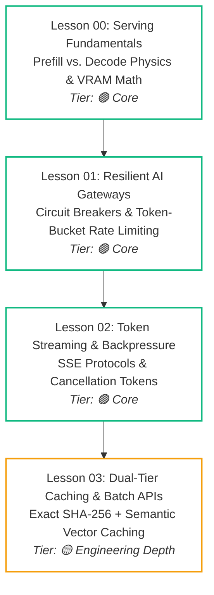
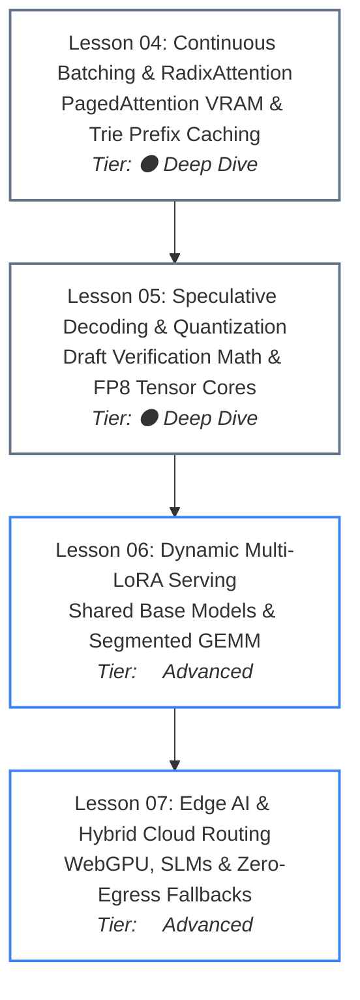

# Phase 07: High-Throughput Serving & LLMOps

> **Architectural overview and learning progression for Principal Systems Engineers, Lead Developers, and Solutions Architects transitioning from single-call AI prototypes to production-grade, high-throughput serving infrastructure.**

---

## 🎯 Phase Engineering Goal

Phase 07 equips senior backend, systems, and distributed computing engineers to build and operate resilient, cost-efficient, and high-throughput AI serving infrastructure.

By the end of this phase, you will be able to:
- **Profile the inference lifecycle**: Dissect the prefill (compute-bound) and decode (memory-bound) phases, calculate KV cache memory footprints, and measure Time-To-First-Token (TTFT) and Inter-Token Latency (ITL).
- **Architect resilient multi-provider gateways**: Implement circuit breakers with decorrelated jitter and distributed two-phase token-bucket rate limiting in Redis to protect upstream quotas and survive provider outages.
- **Master network wire streaming protocols**: Handle Server-Sent Events (SSE) flow control, eliminate TCP socket buffer bloat, and terminate upstream zombie generation via client disconnect cancellation tokens.
- **Slash inference costs by 40–50%**: Deploy dual-tier caches (sub-5ms SHA-256 exact matching and pgvector semantic cosine similarity) and asynchronous Batch API pipelines for background workloads.
- **Deploy continuous batching engines**: Configure self-hosted vLLM and SGLang clusters leveraging iteration-level continuous batching, PagedAttention virtual memory block tables, and RadixAttention trie prefix reuse.
- **Accelerate decode throughput**: Break the autoregressive memory bandwidth wall using draft-and-verify speculative decoding and modern hardware quantization (FP8 and AWQ INT4).
- **Serve hundreds of fine-tuned adapters**: Host dynamic Multi-LoRA adapters on a single shared frozen base model cluster using segmented batched GEMM kernels and host-to-device memory paging.
- **Deploy hybrid edge-cloud systems**: Run quantized Small Language Models (SLMs) locally on client devices via WebGPU (WebLLM), Apple MLX, and ONNX Runtime GenAI with zero-egress privacy boundaries.

---

## 🗺️ Dual-Track Architecture & Learning Progression

Phase 07 is organized into two complementary systems engineering tracks:

### Track A: Gateway, Wire Protocols & Economic Optimization



#### Track A Walkthrough
1. **Serving Fundamentals (Lesson 00)**: Establishes the physical realities of model execution: memory bandwidth constraints, KV cache memory formulas, and the operational divide between prompt prefill and token decode.
2. **Gateway Perimeter (Lesson 01)**: Deploys the perimeter proxy: multi-provider fallback cascades, automated circuit breakers, and distributed two-phase token reservation.
3. **Streaming Wire (Lesson 02)**: Eliminates the blank screen using Server-Sent Events (SSE), applies socket flow control, and prevents zombie token generation through cancellation propagation.
4. **Economic Optimization (Lesson 03)**: Traps duplicate requests in a sub-5ms dual-tier cache and routes non-latency-sensitive batch jobs to 50% discounted asynchronous provider queues.

---

### Track B: High-Throughput Engines, Hardware Mechanics & Edge Deployment



#### Track B Walkthrough
1. **Self-Hosted Engines (Lesson 04)**: Solves memory fragmentation in self-hosted clusters using vLLM PagedAttention and reuses prompt prefixes via SGLang RadixAttention.
2. **Decoding Acceleration (Lesson 05)**: Overcomes the memory bandwidth wall using draft-and-verify speculative decoding and hardware-native FP8 execution.
3. **Multi-Tenant Scale (Lesson 06)**: Serves hundreds of fine-tuned domain adapters concurrently on a single base model cluster using segmented GEMM kernels.
4. **Edge & Hybrid Execution (Lesson 07)**: Shifts routine tasks and privacy-mandated data to client devices using browser WebGPU and local SLMs, reserving cloud gateways for heavy reasoning.

---

## 📚 Master Navigation Table

| # | Lesson Module | Tier | Est. Time | Core Systems Focus | Key Engineering Outcome |
|---|---|:---:|:---:|---|---|
| **00** | [LLM Serving Fundamentals & The Inference Lifecycle](./00-llm-serving-fundamentals-and-the-inference-lifecycle.md) | `🟢 Core` | ~18 min | Prefill vs. decode phase physics, KV cache memory sizing formulas, TTFT vs. ITL latency metrics. | Mathematical precision in VRAM sizing and inference bottleneck profiling. |
| **01** | [Resilient Multi-Provider AI Gateways & Rate Limiting](./01-resilient-ai-gateways-and-rate-limiting.md) | `🟢 Core` | ~20 min | Multi-provider fallback cascades, circuit breakers with decorrelated jitter, distributed two-phase token-bucket rate limiting. | Zero-downtime provider failover and guaranteed tenant quota protection. |
| **02** | [High-Performance Token Streaming & Backpressure](./02-high-performance-token-streaming-and-backpressure.md) | `🟢 Core` | ~18 min | Server-Sent Events (SSE) wire protocol, chunked transfer encoding, socket backpressure, client cancellation propagation. | Elimination of the 15s blank screen and zero zombie token waste. |
| **03** | [Dual-Tier Caching & Asynchronous Batch APIs](./03-dual-tier-caching-and-batch-apis.md) | `🟡 Engineering Depth` | ~22 min | Sub-5ms exact SHA-256 hashing, semantic vector cosine caching (tau ≥ 0.92), tenant key isolation, 50% off Batch APIs. | 25–50% inference bill reduction and sub-50ms cache hits. |
| **04** | [Continuous Batching, PagedAttention & RadixAttention](./04-vllm-continuous-batching-and-radixattention.md) | `⚫ Deep Dive` | ~25 min | Iteration-level continuous batching, virtual memory paging for KV tensors, Radix trie prefix reuse. | 3–5x GPU throughput increase on self-hosted vLLM and SGLang clusters. |
| **05** | [Speculative Decoding & Modern Hardware Quantization](./05-speculative-decoding-and-model-quantization.md) | `⚫ Deep Dive` | ~25 min | Draft-and-verify speculative decoding, acceptance rate mathematics, native FP8 Tensor Core compute, AWQ 4-bit weights. | 2–3x wall-clock decoding speedup with zero perplexity loss. |
| **06** | [Dynamic Multi-LoRA Adapter Serving at Scale](./06-dynamic-multi-lora-adapter-serving.md) | `🔵 Advanced` | ~22 min | Low-Rank Adaptation (LoRA) mathematics, S-LoRA/Punica runtimes, memory pooling, batched segmented GEMMs on shared models. | Serving 100+ fine-tuned tenant adapters on a single shared base GPU cluster. |
| **07** | [Edge AI, Local Runtimes & Hybrid Cloud Routing](./07-edge-ai-and-client-side-inference.md) | `🔵 Advanced` | ~16 min | WebLLM (WebGPU), Apple MLX, Ollama (GGUF), ONNX Runtime GenAI, hardware probing, tiered edge-cloud continuum. | Zero-egress privacy, offline field availability, and zero-cost local execution. |

---

## 🛠️ Associated Hands-On Labs

- **Phase Capstone Lab**: [Production Multi-Provider Resilient AI Gateway](./labs/capstone-production-ai-gateway.md)
  - Build a FastAPI or .NET 9 AI Gateway implementing dual-tier caching, token-bucket rate limiting, circuit breaking, SSE streaming, and cancellation tokens.
  - Pass the 5 automated chaos verification test cases.
- **Reference Microservice Implementation**:
  - Located at `agent-forge/agent_forge/gateway/`
  - Run verification harness:
    ```bash
    python -m unittest agent-forge/tests/test_all.py
    ```

---

## 📋 Prerequisites & Cross-Phase Dependencies

- **Required Prior Knowledge**:
  - [Phase 00: Foundations & Token Mechanics](../00-foundations-and-token-mechanics/README.md) (Transformer architecture, KV cache sizing formulas, prefill vs. decode physics).
  - [Phase 01: Prompt & Context Engineering](../01-prompt-and-context-engineering/README.md) (Context budgeting, token compaction, prompt prefix alignment).
  - [Phase 05: AI Security & Guardrails](../05-ai-security-and-guardrails/README.md) (Zero-trust gateway boundaries, prompt injection quarantine).
  - [Phase 06: GenAI Evals & Observability](../06-evals-and-observability/README.md) (OpenTelemetry GenAI semantic conventions and inference latency golden signals).
- **Downstream Beneficiaries**:
  - Feeds into [Phase 08: AI-Augmented SDLC & Leadership](../08-ai-augmented-sdlc-and-leadership/README.md) (Production Readiness Reviews, SLA budgets, and Architecture Review Board governance).

---

## 📚 Curated Primary Sources & Verification References

1. **PagedAttention (vLLM)**: Kwon et al., *"Efficient Memory Management for Large Language Models with PagedAttention"*, SOSP 2023. [arXiv:2309.06180](https://arxiv.org/abs/2309.06180)
2. **RadixAttention (SGLang)**: Zheng et al., *"SGLang: Efficient Execution of Structured Language Model Programs"*, 2024. [arXiv:2312.07104](https://arxiv.org/abs/2312.07104)
3. **Speculative Decoding**: Leviathan et al., *"Fast Inference from Transformers via Speculative Decoding"*, ICML 2023. [arXiv:2211.17192](https://arxiv.org/abs/2211.17192)
4. **S-LoRA (Multi-LoRA Serving)**: Sheng et al., *"S-LoRA: Serving Thousands of Concurrent LoRA Adapters"*, MLSys 2024. [arXiv:2311.03285](https://arxiv.org/abs/2311.03285)
5. **AWQ Quantization**: Lin et al., *"AWQ: Activation-aware Weight Quantization for On-Device LLM Compression and Acceleration"*, MLSys 2024. [arXiv:2306.00978](https://arxiv.org/abs/2306.00978)
6. **W3C Server-Sent Events Specification**: [html.spec.whatwg.org/multipage/server-sent-events.html](https://html.spec.whatwg.org/multipage/server-sent-events.html)
7. **OpenAI Batch API & Prompt Caching**: [platform.openai.com/docs/guides/batch](https://platform.openai.com/docs/guides/batch)

---

## 🧭 Navigation

### Phase Progression
- **Previous Phase**: **[← Phase 06: GenAI Evals & Observability](../06-evals-and-observability/README.md)**
- **Next Phase**: **[Phase 08: AI-Augmented SDLC & Leadership →](../08-ai-augmented-sdlc-and-leadership/README.md)**

### Direct Chapter & Lesson Directory
- **[Lesson 00: LLM Serving Fundamentals & The Inference Lifecycle](./00-llm-serving-fundamentals-and-the-inference-lifecycle.md)**
- **[Lesson 01: Multi-Provider AI Gateways & Rate Limiting](./01-resilient-ai-gateways-and-rate-limiting.md)**
- **[Lesson 02: High-Performance Token Streaming & Backpressure](./02-high-performance-token-streaming-and-backpressure.md)**
- **[Lesson 03: Dual-Tier Caching & Asynchronous Batch APIs](./03-dual-tier-caching-and-batch-apis.md)**
- **[Lesson 04: Continuous Batching, PagedAttention & RadixAttention](./04-vllm-continuous-batching-and-radixattention.md)**
- **[Lesson 05: Speculative Decoding & Modern Hardware Quantization](./05-speculative-decoding-and-model-quantization.md)**
- **[Lesson 06: Dynamic Multi-LoRA Adapter Serving at Scale](./06-dynamic-multi-lora-adapter-serving.md)**
- **[Lesson 07: Edge AI, Local Runtimes & Hybrid Cloud Routing](./07-edge-ai-and-client-side-inference.md)**
- **[Hands-On Capstone Lab: Resilient Multi-Provider AI Gateway](./labs/capstone-production-ai-gateway.md)**
