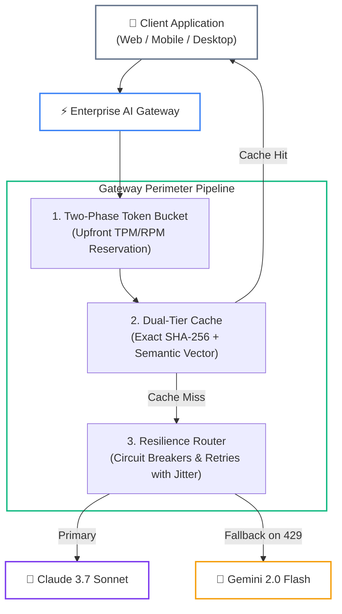

# Phase 07 Production Examples: Resilient Gateways & Serving Infrastructure

> **Enterprise reference implementations demonstrating resilient AI gateway architectures in Python (FastAPI + Dual-Tier Cache + LiteLLM) and C# (.NET 9 + Polly v8 + Redis).**

---

## 🎯 Architectural Overview

In high-throughput enterprise deployments, raw client requests must never bind directly to cloud foundation model SDKs. These reference implementations demonstrate the **Protective Ingress Perimeter**:



### Visual Walkthrough
1. **Inbound Ingress**: The client initiates an inference request via HTTP POST specifying tenant metadata and prompt parameters.
2. **Two-Phase Rate Limiting**: The gateway estimates upper-bound token consumption and reserves capacity from the tenant's Redis token bucket before allocating GPU/cloud compute.
3. **Dual-Tier Caching**: The request is checked against sub-5ms exact SHA-256 hashes first. On miss, it evaluates semantic vector cosine similarity (tau >= 0.85–0.92). Hits return immediately, bypassing model invocation and refunding reserved tokens.
4. **Resilience Routing & Streaming**: Uncached queries enter a circuit breaker pipeline. If the primary provider throttles (HTTP 429) or experiences 5xx outages, traffic diverts to the secondary provider without dropping active user connections. Tokens stream back via Server-Sent Events (SSE).
5. **Disconnect Cancellation**: If the end-user closes their tab, the gateway detects socket termination and immediately halts upstream inference, terminating expensive "zombie tokens."

---

## 📁 Reference Implementations

| Implementation | Framework / Runtime | Core Architectural Patterns | Key Dependencies |
|---|---|---|---|
| [`gateway_service.py`](./gateway_service.py) | **Python 3.12+ / FastAPI** | Dual-tier cache (Exact + Semantic), two-phase token reservation, SSE streaming with disconnect detection, automated failover router. | `pydantic>=2.0` (Offline testable; optionally `fastapi`, `redis`, `litellm`) |
| [`ResilientAgentService.cs`](./ResilientAgentService.cs) | **C# / .NET 9 ASP.NET Core** | Polly v8 composite pipeline (exponential backoff + decorrelated jitter + circuit breaker), Redis exact caching, `IAsyncEnumerable<T>` SSE streaming, cancellation tokens. | `Polly.Core (v8.x)`, `StackExchange.Redis`, `Microsoft.Extensions.AI` |

---

## 🚀 Running and Verifying the Python Gateway

The Python implementation (`gateway_service.py`) features a **dual-mode runtime**:
1. **Production ASGI Mode**: Exposes FastAPI REST endpoints (`POST /v1/chat/completions/stream`) when running with Uvicorn.
2. **Offline Chaos Test Mode**: Runs a comprehensive 6-scenario verification test harness with zero external dependencies when executed directly from the terminal.

### Executing the Self-Contained Test Suite

Run the test suite directly with Python 3.12+:

```bash
python 07-production-deployment-and-llmops/examples/gateway_service.py
```

### Verified Terminal Output

```text
======================================================================
 🚀 ENTERPRISE AI GATEWAY: OFFLINE VERIFICATION & CHAOS TEST HARNESS
======================================================================

[Scenario 1] Inbound Cold Query: 'Explain the CAP theorem'
  -> Emitted 11 stream chunks. Upstream calls: 1
  -> First chunk sample: data: {"token":"Resilient ","cached":false,"cache_type":"none","ttft_ms":23.67,"provider":"anthropic/claude-3-7-sonnet"}

[Scenario 2] Exact Duplicate Query: 'Explain the CAP theorem'
  -> Cache hit verified! Upstream calls remained 1.
  -> Chunk content: data: {"token":"...","cached":true,"cache_type":"exact","ttft_ms":0.06,"provider":"primary"}

[Scenario 3] Semantic Near-Duplicate: 'Explain the CAP theorem in depth'
  -> Semantic vector cache hit verified! Upstream calls remained 1.
  -> Chunk content: data: {"token":"...","cached":true,"cache_type":"semantic (sim=0.88)","ttft_ms":0.06,"provider":"primary"}

[Scenario 4] Outage Injection: Primary returns HTTP 429 -> Circuit Breaker Trips
  -> Secondary provider failover verified without dropping active client!

[Scenario 5] Client Disconnect: Socket closed after 2 tokens
  -> Disconnect caught cleanly! Halted after 3 chunks, preventing zombie tokens.

[Scenario 6] Quota Throttling: Exhausting tenant TPM capacity
  -> Tenant throttled upfront! Error payload returned before compute invocation.

======================================================================
 ✅ ALL 6 GATEWAY RESILIENCE SCENARIOS PASSED WITH ZERO FAILURES
======================================================================
```

---

## 🛡️ .NET 9 Polly v8 Resilience Pipeline Architecture

In high-concurrency C# enterprise services, resiliency is configured using Polly v8's `ResiliencePipelineBuilder`:

```csharp
// Composite Resilience Pipeline: Outer Retry + Inner Circuit Breaker
var resiliencePipeline = new ResiliencePipelineBuilder()
    // 1. Outer Retry Strategy: Handles transient glitches and rate surges
    .AddRetry(new RetryStrategyOptions
    {
        MaxRetryAttempts = 3,
        Delay = TimeSpan.FromMilliseconds(500),
        BackoffType = DelayBackoffType.Exponential,
        UseJitter = true,
        ShouldHandle = new PredicateBuilder()
            .Handle<HttpRequestException>()
            .Handle<TimeoutException>()
    })
    // 2. Inner Circuit Breaker Strategy: Trips when failure ratio exceeds 50%
    .AddCircuitBreaker(new CircuitBreakerStrategyOptions
    {
        FailureRatio = 0.5,
        SamplingDuration = TimeSpan.FromSeconds(30),
        MinimumThroughput = 10,
        BreakDuration = TimeSpan.FromSeconds(15),
        ShouldHandle = new PredicateBuilder()
            .Handle<HttpRequestException>()
            .Handle<TimeoutException>(),
        OnOpened = args =>
        {
            logger.LogError("Primary LLM Circuit Breaker tripped OPEN! Diverting to Secondary.");
            return ValueTask.CompletedTask;
        }
    })
    .Build();
```

### Why Order Matters in Polly v8:
- **Outer Layer (Retry)**: Retries transient network timeouts and throttled requests using decorrelated exponential jitter to prevent synchronized thundering herds against the provider.
- **Inner Layer (Circuit Breaker)**: Monitors the underlying failures. If 50% of requests fail within the sampling window, the circuit breaker opens immediately. Subsequent calls throw a `BrokenCircuitException`, allowing the gateway to divert traffic directly to the secondary provider without burning retry attempts against a dead upstream endpoint.

---

## 🔗 Cross-Lesson Architecture References

- **[Lesson 01: Resilient Multi-Provider AI Gateways](../01-resilient-ai-gateways-and-rate-limiting.md)**: Deep dive into distributed token-bucket rate limiting and decorrelated jitter formulas.
- **[Lesson 02: High-Performance Token Streaming & Backpressure](../02-high-performance-token-streaming-and-backpressure.md)**: Server-Sent Events protocol mechanics, socket buffer bloat, and cancellation tokens.
- **[Lesson 03: Dual-Tier Caching & Asynchronous Batch APIs](../03-dual-tier-caching-and-batch-apis.md)**: Sub-5ms exact hashing, cosine similarity boundaries, and Batch API scheduling.
- **[Phase Capstone Lab: Resilient Multi-Provider AI Gateway](../labs/capstone-production-ai-gateway.md)**: Hands-on implementation challenge with automated chaos test cases.
