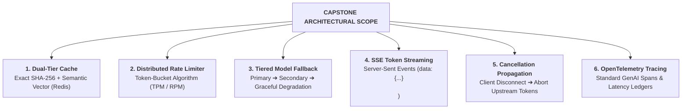

# Capstone Challenge: Production Multi-Provider Resilient AI Gateway

> **Architectural Level:** `[MUST-HAVE]` 🔴  
> **Parent Module:** [Phase 07: Production Deployment & LLMOps](../README.md)

---

### 🎯 Challenge Objective
Architect and implement an enterprise-grade **Resilient Multi-Provider AI Gateway Microservice** in either **Python (FastAPI)** or **C# (.NET 9)** capable of sustaining simulated provider outages and rate-limit surges without dropping active client connections.

---

### 📐 Architectural & Functional Requirements

1. **Dual-Tier Cache Engine**:
   - **Tier 1**: Exact string hash matching (`SHA-256`) against Redis with TTL = 24 hours.
   - **Tier 2**: Semantic vector similarity search against Redis Vector or pgvector using dense embeddings (`text-embedding-3-small`). If cosine similarity $\ge 0.92$, serve cached content immediately.
2. **Dynamic Tiered Resilience Router**:
   - **Primary Model**: Claude 3.7 Sonnet or Azure OpenAI GPT-4o.
   - **Secondary Model**: Google Cloud Vertex AI Gemini 1.5 Pro.
   - **Tertiary Model (Degraded)**: Gemini 1.5 Flash or Claude 3.5 Haiku.
   - Configure a circuit breaker: If the primary provider fails 5 times consecutively or returns HTTP 429, trip the circuit into `OPEN` state for 30 seconds and route traffic directly to the secondary provider.
3. **Token Budget & Rate Limiting**:
   - Enforce a tenant quota: 100,000 tokens per tenant per day.
   - Maintain a sliding window rate limiter: Max 30 requests per minute per user.
4. **Streaming Protocol**:
   - Expose endpoint `POST /v1/gateway/chat/stream`.
   - Stream tokens formatted as standard SSE (`data: {...}\n\n`).
   - Propagate cancellation tokens: If the client terminates the HTTP connection, immediately abort inference on the active provider.
5. **Observability**:
   - Emit an OpenTelemetry span for every request containing attributes:
     `gen_ai.system`, `gen_ai.request.model`, `gen_ai.response.model`, `gen_ai.usage.prompt_tokens`, `gen_ai.usage.completion_tokens`, and `gateway.cache_hit_type` (none, exact, semantic).

---

### 🧪 Verification & Acceptance Test Suite

Your capstone implementation must pass the following simulated production chaos tests:

- [ ] **Test Case 1: The Exact Cache Hit**:
  - Dispatch prompt: *"Explain CAP theorem in two sentences."* (Observe full generation, record TTFT).
  - Dispatch identical prompt again.
  - **Assertion**: Response returned with `"cached": true`, latency < 15ms, and zero upstream LLM API calls generated.
- [ ] **Test Case 2: The Semantic Cache Hit**:
  - Dispatch prompt: *"Explain the CAP theorem in 2 concise sentences."*
  - **Assertion**: Cosine similarity exceeds 0.92; response returned from cache with `"cache_type": "semantic"`, latency < 50ms.
- [ ] **Test Case 3: Primary Provider 429 Outage Simulation**:
  - Inject a mock or proxy rule forcing the Primary Model to return `HTTP 429 Too Many Requests`.
  - Dispatch 5 requests.
  - **Assertion**: The Gateway automatically catches the 429, logs the incident, falls back to the Secondary Provider (Gemini 1.5 Pro), and the end user receives an unbroken SSE token stream without seeing an error.
- [ ] **Test Case 4: Client Disconnect Cancellation**:
  - Initiate a generation requiring 2,000 tokens.
  - Terminate the client socket after receiving 50 tokens.
  - **Assertion**: Microservice logs show `Client disconnected. Cancellation token triggered.` Upstream inference terminates immediately, preventing unread token generation.
- [ ] **Test Case 5: Tenant Quota Enforcement**:
  - Exhaust a test tenant's token budget.
  - Dispatch an additional request.
  - **Assertion**: Gateway immediately returns `HTTP 429 / 402 Quota Exceeded` before executing vector search or calling any cloud models.

---

### 🔗 Architecture & Implementation References
- [Enterprise Multi-Provider AI Gateway Architecture](../README.md#enterprise-multi-provider-ai-gateway-architecture)
- [Python: Production FastAPI Gateway Implementation](../README.md#python-production-fastapi-gateway-with-litellm-router-semantic-redis-cache--sse)
- [C# / .NET 9: Enterprise Resilient Agent Service Implementation](../README.md#c--net-9-enterprise-resilient-agent-service-with-polly-v8--sse-streaming)
- [Handling HTTP 429 with Decorrelated Jitter](../README.md#handling-http-429-exponential-backoff-with-decorrelated-jitter)
- [Exact Hash Matching vs. Embedding-Based Semantic Caching](../README.md#exact-hash-matching-vs-embedding-based-semantic-caching)

---

[Return to Phase 07: Production Deployment & LLMOps](../README.md)
