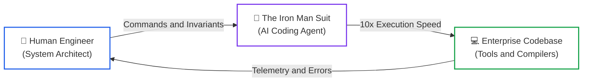
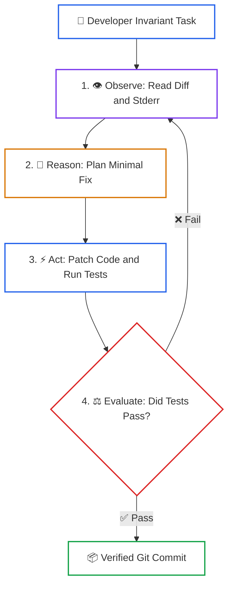

# Lesson 00: Foundations of the AI-Native SDLC (Software 3.0)

> **Tier**: `🟢 Core` | **Read time**: ~12 min | **Prerequisites**: [Phase 00: Foundations](../00-foundations-and-token-mechanics/README.md), [Phase 04: Stateful Agents](../04-agentic-systems-and-orchestration/README.md)  
> **Core Concept**: Software engineering is shifting from manual syntax typing to autonomous agent orchestration. Developers act as system architects and verification arbiters who guide closed feedback loops.  
> **New AI terms introduced**: Software 3.0, ReAct loop, closed-loop execution, open-loop generation  
> **AI terms assumed from earlier lessons**: [token](../00-foundations-and-token-mechanics/01-tokens-and-byte-pair-encoding.md), [context window](../01-prompt-and-context-engineering/01-context-windows-and-attention-budgets.md), [tool](../03-tools-and-model-context-protocol/01-function-calling-mechanics.md), [agent](../04-agentic-systems-and-orchestration/01-agentic-architectures-and-patterns.md)

---

## 🎯 What You Will Learn

- How software engineering shifted from manual syntax (1.0) to neural weights (2.0) to agent orchestration (3.0).
- Why open-loop autocomplete produces high-churn code and subtle production bugs.
- How closed-loop coding agents use feedback from compilers and test suites to repair errors.
- How to run a typed Python harness that simulates an agent self-correcting a broken function.

---

## 1. The Problem: The Velocity Illusion of Open-Loop AI

For four decades, software engineers authored systems by typing syntax character by character. We memorized language quirks, parsed compiler errors, and maintained mental models of distributed state.

The first generation of AI coding tools (2021–2023) introduced inline autocomplete and sidebar chats. Developers welcomed them because typing boilerplate became faster. Yet engineering organizations soon discovered an uncomfortable reality: **generating code faster did not mean shipping reliable software faster**.

```text
========================================================================
THE VELOCITY ILLUSION
========================================================================
Time spent writing initial syntax:     45 minutes  →  15 seconds
Time spent debugging subtle edge case: 15 minutes  →  3 hours
Net engineering velocity change:       Negative (more rework, higher churn)
========================================================================
```

Autocomplete tools operate **open-loop**. They emit tokens based on probability without checking whether the code compiles, handles database nulls, or respects domain invariants. The human developer remains a manual copy-paster and bug hunter.

When teams deploy open-loop AI across enterprise services, code churn surges. Developers skim 400-line diffs, assume passing surface tests mean correct logic, and merge silent regressions. To build durable systems, we must replace open-loop generation with **closed-loop agentic engineering**.

---

## 2. The Mental Model: Karpathy's Iron Man Suit

Andrej Karpathy framed the paradigm shift in computing across three eras:

```text
========================================================================
COMPUTING ERAS
========================================================================
Software 1.0: Humans write explicit logic (C++, Python, Go, Java).
Software 2.0: Optimizers learn neural weights from data (PyTorch).
Software 3.0: Reasoning models orchestrate tools and code via agents.
========================================================================
```

In Software 3.0, we do not build an autopilot that flies the plane while the pilot naps in first class. Instead, **we step into Tony Stark's Iron Man suit**:



### Walkthrough
1. **The Pilot (You)**: You set system boundaries, data contracts, and non-negotiable invariants.
2. **The Suit (The Agent)**: The suit provides superhuman mechanical strength. It drafts multi-file edits, searches symbol trees, and generates test suites in seconds.
3. **The Sensor Array (Verification)**: You never fire a repulsor blast without verified sensor lock. Deterministic compilers and test suites validate every move before production release.

> **Where this analogy breaks**: An Iron Man suit never hallucinates a nonexistent physical law. An AI coding agent will confidently invent API methods or package versions unless bound by strict compiler contracts.

---

## 3. How It Works, One Term at a Time

### Mechanism 1: Closed-Loop ReAct Execution
* 🧒 **The Analogy**: A student solving a math problem on scratch paper. They write a step, check the intermediate total with a calculator, spot a sign error, erase it, and try again before submitting their exam.
* ⚙️ **The Engineering**: Autonomous coding agents run a **ReAct (Reason + Act)** loop:
  1. **Observe**: Read workspace files, git status, and compiler errors.
  2. **Reason**: Plan the next code edit against repository contracts.
  3. **Act**: Invoke tools (edit file chunks, run linters, execute unit tests).
  4. **Evaluate**: Inspect tool return codes. If tests fail, feed stderr back into the context window and retry.
* ⚠️ **What happens if you skip this?**: Open-loop output delivers code with inverted boolean logic and missing null checks directly to human pull requests.



### Walkthrough
1. **Developer Invariant Task**: The engineer specifies the business rule and the failing test case.
2. **Observe**: The agent gathers local diagnostic evidence from the environment.
3. **Reason**: The agent synthesizes an edit plan focused strictly on the failure trace.
4. **Act**: The agent applies the code change and invokes the test runner tool.
5. **Evaluate**: If stderr contains an error, execution loops back to step 1. If green, the agent produces an atomic commit.

---

### Mechanism 2: Verification Arbiters Over Syntax Typists
* 🧒 **The Analogy**: An architect inspecting a skyscraper foundation. They do not pour concrete by hand; they verify structural density using ultrasound sensors and blueprints.
* ⚙️ **The Engineering**: Senior engineers stop spending energy typing boilerplate getters, DTO mappings, and CRUD endpoints. They invest their attention in:
  1. Specifying unambiguous machine contracts (OpenAPI, Pydantic, Protobuf).
  2. Authoring property-based fuzz tests and concurrency stress tests.
  3. Auditing architecture boundaries and security blast radiuses.
* ⚠️ **What happens if you skip this?**: Engineers become passive reviewers of massive AI diffs. Review fatigue leads to rubber-stamping, and critical security bugs slip into main branches.

---

## 4. Try It: A Runnable Closed-Loop Coding Engine

This script demonstrates a self-contained ReAct repair loop in Python 3.12+. It gives an agent a broken discount calculation function, runs a deterministic test suite, captures stderr, feeds it back, and verifies the repaired code.

```python
"""
react_coding_loop.py
Demonstrates an offline closed-loop ReAct agent repairing broken code via test feedback.
Requires Python 3.12+ and Pydantic v2. Run directly with python.
"""

from dataclasses import dataclass
from decimal import Decimal
import io
import sys
import unittest
from pydantic import BaseModel, Field


# 1. State schema for the agent loop
class AgentStep(BaseModel):
    step_number: int
    thought: str
    action: str
    test_passed: bool
    diagnostics: str = Field(default="")


# 2. Buggy source code and target test suite
INITIAL_CODE = """
def calculate_discount(price: float, discount_percent: float) -> float:
    # BUG: Subtracting percentage directly instead of calculating ratio
    return price - discount_percent
"""

REPAIRED_CODE = """
def calculate_discount(price: float, discount_percent: float) -> float:
    if not (0.0 <= discount_percent <= 100.0):
        raise ValueError("Discount percent must be between 0 and 100")
    if price < 0.0:
        raise ValueError("Price cannot be negative")
    discount_amount = price * (discount_percent / 100.0)
    return round(price - discount_amount, 2)
"""


def run_test_suite(code_under_test: str) -> tuple[bool, str]:
    """Executes unit tests against provided code string in a clean scope."""
    test_scope: dict = {}
    try:
        exec(code_under_test, test_scope)
    except Exception as e:
        return False, f"Syntax/Compilation error: {e}"

    class TestDiscount(unittest.TestCase):
        def test_standard_discount(self):
            fn = test_scope["calculate_discount"]
            # 20% discount on $100.00 should be $80.00
            self.assertEqual(fn(100.0, 20.0), 80.0)

        def test_boundary_zero(self):
            fn = test_scope["calculate_discount"]
            self.assertEqual(fn(50.0, 0.0), 50.0)

        def test_invalid_negative_discount(self):
            fn = test_scope["calculate_discount"]
            with self.assertRaises(ValueError):
                fn(100.0, -5.0)

    suite = unittest.TestLoader().loadTestsFromTestCase(TestDiscount)
    stream = io.StringIO()
    runner = unittest.TextTestRunner(stream=stream, verbosity=1)
    result = runner.run(suite)
    output = stream.getvalue()

    return result.wasSuccessful(), output


def run_react_agent_simulation():
    print("--- STARTING CLOSED-LOOP CODING AGENT ---")
    current_code = INITIAL_CODE
    max_turns = 3

    for turn in range(1, max_turns + 1):
        print(f"\n[Turn {turn}] Executing automated test harness...")
        passed, error_output = run_test_suite(current_code)

        if passed:
            step = AgentStep(
                step_number=turn,
                thought="All assertions green. The code satisfies domain contracts.",
                action="Produce atomic git commit.",
                test_passed=True,
                diagnostics="OK: 3 tests passed cleanly."
            )
            print(f"Thought: {step.thought}")
            print(f"Action:  {step.action}")
            print(f"Status:  VERIFIED GREEN (Ready for Merge)")
            break
        else:
            first_error_line = error_output.strip().split("\n")[-1]
            step = AgentStep(
                step_number=turn,
                thought=f"Tests failed with: {first_error_line}. Patching discount ratio logic.",
                action="Apply patch to calculate_discount function.",
                test_passed=False,
                diagnostics=first_error_line
            )
            print(f"Thought: {step.thought}")
            print(f"Action:  {step.action}")
            print(f"Stderr:  {step.diagnostics}")
            print("Applying code patch...")
            current_code = REPAIRED_CODE


if __name__ == "__main__":
    run_react_agent_simulation()
```

### Real Execution Output

```text
--- STARTING CLOSED-LOOP CODING AGENT ---

[Turn 1] Executing automated test harness...
Thought: Tests failed with: FAILED (failures=1). Patching discount ratio logic.
Action:  Apply patch to calculate_discount function.
Stderr:  FAILED (failures=1)
Applying code patch...

[Turn 2] Executing automated test harness...
Thought: All assertions green. The code satisfies domain contracts.
Action:  Produce atomic git commit.
Status:  VERIFIED GREEN (Ready for Merge)
```

---

## 5. Trade-Offs

| Paradigm | Authoring Speed | Review Overhead | Defect Catch Rate | Engineer Role |
|:---|:---|:---|:---|:---|
| **Software 1.0 (Manual)** | Slow (100–300 lines/day) | Predictable, incremental | Depends on manual unit test diligence | Syntax typist and implementer |
| **Software 2.0 (Autocomplete)** | Fast (1,000 lines/day) | High (reviewer fatigue, large diffs) | Low (superficial mocks pass broken logic) | Tab-completer and manual debugger |
| **Software 3.0 (Closed-Loop)** | **Very Fast (Verified commits)** | **Low (focused on architecture & invariants)** | **High (compiler & property tests enforce rules)** | **System architect & verification arbiter** |

---

## 6. Failure Modes & Anti-Patterns

### Anti-Pattern 1: "Vibe Coding" Without Invariant Contracts
* **Symptom**: A developer prompts an AI assistant until an endpoint returns HTTP 200 locally, then submits a 600-line pull request.
* **Root Cause**: The developer relied on visual inspection of the happy path instead of writing automated invariant assertions.
* **Production Fix**: Mandate that every PR include property tests or automated contract checks before an agent begins generating implementation code.

### Anti-Pattern 2: The Self-Testing Circular Trap
* **Symptom**: An agent writes both the implementation and its own unit tests. All tests pass, but production throws database deadlocks.
* **Root Cause**: The agent generated mocks matching its own faulty assumptions, validating its own hallucinations.
* **Production Fix**: Decouple the test contract from implementation. Maintain machine-readable contracts (`AGENT.md`, OpenAPI) that dictate constraints independently of agent assumptions.

---

## 7. Quick Check

**Scenario**: A junior engineer uses an AI coding assistant to implement a concurrent bank transfer service. The assistant generates clean async code with 10 unit tests. All 10 tests use an in-memory dictionary mock and pass in 40ms. The PR is merged. That night, under high load, account balances desynchronize due to unhandled database race conditions.

**Question**: What fundamental principle of Software 3.0 was violated, and what should the engineering lead mandate?

<details>
<summary>Check your answer</summary>

**Answer**: The team fell into the **Self-Testing Circular Trap**. The agent generated unit tests that mocked away concurrency, confirming its own assumptions.

**The Fix**: The engineering lead must enforce **invariant-first verification**:
1. Define non-negotiable domain contracts in `AGENT.md` (e.g., mandate distributed locks or row-level `SELECT FOR UPDATE`).
2. Require concurrency stress tests (fuzzing parallel executions) that run against real integration containers, not in-memory mocks.
3. Establish the engineer as a **verification arbiter** who inspects state transitions rather than approving superficial mock passes.
</details>

---

## 🧭 Navigation

| Direction | Resource |
|:---|:---|
| **Phase Hub** | [Phase 08: AI-Augmented SDLC & Leadership](./README.md) |
| **Next Lesson** | [Lesson 01: AI Coding Toolchains & Agent Architectures](./01-ai-coding-toolchains-and-agent-architectures.md) |
| **Capstone Lab** | [Capstone Lab: AI-Native Repository Framework](./labs/capstone-ai-native-repository.md) |
