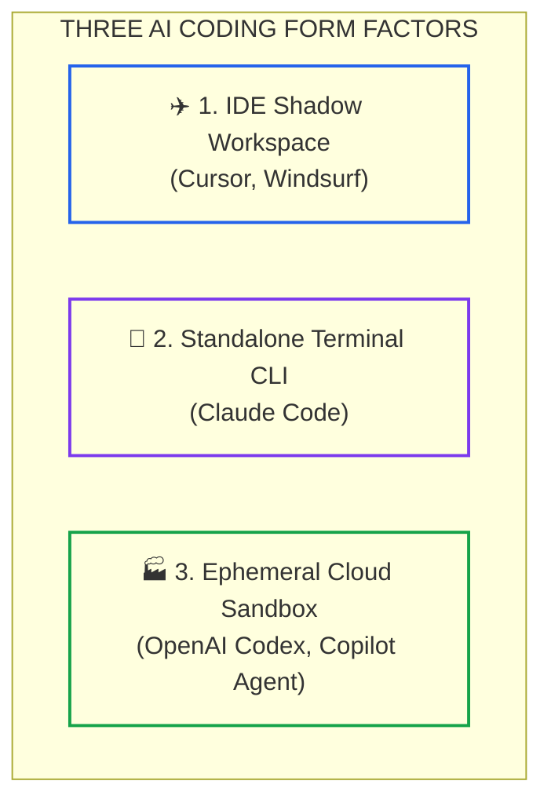
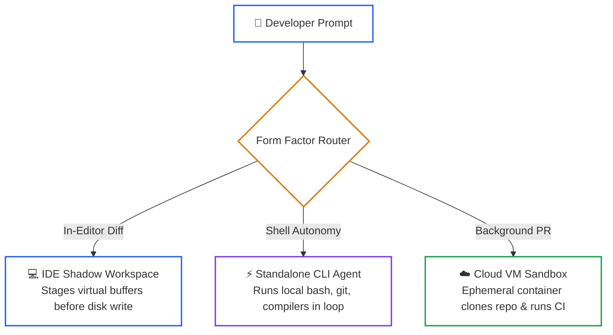

# Lesson 01: AI Coding Toolchains and Agent Architectures (Tool Ecosystems)

> **Tier**: `🟡 Engineering Depth` | **Read time**: ~18 min | **Prerequisites**: [Lesson 00: Foundations of the AI-Native SDLC](./00-foundations-of-the-ai-native-sdlc.md), [Phase 03: Tools & MCP](../03-tools-and-model-context-protocol/README.md)  
> **Core Concept**: Modern AI coding tools differ by architectural form factor, AST indexing strategy, prompt caching mechanics, and permission boundaries. Engineering leads must evaluate blast radiuses and token economics rather than marketing claims.  
> **New AI terms introduced**: prompt caching, prefix caching, Merkle AST indexing, shadow workspace, blast radius  
> **AI terms assumed from earlier lessons**: [ReAct loop](./00-foundations-of-the-ai-native-sdlc.md), [context window](../01-prompt-and-context-engineering/01-context-windows-and-attention-budgets.md), [tool schema](../03-tools-and-model-context-protocol/01-function-calling-mechanics.md), [Model Context Protocol](../03-tools-and-model-context-protocol/02-mcp-architecture-and-transports.md)

---

## 🎯 What You Will Learn

- How the three primary form factors of AI coding tools operate under the hood: IDE Shadow Workspaces, Standalone CLI Agents, and Cloud Sandboxes.
- How Merkle tree AST indexing and Language Server Protocol (LSP) integrations eliminate symbol hallucinations.
- The physics and cost economics of prefix prompt caching across repetitive coding sessions.
- How to run an offline Python simulation measuring prompt cache hit rates and API spend across repository refactorings.

---

## 1. The Problem: The Blast Radius and Context Fragmentation of AI Coding Tools

When engineering organizations evaluate developer tools, they often treat AI coding assistants as interchangeable text generators. Teams purchase subscriptions based on marketing benchmarks without analyzing runtime execution models.

In production environments, unvetted tools introduce severe operational risks:

```text
========================================================================
ENTERPRISE AI TOOLCHAIN FAILURE MODES
========================================================================
1. Unbounded Tool Execution: An agent runs `rm -rf` or drops a local DB.
2. Context Desynchronization: IDE vector index desyncs from git branches.
3. Skyrocketing Token Spend: Querying full repositories repeatedly burns 
   budget without utilizing KV prefix cache tiers.
4. Security Perimeter Leaks: Untrusted external packages execute code inside 
   developer sessions with access to production SSH keys.
========================================================================
```

To govern AI tooling safely, systems architects must look past vendor marketing and analyze three systems properties: **execution environment isolation**, **repository context indexing**, and **token cache economics**.

---

## 2. The Mental Model: The Drone, the Field Mechanic, and the Remote Factory

To understand modern AI coding toolchains, compare their physical deployment locations:



### Walkthrough
1. **The Drone (IDE Shadow Workspace)**: Hovers inside your editor. It inspects open tabs, stages diffs speculatively in shadow memory buffers, and lets you review inline edits before saving to disk.
2. **The Field Mechanic (Terminal CLI Agent)**: Operates directly inside your local shell. It executes builds, inspects git status, reads terminal stdout/stderr, and runs tests in real time.
3. **The Remote Factory (Cloud Sandbox)**: Clones your repository into an isolated, ephemeral virtual machine in the cloud. It refactors whole branches asynchronously in the background and sends you a pull request.

> **Where this analogy breaks**: A physical drone cannot inspect invisible electromagnetic blueprints. An IDE shadow workspace queries Language Server Protocol AST symbol graphs to inspect unseen class hierarchies across un-opened files.

---

## 3. How It Works, One Term at a Time

### Mechanism 1: Three Architectural Form Factors



### Walkthrough
1. **Developer Prompt**: Intent is issued either through an editor hotkey, a terminal prompt, or a GitHub issue label.
2. **IDE Shadow Workspace**: Maintains an uncommitted virtual shadow file buffer. The user can reject individual lines via standard editor keybindings before disk writes occur.
3. **Standalone CLI Agent**: Operates in an iterative terminal loop. It runs local shell commands directly, parses compiler errors, and commits verified patches.
4. **Cloud VM Sandbox**: Executes completely decoupled from the developer machine. It clones the repository into an isolated container, runs test pipelines, and opens a GitHub pull request.

---

### Mechanism 2: Merkle Tree AST Indexing vs. Naive Embedding Search
* 🧒 **The Analogy**: A library card catalog with cryptographic wax seals. If someone updates one chapter in volume 4, only volume 4 gets a new wax seal; the librarian does not re-read all 10,000 books in the library.
* ⚙️ **The Engineering**: Naive semantic vector search splits entire codebases into chunks and re-embeds them on every git commit. Modern agentic IDEs use **Merkle tree AST indexing**:
  - The repository AST is hashed hierarchically from method nodes up to file and directory root hashes.
  - When a file changes, only affected hash branches update.
  - The index resolves type hierarchies and call sites deterministically via Language Server Protocol (LSP) without burning embedding API quotas.
* ⚠️ **What happens if you skip this?**: Vector search returns outdated embeddings from old branches, causing the agent to import deleted classes and hallucinate stale method signatures.

---

### Mechanism 3: Prompt Caching and Prefix Memory Economics
* 🧒 **The Analogy**: A diner short-order cook keeping the pancake batter pre-mixed in a heated dispenser. They do not measure flour, milk, and eggs from scratch for every single customer.
* ⚙️ **The Engineering**: Foundation model providers (Anthropic, OpenAI, Google) implement **prefix prompt caching**:
  - When repetitive system prompts, repository schemas, and `AGENT.md` contracts exceed 1,024 tokens, the model provider caches the Key-Value (KV) attention states in GPU memory for 5 minutes.
  - Subsequent requests matching the identical prefix get processed with **90% discount on input token costs** and **80% lower time-to-first-token (TTFT)** latency.
  - Structuring repository guidelines with static rules at the top and dynamic queries at the bottom maximizes cache hits.
* ⚠️ **What happens if you skip this?**: Putting dynamic timestamps or randomized session IDs at the top of your prompt invalidates the prefix cache on every turn, multiplying token bills by 10x.

---

## 4. The 2026 AI Coding Toolchain Comparison Matrix

| Architectural Dimension | Claude Code (CLI) | Cursor (IDE) | Windsurf (Cascade) | GitHub Copilot Agent | OpenAI Codex (Cloud) |
|:---|:---|:---|:---|:---|:---|
| **Primary Form Factor** | Standalone Terminal CLI | Dedicated Forked IDE | Dedicated Forked IDE | In-Editor / Cloud Agent | Cloud Headless Sandbox |
| **Execution Loop** | Native ReAct loop over shell & git | Shadow buffer diff staging | Real-time Cascade flow tracker | Client-side LSP + cloud runner | Ephemeral container loop |
| **Context Indexing** | AST grep, ripgrep, git logs | Merkle AST tree + vector index | Cascade Flow graph + active logs | Workspace symbol index | Cloud repository clone snapshot |
| **Prompt Caching** | Native 5-min TTL prefix caching | Prefix caching on repo rules | Custom prompt optimization | Context compaction | Batch prompt caching |
| **Terminal Autonomy** | Full shell autonomy (bash/zsh) | 1-click terminal command approval | Guarded terminal execution | Suggests commands in chat | Cloud container bash execution |
| **Permission Controls** | Scoped flags (`--allowedTools`) | Visual diff review gates | Interactive human checkpoints | GitHub Enterprise policy rails | Containerized network quarantine |
| **Primary Risk** | High token burn on unfocused tasks | Index desync on large git merges | Smaller plugin ecosystem | Legacy boilerplate completions | Slow interactive iteration |

---

## 5. Try It: Prompt Cache Economics Simulator

This typed Python 3.12+ script simulates token expenditure and cost savings across repetitive agentic coding turns, demonstrating the financial impact of prefix prompt caching.

```python
"""
prompt_cache_simulator.py
Simulates prompt caching economics and token budgets across agentic coding sessions.
Compatible with Python 3.12+ and Pydantic v2. Run directly with python.
"""

from pydantic import BaseModel, Field


class TurnRequest(BaseModel):
    turn_id: int
    static_prefix_tokens: int = Field(description="Cached repo constitution, AGENT.md, and OpenAPI spec")
    dynamic_diff_tokens: int = Field(description="Active file diff, user prompt, and compiler stderr")
    is_cache_hit: bool


class CostModel(BaseModel):
    uncached_input_price_per_m: float = 3.00   # $3.00 per million tokens (e.g., Claude Sonnet)
    cached_input_price_per_m: float = 0.30     # 90% discount for cached prefix tokens
    output_price_per_m: float = 15.00          # $15.00 per million output tokens


def calculate_turn_cost(request: TurnRequest, output_tokens: int, cost_model: CostModel) -> tuple[float, float]:
    """Calculates cost with caching vs uncached baseline in US Dollars."""
    uncached_total_tokens = request.static_prefix_tokens + request.dynamic_diff_tokens
    baseline_cost = (uncached_total_tokens / 1_000_000) * cost_model.uncached_input_price_per_m
    baseline_cost += (output_tokens / 1_000_000) * cost_model.output_price_per_m

    if request.is_cache_hit:
        cached_prefix_cost = (request.static_prefix_tokens / 1_000_000) * cost_model.cached_input_price_per_m
        dynamic_cost = (request.dynamic_diff_tokens / 1_000_000) * cost_model.uncached_input_price_per_m
        actual_cost = cached_prefix_cost + dynamic_cost
    else:
        actual_cost = baseline_cost

    actual_cost += (output_tokens / 1_000_000) * cost_model.output_price_per_m
    savings = max(0.0, baseline_cost - actual_cost)
    return round(actual_cost, 4), round(savings, 4)


def run_caching_simulation():
    print("--- PROMPT CACHE ECONOMICS SIMULATION (10-TURN SESSION) ---")
    cost_model = CostModel()
    static_prefix = 12_500  # 12.5k tokens: AGENT.md, openapi.yaml, ADRs
    avg_dynamic_diff = 1_200
    avg_output = 600

    total_actual = 0.0
    total_baseline = 0.0

    # Turn 1 is a cache write (uncached), Turns 2-10 are cache hits
    for turn in range(1, 11):
        is_hit = turn > 1
        req = TurnRequest(
            turn_id=turn,
            static_prefix_tokens=static_prefix,
            dynamic_diff_tokens=avg_dynamic_diff,
            is_cache_hit=is_hit
        )
        cost, savings = calculate_turn_cost(req, avg_output, cost_model)
        baseline = cost + savings
        total_actual += cost
        total_baseline += baseline

        status = "CACHE HIT (90% discount)" if is_hit else "CACHE WRITE (Baseline)"
        print(f"Turn {turn:2d} | {status:<28} | Cost: ${cost:.4f} | Saved: ${savings:.4f}")

    total_saved = total_baseline - total_actual
    pct_saved = (total_saved / total_baseline) * 100

    print("-------------------------------------------------------------")
    print(f"Total Baseline Spend (No Caching): ${total_baseline:.4f}")
    print(f"Total Actual Spend (With Caching): ${total_actual:.4f}")
    print(f"Net Financial Savings:             ${total_saved:.4f} ({pct_saved:.1f}%)")


if __name__ == "__main__":
    run_caching_simulation()
```

### Real Execution Output

```text
--- PROMPT CACHE ECONOMICS SIMULATION (10-TURN SESSION) ---
Turn  1 | CACHE WRITE (Baseline)       | Cost: $0.0591 | Saved: $0.0000
Turn  2 | CACHE HIT (90% discount)     | Cost: $0.0163 | Saved: $0.0338
Turn  3 | CACHE HIT (90% discount)     | Cost: $0.0163 | Saved: $0.0338
Turn  4 | CACHE HIT (90% discount)     | Cost: $0.0163 | Saved: $0.0338
Turn  5 | CACHE HIT (90% discount)     | Cost: $0.0163 | Saved: $0.0338
Turn  6 | CACHE HIT (90% discount)     | Cost: $0.0163 | Saved: $0.0338
Turn  7 | CACHE HIT (90% discount)     | Cost: $0.0163 | Saved: $0.0338
Turn  8 | CACHE HIT (90% discount)     | Cost: $0.0163 | Saved: $0.0338
Turn  9 | CACHE HIT (90% discount)     | Cost: $0.0163 | Saved: $0.0338
Turn 10 | CACHE HIT (90% discount)     | Cost: $0.0163 | Saved: $0.0338
-------------------------------------------------------------
Total Baseline Spend (No Caching): $0.5100
Total Actual Spend (With Caching): $0.2058
Net Financial Savings:             $0.3042 (59.6%)
```

---

## 6. Trade-Offs: Choosing the Right Toolchain Form Factor

| Architectural Factor | IDE Shadow Workspace | Standalone Terminal CLI | Cloud Headless Sandbox |
|:---|:---|:---|:---|
| **Iteration Speed** | Instant (<1 second per diff) | Medium (5–15 seconds per loop) | Asynchronous (2–5 minutes per PR) |
| **Multi-File Refactoring** | Moderate (active project scope) | High (can search entire filesystem) | Very High (branch-wide git rewrite) |
| **Blast Radius Risk** | Low (changes staged in editor) | High (direct shell command access) | Minimal (isolated cloud VM) |
| **Developer Ergonomics** | High (familiar keybindings) | Medium (requires terminal comfort) | Low (detached async code review) |
| **Best Used For** | Daily feature authoring & TDD | Complex debugging & refactoring | Mass migrations & dependency bumps |

---

## 7. Failure Modes & Anti-Patterns

### Anti-Pattern 1: Unrestricted Terminal Autonomy on Production Machines
* **Symptom**: An engineer configures a CLI agent with `--dangerously-skip-permissions` while working with live production environment variables in `.env`.
* **Root Cause**: The developer traded security guardrails for convenient unattended execution.
* **Production Fix**: Run CLI agents inside local unprivileged Docker containers or explicitly restrict tool execution via `--allowedTools "Read,Edit,Bash"` and path allowlists.

### Anti-Pattern 2: The Stale Merkle Cache Trap
* **Symptom**: An IDE agent continues to suggest classes and interfaces that were renamed in a previous git branch.
* **Root Cause**: The local AST symbol index failed to invalidate its Merkle hash tree following a large git rebase.
* **Production Fix**: Configure automated git post-checkout hooks that force cache invalidation or re-index the repository AST when switching branches.

---

## 8. Quick Check

**Scenario**: Your engineering team runs multi-turn CLI agent sessions against a large monolith. Every prompt begins with a dynamic session header containing the current timestamp and a random UUID:
```text
System Context: Session ID: 9f8a-4b12 | Timestamp: 2026-10-02T00:05:12Z
Repository Architecture Directives: [15,000 tokens of rules and OpenAPI contracts...]
```
At the end of the sprint, the team's LLM API bill is 3x higher than budgeted, and median response latency is over 4,500ms.

**Question**: What architectural mistake caused the bill surge, and how should the prompt structure be reordered?

<details>
<summary>Check your answer</summary>

**Answer**: The dynamic header (UUID and timestamp) was placed at the very top of the prompt. 

**The Fix**:
1. Prefix prompt caching requires an **exact character-for-character match from token 0**. Placing dynamic tokens at the beginning of the prompt invalidates the entire 15,000-token prefix cache on every single turn.
2. Move the static, immutable repository contracts (`AGENT.md`, OpenAPI schemas) to the very top.
3. Place dynamic, per-turn data (timestamps, UUIDs, recent git diffs, user instructions) at the very bottom of the prompt context.
4. This ensures that the 15,000-token prefix hits the 90% discounted cache tier on turns 2 through N, reducing costs by over 60% and cutting latency by 80%.
</details>

---

## 🧭 Navigation

| Direction | Resource |
|:---|:---|
| **Previous Lesson** | [Lesson 00: Foundations of the AI-Native SDLC](./00-foundations-of-the-ai-native-sdlc.md) |
| **Phase Hub** | [Phase 08: AI-Augmented SDLC & Leadership](./README.md) |
| **Next Lesson** | [Lesson 02: Spec-Driven Development & Codebase Contracts](./02-spec-driven-development-and-codebase-contracts.md) |
| **Capstone Lab** | [Capstone Lab: AI-Native Repository Framework](./labs/capstone-ai-native-repository.md) |
