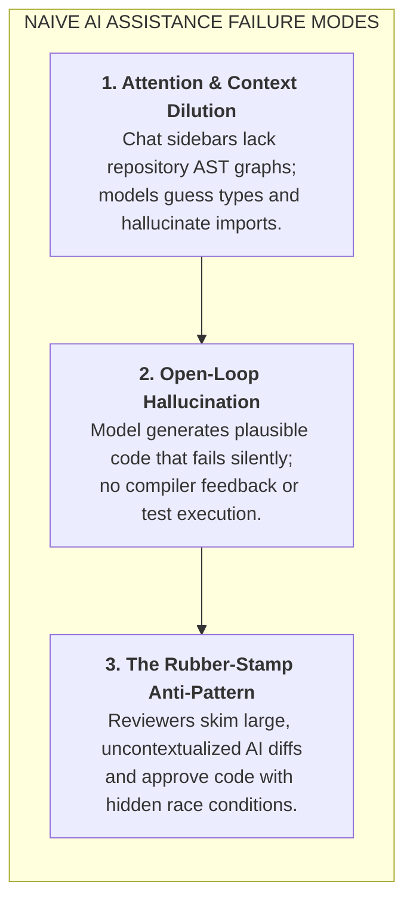
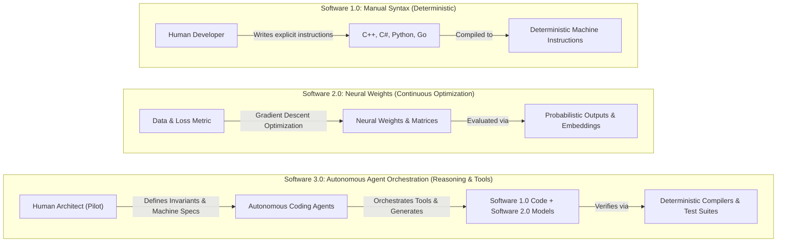
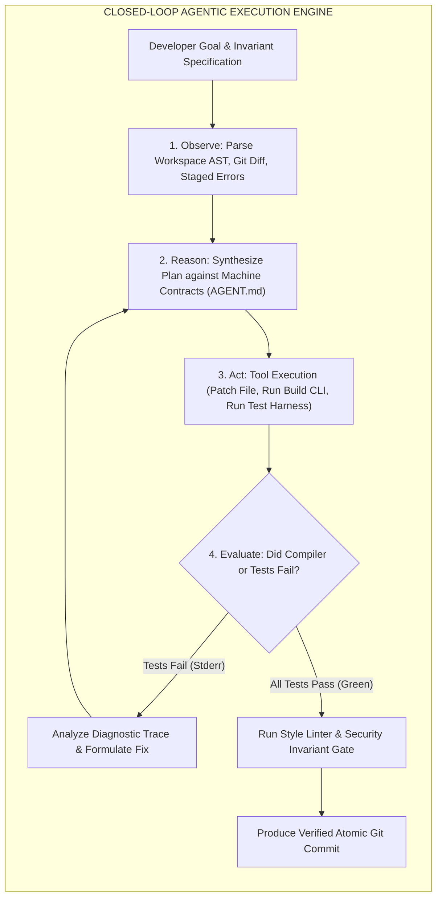

# The AI-Native SDLC Paradigm: Autonomous Toolchains & Agentic Coding Loops

| Depth Tier | Recommended Audience | Estimated Completion Time | Key Prerequisites |
|---|---|---|---|
| `🟢 HIGH ROI / CORE` | Senior Engineers, Tech Leads, Architects | ~20 minutes | Basic understanding of LLM reasoning & tools |

> **Core Concept**: The transition from manual syntax typing (Software 1.0) and chat autocomplete (Software 2.0) to autonomous specification-driven execution (Software 3.0), where developers act as system architects and verification arbiters over bounded ReAct agent loops.

---

## 1. The Architectural Problem

For over four decades, software engineering operated on a single core paradigm: human developers manually translated business intent into explicit syntax line by line. Developers navigated file systems, authored boilerplate, wrote retroactive unit tests, and manually reviewed diffs in web interfaces.

The initial wave of developer-facing generative AI (2021–2023) introduced **AI-assisted programming**: inline autocomplete extensions and sidebar chat interfaces. While helpful for localized utility functions, this model left the underlying software development lifecycle (SDLC) unchanged:
- The human developer remained the primary typist and copy-paster.
- Context was strictly confined to active file buffers or truncated chat windows.
- The execution loop was manual, open-loop, and prone to silent hallucinations.
- Developers spent significant time fixing broken syntax suggestions that lacked awareness of broader codebase invariants.

When applied to complex, multi-service enterprise architectures, chat-based and autocomplete workflows quickly stall. Enterprise software engineering requires multi-file refactoring, strict adherence to architectural layer boundaries, atomic database migrations, and regression-free test passes. Achieving this with ad-hoc prompting creates a **velocity illusion**: code is written faster, but debugging and integration costs surge.

---

## 2. Why Naive Approaches Fail

When organizations attempt to scale developer velocity simply by distributing unguided AI chat subscriptions, three systemic failures emerge:

### 1. Attention & Context Dilution
Chat assistants ingest raw code snippets without semantic project awareness. They cannot resolve deep type hierarchies, cross-package dependency trees, or database migration states. When asked to implement a feature, they guess interface signatures, re-invent existing utilities, or import deprecated packages.

### 2. Open-Loop Generation Without Verification
Autocomplete and chat models operate open-loop: they emit tokens based on probability distributions with zero verification. If a generated function has a subtle syntax error or an inverted boolean expression, the model has no feedback mechanism to inspect the error and self-correct before presenting it to the engineer.

### 3. The Rubber-Stamp Review Trap
Because AI assistants can generate 500 lines of syntactically elegant code in seconds, developers frequently submit bloated pull requests. Human reviewers experience cognitive fatigue and approve PRs based on superficial formatting rather than rigorous invariant validation, allowing critical concurrency and security bugs to slip into production.

---

## 3. The Core Mental Model: Software 1.0 to 2.0 to 3.0

To lead teams through this transition, architects must understand the three distinct eras of computing defined by Andrej Karpathy:

### Visual Walkthrough of the Paradigm Progression
1. **Software 1.0 (Classical Programming)**: Developers write explicit, deterministic algorithms. If an edge case is unhandled in code, the application crashes or behaves erratically. Verification relies on deterministic unit and integration tests.
2. **Software 2.0 (Deep Learning)**: Logic is not written; it is learned through gradient descent over datasets. The resulting weights excel at perceptual tasks (image classification, text embedding) but are opaque and non-deterministic.
3. **Software 3.0 (Agentic Systems)**: Large language foundation models act as probabilistic reasoning engines that orchestrate Software 1.0 code, call Software 2.0 neural networks, and execute CLI tools. The developer's role fundamentally shifts from **syntax typist** to **system architect and verification arbiter**.

---

## 4. Architecture & Mechanics: The Autonomous Coding Loop

Unlike passive autocomplete, an **Autonomous Coding Agent** operates via a closed **Observe-Orient-Decide-Act (OODA) / ReAct (Reason + Act)** loop:

### Step-by-Step Loop Mechanics
1. **Observe**: The agent reads the local workspace, file trees, git status, and diagnostics emitted by the compiler or language server.
2. **Reason**: The agent compares current state against repository rules (`AGENT.md`) and project contracts, formulating an atomic implementation step.
3. **Act**: The agent invokes specialized tools: editing file chunks, running terminal commands (`dotnet test`, `pytest`), or querying language server endpoints.
4. **Evaluate & Self-Correct**: If the build or tests fail, the agent analyzes stderr, adjusts its edits, and re-executes until all assertions are green.

---

## 5. The 2026 Agentic Coding Tool Landscape: The Big Seven

Senior architects must evaluate tools based on architecture, context mechanisms, and enterprise blast radiuses rather than marketing claims:

| Dimension | Claude Code (CLI) | Cursor (IDE) | Windsurf (Cascade) | GitHub Copilot | OpenAI Codex (Cloud) | Gemini Code Assist | Amazon Q Developer |
|:---|:---|:---|:---|:---|:---|:---|:---|
| **Primary Form Factor** | Standalone Terminal CLI Agent | Dedicated Agentic IDE (VS Code Fork) | Dedicated Agentic IDE (Cascade Engine) | Universal IDE Plugin (VS Code, JetBrains) | Cloud Sandbox & Background Agent | IDE Plugin & Cloud Workstations | IDE Plugin, CLI Agent & AWS Console |
| **Foundation Engine** | Claude 3.7 Sonnet (Hybrid CoT reasoning tokens) | Multi-Model Picker (Claude 3.7 Sonnet, GPT-4.5, o3-mini) | Claude 3.7 Sonnet, GPT-4.5 + custom FIM models | Multi-Model Picker (Claude 3.7, GPT-4.5, o3-mini) | OpenAI o3 / o4-mini, Codex VM runtime | Gemini 2.5 Pro / Flash (2M token context window) | Anthropic Claude 3.5/3.7 + Amazon Titan (via Bedrock) |
| **Execution Loop Architecture** | Direct ReAct loop over bash, local file tools, git, compilers | Shadow workspaces with speculative diff staging | Cascade Flow engine tracking real-time developer intent | Client-side LSP extension paired with cloud orchestrator | Cloud-hosted headless ReAct loop in ephemeral containers | Vertex AI grounding engine with workspace semantic graph | Enterprise agent orchestrator with AWS SDK tool execution |
| **Context Strategy** | Local ripgrep, AST grep, git commit history, file trees | `@codebase` Merkle vector index + AST symbol index | Cascade Flow tracker + active terminal logs + graph | Workspace symbol indexing + active tab embeddings | Full repository cloud clone snapshot + AST symbol graph | Gemini 2M context ingestion + Google Code Search graph | AWS CodeConnections repo index + AST security analyzer |
| **Multi-File Refactoring** | Autonomous patch generation, file search, test loops | Composer: simultaneous multi-file streaming diffs | Multi-file Cascade flows with dependency tracking | Multi-file edits via Copilot Edits side-by-side diffs | Autonomous branch-wide refactoring with PR generation | Multi-file suggestions via inline diffs and chat integration | Automated enterprise transformations (Java 8/11 to 17/21) |
| **Terminal / Shell Autonomy** | Full shell autonomy (runs builds, tests, git, custom tools) | Integrated terminal runner with 1-click human approval | Autonomous terminal commands with guardrails | Suggests bash commands in terminal chat (manual enter) | Ephemeral headless cloud Linux container execution | Cloud Shell integration & terminal generation | Amazon Q CLI agent for bash, AWS CLI commands, & scripts |
| **Protocol Support** | Model Context Protocol (MCP) native client | `.cursorrules`, `.cursor/rules/*.mdc`, MCP client | `.windsurfrules`, custom tools, MCP client | GitHub Copilot Extensions, Copilot Agent Mode | OpenAPI 3.0 tool schemas, GitHub App webhooks | Google Agent Development Kit (ADK), Vertex AI Extensions | AWS Bedrock agent protocol, Lambda tool hooks |
| **Critical Pitfall** | High token usage on broad exploratory queries | Can desync if local Merkle vector index becomes stale | Smaller extension ecosystem compared to VS Code | Autocomplete bias toward legacy patterns in repo | High latency for interactive coding; no direct laptop state | Slower reasoning on non-GCP / non-Go/Java stacks | AWS ecosystem lock-in; weaker on multi-cloud architectures |

---

## 6. Implementation & Operational Patterns

### The SDLC Evolution Spectrum

| Lifecycle Phase | Traditional SDLC (Manual) | AI-Assisted (Chat & Snippets) | AI-Native SDLC (Agent-Orchestrated) |
|---|---|---|---|
| **Requirements & User Stories** | PM writes PRD in Confluence; engineers manually extract technical acceptance criteria. | Engineers paste PRD paragraphs into chat: "What edge cases did I miss?" | Agent ingests PRD, cross-references schema, generates Gherkin acceptance criteria, and flags edge cases. |
| **System Architecture & RFCs** | Architect spends weeks creating trade-off decks and sequence diagrams by hand. | Architect uses chat to brainstorm pros/cons or generate initial Mermaid syntax. | Agent benchmarks latency/cost profiles, generates OpenAPI 3.1 contracts, and drafts complete ADRs. |
| **Test Design & TDD** | Tests often written after code or skipped under deadline pressure; manual mocking. | Developer prompts: "Write unit tests for this function I just wrote" (retroactive). | AI-driven TDD: Agent generates full parameterized unit, integration, and property test suites *before* code. |
| **Code Implementation** | Developer types all boilerplate, business logic, mapping code, and tests manually. | Developer uses tab autocomplete and prompts chat for utility snippets; copies/pastes. | Developer specifies interface constraints; agent plans multi-file diff, writes code, and executes test loops. |
| **Code Review & Quality Gates** | Human peer spends 45 minutes spotting syntax nits and style deviations. | Human reviewer runs a local linter or pastes diff into chat for a summary. | Multi-tier AI Review Agent inspects PR against architectural invariants, SQLi, and breaking contract changes. |
| **Incident Response & RCA** | On-call engineer manually sifts through thousands of logs and traces to find root cause. | Engineer pastes stack trace into chat to decipher obscure exceptions. | Autonomous triage agent ingests OTel trace, correlates logs, isolates commit, and drafts complete RCA with repro test. |

---

## 7. Trade-offs & Telemetry

Adopting autonomous coding agents involves concrete architectural trade-offs:

| Engineering Dimension | Traditional Human Authoring | Autonomous Agentic SDLC | Architect Decision Rule |
|---|---|---|---|
| **Raw Authoring Velocity** | 100–300 lines of verified code/day | 1,000–3,000 lines of generated code/day | High velocity requires automated linter and invariant gates to avoid code debt. |
| **Token & API Expenditure** | $0 tooling infrastructure cost | $20–$100 / developer / month in LLM tokens | Justified if 14-day rework rate remains < 10% and PR cycle time compresses by > 50%. |
| **Review Cognitive Load** | Predictable, incremental diffs | Large multi-file diffs; risk of "rubber-stamping" | Mandate builder-validator separation and headless automated PR review bots. |
| **Domain Knowledge Retention** | High; authoring forces mental modeling | Risk of domain atrophy if code is uninspected | Rotate engineers through architecture reviews and invariant authoring. |

---

## 8. Production Failure Modes & Anti-Patterns

### Anti-Pattern 1: "Vibe Coding" in Enterprise Services
- **The Failure**: An engineer iteratively prompts an agent until an endpoint returns HTTP 200 locally, without verifying race conditions, database transactions, or idempotency.
- **The Blast Radius**: Silent data corruption in production under concurrent traffic loads.
- **The Defense**: Enforce machine-readable contracts (`AGENT.md`) and automated concurrency stress tests in CI before PR merge.

### Anti-Pattern 2: The Rubber-Stamp Review
- **The Failure**: A reviewer sees a 600-line AI-generated PR with green unit tests and clicks "Approve" after a 2-minute skim.
- **The Blast Radius**: The agent's unit tests mocked out the very component containing the bug, validating its own hallucinations.
- **The Defense**: Require pull requests to prove compliance against independent domain specifications, not just agent-generated test mocks.

---

## 🧭 Navigation

| Role | Target Resource |
|---|---|
| **Phase Overview** | [Phase 08 Hub: AI-Augmented SDLC & Leadership](./README.md) |
| **Next Lesson** | [Lesson 02: Spec-Driven Development & Codebase Contracts](./02-spec-driven-development-and-codebase-contracts.md) |
| **Hands-On Capstone** | [Capstone Lab: AI-Native Repository Framework](./labs/capstone-ai-native-repository.md) |
