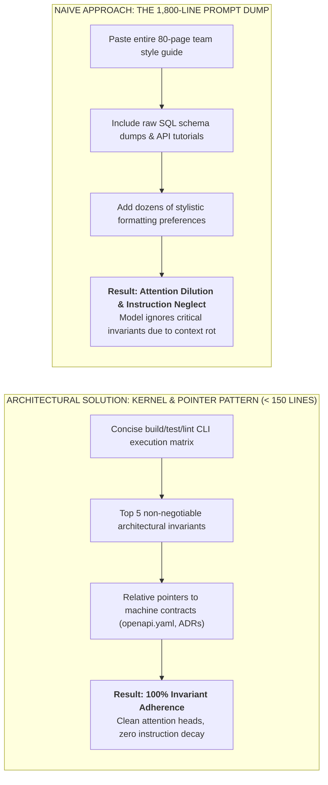
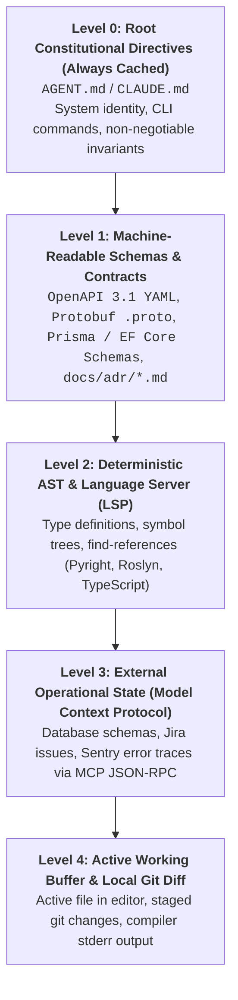

# Spec-Driven Development: Machine-Readable Contracts & Codebase Constitutions

| Depth Tier | Recommended Audience | Estimated Completion Time | Key Prerequisites |
|---|---|---|---|
| `🟢 HIGH ROI / CORE` | Senior Engineers, Tech Leads, Architects | ~22 minutes | Lesson 01 (Autonomous Toolchains & Loops) |

> **Core Concept**: Establishing version-controlled machine contracts (`AGENT.md`, `.cursorrules`, OpenAPI 3.1) at the repository root to guide autonomous coding agents, replacing ad-hoc conversational prompting with deterministic codebase constitutions.

---

## 1. The Architectural Problem

Consider how typical software engineers interact with AI coding assistants: a developer opens an IDE chat sidebar and types an ad-hoc prompt:
```text
"Hey, remember we're using Python 3.12, please use Pydantic v2, don't use raw SQL, and make sure everything is async."
```

Three hours later, in a new chat session, they must retype these constraints. A colleague on the same team prompts slightly differently, asking for "fast code," and the model generates synchronous SQLAlchemy with raw SQL queries. Within three sprints, the codebase fragments into competing styles, inconsistent error formats, and contradictory database access patterns.

This is the chaos of **ad-hoc conversational prompting**:
- Architectural rules exist only in developer memory or scattered Confluence wikis.
- Every chat session starts with zero state, requiring human developers to manually re-explain the tech stack.
- Autonomous coding agents operating in terminal CLI or background CI/CD modes have no way to discover system constraints, leading to constant architectural drift.

To build maintainable software with autonomous agents, engineering teams must transition to **Spec-Driven Development (SDD)**: encoding architectural constraints, build commands, and domain invariants directly into version-controlled machine contracts committed at the repository root.

---

## 2. Why Naive Approaches Fail: The 1,800-Line Prompt Dump

When teams realize that agents need persistent context, they frequently swing to the opposite extreme: dumping their organization's entire 80-page coding style guide, database DDLs, and obsolete API documentation into a single `.cursorrules` or `AGENT.md` file.



### The Physics of Context Dilution
Large language models do not read long prompt files with equal attention across all tokens. They suffer from two proven transformer inference realities:
1. **Context Window Dilution**: As prompt length grows, attention weights disperse across thousands of irrelevant tokens. Critical constraints (e.g., "Never use raw SQL") compete with low-value stylistic guidelines (e.g., "Use 2 spaces for indentation").
2. **"Lost in the Middle" Degradation**: Models reliably attend to instructions placed at the extreme beginning and end of their context window. Invariants placed in the middle of a 1,500-line file are frequently ignored during code generation.

The architectural solution is the **Kernel & Pointer Pattern**: maintaining a root context contract under **150–200 lines** that provides system identity, CLI verification commands, and file pointers to formal machine schemas.

---

## 3. The Core Mental Model: The Michelin Kitchen Station Handbook

Imagine the kitchen of a three-star Michelin restaurant with 12 line cooks:
- If the executive chef had to walk up to every cook every morning and say: *"Cut the carrots into 2-inch matchsticks, cook the risotto with unsalted butter, and never use tap water,"* the kitchen would descend into chaos within an hour.
- Instead, the kitchen operates on an immutable, laminated **Station Handbook** posted at every prep station. It specifies exact knife cuts, cooking temperatures, allergen protocols, and presentation plating.

```text
========================================================================
TRADITIONAL PROMPTING               SPEC-DRIVEN DEVELOPMENT (SDD)
========================================================================
• Verbal, ad-hoc chat requests    • Laminated, version-controlled contract
• Lost when session closes         • Committed to Git root (AGENT.md)
• Contradictory across developers  • Single source of truth for all agents
• Model guesses stack & commands   • Explicit CLI build/test commands
• High hallucination & drift       • Deterministic verification gates
========================================================================
```

`AGENT.md`, `CLAUDE.md`, and `.cursor/rules/*.mdc` are the laminated station handbooks of your software repository. The moment an autonomous agent enters your codebase, it reads the contract and instantly understands the rules of the house.

---

## 4. Architecture & Mechanics: The Context Ingestion Hierarchy

Autonomous coding agents do not process a repository as an undifferentiated blob of text. They ingest context in a strict hierarchical structure:



### Visual Walkthrough of Context Ingestion
1. **Level 0 (Constitutional Directives)**: Cached persistently. Instructs the agent on what commands to run (`dotnet test`, `pytest`) and what architectural taboos to avoid.
2. **Level 1 (Machine Schemas)**: Formal interface contracts (OpenAPI, Protobuf, ADRs). The agent uses these as authoritative specifications before writing business logic.
3. **Level 2 (Deterministic LSP)**: The agent queries language servers to resolve method signatures and type trees, eliminating symbol hallucinations.
4. **Level 3 (Operational State via MCP)**: Dynamic runtime context retrieved on-demand via Model Context Protocol tools.
5. **Level 4 (Working Buffer)**: The localized diff or active file where the agent makes surgical edits.

---

## 5. Comparing Context Standards: AGENT.md vs. CLAUDE.md vs. .cursorrules

Senior architects must choose the appropriate standard based on tool ecosystems and operational environments:

| Standard | Ecosystem | Location | Ingestion Trigger | Scoping Support | Primary Architectural Role |
|:---|:---|:---|:---|:---|:---|
| **`AGENT.md`** | **Universal / Cross-Platform** (Claude Code, Cursor, Windsurf, custom agents) | `/AGENT.md` | Session initialization | Global repo-wide | **The Universal Constitution**: Master contract for multi-agent workflows. |
| **`CLAUDE.md`** | **Anthropic Claude Code (CLI)** | `/CLAUDE.md` | Session start | Global CLI directives | **Terminal Autonomy**: Build commands, test runners, and bash tool safety flags. |
| **`.cursor/rules/*.mdc`** | **Cursor IDE** | `/.cursor/rules/*.mdc` | Semantic search or file match | Glob-scoped (`globs: src/api/**/*.ts`) | **Interactive IDE Flow**: Precision file-specific lint and syntax conventions. |
| **`copilot-instructions.md`** | **GitHub Copilot** | `/.github/copilot-instructions.md` | Chat / inline completion | Global repo-wide | **Universal Baseline**: Enforcing basic team conventions in standard Copilot. |

---

## 6. Production Implementation Patterns

### Pattern 1: Production Master `AGENT.md` (< 150 Lines)

This contract is committed at the repository root. It adheres strictly to the Kernel & Pointer Pattern:

```markdown
# AGENT.md - Enterprise Service Architecture Contract

## 1. System Identity & Tech Stack
- **Service Name**: PaymentProcessing.Service
- **Primary Runtime**: .NET 9 (C# 13) / ASP.NET Core Minimal APIs
- **Database Engine**: PostgreSQL 16 with pgvector & EF Core 9
- **Messaging Bus**: RabbitMQ via MassTransit 8.2
- **Serialization**: System.Text.Json with Native AOT source generators only

## 2. Deterministic CLI Verification Commands
Autonomous agents MUST execute these exact commands to verify changes before proposing diffs:
- **Build**: `dotnet build PaymentProcessing.sln --configuration Release /warnaserror`
- **Unit & Invariant Tests**: `dotnet test tests/PaymentProcessing.Tests/ --filter Category=Unit`
- **Integration Tests**: `dotnet test tests/PaymentProcessing.IntegrationTests/ --no-build`
- **Linter & Style Check**: `dotnet format --verify-no-changes`

## 3. Non-Negotiable Architectural Invariants
1. **Zero Raw Dictionaries in Domain Logic**: All request/response payloads MUST use immutable C# record types with explicit validation attributes. Never use Dictionary<string, object> or dynamic.
2. **Prohibited Dependencies**:
   - DO NOT import Newtonsoft.Json (Use System.Text.Json).
   - DO NOT import AutoMapper (Write explicit mapping extension methods).
   - DO NOT use Dapper in domain handlers (Use repository interfaces).
3. **Hexagonal Architecture Boundaries**:
   - src/Domain must NEVER reference src/Infrastructure or src/Api.
   - All external network calls (Stripe, PayPal) MUST implement an interface located in src/Domain/Contracts.
4. **Idempotency & Concurrency**:
   - Every mutation endpoint MUST require an Idempotency-Key HTTP header (UUIDv4).
   - Unbounded concurrency (Task.WhenAll over unthrottled lists) is strictly prohibited. Always use Parallel.ForEachAsync with an explicit MaxDegreeOfParallelism.

## 4. Contract Single Sources of Truth
- **REST Endpoints**: Strictly adhere to `contracts/openapi.yaml`.
- **Architecture Decisions**: Consult `docs/adr/` before introducing new infrastructure dependencies.
```

### Pattern 2: Scoped Modular Cursor Rule (`.cursor/rules/api-endpoints.mdc`)

Modern Cursor replaces monolithic rules with modular `.mdc` files scoped via YAML frontmatter:

```markdown
---
description: Standards for ASP.NET Core Minimal API Endpoints
globs: ["src/Api/Endpoints/**/*.cs"]
alwaysApply: false
---

# Minimal API Endpoint Standards

- Endpoints must be defined as static extension methods on `RouteGroupBuilder`.
- Use `TypedResults` for all return types (e.g., `Results<Ok<TResponse>, NotFound, ProblemHttpResult>`).
- Always attach `.WithName()`, `.WithOpenApi()`, and `.RequireRateLimiting("StrictFinancialLimit")`.
- Inject dependencies via method parameters using `[FromServices]`, never through field injection.
- Validate input DTOs using FluentValidation validators before executing domain handlers.
```

---

## 7. Trade-offs & Telemetry

| Approach | Maintenance Cost | Agent Compliance | Token Overhead | Architectural Drift Risk |
|---|---|---|---|---|
| **Ad-Hoc Chat Prompting** | Zero upfront setup | Very Low (< 30%) | High (repetitive prompt tokens) | Extreme (codebase fragments) |
| **Monolithic Prompt Dump (1,500+ lines)** | High; hard to edit | Low (40%–50% due to context dilution) | High (burns 2K+ tokens per prompt) | High (model ignores middle rules) |
| **Kernel & Pointer SDD (< 150 lines)** | Low; modular files | **Very High (> 90%)** | **Minimal (< 200 tokens per prompt)** | **Minimal (CI gates enforce rules)** |

---

## 8. Production Failure Modes & Anti-Patterns

### Anti-Pattern: Contradictory Rules Between `.cursorrules` and `AGENT.md`
- **The Failure**: A team maintains both `AGENT.md` and `.cursorrules`, but updates only one when upgrading dependencies (e.g., `AGENT.md` mandates .NET 9, while `.cursorrules` references .NET 8 conventions).
- **The Consequence**: Cursor agents generate code with deprecated APIs, while Claude Code CLI agents fail builds, creating friction across developers.
- **The Remediation**: Make `AGENT.md` the authoritative single source of truth. Configure `.cursorrules` or `.cursor/rules/` to reference `AGENT.md` rather than duplicating rules.

---

## 🧭 Navigation

| Role | Target Resource |
|---|---|
| **Previous Lesson** | [Lesson 01: The AI-Native SDLC Paradigm & Toolchains](./01-ai-native-sdlc-paradigm-and-toolchain.md) |
| **Phase Overview** | [Phase 08 Hub: AI-Augmented SDLC & Leadership](./README.md) |
| **Next Lesson** | [Lesson 03: The Developer Trust Gap & Verified Agentic Engineering](./03-the-trust-gap-and-verified-agentic-engineering.md) |
| **Hands-On Capstone** | [Capstone Lab: AI-Native Repository Framework](./labs/capstone-ai-native-repository.md) |
