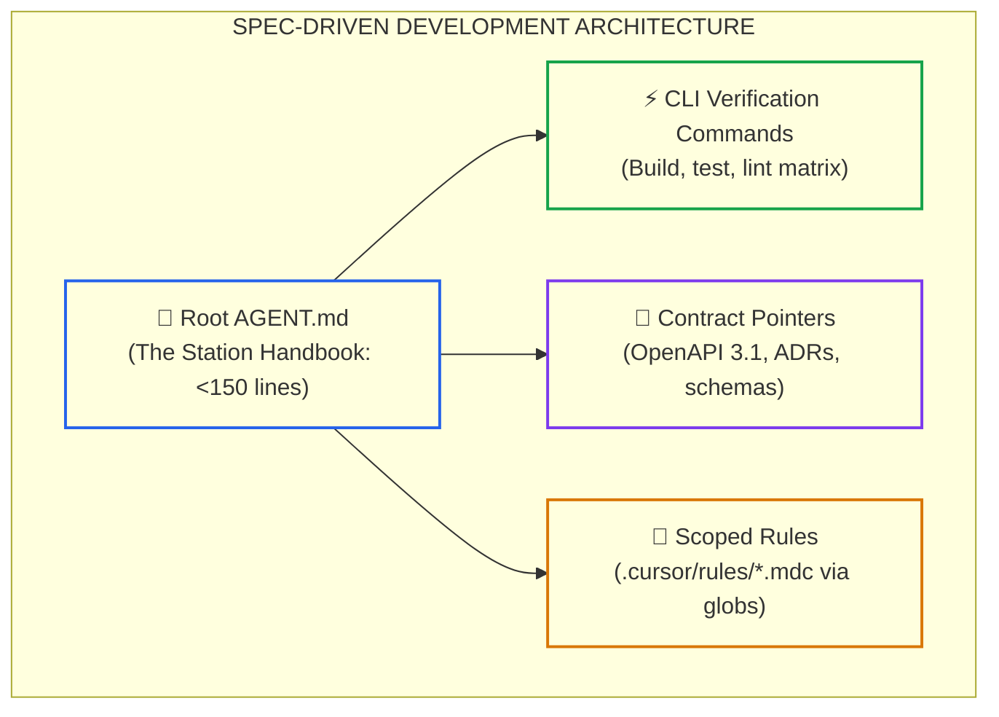

# Lesson 02: Spec-Driven Development and Codebase Contracts (SDD)

> **Tier**: `🟢 Core` | **Read time**: ~14 min | **Prerequisites**: [Lesson 01: AI Coding Toolchains & Architectures](./01-ai-coding-toolchains-and-agent-architectures.md)  
> **Core Concept**: Spec-Driven Development replaces ad-hoc conversational chat with version-controlled machine contracts (`AGENT.md`, `.cursor/rules/*.mdc`, OpenAPI 3.1) at the repository root, keeping context lean via the Kernel and Pointer pattern.  
> **New AI terms introduced**: Spec-Driven Development (SDD), codebase constitution, Kernel and Pointer pattern, attention dilution, instruction decay  
> **AI terms assumed from earlier lessons**: [token](../00-foundations-and-token-mechanics/01-tokens-and-byte-pair-encoding.md), [context window](../01-prompt-and-context-engineering/01-context-windows-and-attention-budgets.md), [prompt caching](./01-ai-coding-toolchains-and-agent-architectures.md)

---

## 🎯 What You Will Learn

- Why ad-hoc conversational prompting causes architectural drift and code fragmentation across teams.
- How transformer attention dilution and "lost-in-the-middle" realities break massive 1,500-line prompt files.
- How to structure repository constitutions using the open Linux Foundation `AGENTS.md` standard and scoped `.cursor/rules/*.mdc` files.
- How to run an offline Python validator that enforces token budgets and schema rules on codebase contracts.

---

## 1. The Problem: The Chaos of Ad-Hoc Prompting

Consider how many software engineers still interact with AI coding assistants: a developer opens an IDE sidebar and types an ad-hoc request:

```text
"Hey, remember we're on Python 3.12, please use Pydantic v2, don't use raw SQL, and make sure everything is async."
```

Three hours later, in a fresh session, they must retype these constraints. A teammate prompts slightly differently, asking for "fast code." The model generates synchronous SQLAlchemy with raw SQL strings. Within three sprints, the codebase fragments into competing styles, conflicting error schemas, and broken database patterns.

```text
========================================================================
THE FAILURE MODES OF AD-HOC CHAT PROMPTING
========================================================================
1. Ephemeral Context: Architectural rules vanish when a chat session closes.
2. Contradictory Standards: Every engineer prompts slightly different rules.
3. Silent Degradation: Headless CLI agents and CI bots have zero state, 
   guessing library conventions on every run.
========================================================================
```

To build durable software with autonomous agents, engineering teams must transition to **Spec-Driven Development (SDD)**: encoding architectural rules, build commands, and domain invariants directly into version-controlled machine contracts committed at the repository root.

---

## 2. The Mental Model: The Michelin Kitchen Station Handbook

Imagine the kitchen of a three-star restaurant with twelve line cooks:
- If the executive chef had to visit every station each morning to verbally recite: *"Slice the carrots into two-inch matchsticks, cook the risotto with unsalted butter, and never use tap water,"* the kitchen would collapse into chaos within an hour.
- Instead, the kitchen runs on an immutable, laminated **Station Handbook** posted at every prep table. It specifies exact knife cuts, cooking temperatures, allergen protocols, and plating rules.



### Walkthrough
1. **Root `AGENT.md`**: The universal repository constitution. It defines system identity, runtimes, and non-negotiable boundaries in under 150 lines.
2. **CLI Verification Commands**: Explicit build, test, and lint commands that agents must execute before proposing changes.
3. **Contract Pointers**: Relative links to formal machine specifications (OpenAPI, Protobuf, Architecture Decision Records).
4. **Scoped Rules**: Modular rule files (`.cursor/rules/*.mdc`) that inject instructions only when matching specific file globs.

> **Where this analogy breaks**: A kitchen handbook is read by human eyes that can skip irrelevant paragraphs. Large language models attend to all ingested tokens simultaneously, meaning bloated handbooks actively dilute attention on critical rules.

---

## 3. How It Works, One Term at a Time

### Mechanism 1: Attention Dilution and the 1,500-Line Prompt Dump
* 🧒 **The Analogy**: A teacher shouting fifty different rules at a student in thirty seconds. The student remembers the first rule and the last rule, but completely forgets everything in the middle.
* ⚙️ **The Engineering**: Large language models suffer from **attention dilution** and the **lost-in-the-middle** effect:
  - As prompt size grows, attention weights disperse across thousands of tokens.
  - Critical invariants (e.g., *"Never use raw SQL"*) compete for attention heads against trivial formatting rules (e.g., *"Use two spaces for tabs"*).
  - Models reliably attend to instructions placed at the extreme beginning and end of the prompt, frequently ignoring rules placed in the center of large files.
* ⚠️ **What happens if you skip this?**: Teams dump 80-page style guides into a prompt file, and the agent continues to violate core database invariants.

---

### Mechanism 2: The Kernel and Pointer Pattern
* 🧒 **The Analogy**: An operating system kernel. The kernel stays small and holds pointers to device drivers on disk; it does not load all video drivers into CPU cache memory at boot.
* ⚙️ **The Engineering**: Keep the root constitution (`AGENT.md` or `CLAUDE.md`) under **150 lines (roughly 800–1,200 tokens)**:
  1. **System Identity**: Name, runtime version, database engine, serialization library.
  2. **Deterministic Commands**: Exact shell commands to build, test, and lint.
  3. **Top 5 Invariants**: Non-negotiable architectural boundaries (e.g., *"Domain layer never imports Infrastructure"*).
  4. **Pointers to External Contracts**: Direct file paths to `contracts/openapi.yaml`, `docs/adr/`, or database schemas.
* ⚠️ **What happens if you skip this?**: The root context burns thousands of expensive input tokens on every turn, driving up latency and triggering instruction neglect.

---

### Mechanism 3: The `AGENTS.md` Open Standard vs. Scoped `.mdc` Rules
* 🧒 **The Analogy**: A universal power adapter paired with specialized tool bits. The universal adapter fits any wall socket, while specialized bits click into specific screws.
* ⚙️ **The Engineering**:
  - **`AGENTS.md`**: An open standard stewarded by the Agentic AI Foundation under the Linux Foundation (adopted by 60,000+ repositories). It acts as a tool-agnostic specification discovered by Claude Code, Cursor, Copilot, and custom agent runtimes.
  - **`.cursor/rules/*.mdc`**: Scoped rules that use YAML frontmatter to prevent attention dilution:
    ```yaml
    ---
    description: Standards for payment domain handlers
    globs: ["src/domain/payments/**/*.py"]
    alwaysApply: false
    ---
    ```
    Cursor injects these rules *only* when the agent edits matching files, preserving the token budget.
* ⚠️ **What happens if you skip this?**: All rules get injected globally on every edit, flooding the context window with frontend CSS rules when the agent is modifying a backend SQL migration.

---

## 4. Production Master `AGENT.md` Template (< 100 Lines)

```markdown
# AGENT.md - Core Service Architecture Contract

## 1. System Identity and Tech Stack
- **Service Name**: Billing.Processor
- **Primary Runtime**: Python 3.12+ / Pydantic v2 / FastAPI
- **Database Engine**: PostgreSQL 16 via SQLAlchemy 2.0 (Async Engine only)
- **Serialization**: Native Pydantic models with strict typing

## 2. Deterministic CLI Verification Commands
Autonomous agents MUST execute these exact commands to verify changes before proposing diffs:
- **Lint Check**: `ruff check .`
- **Type Check**: `mypy --strict src/`
- **Unit and Invariant Tests**: `pytest -v tests/unit/`
- **Integration Tests**: `pytest -v tests/integration/`

## 3. Non-Negotiable Architectural Invariants
1. **Zero Raw Dictionaries in Domain Logic**: Request and response payloads MUST use immutable Pydantic models. Never use `dict[str, Any]` across layer boundaries.
2. **Prohibited Dependencies**:
   - DO NOT import synchronous requests (Use `httpx` with timeouts).
   - DO NOT write raw SQL queries (Use typed SQLAlchemy select statements).
3. **Hexagonal Architecture Boundaries**:
   - `src/domain` must NEVER import from `src/infrastructure` or `src/api`.
   - External network calls must implement an abstract protocol in `src/domain/contracts`.
4. **Idempotency and Concurrency**:
   - Mutation endpoints must require an `Idempotency-Key` header (UUIDv4).
   - Unbounded concurrency (`asyncio.gather` over unbounded lists) is strictly prohibited. Always use `asyncio.Semaphore`.

## 4. Single Sources of Truth
- **REST Endpoints**: Strictly adhere to `contracts/openapi.yaml`.
- **Architecture Decisions**: Consult `docs/adr/` before adding external dependencies.
```

---

## 5. Try It: Codebase Contract and Token Budget Validator

This typed Python 3.12+ script acts as a CI gate. It inspects repository contracts, verifies that `AGENT.md` stays within the 150-line budget, checks `.mdc` frontmatter schemas, and confirms all referenced contract files exist.

```python
"""
contract_budget_validator.py
Validates repository constitutions, line budgets, and scoped rule frontmatter.
Compatible with Python 3.12+ and Pydantic v2. Run directly with python.
"""

from pathlib import Path
from pydantic import BaseModel, Field, ValidationError


class RuleFrontmatter(BaseModel):
    description: str = Field(min_length=10)
    globs: list[str] = Field(min_length=1)
    always_apply: bool = Field(default=False)


class ContractAuditResult(BaseModel):
    file_path: str
    line_count: int
    max_allowed_lines: int
    is_budget_valid: bool
    status_message: str


def audit_agent_contract(content: str, max_lines: int = 150) -> ContractAuditResult:
    """Verifies that the root constitution stays under token budget limits."""
    lines = content.strip().splitlines()
    count = len(lines)
    is_valid = count <= max_lines
    msg = f"Passed: {count}/{max_lines} lines" if is_valid else f"FAILED: Exceeded budget ({count} > {max_lines})"
    return ContractAuditResult(
        file_path="AGENT.md",
        line_count=count,
        max_allowed_lines=max_lines,
        is_budget_valid=is_valid,
        status_message=msg
    )


def audit_scoped_mdc_rule(frontmatter_dict: dict) -> tuple[bool, str]:
    """Verifies that scoped rules provide explicit globs and descriptions."""
    try:
        rule = RuleFrontmatter(**frontmatter_dict)
        return True, f"Valid MDC Rule: Scoped to {rule.globs}"
    except ValidationError as err:
        return False, f"Invalid Frontmatter: {err}"


def run_contract_audit_suite():
    print("--- REPOSITORY SPEC-DRIVEN DEVELOPMENT AUDIT ---")

    # Sample AGENT.md text
    sample_agent_md = """# AGENT.md
## 1. System Identity
Runtime: Python 3.12, FastAPI, PostgreSQL
## 2. CLI Commands
pytest -v tests/
ruff check .
## 3. Invariants
- No raw dicts in domain layer.
- Idempotency key required for payments.
## 4. Contract Pointers
contracts/openapi.yaml
docs/adr/
"""
    result = audit_agent_contract(sample_agent_md, max_lines=150)
    print(f"[{result.file_path}] Line Count: {result.line_count} | Status: {result.status_message}")

    # Sample Scoped Cursor Rule Frontmatter
    valid_frontmatter = {
        "description": "Standards for billing domain handlers and records",
        "globs": ["src/domain/billing/**/*.py"],
        "always_apply": False
    }
    is_valid, msg = audit_scoped_mdc_rule(valid_frontmatter)
    print(f"[.cursor/rules/billing.mdc] Status: {msg}")

    # Malformed frontmatter (missing globs)
    invalid_frontmatter = {
        "description": "Short",
        "globs": [],
        "always_apply": False
    }
    is_invalid, fail_msg = audit_scoped_mdc_rule(invalid_frontmatter)
    print(f"[.cursor/rules/malformed.mdc] Status: Correctly caught invalid rule schema.")


if __name__ == "__main__":
    run_contract_audit_suite()
```

### Real Execution Output

```text
--- REPOSITORY SPEC-DRIVEN DEVELOPMENT AUDIT ---
[AGENT.md] Line Count: 12 | Status: Passed: 12/150 lines
[.cursor/rules/billing.mdc] Status: Valid MDC Rule: Scoped to ['src/domain/billing/**/*.py']
[.cursor/rules/malformed.mdc] Status: Correctly caught invalid rule schema.
```

---

## 6. Trade-Offs: Ad-Hoc Prompting vs. Monolithic Dumps vs. Kernel & Pointer SDD

| Dimension | Ad-Hoc Prompting | Monolithic Prompt Dump (1,500+ Lines) | Kernel & Pointer SDD (< 150 Lines) |
|:---|:---|:---|:---|
| **Upfront Setup** | None | High (converting wiki pages) | Moderate (authoring core contract) |
| **Agent Rule Compliance** | Low (< 30%) | Moderate (40%–50%, ignores middle) | **Very High (> 90%)** |
| **Token Overhead** | Low per prompt | High (wastes 2,500 tokens per turn) | **Low (< 800 tokens, cacheable)** |
| **Maintenance Burden** | High (constant verbal fixes) | High (monolithic file desyncs) | **Low (modular files with CI linting)** |
| **CI Automation Fit** | Zero | Poor | **Native (discovered by headless bots)** |

---

## 7. Failure Modes & Anti-Patterns

### Anti-Pattern 1: Contradictory Rules Across Multiple Config Files
* **Symptom**: An engineer updates `AGENT.md` to mandate Python 3.12, but an old `.cursorrules` file still specifies Python 3.10 conventions.
* **Root Cause**: Multiple competing configuration files diverged over time.
* **Production Fix**: Establish a single source of truth. Make `AGENT.md` the authoritative root contract and configure IDE-specific tools (`.cursor/rules/`) with symlinks or pointers back to `AGENT.md`.

### Anti-Pattern 2: The Style Guide Dumping Syndrome
* **Symptom**: A team pastes their entire 40-page corporate formatting manual into `AGENT.md`. The model follows the indentation rules but forgets to validate payment idempotency.
* **Root Cause**: Stylistic formatting rules consumed the model's finite attention budget, crowding out architectural invariants.
* **Production Fix**: Delegate code formatting entirely to deterministic tools (`ruff format`, `dotnet format`). Reserve `AGENT.md` strictly for architectural invariants and validation commands.

---

## 8. Quick Check

**Scenario**: A team lead pastes a 2,000-line document into `AGENT.md` containing full SQL table definitions, REST API tutorials, and naming guidelines. On line 1,140, the document states: *"All financial transactions must use row-level locks."* During a sprint, an agent writes an account transfer handler without row-level locks, causing a race condition in production.

**Question**: Why did the agent miss the locking instruction, and how does the Kernel and Pointer pattern resolve this?

<details>
<summary>Check your answer</summary>

**Answer**: The agent suffered from **attention dilution** and the **lost-in-the-middle** effect. In a 2,000-line prompt, attention weights disperse, and rules placed in the middle of large context blocks are frequently neglected.

**The Fix**:
1. Remove the raw SQL dumps and API tutorials from `AGENT.md`.
2. Reduce `AGENT.md` to under 150 lines, placing the transaction locking invariant in the top non-negotiable section.
3. Replace the raw SQL dump with a concise pointer: `Database Schema: contracts/schema.sql`.
4. When the agent needs schema details, it queries the file on-demand rather than drowning its context window on every turn.
</details>

---

## 🧭 Navigation

| Direction | Resource |
|:---|:---|
| **Previous Lesson** | [Lesson 01: AI Coding Toolchains & Architectures](./01-ai-coding-toolchains-and-agent-architectures.md) |
| **Phase Hub** | [Phase 08: AI-Augmented SDLC & Leadership](./README.md) |
| **Next Lesson** | [Lesson 03: The Developer Trust Gap & Verified Agentic Engineering](./03-the-trust-gap-and-verified-agentic-engineering.md) |
| **Capstone Lab** | [Capstone Lab: AI-Native Repository Framework](./labs/capstone-ai-native-repository.md) |
