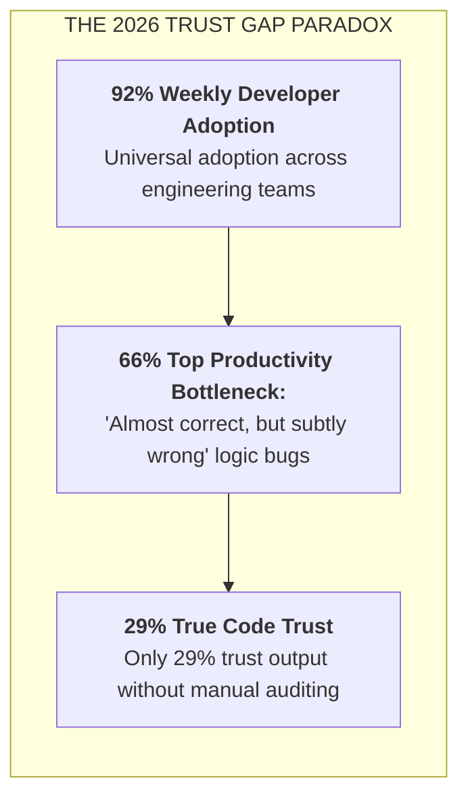
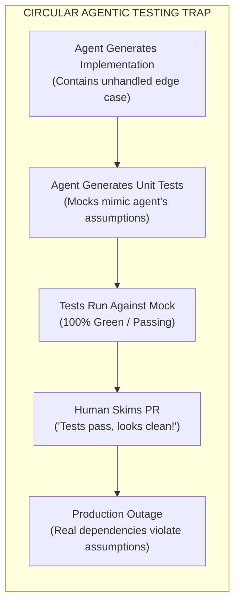
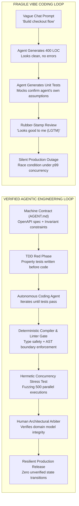

# The Developer Trust Gap: Invariant Verification, Property Testing & Concurrency Bounds

| Depth Tier | Recommended Audience | Estimated Completion Time | Key Prerequisites |
|---|---|---|---|
| `🟢 HIGH ROI / CORE` | Senior Engineers, Tech Leads, Architects | ~25 minutes | Lesson 02 (Spec-Driven Development) |

> **Core Concept**: Overcoming the paradox of high developer AI adoption (92%) and low code trust (29%) by replacing superficial "vibe coding" with deterministic invariant harnesses, property-based fuzzing, and bounded concurrency controls.

---

## 1. The Architectural Problem

Look across enterprise engineering organizations in late 2026: virtually every software engineer—over **92% of developers**—uses an AI coding assistant on a weekly basis. Cursor is open, Claude Code is active in terminals, and Copilot is autocompleting.

Yet when surveyed about the accuracy and reliability of this generated code, **only 29% of developers trust it without manual auditing**, down from 40% in 2024. Over 46% actively distrust AI-generated code.

This massive divergence is **The Trust Gap**:



### The Bottleneck: "Almost Correct, But Subtly Wrong"
When a traditional compiler or interpreter encounters a syntax error or a null dereference, it fails loudly and immediately (Fail-Fast). The developer diagnoses and fixes it within seconds.

Probabilistic coding agents introduce an entirely different, highly dangerous failure mode: **code that is syntactically pristine, beautifully formatted, adheres to linting rules, passes its own superficial unit tests, but is subtly, catastrophically wrong**.
- **66% of software engineers** report that detecting and debugging these subtle semantic bugs is their primary productivity sink.
- These bugs slip past standard peer reviews because human reviewers suffer from *cognitive complacency*: when code looks elegant and has green unit tests, reviewers naturally drop their guard.

---

## 2. Why Naive Approaches Fail: The Mock-Driven Testing Trap

When developers ask an AI agent to write both implementation code and unit tests simultaneously, a dangerous circular dependency occurs:



When an agent generates unit tests for its own code, it naturally constructs test fixtures and mocks that mirror the exact faulty assumptions it made during implementation. If the agent forgot to handle database lock timeouts, its unit tests will mock the database as instantaneously successful. The test suite passes with 100% coverage while hiding critical production failure modes.

---

## 3. The Core Mental Model: The Savant Intern & The Iron Man Suit

To establish the right engineering mindset, architects must internalize two complementary mental models:

### 1. The Savant Intern
Imagine you hire a 16-year-old savant intern. They have memorized every computer science textbook ever printed. They can type 250 words per minute without blinking.
- **The Vibe Coding Trap**: You ask the intern: *"Build a high-throughput bank account transfer service."* In 15 seconds, they hand you 200 lines of gorgeous, idiomatic C# code. You skim it, see async methods, and ship it to production. At midnight, two concurrent transfers hit the account simultaneously. The intern never worked on a real banking system, so they didn't implement atomic database locks or idempotency keys. Money vanishes into thin air.

### 2. Karpathy's Iron Man Suit
Andrej Karpathy reframed the true role of AI in engineering: **We are not building an autopilot where the pilot sleeps in the passenger cabin; we are stepping into Tony Stark's Iron Man suit.**
- The suit amplifies your physical strength a hundredfold (supersonic code generation, instant multi-file refactoring, autonomous test generation).
- But **you are the pilot inside the helmet**. You set the flight trajectory, dictate the tactical invariants, and monitor the heads-up display (HUD). You do not fire a single repulsor blast until your deterministic onboard computers confirm the target locks.



### Visual Walkthrough of the Loops
1. **The Vibe Coding Path**: Reliance on vague prompts and uninspected code leads directly to rubber-stamped PRs and unhandled production edge cases.
2. **The Verified Path**: Invariant specifications are defined first. Property tests and concurrency limits constrain the agent before code is generated. Deterministic gates verify the output before human architectural sign-off.

---

## 4. Production War Story: The 2:14 AM Concurrency Cascade

> *It is 2:14 AM on a Sunday. PagerDuty sounds a SEV-1 alert: `SubscriptionRenewalService` has locked up, PostgreSQL connection pool exhaustion is logging `53300: too_many_connections`, and the billing service is timing out at the p99 threshold (45,000ms).*
>
> *The on-call tech lead inspects git blame. Commit `4b88fa` was merged on Friday afternoon with the title: 'AI modernization of renewal batch worker using async parallelism.'*
>
> *The PR author used an agentic assistant. The agent generated the following routine:*

```csharp
// THE SUBTLE TIMEBOMB GENERATED BY THE AGENT:
public async Task ProcessRenewalsAsync(List<SubscriptionId> pendingIds)
{
    // The agent's idea of 'high performance': spawn unbounded concurrent tasks!
    var tasks = pendingIds.Select(async id =>
    {
        // BUG 1: Creating a brand-new DI scope and DB connection for every single item
        using var scope = _serviceProvider.CreateScope();
        var db = scope.ServiceProvider.GetRequiredService<BillingDbContext>();
        
        var sub = await db.Subscriptions.FindAsync(id);
        if (sub != null && !sub.IsProcessed)
        {
            // BUG 2: Non-atomic check-then-act without row-level lock (SELECT FOR UPDATE)
            sub.IsProcessed = true;
            await db.SaveChangesAsync();
            await _paymentGateway.ChargeCustomerAsync(sub.CustomerId, sub.Amount);
        }
    });

    await Task.WhenAll(tasks);
}
```

### The Catastrophic Failure Sequence
1. At 2:00 AM, the cron job triggered for 18,000 scheduled renewals. The code spawned 18,000 unbounded concurrent tasks in 40 milliseconds, completely exhausting the database pool of 200 connections.
2. Because the agent wrote unit tests using an in-memory database mock with only 3 test items, the mock connection pool never saturated.
3. Even worse: because `sub.IsProcessed` was not guarded by a database transaction or distributed lock, network retries from the payment gateway resulted in **1,120 customers being charged twice**.
4. The remediation required rolling back the commit, issuing $142,000 in customer refunds, and establishing an invariant rule in `AGENT.md` forbidding unbounded concurrency over database contexts.

---

## 5. Comparison: Vibe Coding vs. Verified Agentic Engineering

| Dimension | Vibe Coding (Fragile) | Verified Agentic Engineering (Resilient) |
|:---|:---|:---|
| **Core Philosophy** | "If it compiles and tests pass, ship it." | "Code is guilty until proven innocent by deterministic invariants." |
| **Primary Artifact** | Conversational chat prompts in IDE window. | Version-controlled machine contracts (`AGENT.md`, OpenAPI, Protobuf). |
| **Testing Approach** | Agent writes unit tests testing its own hallucinations. | Human/Spec-first invariant, property-based, and concurrency tests. |
| **Execution Loop** | Unbounded trial-and-error until error disappears. | Closed ReAct loop with compiler, linter, and AST feedback gates. |
| **Failure Detection** | Discovered in staging or 2:00 AM production alerts. | Caught in local hermetic test harness before PR creation. |
| **Human Role** | Typist who prompts and blindly nods at diffs. | Pilot in the Iron Man suit: System Architect & Verification Arbiter. |
| **Code Longevity** | High churn; rewritten every 3 months due to debt. | Stable, maintainable, aligned with long-term architecture. |

---

## 6. Production Verification Harness Implementations

### Python: Contract Invariant Fuzzing with Pydantic v2 & Hypothesis

This harness uses property-based testing (`Hypothesis`) to fuzz the agent's implementation across hundreds of randomized edge cases, preventing subtle boundary bugs:

```python
"""
test_payment_invariants.py
Property-based invariant testing verifying domain rules against agent-generated code.
Compatible with Python 3.12+ and Pydantic v2.
"""

from decimal import Decimal
from uuid import UUID, uuid4
import pytest
from hypothesis import given, strategies as st
from pydantic import BaseModel, Field, field_validator


# 1. Machine-Readable Domain Specification (The Contract)
class PaymentTransferCommand(BaseModel):
    transaction_id: UUID
    source_account_id: UUID
    target_account_id: UUID
    amount: Decimal = Field(gt=Decimal("0.00"), max_digits=12, decimal_places=2)
    idempotency_key: str = Field(min_length=16, max_length=64)

    @field_validator("target_account_id")
    @classmethod
    def prevent_self_transfer(cls, v: UUID, info) -> UUID:
        if "source_account_id" in info.data and v == info.data["source_account_id"]:
            raise ValueError("Invariant violation: Source and target accounts cannot be identical.")
        return v


# 2. Hypothesis Property Test: Stress-testing invariant rules against agent output
@given(
    amount=st.decimals(min_value=Decimal("0.01"), max_value=Decimal("1000000.00"), places=2),
    idempotency_key=st.text(min_size=16, max_size=64, alphabet=st.characters(blacklist_categories=("Cs",)))
)
def test_transfer_invariants_hold_across_domain_boundaries(amount: Decimal, idempotency_key: str):
    source_id = uuid4()
    target_id = uuid4()

    # Invariant 1: Valid transfers must instantiate cleanly
    cmd = PaymentTransferCommand(
        transaction_id=uuid4(),
        source_account_id=source_id,
        target_account_id=target_id,
        amount=amount,
        idempotency_key=idempotency_key
    )
    assert cmd.amount > Decimal("0.00")
    assert cmd.source_account_id != cmd.target_account_id


def test_transfer_invariant_rejects_circular_transfer():
    same_id = uuid4()
    # Invariant 2: Circular transfers MUST raise a validation error
    with pytest.raises(ValueError, match="Source and target accounts cannot be identical"):
        PaymentTransferCommand(
            transaction_id=uuid4(),
            source_account_id=same_id,
            target_account_id=same_id,
            amount=Decimal("50.00"),
            idempotency_key="unique-idemp-key-12345"
        )
```

---

### C# (.NET 9): Bounded Concurrency Invariant Gate

This test proves that parallel execution cannot exceed database connection bounds, neutralizing the exact bug from our war story:

```csharp
// tests/BillingService.Tests/RenewalConcurrencyInvariantTests.cs
using System.Collections.Concurrent;
using FluentAssertions;
using Xunit;

namespace BillingService.Tests;

public class RenewalConcurrencyInvariantTests
{
    private const int MaxAllowedConcurrentDbConnections = 10;

    [Fact]
    public async Task ProcessRenewalsAsync_UnderHighLoad_NeverExceedsConnectionPoolThreshold()
    {
        // Arrange: 100 concurrent renewals to process
        var subscriptionIds = Enumerable.Range(1, 100).Select(_ => Guid.NewGuid()).ToList();
        var activeConnectionGauge = new ConcurrentGauge();
        var peakConcurrentConnections = 0;

        // Bounded worker implementation using native .NET 9 Parallel.ForEachAsync
        var worker = new BoundedRenewalWorker(
            maxConcurrency: MaxAllowedConcurrentDbConnections,
            onDbAccess: async () =>
            {
                var current = activeConnectionGauge.Increment();
                lock (subscriptionIds)
                {
                    if (current > peakConcurrentConnections) peakConcurrentConnections = current;
                }
                await Task.Delay(10); // Simulate database I/O latency
                activeConnectionGauge.Decrement();
            });

        // Act: Process all 100 subscriptions
        await worker.ProcessBatchAsync(subscriptionIds, CancellationToken.None);

        // Assert: Invariant MUST hold - peak connections never exceeded pool limit
        peakConcurrentConnections.Should().BeLessThanOrEqualTo(MaxAllowedConcurrentDbConnections,
            "Bounded worker invariant violated: connection pool saturation could cause production outage!");
    }
}

// Production Bounded Worker Implementation
public class BoundedRenewalWorker(int maxConcurrency, Func<Task> onDbAccess)
{
    public async Task ProcessBatchAsync(IEnumerable<Guid> items, CancellationToken ct)
    {
        // Native .NET 9 asynchronous throttling: ParallelOptions handles throttling without manual semaphores
        await Parallel.ForEachAsync(items, new ParallelOptions
        {
            MaxDegreeOfParallelism = maxConcurrency,
            CancellationToken = ct
        }, async (id, token) =>
        {
            await onDbAccess();
        });
    }
}

public class ConcurrentGauge
{
    private int _count;
    public int Increment() => Interlocked.Increment(ref _count);
    public int Decrement() => Interlocked.Decrement(ref _count);
}
```

---

## 7. Trade-offs & Telemetry

| Invariant Verification Strategy | CPU & Runtime Overhead | Developer Ergonomics | Defect Detection Rate |
|---|---|---|---|
| **Simple Unit Mocks** | Sub-millisecond (very fast) | Familiar to developers | Low (misses 70% of concurrency/boundary bugs) |
| **Property Fuzzing (Hypothesis)** | 200–500ms per test run | Requires specifying input generators | **High (catches 95% of numerical and string boundary bugs)** |
| **Concurrency Invariant Tests** | 1–3s per suite | Requires thread-safe counters | **Critical (neutralizes connection pool stampedes)** |

---

## 8. Production Failure Modes & Anti-Patterns

### Anti-Pattern: Testing Implementation Details Instead of Invariants
- **The Failure**: Unit tests asserting that private helper method `_calculateFee()` was called exactly once with specific mock arguments.
- **The Consequence**: When an agent refactors the class to optimize execution, all mock assertions shatter, even though business behavior is identical.
- **The Remediation**: Assert strictly against public contracts, domain invariants, and database state transitions. Treat internal implementation details as private.

---

## 🧭 Navigation

| Role | Target Resource |
|---|---|
| **Previous Lesson** | [Lesson 02: Spec-Driven Development & Codebase Contracts](./02-spec-driven-development-and-codebase-contracts.md) |
| **Phase Overview** | [Phase 08 Hub: AI-Augmented SDLC & Leadership](./README.md) |
| **Next Lesson** | [Lesson 04: Designing AI-Friendly Codebases](./04-architecting-ai-friendly-codebases.md) |
| **Hands-On Capstone** | [Capstone Lab: AI-Native Repository Framework](./labs/capstone-ai-native-repository.md) |
