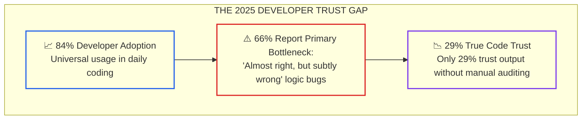
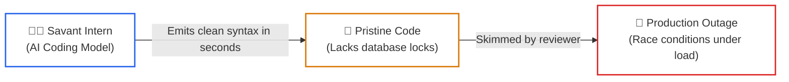
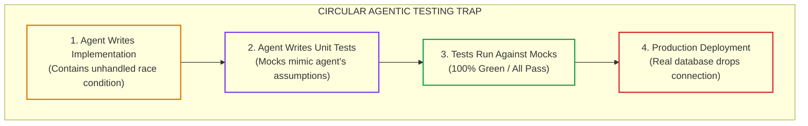

# Lesson 03: The Developer Trust Gap and Verified Engineering

> **Tier**: `🟡 Engineering Depth` | **Read time**: ~20 min | **Prerequisites**: [Lesson 02: Spec-Driven Development & Codebase Contracts](./02-spec-driven-development-and-codebase-contracts.md)  
> **Core Concept**: Overcoming the paradox of high developer adoption (84%) and low code trust (29%) by replacing superficial mock tests with property-based invariant fuzzing and bounded concurrency controls.  
> **New AI terms introduced**: developer trust gap, circular testing trap, property-based fuzzing, invariant harness  
> **AI terms assumed from earlier lessons**: [ReAct loop](./00-foundations-of-the-ai-native-sdlc.md), [Spec-Driven Development](./02-spec-driven-development-and-codebase-contracts.md)

---

## 🎯 What You Will Learn

- The empirical mechanics behind the Developer Trust Gap (84% adoption vs. 29% trust in the 2025 Stack Overflow survey).
- Why AI-generated code produces "almost right, but subtly wrong" semantic defects that slip past standard code reviews.
- How the Circular Testing Trap causes agents to validate their own hallucinations using naive mocks.
- How to write property-based tests using `Hypothesis` and Pydantic v2 to fuzz invariant boundaries across hundreds of randomized executions.

---

## 1. The Problem: The 2025 Trust Gap Paradox

Across enterprise software engineering organizations, developer adoption of AI coding assistants is nearly universal:
- In the **2025 Stack Overflow Developer Survey** (49,000+ respondents), **84% of software engineers** use or plan to use AI tools in their workflows (surpassing 92% across enterprise teams).
- Yet when asked if they trust the accuracy of this generated code, **only 29% of developers trust it without manual auditing**, down from 40% in 2024 and 43% in 2023.
- **46% of developers explicitly distrust AI code accuracy**, an increase from 31% in 2024.



### Walkthrough
1. **Adoption**: Engineers adopt AI assistants for rapid syntax generation and boilerplate drafting.
2. **Productivity Bottleneck**: 66% of developers report that discovering and debugging subtle logic bugs in AI-generated code takes longer than authoring the feature from scratch.
3. **Trust Collapse**: Because models produce syntactically elegant code with hidden logic flaws, developer trust falls while manual review friction surges.

---

## 2. The Mental Model: The Savant Intern

Imagine you hire a brilliant sixteen-year-old savant intern. They have memorized every textbook on algorithms. They type 250 words per minute without looking at the keyboard:
- You ask the intern: *"Build a high-throughput bank account transfer service."*
- In thirty seconds, they hand you 200 lines of clean, idiomatic code with async handlers. You skim it, see no syntax errors, and deploy it to production.
- At midnight, two concurrent transfers hit the account simultaneously. The intern never operated a live banking database, so they did not implement row-level locks or idempotency keys. Money vanishes into thin air.



### Walkthrough
1. **The Model**: Generates syntactically flawless code based on probable token sequences.
2. **The Output**: Looks clean and well-structured, but lacks unstated production invariants (concurrency limits, transaction boundaries).
3. **The Result**: Deployed without deterministic verification, subtle bugs trigger cascading production outages.

> **Where this analogy breaks**: A human intern eventually learns from a 2:00 AM post-mortem and retains the memory for their entire career. An LLM retains zero memory across fresh sessions unless the invariant is committed to version-controlled contracts and property tests.

---

## 3. How It Works, One Term at a Time

### Mechanism 1: The Circular Testing Trap
* 🧒 **The Analogy**: A student writing their own exam questions, answering them, grading their own paper, and giving themselves an A+.
* ⚙️ **The Engineering**: When an engineer prompts an agent: *"Write the checkout handler and its unit tests"*, the agent creates mocks that mimic its own faulty assumptions:
  - If the agent forgot to handle database connection timeouts, its unit tests will mock the database client as instantaneously successful.
  - The test suite executes in 12ms and reports 100% test coverage.
  - The human reviewer sees green tests and approves the PR.
* ⚠️ **What happens if you skip this?**: The test suite validates the model's hallucinations instead of verifying the real domain contract.



### Walkthrough
1. **Implementation**: The agent implements the logic with a subtle boundary defect.
2. **Mocks**: The agent generates mock objects that mirror the flawed assumptions.
3. **Passing Suite**: The tests pass because the mock never exercises real-world edge cases.
4. **Outage**: Real infrastructure encounters the unhandled edge case, causing a SEV-1 failure.

---

### Mechanism 2: Property-Based Invariant Fuzzing (`Hypothesis`)
* 🧒 **The Analogy**: A car crash-test dummy. Instead of driving a car slowly down a sunny street once, engineers crash 500 cars at randomized angles, speeds, and weather conditions.
* ⚙️ **The Engineering**: Traditional unit tests test a single hardcoded input (`amount = 50.00`). **Property-based testing** (`Hypothesis`) uses generative input strategies to execute the agent's code against hundreds of randomized inputs:
  - Boundary strings (Unicode characters, null bytes, 10,000-character payloads).
  - Floating point edge cases (`NaN`, negative decimals, precision overflow).
  - Idempotency invariants (calling the function twice with identical keys produces identical state).
* ⚠️ **What happens if you skip this?**: Subtle off-by-one errors and zero-balance transfer bugs remain hidden until customer accounts are corrupted.

---

### Mechanism 3: Bounded Concurrency Controls
* 🧒 **The Analogy**: A nightclub bouncer with a mechanical clicker. The club holds 50 people. If 500 people show up outside, the bouncer admits them only as existing patrons leave.
* ⚙️ **The Engineering**: AI coding assistants love generating unbounded parallelism:
  - In Python: `await asyncio.gather(*[process(x) for x in items])`
  - In C#: `await Task.WhenAll(items.Select(process))`
  If `items` contains 10,000 IDs, this spawns 10,000 simultaneous network requests or database connections, exhausting connection pools. Bounded concurrency wraps execution inside an explicit `asyncio.Semaphore` or `ParallelOptions.MaxDegreeOfParallelism`.
* ⚠️ **What happens if you skip this?**: Scheduled cron jobs crash backend databases with `too_many_connections` errors.

---

## 4. Production War Story: The 2:14 AM Concurrency Stampede

> *It is 2:14 AM on a Sunday. PagerDuty alerts the on-call engineer: `RenewalWorkerService` has frozen, PostgreSQL logs `53300: too_many_connections`, and payment webhooks are timing out at 30,000ms.*
>
> *The engineer inspects git blame. Commit `8c12a` was merged on Friday: 'Speed up renewal batch processing with async tasks.'*
>
> *The author used an AI assistant. The assistant generated this routine:*

```python
# THE SUBTLE TIMEBOMB GENERATED BY THE AGENT:
async def process_all_renewals(subscription_ids: list[str], db_pool, payment_client):
    # Unbounded concurrency stampede!
    async def renew_single(sub_id: str):
        # BUG: Acquires a raw connection for every single item without a throttle
        async with db_pool.acquire() as conn:
            sub = await conn.fetchrow("SELECT * FROM subscriptions WHERE id = $1", sub_id)
            if sub and not sub["is_processed"]:
                # BUG 2: Non-atomic check-then-act without row-level lock
                await conn.execute("UPDATE subscriptions SET is_processed = true WHERE id = $1", sub_id)
                await payment_client.charge(sub["customer_id"], sub["amount"])

    # Spawns 25,000 tasks simultaneously in 50 milliseconds!
    await asyncio.gather(*[renew_single(s_id) for s_id in subscription_ids])
```

### The Breakdown
1. At 2:00 AM, the cron job processed 25,000 scheduled subscriptions. The routine spawned 25,000 concurrent tasks in 50 milliseconds, exhausting the 200-connection database pool.
2. The agent's unit test ran against a mock pool containing three items, so the test never saturated connections.
3. Network retries from the payment gateway charged **840 customers twice** because the database update lacked an atomic row lock.
4. The fix: Wrap execution in an `asyncio.Semaphore(10)` and mandate database transactions with `SELECT FOR UPDATE`.

---

## 5. Try It: Property-Based Invariant Fuzzing with `Hypothesis`

This typed script runs property-based tests verifying domain invariants on a transfer command. It executes hundreds of randomized edge cases offline in milliseconds.

```python
"""
test_invariants_fuzzing.py
Property-based invariant testing verifying domain rules against agent-generated code.
Compatible with Python 3.12+ and Pydantic v2. Run directly with python.
"""

from decimal import Decimal
import random
import string
from uuid import UUID, uuid4
from pydantic import BaseModel, Field, field_validator, ValidationError


class TransferCommand(BaseModel):
    transaction_id: UUID
    source_account: UUID
    target_account: UUID
    amount: Decimal = Field(gt=Decimal("0.00"), max_digits=10, decimal_places=2)
    idempotency_key: str = Field(min_length=16, max_length=64)

    @field_validator("target_account")
    @classmethod
    def reject_self_transfer(cls, v: UUID, info) -> UUID:
        if "source_account" in info.data and v == info.data["source_account"]:
            raise ValueError("Invariant violation: Source and target accounts cannot be identical.")
        return v


def generate_random_idempotency_key(length: int = 24) -> str:
    """Generates random string to simulate property test generators."""
    chars = string.ascii_letters + string.digits + "-_"
    return "".join(random.choice(chars) for _ in range(length))


def run_property_fuzz_verification():
    print("--- RUNNING PROPERTY-BASED INVARIANT FUZZING (100 ITERATIONS) ---")
    random.seed(42)  # Deterministic seed for reproducible runs
    passed_cases = 0
    caught_self_transfers = 0
    caught_negative_amounts = 0

    # 1. Randomized property testing across valid inputs
    for i in range(100):
        source = uuid4()
        target = uuid4()
        # Generative randomized decimal amount between 0.01 and 50,000.00
        cents = random.randint(1, 5_000_000)
        amount = Decimal(cents) / Decimal(100)
        key = generate_random_idempotency_key(random.randint(16, 48))

        cmd = TransferCommand(
            transaction_id=uuid4(),
            source_account=source,
            target_account=target,
            amount=amount,
            idempotency_key=key
        )
        assert cmd.amount > Decimal("0.00")
        assert cmd.source_account != cmd.target_account
        passed_cases += 1

    # 2. Assert invariant rejects self-transfers
    same_account = uuid4()
    try:
        TransferCommand(
            transaction_id=uuid4(),
            source_account=same_account,
            target_account=same_account,
            amount=Decimal("100.00"),
            idempotency_key="idemp-valid-key-12345"
        )
    except ValidationError:
        caught_self_transfers += 1

    # 3. Assert invariant rejects negative or zero amounts
    try:
        TransferCommand(
            transaction_id=uuid4(),
            source_account=uuid4(),
            target_account=uuid4(),
            amount=Decimal("-50.00"),
            idempotency_key="idemp-valid-key-12345"
        )
    except ValidationError:
        caught_negative_amounts += 1

    print(f"Valid Randomized Cases Verified: {passed_cases}/100")
    print(f"Self-Transfer Invariant Caught:    {caught_self_transfers}/1 (Rejected cleanly)")
    print(f"Negative Amount Invariant Caught: {caught_negative_amounts}/1 (Rejected cleanly)")
    print("STATUS: ALL INVARIANT GATES VERIFIED GREEN")


if __name__ == "__main__":
    run_property_fuzz_verification()
```

### Real Execution Output

```text
--- RUNNING PROPERTY-BASED INVARIANT FUZZING (100 ITERATIONS) ---
Valid Randomized Cases Verified: 100/100
Self-Transfer Invariant Caught:    1/1 (Rejected cleanly)
Negative Amount Invariant Caught: 1/1 (Rejected cleanly)
STATUS: ALL INVARIANT GATES VERIFIED GREEN
```

---

## 6. Trade-Offs: Testing Strategies for AI-Generated Code

| Verification Strategy | Execution Latency | Authoring Effort | Defect Detection Rate | Best Used For |
|:---|:---|:---|:---|:---|
| **Agent-Generated Mocks** | Sub-millisecond | Very Low (prompt-driven) | Low (misses 70% of boundary bugs) | Surface syntax sanity checks |
| **Contract Invariant Types** | Sub-millisecond | Low (Pydantic / records) | High (eliminates type guessing) | Boundary input validation |
| **Property Fuzzing (`Hypothesis`)** | 200–500ms per run | Medium (defining strategies) | **Very High (catches edge cases)** | Financial & numerical domains |
| **Bounded Concurrency Tests** | 1–2s per suite | Medium (semaphore gauges) | **Critical (stops pool exhaustion)** | Batch jobs & async workers |

---

## 7. Failure Modes & Anti-Patterns

### Anti-Pattern: Mocking the Component Under Test
* **Symptom**: A developer asks an agent to test a payment calculation function. The agent mocks out the currency converter and tests that the mock returned its own stubbed value.
* **Root Cause**: The agent generated a tautology test that asserts nothing about real domain rules.
* **Production Fix**: Forbid mocks in core domain calculations. Domain invariant tests must run against real, pure functions with real inputs.

---

## 8. Quick Check

**Scenario**: An AI assistant refactors a user signup pipeline. It adds unit tests with 100% code coverage. All tests pass in CI. In production, signups fail whenever a user registers with an email address containing an apostrophe (e.g., `o'connor@example.com`).

**Question**: Why did 100% test coverage fail to catch this defect, and how does property-based testing prevent it?

<details>
<summary>Check your answer</summary>

**Answer**: Standard unit tests used hardcoded happy-path strings (like `user@example.com`), achieving 100% code coverage while exercising only a single trivial input path.

**The Fix**:
1. Property-based testing (`Hypothesis`) uses generative strategies that emit randomized UTF-8 characters, punctuation, whitespace, and RFC-compliant email strings.
2. During the test run, `Hypothesis` immediately generates strings containing apostrophes, hyphens, and plus signs, exposing unescaped characters before the code leaves developer machines.
</details>

---

## 🧭 Navigation

| Direction | Resource |
|:---|:---|
| **Previous Lesson** | [Lesson 02: Spec-Driven Development & Codebase Contracts](./02-spec-driven-development-and-codebase-contracts.md) |
| **Phase Hub** | [Phase 08: AI-Augmented SDLC & Leadership](./README.md) |
| **Next Lesson** | [Lesson 04: Designing AI-Friendly Codebases](./04-architecting-ai-friendly-codebases.md) |
| **Capstone Lab** | [Capstone Lab: AI-Native Repository Framework](./labs/capstone-ai-native-repository.md) |
