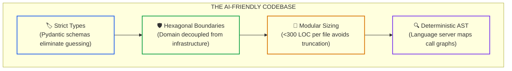
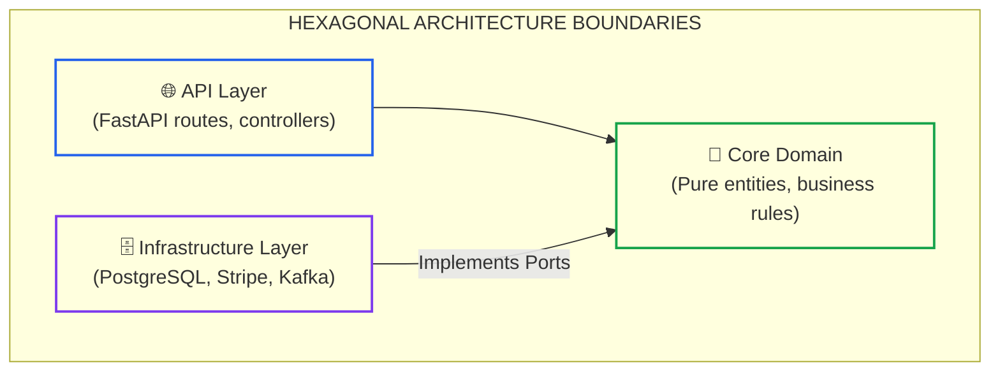

# Lesson 04: Designing AI-Friendly Codebases and Strict Typing

> **Tier**: `🟡 Engineering Depth` | **Read time**: ~18 min | **Prerequisites**: [Lesson 02: Spec-Driven Development & Codebase Contracts](./02-spec-driven-development-and-codebase-contracts.md)  
> **Core Concept**: Structuring software systems for machine comprehension through strict static typing, hexagonal ports and adapters, modular file budgets (<300 lines), and deterministic Abstract Syntax Tree (AST) boundary validation.  
> **New AI terms introduced**: machine comprehension, symbol tree, AST grep, hexagonal boundary  
> **AI terms assumed from earlier lessons**: [context window](../01-prompt-and-context-engineering/01-context-windows-and-attention-budgets.md), [Merkle AST indexing](./01-ai-coding-toolchains-and-agent-architectures.md), [Spec-Driven Development](./02-spec-driven-development-and-codebase-contracts.md)

---

## 🎯 What You Will Learn

- Why loosely typed dictionaries and monolithic God classes trigger catastrophic agent hallucinations.
- How hexagonal architecture (ports and adapters) isolates domain rules from changing external SDKs.
- Why restricting source files to under 300 lines optimizes transformer attention and prevents file edit truncation.
- How to run an offline Python AST validator that detects layer boundary violations before pull request merge.

---

## 1. The Problem: Codebases Written for Humans vs. Machines

Traditional enterprise codebases are written by humans for humans. Over years of development, teams accumulate implicit tribal knowledge and loose typing shortcuts:
- Passing loose dictionary bags (`dict[str, Any]`) across service boundaries.
- Allowing domain entities to directly instantiate database contexts or invoke external HTTP clients.
- Building monolithic classes spanning 1,500+ lines with sprawling inheritance trees.

```text
========================================================================
WHY AGENTS BREAK IN CLUTTERED CODEBASES
========================================================================
1. Dynamic Dictionary Guessing: The model guesses payload keys (e.g., 
   `payload['tax_rate']` instead of `payload['taxRatePercent']`), 
   causing runtime KeyError crashes.
2. Circular Coupling: Domain handlers directly import ORM models, causing 
   the agent to break compilation during refactorings.
3. Attention Truncation: 1,500-line files exceed optimal attention spans, 
   causing agents to truncate diffs or drop existing methods.
========================================================================
```

Human developers navigate messy codebases through memory and informal peer chats. Autonomous coding agents have none of this implicit context. To maximize agent velocity without compromising quality, architects must intentionally design systems for **machine comprehension**.

---

## 2. The Mental Model: The Cluttered Attic vs. The Engineered Workshop

Imagine asking a robotic vacuum to clean a room:
- **The Cluttered Attic (Legacy Monolith)**: The floor has scattered boxes, unlabeled bins, tangled cords, and fragile antiques. The robot gets stuck every three minutes, knocks over furniture, and requires constant human intervention.
- **The Engineered Workshop (AI-Friendly Architecture)**: Tools hang on clearly labeled pegboards. Cables run through overhead channels. Floor zones have distinct perimeter markings. The robot maps the perimeter, sweeps the entire area autonomously, and docks cleanly.



### Walkthrough
1. **Strict Types**: Eliminates guessing. The model reads exact field names and types.
2. **Hexagonal Boundaries**: Protects core business rules behind abstract interfaces.
3. **Modular Sizing**: Keeps file diffs small enough to fit inside clean attention spans.
4. **Deterministic AST**: Allows tools to inspect symbol hierarchies without hallucinating signatures.

> **Where this analogy breaks**: A robotic vacuum cleans physical dust indiscriminately. An AI coding agent operates on abstract semantic dependencies, meaning a clean file layout with circular type imports still shatters the compiler.

---

## 3. How It Works, One Term at a Time

### Mechanism 1: Strict Static Typing vs. Untyped Dictionaries
* 🧒 **The Analogy**: A tailored suit vs. a sack of mismatched clothes. The tailored suit has exact measurements; the sack requires you to dig through everything to find a sleeve.
* ⚙️ **The Engineering**: In dynamic code without type annotations, an agent must predict keys based on surrounding variable names. If an external API uses camelCase and the database uses snake_case, the agent will inevitably produce subtle mismatches. Strict typing (Pydantic v2, Python dataclasses, TypeScript interfaces) provides explicit contracts:
  - Every property access is validated at compilation or import time.
  - The model's attention heads lock onto explicit field definitions rather than inferring shapes from comments.
* ⚠️ **What happens if you skip this?**: The agent guesses dictionary keys, and the service crashes in production with `KeyError: 'user_id'`.

---

### Mechanism 2: Hexagonal Architecture (Ports and Adapters)
* 🧒 **The Analogy**: An electrical wall socket. The room's wiring (domain logic) does not care whether you plug in a lamp, a laptop, or a toaster (infrastructure adapters).
* ⚙️ **The Engineering**: Hexagonal architecture enforces strict directional boundaries:
  - **Core Domain**: Contains business entities and pure calculations. Has zero external dependencies.
  - **Ports (Contracts)**: Abstract interfaces defined in the domain layer (`PaymentGatewayProtocol`, `UserRepositoryProtocol`).
  - **Adapters (Infrastructure)**: Concrete implementations (Stripe client, PostgreSQL repository).
  When an agent implements a new payment provider, it edits only the adapter layer without touching core business invariants.
* ⚠️ **What happens if you skip this?**: The agent embeds Stripe API calls directly inside domain order calculations, coupling your business logic to third-party vendor SDKs.



### Walkthrough
1. **API Layer**: Receives external requests and calls domain handlers.
2. **Core Domain**: The isolated center containing domain models and abstract protocols. Never imports from outer layers.
3. **Infrastructure Layer**: Implements domain protocols using concrete external databases or third-party SDKs.

---

### Mechanism 3: Modular File Sizing (< 300 Lines)
* 🧒 **The Analogy**: A binder of single-page recipe cards vs. an unwieldy 500-page encyclopedia glued together.
* ⚙️ **The Engineering**: Large language models perform surgical diffs best when file context spans between 100 and 300 lines (roughly 800–2,500 tokens):
  - When editing a 2,000-line file, tool execution frequently truncates lines or misses methods placed near the bottom.
  - Small, single-responsibility files allow agents to ingest the entire file, reason over every symbol, and emit a complete replacement without diff misalignment.
* ⚠️ **What happens if you skip this?**: CLI edit tools truncate methods during multi-chunk file rewrites, silently corrupting adjacent classes.

---

## 4. Try It: Offline AST Architectural Boundary Validator

This typed Python 3.12+ script parses Python Abstract Syntax Trees (AST) using the standard `ast` module. It enforces hexagonal boundaries: it verifies that files under `src/domain/` never import from `src/infrastructure/` or `src/api/`, and enforces a 300-line file budget.

```python
"""
ast_boundary_validator.py
Inspects Python AST import trees and file line budgets to enforce hexagonal boundaries.
Compatible with Python 3.12+ and Pydantic v2. Run directly with python.
"""

import ast
from pydantic import BaseModel, Field


class FileValidationReport(BaseModel):
    filename: str
    line_count: int
    is_line_budget_valid: bool
    illegal_imports: list[str] = Field(default_factory=list)
    is_boundary_valid: bool


SAMPLE_DOMAIN_FILE_CLEAN = """
from decimal import Decimal
from uuid import UUID
from pydantic import BaseModel

class Account(BaseModel):
    account_id: UUID
    balance: Decimal
"""

SAMPLE_DOMAIN_FILE_VIOLATING = """
from decimal import Decimal
# ILLEGAL: Domain layer importing from infrastructure and external database!
from src.infrastructure.postgres_db import get_db_connection
from src.api.controllers import PaymentRequest

def transfer_funds(source_id: str, target_id: str):
    conn = get_db_connection()
    # Direct database manipulation inside domain logic
"""


def audit_python_code_boundaries(filename: str, source_code: str, max_lines: int = 300) -> FileValidationReport:
    """Parses source AST and validates hexagonal layer isolation rules."""
    lines = source_code.strip().splitlines()
    line_count = len(lines)
    is_budget_ok = line_count <= max_lines

    tree = ast.parse(source_code)
    illegal_imports = []

    # If file is in the domain layer, it cannot import infrastructure or api
    is_domain_file = "domain" in filename.lower()

    for node in ast.walk(tree):
        if isinstance(node, ast.Import):
            for alias in node.names:
                if is_domain_file and any(b in alias.name for b in ["infrastructure", "api"]):
                    illegal_imports.append(alias.name)
        elif isinstance(node, ast.ImportFrom):
            module_name = node.module or ""
            if is_domain_file and any(b in module_name for b in ["infrastructure", "api"]):
                illegal_imports.append(module_name)

    is_boundary_ok = len(illegal_imports) == 0

    return FileValidationReport(
        filename=filename,
        line_count=line_count,
        is_line_budget_valid=is_budget_ok,
        illegal_imports=illegal_imports,
        is_boundary_valid=is_boundary_ok
    )


def run_ast_boundary_audit():
    print("--- RUNNING AST ARCHITECTURAL BOUNDARY VALIDATOR ---")

    # Audit 1: Clean domain file
    report1 = audit_python_code_boundaries("src/domain/account.py", SAMPLE_DOMAIN_FILE_CLEAN)
    print(f"[{report1.filename}] Lines: {report1.line_count}/300 | Violations: {len(report1.illegal_imports)} | Status: PASSED")

    # Audit 2: Violating domain file
    report2 = audit_python_code_boundaries("src/domain/transfer_service.py", SAMPLE_DOMAIN_FILE_VIOLATING)
    print(f"[{report2.filename}] Lines: {report2.line_count}/300 | Violations: {report2.illegal_imports} | Status: BLOCKED")
    print("  -> Boundary Rule Enforced: Domain cannot reference Infrastructure or API layers.")


if __name__ == "__main__":
    run_ast_boundary_audit()
```

### Real Execution Output

```text
--- RUNNING AST ARCHITECTURAL BOUNDARY VALIDATOR ---
[src/domain/account.py] Lines: 7/300 | Violations: 0 | Status: PASSED
[src/domain/transfer_service.py] Lines: 8/300 | Violations: ['src.infrastructure.postgres_db', 'src.api.controllers'] | Status: BLOCKED
  -> Boundary Rule Enforced: Domain cannot reference Infrastructure or API layers.
```

---

## 5. Trade-Offs: Monolithic God Classes vs. Hexagonal Micro-Files

| Architectural Dimension | Monolithic God Classes (1,500+ LOC) | Hexagonal Micro-Files (<300 LOC) | Architect Decision Rule |
|:---|:---|:---|:---|
| **Agent Edit Success Rate** | Low (35%–50% due to diff truncation) | **High (>95% clean replacements)** | Mandate <300 lines for any file edited by AI. |
| **Initial File Count** | Low (fewer files to organize) | Higher (more files per feature) | Accept file count increase; use LSP symbol search. |
| **Refactoring Blast Radius** | High (touching one method breaks unrelated logic) | **Minimal (isolated adapter changes)** | Isolate third-party libraries into dedicated adapters. |
| **Symbol Navigation** | Manual scrolling and search | **Language Server AST graphs** | Ensure language server indices are active in CI. |

---

## 6. Failure Modes & Anti-Patterns

### Anti-Pattern 1: The "God Interface" Anti-Pattern
* **Symptom**: An architect creates an interface `IRepository` with 45 methods covering users, billing, orders, and audits.
* **Root Cause**: The team bundled unrelated domain concerns into a single interface.
* **Production Fix**: Apply the Interface Segregation Principle (ISP). Split large interfaces into focused contracts (`IUserReader`, `IBillingWriter`) under 5 methods each.

### Anti-Pattern 2: Dynamic Dictionaries Across Service Boundaries
* **Symptom**: An endpoint passes raw JSON dictionary payloads down through handlers and into database layers.
* **Root Cause**: Developers avoided authoring DTO classes to save manual typing time.
* **Production Fix**: Require strictly typed Pydantic models for all network requests, responses, and inter-service messages.

---

## 7. Quick Check

**Scenario**: An AI assistant is asked to add a webhook notification when an order ships. The assistant opens `OrderService.cs` (a 1,400-line domain handler) and directly imports `SendGrid.Client`, instantiating the HTTP client inside the `ShipOrder` method.

**Question**: Which architectural boundary rule did the assistant violate, and how should a senior architect restructure the task?

<details>
<summary>Check your answer</summary>

**Answer**: The assistant violated **Hexagonal Architecture Boundary Isolation** and the **Dependency Inversion Principle**. The domain service directly imported a concrete third-party infrastructure client (`SendGrid`).

**The Fix**:
1. Define an abstract notification protocol in the domain layer: `INotificationGateway` with a single method `send_shipping_notice(order: Order) -> None`.
2. Implement the SendGrid HTTP client in `src/infrastructure/adapters/sendgrid_adapter.py`.
3. Inject the interface into the domain service. This isolates domain rules from SendGrid SDK changes and allows offline unit testing with deterministic test doubles.
</details>

---

## 🧭 Navigation

| Direction | Resource |
|:---|:---|
| **Previous Lesson** | [Lesson 03: The Developer Trust Gap & Verified Engineering](./03-the-trust-gap-and-verified-agentic-engineering.md) |
| **Phase Hub** | [Phase 08: AI-Augmented SDLC & Leadership](./README.md) |
| **Next Lesson** | [Lesson 05: Headless CI/CD Review Bots & Automated Gates](./05-headless-ci-cd-agents-and-automated-review-gates.md) |
| **Capstone Lab** | [Capstone Lab: AI-Native Repository Framework](./labs/capstone-ai-native-repository.md) |
