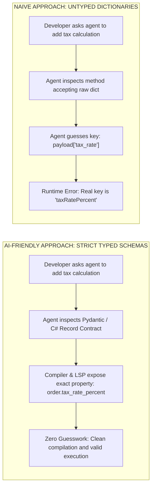
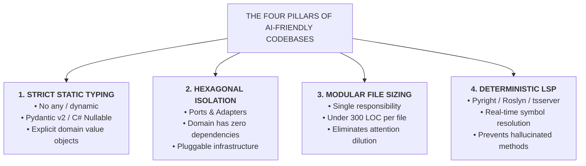
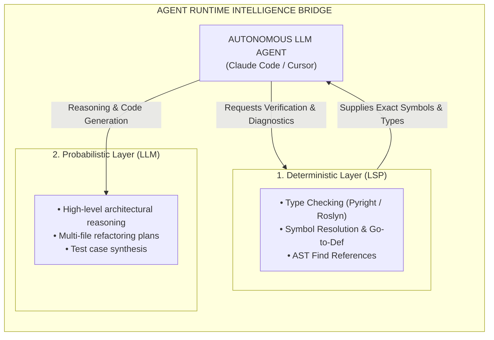

# Designing AI-Friendly Codebases: Strict Typing, Hexagonal Isolation & AST Semantics

| Depth Tier | Recommended Audience | Estimated Completion Time | Key Prerequisites |
|---|---|---|---|
| `🟡 IMPORTANT / NEXT` | Senior Engineers, Tech Leads, Architects | ~20 minutes | Lesson 02 (Spec-Driven Development) |

> **Core Concept**: Structuring software systems for machine comprehension through static typing, hexagonal architecture boundaries (ports and adapters), modular file sizing, and deterministic Language Server Protocol (LSP) intelligence.

---

## 1. The Architectural Problem

Traditional enterprise codebases are written by humans for humans. Over years of development, teams develop implicit assumptions, tribal knowledge, shortcuts, and loose typing patterns:
- Using dynamic dictionary bags (`Dictionary<string, object>` or `dict[str, Any]`) to pass context across layers.
- Allowing domain entities to directly instantiate database contexts or invoke external HTTP clients.
- Accumulating monolithic "God classes" spanning 1,500+ lines with complex internal inheritance hierarchies.

Human engineers navigate these codebases through intuition, historical memory, and informal peer discussions. Autonomous coding agents, however, possess none of this implicit context. When dropped into a loose, un-typed, or tightly coupled codebase, agents fail catastrophically:
- They guess the dictionary keys, causing runtime `KeyNotFoundException` or `KeyError` crashes.
- They generate code with cyclic dependency violations that fail compilation.
- They truncate file edits because 2,000-line classes exceed optimal attention context spans.

To maximize agentic velocity while preserving software quality, senior architects must intentionally design codebases for **machine comprehension**.

---

## 2. Why Naive Approaches Fail: The Dynamic Typing Trap

When agents encounter unannotated or loosely typed code, they must infer data structures through probabilistic token prediction:



In dynamically typed languages without type hints, every property access requires the agent to guess the schema based on surrounding variable names. If an external service returns camelCase and the database uses snake_case, the agent will inevitably produce subtle property mismatches that compile without error but crash in staging or production.

---

## 3. The Core Mental Model: The Clear Room vs. The Cluttered Attic

Imagine asking a robotic vacuum to clean a room:
- **The Cluttered Attic (Legacy Monolith)**: The floor is covered with scattered boxes, loose cords, unlabeled containers, and fragile antiques. The robot gets stuck every three minutes, knocks over furniture, and requires constant human intervention.
- **The Clear Room (AI-Friendly Architecture)**: The room has clearly labeled storage zones, elevated cables, defined walkways, and clean boundaries. The robot maps the perimeter, cleans the entire space autonomously, and docks itself without a single collision.

An AI-friendly codebase is an engineered space with clear boundaries, explicit types, and isolated dependencies that autonomous tools can map and navigate with mathematical precision.

---

## 4. Architecture & Mechanics: Principles of AI-Friendly Architecture



### 1. Strict Static Typing
Mandate strict typing across the entire tech stack:
- **Python**: Pydantic v2 with `mypy --strict`. Ban un-typed `dict` payloads across API boundaries.
- **C#**: `<Nullable>enable</Nullable>` and `<TreatWarningsAsErrors>true</TreatWarningsAsErrors>`. Ban `dynamic` and raw `Hashtable`.
- **TypeScript**: `strict: true` and `noImplicitAny: true`.

### 2. Hexagonal Architecture (Ports & Adapters)
Isolate domain logic completely from external concerns. When domain handlers depend solely on abstract interfaces (`IPaymentGateway`, `IOrderRepository`), an autonomous agent can:
- Generate complete, hermetic unit test suites in sub-second execution windows without starting database containers.
- Safely modify business rules without triggering unexpected side effects in persistence layers.

### 3. Modular File Sizing (< 300 Lines per File)
Attention mechanisms in transformer models degrade when processing giant files. Enforce the **300-Line Limit**:
- Break giant controllers into dedicated minimal API endpoints.
- Separate large domain models into discrete value objects and entity files.
- Keep test files focused on specific behavior suites.

### 4. Deterministic LSP vs. Probabilistic LLM Intelligence
Modern agentic environments bridge two distinct intelligence layers:



By querying the Language Server Protocol (LSP), the agent verifies whether a method or type exists *before* proposing code diffs, neutralizing hallucinated method names.

---

## 5. Enterprise Case Study: Legacy Modernization (.NET WCF to .NET 9 Minimal API)

A high-ROI use case for autonomous agents is modernizing legacy enterprise systems (e.g., migrating monolithic **.NET Framework 4.8 WCF** services to **.NET 9 Minimal APIs**).

### Before: Legacy .NET Framework 4.8 WCF Service Contract
```csharp
// Legacy WCF ServiceContract (System.ServiceModel, .NET Framework 4.8)
// Anti-patterns: Monolithic contract, implicit XML serialization, untyped fault contracts
[ServiceContract]
public interface IOrderService
{
    [OperationContract]
    [FaultContract(typeof(OrderFault))]
    OrderResponse PlaceOrder(OrderRequest request);
}

[DataContract]
public class OrderRequest
{
    [DataMember]
    public int CustomerId { get; set; }
    [DataMember]
    public decimal TotalAmount { get; set; }
}
```

### After: Modern .NET 9 Clean Architecture Minimal API (C# 13 & Native AOT)
```csharp
// Modern .NET 9 Minimal API Endpoint (C# 13, Native AOT-ready)
// Best practices: Immutable records, validation attributes, typed results, rate limiting
namespace OrderService.Endpoints;

using System.ComponentModel.DataAnnotations;
using Microsoft.AspNetCore.Http.HttpResults;

public record PlaceOrderRequest(
    Guid CustomerId,
    [property: Range(1, 10_000_000)] decimal TotalAmount,
    string Currency = "USD"
);

public record PlaceOrderResponse(
    Guid OrderId,
    string Status,
    DateTimeOffset CreatedAtUtc
);

public static class OrderEndpoints
{
    public static RouteGroupBuilder MapOrderEndpoints(this RouteGroupBuilder group)
    {
        group.MapPost("/", async Task<Results<Created<PlaceOrderResponse>, ProblemHttpResult>> (
            PlaceOrderRequest request,
            IOrderHandler handler,
            CancellationToken ct) =>
        {
            var result = await handler.HandleOrderAsync(request, ct);
            return result.Match(
                order => TypedResults.Created($"/api/v1/orders/{order.OrderId}", order),
                error => TypedResults.Problem(statusCode: (int)error.StatusCode, title: error.Message)
            );
        })
        .WithName("PlaceOrder")
        .WithOpenApi()
        .RequireRateLimiting("StrictFinancialLimit");

        return group;
    }
}
```

### Why Autonomous Agents Excel at This Migration
1. **Deterministic Syntax Translation**: The agent systematically converts WCF `[DataMember]` attributes into modern C# `record` properties.
2. **Layer Isolation**: The agent extracts business logic from bloated WCF code-behind classes into dedicated domain handlers implementing `IOrderHandler`.
3. **Compiler-Guided Refactoring**: The agent runs `dotnet build` in its local execution loop, fixing breaking type errors file-by-file until the entire solution compiles cleanly.

---

## 6. Trade-offs & Telemetry

| Architectural Choice | Human Developer Cost | AI Agent Velocity Impact | Maintenance Blast Radius |
|---|---|---|---|
| **Dynamic Types (`dict[str, Any]`)** | Fast initial typing | Very Low (frequent crashes & hallucinations) | High (bugs found in production) |
| **Strict Pydantic / C# Records** | Upfront schema definition | **Extremely High (> 3x faster delivery)** | **Minimal (compiler catches 95% of regressions)** |
| **Monolithic Files (1,500+ LOC)** | Familiar to legacy teams | Degrades severely due to context limits | High (git merge conflicts & hallucinated edits) |
| **Modular Files (< 300 LOC)** | Requires folder structure planning | **Optimal attention focus & surgical edits** | **Isolated (clear blast radius)** |

---

## 7. Production Failure Modes & Anti-Patterns

### Anti-Pattern: Ghost Architecture & Competing Dependencies
- **The Failure**: An autonomous agent introduces a competing third-party package to solve an isolated problem (e.g., adding `Newtonsoft.Json` when the project standard is `System.Text.Json`, or adding `axios` alongside native `fetch`).
- **The Consequence**: Container images bloat, security vulnerability surfaces expand, and developers waste time debugging conflicting serialization behaviors.
- **The Remediation**: Define an explicit package allowlist and denylist in `AGENT.md`; enforce automated CI linter checks blocking unauthorized dependencies.

---

## 🧭 Navigation

| Role | Target Resource |
|---|---|
| **Previous Lesson** | [Lesson 03: The Developer Trust Gap & Verified Engineering](./03-the-trust-gap-and-verified-agentic-engineering.md) |
| **Phase Overview** | [Phase 08 Hub: AI-Augmented SDLC & Leadership](./README.md) |
| **Next Lesson** | [Lesson 05: Headless CI/CD Review Bots & Automated Gates](./05-headless-ci-cd-agents-and-automated-review-gates.md) |
| **Hands-On Capstone** | [Capstone Lab: AI-Native Repository Framework](./labs/capstone-ai-native-repository.md) |
